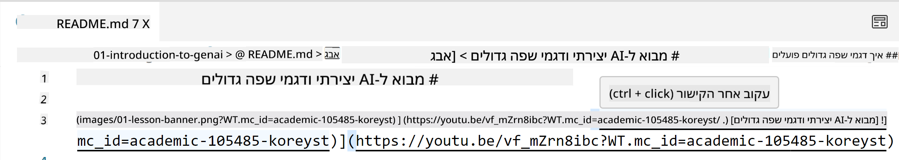
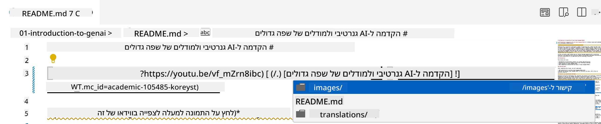
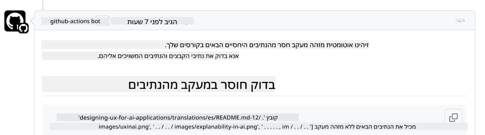
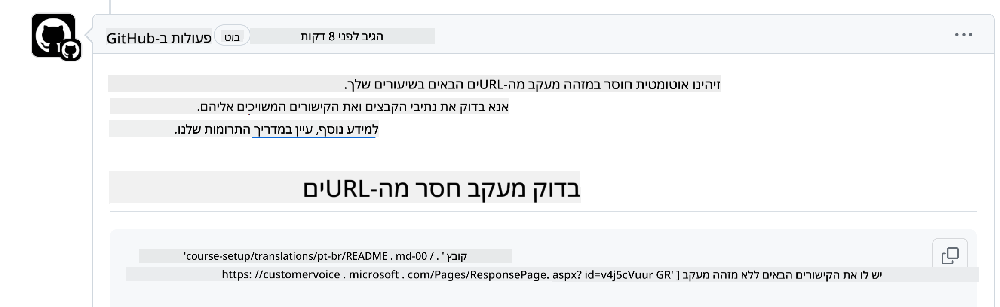
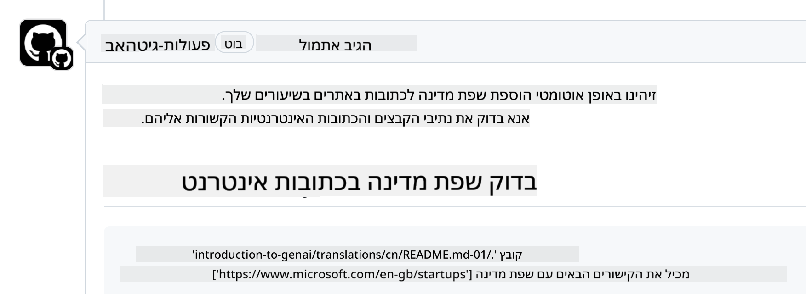

<!--
CO_OP_TRANSLATOR_METADATA:
{
  "original_hash": "57c41f2af71001a2cff9d8eb797cb843",
  "translation_date": "2025-05-19T11:20:05+00:00",
  "source_file": "CONTRIBUTING.md",
  "language_code": "he"
}
-->
# תרומה

פרויקט זה מקבל בברכה תרומות והצעות. רוב התרומות דורשות ממך להסכים להסכם רישוי תורם (CLA) שמצהיר שיש לך את הזכות, ובאמת מעניק לנו את הזכויות להשתמש בתרומתך. לפרטים, בקר ב-<https://cla.microsoft.com>.

> חשוב: בעת תרגום טקסט במאגר זה, אנא ודא שלא להשתמש בתרגום מכונה. אנו נאמת את התרגומים דרך הקהילה, אז אנא התנדב רק לשפות בהן אתה שולט.

כאשר אתה מגיש בקשת משיכה, CLA-bot יקבע באופן אוטומטי אם אתה צריך לספק CLA ויעצב את ה-PR בהתאם (למשל, תווית, תגובה). פשוט עקוב אחר ההוראות שסיפק הבוט. תצטרך לעשות זאת רק פעם אחת בכל המאגרי שמשתמשים ב-CLA שלנו.

## קוד התנהגות

פרויקט זה אימץ את [קוד ההתנהגות של קוד פתוח של מיקרוסופט](https://opensource.microsoft.com/codeofconduct/?WT.mc_id=academic-105485-koreyst). למידע נוסף קרא את [שאלות נפוצות על קוד התנהגות](https://opensource.microsoft.com/codeofconduct/faq/?WT.mc_id=academic-105485-koreyst) או פנה ל-[opencode@microsoft.com](mailto:opencode@microsoft.com) עם שאלות או תגובות נוספות.

## שאלה או בעיה?

אנא אל תפתח בעיות GitHub לשאלות תמיכה כלליות, שכן רשימת GitHub צריכה לשמש לבקשות תכונה ודיווחי באגים. כך נוכל לעקוב בקלות רבה יותר אחר בעיות או באגים אמיתיים מהקוד ולשמור את הדיון הכללי בנפרד מהקוד האמיתי.

## טעויות כתיב, בעיות, באגים ותרומות

בכל פעם שאתה מגיש שינויים למאגר Generative AI for Beginners, אנא עקוב אחר ההמלצות הללו.

* תמיד בצע fork למאגר לחשבונך לפני שתבצע את השינויים שלך
* אל תשלב מספר שינויים בבקשת משיכה אחת. לדוגמה, הגש תיקון באגים ועדכוני תיעוד באמצעות PRs נפרדים
* אם בקשת המשיכה שלך מראה קונפליקטים במיזוג, ודא לעדכן את main המקומי שלך כך שיהיה מראה של מה שנמצא במאגר הראשי לפני שתבצע את השינויים שלך
* אם אתה מגיש תרגום, אנא צור PR אחד לכל הקבצים המתורגמים מכיוון שאנחנו לא מקבלים תרגומים חלקיים לתוכן
* אם אתה מגיש תיקון שגיאת כתיב או תיעוד, תוכל לשלב שינויים ל-PR יחיד במקום מתאים

## הנחיות כלליות לכתיבה

- ודא שכל כתובות האתרים שלך עטופות בסוגריים מרובעים ואחריהם סוגריים ללא רווחים נוספים סביבם או בתוכם ``.
- ודא שכל קישור יחסי (כלומר קישורים לקבצים ותיקיות אחרות במאגר) מתחיל ב-`./` שמתייחס לקובץ או לתיקיה הממוקמים בספרייה הנוכחית או `../` שמתייחס לקובץ או לתיקיה הממוקמים בספריית הורה.
- ודא שכל קישור יחסי (כלומר קישורים לקבצים ותיקיות אחרות במאגר) יש לו מזהה מעקב (כלומר `?` או `&` ואז `wt.mc_id=` או `WT.mc_id=`) בסופו.
- ודא שכל כתובת אתר מהדומיינים הבאים _github.com, microsoft.com, visualstudio.com, aka.ms, ו-azure.com_ יש לה מזהה מעקב (כלומר `?` או `&` ואז `wt.mc_id=` או `WT.mc_id=`) בסופו.
- ודא שלקישורים שלך אין קוד שפה ספציפי למדינה בתוכם (כלומר `/en-us/` או `/en/`).
- ודא שכל התמונות מאוחסנות בתיקיית `./images`.
- ודא שלתמונות יש שמות תיאוריים באמצעות תווים באנגלית, מספרים ומקפים בשם התמונה שלך.

## תהליכי עבודה של GitHub

כאשר אתה מגיש בקשת משיכה, ארבעה תהליכי עבודה שונים יופעלו כדי לאמת את הכללים הקודמים. פשוט עקוב אחר ההוראות המפורטות כאן כדי לעבור את בדיקות תהליך העבודה.

- [בדוק נתיבים יחסיים שבורים](../..)
- [בדוק אם נתיבים כוללים מעקב](../..)
- [בדוק אם כתובות אתרים כוללות מעקב](../..)
- [בדוק אם כתובות אתרים לא כוללות קוד שפה](../..)

### בדוק נתיבים יחסיים שבורים

תהליך עבודה זה מבטיח שכל נתיב יחסי בקבצים שלך עובד. מאגר זה נפרס ל-GitHub Pages ולכן אתה צריך להיות מאוד זהיר כאשר אתה מקליד את הקישורים שמחברים הכל יחד כדי לא להפנות אף אחד למקום הלא נכון.

כדי לוודא שהקישורים שלך עובדים כראוי פשוט השתמש ב-VS code כדי לבדוק זאת.

לדוגמה, כאשר אתה מרחף מעל כל קישור בקבצים שלך תתבקש לעקוב אחר הקישור על ידי לחיצה על **ctrl + click**

אם תלחץ על קישור והוא לא עובד באופן מקומי, אז בוודאי זה יפעיל את תהליך העבודה ולא יעבוד על GitHub.

כדי לתקן את הבעיה הזו, נסה להקליד את הקישור בעזרת VS code.

כאשר אתה מקליד `./` או `../` VS code יבקש ממך לבחור מהאפשרויות הזמינות בהתאם למה שהקלדת.

עקוב אחר הנתיב על ידי לחיצה על הקובץ או התיקיה הרצויים ותהיה בטוח שהנתיב שלך לא שבור.

לאחר שתוסיף את הנתיב היחסי הנכון, שמור ודחף את השינויים שלך, תהליך העבודה יופעל שוב כדי לאמת את השינויים שלך. אם תעבור את הבדיקה אז אתה מוכן להמשיך.

### בדוק אם נתיבים כוללים מעקב

תהליך עבודה זה מבטיח שכל נתיב יחסי כולל מעקב בתוכו. מאגר זה נפרס ל-GitHub Pages ולכן אנחנו צריכים לעקוב אחר התנועה בין הקבצים והתיקיות השונים.

כדי לוודא שהנתיבים היחסיים שלך כוללים מעקב בתוכם פשוט בדוק את הטקסט הבא `?wt.mc_id=` בסוף הנתיב. אם הוא מצורף לנתיבים היחסיים שלך אז תעבור את הבדיקה הזו.

אם לא, ייתכן שתקבל את השגיאה הבאה.

כדי לתקן את הבעיה הזו, נסה לפתוח את הנתיב שהדגיש תהליך העבודה ולהוסיף את מזהה המעקב לסוף הנתיבים היחסיים.

לאחר שתוסיף את מזהה המעקב, שמור ודחף את השינויים שלך, תהליך העבודה יופעל שוב כדי לאמת את השינויים שלך. אם תעבור את הבדיקה אז אתה מוכן להמשיך.

### בדוק אם כתובות אתרים כוללות מעקב

תהליך עבודה זה מבטיח שכל כתובת אתר כוללת מעקב בתוכה. מאגר זה זמין לכולם ולכן אתה צריך לוודא לעקוב אחר הגישה כדי לדעת מאיפה מגיעה התנועה.

כדי לוודא שכתובות האתרים שלך כוללות מעקב בתוכן פשוט בדוק את הטקסט הבא `?wt.mc_id=` בסוף כתובת האתר. אם הוא מצורף לכתובות האתרים שלך אז תעבור את הבדיקה הזו.

אם לא, ייתכן שתקבל את השגיאה הבאה.

כדי לתקן את הבעיה הזו, נסה לפתוח את הנתיב שהדגיש תהליך העבודה ולהוסיף את מזהה המעקב לסוף כתובות האתרים.

לאחר שתוסיף את מזהה המעקב, שמור ודחף את השינויים שלך, תהליך העבודה יופעל שוב כדי לאמת את השינויים שלך. אם תעבור את הבדיקה אז אתה מוכן להמשיך.

### בדוק אם כתובות אתרים לא כוללות קוד שפה

תהליך עבודה זה מבטיח שכל כתובת אתר לא כוללת קוד שפה ספציפי למדינה בתוכה. מאגר זה זמין לכולם ברחבי העולם ולכן אתה צריך לוודא לא לכלול את קוד השפה של מדינתך בכתובות האתרים.

כדי לוודא שכתובות האתרים שלך לא כוללות קוד שפה בתוכן פשוט בדוק את הטקסט הבא `/en-us/` או `/en/` או כל קוד שפה אחר בכל מקום בכתובת האתר. אם הוא לא מופיע בכתובות האתרים שלך אז תעבור את הבדיקה הזו.

אם לא, ייתכן שתקבל את השגיאה הבאה.

כדי לתקן את הבעיה הזו, נסה לפתוח את הנתיב שהדגיש תהליך העבודה ולהסיר את קוד השפה של המדינה מכתובות האתרים.

לאחר שתסיר את קוד השפה של המדינה, שמור ודחף את השינויים שלך, תהליך העבודה יופעל שוב כדי לאמת את השינויים שלך. אם תעבור את הבדיקה אז אתה מוכן להמשיך.

מזל טוב! נחזור אליך בהקדם האפשרי עם משוב על התרומתך.

**כתב ויתור**:  
מסמך זה תורגם באמצעות שירות תרגום AI [Co-op Translator](https://github.com/Azure/co-op-translator). למרות שאנו שואפים לדיוק, יש לקחת בחשבון שתרגומים אוטומטיים עשויים להכיל שגיאות או אי דיוקים. המסמך המקורי בשפתו המקורית צריך להיחשב כמקור סמכותי. למידע קריטי, מומלץ להשתמש בתרגום אנושי מקצועי. איננו אחראים לאי הבנות או לפרשנויות שגויות הנובעות מהשימוש בתרגום זה.