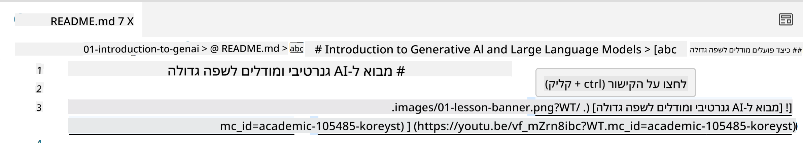
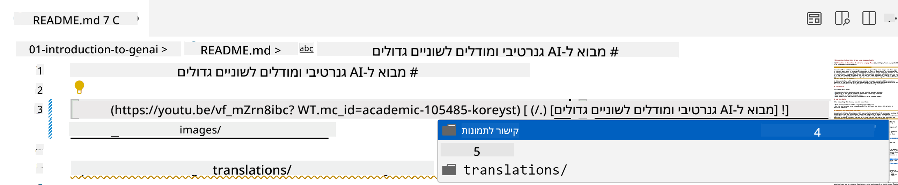
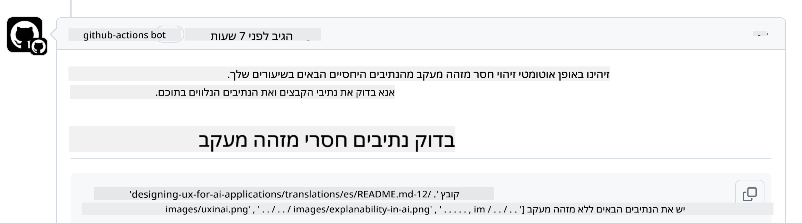
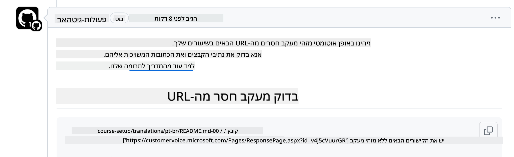
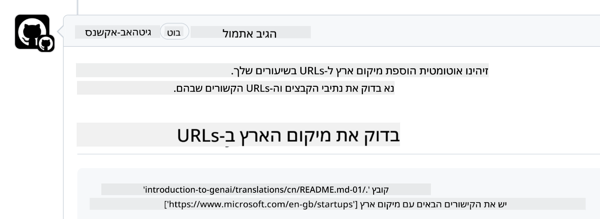

<!--
CO_OP_TRANSLATOR_METADATA:
{
  "original_hash": "57c41f2af71001a2cff9d8eb797cb843",
  "translation_date": "2025-06-25T07:14:32+00:00",
  "source_file": "CONTRIBUTING.md",
  "language_code": "he"
}
-->
# תרומה

הפרויקט הזה מקבל בברכה תרומות והצעות. רוב התרומות דורשות ממך להסכים להסכם רישיון תורם (CLA) המצהיר שיש לך את הזכות, ובאמת מעניק לנו את הזכויות להשתמש בתרומתך. לפרטים, בקר ב-<https://cla.microsoft.com>.

> חשוב: כאשר אתה מתרגם טקסט במאגר זה, אנא וודא שאינך משתמש בתרגום מכונה. אנו נוודא את התרגומים דרך הקהילה, לכן התנדב רק לתרגומים בשפות בהן אתה בקיא.

כאשר אתה מגיש בקשת משיכה, בוט ה-CLA ייקבע באופן אוטומטי האם עליך לספק CLA ולקשט את ה-PR בהתאם (למשל, תווית, תגובה). פשוט עקוב אחר ההוראות שסופקו על ידי הבוט. תצטרך לעשות זאת רק פעם אחת בכל המאגרים המשתמשים ב-CLA שלנו.

## קוד התנהגות

הפרויקט הזה אימץ את [קוד ההתנהגות של קוד פתוח של מיקרוסופט](https://opensource.microsoft.com/codeofconduct/?WT.mc_id=academic-105485-koreyst).
לפרטים נוספים קרא את [שאלות נפוצות על קוד התנהגות](https://opensource.microsoft.com/codeofconduct/faq/?WT.mc_id=academic-105485-koreyst) או צור קשר עם [opencode@microsoft.com](mailto:opencode@microsoft.com) עם שאלות או הערות נוספות.

## שאלה או בעיה?

אנא אל תפתח בעיות בגיטאב עבור שאלות תמיכה כלליות שכן רשימת הגיטאב צריכה לשמש לבקשות תכונות ודיווחי באגים. כך נוכל לעקוב בקלות אחר בעיות או באגים בפועל מהקוד ולשמור את הדיון הכללי בנפרד מהקוד בפועל.

## שגיאות כתיב, בעיות, באגים ותרומות

בכל פעם שאתה מגיש שינויים למאגר Generative AI for Beginners, אנא עקוב אחר ההמלצות הללו.

* תמיד פצל את המאגר לחשבון שלך לפני שאתה מבצע את השינויים שלך
* אל תשלב מספר שינויים בבקשת משיכה אחת. לדוגמה, הגש כל תיקון באג ועדכוני תיעוד באמצעות PRs נפרדים
* אם בקשת המשיכה שלך מציגה קונפליקטים במיזוג, וודא לעדכן את ה-main המקומי שלך כך שיהיה תמונת מראה של מה שנמצא במאגר הראשי לפני ביצוע השינויים שלך
* אם אתה מגיש תרגום, אנא צור PR אחד עבור כל הקבצים המתורגמים שכן איננו מקבלים תרגומים חלקיים עבור התוכן
* אם אתה מגיש תיקון שגיאת כתיב או תיעוד, אתה יכול לשלב שינויים ל-PR אחד כאשר זה מתאים

## הנחיות כלליות לכתיבה

- ודא שכל ה-URLs שלך מוקפים בסוגריים מרובעים ואחריהם סוגריים רגילים ללא רווחים נוספים סביבם או בתוכם ``.
- ודא שכל קישור יחסי (כלומר, קישורים לקבצים ותיקיות אחרות במאגר) מתחיל ב-`./` המתייחס לקובץ או תיקייה שנמצאים בספריית העבודה הנוכחית או `../` המתייחס לקובץ או תיקייה שנמצאים בספריית עבודה הורה.
- ודא שכל קישור יחסי (כלומר, קישורים לקבצים ותיקיות אחרות במאגר) מכיל מזהה מעקב (כלומר `?` או `&` ואז `wt.mc_id=` או `WT.mc_id=`) בסופו.
- ודא שכל URL מהדומיינים הבאים _github.com, microsoft.com, visualstudio.com, aka.ms, ו-azure.com_ מכיל מזהה מעקב (כלומר `?` או `&` ואז `wt.mc_id=` או `WT.mc_id=`) בסופו.
- ודא שהקישורים שלך לא כוללים מיקום ספציפי למדינה (כלומר `/en-us/` או `/en/`).
- ודא שכל התמונות מאוחסנות בתיקיית `./images`.
- ודא שלתמונות יש שמות תיאוריים באמצעות תווים באנגלית, מספרים ומקפים בשם התמונה שלך.

## תהליכי עבודה בגיטאב

כאשר אתה מגיש בקשת משיכה, ארבעה תהליכי עבודה שונים יופעלו כדי לאמת את הכללים הקודמים.
פשוט עקוב אחר ההוראות המפורטות כאן כדי לעבור את הבדיקות של תהליך העבודה.

- [בדוק נתיבים יחסיים שבורים](../..)
- [בדוק שלנתיבים יש מעקב](../..)
- [בדוק של-URLs יש מעקב](../..)
- [בדוק של-URLs אין מיקום](../..)

### בדוק נתיבים יחסיים שבורים

תהליך עבודה זה מבטיח שכל נתיב יחסי בקבצים שלך פועל.
מאגר זה נפרס לדפי GitHub, לכן עליך להיות זהיר מאוד בעת הקלדת הקישורים שמחברים הכל יחד כדי לא להפנות אף אחד למקום הלא נכון.

כדי לוודא שהקישורים שלך פועלים כראוי, פשוט השתמש ב-VS code כדי לבדוק זאת.

לדוגמה, כאשר אתה מרחף מעל כל קישור בקבצים שלך תתבקש לעקוב אחרי הקישור על ידי לחיצה על **ctrl + click**

אם תלחץ על קישור והוא לא פועל מקומית אז, בוודאי הוא יפעיל את תהליך העבודה ולא יפעל על GitHub.

כדי לתקן בעיה זו, נסה להקליד את הקישור בעזרת VS code.

כאשר אתה מקליד `./` או `../` VS code יציע לך לבחור מתוך האפשרויות הזמינות בהתאם למה שהקלדת.

עקוב אחר הנתיב על ידי לחיצה על הקובץ או התיקייה הרצויים ותהיה בטוח שהנתיב שלך לא שבור.

ברגע שתוסיף את הנתיב היחסי הנכון, שמור ודחוף את השינויים שלך, תהליך העבודה יופעל שוב כדי לאמת את השינויים שלך.
אם תעבור את הבדיקה אז אתה יכול להמשיך.

### בדוק שלנתיבים יש מעקב

תהליך עבודה זה מבטיח שלכל נתיב יחסי יש מעקב.
מאגר זה נפרס לדפי GitHub, ולכן עלינו לעקוב אחר התנועה בין הקבצים והתיקיות השונות.

כדי לוודא שלנתיבים היחסיים שלך יש מעקב, פשוט בדוק את הטקסט הבא `?wt.mc_id=` בסוף הנתיב.
אם הוא מצורף לנתיבים היחסיים שלך, תעבור את הבדיקה הזו.

אם לא, ייתכן שתקבל את השגיאה הבאה.

כדי לתקן בעיה זו, נסה לפתוח את נתיב הקובץ שתהליך העבודה הדגיש והוסף את מזהה המעקב לסוף הנתיבים היחסיים.

ברגע שתוסיף את מזהה המעקב, שמור ודחוף את השינויים שלך, תהליך העבודה יופעל שוב כדי לאמת את השינויים שלך.
אם תעבור את הבדיקה אז אתה יכול להמשיך.

### בדוק של-URLs יש מעקב

תהליך עבודה זה מבטיח שלכל כתובת אינטרנט יש מעקב.
מאגר זה זמין לכולם ולכן עליך לוודא לעקוב אחר הגישה כדי לדעת מאיפה מגיעה התנועה.

כדי לוודא שלכתובות ה-URLs שלך יש מעקב, פשוט בדוק את הטקסט הבא `?wt.mc_id=` בסוף ה-URL.
אם הוא מצורף ל-URLs שלך, תעבור את הבדיקה הזו.

אם לא, ייתכן שתקבל את השגיאה הבאה.

כדי לתקן בעיה זו, נסה לפתוח את נתיב הקובץ שתהליך העבודה הדגיש והוסף את מזהה המעקב לסוף ה-URLs.

ברגע שתוסיף את מזהה המעקב, שמור ודחוף את השינויים שלך, תהליך העבודה יופעל שוב כדי לאמת את השינויים שלך.
אם תעבור את הבדיקה אז אתה יכול להמשיך.

### בדוק של-URLs אין מיקום

תהליך עבודה זה מבטיח שלכל כתובת אינטרנט אין מיקום ספציפי למדינה.
מאגר זה זמין לכולם ברחבי העולם ולכן עליך לוודא לא לכלול את המיקום של המדינה שלך ב-URLs.

כדי לוודא שלכתובות ה-URLs שלך אין מיקום מדינה פשוט בדוק את הטקסט הבא `/en-us/` או `/en/` או כל מיקום שפה אחר בכל מקום ב-URL.
אם הוא לא קיים ב-URLs שלך, תעבור את הבדיקה הזו.

אם לא, ייתכן שתקבל את השגיאה הבאה.

כדי לתקן בעיה זו, נסה לפתוח את נתיב הקובץ שתהליך העבודה הדגיש והסר את מיקום המדינה מה-URLs.

ברגע שתסיר את מיקום המדינה, שמור ודחוף את השינויים שלך, תהליך העבודה יופעל שוב כדי לאמת את השינויים שלך.
אם תעבור את הבדיקה אז אתה יכול להמשיך.

ברכות! נחזור אליך בהקדם האפשרי עם משוב על התרומה שלך.

**כתב ויתור**:  
מסמך זה תורגם באמצעות שירות תרגום AI [Co-op Translator](https://github.com/Azure/co-op-translator). למרות שאנו שואפים לדיוק, יש להיות מודעים לכך שתרגומים אוטומטיים עשויים להכיל שגיאות או אי-דיוקים. יש לראות במסמך המקורי בשפתו המקורית כמקור סמכותי. למידע קריטי, מומלץ להשתמש בתרגום מקצועי אנושי. איננו נושאים באחריות לכל אי הבנות או פרשנויות שגויות הנובעות משימוש בתרגום זה.