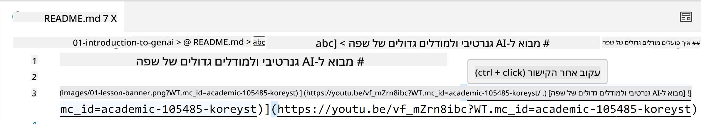
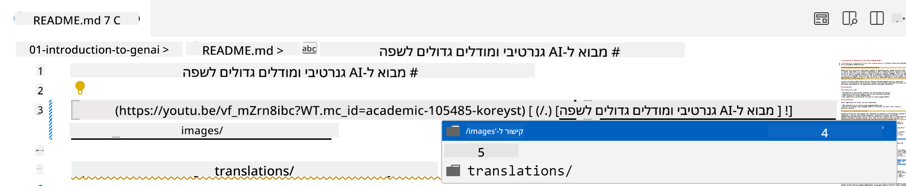
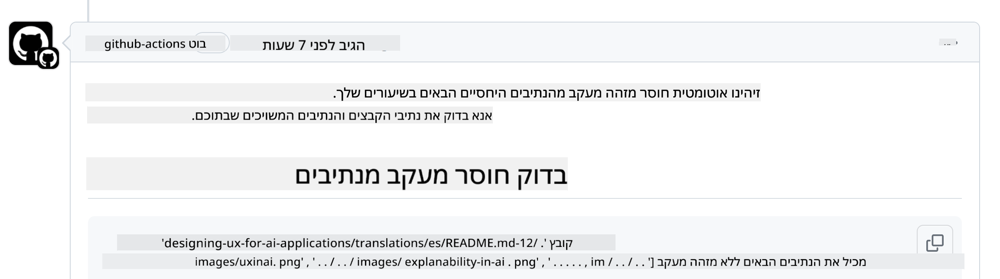
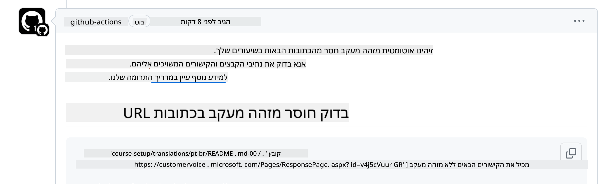
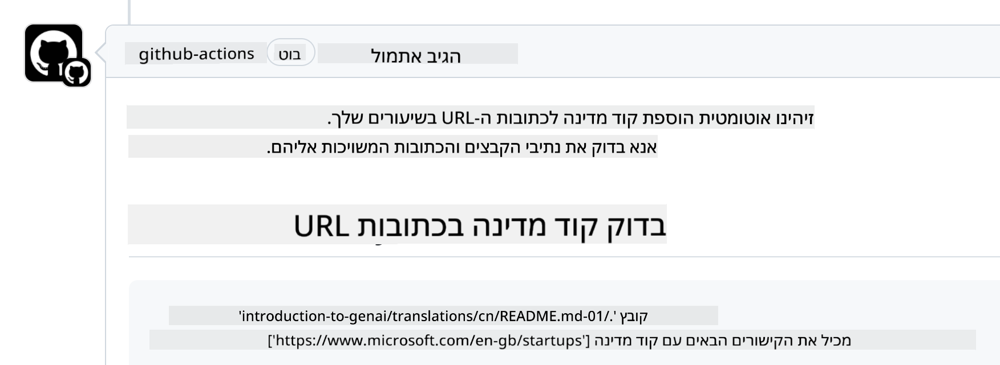

<!--
CO_OP_TRANSLATOR_METADATA:
{
  "original_hash": "57c41f2af71001a2cff9d8eb797cb843",
  "translation_date": "2025-07-09T06:09:13+00:00",
  "source_file": "CONTRIBUTING.md",
  "language_code": "he"
}
-->
# תרומה

הפרויקט הזה מקבל בברכה תרומות והצעות. רוב התרומות מחייבות שתסכים להסכם רישיון תורם (CLA) שמצהיר שיש לך את הזכות, ושאתה אכן מעניק לנו את הזכויות להשתמש בתרומתך. לפרטים, בקר בכתובת  
<https://cla.microsoft.com>.

> חשוב: בעת תרגום טקסט במאגר זה, אנא וודא שאינך משתמש בתרגום מכונה. נבדוק את התרגומים דרך הקהילה, לכן אנא התנדב לתרגום רק בשפות שבהן אתה שולט.

כאשר אתה מגיש בקשת משיכה, CLA-bot יזהה אוטומטית אם עליך לספק CLA ויעניק לבקשה את התווית המתאימה (למשל, תווית, תגובה). פשוט פעל לפי ההוראות שהבוט מספק. תצטרך לעשות זאת רק פעם אחת בכל המאגרי הקוד שמשתמשים ב-CLA שלנו.

## קוד התנהגות

הפרויקט אימץ את [קוד ההתנהגות של מיקרוסופט בקוד פתוח](https://opensource.microsoft.com/codeofconduct/?WT.mc_id=academic-105485-koreyst).  
למידע נוסף קרא את [שאלות נפוצות על קוד ההתנהגות](https://opensource.microsoft.com/codeofconduct/faq/?WT.mc_id=academic-105485-koreyst) או פנה ל-[opencode@microsoft.com](mailto:opencode@microsoft.com) עם שאלות או הערות נוספות.

## שאלה או בעיה?

אנא אל תפתח נושאים ב-GitHub לשאלות תמיכה כלליות, מאחר שרשימת ה-GitHub מיועדת לבקשות תכונות ודיווחי באגים. כך נוכל לעקוב בקלות רבה יותר אחר בעיות או באגים אמיתיים בקוד ולשמור על הדיון הכללי נפרד מהקוד עצמו.

## שגיאות, בעיות, באגים ותרומות

כשאתה מגיש שינויים למאגר Generative AI for Beginners, אנא פעל לפי ההמלצות הבאות:

* תמיד בצע fork של המאגר לחשבון שלך לפני ביצוע השינויים  
* אל תשלב שינויים מרובים בבקשת משיכה אחת. לדוגמה, הגש תיקון באג ועדכוני תיעוד בנפרד  
* אם בקשת המשיכה שלך מציגה קונפליקטים במיזוג, ודא לעדכן את main המקומי שלך כך שישקף את main במאגר הראשי לפני ביצוע השינויים  
* אם אתה מגיש תרגום, אנא צור בקשת משיכה אחת לכל הקבצים המתורגמים, מאחר שאיננו מקבלים תרגומים חלקיים לתוכן  
* אם אתה מגיש תיקון שגיאות כתיב או תיעוד, ניתן לשלב שינויים בבקשה אחת במידת הצורך

## הנחיות כלליות לכתיבה

- ודא שכל כתובות ה-URL שלך עטופות בסוגריים מרובעים ואחריהם סוגריים עגולים ללא רווחים מיותרים ``.  
- ודא שכל קישור יחסי (כלומר קישורים לקבצים ותיקיות במאגר) מתחיל ב-`./` לקובץ או תיקיה בתיקיית העבודה הנוכחית, או ב-`../` לקובץ או תיקיה בתיקיית עבודה עליונה.  
- ודא שלכל קישור יחסי יש מזהה מעקב (כלומר `?` או `&` ואחריו `wt.mc_id=` או `WT.mc_id=`) בסופו.  
- ודא שלכל כתובת URL מהדומיינים _github.com, microsoft.com, visualstudio.com, aka.ms, ו-azure.com_ יש מזהה מעקב בסופה.  
- ודא שלקישורים שלך אין קידומת שפה או מדינה (כגון `/en-us/` או `/en/`).  
- ודא שכל התמונות מאוחסנות בתיקיית `./images`.  
- ודא שלתמונות יש שמות תיאוריים עם תווים באנגלית, מספרים ומקפים בשם הקובץ.

## תהליכי עבודה ב-GitHub

כאשר אתה מגיש בקשת משיכה, יופעלו ארבעה תהליכי עבודה שונים כדי לוודא את הכללים הקודמים.  
פשוט פעל לפי ההוראות המפורטות כאן כדי לעבור את הבדיקות.

- [בדיקת קישורים יחסיים שבורים](../..)  
- [בדיקת קישורים יחסיים עם מעקב](../..)  
- [בדיקת כתובות URL עם מעקב](../..)  
- [בדיקת כתובות URL ללא קידומת שפה](../..)

### בדיקת קישורים יחסיים שבורים

תהליך עבודה זה מוודא שכל קישור יחסי בקבצים שלך תקין.  
המאגר מתפרסם ב-GitHub pages ולכן חשוב מאוד להקפיד שהקישורים שתחבר לא יפנו למקום הלא נכון.

כדי לוודא שהקישורים תקינים, השתמש ב-VS Code לבדיקה.

לדוגמה, כשאתה מרחף עם העכבר מעל קישור בקבצים, תוכל ללחוץ על **ctrl + click** כדי לעקוב אחר הקישור.

אם תלחץ על קישור והוא לא יעבוד במחשב המקומי, סביר להניח שהתהליך יכשל ולא יעבוד גם ב-GitHub.

כדי לתקן זאת, נסה להקליד את הקישור בעזרת VS Code.

כשאתה מקליד `./` או `../`, VS Code יציג אפשרויות לבחירה בהתאם למה שהקלדת.

עקוב אחרי הנתיב על ידי לחיצה על הקובץ או התיקיה הרצויים ותהיה בטוח שהנתיב שלך תקין.

לאחר שתוסיף את הנתיב היחסי הנכון, שמור ודחוף את השינויים, ותהליך העבודה יופעל שוב כדי לוודא את השינויים.  
אם תעבור את הבדיקה, תוכל להמשיך.

### בדיקת קישורים יחסיים עם מעקב

תהליך עבודה זה מוודא שלכל קישור יחסי יש מזהה מעקב.  
המאגר מתפרסם ב-GitHub pages ולכן חשוב לעקוב אחרי התנועה בין הקבצים והתיקיות.

כדי לוודא שלקישורים היחסיים יש מעקב, בדוק אם יש בסוף הנתיב את הטקסט `?wt.mc_id=`.  
אם הוא מצורף, תעבור את הבדיקה.

אם לא, תקבל את השגיאה הבאה.

כדי לתקן, פתח את הנתיב שהודגש בתהליך העבודה והוסף את מזהה המעקב בסוף הנתיב היחסי.

לאחר שתוסיף את מזהה המעקב, שמור ודחוף את השינויים, ותהליך העבודה יופעל שוב כדי לוודא את השינויים.  
אם תעבור את הבדיקה, תוכל להמשיך.

### בדיקת כתובות URL עם מעקב

תהליך עבודה זה מוודא שלכל כתובת URL יש מזהה מעקב.  
המאגר זמין לכולם ולכן חשוב לעקוב אחרי הגישה כדי לדעת מהיכן מגיע התנועה.

כדי לוודא שלכתובות ה-URL יש מעקב, בדוק אם יש בסוף הכתובת את הטקסט `?wt.mc_id=`.  
אם הוא מצורף, תעבור את הבדיקה.

אם לא, תקבל את השגיאה הבאה.

כדי לתקן, פתח את הנתיב שהודגש בתהליך העבודה והוסף את מזהה המעקב בסוף כתובת ה-URL.

לאחר שתוסיף את מזהה המעקב, שמור ודחוף את השינויים, ותהליך העבודה יופעל שוב כדי לוודא את השינויים.  
אם תעבור את הבדיקה, תוכל להמשיך.

### בדיקת כתובות URL ללא קידומת שפה

תהליך עבודה זה מוודא שלכתובות ה-URL אין קידומת שפה או מדינה.  
המאגר זמין לכולם ברחבי העולם ולכן חשוב לא לכלול את קידומת המדינה בכתובות.

כדי לוודא שאין קידומת שפה בכתובות, בדוק אם מופיע בטקסט הכתובת `/en-us/` או `/en/` או כל קידומת שפה אחרת.  
אם לא קיימת, תעבור את הבדיקה.

אם קיימת, תקבל את השגיאה הבאה.

כדי לתקן, פתח את הנתיב שהודגש בתהליך העבודה והסר את קידומת השפה מהכתובות.

לאחר שתסיר את קידומת השפה, שמור ודחוף את השינויים, ותהליך העבודה יופעל שוב כדי לוודא את השינויים.  
אם תעבור את הבדיקה, תוכל להמשיך.

מזל טוב! נחזור אליך בהקדם עם משוב על התרומה שלך.

**כתב ויתור**:  
מסמך זה תורגם באמצעות שירות תרגום מבוסס בינה מלאכותית [Co-op Translator](https://github.com/Azure/co-op-translator). למרות שאנו שואפים לדיוק, יש לקחת בחשבון כי תרגומים אוטומטיים עלולים להכיל שגיאות או אי-דיוקים. המסמך המקורי בשפת המקור שלו נחשב למקור הסמכותי. למידע קריטי מומלץ להשתמש בתרגום מקצועי על ידי מתרגם אנושי. אנו לא נושאים באחריות לכל אי-הבנה או פרשנות שגויה הנובעת משימוש בתרגום זה.