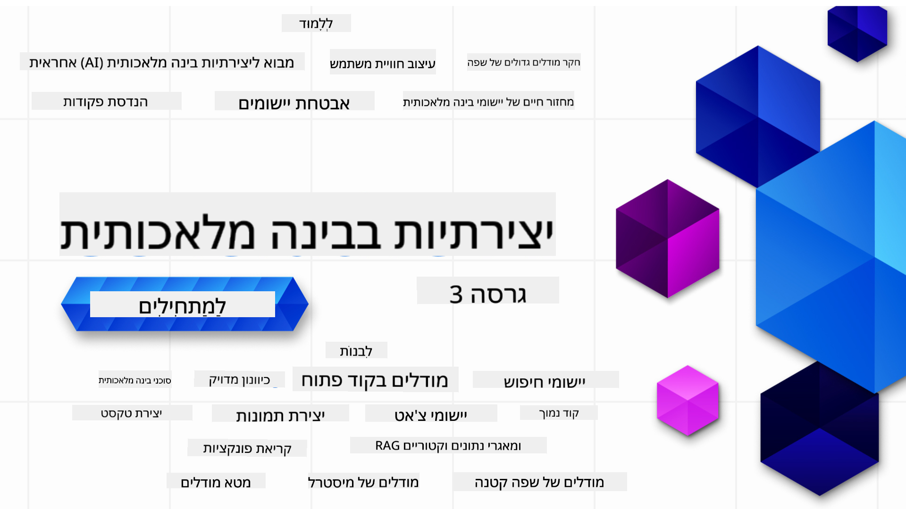

<!--
CO_OP_TRANSLATOR_METADATA:
{
  "original_hash": "ca2afa136ed9aca0634f39f51239746e",
  "translation_date": "2025-08-27T08:43:29+00:00",
  "source_file": "README.md",
  "language_code": "he"
}
-->

### 21 שיעורים שמלמדים את כל מה שצריך לדעת כדי להתחיל לבנות יישומים של בינה מלאכותית גנרטיבית

  
  
  
  
  

  
  
  

### 🌐 תמיכה בריבוי שפות

#### נתמך באמצעות GitHub Action (אוטומטי ומעודכן תמיד)

[צרפתית](../fr/README.md) | [ספרדית](../es/README.md) | [גרמנית](../de/README.md) | [רוסית](../ru/README.md) | [ערבית](../ar/README.md) | [פרסית (פארסי)](../fa/README.md) | [אורדו](../ur/README.md) | [סינית (פשוטה)](../zh/README.md) | [סינית (מסורתית, מקאו)](../mo/README.md) | [סינית (מסורתית, הונג קונג)](../hk/README.md) | [סינית (מסורתית, טייוואן)](../tw/README.md) | [יפנית](../ja/README.md) | [קוריאנית](../ko/README.md) | [הינדי](../hi/README.md) | [בנגלית](../bn/README.md) | [מראטהי](../mr/README.md) | [נפאלית](../ne/README.md) | [פנג'אבית (גורמוקי)](../pa/README.md) | [פורטוגזית (פורטוגל)](../pt/README.md) | [פורטוגזית (ברזיל)](../br/README.md) | [איטלקית](../it/README.md) | [ליטאית](../lt/README.md) | [פולנית](../pl/README.md) | [טורקית](../tr/README.md) | [יוונית](../el/README.md) | [תאית](../th/README.md) | [שוודית](../sv/README.md) | [דנית](../da/README.md) | [נורווגית](../no/README.md) | [פינית](../fi/README.md) | [הולנדית](../nl/README.md) | [עברית](./README.md) | [וייטנאמית](../vi/README.md) | [אינדונזית](../id/README.md) | [מלאית](../ms/README.md) | [טאגאלוג (פיליפינית)](../tl/README.md) | [סווהילית](../sw/README.md) | [הונגרית](../hu/README.md) | [צ'כית](../cs/README.md) | [סלובקית](../sk/README.md) | [רומנית](../ro/README.md) | [בולגרית](../bg/README.md) | [סרבית (קירילית)](../sr/README.md) | [קרואטית](../hr/README.md) | [סלובנית](../sl/README.md) | [אוקראינית](../uk/README.md) | [בורמזית (מיאנמר)](../my/README.md)

# בינה מלאכותית גנרטיבית למתחילים (גרסה 3) - קורס

למדו את היסודות של בניית יישומים של בינה מלאכותית גנרטיבית עם הקורס המקיף שלנו הכולל 21 שיעורים מאת Microsoft Cloud Advocates.

## 🌱 התחלה

הקורס כולל 21 שיעורים. כל שיעור מכסה נושא משלו, כך שתוכלו להתחיל מכל מקום שתרצו!

השיעורים מסומנים כ"שיעורי למידה" שמסבירים מושגי בינה מלאכותית גנרטיבית או כ"שיעורי בנייה" שמסבירים מושגים ודוגמאות קוד גם ב-**Python** וגם ב-**TypeScript** כאשר הדבר אפשרי.

למפתחים ב-.NET, עיינו ב-[בינה מלאכותית גנרטיבית למתחילים (מהדורת .NET)](https://github.com/microsoft/Generative-AI-for-beginners-dotnet?WT.mc_id=academic-105485-koreyst)!

כל שיעור כולל גם חלק של "המשך ללמוד" עם כלים נוספים ללמידה.

## מה צריך
### כדי להריץ את הקוד של הקורס, ניתן להשתמש באחת מהאפשרויות הבאות: 
 - [שירות Azure OpenAI](https://aka.ms/genai-beginners/azure-open-ai?WT.mc_id=academic-105485-koreyst) - **שיעורים:** "aoai-assignment"  
 - [קטלוג המודלים של GitHub Marketplace](https://aka.ms/genai-beginners/gh-models?WT.mc_id=academic-105485-koreyst) - **שיעורים:** "githubmodels"  
 - [OpenAI API](https://aka.ms/genai-beginners/open-ai?WT.mc_id=academic-105485-koreyst) - **שיעורים:** "oai-assignment"  

- ידע בסיסי ב-Python או TypeScript יכול לעזור - \*למתחילים מוחלטים, עיינו בקורסים האלה על [Python](https://aka.ms/genai-beginners/python?WT.mc_id=academic-105485-koreyst) ו-[TypeScript](https://aka.ms/genai-beginners/typescript?WT.mc_id=academic-105485-koreyst)  
- חשבון GitHub כדי [לשכפל את כל המאגר הזה](https://aka.ms/genai-beginners/github?WT.mc_id=academic-105485-koreyst) לחשבון ה-GitHub שלכם  

יצרנו שיעור **[הגדרת קורס](./00-course-setup/README.md?WT.mc_id=academic-105485-koreyst)** שיעזור לכם להגדיר את סביבת הפיתוח שלכם.

אל תשכחו [לסמן בכוכב (🌟) את המאגר הזה](https://docs.github.com/en/get-started/exploring-projects-on-github/saving-repositories-with-stars?WT.mc_id=academic-105485-koreyst) כדי למצוא אותו בקלות מאוחר יותר.

## 🧠 מוכנים לפריסה?

אם אתם מחפשים דוגמאות קוד מתקדמות יותר, עיינו ב-[אוסף דוגמאות הקוד של בינה מלאכותית גנרטיבית](https://aka.ms/genai-beg-code?WT.mc_id=academic-105485-koreyst) שלנו ב-**Python** וב-**TypeScript**.

## 🗣️ הכירו לומדים אחרים, קבלו תמיכה

הצטרפו ל-[שרת הדיסקורד הרשמי של Azure AI Foundry](https://aka.ms/genai-discord?WT.mc_id=academic-105485-koreyst) כדי להכיר ולהתחבר עם לומדים אחרים שלוקחים את הקורס הזה ולקבל תמיכה.

שאלו שאלות או שתפו משוב על מוצרים ב-[פורום המפתחים של Azure AI Foundry](https://aka.ms/azureaifoundry/forum) ב-GitHub.

## 🚀 בונים סטארטאפ?

בקרו ב-[Microsoft for Startups](https://www.microsoft.com/startups) כדי לגלות איך להתחיל לבנות עם קרדיטים של Azure כבר היום.

## 🙏 רוצים לעזור?

יש לכם הצעות או מצאתם שגיאות כתיב או קוד? [פתחו בעיה](https://github.com/microsoft/generative-ai-for-beginners/issues?WT.mc_id=academic-105485-koreyst) או [צרו בקשת משיכה](https://github.com/microsoft/generative-ai-for-beginners/pulls?WT.mc_id=academic-105485-koreyst).

## 📂 כל שיעור כולל:

- סרטון קצר שמציג את הנושא  
- שיעור כתוב שנמצא ב-README  
- דוגמאות קוד ב-Python וב-TypeScript התומכות ב-Azure OpenAI וב-OpenAI API  
- קישורים למשאבים נוספים להמשך הלמידה  

## 🗃️ שיעורים

| #   | **קישור לשיעור**                                                                                                                              | **תיאור**                                                                                 | **וידאו**                                                                   | **למידה נוספת**                                                             |
| --- | -------------------------------------------------------------------------------------------------------------------------------------------- | ----------------------------------------------------------------------------------------------- | --------------------------------------------------------------------------- | ------------------------------------------------------------------------------ |
| 00  | [הגדרת קורס](./00-course-setup/README.md?WT.mc_id=academic-105485-koreyst)                                                                 | **למדו:** איך להגדיר את סביבת הפיתוח שלכם                                            | וידאו בקרוב                                                                 | [למידה נוספת](https://aka.ms/genai-collection?WT.mc_id=academic-105485-koreyst) |
| 01  | [מבוא לבינה מלאכותית גנרטיבית ול-LLMs](./01-introduction-to-genai/README.md?WT.mc_id=academic-105485-koreyst)                              | **למדו:** הבנת מהי בינה מלאכותית גנרטיבית וכיצד פועלים מודלים גדולים לשפה (LLMs).       | [וידאו](https://aka.ms/gen-ai-lesson-1-gh?WT.mc_id=academic-105485-koreyst) | [למידה נוספת](https://aka.ms/genai-collection?WT.mc_id=academic-105485-koreyst) |
| 02  | [חקר והשוואה בין מודלים שונים של LLMs](./02-exploring-and-comparing-different-llms/README.md?WT.mc_id=academic-105485-koreyst)             | **למדו:** איך לבחור את המודל הנכון עבור המקרה שלכם                                      | [וידאו](https://aka.ms/gen-ai-lesson2-gh?WT.mc_id=academic-105485-koreyst)  | [למידה נוספת](https://aka.ms/genai-collection?WT.mc_id=academic-105485-koreyst) |
| 03  | [שימוש אחראי בבינה מלאכותית גנרטיבית](./03-using-generative-ai-responsibly/README.md?WT.mc_id=academic-105485-koreyst)                           | **למדו:** איך לבנות יישומי בינה מלאכותית גנרטיבית בצורה אחראית                                  | [וידאו](https://aka.ms/gen-ai-lesson3-gh?WT.mc_id=academic-105485-koreyst)  | [למידה נוספת](https://aka.ms/genai-collection?WT.mc_id=academic-105485-koreyst) |
| 04  | [הבנת יסודות הנדסת הנחיות](./04-prompt-engineering-fundamentals/README.md?WT.mc_id=academic-105485-koreyst)             | **למדו:** תרגול מעשי של שיטות עבודה מומלצות להנדסת הנחיות                                           | [וידאו](https://aka.ms/gen-ai-lesson4-gh?WT.mc_id=academic-105485-koreyst)  | [למידה נוספת](https://aka.ms/genai-collection?WT.mc_id=academic-105485-koreyst) |
| 05  | [יצירת הנחיות מתקדמות](./05-advanced-prompts/README.md?WT.mc_id=academic-105485-koreyst)                                                | **למדו:** איך ליישם טכניקות הנדסת הנחיות שמשפרות את תוצאות ההנחיות שלכם. | [וידאו](https://aka.ms/gen-ai-lesson5-gh?WT.mc_id=academic-105485-koreyst)  | [למידה נוספת](https://aka.ms/genai-collection?WT.mc_id=academic-105485-koreyst) |
| 06  | [בניית יישומי יצירת טקסט](./06-text-generation-apps/README.md?WT.mc_id=academic-105485-koreyst)                                | **בניית:** יישום ליצירת טקסט באמצעות Azure OpenAI / OpenAI API                                | [וידאו](https://aka.ms/gen-ai-lesson6-gh?WT.mc_id=academic-105485-koreyst)  | [למידע נוסף](https://aka.ms/genai-collection?WT.mc_id=academic-105485-koreyst) |
| 07  | [בניית יישומי צ'אט](./07-building-chat-applications/README.md?WT.mc_id=academic-105485-koreyst)                                     | **בניית:** טכניקות לבנייה ושילוב יעיל של יישומי צ'אט.               | [וידאו](https://aka.ms/gen-ai-lessons7-gh?WT.mc_id=academic-105485-koreyst) | [למידע נוסף](https://aka.ms/genai-collection?WT.mc_id=academic-105485-koreyst) |
| 08  | [בניית יישומי חיפוש עם מסדי נתונים וקטוריים](./08-building-search-applications/README.md?WT.mc_id=academic-105485-koreyst)                        | **בניית:** יישום חיפוש המשתמש ב-Embeddings לחיפוש נתונים.                        | [וידאו](https://aka.ms/gen-ai-lesson8-gh?WT.mc_id=academic-105485-koreyst)  | [למידע נוסף](https://aka.ms/genai-collection?WT.mc_id=academic-105485-koreyst) |
| 09  | [בניית יישומי יצירת תמונות](./09-building-image-applications/README.md?WT.mc_id=academic-105485-koreyst)                        | **בניית:** יישום ליצירת תמונות                                                       | [וידאו](https://aka.ms/gen-ai-lesson9-gh?WT.mc_id=academic-105485-koreyst)  | [למידע נוסף](https://aka.ms/genai-collection?WT.mc_id=academic-105485-koreyst) |
| 10  | [בניית יישומי AI בקוד נמוך](./10-building-low-code-ai-applications/README.md?WT.mc_id=academic-105485-koreyst)                       | **בניית:** יישום AI גנרטיבי באמצעות כלים בקוד נמוך                                     | [וידאו](https://aka.ms/gen-ai-lesson10-gh?WT.mc_id=academic-105485-koreyst) | [למידע נוסף](https://aka.ms/genai-collection?WT.mc_id=academic-105485-koreyst) |
| 11  | [שילוב יישומים חיצוניים עם קריאות פונקציה](./11-integrating-with-function-calling/README.md?WT.mc_id=academic-105485-koreyst) | **בניית:** מהי קריאת פונקציה ושימושיה ביישומים                          | [וידאו](https://aka.ms/gen-ai-lesson11-gh?WT.mc_id=academic-105485-koreyst) | [למידע נוסף](https://aka.ms/genai-collection?WT.mc_id=academic-105485-koreyst) |
| 12  | [עיצוב חוויית משתמש ליישומי AI](./12-designing-ux-for-ai-applications/README.md?WT.mc_id=academic-105485-koreyst)                         | **למידה:** כיצד ליישם עקרונות עיצוב חוויית משתמש בעת פיתוח יישומי AI גנרטיביים         | [וידאו](https://aka.ms/gen-ai-lesson12-gh?WT.mc_id=academic-105485-koreyst) | [למידע נוסף](https://aka.ms/genai-collection?WT.mc_id=academic-105485-koreyst) |
| 13  | [אבטחת יישומי AI גנרטיביים](./13-securing-ai-applications/README.md?WT.mc_id=academic-105485-koreyst)                         | **למידה:** האיומים והסיכונים למערכות AI ושיטות לאבטחתן.             | [וידאו](https://aka.ms/gen-ai-lesson13-gh?WT.mc_id=academic-105485-koreyst) | [למידע נוסף](https://aka.ms/genai-collection?WT.mc_id=academic-105485-koreyst) |
| 14  | [מחזור החיים של יישומי AI גנרטיביים](./14-the-generative-ai-application-lifecycle/README.md?WT.mc_id=academic-105485-koreyst)           | **למידה:** הכלים והמדדים לניהול מחזור החיים של LLM ו-LLMOps                         | [וידאו](https://aka.ms/gen-ai-lesson14-gh?WT.mc_id=academic-105485-koreyst) | [למידע נוסף](https://aka.ms/genai-collection?WT.mc_id=academic-105485-koreyst) |
| 15  | [RAG ומסדי נתונים וקטוריים](./15-rag-and-vector-databases/README.md?WT.mc_id=academic-105485-koreyst)        | **בניית:** יישום המשתמש במסגרת RAG לשליפת Embeddings ממסדי נתונים וקטוריים  | [וידאו](https://aka.ms/gen-ai-lesson15-gh?WT.mc_id=academic-105485-koreyst) | [למידע נוסף](https://aka.ms/genai-collection?WT.mc_id=academic-105485-koreyst) |
| 16  | [מודלים בקוד פתוח ו-Hugging Face](./16-open-source-models/README.md?WT.mc_id=academic-105485-koreyst)                                    | **בניית:** יישום המשתמש במודלים בקוד פתוח הזמינים ב-Hugging Face                    | [וידאו](https://aka.ms/gen-ai-lesson16-gh?WT.mc_id=academic-105485-koreyst) | [למידע נוסף](https://aka.ms/genai-collection?WT.mc_id=academic-105485-koreyst) |
| 17  | [סוכני AI](./17-ai-agents/README.md?WT.mc_id=academic-105485-koreyst)                                                                       | **בניית:** יישום המשתמש במסגרת סוכני AI                                           | [וידאו](https://aka.ms/gen-ai-lesson17-gh?WT.mc_id=academic-105485-koreyst) | [למידע נוסף](https://aka.ms/genai-collection?WT.mc_id=academic-105485-koreyst) |
| 18  | [כיוונון עדין של LLMs](./18-fine-tuning/README.md?WT.mc_id=academic-105485-koreyst)                                                              | **למידה:** מהו כיוונון עדין, מדוע וכיצד לבצע אותו                                            | [וידאו](https://aka.ms/gen-ai-lesson18-gh?WT.mc_id=academic-105485-koreyst) | [למידע נוסף](https://aka.ms/genai-collection?WT.mc_id=academic-105485-koreyst) |
| 19  | [בניית יישומים עם SLMs](./19-slm/README.md?WT.mc_id=academic-105485-koreyst)                                                              | **למידה:** היתרונות של בנייה עם מודלים קטנים לשפה                                            | וידאו בקרוב | [למידע נוסף](https://aka.ms/genai-collection?WT.mc_id=academic-105485-koreyst) |
| 20  | [בניית יישומים עם מודלי Mistral](./20-mistral/README.md?WT.mc_id=academic-105485-koreyst)                                                              | **למידה:** התכונות וההבדלים של משפחת מודלי Mistral                                           | וידאו בקרוב | [למידע נוסף](https://aka.ms/genai-collection?WT.mc_id=academic-105485-koreyst) |
| 21  | [בניית יישומים עם מודלי Meta](./21-meta/README.md?WT.mc_id=academic-105485-koreyst)                                                              | **למידה:** התכונות וההבדלים של משפחת מודלי Meta                                           | וידאו בקרוב | [למידע נוסף](https://aka.ms/genai-collection?WT.mc_id=academic-105485-koreyst) |

### 🌟 תודה מיוחדת

תודה מיוחדת ל-[**John Aziz**](https://www.linkedin.com/in/john0isaac/) על יצירת כל פעולות GitHub והזרימות עבודה.

[**Bernhard Merkle**](https://www.linkedin.com/in/bernhard-merkle-738b73/) על תרומות מפתח לכל שיעור לשיפור חוויית הלמידה והקוד.

## 🎒 קורסים נוספים

הצוות שלנו מפתח קורסים נוספים! בדקו:

- [**חדש** פרוטוקול הקשר מודלים למתחילים](https://github.com/microsoft/mcp-for-beginners)
- [סוכני AI למתחילים](https://github.com/microsoft/ai-agents-for-beginners)
- [AI גנרטיבי למתחילים באמצעות .NET](https://github.com/microsoft/Generative-AI-for-beginners-dotnet)
- [AI גנרטיבי למתחילים באמצעות JavaScript](https://aka.ms/genai-js-course)
- [AI גנרטיבי למתחילים באמצעות Java](https://aka.ms/genaijava)
- [למידת מכונה למתחילים](https://aka.ms/ml-beginners)
- [מדעי הנתונים למתחילים](https://aka.ms/datascience-beginners)
- [AI למתחילים](https://aka.ms/ai-beginners)
- [סייבר למתחילים](https://github.com/microsoft/Security-101)
- [פיתוח אתרים למתחילים](https://aka.ms/webdev-beginners)
- [IoT למתחילים](https://aka.ms/iot-beginners)
- [פיתוח XR למתחילים](https://github.com/microsoft/xr-development-for-beginners)
- [שליטה ב-GitHub Copilot לתכנות זוגי עם AI](https://aka.ms/GitHubCopilotAI)
- [שליטה ב-GitHub Copilot למפתחי C#/.NET](https://github.com/microsoft/mastering-github-copilot-for-dotnet-csharp-developers)
- [בחרו את הרפתקת ה-Copilot שלכם](https://github.com/microsoft/CopilotAdventures)

---

**כתב ויתור**:  
מסמך זה תורגם באמצעות שירות תרגום מבוסס בינה מלאכותית [Co-op Translator](https://github.com/Azure/co-op-translator). בעוד שאנו שואפים לדיוק, יש להיות מודעים לכך שתרגומים אוטומטיים עשויים להכיל שגיאות או אי-דיוקים. המסמך המקורי בשפתו המקורית נחשב למקור הסמכותי. למידע קריטי, מומלץ להשתמש בתרגום מקצועי על ידי בני אדם. איננו נושאים באחריות לכל אי-הבנה או פרשנות שגויה הנובעת משימוש בתרגום זה.  