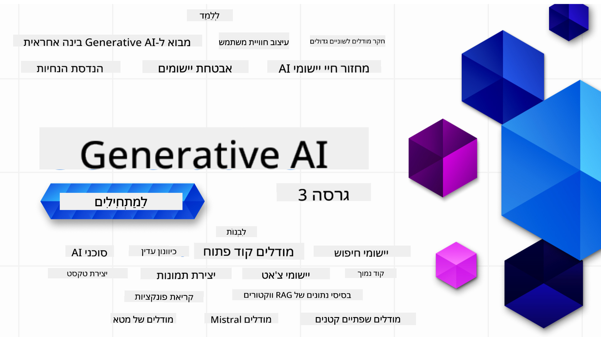

<!--
CO_OP_TRANSLATOR_METADATA:
{
  "original_hash": "c2ee25895ebbfa1a52868bb6eab686fc",
  "translation_date": "2025-05-19T11:51:42+00:00",
  "source_file": "README.md",
  "language_code": "he"
}
-->

### 21 שיעורים המלמדים את כל מה שצריך לדעת כדי להתחיל לבנות יישומים של AI גנרטיבי

### 🌐 תמיכה בריבוי שפות

#### נתמך באמצעות GitHub Action (אוטומטי ותמיד מעודכן)
[צרפתית](../fr/README.md) | [ספרדית](../es/README.md) | [גרמנית](../de/README.md) | [רוסית](../ru/README.md) | [ערבית](../ar/README.md) | [פרסית (פארסי)](../fa/README.md) | [אורדו](../ur/README.md) | [סינית (פשוטה)](../zh/README.md) | [סינית (מסורתית, מקאו)](../mo/README.md) | [סינית (מסורתית, הונג קונג)](../hk/README.md) | [סינית (מסורתית, טייוואן)](../tw/README.md) | [יפנית](../ja/README.md) | [קוריאנית](../ko/README.md) | [הינדי](../hi/README.md) | [בנגלית](../bn/README.md) | [מראטהי](../mr/README.md) | [נפאלית](../ne/README.md) | [פנג'אבית (גורמוקי)](../pa/README.md) | [פורטוגזית (פורטוגל)](../pt/README.md) | [פורטוגזית (ברזיל)](../br/README.md) | [איטלקית](../it/README.md) | [פולנית](../pl/README.md) | [טורקית](../tr/README.md) | [יוונית](../el/README.md) | [תאילנדית](../th/README.md) | [שוודית](../sv/README.md) | [דנית](../da/README.md) | [נורווגית](../no/README.md) | [פינית](../fi/README.md) | [הולנדית](../nl/README.md) | [עברית](./README.md) | [וייטנאמית](../vi/README.md) | [אינדונזית](../id/README.md) | [מלאית](../ms/README.md) | [טאגאלוג (פיליפינית)](../tl/README.md) | [סווהילית](../sw/README.md) | [הונגרית](../hu/README.md) | [צ'כית](../cs/README.md) | [סלובקית](../sk/README.md) | [רומנית](../ro/README.md) | [בולגרית](../bg/README.md) | [סרבית (קירילית)](../sr/README.md) | [קרואטית](../hr/README.md) | [סלובנית](../sl/README.md)
# קורס בינה מלאכותית יוצרת למתחילים (גרסה 3)

למדו את יסודות בניית יישומי בינה מלאכותית יוצרת עם הקורס המקיף שלנו בן 21 השיעורים מאת Microsoft Cloud Advocates.

## 🌱 התחלת העבודה

הקורס כולל 21 שיעורים. כל שיעור מכסה נושא משלו, כך שתוכלו להתחיל בכל מקום שתרצו!

השיעורים מסומנים כ"שיעורי למידה" המסבירים מושג בבינה מלאכותית יוצרת או "שיעורי בנייה" המסבירים מושג ודוגמאות קוד ב-**Python** ו-**TypeScript** כשאפשר.

למפתחי .NET, עיינו ב-[בינה מלאכותית יוצרת למתחילים (מהדורת .NET)](https://github.com/microsoft/Generative-AI-for-beginners-dotnet?WT.mc_id=academic-105485-koreyst)!

כל שיעור כולל גם סעיף "המשך ללמוד" עם כלים נוספים ללמידה.

## מה אתם צריכים
### כדי להריץ את הקוד של הקורס, תוכלו להשתמש באחת מהאפשרויות הבאות:
 - [Azure OpenAI Service](https://aka.ms/genai-beginners/azure-open-ai?WT.mc_id=academic-105485-koreyst) - **שיעורים:** "aoai-assignment"
 - [GitHub Marketplace Model Catalog](https://aka.ms/genai-beginners/gh-models?WT.mc_id=academic-105485-koreyst) - **שיעורים:** "githubmodels"
 - [OpenAI API](https://aka.ms/genai-beginners/open-ai?WT.mc_id=academic-105485-koreyst) - **שיעורים:** "oai-assignment" 
   
- ידע בסיסי ב-Python או TypeScript יעיל - \*למתחילים מוחלטים, עיינו בקורסים אלה [Python](https://aka.ms/genai-beginners/python?WT.mc_id=academic-105485-koreyst) ו-[TypeScript](https://aka.ms/genai-beginners/typescript?WT.mc_id=academic-105485-koreyst)
- חשבון GitHub ל-[fork של כל המאגר הזה](https://aka.ms/genai-beginners/github?WT.mc_id=academic-105485-koreyst) לחשבון GitHub שלכם

יצרנו שיעור **[הגדרת קורס](./00-course-setup/README.md?WT.mc_id=academic-105485-koreyst)** שיעזור לכם בהגדרת סביבת הפיתוח שלכם.

אל תשכחו ל-[לסמן בכוכב (🌟) את המאגר הזה](https://docs.github.com/en/get-started/exploring-projects-on-github/saving-repositories-with-stars?WT.mc_id=academic-105485-koreyst) כדי למצוא אותו בקלות מאוחר יותר.

## 🧠 מוכנים לפריסה?

אם אתם מחפשים דוגמאות קוד מתקדמות יותר, עיינו ב-[אוסף דוגמאות הקוד של בינה מלאכותית יוצרת](https://aka.ms/genai-beg-code?WT.mc_id=academic-105485-koreyst) ב-**Python** ו-**TypeScript**.

## 🗣️ הכירו לומדים אחרים, קבלו תמיכה

הצטרפו ל-[שרת הדיסקורד הרשמי של Azure AI Foundry](https://aka.ms/genai-discord?WT.mc_id=academic-105485-koreyst) כדי לפגוש ולהתחבר עם לומדים אחרים שלוקחים את הקורס ולקבל תמיכה.

שאלו שאלות או שתפו משוב על מוצרים ב-[פורום המפתחים של Azure AI Foundry](https://aka.ms/azureaifoundry/forum) ב-Github.

## 🚀 בונים סטארטאפ?

הירשמו ל-[Microsoft for Startups Founders Hub](https://aka.ms/genai-foundershub?WT.mc_id=academic-105485-koreyst) כדי לקבל **קרדיטים חינם של OpenAI** ועד **$150k לקרדיטים של Azure לגישה למודלים של OpenAI דרך שירותי Azure OpenAI**.

## 🙏 רוצים לעזור?

יש לכם הצעות או מצאתם שגיאות כתיב או קוד? [העלו בעיה](https://github.com/microsoft/generative-ai-for-beginners/issues?WT.mc_id=academic-105485-koreyst) או [צרו בקשת משיכה](https://github.com/microsoft/generative-ai-for-beginners/pulls?WT.mc_id=academic-105485-koreyst)

## 📂 כל שיעור כולל:

- הקדמת וידאו קצרה לנושא
- שיעור כתוב ב-README
- דוגמאות קוד ב-Python ו-TypeScript התומכות ב-Azure OpenAI ו-OpenAI API
- קישורים למשאבים נוספים להמשך הלמידה שלכם

## 🗃️ שיעורים

| #   | **קישור לשיעור**                                                                                                                              | **תיאור**                                                                                 | **וידאו**                                                                   | **למידה נוספת**                                                             |
| --- | -------------------------------------------------------------------------------------------------------------------------------------------- | ----------------------------------------------------------------------------------------------- | --------------------------------------------------------------------------- | ------------------------------------------------------------------------------ |
| 00  | [הגדרת קורס](./00-course-setup/README.md?WT.mc_id=academic-105485-koreyst)                                                                 | **למדו:** איך להגדיר את סביבת הפיתוח שלכם                                            | וידאו בקרוב                                                                 | [למידה נוספת](https://aka.ms/genai-collection?WT.mc_id=academic-105485-koreyst) |
| 01  | [מבוא לבינה מלאכותית יוצרת ו-LLMs](./01-introduction-to-genai/README.md?WT.mc_id=academic-105485-koreyst)                              | **למדו:** להבין מהי בינה מלאכותית יוצרת ואיך מודלים שפה גדולים (LLMs) עובדים       | [וידאו](https://aka.ms/gen-ai-lesson-1-gh?WT.mc_id=academic-105485-koreyst) | [למידה נוספת](https://aka.ms/genai-collection?WT.mc_id=academic-105485-koreyst) |
| 02  | [חקירה והשוואה בין LLMs שונים](./02-exploring-and-comparing-different-llms/README.md?WT.mc_id=academic-105485-koreyst)             | **למדו:** איך לבחור את המודל הנכון למקרה השימוש שלכם                                      | [וידאו](https://aka.ms/gen-ai-lesson2-gh?WT.mc_id=academic-105485-koreyst)  | [למידה נוספת](https://aka.ms/genai-collection?WT.mc_id=academic-105485-koreyst) |
| 03  | [שימוש בבינה מלאכותית יוצרת באופן אחראי](./03-using-generative-ai-responsibly/README.md?WT.mc_id=academic-105485-koreyst)                           | **למדו:** איך לבנות יישומי בינה מלאכותית יוצרת באופן אחראי                                  | [וידאו](https://aka.ms/gen-ai-lesson3-gh?WT.mc_id=academic-105485-koreyst)  | [למידה נוספת](https://aka.ms/genai-collection?WT.mc_id=academic-105485-koreyst) |
| 04  | [הבנת יסודות הנדסת הנחיות](./04-prompt-engineering-fundamentals/README.md?WT.mc_id=academic-105485-koreyst)             | **למדו:** שיטות עבודה מומלצות להנדסת הנחיות                                           | [וידאו](https://aka.ms/gen-ai-lesson4-gh?WT.mc_id=academic-105485-koreyst)  | [למידה נוספת](https://aka.ms/genai-collection?WT.mc_id=academic-105485-koreyst) |
| 05  | [יצירת פרומפטים מתקדמים](./05-advanced-prompts/README.md?WT.mc_id=academic-105485-koreyst)                                                | **למד:** כיצד ליישם טכניקות הנדסת פרומפטים שמשפרות את התוצאה של הפרומפטים שלך. | [סרטון](https://aka.ms/gen-ai-lesson5-gh?WT.mc_id=academic-105485-koreyst)  | [למידע נוסף](https://aka.ms/genai-collection?WT.mc_id=academic-105485-koreyst) |
| 06  | [בניית אפליקציות ליצירת טקסט](./06-text-generation-apps/README.md?WT.mc_id=academic-105485-koreyst)                                | **בנה:** אפליקציה ליצירת טקסט באמצעות Azure OpenAI / OpenAI API                                | [סרטון](https://aka.ms/gen-ai-lesson6-gh?WT.mc_id=academic-105485-koreyst)  | [למידע נוסף](https://aka.ms/genai-collection?WT.mc_id=academic-105485-koreyst) |
| 07  | [בניית אפליקציות צ'אט](./07-building-chat-applications/README.md?WT.mc_id=academic-105485-koreyst)                                     | **בנה:** טכניקות לבנייה ושילוב יעיל של אפליקציות צ'אט.               | [סרטון](https://aka.ms/gen-ai-lessons7-gh?WT.mc_id=academic-105485-koreyst) | [למידע נוסף](https://aka.ms/genai-collection?WT.mc_id=academic-105485-koreyst) |
| 08  | [בניית אפליקציות חיפוש עם מאגרי נתונים וקטוריים](./08-building-search-applications/README.md?WT.mc_id=academic-105485-koreyst)                        | **בנה:** אפליקציית חיפוש המשתמשת בהטבעות לחיפוש נתונים.                        | [סרטון](https://aka.ms/gen-ai-lesson8-gh?WT.mc_id=academic-105485-koreyst)  | [למידע נוסף](https://aka.ms/genai-collection?WT.mc_id=academic-105485-koreyst) |
| 09  | [בניית אפליקציות ליצירת תמונות](./09-building-image-applications/README.md?WT.mc_id=academic-105485-koreyst)                        | **בנה:** אפליקציה ליצירת תמונות                                                       | [סרטון](https://aka.ms/gen-ai-lesson9-gh?WT.mc_id=academic-105485-koreyst)  | [למידע נוסף](https://aka.ms/genai-collection?WT.mc_id=academic-105485-koreyst) |
| 10  | [בניית אפליקציות AI בקוד נמוך](./10-building-low-code-ai-applications/README.md?WT.mc_id=academic-105485-koreyst)                       | **בנה:** אפליקציית AI גנרטיבית באמצעות כלים בקוד נמוך                                     | [סרטון](https://aka.ms/gen-ai-lesson10-gh?WT.mc_id=academic-105485-koreyst) | [למידע נוסף](https://aka.ms/genai-collection?WT.mc_id=academic-105485-koreyst) |
| 11  | [שילוב אפליקציות חיצוניות עם קריאת פונקציות](./11-integrating-with-function-calling/README.md?WT.mc_id=academic-105485-koreyst) | **בנה:** מהי קריאת פונקציות ושימושיהן לאפליקציות                          | [סרטון](https://aka.ms/gen-ai-lesson11-gh?WT.mc_id=academic-105485-koreyst) | [למידע נוסף](https://aka.ms/genai-collection?WT.mc_id=academic-105485-koreyst) |
| 12  | [עיצוב חוויית משתמש לאפליקציות AI](./12-designing-ux-for-ai-applications/README.md?WT.mc_id=academic-105485-koreyst)                         | **למד:** כיצד ליישם עקרונות עיצוב חוויית משתמש בעת פיתוח אפליקציות AI גנרטיביות         | [סרטון](https://aka.ms/gen-ai-lesson12-gh?WT.mc_id=academic-105485-koreyst) | [למידע נוסף](https://aka.ms/genai-collection?WT.mc_id=academic-105485-koreyst) |
| 13  | [אבטחת אפליקציות AI גנרטיביות שלך](./13-securing-ai-applications/README.md?WT.mc_id=academic-105485-koreyst)                         | **למד:** האיומים והסיכונים למערכות AI ושיטות לאבטחת מערכות אלו.             | [סרטון](https://aka.ms/gen-ai-lesson13-gh?WT.mc_id=academic-105485-koreyst) | [למידע נוסף](https://aka.ms/genai-collection?WT.mc_id=academic-105485-koreyst) |
| 14  | [מחזור חיי אפליקציות AI גנרטיביות](./14-the-generative-ai-application-lifecycle/README.md?WT.mc_id=academic-105485-koreyst)           | **למד:** הכלים והמדדים לניהול מחזור חיי LLM ו-LLMOps                         | [סרטון](https://aka.ms/gen-ai-lesson14-gh?WT.mc_id=academic-105485-koreyst) | [למידע נוסף](https://aka.ms/genai-collection?WT.mc_id=academic-105485-koreyst) |
| 15  | [אחזור מוגבר יצירה (RAG) ומאגרי נתונים וקטוריים](./15-rag-and-vector-databases/README.md?WT.mc_id=academic-105485-koreyst)        | **בנה:** יישום באמצעות מסגרת RAG כדי לאחזר הטבעות ממאגרי נתונים וקטוריים  | [וידאו](https://aka.ms/gen-ai-lesson15-gh?WT.mc_id=academic-105485-koreyst) | [למידה נוספת](https://aka.ms/genai-collection?WT.mc_id=academic-105485-koreyst) |
| 16  | [מודלים בקוד פתוח ו-Hugging Face](./16-open-source-models/README.md?WT.mc_id=academic-105485-koreyst)                                    | **בנה:** יישום באמצעות מודלים בקוד פתוח הזמינים ב-Hugging Face                    | [וידאו](https://aka.ms/gen-ai-lesson16-gh?WT.mc_id=academic-105485-koreyst) | [למידה נוספת](https://aka.ms/genai-collection?WT.mc_id=academic-105485-koreyst) |
| 17  | [סוכני AI](./17-ai-agents/README.md?WT.mc_id=academic-105485-koreyst)                                                                       | **בנה:** יישום באמצעות מסגרת סוכני AI                                           | [וידאו](https://aka.ms/gen-ai-lesson17-gh?WT.mc_id=academic-105485-koreyst) | [למידה נוספת](https://aka.ms/genai-collection?WT.mc_id=academic-105485-koreyst) |
| 18  | [כוונון עדין של LLMs](./18-fine-tuning/README.md?WT.mc_id=academic-105485-koreyst)                                                              | **למד:** מה זה, למה ואיך לכוונן עדין LLMs                                            | [וידאו](https://aka.ms/gen-ai-lesson18-gh?WT.mc_id=academic-105485-koreyst) | [למידה נוספת](https://aka.ms/genai-collection?WT.mc_id=academic-105485-koreyst) |
| 19  | [בניית עם SLMs](./19-slm/README.md?WT.mc_id=academic-105485-koreyst)                                                              | **למד:** היתרונות של בניית עם מודלים לשוניים קטנים                                            | וידאו בקרוב | [למידה נוספת](https://aka.ms/genai-collection?WT.mc_id=academic-105485-koreyst) |
| 20  | [בניית עם מודלים Mistral](./20-mistral/README.md?WT.mc_id=academic-105485-koreyst)                                                              | **למד:** התכונות וההבדלים של מודלים ממשפחת Mistral                                           | וידאו בקרוב | [למידה נוספת](https://aka.ms/genai-collection?WT.mc_id=academic-105485-koreyst) |
| 21  | [בניית עם מודלים Meta](./21-meta/README.md?WT.mc_id=academic-105485-koreyst)                                                              | **למד:** התכונות וההבדלים של מודלים ממשפחת Meta                                           | וידאו בקרוב | [למידה נוספת](https://aka.ms/genai-collection?WT.mc_id=academic-105485-koreyst) |

### 🌟 תודה מיוחדת

תודה מיוחדת ל-[**John Aziz**](https://www.linkedin.com/in/john0isaac/) על יצירת כל פעולות GitHub ותהליכי העבודה

[**Bernhard Merkle**](https://www.linkedin.com/in/bernhard-merkle-738b73/) על תרומה משמעותית לכל שיעור לשיפור חווית הלמידה והקוד. 

## 🎒 קורסים נוספים

הצוות שלנו מפיק קורסים נוספים! בדקו את:

- [**חדש** סוכני AI למתחילים](https://github.com/microsoft/ai-agents-for-beginners?WT.mc_id=academic-105485-koreyst)
- [**חדש** AI גנרטיבי למתחילים באמצעות .NET](https://github.com/microsoft/Generative-AI-for-beginners-dotnet?WT.mc_id=academic-105485-koreyst)
- [**חדש** AI גנרטיבי למתחילים באמצעות JavaScript](https://aka.ms/genai-js-course?WT.mc_id=academic-105485-koreyst)
- [ML למתחילים](https://aka.ms/ml-beginners?WT.mc_id=academic-105485-koreyst)
- [מדעי הנתונים למתחילים](https://aka.ms/datascience-beginners?WT.mc_id=academic-105485-koreyst)
- [AI למתחילים](https://aka.ms/ai-beginners?WT.mc_id=academic-105485-koreyst)
- [סייברסקיוריטי למתחילים](https://github.com/microsoft/Security-101??WT.mc_id=academic-96948-sayoung)
- [פיתוח אתרים למתחילים](https://aka.ms/webdev-beginners?WT.mc_id=academic-105485-koreyst)
- [IoT למתחילים](https://aka.ms/iot-beginners?WT.mc_id=academic-105485-koreyst)
- [פיתוח XR למתחילים](https://github.com/microsoft/xr-development-for-beginners?WT.mc_id=academic-105485-koreyst)
- [שליטה ב-GitHub Copilot לתכנות זוגי עם AI](https://aka.ms/GitHubCopilotAI?WT.mc_id=academic-105485-koreyst)
- [שליטה ב-GitHub Copilot למפתחים ב-C#/.NET](https://github.com/microsoft/mastering-github-copilot-for-dotnet-csharp-developers?WT.mc_id=academic-105485-koreyst)
- [בחר את הרפתקת Copilot שלך](https://github.com/microsoft/CopilotAdventures?WT.mc_id=academic-105485-koreyst)

**כתב ויתור**:  
מסמך זה תורגם באמצעות שירות תרגום AI [Co-op Translator](https://github.com/Azure/co-op-translator). בעוד אנו שואפים לדיוק, אנא היו מודעים לכך שתרגומים אוטומטיים עשויים להכיל שגיאות או אי דיוקים. המסמך המקורי בשפתו המקורית צריך להיחשב כמקור סמכותי. עבור מידע קריטי, מומלץ תרגום מקצועי אנושי. אנו לא נושאים באחריות לכל אי הבנות או פרשנויות שגויות הנובעות משימוש בתרגום זה.