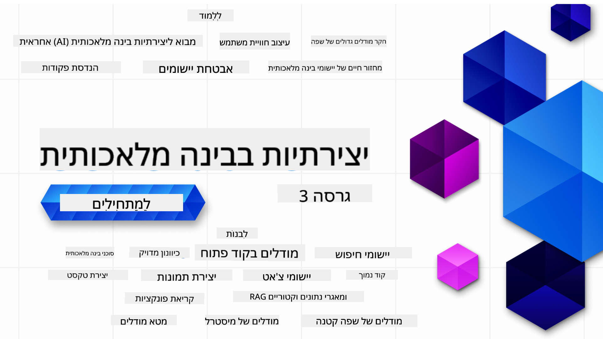

<!--
CO_OP_TRANSLATOR_METADATA:
{
  "original_hash": "6e3f4c8a4f323b8eab1cf11ded304b0f",
  "translation_date": "2025-06-25T08:04:59+00:00",
  "source_file": "README.md",
  "language_code": "he"
}
-->

### 21 שיעורים שמלמדים כל מה שצריך לדעת כדי להתחיל לבנות יישומים של AI גנרטיבי

### 🌐 תמיכה רב-לשונית

#### נתמך באמצעות GitHub Action (אוטומטי ותמיד מעודכן)
[צרפתית](../fr/README.md) | [ספרדית](../es/README.md) | [גרמנית](../de/README.md) | [רוסית](../ru/README.md) | [ערבית](../ar/README.md) | [פרסית (פארסי)](../fa/README.md) | [אורדו](../ur/README.md) | [סינית (פשוטה)](../zh/README.md) | [סינית (מסורתית, מקאו)](../mo/README.md) | [סינית (מסורתית, הונג קונג)](../hk/README.md) | [סינית (מסורתית, טייוואן)](../tw/README.md) | [יפנית](../ja/README.md) | [קוריאנית](../ko/README.md) | [הינדית](../hi/README.md) | [בנגלית](../bn/README.md) | [מרטהי](../mr/README.md) | [נפאלית](../ne/README.md) | [פנג'אבי (גורמוקי)](../pa/README.md) | [פורטוגזית (פורטוגל)](../pt/README.md) | [פורטוגזית (ברזיל)](../br/README.md) | [איטלקית](../it/README.md) | [פולנית](../pl/README.md) | [טורקית](../tr/README.md) | [יוונית](../el/README.md) | [תאילנדית](../th/README.md) | [שוודית](../sv/README.md) | [דנית](../da/README.md) | [נורווגית](../no/README.md) | [פינית](../fi/README.md) | [הולנדית](../nl/README.md) | [עברית](./README.md) | [ויאטנמית](../vi/README.md) | [אינדונזית](../id/README.md) | [מלאית](../ms/README.md) | [טאגאלוג (פיליפינית)](../tl/README.md) | [סווהילית](../sw/README.md) | [הונגרית](../hu/README.md) | [צ'כית](../cs/README.md) | [סלובקית](../sk/README.md) | [רומנית](../ro/README.md) | [בולגרית](../bg/README.md) | [סרבית (קירילית)](../sr/README.md) | [קרואטית](../hr/README.md) | [סלובנית](../sl/README.md)
# קורס גנרטיב AI למתחילים (גרסה 3) - קורס

למדו את יסודות בניית יישומי גנרטיב AI עם הקורס המקיף שלנו הכולל 21 שיעורים על ידי Microsoft Cloud Advocates.

## 🌱 תחילת העבודה

לקורס זה יש 21 שיעורים. כל שיעור מכסה נושא משלו כך שתוכלו להתחיל איפה שתרצו!

השיעורים מסומנים כ"שיעורי לימוד" שמסבירים מושג בגנרטיב AI או כ"שיעורי בנייה" שמסבירים מושג ודוגמאות קוד גם ב-**Python** וגם ב-**TypeScript** כשאפשרי.

למפתחי .NET בדקו את [גנרטיב AI למתחילים (מהדורת .NET)](https://github.com/microsoft/Generative-AI-for-beginners-dotnet?WT.mc_id=academic-105485-koreyst)!

כל שיעור כולל גם חלק של "המשיכו ללמוד" עם כלים נוספים ללמידה.

## מה אתם צריכים
### כדי להפעיל את הקוד של הקורס, תוכלו להשתמש באחד מהבאים:
- [שירות Azure OpenAI](https://aka.ms/genai-beginners/azure-open-ai?WT.mc_id=academic-105485-koreyst) - **שיעורים:** "aoai-assignment"
- [קטלוג המודלים של GitHub Marketplace](https://aka.ms/genai-beginners/gh-models?WT.mc_id=academic-105485-koreyst) - **שיעורים:** "githubmodels"
- [API של OpenAI](https://aka.ms/genai-beginners/open-ai?WT.mc_id=academic-105485-koreyst) - **שיעורים:** "oai-assignment"

- ידע בסיסי ב-Python או TypeScript מועיל - \*למתחילים מוחלטים בדקו את הקורסים האלה [Python](https://aka.ms/genai-beginners/python?WT.mc_id=academic-105485-koreyst) ו-[TypeScript](https://aka.ms/genai-beginners/typescript?WT.mc_id=academic-105485-koreyst)
- חשבון GitHub כדי [לשכפל את כל המאגר הזה](https://aka.ms/genai-beginners/github?WT.mc_id=academic-105485-koreyst) לחשבון GitHub שלכם

יצרנו שיעור **[הגדרת קורס](./00-course-setup/README.md?WT.mc_id=academic-105485-koreyst)** שיעזור לכם בהגדרת סביבת הפיתוח שלכם.

אל תשכחו [לסמן בכוכב (🌟) את המאגר הזה](https://docs.github.com/en/get-started/exploring-projects-on-github/saving-repositories-with-stars?WT.mc_id=academic-105485-koreyst) כדי למצוא אותו בקלות מאוחר יותר.

## 🧠 מוכנים לפריסה?

אם אתם מחפשים דוגמאות קוד מתקדמות יותר, בדקו את [אוסף דוגמאות הקוד של גנרטיב AI](https://aka.ms/genai-beg-code?WT.mc_id=academic-105485-koreyst) גם ב-**Python** וגם ב-**TypeScript**.

## 🗣️ הכירו לומדים אחרים, קבלו תמיכה

הצטרפו לשרת ה-Discord הרשמי שלנו [Azure AI Foundry](https://aka.ms/genai-discord?WT.mc_id=academic-105485-koreyst) כדי להכיר ולהתחבר עם לומדים אחרים שלוקחים את הקורס הזה ולקבל תמיכה.

שאלו שאלות או שתפו משוב על מוצרים בפורום המפתחים שלנו [Azure AI Foundry](https://aka.ms/azureaifoundry/forum) ב-Github.

## 🚀 בונים סטארטאפ?

הירשמו ל-[Microsoft for Startups Founders Hub](https://aka.ms/genai-foundershub?WT.mc_id=academic-105485-koreyst) כדי לקבל **קרדיטים חינם ל-OpenAI** ועד **150 אלף דולר לקרדיטים ל-Azure כדי לגשת למודלים של OpenAI דרך שירותי Azure OpenAI**.

## 🙏 רוצים לעזור?

יש לכם הצעות או מצאתם שגיאות כתיב או קוד? [העלו נושא](https://github.com/microsoft/generative-ai-for-beginners/issues?WT.mc_id=academic-105485-koreyst) או [צרו בקשת משיכה](https://github.com/microsoft/generative-ai-for-beginners/pulls?WT.mc_id=academic-105485-koreyst)

## 📂 כל שיעור כולל:

- סרטון וידאו קצר שמציג את הנושא
- שיעור כתוב שנמצא ב-README
- דוגמאות קוד ב-Python ו-TypeScript שתומכות ב-Azure OpenAI וב-API של OpenAI
- קישורים למשאבים נוספים להמשך הלמידה שלכם

## 🗃️ שיעורים

| #   | **קישור לשיעור**                                                                                                                              | **תיאור**                                                                                      | **וידאו**                                                                   | **למידה נוספת**                                                             |
| --- | -------------------------------------------------------------------------------------------------------------------------------------------- | ----------------------------------------------------------------------------------------------- | --------------------------------------------------------------------------- | ------------------------------------------------------------------------------ |
| 00  | [הגדרת קורס](./00-course-setup/README.md?WT.mc_id=academic-105485-koreyst)                                                                 | **למדו:** איך להגדיר את סביבת הפיתוח שלכם                                                     | וידאו בקרוב                                                                 | [למידה נוספת](https://aka.ms/genai-collection?WT.mc_id=academic-105485-koreyst) |
| 01  | [מבוא לגנרטיב AI ו-LLMs](./01-introduction-to-genai/README.md?WT.mc_id=academic-105485-koreyst)                              | **למדו:** הבנה מהו גנרטיב AI וכיצד פועלים מודלי שפה גדולים (LLMs)                              | [וידאו](https://aka.ms/gen-ai-lesson-1-gh?WT.mc_id=academic-105485-koreyst) | [למידה נוספת](https://aka.ms/genai-collection?WT.mc_id=academic-105485-koreyst) |
| 02  | [חקירה והשוואה של LLMs שונים](./02-exploring-and-comparing-different-llms/README.md?WT.mc_id=academic-105485-koreyst)             | **למדו:** איך לבחור את המודל הנכון למקרה השימוש שלכם                                          | [וידאו](https://aka.ms/gen-ai-lesson2-gh?WT.mc_id=academic-105485-koreyst)  | [למידה נוספת](https://aka.ms/genai-collection?WT.mc_id=academic-105485-koreyst) |
| 03  | [שימוש בגנרטיב AI באחריות](./03-using-generative-ai-responsibly/README.md?WT.mc_id=academic-105485-koreyst)                           | **למדו:** איך לבנות יישומי גנרטיב AI באחריות                                                  | [וידאו](https://aka.ms/gen-ai-lesson3-gh?WT.mc_id=academic-105485-koreyst)  | [למידה נוספת](https://aka.ms/genai-collection?WT.mc_id=academic-105485-koreyst) |
| 04  | [הבנת יסודות הנדסת הנחיות](./04-prompt-engineering-fundamentals/README.md?WT.mc_id=academic-105485-koreyst)             | **למדו:** תרגול מעשי של שיטות עבודה מומלצות בהנדסת הנחיות                                     | [וידאו](https://aka.ms/gen-ai-lesson4-gh?WT.mc_id=academic-105485-koreyst)  | [למידה נוספת](https://aka.ms/genai-collection?WT.mc_id=academic-105485-koreyst) |
| 05  | [יצירת הנחיות מתקדמות](./05-advanced-prompts/README.md?WT.mc_id=academic-105485-koreyst)                                                | **למד:** כיצד ליישם טכניקות הנדסת הנחיות שמשפרות את תוצאות ההנחיות שלך. | [סרטון](https://aka.ms/gen-ai-lesson5-gh?WT.mc_id=academic-105485-koreyst)  | [למידה נוספת](https://aka.ms/genai-collection?WT.mc_id=academic-105485-koreyst) |
| 06  | [בניית יישומי יצירת טקסט](./06-text-generation-apps/README.md?WT.mc_id=academic-105485-koreyst)                                | **בנה:** אפליקציה ליצירת טקסט באמצעות Azure OpenAI / OpenAI API                                | [סרטון](https://aka.ms/gen-ai-lesson6-gh?WT.mc_id=academic-105485-koreyst)  | [למידה נוספת](https://aka.ms/genai-collection?WT.mc_id=academic-105485-koreyst) |
| 07  | [בניית אפליקציות צ'אט](./07-building-chat-applications/README.md?WT.mc_id=academic-105485-koreyst)                                     | **בנה:** טכניקות לבנייה ושילוב אפליקציות צ'אט בצורה יעילה.               | [סרטון](https://aka.ms/gen-ai-lessons7-gh?WT.mc_id=academic-105485-koreyst) | [למידה נוספת](https://aka.ms/genai-collection?WT.mc_id=academic-105485-koreyst) |
| 08  | [בניית אפליקציות חיפוש עם מאגרי נתונים וקטוריים](./08-building-search-applications/README.md?WT.mc_id=academic-105485-koreyst)                        | **בנה:** אפליקציית חיפוש שמשתמשת ב-Embeddings לחיפוש נתונים.                        | [סרטון](https://aka.ms/gen-ai-lesson8-gh?WT.mc_id=academic-105485-koreyst)  | [למידה נוספת](https://aka.ms/genai-collection?WT.mc_id=academic-105485-koreyst) |
| 09  | [בניית אפליקציות יצירת תמונות](./09-building-image-applications/README.md?WT.mc_id=academic-105485-koreyst)                        | **בנה:** אפליקציה ליצירת תמונות                                                       | [סרטון](https://aka.ms/gen-ai-lesson9-gh?WT.mc_id=academic-105485-koreyst)  | [למידה נוספת](https://aka.ms/genai-collection?WT.mc_id=academic-105485-koreyst) |
| 10  | [בניית אפליקציות AI בקוד נמוך](./10-building-low-code-ai-applications/README.md?WT.mc_id=academic-105485-koreyst)                       | **בנה:** אפליקציית AI גנרטיבית באמצעות כלים בקוד נמוך                                     | [סרטון](https://aka.ms/gen-ai-lesson10-gh?WT.mc_id=academic-105485-koreyst) | [למידה נוספת](https://aka.ms/genai-collection?WT.mc_id=academic-105485-koreyst) |
| 11  | [שילוב אפליקציות חיצוניות עם קריאת פונקציות](./11-integrating-with-function-calling/README.md?WT.mc_id=academic-105485-koreyst) | **בנה:** מהי קריאת פונקציות ודרכי השימוש שלה עבור אפליקציות                          | [סרטון](https://aka.ms/gen-ai-lesson11-gh?WT.mc_id=academic-105485-koreyst) | [למידה נוספת](https://aka.ms/genai-collection?WT.mc_id=academic-105485-koreyst) |
| 12  | [עיצוב UX עבור אפליקציות AI](./12-designing-ux-for-ai-applications/README.md?WT.mc_id=academic-105485-koreyst)                         | **למד:** כיצד ליישם עקרונות עיצוב UX בעת פיתוח אפליקציות AI גנרטיביות         | [סרטון](https://aka.ms/gen-ai-lesson12-gh?WT.mc_id=academic-105485-koreyst) | [למידה נוספת](https://aka.ms/genai-collection?WT.mc_id=academic-105485-koreyst) |
| 13  | [אבטחת אפליקציות AI גנרטיביות](./13-securing-ai-applications/README.md?WT.mc_id=academic-105485-koreyst)                         | **למד:** האיומים והסיכונים למערכות AI ושיטות לאבטחת מערכות אלו.             | [סרטון](https://aka.ms/gen-ai-lesson13-gh?WT.mc_id=academic-105485-koreyst) | [למידה נוספת](https://aka.ms/genai-collection?WT.mc_id=academic-105485-koreyst) |
| 14  | [מחזור החיים של אפליקציות AI גנרטיביות](./14-the-generative-ai-application-lifecycle/README.md?WT.mc_id=academic-105485-koreyst)           | **למד:** הכלים והמדדים לניהול מחזור החיים של LLM ו-LLMOps                         | [סרטון](https://aka.ms/gen-ai-lesson14-gh?WT.mc_id=academic-105485-koreyst) | [למידה נוספת](https://aka.ms/genai-collection?WT.mc_id=academic-105485-koreyst) |
| 15  | [שליפה מוגברת יצירה (RAG) ומסדי נתונים וקטוריים](./15-rag-and-vector-databases/README.md?WT.mc_id=academic-105485-koreyst)        | **בנה:** יישום באמצעות מסגרת RAG כדי לשלוף הטבעות ממסדי נתונים וקטוריים  | [וידאו](https://aka.ms/gen-ai-lesson15-gh?WT.mc_id=academic-105485-koreyst) | [למידע נוסף](https://aka.ms/genai-collection?WT.mc_id=academic-105485-koreyst) |
| 16  | [מודלים בקוד פתוח ו-Hugging Face](./16-open-source-models/README.md?WT.mc_id=academic-105485-koreyst)                                    | **בנה:** יישום באמצעות מודלים בקוד פתוח הזמינים ב-Hugging Face                    | [וידאו](https://aka.ms/gen-ai-lesson16-gh?WT.mc_id=academic-105485-koreyst) | [למידע נוסף](https://aka.ms/genai-collection?WT.mc_id=academic-105485-koreyst) |
| 17  | [סוכני AI](./17-ai-agents/README.md?WT.mc_id=academic-105485-koreyst)                                                                       | **בנה:** יישום באמצעות מסגרת סוכן AI                                           | [וידאו](https://aka.ms/gen-ai-lesson17-gh?WT.mc_id=academic-105485-koreyst) | [למידע נוסף](https://aka.ms/genai-collection?WT.mc_id=academic-105485-koreyst) |
| 18  | [כיוונון עדין של LLMs](./18-fine-tuning/README.md?WT.mc_id=academic-105485-koreyst)                                                              | **למד:** מה, למה וכיצד לכוונן עדין את LLMs                                            | [וידאו](https://aka.ms/gen-ai-lesson18-gh?WT.mc_id=academic-105485-koreyst) | [למידע נוסף](https://aka.ms/genai-collection?WT.mc_id=academic-105485-koreyst) |
| 19  | [בניית מודלים עם SLMs](./19-slm/README.md?WT.mc_id=academic-105485-koreyst)                                                              | **למד:** היתרונות של בנייה עם מודלים שפתיים קטנים                                            | וידאו בקרוב | [למידע נוסף](https://aka.ms/genai-collection?WT.mc_id=academic-105485-koreyst) |
| 20  | [בניית מודלים עם מודלים מיסטרל](./20-mistral/README.md?WT.mc_id=academic-105485-koreyst)                                                              | **למד:** התכונות וההבדלים של משפחת מודלים מיסטרל                                           | וידאו בקרוב | [למידע נוסף](https://aka.ms/genai-collection?WT.mc_id=academic-105485-koreyst) |
| 21  | [בניית מודלים עם מודלים מטא](./21-meta/README.md?WT.mc_id=academic-105485-koreyst)                                                              | **למד:** התכונות וההבדלים של משפחת מודלים מטא                                           | וידאו בקרוב | [למידע נוסף](https://aka.ms/genai-collection?WT.mc_id=academic-105485-koreyst) |

### 🌟 תודה מיוחדת

תודה מיוחדת ל-[**John Aziz**](https://www.linkedin.com/in/john0isaac/) על יצירת כל פעולות GitHub ותהליכי העבודה

[**Bernhard Merkle**](https://www.linkedin.com/in/bernhard-merkle-738b73/) על תרומות מפתח לכל שיעור לשיפור חוויית הלומד והקוד. 

## 🎒 קורסים נוספים

הצוות שלנו מייצר קורסים נוספים! בדוק את:

- [**חדש** פרוטוקול הקשר מודל למתחילים](https://github.com/microsoft/mcp-for-beginners?WT.mc_id=academic-105485-koreyst)
- [סוכני AI למתחילים](https://github.com/microsoft/ai-agents-for-beginners?WT.mc_id=academic-105485-koreyst)
- [AI יצירתי למתחילים באמצעות .NET](https://github.com/microsoft/Generative-AI-for-beginners-dotnet?WT.mc_id=academic-105485-koreyst)
- [AI יצירתי למתחילים באמצעות JavaScript](https://aka.ms/genai-js-course?WT.mc_id=academic-105485-koreyst)
- [ML למתחילים](https://aka.ms/ml-beginners?WT.mc_id=academic-105485-koreyst)
- [מדע נתונים למתחילים](https://aka.ms/datascience-beginners?WT.mc_id=academic-105485-koreyst)
- [AI למתחילים](https://aka.ms/ai-beginners?WT.mc_id=academic-105485-koreyst)
- [סייבר סקיוריטי למתחילים](https://github.com/microsoft/Security-101??WT.mc_id=academic-96948-sayoung)
- [פיתוח אתרים למתחילים](https://aka.ms/webdev-beginners?WT.mc_id=academic-105485-koreyst)
- [IoT למתחילים](https://aka.ms/iot-beginners?WT.mc_id=academic-105485-koreyst)
- [פיתוח XR למתחילים](https://github.com/microsoft/xr-development-for-beginners?WT.mc_id=academic-105485-koreyst)
- [שליטה ב-GitHub Copilot לתכנות זוגי עם AI](https://aka.ms/GitHubCopilotAI?WT.mc_id=academic-105485-koreyst)
- [שליטה ב-GitHub Copilot למפתחים ב-C#/.NET](https://github.com/microsoft/mastering-github-copilot-for-dotnet-csharp-developers?WT.mc_id=academic-105485-koreyst)
- [בחר את הרפתקת ה-Copilot שלך](https://github.com/microsoft/CopilotAdventures?WT.mc_id=academic-105485-koreyst)

**כתב ויתור**:  
מסמך זה תורגם באמצעות שירות תרגום AI [Co-op Translator](https://github.com/Azure/co-op-translator). למרות שאנו שואפים לדיוק, יש להיות מודעים לכך שתרגומים אוטומטיים עשויים להכיל שגיאות או אי דיוקים. המסמך המקורי בשפתו המקורית צריך להיחשב כמקור הסמכותי. למידע קריטי, מומלץ תרגום מקצועי על ידי אדם. איננו אחראים לאי הבנות או פירושים שגויים הנובעים משימוש בתרגום זה.