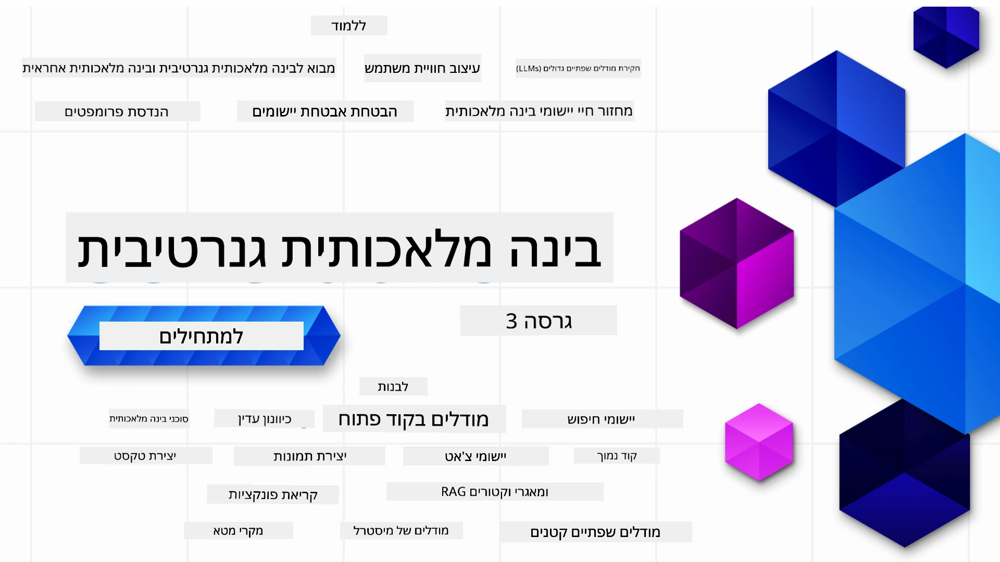

### 21 שיעורים המלמדים את כל מה שצריך לדעת כדי להתחיל לבנות יישומי בינה מלאכותית יצירתית

[](https://github.com/microsoft/Generative-AI-For-Beginners/blob/master/LICENSE?WT.mc_id=academic-105485-koreyst)
[](https://GitHub.com/microsoft/Generative-AI-For-Beginners/graphs/contributors/?WT.mc_id=academic-105485-koreyst)
[](https://GitHub.com/microsoft/Generative-AI-For-Beginners/issues/?WT.mc_id=academic-105485-koreyst)
[](https://GitHub.com/microsoft/Generative-AI-For-Beginners/pulls/?WT.mc_id=academic-105485-koreyst)
[](http://makeapullrequest.com?WT.mc_id=academic-105485-koreyst)

[](https://GitHub.com/microsoft/Generative-AI-For-Beginners/watchers/?WT.mc_id=academic-105485-koreyst)
[](https://GitHub.com/microsoft/Generative-AI-For-Beginners/network/?WT.mc_id=academic-105485-koreyst)
[](https://GitHub.com/microsoft/Generative-AI-For-Beginners/stargazers/?WT.mc_id=academic-105485-koreyst)

[](https://discord.gg/nTYy5BXMWG)

### 🌐 תמיכה ברב-לשוניות

#### נתמך באמצעות GitHub Action (מכונן אוטומטית ותמיד מעודכן)

<!-- CO-OP TRANSLATOR LANGUAGES TABLE START -->
[ערבית](../ar/README.md) | [בנגלית](../bn/README.md) | [בולגרית](../bg/README.md) | [בורמית (מיאנמר)](../my/README.md) | [סינית (מפושטת)](../zh-CN/README.md) | [סינית (מסורתית, הונג קונג)](../zh-HK/README.md) | [סינית (מסורתית, מקאו)](../zh-MO/README.md) | [סינית (מסורתית, טייוואן)](../zh-TW/README.md) | [קרואטית](../hr/README.md) | [צ'כית](../cs/README.md) | [דנית](../da/README.md) | [הולנדית](../nl/README.md) | [אסטונית](../et/README.md) | [פינית](../fi/README.md) | [צרפתית](../fr/README.md) | [גרמנית](../de/README.md) | [יוונית](../el/README.md) | [עברית](./README.md) | [הינדי](../hi/README.md) | [הונגרית](../hu/README.md) | [אינדונזית](../id/README.md) | [איטלקית](../it/README.md) | [יפנית](../ja/README.md) | [קאנדה](../kn/README.md) | [חמר](../km/README.md) | [קוריאנית](../ko/README.md) | [ליטאית](../lt/README.md) | [מלאית](../ms/README.md) | [מלאיאלאם](../ml/README.md) | [מרטהית](../mr/README.md) | [נפאלית](../ne/README.md) | [ניגרית פידג'ין](../pcm/README.md) | [נורווגית](../no/README.md) | [פרסית (פרסי)](../fa/README.md) | [פולנית](../pl/README.md) | [פורטוגזית (ברזיל)](../pt-BR/README.md) | [פורטוגזית (פורטוגל)](../pt-PT/README.md) | [פונג'בית (גורמוכי)](../pa/README.md) | [רומנית](../ro/README.md) | [רוסית](../ru/README.md) | [סרבית (קירילית)](../sr/README.md) | [סלובקית](../sk/README.md) | [סלובנית](../sl/README.md) | [ספרדית](../es/README.md) | [סוואהילי](../sw/README.md) | [שוודית](../sv/README.md) | [טגלוג (פיליפינית)](../tl/README.md) | [טמילית](../ta/README.md) | [טלווגו](../te/README.md) | [תאית](../th/README.md) | [טורקית](../tr/README.md) | [אוקראינית](../uk/README.md) | [אורדו](../ur/README.md) | [וייטנאמית](../vi/README.md)

> **מעדיפים לשכפל מקומית?**
>
> מאגר זה כולל למעלה מ-50 תרגומי שפות, מה שמגדיל משמעותית את גודל ההורדה. כדי לשכפל ללא תרגומים, השתמשו בספראס צ'קאאוט:
>
> **Bash / macOS / Linux:**
> ```bash
> git clone --filter=blob:none --sparse https://github.com/microsoft/generative-ai-for-beginners.git
> cd generative-ai-for-beginners
> git sparse-checkout set --no-cone '/*' '!translations' '!translated_images'
> ```
>
> **CMD (Windows):**
> ```cmd
> git clone --filter=blob:none --sparse https://github.com/microsoft/generative-ai-for-beginners.git
> cd generative-ai-for-beginners
> git sparse-checkout set --no-cone "/*" "!translations" "!translated_images"
> ```
>
> זה נותן לכם את כל מה שצריך כדי להשלים את הקורס עם הורדה מהירה יותר.
<!-- CO-OP TRANSLATOR LANGUAGES TABLE END -->

# בינה מלאכותית יצירתית למתחילים (גרסה 3) - קורס

למדו את יסודות בניית יישומי בינה מלאכותית יצירתית עם קורס מקיף של 21 שיעורים מבית Microsoft Cloud Advocates.

## 🌱 להתחלה

לקורס זה יש 21 שיעורים. כל שיעור מכסה נושא משלו, אז התחילו איפה שתרצו!

השיעורים מסומנים כשיעורי "למידה" שמסבירים מושג בבינה מלאכותית יצירתית או שיעורי "בניין" שמסבירים מושג ודוגמות קוד ב-**Python** ו-**TypeScript**, ככל שניתן.

למפתחי .NET מומלץ לבדוק את [בינה מלאכותית יצירתית למתחילים (מהדורת .NET)](https://github.com/microsoft/Generative-AI-for-beginners-dotnet?WT.mc_id=academic-105485-koreyst)!

כל שיעור כולל גם מדור "לשמור על למידה" עם כלים נוספים ללמידה.

## מה שצריך
### כדי להריץ את הקוד מהקורס, אפשר להשתמש באחד מהבאים: 
 - [שירות Azure OpenAI](https://aka.ms/genai-beginners/azure-open-ai?WT.mc_id=academic-105485-koreyst) - **שיעורים:** "aoai-assignment"
 - [קטלוג מודלים ב-GitHub Marketplace](https://aka.ms/genai-beginners/gh-models?WT.mc_id=academic-105485-koreyst) - **שיעורים:** "githubmodels"
 - [API של OpenAI](https://aka.ms/genai-beginners/open-ai?WT.mc_id=academic-105485-koreyst) - **שיעורים:** "oai-assignment" 
   
- ידע בסיסי בפייתון או ב-TypeScript הוא מועיל - \*למתחילים מוחלטים מומלץ לבדוק את הקורסים ב-[Python](https://aka.ms/genai-beginners/python?WT.mc_id=academic-105485-koreyst) ו-[TypeScript](https://aka.ms/genai-beginners/typescript?WT.mc_id=academic-105485-koreyst)
- חשבון GitHub כדי [למזלג את כל המאגר הזה](https://aka.ms/genai-beginners/github?WT.mc_id=academic-105485-koreyst) לחשבון שלכם

יצרנו שיעור **[הגדרת הקורס](./00-course-setup/README.md?WT.mc_id=academic-105485-koreyst)** שיעזור לכם בהקמת סביבת הפיתוח שלכם.

אל תשכחו [לתת כוכב (🌟) למאגר הזה](https://docs.github.com/en/get-started/exploring-projects-on-github/saving-repositories-with-stars?WT.mc_id=academic-105485-koreyst) כדי למצוא אותו בקלות בהמשך.

## 🧠 מוכנים לפריסה?

אם אתם מחפשים דוגמאות קוד מתקדמות יותר, בדקו את [אוסף דוגמאות הקוד לבינה מלאכותית יצירתית](https://aka.ms/genai-beg-code?WT.mc_id=academic-105485-koreyst) שלנו ב-**Python** ו-**TypeScript**.

## 🗣️ פגשו לומדים אחרים, קבלו תמיכה

הצטרפו ל-[שרת ה-Discord הרשמי של Azure AI Foundry](https://aka.ms/genai-discord?WT.mc_id=academic-105485-koreyst) כדי להכיר וליצור קשר עם לומדים אחרים שלוקחים את הקורס ולקבל סיוע.

שאלו שאלות או שתפו משוב מוצר ב-[פורום המפתחים של Azure AI Foundry](https://aka.ms/azureaifoundry/forum) ב-Github.

## 🚀 בונים סטארטאפ?

בקרו ב-[Microsoft for Startups](https://www.microsoft.com/startups) כדי לגלות איך להתחיל לבנות עם אשראי Azure היום.

## 🙏 רוצים לעזור?

יש לכם הצעות או מצאתם טעויות כתיב או קוד? [צרו נושא](https://github.com/microsoft/generative-ai-for-beginners/issues?WT.mc_id=academic-105485-koreyst) או [צור בקשת משיכה](https://github.com/microsoft/generative-ai-for-beginners/pulls?WT.mc_id=academic-105485-koreyst)

## 📂 כל שיעור כולל:

- הקדמה קצרה בווידאו לנושא
- שיעור כתוב שנמצא בקובץ README
- דוגמאות קוד בפייתון וב-TypeScript התומכות ב-Azure OpenAI ו-OpenAI API
- קישורים למשאבים נוספים להמשך הלמידה

## 🗃️ שיעורים

| #   | **קישור לשיעור**                                                                                                                              | **תיאור**                                                                                 | **וידאו**                                                                   | **למידה נוספת**                                                             |
| --- | -------------------------------------------------------------------------------------------------------------------------------------------- | ----------------------------------------------------------------------------------------- | --------------------------------------------------------------------------- | ----------------------------------------------------------------------------- |
| 00  | [הגדרת הקורס](./00-course-setup/README.md?WT.mc_id=academic-105485-koreyst)                                                                   | **ללמוד:** איך להגדיר את סביבת הפיתוח שלכם                                             | וידאו יגיע בקרוב                                                              | [למדו עוד](https://aka.ms/genai-collection?WT.mc_id=academic-105485-koreyst) |
| 01  | [מבוא לבינה מלאכותית יצירתית ולמודלים לשוניים גדולים](./01-introduction-to-genai/README.md?WT.mc_id=academic-105485-koreyst)                   | **ללמוד:** הבנת מהי בינה מלאכותית יצירתית ואיך מודלים לשוניים גדולים (LLMs) פועלים.    | [וידאו](https://aka.ms/gen-ai-lesson-1-gh?WT.mc_id=academic-105485-koreyst)  | [למדו עוד](https://aka.ms/genai-collection?WT.mc_id=academic-105485-koreyst) |
| 02  | [חקירת והשוואת מודלים לשוניים גדולים שונים](./02-exploring-and-comparing-different-llms/README.md?WT.mc_id=academic-105485-koreyst)            | **ללמוד:** איך לבחור את המודל המתאים למקרה השימוש שלכם                                | [וידאו](https://aka.ms/gen-ai-lesson2-gh?WT.mc_id=academic-105485-koreyst)   | [למדו עוד](https://aka.ms/genai-collection?WT.mc_id=academic-105485-koreyst) |
| 03  | [שימוש אחראי בבינה מלאכותית יצירתית](./03-using-generative-ai-responsibly/README.md?WT.mc_id=academic-105485-koreyst)                          | **ללמוד:** איך לבנות יישומי בינה מלאכותית יצירתית באחריות                             | [וידאו](https://aka.ms/gen-ai-lesson3-gh?WT.mc_id=academic-105485-koreyst)   | [למדו עוד](https://aka.ms/genai-collection?WT.mc_id=academic-105485-koreyst) |
| 04  | [הבנת יסודות הנדסת פרומפטים](./04-prompt-engineering-fundamentals/README.md?WT.mc_id=academic-105485-koreyst)             | **למד:** שיטות עבודה מומלצות מעשיות בהנדסת פרומפטים                                           | [וידאו](https://aka.ms/gen-ai-lesson4-gh?WT.mc_id=academic-105485-koreyst)  | [למידע נוסף](https://aka.ms/genai-collection?WT.mc_id=academic-105485-koreyst) |
| 05  | [יצירת פרומפטים מתקדמים](./05-advanced-prompts/README.md?WT.mc_id=academic-105485-koreyst)                                                | **למד:** כיצד ליישם טכניקות הנדסת פרומפטים המשפרות את התוצאה של הפרומפטים שלך. | [וידאו](https://aka.ms/gen-ai-lesson5-gh?WT.mc_id=academic-105485-koreyst)  | [למידע נוסף](https://aka.ms/genai-collection?WT.mc_id=academic-105485-koreyst) |
| 06  | [בניית אפליקציות ליצירת טקסט](./06-text-generation-apps/README.md?WT.mc_id=academic-105485-koreyst)                                | **בנה:** אפליקציית יצירת טקסט המשתמשת ב-Azure OpenAI / OpenAI API                               | [וידאו](https://aka.ms/gen-ai-lesson6-gh?WT.mc_id=academic-105485-koreyst)  | [למידע נוסף](https://aka.ms/genai-collection?WT.mc_id=academic-105485-koreyst) |
| 07  | [בניית אפליקציות צ'אט](./07-building-chat-applications/README.md?WT.mc_id=academic-105485-koreyst)                                     | **בנה:** טכניקות לבניית ואינטגרציה יעילה של אפליקציות צ'אט.                                     | [וידאו](https://aka.ms/gen-ai-lessons7-gh?WT.mc_id=academic-105485-koreyst) | [למידע נוסף](https://aka.ms/genai-collection?WT.mc_id=academic-105485-koreyst) |
| 08  | [בניית אפליקציות חיפוש ומסדי נתונים וקטוריים](./08-building-search-applications/README.md?WT.mc_id=academic-105485-koreyst)           | **בנה:** אפליקציית חיפוש המשתמשת בהטמעות (Embeddings) לחיפוש נתונים.                           | [וידאו](https://aka.ms/gen-ai-lesson8-gh?WT.mc_id=academic-105485-koreyst)  | [למידע נוסף](https://aka.ms/genai-collection?WT.mc_id=academic-105485-koreyst) |
| 09  | [בניית אפליקציות ליצירת תמונות](./09-building-image-applications/README.md?WT.mc_id=academic-105485-koreyst)                           | **בנה:** אפליקציית יצירת תמונות                                                    | [וידאו](https://aka.ms/gen-ai-lesson9-gh?WT.mc_id=academic-105485-koreyst)  | [למידע נוסף](https://aka.ms/genai-collection?WT.mc_id=academic-105485-koreyst) |
| 10  | [בניית אפליקציות AI בקוד נמוך](./10-building-low-code-ai-applications/README.md?WT.mc_id=academic-105485-koreyst)                        | **בנה:** אפליקציית בינה מלאכותית גנרטיבית באמצעות כלים לבניית קוד נמוך                            | [וידאו](https://aka.ms/gen-ai-lesson10-gh?WT.mc_id=academic-105485-koreyst) | [למידע נוסף](https://aka.ms/genai-collection?WT.mc_id=academic-105485-koreyst) |
| 11  | [אינטגרציה של אפליקציות חיצוניות עם קריאת פונקציות](./11-integrating-with-function-calling/README.md?WT.mc_id=academic-105485-koreyst) | **בנה:** מהי קריאת פונקציות ומקרי שימוש באפליקציות                                             | [וידאו](https://aka.ms/gen-ai-lesson11-gh?WT.mc_id=academic-105485-koreyst) | [למידע נוסף](https://aka.ms/genai-collection?WT.mc_id=academic-105485-koreyst) |
| 12  | [עיצוב UX לאפליקציות AI](./12-designing-ux-for-ai-applications/README.md?WT.mc_id=academic-105485-koreyst)                              | **למד:** כיצד ליישם עקרונות עיצוב UX בעת פיתוח אפליקציות בינה מלאכותית גנרטיבית                | [וידאו](https://aka.ms/gen-ai-lesson12-gh?WT.mc_id=academic-105485-koreyst) | [למידע נוסף](https://aka.ms/genai-collection?WT.mc_id=academic-105485-koreyst) |
| 13  | [אבטחת אפליקציות הבינה המלאכותית הגנרטיבית שלך](./13-securing-ai-applications/README.md?WT.mc_id=academic-105485-koreyst)                | **למד:** האיומים והסיכונים למערכות AI ודרכים לאבטחת מערכות אלו.                               | [וידאו](https://aka.ms/gen-ai-lesson13-gh?WT.mc_id=academic-105485-koreyst) | [למידע נוסף](https://aka.ms/genai-collection?WT.mc_id=academic-105485-koreyst) |
| 14  | [מחזור החיים של אפליקציית בינה מלאכותית גנרטיבית](./14-the-generative-ai-application-lifecycle/README.md?WT.mc_id=academic-105485-koreyst) | **למד:** הכלים והמדדים לניהול מחזור החיים של LLM ושל LLMOps                                    | [וידאו](https://aka.ms/gen-ai-lesson14-gh?WT.mc_id=academic-105485-koreyst) | [למידע נוסף](https://aka.ms/genai-collection?WT.mc_id=academic-105485-koreyst) |
| 15  | [יצירה משולבת עם אחזור (RAG) ומסדי נתונים וקטוריים](./15-rag-and-vector-databases/README.md?WT.mc_id=academic-105485-koreyst)            | **בנה:** אפליקציה המשתמשת במסגרת RAG לאחזור הטמעות ממסדי נתונים וקטוריים                        | [וידאו](https://aka.ms/gen-ai-lesson15-gh?WT.mc_id=academic-105485-koreyst) | [למידע נוסף](https://aka.ms/genai-collection?WT.mc_id=academic-105485-koreyst) |
| 16  | [מודלים בקוד פתוח ו-Hugging Face](./16-open-source-models/README.md?WT.mc_id=academic-105485-koreyst)                                    | **בנה:** אפליקציה המשתמשת במודלים בקוד פתוח הזמינים ב-Hugging Face                           | [וידאו](https://aka.ms/gen-ai-lesson16-gh?WT.mc_id=academic-105485-koreyst) | [למידע נוסף](https://aka.ms/genai-collection?WT.mc_id=academic-105485-koreyst) |
| 17  | [סוכני AI](./17-ai-agents/README.md?WT.mc_id=academic-105485-koreyst)                                                                       | **בנה:** אפליקציה המשתמשת במסגרת סוכן AI                                                    | [וידאו](https://aka.ms/gen-ai-lesson17-gh?WT.mc_id=academic-105485-koreyst) | [למידע נוסף](https://aka.ms/genai-collection?WT.mc_id=academic-105485-koreyst) |
| 18  | [כיוונון מדויק של LLMs](./18-fine-tuning/README.md?WT.mc_id=academic-105485-koreyst)                                                      | **למד:** מהו, מדוע וכיצד לבצע כיוונון מדויק ל-LLMs                                            | [וידאו](https://aka.ms/gen-ai-lesson18-gh?WT.mc_id=academic-105485-koreyst) | [למידע נוסף](https://aka.ms/genai-collection?WT.mc_id=academic-105485-koreyst) |
| 19  | [בנייה עם SLMs](./19-slm/README.md?WT.mc_id=academic-105485-koreyst)                                                                       | **למד:** היתרונות של בנייה עם מודלים שפתיים קטנים                                           | וידאו בקרוב | [למידע נוסף](https://aka.ms/genai-collection?WT.mc_id=academic-105485-koreyst) |
| 20  | [בנייה עם מודלי Mistral](./20-mistral/README.md?WT.mc_id=academic-105485-koreyst)                                                           | **למד:** התכונות וההבדלים של משפחות מודלי Mistral                                         | וידאו בקרוב | [למידע נוסף](https://aka.ms/genai-collection?WT.mc_id=academic-105485-koreyst) |
| 21  | [בנייה עם מודלי Meta](./21-meta/README.md?WT.mc_id=academic-105485-koreyst)                                                                 | **למד:** התכונות וההבדלים של משפחות מודלי Meta                                            | וידאו בקרוב | [למידע נוסף](https://aka.ms/genai-collection?WT.mc_id=academic-105485-koreyst) |

### 🌟 תודה מיוחדת

תודה מיוחדת ל-[**ג'ון עזיז**](https://www.linkedin.com/in/john0isaac/) על יצירת כל פעולות ה-GitHub והזרימות

[**ברנהרד מרקל**](https://www.linkedin.com/in/bernhard-merkle-738b73/) על תרומות מפתח לכל שיעור לשיפור חוויית הלמידה והקוד.

## 🎒 קורסים נוספים

הצוות שלנו מייצר קורסים נוספים! עיין ב:

<!-- CO-OP TRANSLATOR OTHER COURSES START -->
### LangChain
[](https://aka.ms/langchain4j-for-beginners)
[](https://aka.ms/langchainjs-for-beginners?WT.mc_id=m365-94501-dwahlin)
[](https://github.com/microsoft/langchain-for-beginners?WT.mc_id=m365-94501-dwahlin)
---

### Azure / Edge / MCP / סוכנים
[](https://github.com/microsoft/AZD-for-beginners?WT.mc_id=academic-105485-koreyst)
[](https://github.com/microsoft/edgeai-for-beginners?WT.mc_id=academic-105485-koreyst)
[](https://github.com/microsoft/mcp-for-beginners?WT.mc_id=academic-105485-koreyst)
[](https://github.com/microsoft/ai-agents-for-beginners?WT.mc_id=academic-105485-koreyst)

---

### סדרת בינה מלאכותית גנרטיבית
[](https://github.com/microsoft/generative-ai-for-beginners?WT.mc_id=academic-105485-koreyst)
[-9333EA?style=for-the-badge&labelColor=E5E7EB&color=9333EA)](https://github.com/microsoft/Generative-AI-for-beginners-dotnet?WT.mc_id=academic-105485-koreyst)
[-C084FC?style=for-the-badge&labelColor=E5E7EB&color=C084FC)](https://github.com/microsoft/generative-ai-for-beginners-java?WT.mc_id=academic-105485-koreyst)
[-E879F9?style=for-the-badge&labelColor=E5E7EB&color=E879F9)](https://github.com/microsoft/generative-ai-with-javascript?WT.mc_id=academic-105485-koreyst)

---
 
### לימוד ליבה
[](https://aka.ms/ml-beginners?WT.mc_id=academic-105485-koreyst)
[](https://aka.ms/datascience-beginners?WT.mc_id=academic-105485-koreyst)
[](https://aka.ms/ai-beginners?WT.mc_id=academic-105485-koreyst)
[](https://github.com/microsoft/Security-101?WT.mc_id=academic-96948-sayoung)
[](https://aka.ms/webdev-beginners?WT.mc_id=academic-105485-koreyst)
[](https://aka.ms/iot-beginners?WT.mc_id=academic-105485-koreyst)
[](https://github.com/microsoft/xr-development-for-beginners?WT.mc_id=academic-105485-koreyst)

---
 
### סדרת קופיילוט
[](https://aka.ms/GitHubCopilotAI?WT.mc_id=academic-105485-koreyst)
[](https://github.com/microsoft/mastering-github-copilot-for-dotnet-csharp-developers?WT.mc_id=academic-105485-koreyst)
[](https://github.com/microsoft/CopilotAdventures?WT.mc_id=academic-105485-koreyst)
<!-- CO-OP TRANSLATOR OTHER COURSES END -->

## לקבלת עזרה

אם נתקעת או יש לך שאלות לגבי בניית אפליקציות AI. הצטרף ללומדים אחרים ומפתחים מנוסים בדיונים על MCP. זוהי קהילה תומכת שבה שאלות מתקבלות בברכה והידע משתף בחופשיות.

[](https://discord.gg/nTYy5BXMWG)

אם יש לך משוב על המוצר או שגיאות בזמן הבנייה בקר:

[](https://aka.ms/foundry/forum)

---

<!-- CO-OP TRANSLATOR DISCLAIMER START -->
**כתב ויתור**:  
מסמך זה תורגם באמצעות שירות תרגום מבוסס בינה מלאכותית [Co-op Translator](https://github.com/Azure/co-op-translator). למרות שאנו שואפים לדיוק, יש לקחת בחשבון כי תרגומים אוטומטיים עשויים להכיל שגיאות או אי דיוקים. המסמך המקורי בשפת המקור שלו נחשב למקור הסמכותי. למידע קריטי מומלץ להשתמש בתרגום מקצועי על ידי אדם. אנו לא אחראים על אי הבנות או פרשנויות שגויות הנובעות מהשימוש בתרגום זה.
<!-- CO-OP TRANSLATOR DISCLAIMER END -->