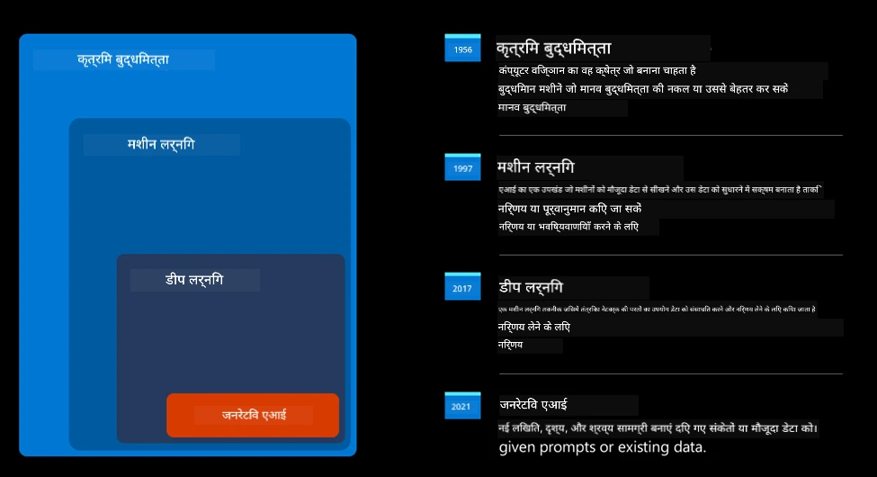
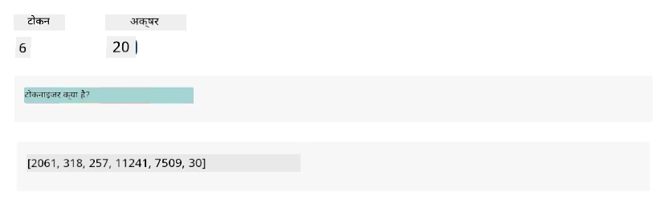
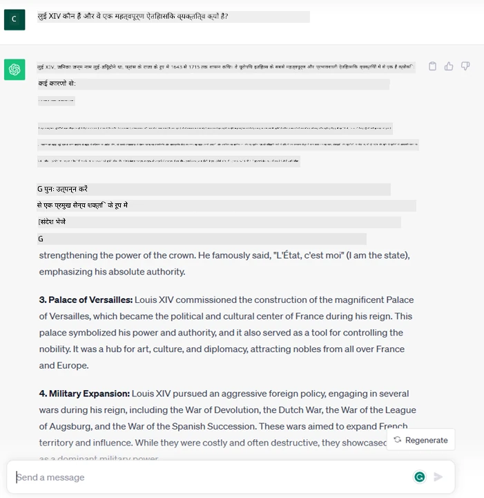
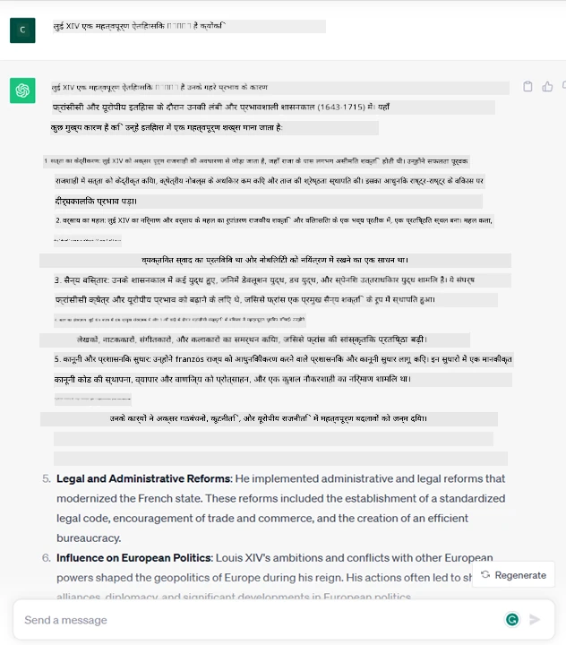
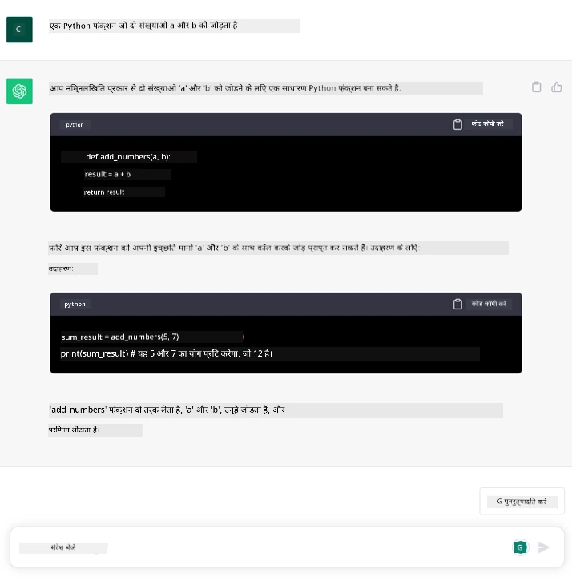

# जनरेटिव AI और बड़े भाषा मॉडल का परिचय

_(इस पाठ का वीडियो देखने के लिए ऊपर की छवि पर क्लिक करें)_

जनरेटिव AI वह कृत्रिम बुद्धिमत्ता है जो टेक्स्ट, छवियाँ और अन्य प्रकार की सामग्री उत्पन्न करने में सक्षम होती है। इसे एक शानदार तकनीक बनाने वाला तत्व यह है कि यह AI को लोकतांत्रिक बनाती है, कोई भी इसे एक सरल टेक्स्ट प्रॉम्प्ट या प्राकृतिक भाषा में लिखे गए एक वाक्य के साथ उपयोग कर सकता है। आपको जावास्क्रिप्ट या SQL जैसी भाषा सीखने की जरूरत नहीं है, जो कुछ भी उपयोगी करना हो, आप अपनी भाषा में कहें और AI मॉडल से सुझाव प्राप्त करें। इसके अनुप्रयोग और प्रभाव बहुत बड़े हैं, आप रिपोर्ट लिखें या समझें, एप्लिकेशन लिखें और बहुत कुछ, सब कुछ सेकंडों में।

इस पाठ्यक्रम में, हम देखेंगे कि हमारी स्टार्टअप जनरेटिव AI का उपयोग शिक्षा विश्व में नए परिदृश्यों को खोलने के लिए कैसे करती है और इसके सामाजिक प्रभावों और तकनीकी सीमाओं से जुड़ी अपरिहार्य चुनौतियों को कैसे संबोधित करती है।

## परिचय

यह पाठ निम्नलिखित विषयों को कवर करेगा:

- व्यवसाय परिदृश्य का परिचय: हमारी स्टार्टअप की अवधारणा और मिशन।
- जनरेटिव AI और वर्तमान तकनीकी परिदृश्य तक हमारी यात्रा।
- बड़े भाषा मॉडल का आंतरिक कार्य सिद्धांत।
- बड़े भाषा मॉडलों की मुख्य क्षमताएं और व्यावहारिक उपयोग के मामले।

## सीखने के लक्ष्य

इस पाठ को पूरा करने के बाद, आप समझ पाएंगे:

- जनरेटिव AI क्या है और बड़े भाषा मॉडल कैसे काम करते हैं।
- आप बड़े भाषा मॉडलों का उपयोग विभिन्न मामलों के लिए कैसे कर सकते हैं, खासकर शिक्षा के परिदृश्यों में।

## परिदृश्य: हमारी शैक्षिक स्टार्टअप

जनरेटिव कृत्रिम बुद्धिमत्ता (AI) AI तकनीक की चरम सीमा का प्रतिनिधित्व करती है, जो संभव लगने वाली सीमाओं को पार करती है। जनरेटिव AI मॉडल की कई क्षमताएं और अनुप्रयोग हैं, लेकिन इस पाठ्यक्रम के लिए हम देखेंगे कि यह शिक्षा में एक काल्पनिक स्टार्टअप के माध्यम से कैसे क्रांति ला रहा है। हम इस स्टार्टअप को _हमारी स्टार्टअप_ कहेंगे। हमारी स्टार्टअप शिक्षा क्षेत्र में काम करती है और इसका महत्त्वाकांक्षी मिशन है

> _अभिगम्यता में सुधार करना, वैश्विक स्तर पर सीखने में समान पहुंच सुनिश्चित करना और हर शिक्षार्थी को उनकी आवश्यकताओं के अनुसार व्यक्तिगत सीखने के अनुभव प्रदान करना।_

हमारी स्टार्टअप टीम जानती है कि हम इस उद्देश्य को बिना आधुनिकतम उपकरणों – बड़े भाषा मॉडलों (LLMs) – का उपयोग किए प्राप्त नहीं कर पाएंगे।

जनरेटिव AI अपेक्षित है कि आज के सीखने और पढ़ाने के तरीके में क्रांति लाएगा, जिसमें छात्र 24 घंटे आभासी शिक्षकों की सहायता प्राप्त कर सकेंगे जो विशाल जानकारी और उदाहरण देंगे, और शिक्षक नवीन उपकरणों का उपयोग कर अपने छात्रों का मूल्यांकन और प्रतिक्रिया दे सकेंगे।

शुरुआत करने के लिए, चलिए कुछ मूल अवधारणाओं और शब्दावली को परिभाषित करते हैं जो हम पूरे पाठ्यक्रम में उपयोग करेंगे।

## जनरेटिव AI तक हम कैसे पहुंचे?

हाल के समय में जनरेटिव AI मॉडलों की घोषणा से जो अपार _हाइप_ बना है, उस तकनीक के पीछे दशकों की रिसर्च है, जिसकी शुरुआत 60 के दशक में हुई थी। आज हम AI के उस स्तर पर हैं जिसमें यह मानवीय संज्ञानात्मक क्षमताएँ रखता है, जैसे कि वार्तालाप, जैसा कि उदाहरण के लिए [OpenAI ChatGPT](https://openai.com/chatgpt) या [Microsoft Copilot](https://copilot.microsoft.com/?WT.mc_id=academic-105485-koreyst) द्वारा दिखाया गया है, जो GPT मॉडल का उपयोग अपने संवादात्मक वेब खोज अनुभव के लिए करता है।

पहले के AI प्रोटोटाइप टाइपराइटर चैटबोट्स होते थे, जो विशेषज्ञों के ज्ञान आधार पर काम करते थे, जो कंप्यूटर में संग्रहित था। इनका उत्तर ज्ञान आधार में उपस्थित कीवर्ड्स से प्रेरित होता था।
हालांकि, जल्द ही स्पष्ट हो गया कि इस प्रकार के टाइपराइटर चैटबोट्स का पैमाना बढ़ाना संभव नहीं था।

### AI के लिए सांख्यिकीय दृष्टिकोण: मशीन लर्निंग

90 के दशक में टेक्स्ट विश्लेषण के लिए सांख्यिकीय दृष्टिकोण के उपयोग से एक मील का पत्थर आया। इससे मशीन लर्निंग नामक नए एल्गोरिदम विकसित हुए, जो डेटा से पैटर्न सीख सकते हैं बिना स्पष्ट रूप से प्रोग्राम किए। यह दृष्टिकोण मशीनों को मानव भाषा की समझ का अनुकरण करने की क्षमता देता है: एक सांख्यिकीय मॉडल को टेक्स्ट-लेबल जोड़े पर प्रशिक्षित किया जाता है, जिससे यह अज्ञात इनपुट टेक्स्ट को पूर्वनिर्धारित लेबल के साथ वर्गीकृत कर सके जो संदेश के इरादे को दर्शाता है।

### न्यूरल नेटवर्क्स और आधुनिक वर्चुअल असिस्टेंट्स

हाल के वर्षों में, बड़े डेटा और जटिल गणनाओं को संभालने में सक्षम हार्डवेयर के तकनीकी विकास ने AI अनुसंधान को प्रोत्साहित किया, जिसके फलस्वरूप उन्नत मशीन लर्निंग एल्गोरिदम विकसित हुए जिन्हें न्यूरल नेटवर्क्स या डीप लर्निंग एल्गोरिदम कहा जाता है।

न्यूरल नेटवर्क्स (विशेषकर रिकरेंट न्यूरल नेटवर्क्स – RNNs) ने प्राकृतिक भाषा प्रसंस्करण को काफी बढ़ाया, जिससे शब्दों के संदर्भ को ध्यान में रखते हुए टेक्स्ट के अर्थ को अधिक अर्थपूर्ण तरीके से प्रस्तुत किया जा सके।

यही तकनीक है जिसने नए सदी के पहले दशक में जन्मे वर्चुअल असिस्टेंट्स को सक्षम किया, जो मानव भाषा को अच्छी तरह से समझते हैं, जरूरत पहचानते हैं और उसे पूरा करने के लिए क्रिया करते हैं – जैसे पूर्वनिर्धारित स्क्रिप्ट से उत्तर देना या तृतीय पक्ष सेवा का उपयोग करना।

### वर्तमान काल, जनरेटिव AI

इसी प्रकार हम आज के जनरेटिव AI तक पहुंचे हैं, जिसे डीप लर्निंग की एक उपश्रेणी के रूप में देखा जा सकता है।

दशकों की AI अनुसंधान के बाद, एक नया मॉडल आर्किटेक्चर – जिसे _Transformer_ कहा जाता है – RNNs की सीमाओं को पार कर गया, जो बहुत लंबे टेक्स्ट अनुक्रम को इनपुट के रूप में ग्रहण कर सकता है। ट्रांसफॉर्मर ध्यान मेकैनिज्म पर आधारित हैं, जो मॉडल को उसे प्राप्त इनपुट्स को अलग-अलग वजन देने में सक्षम बनाता है, जहां सबसे प्रासंगिक जानकारी केंद्रित हो वहां ‘अधिक ध्यान’ देकर, उनके अनुक्रम में क्रम की परवाह किए बिना।

हाल के अधिकांश जनरेटिव AI मॉडल – जिन्हें बड़े भाषा मॉडल (LLMs) भी कहा जाता है, क्योंकि ये टेक्स्ट इनपुट और आउटपुट के साथ काम करते हैं – वास्तव में इस आर्किटेक्चर पर आधारित हैं। इन मॉडलों की सबसे दिलचस्प बात यह है कि इन्हें पुस्तकों, लेखों और वेबसाइटों जैसे विविध स्रोतों से विशाल मात्रा में बिना लेबलेड डेटा पर प्रशिक्षित किया गया है, जिसके कारण वे विभिन्न कार्यों के लिए अनुकूलित किए जा सकते हैं और रचनात्मकता के समान प्रभाव के साथ व्याकरणिक रूप से सही टेक्स्ट उत्पन्न कर सकते हैं। इसलिए, इन्होने मशीन की 'समझ' क्षमता को न केवल अभूतपूर्व रूप से बढ़ाया है, बल्कि इनकी क्षमता को भी सशक्त किया है कि वे मानव भाषा में मूल प्रतिक्रिया उत्पन्न कर सकें।

## बड़े भाषा मॉडल कैसे काम करते हैं?

अगले अध्याय में हम जनरेटिव AI के विभिन्न प्रकार के मॉडल्स को एक्सप्लोर करेंगे, लेकिन अभी के लिए आइए बड़े भाषा मॉडलों के कार्य सिद्धांत को देखें, खासकर OpenAI GPT (जनरेटिव प्री-ट्रेन्ड ट्रांसफॉर्मर) मॉडल पर ध्यान केंद्रित करते हुए।

- **टोकिनाइज़र, टेक्स्ट को संख्याओं में बदलना**: बड़े भाषा मॉडल टेक्स्ट को इनपुट के रूप में लेते हैं और टेक्स्ट आउटपुट उत्पन्न करते हैं। हालांकि, ये सांख्यिकीय मॉडल हैं, इसलिए ये टेक्स्ट अनुक्रम की तुलना में नंबरों के साथ बेहतर काम करते हैं। इसलिए मॉडल को दिया गया हर इनपुट टोकिनाइज़र के माध्यम से संसाधित किया जाता है। एक टोकन टेक्स्ट का एक टुकड़ा होता है – जिसमें चरित्रों की संख्या बदलती रहती है, इसलिए टोकिनाइज़र का मुख्य कार्य इनपुट को टोकन्स के सरणी में विभाजित करना है। फिर, हर टोकन को उसके टोकन इंडेक्स के साथ मैप किया जाता है, जो मूल टेक्स्ट टुकड़े का पूर्णांक एन्कोडिंग होता है।

- **आउटपुट टोकन्स की भविष्यवाणी**: n टोकन इनपुट के रूप में दिए जाने पर (जहाँ अधिकतम n मॉडल से मॉडल तक भिन्न होता है), मॉडल एक टोकन को आउटपुट के रूप में भविष्यवाणी कर सकता है। यह टोकन फिर अगले पुनरावृत्ति में इनपुट में शामिल कर दिया जाता है, एक विस्तारशील विंडो पैटर्न में, जिससे उपयोगकर्ता को एक (या अधिक) वाक्य का उत्तर मिलने का बेहतर अनुभव होता है। यही कारण है कि यदि आपने कभी ChatGPT के साथ प्रयोग किया है, तो आपने देखा होगा कि कभी-कभी यह वाक्य के बीच में रूक जाता है।

- **चयन प्रक्रिया, संभाव्यता वितरण**: आउटपुट टोकन को मॉडल उसकी संभाव्यता के आधार पर चुना जाता है कि वर्तमान टेक्स्ट अनुक्रम के बाद वह टोकन कितनी संभावना से आएगा। यह इसलिए क्योंकि मॉडल सभी संभावित 'अगले टोकन्स' पर संभाव्यता वितरण की भविष्यवाणी करता है, जो इसके प्रशिक्षण पर आधारित होती है। हालांकि, हमेशा उच्चतम संभाव्यता वाला टोकन चयनित नहीं होता। इस चुनाव में यादृच्छिकता की एक मात्रा जोड़ी जाती है, ताकि मॉडल एक गैर-निर्दिष्ट तरीके से कार्य करे - एक ही इनपुट पर हमें समान आउटपुट न मिले। यह यादृच्छिकता रचनात्मक सोच की प्रक्रिया का अनुकरण करती है और इसे एक मॉडल पैरामीटर जिसे तापमान कहा जाता है, द्वारा समायोजित किया जा सकता है।

## हमारी स्टार्टअप बड़े भाषा मॉडल का कैसे उपयोग कर सकती है?

अब जब हमें बड़े भाषा मॉडल के आंतरिक कार्यों की बेहतर समझ हो गई है, तो आइए कुछ व्यावहारिक उदाहरण देखें कि ये मॉडल आमतौर पर किन कार्यों को अच्छी तरह कर सकते हैं, हमारे व्यावसायिक परिदृश्य की दृष्टि से।
हमने कहा कि बड़े भाषा मॉडल की मुख्य क्षमता है _प्राकृतिक भाषा में लिखे गए टेक्स्ट इनपुट से नई टेक्स्ट उत्पन्न करना_।

लेकिन किस प्रकार के टेक्स्ट इनपुट और आउटपुट?
बड़े भाषा मॉडल के इनपुट को प्रॉम्प्ट कहा जाता है, जबकि आउटपुट को कॉम्प्लीशन कहा जाता है, जो मॉडल की उस प्रक्रिया को दर्शाता है जिसमें वह अगले टोकन को उत्पन्न करता है ताकि वर्तमान इनपुट पूरा हो सके। हम प्रॉम्प्ट क्या होता है और इसे इस तरह डिजाइन करने पर गहराई से विचार करेंगे जिससे मॉडल से अधिकतम लाभ उठाया जा सके। अब के लिए, इसे इस प्रकार समझिए कि प्रॉम्प्ट में शामिल हो सकता है:

- एक **निर्देश** जो मॉडल से अपेक्षित आउटपुट के प्रकार को बताता है। यह निर्देश कभी-कभी कुछ उदाहरण या अतिरिक्त डेटा भी शामिल कर सकता है।

  1. किसी लेख, पुस्तक, उत्पाद समीक्षाओं आदि का सारांश, साथ ही असंरचित डेटा से जानकारी निकालना।
    
    
  
  2. किसी लेख, निबंध, असाइनमेंट या अन्य का रचनात्मक विचार और डिज़ाइन।
      
     

- एक **प्रश्न**, जो एजेंट के साथ बातचीत के रूप में पूछा गया हो।
  
  

- एक **टेक्स्ट का टुकड़ा जिसे पूरा करना है**, जो अप्रत्यक्ष रूप से लेखन सहायता की मांग करता है।
  
  

- एक **कोड का टुकड़ा** साथ ही उसे समझाने और दस्तावेज़ित करने या किसी विशेष कार्य को करने वाला कोड जेनरेट करने के लिए अनुरोध।
  
  

ऊपर दिए गए उदाहरण काफी सरल हैं और बड़े भाषा मॉडलों की क्षमताओं का संपूर्ण प्रदर्शन करने के लिए नहीं हैं। ये जनरेटिव AI के, विशेष रूप से लेकिन केवल शैक्षिक संदर्भों तक सीमित नहीं, उपयोग की संभावनाओं को दिखाने के लिए हैं।

साथ ही, जनरेटिव AI मॉडल का आउटपुट संपूर्ण रूप से सही नहीं होता और कभी-कभी मॉडल की रचनात्मकता उसके खिलाफ काम कर सकती है, जिससे आउटपुट ऐसा होता है जिसे मानव उपयोगकर्ता वास्तविकता का भ्रम समझ सकता है या वह आपत्तिजनक हो सकता है। जनरेटिव AI बुद्धिमान नहीं है - कम से कम बुद्धिमत्ता की व्यापक परिभाषा (जिसमें आलोचनात्मक और रचनात्मक तर्क या भावनात्मक बुद्धिमत्ता शामिल है) में नहीं; यह निश्चित नहीं है, और भरोसेमंद नहीं है, क्योंकि गलत संदर्भ, सामग्री और कथन सही जानकारी के साथ संयोजन में प्रस्तुत किए जा सकते हैं, और प्रभावशाली और आत्मविश्वासी तरीके से। आने वाले पाठों में, हम इन सभी सीमाओं से निपटेंगे और देखेंगे कि हम उन्हें कम करने के लिए क्या कर सकते हैं।

## असाइनमेंट

आपका असाइनमेंट है कि [जनरेटिव AI](https://en.wikipedia.org/wiki/Generative_artificial_intelligence?WT.mc_id=academic-105485-koreyst) पर और पढ़ें और एक ऐसा क्षेत्र खोजें जहाँ आप आज जनरेटिव AI जोड़ना चाहेंगे जो अभी नहीं है। "पुराने तरीके" से करने की तुलना में प्रभाव कैसा होगा, क्या आप कुछ ऐसा कर पाएंगे जो पहले नहीं कर सकते थे, या क्या आप तेज़ होंगे? 300 शब्दों में एक सारांश लिखें कि आपका सपनों का AI स्टार्टअप कैसा होगा और उसमें "समस्या", "मैं AI का उपयोग कैसे करूंगा", "प्रभाव" जैसे शीर्षक शामिल करें और वैकल्पिक रूप से एक व्यवसाय योजना भी जोड़ें।

यदि आपने यह कार्य किया, तो आप माइक्रोसॉफ्ट के इन्क्यूबेटर [Microsoft for Startups Founders Hub](https://www.microsoft.com/startups?WT.mc_id=academic-105485-koreyst) में आवेदन करने के लिए तैयार भी हो सकते हैं। हम Azure, OpenAI, मेंटरिंग और बहुत कुछ के लिए क्रेडिट प्रदान करते हैं, इसे जरूर देखें!

## ज्ञान जांच

बड़े भाषा मॉडलों के बारे में क्या सही है?

1. आपको हर बार बिल्कुल वही प्रतिक्रिया मिलती है।
1. यह चीजें पूरी तरह से सही करता है, जैसे नंबर जोड़ना, काम करने वाला कोड बनाना आदि।
1. प्रतिक्रिया एक ही प्रॉम्प्ट के बावजूद भी बदल सकती है। यह आपको किसी चीज़ का पहला मसौदा देने में भी बहुत अच्छा है, चाहे वह टेक्स्ट हो या कोड। लेकिन आपको परिणामों में सुधार करना होगा।

उत्तर: 3, एक LLM गैर-निर्धारित होता है, प्रतिक्रिया बदलती रहती है, हालांकि आप इसके विचरण को तापमान सेटिंग के माध्यम से नियंत्रित कर सकते हैं। आप यह भी उम्मीद न करें कि यह चीजें पूरी तरह से सही करेगा, यह आपके लिए भारी काम करता है जो अक्सर आपको किसी चीज़ का अच्छा पहला प्रयास देता है जिसे आपको धीरे-धीरे बेहतर बनाना होता है।

## उत्कृष्ट कार्य! यात्रा जारी रखें

इस पाठ को पूरा करने के बाद, हमारे [जनरेटिव AI सीखने का संग्रह](https://aka.ms/genai-collection?WT.mc_id=academic-105485-koreyst) को देखें ताकि आप अपनी जनरेटिव AI ज्ञान को अगले स्तर पर ले जा सकें!

लेसन 2 पर जाएं जहाँ हम देखेंगे कि कैसे [विभिन्न LLM प्रकारों का अन्वेषण और तुलना करें](../02-exploring-and-comparing-different-llms/README.md?WT.mc_id=academic-105485-koreyst)!

---

<!-- CO-OP TRANSLATOR DISCLAIMER START -->
**अस्वीकरण**:
इस दस्तावेज़ का अनुवाद AI अनुवाद सेवा [Co-op Translator](https://github.com/Azure/co-op-translator) का उपयोग करके किया गया है। जबकि हम सटीकता के लिए प्रयास करते हैं, कृपया ध्यान दें कि स्वचालित अनुवादों में त्रुटियाँ या अशुद्धियाँ हो सकती हैं। मूल दस्तावेज़ अपनी मूल भाषा में ही प्रामाणिक स्रोत माना जाना चाहिए। महत्वपूर्ण जानकारी के लिए, पेशेवर मानव अनुवाद की सिफारिश की जाती है। इस अनुवाद के उपयोग से उत्पन्न किसी भी गलतफहमी या गलत व्याख्या के लिए हम उत्तरदायी नहीं हैं।
<!-- CO-OP TRANSLATOR DISCLAIMER END -->