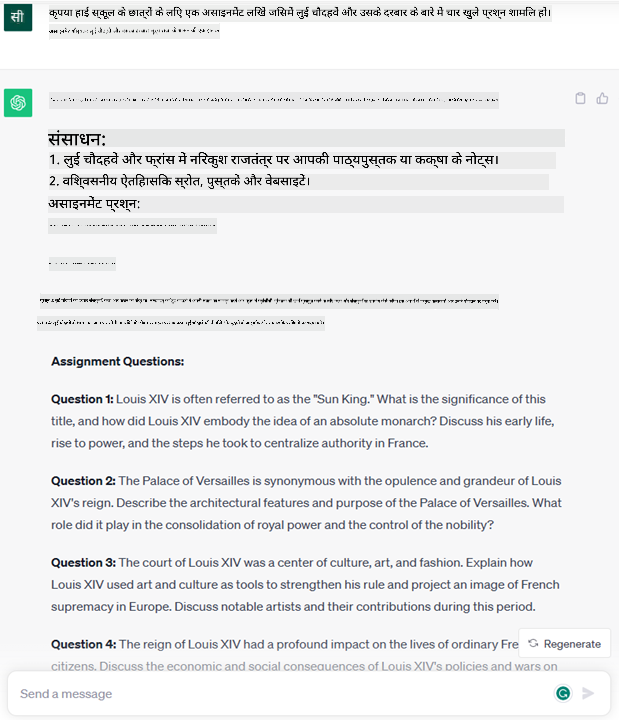
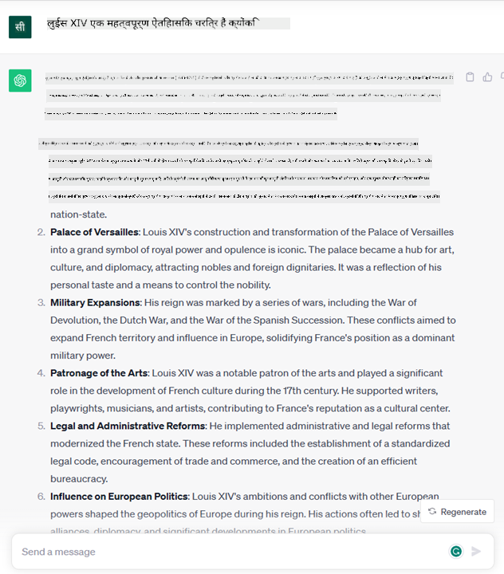

<!--
CO_OP_TRANSLATOR_METADATA:
{
  "original_hash": "bfb7901bdbece1ba3e9f35c400ca33e8",
  "translation_date": "2025-10-18T00:17:56+00:00",
  "source_file": "01-introduction-to-genai/README.md",
  "language_code": "hi"
}
-->
# जनरेटिव एआई और बड़े भाषा मॉडल का परिचय

_(इस पाठ का वीडियो देखने के लिए ऊपर दी गई छवि पर क्लिक करें)_

जनरेटिव एआई एक कृत्रिम बुद्धिमत्ता है जो टेक्स्ट, छवियां और अन्य प्रकार की सामग्री उत्पन्न करने में सक्षम है। इसे एक शानदार तकनीक बनाता है कि यह एआई को लोकतांत्रिक बनाता है, कोई भी इसे केवल एक टेक्स्ट प्रॉम्प्ट, एक प्राकृतिक भाषा में लिखे गए वाक्य के साथ उपयोग कर सकता है। आपको कुछ उपयोगी हासिल करने के लिए जावा या SQL जैसी भाषा सीखने की आवश्यकता नहीं है, आपको केवल अपनी भाषा का उपयोग करना है, जो आप चाहते हैं उसे बताना है और एआई मॉडल से एक सुझाव प्राप्त होता है। इसके अनुप्रयोग और प्रभाव बहुत बड़े हैं, आप रिपोर्ट लिख सकते हैं या समझ सकते हैं, एप्लिकेशन लिख सकते हैं और बहुत कुछ, वह भी कुछ ही सेकंड में।

इस पाठ्यक्रम में, हम यह जानेंगे कि हमारा स्टार्टअप शिक्षा की दुनिया में नए परिदृश्यों को खोलने के लिए जनरेटिव एआई का उपयोग कैसे करता है और इसके अनुप्रयोग और तकनीकी सीमाओं के सामाजिक प्रभावों से जुड़े अनिवार्य चुनौतियों का सामना कैसे करता है।

## परिचय

यह पाठ कवर करेगा:

- व्यावसायिक परिदृश्य का परिचय: हमारा स्टार्टअप विचार और मिशन।
- जनरेटिव एआई और कैसे हमने वर्तमान तकनीकी परिदृश्य पर पहुंच बनाई।
- बड़े भाषा मॉडल का आंतरिक कार्य।
- बड़े भाषा मॉडल की मुख्य क्षमताएं और व्यावहारिक उपयोग के मामले।

## सीखने के लक्ष्य

इस पाठ को पूरा करने के बाद, आप समझेंगे:

- जनरेटिव एआई क्या है और बड़े भाषा मॉडल कैसे काम करते हैं।
- आप बड़े भाषा मॉडल का विभिन्न उपयोग के मामलों के लिए कैसे उपयोग कर सकते हैं, विशेष रूप से शिक्षा परिदृश्यों पर ध्यान केंद्रित करते हुए।

## परिदृश्य: हमारा शैक्षिक स्टार्टअप

जनरेटिव कृत्रिम बुद्धिमत्ता (एआई) एआई तकनीक की पराकाष्ठा का प्रतिनिधित्व करती है, जो कभी असंभव माने जाने वाले सीमाओं को आगे बढ़ा रही है। जनरेटिव एआई मॉडल में कई क्षमताएं और अनुप्रयोग हैं, लेकिन इस पाठ्यक्रम के लिए हम एक काल्पनिक स्टार्टअप के माध्यम से शिक्षा में इसके क्रांतिकारी प्रभाव का पता लगाएंगे। हम इस स्टार्टअप को _हमारा स्टार्टअप_ कहेंगे। हमारा स्टार्टअप शिक्षा क्षेत्र में काम करता है और इसका महत्वाकांक्षी मिशन है:

> _वैश्विक स्तर पर सीखने में पहुंच को बेहतर बनाना, शिक्षा तक समान पहुंच सुनिश्चित करना और प्रत्येक शिक्षार्थी की आवश्यकताओं के अनुसार व्यक्तिगत सीखने के अनुभव प्रदान करना।_

हमारे स्टार्टअप टीम को पता है कि हम इस लक्ष्य को आधुनिक समय के सबसे शक्तिशाली उपकरणों में से एक – बड़े भाषा मॉडल (LLMs) – का उपयोग किए बिना हासिल नहीं कर पाएंगे।

जनरेटिव एआई आज के समय में सीखने और पढ़ाने के तरीके को बदलने की उम्मीद है, जिसमें छात्रों के पास 24 घंटे उपलब्ध वर्चुअल शिक्षक होंगे जो बड़ी मात्रा में जानकारी और उदाहरण प्रदान करेंगे, और शिक्षक अपने छात्रों का मूल्यांकन करने और प्रतिक्रिया देने के लिए नवीन उपकरणों का उपयोग कर सकेंगे।

शुरू करने के लिए, आइए कुछ बुनियादी अवधारणाओं और शब्दावली को परिभाषित करें जिन्हें हम पूरे पाठ्यक्रम में उपयोग करेंगे।

## हमें जनरेटिव एआई कैसे मिला?

हाल ही में जनरेटिव एआई मॉडल की घोषणा से उत्पन्न असाधारण _हाइप_ के बावजूद, यह तकनीक दशकों से विकसित हो रही है, जिसकी पहली शोध प्रयास 60 के दशक में शुरू हुई थी। अब हम एक ऐसे बिंदु पर हैं जहां एआई में मानव संज्ञानात्मक क्षमताएं हैं, जैसे कि बातचीत, जैसा कि उदाहरण के लिए [OpenAI ChatGPT](https://openai.com/chatgpt) या [Bing Chat](https://www.microsoft.com/edge/features/bing-chat?WT.mc_id=academic-105485-koreyst) द्वारा दिखाया गया है, जो वेब सर्च Bing बातचीत के लिए GPT मॉडल का उपयोग करता है।

थोड़ा पीछे हटते हुए, एआई के पहले प्रोटोटाइप टाइपराइटन चैटबॉट्स से बने थे, जो विशेषज्ञों के एक समूह से निकाले गए ज्ञान आधार पर निर्भर थे और कंप्यूटर में प्रस्तुत किए गए थे। ज्ञान आधार में उत्तर इनपुट टेक्स्ट में दिखाई देने वाले कीवर्ड द्वारा ट्रिगर किए गए थे। हालांकि, जल्द ही यह स्पष्ट हो गया कि इस तरह का दृष्टिकोण, टाइपराइटन चैटबॉट्स का उपयोग करते हुए, अच्छी तरह से स्केल नहीं करता।

### एआई के लिए सांख्यिकीय दृष्टिकोण: मशीन लर्निंग

90 के दशक में एक महत्वपूर्ण मोड़ आया, जब टेक्स्ट विश्लेषण पर सांख्यिकीय दृष्टिकोण लागू किया गया। इससे नए एल्गोरिदम – जिन्हें मशीन लर्निंग कहा जाता है – विकसित हुए, जो डेटा से पैटर्न सीखने में सक्षम थे बिना स्पष्ट रूप से प्रोग्राम किए। इस दृष्टिकोण ने मशीनों को मानव भाषा समझने का अनुकरण करने की अनुमति दी: एक सांख्यिकीय मॉडल को टेक्स्ट-लेबल पेयरिंग पर प्रशिक्षित किया गया, जिससे मॉडल को एक पूर्व-निर्धारित लेबल के साथ अज्ञात इनपुट टेक्स्ट को वर्गीकृत करने में सक्षम बनाया गया।

### न्यूरल नेटवर्क और आधुनिक वर्चुअल असिस्टेंट

हाल के वर्षों में, हार्डवेयर का तकनीकी विकास, जो बड़े डेटा और अधिक जटिल गणनाओं को संभालने में सक्षम है, ने एआई में अनुसंधान को प्रोत्साहित किया, जिससे न्यूरल नेटवर्क या डीप लर्निंग एल्गोरिदम के रूप में जाने जाने वाले उन्नत मशीन लर्निंग एल्गोरिदम का विकास हुआ।

न्यूरल नेटवर्क (और विशेष रूप से रिकरेंट न्यूरल नेटवर्क – RNNs) ने प्राकृतिक भाषा प्रसंस्करण को काफी बढ़ाया, जिससे वाक्य में शब्द के संदर्भ को महत्व देते हुए टेक्स्ट के अर्थ को अधिक सार्थक तरीके से प्रस्तुत करना संभव हुआ।

यह वह तकनीक है जिसने नए सदी के पहले दशक में जन्मे वर्चुअल असिस्टेंट को शक्ति दी, जो मानव भाषा की व्याख्या करने, एक आवश्यकता की पहचान करने और इसे पूरा करने के लिए कार्रवाई करने में बहुत कुशल थे – जैसे कि पूर्व-निर्धारित स्क्रिप्ट के साथ उत्तर देना या किसी तीसरे पक्ष की सेवा का उपयोग करना।

### वर्तमान समय, जनरेटिव एआई

तो इस प्रकार हम आज के जनरेटिव एआई तक पहुंचे, जिसे डीप लर्निंग का एक उपसमूह माना जा सकता है।

एआई क्षेत्र में दशकों के शोध के बाद, एक नए मॉडल आर्किटेक्चर – जिसे _ट्रांसफॉर्मर_ कहा जाता है – ने RNNs की सीमाओं को पार कर लिया, जिससे टेक्स्ट के बहुत लंबे अनुक्रमों को इनपुट के रूप में प्राप्त करना संभव हुआ। ट्रांसफॉर्मर ध्यान तंत्र पर आधारित हैं, जो मॉडल को प्राप्त इनपुट को अलग-अलग वजन देने में सक्षम बनाता है, 'सबसे प्रासंगिक जानकारी' पर अधिक ध्यान केंद्रित करता है, चाहे वे टेक्स्ट अनुक्रम में किसी भी क्रम में हों।

अधिकांश हाल के जनरेटिव एआई मॉडल – जिन्हें बड़े भाषा मॉडल (LLMs) भी कहा जाता है, क्योंकि वे टेक्स्ट इनपुट और आउटपुट के साथ काम करते हैं – वास्तव में इस आर्किटेक्चर पर आधारित हैं। इन मॉडलों के बारे में दिलचस्प बात यह है कि – जो किताबों, लेखों और वेबसाइटों जैसे विविध स्रोतों से बड़ी मात्रा में बिना लेबल वाले डेटा पर प्रशिक्षित होते हैं – वे विभिन्न कार्यों के लिए अनुकूलित किए जा सकते हैं और रचनात्मकता की झलक के साथ व्याकरणिक रूप से सही टेक्स्ट उत्पन्न कर सकते हैं। तो, उन्होंने न केवल मशीन की क्षमता को 'समझने' के लिए अविश्वसनीय रूप से बढ़ाया है, बल्कि उन्होंने मानव भाषा में एक मूल प्रतिक्रिया उत्पन्न करने की क्षमता को सक्षम किया है।

## बड़े भाषा मॉडल कैसे काम करते हैं?

अगले अध्याय में हम जनरेटिव एआई मॉडलों के विभिन्न प्रकारों का पता लगाएंगे, लेकिन अभी के लिए आइए देखें कि बड़े भाषा मॉडल कैसे काम करते हैं, विशेष रूप से OpenAI GPT (जनरेटिव प्री-ट्रेंड ट्रांसफॉर्मर) मॉडलों पर ध्यान केंद्रित करते हुए।

- **टोकनाइज़र, टेक्स्ट को नंबर में बदलना**: बड़े भाषा मॉडल टेक्स्ट को इनपुट के रूप में प्राप्त करते हैं और टेक्स्ट को आउटपुट के रूप में उत्पन्न करते हैं। हालांकि, सांख्यिकीय मॉडल होने के कारण, वे टेक्स्ट अनुक्रमों की तुलना में नंबरों के साथ बेहतर काम करते हैं। यही कारण है कि मॉडल के मुख्य भाग द्वारा उपयोग किए जाने से पहले हर इनपुट को एक टोकनाइज़र द्वारा संसाधित किया जाता है। एक टोकन टेक्स्ट का एक हिस्सा होता है – जिसमें चरित्रों की एक परिवर्तनीय संख्या होती है, इसलिए टोकनाइज़र का मुख्य कार्य इनपुट को टोकन के एक सरणी में विभाजित करना है। फिर, प्रत्येक टोकन को एक टोकन इंडेक्स के साथ मैप किया जाता है, जो मूल टेक्स्ट हिस्से का पूर्णांक एन्कोडिंग होता है।

- **आउटपुट टोकन की भविष्यवाणी करना**: n टोकन को इनपुट के रूप में देने पर (n की अधिकतम सीमा मॉडल से मॉडल में भिन्न होती है), मॉडल एक टोकन को आउटपुट के रूप में भविष्यवाणी करने में सक्षम होता है। यह टोकन फिर अगले पुनरावृत्ति के इनपुट में शामिल किया जाता है, एक विस्तारित विंडो पैटर्न में, एक बेहतर उपयोगकर्ता अनुभव को सक्षम करता है जिसमें एक (या कई) वाक्य उत्तर के रूप में प्राप्त होता है। यही कारण है कि, यदि आपने कभी ChatGPT के साथ खेला है, तो आपने देखा होगा कि कभी-कभी ऐसा लगता है कि यह वाक्य के बीच में रुक जाता है।

- **चयन प्रक्रिया, संभावना वितरण**: आउटपुट टोकन को मॉडल द्वारा वर्तमान टेक्स्ट अनुक्रम के बाद होने की संभावना के अनुसार चुना जाता है। ऐसा इसलिए है क्योंकि मॉडल अपने प्रशिक्षण के आधार पर सभी संभावित 'अगले टोकन' पर एक संभावना वितरण की भविष्यवाणी करता है। हालांकि, हमेशा सबसे अधिक संभावना वाले टोकन को परिणामी वितरण से नहीं चुना जाता है। इस विकल्प में एक निश्चित मात्रा में यादृच्छिकता जोड़ी जाती है, जिससे मॉडल गैर-निर्धारक तरीके से कार्य करता है - हमें एक ही इनपुट के लिए हर बार समान आउटपुट नहीं मिलता। इस यादृच्छता की डिग्री को एक मॉडल पैरामीटर जिसे तापमान कहा जाता है, का उपयोग करके ट्यून किया जा सकता है।

## हमारा स्टार्टअप बड़े भाषा मॉडल का उपयोग कैसे कर सकता है?

अब जब हमें बड़े भाषा मॉडल के आंतरिक कार्य का बेहतर समझ है, तो आइए देखें कि वे कौन-कौन से सामान्य कार्य हैं जिन्हें वे बहुत अच्छी तरह से कर सकते हैं, हमारे व्यावसायिक परिदृश्य पर ध्यान केंद्रित करते हुए। हमने कहा कि बड़े भाषा मॉडल की मुख्य क्षमता है _प्राकृतिक भाषा में लिखे गए टेक्स्ट इनपुट से शुरू करके, मूल टेक्स्ट उत्पन्न करना_।

लेकिन किस प्रकार का टेक्स्ट इनपुट और आउटपुट?
बड़े भाषा मॉडल का इनपुट प्रॉम्प्ट के रूप में जाना जाता है, जबकि आउटपुट को कंप्लीशन कहा जाता है, जो मॉडल के वर्तमान इनपुट को पूरा करने के लिए अगले टोकन उत्पन्न करने की प्रक्रिया को संदर्भित करता है। हम यह जानने के लिए गहराई से जाएंगे कि प्रॉम्प्ट क्या है और इसे इस तरह से डिजाइन कैसे करें ताकि हमारे मॉडल से अधिकतम लाभ प्राप्त किया जा सके। लेकिन अभी के लिए, आइए बस इतना कहें कि एक प्रॉम्प्ट में शामिल हो सकता है:

- एक **निर्देश** जो मॉडल से अपेक्षित आउटपुट के प्रकार को निर्दिष्ट करता है। यह निर्देश कभी-कभी कुछ उदाहरण या कुछ अतिरिक्त डेटा को भी शामिल कर सकता है।

  1. लेख, पुस्तक, उत्पाद समीक्षाओं और अधिक का सारांश, साथ ही असंरचित डेटा से अंतर्दृष्टि निकालना।
    
    
  
  2. एक लेख, निबंध, असाइनमेंट या अधिक का रचनात्मक विचार और डिज़ाइन।
      
     

- एक **प्रश्न**, जो एक एजेंट के साथ बातचीत के रूप में पूछा गया हो।
  
  

- **पूरा करने के लिए टेक्स्ट का एक हिस्सा**, जो अप्रत्यक्ष रूप से लेखन सहायता के लिए एक अनुरोध है।
  
  

- **कोड का एक हिस्सा** साथ ही इसे समझाने और दस्तावेज़ित करने का अनुरोध, या एक टिप्पणी जो एक विशिष्ट कार्य को पूरा करने वाले कोड का एक टुकड़ा उत्पन्न करने के लिए कहती है।
  
  

ऊपर दिए गए उदाहरण काफी सरल हैं और बड़े भाषा मॉडल की क्षमताओं का व्यापक प्रदर्शन करने के लिए नहीं हैं। उनका उद्देश्य शैक्षिक संदर्भों तक सीमित नहीं है, बल्कि जनरेटिव एआई का उपयोग करने की क्षमता दिखाना है।

साथ ही, जनरेटिव एआई मॉडल का आउटपुट पूर्ण नहीं है और कभी-कभी मॉडल की रचनात्मकता इसके खिलाफ काम कर सकती है, जिसके परिणामस्वरूप ऐसा आउटपुट होता है जो मानव उपयोगकर्ता द्वारा वास्तविकता की विकृति के रूप में व्याख्या किया जा सकता है, या यह अपमानजनक हो सकता है। जनरेटिव एआई बुद्धिमान नहीं है - कम से कम बुद्धिमत्ता की व्यापक परिभाषा में, जिसमें महत्वपूर्ण और रचनात्मक तर्क या भावनात्मक बुद्धिमत्ता शामिल है; यह निर्धारक नहीं है, और यह भरोसेमंद नहीं है, क्योंकि गलत संदर्भ, सामग्री और कथन सही जानकारी के साथ संयोजन में प्रस्तुत किए जा सकते हैं, और एक प्रभावशाली और आत्मविश्वासपूर्ण तरीके से प्रस्तुत किए जा सकते हैं। अगले पाठों में, हम इन सभी सीमाओं से निपटेंगे और देखेंगे कि उन्हें कम करने के लिए हम क्या कर सकते हैं।

## असाइनमेंट

आपका असाइनमेंट है कि [जनरेटिव एआई](https://en.wikipedia.org/wiki/Generative_artificial_intelligence?WT.mc_id=academic-105485-koreyst) के बारे में अधिक पढ़ें और एक ऐसा क्षेत्र पहचानें जहां आप आज जनरेटिव एआई जोड़ेंगे जो अभी तक इसमें नहीं है। पुराने तरीके से इसे करने की तुलना में प्रभाव कैसे अलग होगा, क्या आप कुछ ऐसा कर सकते हैं जो पहले संभव नहीं था, या क्या आप इसे तेजी से कर सकते हैं? इस पर 300 शब्दों का सारांश लिखें कि आपका सपना एआई स्टार्टअप कैसा दिखेगा और इसमें "समस्या", "मैं एआई का उपयोग कैसे करूंगा", "प्रभाव" और वैकल्पिक रूप से एक व्यवसाय योजना जैसे हेडर शामिल करें।

यदि आपने यह कार्य किया है, तो आप Microsoft के इनक्यूबेटर, [Microsoft for Startups Founders Hub](https://www.microsoft.com/startups?WT.mc_id=academic-105485-koreyst) में आवेदन करने के लिए तैयार हो सकते हैं। हम Azure, OpenAI, मेंटरिंग और बहुत कुछ के लिए क्रेडिट प्रदान करते हैं, इसे देखें!

## ज्ञान जांच

बड़े भाषा मॉडलों के बारे में क्या सच है?

1. आपको हर बार बिल्कुल समान प्रतिक्रिया मिलती है।  
2. यह चीजों को पूरी तरह से करता है, संख्याओं को जोड़ने, काम करने वाले कोड का उत्पादन करने आदि में उत्कृष्ट है।  
3. प्रतिक्रिया भिन्न हो सकती है, भले ही एक ही प्रॉम्प्ट का उपयोग किया गया हो। यह आपको किसी चीज़ का पहला मसौदा देने में भी उत्कृष्ट है, चाहे वह टेक्स्ट हो या कोड। लेकिन आपको परिणामों में सुधार करना होगा।  

उत्तर: 3, एक LLM गैर-निर्धारक है, प्रतिक्रिया भिन्न होती है, हालांकि, आप तापमान सेटिंग के माध्यम से इसके परिवर्तनशीलता को नियंत्रित कर सकते हैं। आपको यह भी उम्मीद नहीं करनी चाहिए कि यह चीजों को पूरी तरह से करेगा, यह आपके लिए भारी काम करने के लिए है, जिसका मतलब अक्सर होता है कि आपको कुछ अच्छा पहला प्रयास मिलता है जिसे आपको धीरे-धीरे सुधारना होगा।

## शानदार काम! यात्रा जारी रखें

इस पाठ को पूरा करने के बाद, हमारे [जनरेटिव एआई लर्निंग संग्रह](https://aka.ms/genai-collection?WT.mc_id=academic-105485-koreyst) को देखें ताकि आप जनरेटिव एआई के ज्ञान को और बढ़ा सकें!
Lesson 2 पर जाएं, जहां हम देखेंगे कि [विभिन्न LLM प्रकारों का पता कैसे लगाएं और उनकी तुलना कैसे करें](../02-exploring-and-comparing-different-llms/README.md?WT.mc_id=academic-105485-koreyst)!

---

**अस्वीकरण**:  
यह दस्तावेज़ AI अनुवाद सेवा [Co-op Translator](https://github.com/Azure/co-op-translator) का उपयोग करके अनुवादित किया गया है। जबकि हम सटीकता के लिए प्रयास करते हैं, कृपया ध्यान दें कि स्वचालित अनुवाद में त्रुटियां या अशुद्धियां हो सकती हैं। मूल भाषा में दस्तावेज़ को आधिकारिक स्रोत माना जाना चाहिए। महत्वपूर्ण जानकारी के लिए, पेशेवर मानव अनुवाद की सिफारिश की जाती है। इस अनुवाद के उपयोग से उत्पन्न किसी भी गलतफहमी या गलत व्याख्या के लिए हम उत्तरदायी नहीं हैं।