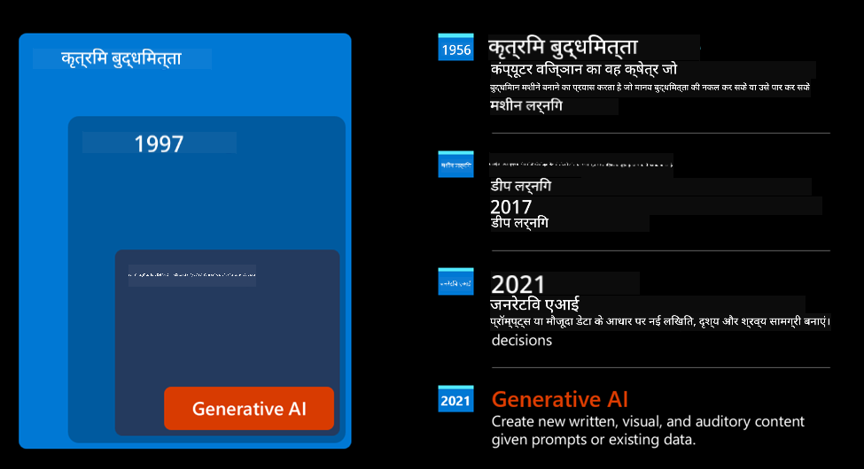
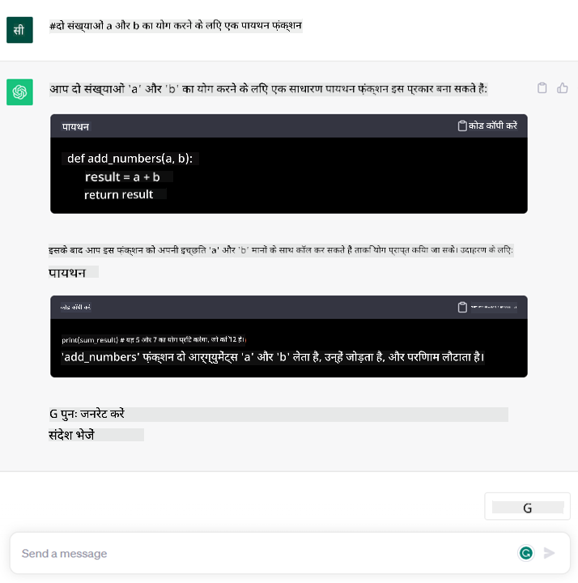

<!--
CO_OP_TRANSLATOR_METADATA:
{
  "original_hash": "f53ba0fa49164f9323043f1c6b11f2b1",
  "translation_date": "2025-07-09T07:46:55+00:00",
  "source_file": "01-introduction-to-genai/README.md",
  "language_code": "hi"
}
-->
# जनरेटिव AI और बड़े भाषा मॉडल का परिचय

_(इस पाठ का वीडियो देखने के लिए ऊपर की छवि पर क्लिक करें)_

जनरेटिव AI वह कृत्रिम बुद्धिमत्ता है जो टेक्स्ट, चित्र और अन्य प्रकार की सामग्री उत्पन्न करने में सक्षम है। इसे एक शानदार तकनीक बनाने वाली बात यह है कि यह AI को सभी के लिए सुलभ बनाता है, कोई भी इसे केवल एक टेक्स्ट प्रॉम्प्ट, यानी प्राकृतिक भाषा में लिखे गए एक वाक्य के साथ उपयोग कर सकता है। आपको कुछ उपयोगी करने के लिए Java या SQL जैसी भाषा सीखने की जरूरत नहीं है, बस अपनी भाषा में बताएं कि आप क्या चाहते हैं और AI मॉडल से एक सुझाव प्राप्त करें। इसके अनुप्रयोग और प्रभाव बहुत बड़े हैं, आप रिपोर्ट लिख सकते हैं या समझ सकते हैं, एप्लिकेशन बना सकते हैं और बहुत कुछ, वह भी सेकंडों में।

इस पाठ्यक्रम में, हम देखेंगे कि हमारा स्टार्टअप कैसे जनरेटिव AI का उपयोग करके शिक्षा के क्षेत्र में नए अवसर खोलता है और इसके सामाजिक प्रभावों और तकनीकी सीमाओं से जुड़ी चुनौतियों का सामना कैसे करता है।

## परिचय

इस पाठ में निम्नलिखित विषय शामिल होंगे:

- व्यावसायिक परिदृश्य का परिचय: हमारे स्टार्टअप का विचार और मिशन।
- जनरेटिव AI और वर्तमान तकनीकी परिदृश्य तक हमारी यात्रा।
- बड़े भाषा मॉडल का आंतरिक कार्यप्रणाली।
- बड़े भाषा मॉडलों की मुख्य क्षमताएं और व्यावहारिक उपयोग के मामले।

## सीखने के लक्ष्य

इस पाठ को पूरा करने के बाद, आप समझ पाएंगे:

- जनरेटिव AI क्या है और बड़े भाषा मॉडल कैसे काम करते हैं।
- आप शिक्षा के परिदृश्यों पर ध्यान केंद्रित करते हुए विभिन्न उपयोग मामलों के लिए बड़े भाषा मॉडलों का उपयोग कैसे कर सकते हैं।

## परिदृश्य: हमारा शैक्षिक स्टार्टअप

जनरेटिव कृत्रिम बुद्धिमत्ता (AI) AI तकनीक की चरम सीमा का प्रतिनिधित्व करती है, जो उन सीमाओं को पार कर रही है जिन्हें कभी असंभव माना जाता था। जनरेटिव AI मॉडल की कई क्षमताएं और अनुप्रयोग हैं, लेकिन इस पाठ्यक्रम में हम देखेंगे कि यह एक काल्पनिक स्टार्टअप के माध्यम से शिक्षा को कैसे क्रांतिकारी बना रहा है। हम इस स्टार्टअप को _हमारा स्टार्टअप_ कहेंगे। हमारा स्टार्टअप शिक्षा क्षेत्र में काम करता है और इसका महत्वाकांक्षी मिशन है

> _शिक्षा में वैश्विक स्तर पर पहुंच को बेहतर बनाना, शिक्षा तक समान पहुंच सुनिश्चित करना और हर शिक्षार्थी को उनकी आवश्यकताओं के अनुसार व्यक्तिगत शिक्षण अनुभव प्रदान करना_।

हमारी स्टार्टअप टीम जानती है कि हम इस लक्ष्य को आधुनिक समय के सबसे शक्तिशाली उपकरणों में से एक – बड़े भाषा मॉडलों (LLMs) का उपयोग किए बिना हासिल नहीं कर पाएंगे।

जनरेटिव AI आज के सीखने और पढ़ाने के तरीके को बदलने की उम्मीद है, जहां छात्रों के पास 24 घंटे वर्चुअल शिक्षक उपलब्ध होंगे जो विशाल मात्रा में जानकारी और उदाहरण प्रदान करेंगे, और शिक्षक अपने छात्रों का मूल्यांकन करने और प्रतिक्रिया देने के लिए नवीन उपकरणों का उपयोग कर सकेंगे।

शुरुआत के लिए, आइए कुछ बुनियादी अवधारणाओं और शब्दावली को परिभाषित करें जिन्हें हम पूरे पाठ्यक्रम में उपयोग करेंगे।

## जनरेटिव AI कैसे आया?

हाल ही में जनरेटिव AI मॉडलों की घोषणा से जो असाधारण _हाइप_ बना है, इसके बावजूद यह तकनीक दशकों से विकसित हो रही है, जिसकी पहली शोध कोशिशें 60 के दशक तक जाती हैं। आज हम AI के उस स्तर पर हैं जिसमें मानव संज्ञानात्मक क्षमताएं शामिल हैं, जैसे कि बातचीत, जैसा कि उदाहरण के लिए [OpenAI ChatGPT](https://openai.com/chatgpt) या [Bing Chat](https://www.microsoft.com/edge/features/bing-chat?WT.mc_id=academic-105485-koreyst) में देखा जा सकता है, जो वेब खोज Bing वार्तालापों के लिए GPT मॉडल का उपयोग करता है।

थोड़ा पीछे जाएं, तो AI के पहले प्रोटोटाइप टाइपराइटन चैटबॉट्स थे, जो विशेषज्ञों के समूह से निकाले गए ज्ञान आधार पर निर्भर थे और कंप्यूटर में प्रस्तुत किए गए थे। ज्ञान आधार में उत्तर कीवर्ड्स द्वारा ट्रिगर होते थे जो इनपुट टेक्स्ट में आते थे। हालांकि, जल्द ही यह स्पष्ट हो गया कि इस तरह का तरीका, टाइपराइटन चैटबॉट्स का उपयोग, अच्छी तरह से स्केल नहीं करता।

### AI के लिए सांख्यिकीय दृष्टिकोण: मशीन लर्निंग

90 के दशक में एक महत्वपूर्ण मोड़ आया, जब टेक्स्ट विश्लेषण के लिए सांख्यिकीय दृष्टिकोण लागू किया गया। इससे नए एल्गोरिदम विकसित हुए – जिन्हें मशीन लर्निंग कहा जाता है – जो डेटा से पैटर्न सीख सकते हैं बिना स्पष्ट रूप से प्रोग्राम किए। यह तरीका मशीनों को मानव भाषा की समझ का अनुकरण करने की अनुमति देता है: एक सांख्यिकीय मॉडल को टेक्स्ट-लेबल जोड़े पर प्रशिक्षित किया जाता है, जिससे मॉडल अज्ञात इनपुट टेक्स्ट को पूर्व-निर्धारित लेबल के साथ वर्गीकृत कर सकता है जो संदेश के इरादे को दर्शाता है।

### न्यूरल नेटवर्क और आधुनिक वर्चुअल असिस्टेंट

हाल के वर्षों में, हार्डवेयर के तकनीकी विकास ने, जो बड़ी मात्रा में डेटा और जटिल गणनाओं को संभाल सकता है, AI में शोध को प्रोत्साहित किया, जिससे उन्नत मशीन लर्निंग एल्गोरिदम विकसित हुए जिन्हें न्यूरल नेटवर्क या डीप लर्निंग एल्गोरिदम कहा जाता है।

न्यूरल नेटवर्क (विशेष रूप से Recurrent Neural Networks – RNNs) ने प्राकृतिक भाषा प्रसंस्करण को काफी बेहतर बनाया, जिससे टेक्स्ट के अर्थ को अधिक सार्थक तरीके से प्रस्तुत किया जा सका, वाक्य में शब्द के संदर्भ को महत्व देते हुए।

यह तकनीक है जिसने नए सदी के पहले दशक में जन्मे वर्चुअल असिस्टेंट्स को सक्षम किया, जो मानव भाषा को समझने, आवश्यकता की पहचान करने और उसे पूरा करने के लिए कार्रवाई करने में बहुत कुशल थे – जैसे पूर्व-निर्धारित स्क्रिप्ट के साथ जवाब देना या किसी तीसरे पक्ष की सेवा का उपयोग करना।

### वर्तमान समय, जनरेटिव AI

तो इस तरह हम आज के जनरेटिव AI तक पहुंचे हैं, जिसे डीप लर्निंग का एक उपसमूह माना जा सकता है।

AI क्षेत्र में दशकों के शोध के बाद, एक नया मॉडल आर्किटेक्चर – जिसे _Transformer_ कहा जाता है – ने RNNs की सीमाओं को पार कर लिया, जो बहुत लंबे टेक्स्ट अनुक्रमों को इनपुट के रूप में ले सकता है। ट्रांसफॉर्मर ध्यान तंत्र पर आधारित हैं, जो मॉडल को प्राप्त इनपुट्स को अलग-अलग महत्व देने की अनुमति देता है, ‘अधिक ध्यान’ उस जगह देता है जहां सबसे महत्वपूर्ण जानकारी केंद्रित होती है, चाहे वे टेक्स्ट अनुक्रम में किसी भी क्रम में हों।

हाल के अधिकांश जनरेटिव AI मॉडल – जिन्हें बड़े भाषा मॉडल (LLMs) भी कहा जाता है, क्योंकि वे टेक्स्ट इनपुट और आउटपुट के साथ काम करते हैं – वास्तव में इस आर्किटेक्चर पर आधारित हैं। इन मॉडलों की खास बात यह है कि इन्हें किताबों, लेखों और वेबसाइटों जैसे विविध स्रोतों से बड़ी मात्रा में बिना लेबल वाले डेटा पर प्रशिक्षित किया जाता है, और इन्हें विभिन्न कार्यों के लिए अनुकूलित किया जा सकता है तथा ये व्याकरणिक रूप से सही और रचनात्मक लगने वाला टेक्स्ट उत्पन्न कर सकते हैं। इसलिए, इन्होंने मशीन की ‘समझ’ क्षमता को न केवल बढ़ाया है, बल्कि मानव भाषा में एक मौलिक प्रतिक्रिया उत्पन्न करने की क्षमता भी दी है।

## बड़े भाषा मॉडल कैसे काम करते हैं?

अगले अध्याय में हम विभिन्न प्रकार के जनरेटिव AI मॉडलों का पता लगाएंगे, लेकिन फिलहाल आइए बड़े भाषा मॉडलों के काम करने के तरीके को देखें, खासकर OpenAI GPT (Generative Pre-trained Transformer) मॉडलों पर ध्यान केंद्रित करते हुए।

- **Tokenizer, टेक्स्ट को नंबर में बदलना**: बड़े भाषा मॉडल टेक्स्ट को इनपुट के रूप में लेते हैं और टेक्स्ट आउटपुट देते हैं। हालांकि, ये सांख्यिकीय मॉडल हैं, इसलिए ये टेक्स्ट अनुक्रमों की तुलना में नंबरों के साथ बेहतर काम करते हैं। इसलिए, मॉडल को भेजे जाने वाले हर इनपुट को पहले एक tokenizer द्वारा संसाधित किया जाता है। एक टोकन टेक्स्ट का एक हिस्सा होता है – जिसमें चरित्रों की संख्या भिन्न हो सकती है, इसलिए tokenizer का मुख्य काम इनपुट को टोकनों की एक सूची में विभाजित करना है। फिर, प्रत्येक टोकन को एक टोकन इंडेक्स के साथ मैप किया जाता है, जो मूल टेक्स्ट के उस हिस्से का पूर्णांक एन्कोडिंग होता है।

- **आउटपुट टोकन की भविष्यवाणी**: n टोकन इनपुट के रूप में दिए जाने पर (जिसका अधिकतम मान मॉडल के अनुसार भिन्न होता है), मॉडल एक टोकन को आउटपुट के रूप में भविष्यवाणी कर सकता है। यह टोकन फिर अगले चक्र के इनपुट में शामिल किया जाता है, एक बढ़ते हुए विंडो पैटर्न में, जिससे उपयोगकर्ता को एक या अधिक वाक्य उत्तर के रूप में मिलते हैं। यही कारण है कि यदि आपने कभी ChatGPT के साथ प्रयोग किया है, तो आपने देखा होगा कि कभी-कभी यह वाक्य के बीच में रुक जाता है।

- **चयन प्रक्रिया, संभावना वितरण**: आउटपुट टोकन को मॉडल उस संभावना के अनुसार चुनता है कि वह वर्तमान टेक्स्ट अनुक्रम के बाद आएगा। मॉडल सभी संभावित ‘अगले टोकन’ पर एक संभावना वितरण की भविष्यवाणी करता है, जो इसके प्रशिक्षण पर आधारित होती है। हालांकि, हमेशा सबसे अधिक संभावना वाले टोकन को चुना नहीं जाता। इस चयन में एक हद तक यादृच्छिकता जोड़ी जाती है, जिससे मॉडल गैर-नियतात्मक तरीके से कार्य करता है - हमें एक ही इनपुट के लिए हमेशा एक समान आउटपुट नहीं मिलता। यह यादृच्छिकता रचनात्मक सोच की प्रक्रिया का अनुकरण करने के लिए जोड़ी जाती है और इसे मॉडल के एक पैरामीटर जिसे temperature कहा जाता है, के माध्यम से समायोजित किया जा सकता है।

## हमारा स्टार्टअप बड़े भाषा मॉडलों का कैसे उपयोग कर सकता है?

अब जब हमें बड़े भाषा मॉडल के आंतरिक कार्यप्रणाली की बेहतर समझ हो गई है, तो आइए कुछ व्यावहारिक उदाहरण देखें कि वे आमतौर पर कौन से कार्य अच्छी तरह कर सकते हैं, हमारे व्यावसायिक परिदृश्य को ध्यान में रखते हुए। हमने कहा कि बड़े भाषा मॉडल की मुख्य क्षमता है _प्राकृतिक भाषा में लिखे गए टेक्स्ट इनपुट से शून्य से टेक्स्ट उत्पन्न करना_।

लेकिन किस प्रकार का टेक्स्ट इनपुट और आउटपुट?
बड़े भाषा मॉडल का इनपुट प्रॉम्प्ट के रूप में जाना जाता है, जबकि आउटपुट को completion कहा जाता है, जो मॉडल की उस प्रक्रिया को दर्शाता है जिसमें वह वर्तमान इनपुट को पूरा करने के लिए अगला टोकन उत्पन्न करता है। हम आगे जानेंगे कि प्रॉम्प्ट क्या होता है और इसे इस तरह डिजाइन कैसे किया जाए कि हम अपने मॉडल से अधिकतम लाभ उठा सकें। फिलहाल, इतना कहें कि प्रॉम्प्ट में शामिल हो सकता है:

- एक **निर्देश** जो मॉडल से अपेक्षित आउटपुट के प्रकार को बताता है। यह निर्देश कभी-कभी कुछ उदाहरण या अतिरिक्त डेटा भी शामिल कर सकता है।

  1. किसी लेख, पुस्तक, उत्पाद समीक्षा आदि का सारांश बनाना, साथ ही असंरचित डेटा से अंतर्दृष्टि निकालना।
    
    
  
  2. किसी लेख, निबंध, असाइनमेंट आदि की रचनात्मक कल्पना और डिजाइन।
      
     

- एक **प्रश्न**, जो एजेंट के साथ बातचीत के रूप में पूछा गया हो।
  
  

- एक पूरा करने के लिए **टेक्स्ट का टुकड़ा**, जो अप्रत्यक्ष रूप से लेखन सहायता का अनुरोध होता है।
  
  

- एक **कोड का टुकड़ा** साथ ही इसे समझाने और दस्तावेज़ित करने का अनुरोध, या किसी विशिष्ट कार्य को करने वाला कोड उत्पन्न करने के लिए टिप्पणी।
  
  

उपरोक्त उदाहरण काफी सरल हैं और बड़े भाषा मॉडलों की क्षमताओं का पूर्ण प्रदर्शन नहीं हैं। ये केवल जनरेटिव AI के संभावित उपयोग को दिखाने के लिए हैं, खासकर शैक्षिक संदर्भों में, लेकिन इन्हीं तक सीमित नहीं।

साथ ही, जनरेटिव AI मॉडल का आउटपुट हमेशा परिपूर्ण नहीं होता और कभी-कभी मॉडल की रचनात्मकता इसके खिलाफ काम कर सकती है, जिससे ऐसा आउटपुट बन सकता है जिसे मानव उपयोगकर्ता वास्तविकता का भ्रम समझ सकता है, या जो आपत्तिजनक हो सकता है। जनरेटिव AI बुद्धिमान नहीं है – कम से कम उस व्यापक परिभाषा में जिसमें आलोचनात्मक और रचनात्मक तर्क या भावनात्मक बुद्धिमत्ता शामिल है; यह नियतात्मक नहीं है, और भरोसेमंद नहीं है, क्योंकि गलत संदर्भ, सामग्री और कथन सही जानकारी के साथ मिलकर प्रस्तुत किए जा सकते हैं, और वे प्रभावशाली और आत्मविश्वासी तरीके से पेश किए जा सकते हैं। आने वाले पाठों में, हम इन सभी सीमाओं से निपटेंगे और देखेंगे कि इन्हें कम करने के लिए हम क्या कर सकते हैं।

## असाइनमेंट

आपका असाइनमेंट है कि आप [जनरेटिव AI](https://en.wikipedia.org/wiki/Generative_artificial_intelligence?WT.mc_id=academic-105485-koreyst) के बारे में और पढ़ें और एक ऐसा क्षेत्र खोजें जहां आप आज जनरेटिव AI जोड़ना चाहेंगे जो अभी इसका उपयोग नहीं करता। इसका प्रभाव "पुराने तरीके" से करने की तुलना में कैसे अलग होगा, क्या आप कुछ ऐसा कर पाएंगे जो पहले नहीं कर सकते थे, या क्या आप तेज होंगे? अपने सपनों के AI स्टार्टअप का 300 शब्दों में सारांश लिखें और इसमें "समस्या", "मैं AI का उपयोग कैसे करूंगा", "प्रभाव" जैसे शीर्षक शामिल करें और वैकल्पिक रूप से एक व्यवसाय योजना भी।

यदि आपने यह कार्य किया है, तो आप Microsoft के इनक्यूबेटर, [Microsoft for Startups Founders Hub](https://www.microsoft.com/startups?WT.mc_id=academic-105485-koreyst) में आवेदन करने के लिए तैयार हो सकते हैं। हम Azure, OpenAI, मेंटरिंग और बहुत कुछ के लिए क्रेडिट प्रदान करते हैं, इसे जरूर देखें!

## ज्ञान जांच

बड़े भाषा मॉडलों के बारे में क्या सही है?

1. आपको हर बार बिल्कुल वही प्रतिक्रिया मिलती है।
1. यह चीजें पूरी तरह सही करता है, नंबर जोड़ने में, काम करने वाला कोड बनाने में आदि।
1. प्रतिक्रिया एक ही प्रॉम्प्ट का उपयोग करने पर भी भिन्न हो सकती है। यह आपको किसी चीज़ का पहला ड्राफ्ट देने में भी अच्छा है, चाहे वह टेक्स्ट हो या कोड। लेकिन आपको परिणामों में सुधार करना होगा।

उत्तर: 3, एक LLM गैर-नियतात्मक होता है, प्रतिक्रिया भिन्न होती है, हालांकि आप इसे temperature सेटिंग के माध्यम से नियंत्रित कर सकते हैं। आपको यह भी उम्मीद नहीं करनी चाहिए कि यह चीजें पूरी तरह सही करेगा, यह आपके लिए भारी काम करता है, जिसका मतलब है कि आपको एक अच्छा पहला प्रयास मिलता है जिसे आपको धीरे-धीरे सुधारना होता है।

## शानदार काम! यात्रा जारी रखें

इस पाठ को पूरा करने के बाद, हमारे [जनरेटिव AI लर्निंग संग्रह](https://aka.ms/genai-collection?WT.mc_id=academic-105485-koreyst) को देखें और अपनी जनरेटिव AI की जानकारी को और बढ़ाएं!
लेसन 2 पर जाएं जहाँ हम देखेंगे कि कैसे [विभिन्न LLM प्रकारों का अन्वेषण और तुलना करें](../02-exploring-and-comparing-different-llms/README.md?WT.mc_id=academic-105485-koreyst)!

**अस्वीकरण**:  
यह दस्तावेज़ AI अनुवाद सेवा [Co-op Translator](https://github.com/Azure/co-op-translator) का उपयोग करके अनुवादित किया गया है। जबकि हम सटीकता के लिए प्रयासरत हैं, कृपया ध्यान दें कि स्वचालित अनुवादों में त्रुटियाँ या अशुद्धियाँ हो सकती हैं। मूल दस्तावेज़ अपनी मूल भाषा में ही अधिकारिक स्रोत माना जाना चाहिए। महत्वपूर्ण जानकारी के लिए, पेशेवर मानव अनुवाद की सलाह दी जाती है। इस अनुवाद के उपयोग से उत्पन्न किसी भी गलतफहमी या गलत व्याख्या के लिए हम जिम्मेदार नहीं हैं।