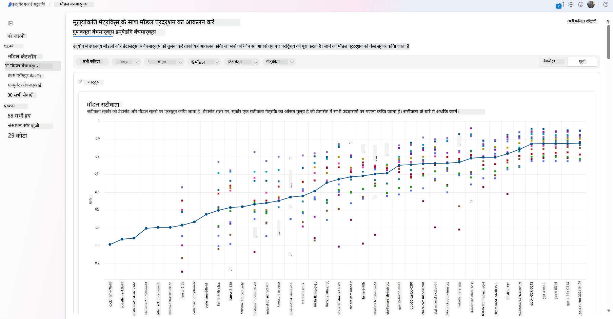
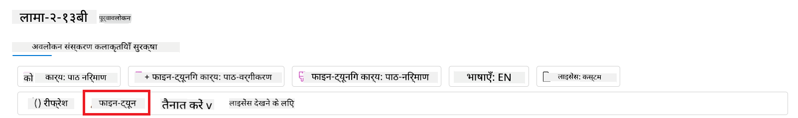
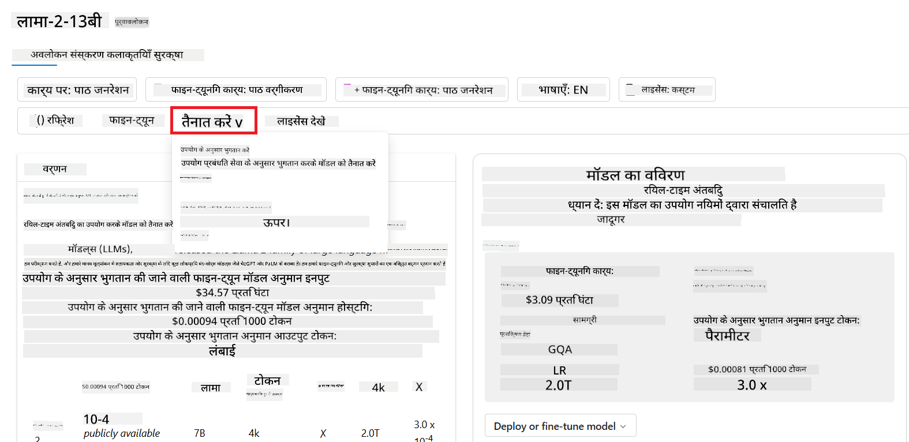

<!--
CO_OP_TRANSLATOR_METADATA:
{
  "original_hash": "e2f686f2eb794941761252ac5e8e090b",
  "translation_date": "2025-05-19T09:23:11+00:00",
  "source_file": "02-exploring-and-comparing-different-llms/README.md",
  "language_code": "hi"
}
-->
# विभिन्न LLMs का अन्वेषण और तुलना

> _इस पाठ का वीडियो देखने के लिए ऊपर दी गई छवि पर क्लिक करें_

पिछले पाठ के साथ, हमने देखा कि जनरेटिव AI कैसे प्रौद्योगिकी परिदृश्य को बदल रहा है, बड़े भाषा मॉडल (LLMs) कैसे काम करते हैं और एक व्यवसाय - जैसे हमारा स्टार्टअप - उन्हें अपने उपयोग के मामलों में कैसे लागू कर सकता है और बढ़ सकता है! इस अध्याय में, हम विभिन्न प्रकार के बड़े भाषा मॉडलों (LLMs) की तुलना करने जा रहे हैं ताकि उनके लाभ और नुकसान को समझा जा सके।

हमारे स्टार्टअप की यात्रा का अगला कदम LLMs के वर्तमान परिदृश्य का अन्वेषण करना और यह समझना है कि कौन सा हमारे उपयोग के मामले के लिए उपयुक्त है।

## परिचय

इस पाठ में शामिल होंगे:

- वर्तमान परिदृश्य में विभिन्न प्रकार के LLMs।
- Azure में आपके उपयोग के मामले के लिए विभिन्न मॉडलों का परीक्षण, पुनरावृत्ति, और तुलना।
- LLM को कैसे तैनात करें।

## सीखने के लक्ष्य

इस पाठ को पूरा करने के बाद, आप सक्षम होंगे:

- अपने उपयोग के मामले के लिए सही मॉडल का चयन करें।
- यह समझें कि अपने मॉडल के प्रदर्शन को कैसे परीक्षण, पुनरावृत्ति और सुधारें।
- जानें कि व्यवसाय मॉडल कैसे तैनात करते हैं।

## विभिन्न प्रकार के LLMs को समझें

LLMs को उनकी वास्तुकला, प्रशिक्षण डेटा, और उपयोग के मामले के आधार पर कई श्रेणियों में विभाजित किया जा सकता है। इन भिन्नताओं को समझने से हमारे स्टार्टअप को सही मॉडल का चयन करने और यह समझने में मदद मिलेगी कि प्रदर्शन का परीक्षण, पुनरावृत्ति और सुधार कैसे करें।

LLM मॉडल के कई प्रकार होते हैं, आपके मॉडल का चयन इस पर निर्भर करता है कि आप उन्हें किस उद्देश्य के लिए उपयोग करना चाहते हैं, आपका डेटा, आप कितना खर्च करने के लिए तैयार हैं, और भी बहुत कुछ।

अगर आप मॉडल का उपयोग पाठ, ऑडियो, वीडियो, छवि उत्पादन आदि के लिए करना चाहते हैं, तो आप एक अलग प्रकार के मॉडल का चयन कर सकते हैं।

- **ऑडियो और स्पीच मान्यता**। इस उद्देश्य के लिए, Whisper प्रकार के मॉडल एक शानदार विकल्प हैं क्योंकि वे सामान्य उद्देश्य के होते हैं और स्पीच मान्यता के लिए लक्षित होते हैं। यह विविध ऑडियो पर प्रशिक्षित होता है और बहुभाषी स्पीच मान्यता कर सकता है। [Whisper प्रकार के मॉडलों के बारे में और जानें](https://platform.openai.com/docs/models/whisper?WT.mc_id=academic-105485-koreyst)।

- **छवि उत्पादन**। छवि उत्पादन के लिए, DALL-E और Midjourney दो बहुत प्रसिद्ध विकल्प हैं। DALL-E को Azure OpenAI द्वारा पेश किया जाता है। [DALL-E के बारे में और पढ़ें](https://platform.openai.com/docs/models/dall-e?WT.mc_id=academic-105485-koreyst) और इस पाठ्यक्रम के अध्याय 9 में भी।

- **पाठ उत्पादन**। अधिकांश मॉडल पाठ उत्पादन पर प्रशिक्षित होते हैं और आपके पास GPT-3.5 से लेकर GPT-4 तक के कई विकल्प होते हैं। वे अलग-अलग लागत पर आते हैं, जिसमें GPT-4 सबसे महंगा होता है। यह देखने लायक है कि [Azure OpenAI प्लेग्राउंड](https://oai.azure.com/portal/playground?WT.mc_id=academic-105485-koreyst) में कौन से मॉडल आपकी आवश्यकताओं के हिसाब से क्षमता और लागत के मामले में सबसे अच्छे हैं।

- **मल्टी-मोडैलिटी**। यदि आप इनपुट और आउटपुट में कई प्रकार के डेटा को संभालना चाहते हैं, तो आप [gpt-4 turbo with vision या gpt-4o](https://learn.microsoft.com/azure/ai-services/openai/concepts/models#gpt-4-and-gpt-4-turbo-models?WT.mc_id=academic-105485-koreyst) जैसे मॉडलों पर विचार कर सकते हैं - OpenAI मॉडलों की नवीनतम रिलीज़ - जो प्राकृतिक भाषा प्रसंस्करण को दृश्य समझ के साथ जोड़ने में सक्षम हैं, जिससे मल्टी-मोडल इंटरफेस के माध्यम से इंटरैक्शन संभव होता है।

मॉडल का चयन करने का मतलब है कि आपको कुछ बुनियादी क्षमताएं मिलती हैं, जो कि शायद पर्याप्त नहीं हो सकती हैं। अक्सर आपके पास कंपनी विशेष डेटा होता है जिसे आपको किसी तरह LLM को बताना होता है। इस पर पहुँचने के कुछ अलग तरीके हैं, इसके बारे में आगामी वर्गों में और अधिक।

### फाउंडेशन मॉडल बनाम LLMs

फाउंडेशन मॉडल शब्द को [स्टैनफोर्ड के शोधकर्ताओं द्वारा गढ़ा गया था](https://arxiv.org/abs/2108.07258?WT.mc_id=academic-105485-koreyst) और इसे एक AI मॉडल के रूप में परिभाषित किया गया था जो कुछ मानदंडों का पालन करता है, जैसे:

- **वे असुपरवाइज्ड लर्निंग या सेल्फ-सुपरवाइज्ड लर्निंग का उपयोग करके प्रशिक्षित होते हैं**, जिसका अर्थ है कि वे बिना लेबल वाले मल्टी-मोडल डेटा पर प्रशिक्षित होते हैं, और उन्हें अपने प्रशिक्षण प्रक्रिया के लिए डेटा की मानव एनोटेशन या लेबलिंग की आवश्यकता नहीं होती है।
- **वे बहुत बड़े मॉडल होते हैं**, जो अरबों पैरामीटर पर प्रशिक्षित बहुत गहरे न्यूरल नेटवर्क पर आधारित होते हैं।
- **वे आमतौर पर अन्य मॉडलों के लिए 'फाउंडेशन' के रूप में सेवा करने के लिए होते हैं**, जिसका अर्थ है कि उन्हें अन्य मॉडलों के लिए एक प्रारंभिक बिंदु के रूप में उपयोग किया जा सकता है, जो फाइन-ट्यूनिंग द्वारा किया जा सकता है।

इस भिन्नता को और स्पष्ट करने के लिए, चलिए ChatGPT को एक उदाहरण के रूप में लेते हैं। ChatGPT का पहला संस्करण बनाने के लिए, एक मॉडल जिसे GPT-3.5 कहा जाता है, फाउंडेशन मॉडल के रूप में सेवा करता है। इसका अर्थ है कि OpenAI ने कुछ चैट-विशिष्ट डेटा का उपयोग करके GPT-3.5 का एक ट्यून किया गया संस्करण बनाया जो चैटबॉट्स जैसे संवादात्मक परिदृश्यों में अच्छा प्रदर्शन करने में विशेष था।

### ओपन सोर्स बनाम प्रोप्राइटरी मॉडल

LLMs को यह भी वर्गीकृत किया जा सकता है कि वे ओपन सोर्स हैं या प्रोप्राइटरी।

ओपन-सोर्स मॉडल वे मॉडल होते हैं जो जनता के लिए उपलब्ध होते हैं और कोई भी उनका उपयोग कर सकता है। वे अक्सर उस कंपनी द्वारा उपलब्ध कराए जाते हैं जिसने उन्हें बनाया है, या शोध समुदाय द्वारा। ये मॉडल विभिन्न उपयोग के मामलों के लिए निरीक्षण, संशोधित और अनुकूलित किए जा सकते हैं। हालाँकि, वे हमेशा उत्पादन उपयोग के लिए अनुकूलित नहीं होते हैं, और प्रोप्राइटरी मॉडलों की तुलना में उतने सक्षम नहीं हो सकते हैं। साथ ही, ओपन-सोर्स मॉडलों के लिए वित्तपोषण सीमित हो सकता है, और वे लंबे समय तक बनाए नहीं रखे जा सकते हैं या नवीनतम शोध के साथ अपडेट नहीं किए जा सकते हैं। लोकप्रिय ओपन-सोर्स मॉडलों के उदाहरणों में [Alpaca](https://crfm.stanford.edu/2023/03/13/alpaca.html?WT.mc_id=academic-105485-koreyst), [Bloom](https://huggingface.co/bigscience/bloom) और [LLaMA](https://llama.meta.com) शामिल हैं।

प्रोप्राइटरी मॉडल वे मॉडल होते हैं जो किसी कंपनी के स्वामित्व में होते हैं और जनता के लिए उपलब्ध नहीं होते हैं। ये मॉडल अक्सर उत्पादन उपयोग के लिए अनुकूलित होते हैं। हालाँकि, उन्हें विभिन्न उपयोग के मामलों के लिए निरीक्षण, संशोधित, या अनुकूलित करने की अनुमति नहीं होती है। साथ ही, वे हमेशा मुफ्त में उपलब्ध नहीं होते हैं, और उनका उपयोग करने के लिए सदस्यता या भुगतान की आवश्यकता हो सकती है। इसके अलावा, उपयोगकर्ताओं को उस डेटा पर नियंत्रण नहीं होता है जिसका उपयोग मॉडल को प्रशिक्षित करने के लिए किया जाता है, जिसका अर्थ है कि उन्हें डेटा गोपनीयता और AI के जिम्मेदार उपयोग के प्रति प्रतिबद्धता सुनिश्चित करने के लिए मॉडल मालिक पर भरोसा करना चाहिए। लोकप्रिय प्रोप्राइटरी मॉडलों के उदाहरणों में [OpenAI मॉडल](https://platform.openai.com/docs/models/overview?WT.mc_id=academic-105485-koreyst), [Google Bard](https://sapling.ai/llm/bard?WT.mc_id=academic-105485-koreyst) या [Claude 2](https://www.anthropic.com/index/claude-2?WT.mc_id=academic-105485-koreyst) शामिल हैं।

### एम्बेडिंग बनाम छवि उत्पादन बनाम पाठ और कोड उत्पादन

LLMs को उनके द्वारा उत्पन्न आउटपुट के आधार पर भी वर्गीकृत किया जा सकता है।

एम्बेडिंग ऐसे मॉडलों का एक सेट है जो पाठ को एक संख्यात्मक रूप में बदल सकते हैं, जिसे एम्बेडिंग कहा जाता है, जो इनपुट पाठ का संख्यात्मक प्रतिनिधित्व है। एम्बेडिंग मशीनों के लिए शब्दों या वाक्यों के बीच संबंधों को समझना आसान बनाते हैं और अन्य मॉडलों द्वारा इनपुट के रूप में उपभोग किए जा सकते हैं, जैसे कि वर्गीकरण मॉडल, या क्लस्टरिंग मॉडल जो संख्यात्मक डेटा पर बेहतर प्रदर्शन करते हैं। एम्बेडिंग मॉडल अक्सर ट्रांसफर लर्निंग के लिए उपयोग किए जाते हैं, जहां एक मॉडल एक उपयुक्त कार्य के लिए बनाया जाता है जिसके लिए डेटा की प्रचुरता होती है, और फिर मॉडल वेट्स (एम्बेडिंग) अन्य डाउनस्ट्रीम कार्यों के लिए पुनः उपयोग किए जाते हैं। इस श्रेणी का एक उदाहरण [OpenAI एम्बेडिंग](https://platform.openai.com/docs/models/embeddings?WT.mc_id=academic-105485-koreyst) है।

छवि उत्पादन मॉडल वे मॉडल होते हैं जो छवियाँ उत्पन्न करते हैं। ये मॉडल अक्सर छवि संपादन, छवि संश्लेषण, और छवि अनुवाद के लिए उपयोग किए जाते हैं। छवि उत्पादन मॉडल अक्सर छवियों के बड़े डेटासेट पर प्रशिक्षित होते हैं, जैसे [LAION-5B](https://laion.ai/blog/laion-5b/?WT.mc_id=academic-105485-koreyst), और नई छवियों को उत्पन्न करने या मौजूदा छवियों को संपादित करने के लिए उपयोग किए जा सकते हैं। उदाहरणों में [DALL-E-3](https://openai.com/dall-e-3?WT.mc_id=academic-105485-koreyst) और [Stable Diffusion मॉडल](https://github.com/Stability-AI/StableDiffusion?WT.mc_id=academic-105485-koreyst) शामिल हैं।

पाठ और कोड उत्पादन मॉडल वे मॉडल होते हैं जो पाठ या कोड उत्पन्न करते हैं। ये मॉडल अक्सर पाठ सारांशण, अनुवाद, और प्रश्न उत्तर के लिए उपयोग किए जाते हैं। पाठ उत्पादन मॉडल अक्सर पाठ के बड़े डेटासेट पर प्रशिक्षित होते हैं, जैसे [BookCorpus](https://www.cv-foundation.org/openaccess/content_iccv_2015/html/Zhu_Aligning_Books_and_ICCV_2015_paper.html?WT.mc_id=academic-105485-koreyst), और नए पाठ उत्पन्न करने या प्रश्नों का उत्तर देने के लिए उपयोग किए जा सकते हैं। कोड उत्पादन मॉडल, जैसे [CodeParrot](https://huggingface.co/codeparrot?WT.mc_id=academic-105485-koreyst), अक्सर कोड के बड़े डेटासेट पर प्रशिक्षित होते हैं, जैसे GitHub, और नए कोड उत्पन्न करने या मौजूदा कोड में बग्स को ठीक करने के लिए उपयोग किए जा सकते हैं।

### एनकोडर-डिकोडर बनाम केवल डिकोडर

LLMs की विभिन्न प्रकार की आर्किटेक्चर के बारे में बात करने के लिए, चलिए एक उपमा का उपयोग करते हैं।

कल्पना करें कि आपके प्रबंधक ने आपको छात्रों के लिए एक क्विज़ लिखने का कार्य दिया है। आपके पास दो सहयोगी हैं; एक सामग्री बनाने का प्रभारी है और दूसरा उनकी समीक्षा करने का प्रभारी है।

सामग्री निर्माता एक केवल डिकोडर मॉडल की तरह है, वे विषय को देख सकते हैं और जो आपने पहले ही लिखा है उसे देख सकते हैं और फिर उसके आधार पर एक पाठ्यक्रम लिख सकते हैं। वे आकर्षक और जानकारीपूर्ण सामग्री लिखने में बहुत अच्छे होते हैं, लेकिन वे विषय और सीखने के उद्देश्यों को समझने में बहुत अच्छे नहीं होते हैं। डिकोडर मॉडलों के कुछ उदाहरण GPT परिवार के मॉडल हैं, जैसे GPT-3।

समीक्षक एक केवल एनकोडर मॉडल की तरह है, वे लिखे गए पाठ्यक्रम और उत्तरों को देखते हैं, उनके बीच संबंध को समझते हैं और संदर्भ को समझते हैं, लेकिन वे सामग्री उत्पन्न करने में अच्छे नहीं होते हैं। केवल एनकोडर मॉडल का एक उदाहरण BERT होगा।

कल्पना करें कि हमारे पास कोई ऐसा व्यक्ति भी हो सकता है जो क्विज़ बना और समीक्षा कर सके, यह एक एनकोडर-डिकोडर मॉडल होगा। कुछ उदाहरण BART और T5 होंगे।

### सेवा बनाम मॉडल

अब, चलिए सेवा और मॉडल के बीच के अंतर के बारे में बात करते हैं। एक सेवा एक उत्पाद है जो एक क्लाउड सेवा प्रदाता द्वारा पेश की जाती है, और अक्सर मॉडलों, डेटा और अन्य घटकों का संयोजन होती है। एक मॉडल एक सेवा का मुख्य घटक होता है, और अक्सर एक फाउंडेशन मॉडल होता है, जैसे कि एक LLM।

सेवाएं अक्सर उत्पादन उपयोग के लिए अनुकूलित होती हैं और ग्राफिकल यूजर इंटरफेस के माध्यम से उपयोग करने में अक्सर आसान होती हैं। हालाँकि, सेवाएं हमेशा मुफ्त में उपलब्ध नहीं होती हैं, और उनका उपयोग करने के लिए सदस्यता या भुगतान की आवश्यकता हो सकती है, सेवा मालिक के उपकरण और संसाधनों का लाभ उठाने के बदले, खर्चों को अनुकूलित करने और आसानी से स्केल करने के लिए। एक सेवा का उदाहरण [Azure OpenAI सेवा](https://learn.microsoft.com/azure/ai-services/openai/overview?WT.mc_id=academic-105485-koreyst) है, जो एक पे-एज़-यू-गो दर योजना प्रदान करती है, जिसका अर्थ है कि उपयोगकर्ताओं से सेवा का कितना उपयोग किया जाता है उसके अनुपात में शुल्क लिया जाता है। इसके अलावा, Azure OpenAI सेवा मॉडलों की क्षमताओं के शीर्ष पर एंटरप्राइज़-ग्रेड सुरक्षा और एक जिम्मेदार AI ढांचा प्रदान करती है।

मॉडल केवल न्यूरल नेटवर्क होते हैं, जिनमें पैरामीटर, वेट्स, और अन्य होते हैं। कंपनियों को स्थानीय रूप से चलाने की अनुमति देना, हालांकि, उन्हें उपकरण खरीदने, स्केल करने के लिए एक संरचना बनाने और एक लाइसेंस खरीदने या एक ओपन-सोर्स मॉडल का उपयोग करने की आवश्यकता होगी। LLaMA जैसे मॉडल का उपयोग किया जा सकता है, जिसके लिए मॉडल को चलाने के लिए कम्प्यूटेशनल शक्ति की आवश्यकता होती है।

## Azure पर प्रदर्शन को समझने के लिए विभिन्न मॉडलों के साथ परीक्षण और पुनरावृत्ति कैसे करें

एक बार जब हमारी टीम ने वर्तमान LLMs परिदृश्य का अन्वेषण कर लिया और उनके परिदृश्यों के लिए कुछ अच्छे उम्मीदवारों की पहचान कर ली, तो अगला कदम उनके डेटा और उनके वर्कलोड पर उनका परीक्षण करना है। यह एक पुनरावृत्त प्रक्रिया है, जो प्रयोगों और मापों द्वारा की जाती है। हमने पिछले पैराग्राफों में जिन मॉडलों का उल्लेख किया (OpenAI मॉडल, ओपन सोर्स मॉडल जैसे Llama2, और Hugging Face ट्रांसफॉर्मर्स) वे [मॉडल कैटलॉग](https://learn.microsoft.com/azure/ai-studio/how-to/model-catalog-overview?WT.mc_id=academic-105485-koreyst) में [Azure AI स्टूडियो](https://ai.azure.com/?WT.mc_id=academic-105485-koreyst) में उपलब्ध हैं।

[Azure AI स्टूडियो](https://learn.microsoft.com/azure/ai-studio/what-is-ai-studio?WT.mc_id=academic-105485-koreyst) एक क्लाउड प्लेटफ़ॉर्म है जिसे डेवलपर्स के लिए जनरेटिव AI अनुप्रयोगों का निर्माण करने और संपूर्ण विकास जीवनचक्र - प्रयोग से लेकर मूल्यांकन तक - प्रबंधित करने के लिए डिज़ाइन किया गया है - सभी Azure AI सेवाओं को एकल केंद्र में एक सुविधाजनक GUI के साथ संयोजित करके। Azure AI स्टूडियो में मॉडल कैटलॉग उपयोगकर्ता को सक्षम करता है:

- कैटलॉग में रुचि का फाउंडेशन मॉडल खोजें - या तो प्रोप्राइटरी या ओपन सोर्स, कार्य, लाइसेंस, या नाम द्वारा फ़िल्टरिंग करके। खोज क्षमता को बेहतर बनाने के लिए, मॉडल संग्रहों में व्यवस्थित होते हैं, जैसे Azure OpenAI संग्रह, Hugging Face संग्रह, और अधिक।

- मॉडल कार्ड की समीक्षा करें, जिसमें उपयोग के इरादे और प्रशिक्षण डेटा का विस्तृत विवरण, कोड नमूने और आंतरिक मूल्यांकन पुस्तकालय पर मूल्यांकन परिणाम शामिल हैं।
- उद्योग में उपलब्ध मॉडल और डेटा सेट के बीच बेंचमार्क की तुलना करें ताकि यह आकलन किया जा सके कि कौन सा व्यवसाय परिदृश्य के अनुकूल है, [Model Benchmarks](https://learn.microsoft.com/azure/ai-studio/how-to/model-benchmarks?WT.mc_id=academic-105485-koreyst) पैन के माध्यम से।

- मॉडल के प्रदर्शन में सुधार के लिए इसे विशेष वर्कलोड में कस्टम प्रशिक्षण डेटा पर फाइन-ट्यून करें, Azure AI स्टूडियो की प्रयोग और ट्रैकिंग क्षमताओं का लाभ उठाएं।

- मूल प्री-ट्रेंड मॉडल या फाइन-ट्यून किए गए संस्करण को रिमोट रियल-टाइम इन्फ्रेंस - प्रबंधित कंप्यूट - या सर्वरलेस एपीआई एंडपॉइंट पर तैनात करें - [pay-as-you-go](https://learn.microsoft.com/azure/ai-studio/how-to/model-catalog-overview#model-deployment-managed-compute-and-serverless-api-pay-as-you-go?WT.mc_id=academic-105485-koreyst) - ताकि एप्लिकेशन इसका उपयोग कर सकें।

> [!NOTE]
> कैटलॉग में सभी मॉडल वर्तमान में फाइन-ट्यूनिंग और/या पे-एज़-यू-गो तैनाती के लिए उपलब्ध नहीं हैं। मॉडल की क्षमताओं और सीमाओं के विवरण के लिए मॉडल कार्ड देखें।

## LLM परिणामों में सुधार

हमने अपने स्टार्टअप टीम के साथ विभिन्न प्रकार के LLM और एक क्लाउड प्लेटफॉर्म (Azure Machine Learning) का पता लगाया है, जिससे हमें विभिन्न मॉडलों की तुलना करने, उन्हें परीक्षण डेटा पर मूल्यांकन करने, प्रदर्शन में सुधार करने और उन्हें इन्फ्रेंस एंडपॉइंट पर तैनात करने की अनुमति मिलती है।

लेकिन उन्हें कब प्री-ट्रेंड मॉडल के बजाय फाइन-ट्यूनिंग पर विचार करना चाहिए? क्या विशेष वर्कलोड पर मॉडल प्रदर्शन में सुधार के लिए अन्य दृष्टिकोण हैं?

कई दृष्टिकोण हैं जिनका उपयोग व्यवसाय एक LLM से आवश्यक परिणाम प्राप्त करने के लिए कर सकते हैं। आप उत्पादन में एक LLM को तैनात करते समय विभिन्न प्रशिक्षण डिग्री के साथ विभिन्न प्रकार के मॉडल चुन सकते हैं, जो जटिलता, लागत और गुणवत्ता के विभिन्न स्तरों के साथ आते हैं। यहाँ कुछ विभिन्न दृष्टिकोण हैं:

- **संदर्भ के साथ प्रॉम्प्ट इंजीनियरिंग**। विचार यह है कि जब आप प्रॉम्प्ट करते हैं तो पर्याप्त संदर्भ प्रदान करें ताकि आपको आवश्यक प्रतिक्रियाएँ मिल सकें।

- **रिट्रीवल ऑगमेंटेड जनरेशन, RAG**। आपका डेटा उदाहरण के लिए एक डेटाबेस या वेब एंडपॉइंट में हो सकता है, यह सुनिश्चित करने के लिए कि यह डेटा, या इसका एक उपसमुच्चय, प्रॉम्प्ट के समय शामिल है, आप प्रासंगिक डेटा प्राप्त कर सकते हैं और इसे उपयोगकर्ता के प्रॉम्प्ट का हिस्सा बना सकते हैं।

- **फाइन-ट्यून किया गया मॉडल**। यहाँ, आपने अपने स्वयं के डेटा पर मॉडल को और प्रशिक्षित किया है, जिससे मॉडल आपकी आवश्यकताओं के लिए अधिक सटीक और उत्तरदायी बन गया है, लेकिन यह महंगा हो सकता है।

चित्र स्रोत: [Four Ways that Enterprises Deploy LLMs | Fiddler AI Blog](https://www.fiddler.ai/blog/four-ways-that-enterprises-deploy-llms?WT.mc_id=academic-105485-koreyst)

### संदर्भ के साथ प्रॉम्प्ट इंजीनियरिंग

प्री-ट्रेंड LLM सामान्यीकृत प्राकृतिक भाषा कार्यों पर बहुत अच्छी तरह से काम करते हैं, भले ही उन्हें एक छोटे प्रॉम्प्ट के साथ बुलाया जाए, जैसे कि एक वाक्य पूरा करना या एक प्रश्न – जिसे "शून्य-शॉट" सीखना कहा जाता है।

हालांकि, जितना अधिक उपयोगकर्ता अपनी क्वेरी को एक विस्तृत अनुरोध और उदाहरणों के साथ तैयार कर सकते हैं – संदर्भ – उतना ही सटीक और उपयोगकर्ता की अपेक्षाओं के करीब उत्तर होगा। इस मामले में, यदि प्रॉम्प्ट में केवल एक उदाहरण शामिल है तो हम "वन-शॉट" लर्निंग की बात करते हैं और यदि इसमें कई उदाहरण शामिल हैं तो "कुछ शॉट लर्निंग" की बात करते हैं। संदर्भ के साथ प्रॉम्प्ट इंजीनियरिंग शुरू करने के लिए सबसे लागत प्रभावी दृष्टिकोण है।

### रिट्रीवल ऑगमेंटेड जनरेशन (RAG)

LLMs की सीमा यह है कि वे उत्तर उत्पन्न करने के लिए केवल उन डेटा का उपयोग कर सकते हैं जो उनके प्रशिक्षण के दौरान उपयोग किए गए हैं। इसका मतलब है कि वे अपने प्रशिक्षण प्रक्रिया के बाद हुई घटनाओं के बारे में कुछ नहीं जानते हैं, और वे गैर-सार्वजनिक जानकारी (जैसे कंपनी डेटा) तक पहुंच नहीं सकते हैं। इसे RAG के माध्यम से दूर किया जा सकता है, जो एक तकनीक है जो प्रॉम्प्ट को दस्तावेजों के टुकड़ों के रूप में बाहरी डेटा के साथ बढ़ाती है, प्रॉम्प्ट की लंबाई की सीमाओं को ध्यान में रखते हुए। यह वेक्टर डेटाबेस टूल्स (जैसे [Azure Vector Search](https://learn.microsoft.com/azure/search/vector-search-overview?WT.mc_id=academic-105485-koreyst)) द्वारा समर्थित है जो विविध पूर्व-परिभाषित डेटा स्रोतों से उपयोगी टुकड़ों को पुनः प्राप्त करते हैं और उन्हें प्रॉम्प्ट संदर्भ में जोड़ते हैं।

यह तकनीक तब बहुत सहायक होती है जब किसी व्यवसाय के पास पर्याप्त डेटा नहीं होता है, पर्याप्त समय नहीं होता है, या LLM को फाइन-ट्यून करने के लिए संसाधन नहीं होते हैं, लेकिन फिर भी वे एक विशेष वर्कलोड पर प्रदर्शन में सुधार करना चाहते हैं और वास्तविकता या हानिकारक सामग्री के मिथ्याकरण के जोखिम को कम करना चाहते हैं।

### फाइन-ट्यून किया गया मॉडल

फाइन-ट्यूनिंग एक प्रक्रिया है जो ट्रांसफर लर्निंग का लाभ उठाती है ताकि मॉडल को एक डाउनस्ट्रीम कार्य के लिए 'अनुकूलित' किया जा सके या किसी विशिष्ट समस्या को हल किया जा सके। कुछ-शॉट लर्निंग और RAG से भिन्न, यह एक नया मॉडल उत्पन्न होने का परिणाम है, जिसमें अद्यतन वेट और बायस होते हैं। इसके लिए प्रशिक्षण उदाहरणों का एक सेट आवश्यक होता है जिसमें एकल इनपुट (प्रॉम्प्ट) और इसके संबंधित आउटपुट (पूर्णता) शामिल होते हैं। यह पसंदीदा दृष्टिकोण होगा यदि:

- **फाइन-ट्यून किए गए मॉडल का उपयोग करना**। एक व्यवसाय कम सक्षम फाइन-ट्यून किए गए मॉडल (जैसे एम्बेडिंग मॉडल) का उपयोग करना चाहेगा बजाय उच्च प्रदर्शन मॉडल के, जिसके परिणामस्वरूप एक अधिक लागत प्रभावी और तेज़ समाधान होगा।

- **विलंबता पर विचार करना**। विलंबता एक विशिष्ट उपयोग-मामले के लिए महत्वपूर्ण है, इसलिए बहुत लंबे प्रॉम्प्ट का उपयोग करना संभव नहीं है या जिन उदाहरणों से मॉडल को सीखना चाहिए वे प्रॉम्प्ट की लंबाई सीमा के साथ मेल नहीं खाते हैं।

- **अप टू डेट रहना**। एक व्यवसाय के पास बहुत सारे उच्च गुणवत्ता वाले डेटा और ग्राउंड ट्रुथ लेबल हैं और इस डेटा को समय के साथ अपडेट बनाए रखने के लिए आवश्यक संसाधन हैं।

### प्रशिक्षित मॉडल

शुरुआत से एक LLM को प्रशिक्षित करना निस्संदेह अपनाने के लिए सबसे कठिन और सबसे जटिल दृष्टिकोण है, जिसके लिए विशाल मात्रा में डेटा, कुशल संसाधन और उपयुक्त कंप्यूटेशनल शक्ति की आवश्यकता होती है। इस विकल्प पर केवल एक ऐसे परिदृश्य में विचार किया जाना चाहिए जहां किसी व्यवसाय के पास एक डोमेन-विशिष्ट उपयोग मामला और डोमेन-केंद्रित डेटा की बड़ी मात्रा हो।

## ज्ञान जांच

LLM पूर्णता परिणामों में सुधार के लिए एक अच्छा दृष्टिकोण क्या हो सकता है?

1. संदर्भ के साथ प्रॉम्प्ट इंजीनियरिंग
1. RAG
1. फाइन-ट्यून किया गया मॉडल

A:3, यदि आपके पास समय और संसाधन हैं और उच्च गुणवत्ता वाला डेटा है, तो फाइन-ट्यूनिंग अप टू डेट रहने के लिए बेहतर विकल्प है। हालाँकि, यदि आप चीजों में सुधार करने की सोच रहे हैं और आपके पास समय की कमी है तो पहले RAG पर विचार करना उचित है।

## 🚀 चुनौती

यह पढ़ें कि आप अपने व्यवसाय के लिए [RAG का उपयोग कैसे कर सकते हैं](https://learn.microsoft.com/azure/search/retrieval-augmented-generation-overview?WT.mc_id=academic-105485-koreyst)।

## शानदार काम, अपनी सीख जारी रखें

इस पाठ को पूरा करने के बाद, हमारे [Generative AI Learning संग्रह](https://aka.ms/genai-collection?WT.mc_id=academic-105485-koreyst) को देखें ताकि आप अपनी Generative AI ज्ञान को बढ़ा सकें!

पाठ 3 की ओर बढ़ें जहां हम देखेंगे कि कैसे [Generative AI का जिम्मेदारी से निर्माण करें](../03-using-generative-ai-responsibly/README.md?WT.mc_id=academic-105485-koreyst)!

**अस्वीकरण**:  
यह दस्तावेज़ AI अनुवाद सेवा [Co-op Translator](https://github.com/Azure/co-op-translator) का उपयोग करके अनुवादित किया गया है। जबकि हम सटीकता के लिए प्रयास करते हैं, कृपया ध्यान दें कि स्वचालित अनुवाद में त्रुटियाँ या गलतियाँ हो सकती हैं। इसकी मूल भाषा में मूल दस्तावेज़ को आधिकारिक स्रोत माना जाना चाहिए। महत्वपूर्ण जानकारी के लिए, पेशेवर मानव अनुवाद की सिफारिश की जाती है। इस अनुवाद के उपयोग से उत्पन्न किसी भी गलतफहमी या गलत व्याख्या के लिए हम उत्तरदायी नहीं हैं।