<!--
CO_OP_TRANSLATOR_METADATA:
{
  "original_hash": "e2f686f2eb794941761252ac5e8e090b",
  "translation_date": "2025-07-09T08:17:59+00:00",
  "source_file": "02-exploring-and-comparing-different-llms/README.md",
  "language_code": "hi"
}
-->
# विभिन्न LLMs का अन्वेषण और तुलना

> _इस पाठ का वीडियो देखने के लिए ऊपर की छवि पर क्लिक करें_

पिछले पाठ में, हमने देखा कि जनरेटिव AI तकनीकी परिदृश्य को कैसे बदल रहा है, बड़े भाषा मॉडल (LLMs) कैसे काम करते हैं, और एक व्यवसाय - जैसे हमारा स्टार्टअप - इन्हें अपने उपयोग मामलों में कैसे लागू कर सकता है और बढ़ सकता है! इस अध्याय में, हम विभिन्न प्रकार के बड़े भाषा मॉडलों (LLMs) की तुलना और विरोधाभास करेंगे ताकि उनके फायदे और नुकसान को समझा जा सके।

हमारे स्टार्टअप की यात्रा का अगला कदम है वर्तमान LLMs के परिदृश्य का अन्वेषण करना और यह समझना कि कौन से हमारे उपयोग मामले के लिए उपयुक्त हैं।

## परिचय

यह पाठ निम्नलिखित विषयों को कवर करेगा:

- वर्तमान परिदृश्य में विभिन्न प्रकार के LLMs।
- Azure में अपने उपयोग मामले के लिए विभिन्न मॉडलों का परीक्षण, पुनरावृत्ति और तुलना।
- LLM को तैनात करने का तरीका।

## सीखने के लक्ष्य

इस पाठ को पूरा करने के बाद, आप सक्षम होंगे:

- अपने उपयोग मामले के लिए सही मॉडल का चयन करना।
- यह समझना कि अपने मॉडल का परीक्षण, पुनरावृत्ति और प्रदर्शन सुधार कैसे करें।
- जानना कि व्यवसाय मॉडल को कैसे तैनात करते हैं।

## विभिन्न प्रकार के LLMs को समझना

LLMs को उनकी वास्तुकला, प्रशिक्षण डेटा, और उपयोग मामले के आधार पर कई श्रेणियों में बांटा जा सकता है। इन अंतरों को समझना हमारे स्टार्टअप को सही मॉडल चुनने में मदद करेगा, और यह भी समझने में कि परीक्षण, पुनरावृत्ति और प्रदर्शन सुधार कैसे किया जाए।

LLM मॉडल के कई प्रकार होते हैं, आपका मॉडल चयन इस बात पर निर्भर करता है कि आप उन्हें किस लिए उपयोग करना चाहते हैं, आपका डेटा कैसा है, आप कितना खर्च करने को तैयार हैं, और अन्य कारक।

यदि आप मॉडल का उपयोग टेक्स्ट, ऑडियो, वीडियो, इमेज जनरेशन आदि के लिए करना चाहते हैं, तो आप अलग प्रकार के मॉडल चुन सकते हैं।

- **ऑडियो और स्पीच रिकग्निशन**। इस उद्देश्य के लिए, Whisper-प्रकार के मॉडल एक बेहतरीन विकल्प हैं क्योंकि ये सामान्य प्रयोजन के हैं और भाषण पहचान के लिए बनाए गए हैं। इन्हें विविध ऑडियो पर प्रशिक्षित किया गया है और ये बहुभाषी भाषण पहचान कर सकते हैं। [Whisper प्रकार के मॉडलों के बारे में अधिक जानें](https://platform.openai.com/docs/models/whisper?WT.mc_id=academic-105485-koreyst)।

- **इमेज जनरेशन**। इमेज जनरेशन के लिए, DALL-E और Midjourney दो बहुत प्रसिद्ध विकल्प हैं। DALL-E Azure OpenAI द्वारा प्रदान किया जाता है। [DALL-E के बारे में यहाँ पढ़ें](https://platform.openai.com/docs/models/dall-e?WT.mc_id=academic-105485-koreyst) और इस पाठ्यक्रम के अध्याय 9 में भी।

- **टेक्स्ट जनरेशन**। अधिकांश मॉडल टेक्स्ट जनरेशन के लिए प्रशिक्षित होते हैं और आपके पास GPT-3.5 से लेकर GPT-4 तक कई विकल्प होते हैं। ये विभिन्न लागतों पर उपलब्ध हैं, जिसमें GPT-4 सबसे महंगा है। अपनी आवश्यकताओं के अनुसार क्षमता और लागत के लिहाज से कौन सा मॉडल उपयुक्त है, यह जानने के लिए [Azure OpenAI playground](https://oai.azure.com/portal/playground?WT.mc_id=academic-105485-koreyst) देखना उपयोगी होगा।

- **मल्टी-मोडैलिटी**। यदि आप इनपुट और आउटपुट में कई प्रकार के डेटा को संभालना चाहते हैं, तो आप [gpt-4 turbo with vision या gpt-4o](https://learn.microsoft.com/azure/ai-services/openai/concepts/models#gpt-4-and-gpt-4-turbo-models?WT.mc_id=academic-105485-koreyst) जैसे मॉडलों पर विचार कर सकते हैं - जो OpenAI के नवीनतम मॉडल हैं - जो प्राकृतिक भाषा प्रसंस्करण को दृश्य समझ के साथ जोड़ने में सक्षम हैं, जिससे मल्टी-मोडल इंटरफेस के माध्यम से इंटरैक्शन संभव होता है।

मॉडल चुनने का मतलब है कि आपको कुछ बुनियादी क्षमताएं मिलती हैं, जो कभी-कभी पर्याप्त नहीं होतीं। अक्सर आपके पास कंपनी-विशिष्ट डेटा होता है जिसे आपको किसी न किसी तरह LLM को बताना होता है। इसके लिए कुछ अलग-अलग विकल्प होते हैं, जिनके बारे में आगे के अनुभागों में बताया जाएगा।

### Foundation Models बनाम LLMs

Foundation Model शब्द का [प्रयोग Stanford के शोधकर्ताओं ने किया था](https://arxiv.org/abs/2108.07258?WT.mc_id=academic-105485-koreyst) और इसे ऐसे AI मॉडल के रूप में परिभाषित किया गया है जो कुछ मानदंडों का पालन करते हैं, जैसे:

- **ये बिना लेबल वाले मल्टी-मोडल डेटा पर अनसुपरवाइज्ड या सेल्फ-सुपरवाइज्ड लर्निंग के माध्यम से प्रशिक्षित होते हैं**, यानी इन्हें प्रशिक्षण के लिए मानव द्वारा डेटा को एनोटेट या लेबल करने की आवश्यकता नहीं होती।
- **ये बहुत बड़े मॉडल होते हैं**, जो अरबों पैरामीटर पर आधारित गहरे न्यूरल नेटवर्क होते हैं।
- **ये आमतौर पर अन्य मॉडलों के लिए ‘बुनियाद’ के रूप में काम करते हैं**, यानी इन्हें फाइन-ट्यूनिंग के जरिए अन्य मॉडलों के लिए आधार बनाया जा सकता है।

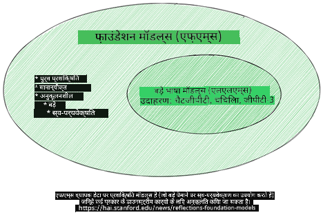

छवि स्रोत: [Essential Guide to Foundation Models and Large Language Models | by Babar M Bhatti | Medium](https://thebabar.medium.com/essential-guide-to-foundation-models-and-large-language-models-27dab58f7404)

इस भेद को और स्पष्ट करने के लिए, आइए ChatGPT को उदाहरण के रूप में लें। ChatGPT का पहला संस्करण बनाने के लिए, GPT-3.5 नामक मॉडल को Foundation Model के रूप में उपयोग किया गया था। इसका मतलब है कि OpenAI ने कुछ चैट-विशिष्ट डेटा का उपयोग करके GPT-3.5 का एक ट्यून किया हुआ संस्करण बनाया, जो बातचीत के परिदृश्यों जैसे चैटबॉट्स में बेहतर प्रदर्शन करता है।

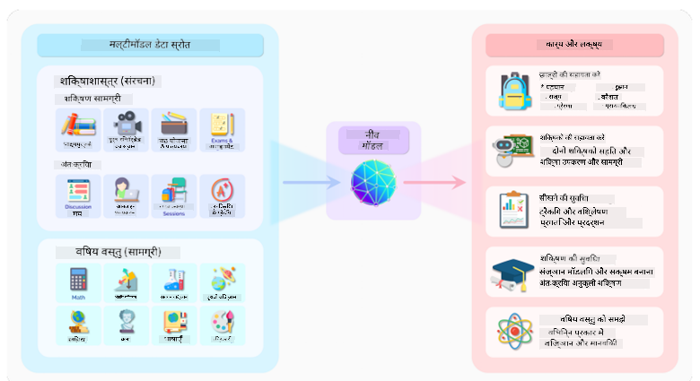

छवि स्रोत: [2108.07258.pdf (arxiv.org)](https://arxiv.org/pdf/2108.07258.pdf?WT.mc_id=academic-105485-koreyst)

### Open Source बनाम Proprietary Models

LLMs को वर्गीकृत करने का एक और तरीका है कि वे ओपन सोर्स हैं या प्रोपाइटरी।

ओपन सोर्स मॉडल वे मॉडल होते हैं जो सार्वजनिक रूप से उपलब्ध होते हैं और किसी भी व्यक्ति द्वारा उपयोग किए जा सकते हैं। इन्हें अक्सर उस कंपनी या शोध समुदाय द्वारा जारी किया जाता है जिसने इन्हें बनाया है। इन मॉडलों को देखा, संशोधित और विभिन्न उपयोग मामलों के लिए अनुकूलित किया जा सकता है। हालांकि, ये हमेशा उत्पादन उपयोग के लिए अनुकूलित नहीं होते और प्रोपाइटरी मॉडलों जितने प्रदर्शनकारी नहीं हो सकते। साथ ही, ओपन सोर्स मॉडलों के लिए फंडिंग सीमित हो सकती है, और इन्हें दीर्घकालिक रूप से मेंटेन या नवीनतम शोध के साथ अपडेट नहीं किया जा सकता। लोकप्रिय ओपन सोर्स मॉडलों के उदाहरण हैं [Alpaca](https://crfm.stanford.edu/2023/03/13/alpaca.html?WT.mc_id=academic-105485-koreyst), [Bloom](https://huggingface.co/bigscience/bloom) और [LLaMA](https://llama.meta.com)।

प्रोपाइटरी मॉडल वे मॉडल होते हैं जो किसी कंपनी के स्वामित्व में होते हैं और सार्वजनिक रूप से उपलब्ध नहीं होते। ये अक्सर उत्पादन उपयोग के लिए अनुकूलित होते हैं। हालांकि, इन्हें देखा, संशोधित या विभिन्न उपयोग मामलों के लिए अनुकूलित नहीं किया जा सकता। ये हमेशा मुफ्त उपलब्ध नहीं होते और उपयोग के लिए सदस्यता या भुगतान की आवश्यकता हो सकती है। इसके अलावा, उपयोगकर्ताओं के पास मॉडल के प्रशिक्षण के लिए उपयोग किए गए डेटा पर नियंत्रण नहीं होता, इसलिए उन्हें डेटा गोपनीयता और AI के जिम्मेदार उपयोग के लिए मॉडल मालिक पर भरोसा करना पड़ता है। लोकप्रिय प्रोपाइटरी मॉडलों के उदाहरण हैं [OpenAI मॉडल](https://platform.openai.com/docs/models/overview?WT.mc_id=academic-105485-koreyst), [Google Bard](https://sapling.ai/llm/bard?WT.mc_id=academic-105485-koreyst) और [Claude 2](https://www.anthropic.com/index/claude-2?WT.mc_id=academic-105485-koreyst)।

### Embedding बनाम Image Generation बनाम Text और Code Generation

LLMs को उनके आउटपुट के आधार पर भी वर्गीकृत किया जा सकता है।

Embedding मॉडल ऐसे मॉडल होते हैं जो टेक्स्ट को एक संख्यात्मक रूप में बदल सकते हैं, जिसे embedding कहा जाता है, जो इनपुट टेक्स्ट का संख्यात्मक प्रतिनिधित्व होता है। Embeddings मशीनों के लिए शब्दों या वाक्यों के बीच संबंधों को समझना आसान बनाते हैं और इन्हें अन्य मॉडलों जैसे क्लासिफिकेशन या क्लस्टरिंग मॉडल के इनपुट के रूप में उपयोग किया जा सकता है, जो संख्यात्मक डेटा पर बेहतर प्रदर्शन करते हैं। Embedding मॉडल अक्सर ट्रांसफर लर्निंग के लिए उपयोग किए जाते हैं, जहां एक मॉडल को एक ऐसे कार्य के लिए बनाया जाता है जिसके लिए बहुत सारा डेटा उपलब्ध होता है, और फिर मॉडल के वज़न (embeddings) को अन्य डाउनस्ट्रीम कार्यों के लिए पुनः उपयोग किया जाता है। इस श्रेणी का एक उदाहरण है [OpenAI embeddings](https://platform.openai.com/docs/models/embeddings?WT.mc_id=academic-105485-koreyst)।

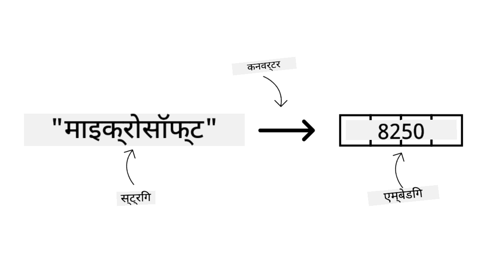

इमेज जनरेशन मॉडल वे मॉडल होते हैं जो चित्र बनाते हैं। ये मॉडल अक्सर इमेज संपादन, इमेज संश्लेषण, और इमेज ट्रांसलेशन के लिए उपयोग किए जाते हैं। इमेज जनरेशन मॉडल बड़े इमेज डेटासेट जैसे [LAION-5B](https://laion.ai/blog/laion-5b/?WT.mc_id=academic-105485-koreyst) पर प्रशिक्षित होते हैं, और नए चित्र बनाने या मौजूदा चित्रों को इनपेंटिंग, सुपर-रिज़ॉल्यूशन, और कलराइजेशन तकनीकों के साथ संपादित करने के लिए उपयोग किए जा सकते हैं। उदाहरणों में [DALL-E-3](https://openai.com/dall-e-3?WT.mc_id=academic-105485-koreyst) और [Stable Diffusion मॉडल](https://github.com/Stability-AI/StableDiffusion?WT.mc_id=academic-105485-koreyst) शामिल हैं।

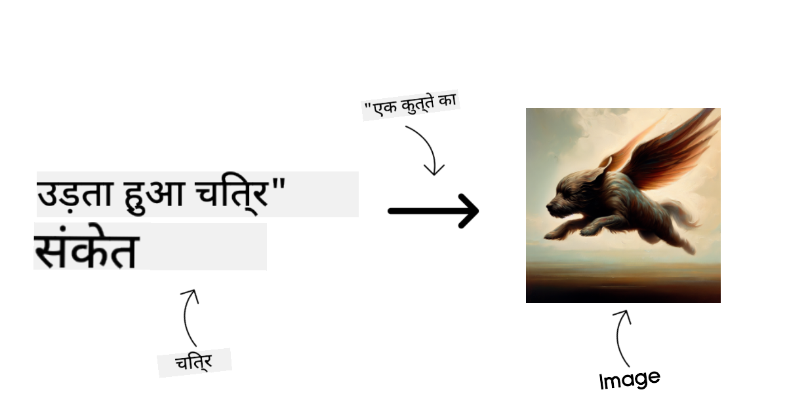

टेक्स्ट और कोड जनरेशन मॉडल वे मॉडल होते हैं जो टेक्स्ट या कोड उत्पन्न करते हैं। ये मॉडल अक्सर टेक्स्ट सारांशण, अनुवाद, और प्रश्नोत्तर के लिए उपयोग किए जाते हैं। टेक्स्ट जनरेशन मॉडल बड़े टेक्स्ट डेटासेट जैसे [BookCorpus](https://www.cv-foundation.org/openaccess/content_iccv_2015/html/Zhu_Aligning_Books_and_ICCV_2015_paper.html?WT.mc_id=academic-105485-koreyst) पर प्रशिक्षित होते हैं, और नए टेक्स्ट बनाने या प्रश्नों के उत्तर देने के लिए उपयोग किए जा सकते हैं। कोड जनरेशन मॉडल, जैसे [CodeParrot](https://huggingface.co/codeparrot?WT.mc_id=academic-105485-koreyst), बड़े कोड डेटासेट जैसे GitHub पर प्रशिक्षित होते हैं, और नए कोड बनाने या मौजूदा कोड में बग ठीक करने के लिए उपयोग किए जाते हैं।

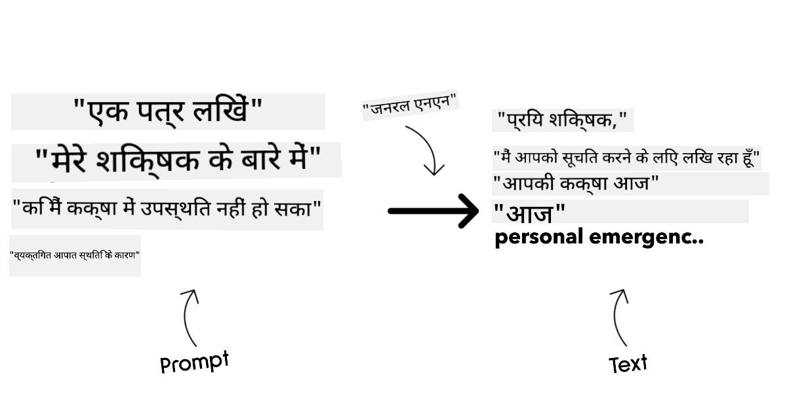

### Encoder-Decoder बनाम Decoder-only

LLMs की विभिन्न वास्तुकला प्रकारों के बारे में बात करने के लिए, आइए एक उपमा का उपयोग करें।

कल्पना करें कि आपके मैनेजर ने आपको छात्रों के लिए एक क्विज़ लिखने का कार्य दिया है। आपके दो सहकर्मी हैं; एक सामग्री बनाने का काम देखता है और दूसरा समीक्षा करने का।

सामग्री निर्माता एक Decoder-only मॉडल की तरह है, जो विषय को देखकर देख सकता है कि आपने क्या लिखा है और फिर उसी के आधार पर एक कोर्स लिख सकता है। वे आकर्षक और सूचनात्मक सामग्री लिखने में बहुत अच्छे होते हैं, लेकिन विषय और सीखने के उद्देश्यों को समझने में उतने अच्छे नहीं होते। Decoder मॉडल के उदाहरण हैं GPT परिवार के मॉडल, जैसे GPT-3।

समीक्षक एक Encoder-only मॉडल की तरह है, जो लिखे गए कोर्स और उत्तरों को देखता है, उनके बीच संबंधों को समझता है और संदर्भ को समझता है, लेकिन सामग्री उत्पन्न करने में अच्छा नहीं होता। Encoder-only मॉडल का उदाहरण BERT है।

कल्पना करें कि हमारे पास कोई ऐसा भी हो जो क्विज़ को बना भी सके और समीक्षा भी कर सके, यह एक Encoder-Decoder मॉडल होगा। इसके उदाहरण हैं BART और T5।

### सेवा बनाम मॉडल

अब, सेवा और मॉडल के बीच के अंतर के बारे में बात करते हैं। सेवा एक उत्पाद है जो क्लाउड सेवा प्रदाता द्वारा प्रदान किया जाता है, और अक्सर मॉडल, डेटा, और अन्य घटकों का संयोजन होता है। मॉडल सेवा का मुख्य घटक होता है, और अक्सर एक Foundation Model होता है, जैसे कि LLM।

सेवाएं अक्सर उत्पादन उपयोग के लिए अनुकूलित होती हैं और मॉडल की तुलना में उपयोग में आसान होती हैं, आमतौर पर ग्राफिकल यूजर इंटरफेस के माध्यम से। हालांकि, सेवाएं हमेशा मुफ्त उपलब्ध नहीं होतीं, और उपयोग के लिए सदस्यता या भुगतान की आवश्यकता हो सकती है, जिससे सेवा मालिक के उपकरणों और संसाधनों का लाभ उठाया जा सके, खर्चों को अनुकूलित किया जा सके और आसानी से स्केल किया जा सके। एक सेवा का उदाहरण है [Azure OpenAI Service](https://learn.microsoft.com/azure/ai-services/openai/overview?WT.mc_id=academic-105485-koreyst), जो पे-एज़-यू-गो दर योजना प्रदान करता है, यानी उपयोगकर्ताओं से सेवा के उपयोग के अनुपात में शुल्क लिया जाता है। साथ ही, Azure OpenAI Service मॉडल की क्षमताओं के ऊपर एंटरप्राइज-ग्रेड सुरक्षा और जिम्मेदार AI फ्रेमवर्क भी प्रदान करता है।

मॉडल केवल न्यूरल नेटवर्क होते हैं, जिनमें पैरामीटर, वज़न आदि होते हैं। कंपनियों को स्थानीय रूप से चलाने की अनुमति देते हैं, लेकिन इसके लिए उपकरण खरीदने, स्केलिंग के लिए संरचना बनाने और लाइसेंस खरीदने या ओपन सोर्स मॉडल का उपयोग करने की आवश्यकता होती है। LLaMA जैसे मॉडल उपलब्ध हैं, जिन्हें चलाने के लिए कंप्यूटेशनल पावर चाहिए।

## Azure पर प्रदर्शन समझने के लिए विभिन्न मॉडलों के साथ परीक्षण और पुनरावृत्ति कैसे करें

एक बार जब हमारी टीम ने वर्तमान LLMs के परिदृश्य का अन्वेषण कर लिया और अपने परिदृश्यों के लिए कुछ अच्छे उम्मीदवारों की पहचान कर ली, तो अगला कदम है उन्हें अपने डेटा और वर्कलोड पर परीक्षण करना। यह एक पुनरावृत्तिमूलक प्रक्रिया है, जो प्रयोगों और मापों के माध्यम से की जाती है।
हमने पिछले पैराग्राफ़ में जिन अधिकांश मॉडलों का उल्लेख किया है (OpenAI मॉडल, Llama2 जैसे ओपन सोर्स मॉडल, और Hugging Face ट्रांसफॉर्मर्स) वे [Azure AI Studio](https://ai.azure.com/?WT.mc_id=academic-105485-koreyst) के [Model Catalog](https://learn.microsoft.com/azure/ai-studio/how-to/model-catalog-overview?WT.mc_id=academic-105485-koreyst) में उपलब्ध हैं।

[Azure AI Studio](https://learn.microsoft.com/azure/ai-studio/what-is-ai-studio?WT.mc_id=academic-105485-koreyst) एक क्लाउड प्लेटफ़ॉर्म है जिसे डेवलपर्स के लिए डिज़ाइन किया गया है ताकि वे जनरेटिव AI एप्लिकेशन बना सकें और पूरे विकास जीवनचक्र को प्रबंधित कर सकें - प्रयोग से लेकर मूल्यांकन तक - सभी Azure AI सेवाओं को एक ही हब में एक उपयोगी GUI के साथ जोड़कर। Azure AI Studio में Model Catalog उपयोगकर्ता को सक्षम बनाता है:

- कैटलॉग में रुचि के फाउंडेशन मॉडल को खोजने के लिए - चाहे वह प्रोपाइटरी हो या ओपन सोर्स, कार्य, लाइसेंस, या नाम के आधार पर फ़िल्टर करके। खोज को बेहतर बनाने के लिए, मॉडल को संग्रहों में व्यवस्थित किया गया है, जैसे Azure OpenAI संग्रह, Hugging Face संग्रह, और अन्य।

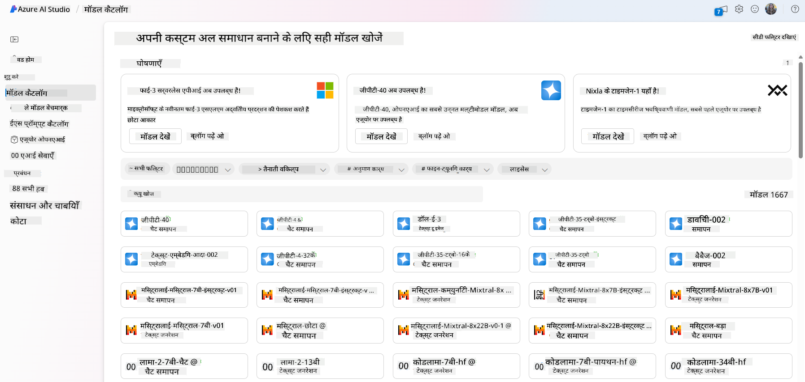

- मॉडल कार्ड की समीक्षा करें, जिसमें उपयोग के उद्देश्य और प्रशिक्षण डेटा का विस्तृत विवरण, कोड उदाहरण और आंतरिक मूल्यांकन पुस्तकालय पर मूल्यांकन परिणाम शामिल हैं।

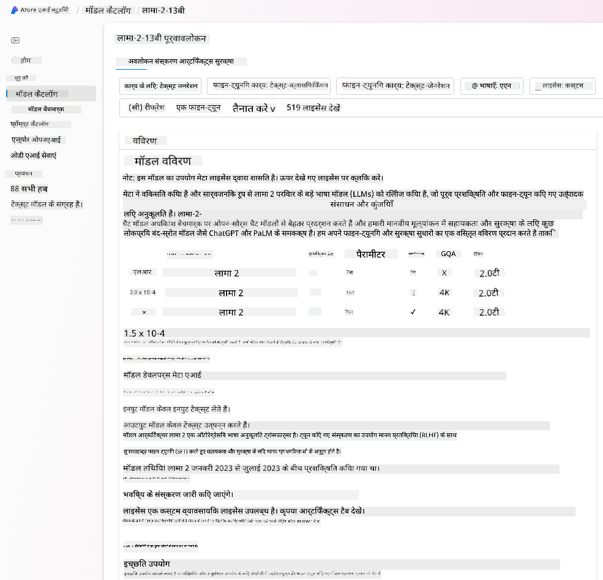

- उद्योग में उपलब्ध मॉडलों और डेटासेट्स के बीच बेंचमार्क की तुलना करें ताकि यह आंका जा सके कि कौन सा मॉडल व्यावसायिक परिदृश्य के लिए उपयुक्त है, [Model Benchmarks](https://learn.microsoft.com/azure/ai-studio/how-to/model-benchmarks?WT.mc_id=academic-105485-koreyst) पैन के माध्यम से।

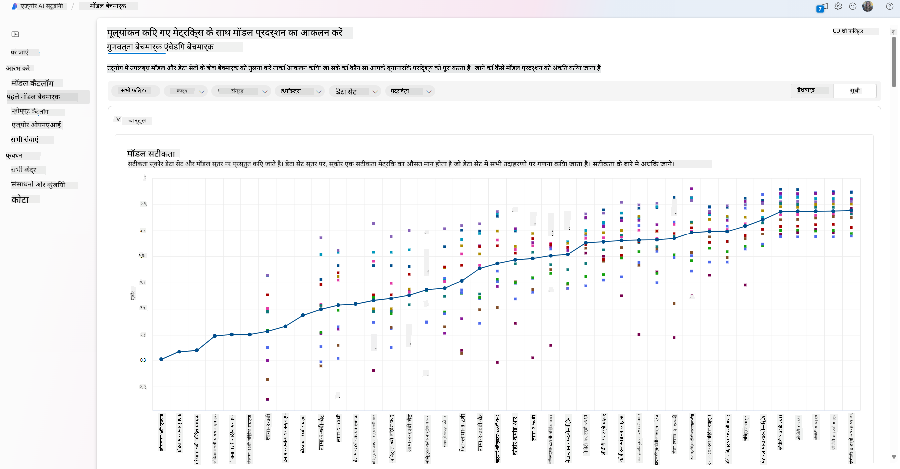

- कस्टम प्रशिक्षण डेटा पर मॉडल को फाइन-ट्यून करें ताकि किसी विशिष्ट कार्यभार में मॉडल का प्रदर्शन बेहतर हो सके, Azure AI Studio की प्रयोग और ट्रैकिंग क्षमताओं का लाभ उठाते हुए।

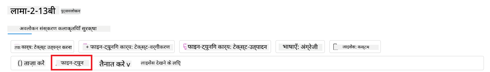

- मूल प्री-ट्रेंड मॉडल या फाइन-ट्यून किए गए संस्करण को रिमोट रियल टाइम इन्फरेंस - मैनेज्ड कंप्यूट - या सर्वरलेस API एंडपॉइंट - [pay-as-you-go](https://learn.microsoft.com/azure/ai-studio/how-to/model-catalog-overview#model-deployment-managed-compute-and-serverless-api-pay-as-you-go?WT.mc_id=academic-105485-koreyst) - पर तैनात करें ताकि एप्लिकेशन इसे उपयोग कर सकें।

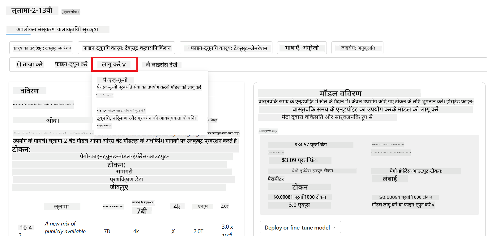

> [!NOTE]
> कैटलॉग में सभी मॉडल वर्तमान में फाइन-ट्यूनिंग और/या pay-as-you-go तैनाती के लिए उपलब्ध नहीं हैं। मॉडल की क्षमताओं और सीमाओं के विवरण के लिए मॉडल कार्ड देखें।

## LLM परिणामों में सुधार

हमने अपनी स्टार्टअप टीम के साथ विभिन्न प्रकार के LLMs और एक क्लाउड प्लेटफ़ॉर्म (Azure Machine Learning) का उपयोग करके विभिन्न मॉडलों की तुलना की, उन्हें परीक्षण डेटा पर मूल्यांकन किया, प्रदर्शन में सुधार किया और इन्फरेंस एंडपॉइंट्स पर तैनात किया।

लेकिन वे कब फाइन-ट्यूनिंग मॉडल पर विचार करें बजाय प्री-ट्रेंड मॉडल के उपयोग के? क्या विशिष्ट कार्यभार पर मॉडल प्रदर्शन सुधारने के अन्य तरीके हैं?

एक व्यवसाय LLM से आवश्यक परिणाम प्राप्त करने के लिए कई तरीके अपना सकता है। आप उत्पादन में LLM तैनात करते समय विभिन्न प्रशिक्षण स्तरों वाले विभिन्न प्रकार के मॉडल चुन सकते हैं, जिनकी जटिलता, लागत और गुणवत्ता अलग-अलग होती है। यहाँ कुछ अलग-अलग तरीके दिए गए हैं:

- **संदर्भ के साथ प्रॉम्प्ट इंजीनियरिंग**। विचार यह है कि जब आप प्रॉम्प्ट देते हैं तो पर्याप्त संदर्भ प्रदान करें ताकि आपको आवश्यक उत्तर मिल सकें।

- **Retrieval Augmented Generation, RAG**। आपका डेटा उदाहरण के लिए किसी डेटाबेस या वेब एंडपॉइंट में हो सकता है, यह सुनिश्चित करने के लिए कि यह डेटा या इसका एक उपसमूह प्रॉम्प्टिंग के समय शामिल हो, आप संबंधित डेटा प्राप्त कर सकते हैं और उसे उपयोगकर्ता के प्रॉम्प्ट का हिस्सा बना सकते हैं।

- **फाइन-ट्यून किया गया मॉडल**। यहाँ, आपने मॉडल को अपने डेटा पर और प्रशिक्षित किया है जिससे मॉडल आपकी आवश्यकताओं के प्रति अधिक सटीक और उत्तरदायी हो गया है, लेकिन यह महंगा हो सकता है।

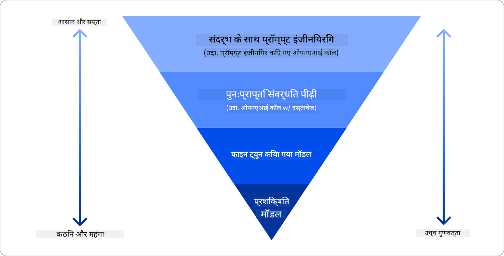

Img स्रोत: [Four Ways that Enterprises Deploy LLMs | Fiddler AI Blog](https://www.fiddler.ai/blog/four-ways-that-enterprises-deploy-llms?WT.mc_id=academic-105485-koreyst)

### संदर्भ के साथ प्रॉम्प्ट इंजीनियरिंग

प्री-ट्रेंड LLM सामान्य प्राकृतिक भाषा कार्यों पर बहुत अच्छा काम करते हैं, यहां तक कि एक छोटे प्रॉम्प्ट, जैसे पूरा करने के लिए एक वाक्य या एक प्रश्न के साथ भी – जिसे “zero-shot” लर्निंग कहा जाता है।

हालांकि, जितना अधिक उपयोगकर्ता अपनी क्वेरी को फ्रेम कर सकता है, विस्तृत अनुरोध और उदाहरणों के साथ – यानी संदर्भ – उतना ही उत्तर सटीक और उपयोगकर्ता की अपेक्षाओं के करीब होगा। इस स्थिति में, यदि प्रॉम्प्ट में केवल एक उदाहरण शामिल है तो इसे “one-shot” लर्निंग कहा जाता है और यदि इसमें कई उदाहरण शामिल हैं तो इसे “few-shot” लर्निंग कहते हैं। संदर्भ के साथ प्रॉम्प्ट इंजीनियरिंग शुरू करने के लिए सबसे किफायती तरीका है।

### Retrieval Augmented Generation (RAG)

LLM की एक सीमा यह है कि वे केवल उस डेटा का उपयोग कर सकते हैं जो उनके प्रशिक्षण के दौरान उपयोग किया गया था। इसका मतलब है कि वे प्रशिक्षण प्रक्रिया के बाद हुई घटनाओं के बारे में कुछ नहीं जानते, और वे गैर-सार्वजनिक जानकारी (जैसे कंपनी डेटा) तक पहुंच नहीं सकते।
इसे RAG के माध्यम से पार किया जा सकता है, एक तकनीक जो प्रॉम्प्ट को बाहरी डेटा के साथ बढ़ाती है, दस्तावेज़ों के टुकड़ों के रूप में, प्रॉम्प्ट की लंबाई की सीमा को ध्यान में रखते हुए। यह Vector डेटाबेस टूल्स (जैसे [Azure Vector Search](https://learn.microsoft.com/azure/search/vector-search-overview?WT.mc_id=academic-105485-koreyst)) द्वारा समर्थित है, जो विभिन्न पूर्व-परिभाषित डेटा स्रोतों से उपयोगी टुकड़े पुनः प्राप्त करते हैं और उन्हें प्रॉम्प्ट संदर्भ में जोड़ते हैं।

यह तकनीक तब बहुत उपयोगी होती है जब किसी व्यवसाय के पास पर्याप्त डेटा, समय या संसाधन नहीं होते हैं LLM को फाइन-ट्यून करने के लिए, लेकिन फिर भी वे किसी विशिष्ट कार्यभार पर प्रदर्शन सुधारना चाहते हैं और गलत सूचनाओं, यानी वास्तविकता के मिथ्यांकन या हानिकारक सामग्री के जोखिम को कम करना चाहते हैं।

### फाइन-ट्यून किया गया मॉडल

फाइन-ट्यूनिंग एक प्रक्रिया है जो ट्रांसफर लर्निंग का उपयोग करके मॉडल को किसी डाउनस्ट्रीम कार्य के लिए या किसी विशिष्ट समस्या को हल करने के लिए ‘अनुकूलित’ करती है। few-shot लर्निंग और RAG से अलग, यह एक नया मॉडल उत्पन्न करता है, जिसमें अपडेटेड वेट्स और बायस होते हैं। इसके लिए प्रशिक्षण उदाहरणों का एक सेट चाहिए जिसमें एकल इनपुट (प्रॉम्प्ट) और उसका संबंधित आउटपुट (पूरक) शामिल होता है।
यह तरीका तब पसंद किया जाता है जब:

- **फाइन-ट्यून किए गए मॉडल का उपयोग करना**। व्यवसाय कम सक्षम फाइन-ट्यून किए गए मॉडल (जैसे एम्बेडिंग मॉडल) का उपयोग करना चाहता है बजाय उच्च प्रदर्शन वाले मॉडल के, जिससे लागत प्रभावी और तेज़ समाधान मिलता है।

- **लेटेंसी पर विचार करना**। किसी विशिष्ट उपयोग मामले के लिए लेटेंसी महत्वपूर्ण है, इसलिए बहुत लंबे प्रॉम्प्ट का उपयोग संभव नहीं है या मॉडल को सीखने के लिए आवश्यक उदाहरणों की संख्या प्रॉम्प्ट की लंबाई सीमा में फिट नहीं होती।

- **अप-टू-डेट रहना**। व्यवसाय के पास उच्च गुणवत्ता वाला डेटा और ग्राउंड ट्रूथ लेबल्स की बड़ी मात्रा है और वे समय के साथ इस डेटा को अपडेट रखने के लिए आवश्यक संसाधन रखते हैं।

### प्रशिक्षित मॉडल

शून्य से LLM को प्रशिक्षित करना निस्संदेह सबसे कठिन और जटिल तरीका है, जिसके लिए भारी मात्रा में डेटा, कुशल संसाधन और उपयुक्त कंप्यूटेशनल पावर की आवश्यकता होती है। यह विकल्प केवल तब विचार किया जाना चाहिए जब व्यवसाय के पास डोमेन-विशिष्ट उपयोग मामला हो और बड़ी मात्रा में डोमेन-केंद्रित डेटा उपलब्ध हो।

## ज्ञान जांच

LLM पूर्णता परिणामों में सुधार के लिए कौन सा तरीका अच्छा हो सकता है?

1. संदर्भ के साथ प्रॉम्प्ट इंजीनियरिंग  
1. RAG  
1. फाइन-ट्यून किया गया मॉडल  

उत्तर: 3, यदि आपके पास समय, संसाधन और उच्च गुणवत्ता वाला डेटा है, तो अपडेट रहने के लिए फाइन-ट्यूनिंग बेहतर विकल्प है। हालांकि, यदि आप सुधार करना चाहते हैं और आपके पास समय की कमी है, तो पहले RAG पर विचार करना उचित है।

## 🚀 चुनौती

अपने व्यवसाय के लिए [RAG का उपयोग](https://learn.microsoft.com/azure/search/retrieval-augmented-generation-overview?WT.mc_id=academic-105485-koreyst) कैसे करें, इसके बारे में और पढ़ें।

## शानदार काम, अपनी सीख जारी रखें

इस पाठ को पूरा करने के बाद, हमारे [Generative AI Learning collection](https://aka.ms/genai-collection?WT.mc_id=academic-105485-koreyst) को देखें ताकि आप अपनी जनरेटिव AI की जानकारी को और बढ़ा सकें!

अब Lesson 3 पर जाएं जहाँ हम देखेंगे कि कैसे [जनरेटिव AI को जिम्मेदारी से बनाया जाए](../03-using-generative-ai-responsibly/README.md?WT.mc_id=academic-105485-koreyst)!

**अस्वीकरण**:  
यह दस्तावेज़ AI अनुवाद सेवा [Co-op Translator](https://github.com/Azure/co-op-translator) का उपयोग करके अनुवादित किया गया है। जबकि हम सटीकता के लिए प्रयासरत हैं, कृपया ध्यान दें कि स्वचालित अनुवादों में त्रुटियाँ या अशुद्धियाँ हो सकती हैं। मूल दस्तावेज़ अपनी मूल भाषा में ही अधिकारिक स्रोत माना जाना चाहिए। महत्वपूर्ण जानकारी के लिए, पेशेवर मानव अनुवाद की सलाह दी जाती है। इस अनुवाद के उपयोग से उत्पन्न किसी भी गलतफहमी या गलत व्याख्या के लिए हम जिम्मेदार नहीं हैं।