# विभिन्न LLMs का अन्वेषण और तुलना

[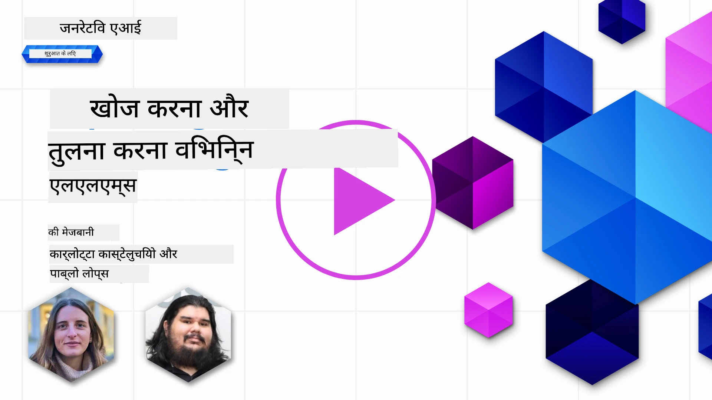](https://youtu.be/KIRUeDKscfI?si=8BHX1zvwzQBn-PlK)

> _इस पाठ का वीडियो देखने के लिए ऊपर दी गई छवि पर क्लिक करें_

पिछले पाठ के साथ, हमने देखा कि जनरेटिव AI तकनीकी परिदृश्य को कैसे बदल रहा है, बड़े भाषा मॉडलों (LLMs) का काम कैसे होता है और एक व्यवसाय - जैसे हमारा स्टार्टअप - इन्हें अपने उपयोग मामलों में कैसे लागू कर सकता है और कैसे बढ़ सकता है! इस अध्याय में, हम विभिन्न प्रकार के बड़े भाषा मॉडलों (LLMs) की तुलना और विरोधाभास पर विचार कर रहे हैं ताकि उनके फायदे और नुकसान को समझा जा सके।

हमारे स्टार्टअप की यात्रा का अगला कदम है LLMs के वर्तमान परिदृश्य का अन्वेषण करना और समझना कि कौन से हमारे उपयोग मामले के लिए उपयुक्त हैं।

## परिचय

यह पाठ कवर करेगा:

- वर्तमान परिदृश्य में विभिन्न प्रकार के LLMs।
- Azure में अपने उपयोग मामले के लिए विभिन्न मॉडलों का परीक्षण, पुनरावृत्ति और तुलना।
- एक LLM को तैनात करने का तरीका।

## सीखने के लक्ष्य

इस पाठ को पूरा करने के बाद, आप सक्षम होंगे:

- अपने उपयोग मामले के लिए सही मॉडल का चयन करना।
- यह समझना कि अपने मॉडल का प्रदर्शन कैसे परीक्षण, पुनरावृत्ति और सुधारें।
- यह जानना कि व्यवसाय मॉडल कैसे तैनात करते हैं।

## विभिन्न प्रकार के LLMs को समझना

LLMs को उनके आर्किटेक्चर, प्रशिक्षण डेटा, और उपयोग मामले के आधार पर कई वर्गीकृत किया जा सकता है। इन भेदों को समझना हमारे स्टार्टअप को परिदृश्य के लिए सही मॉडल चुनने और प्रदर्शन को परीक्षण, पुनरावृत्ति और सुधारने में मदद करेगा।

कई प्रकार के LLM मॉडल होते हैं, आपका मॉडल चयन इस बात पर निर्भर करता है कि आप उन्हें किस लिए उपयोग करना चाहते हैं, आपका डेटा, आप कितना भुगतान करने के लिए तैयार हैं और भी बहुत कुछ।

आप जिस प्रकार से मॉडल का उपयोग करना चाहते हैं जैसे कि टेक्स्ट, ऑडियो, वीडियो, इमेज जनरेशन आदि, उसके आधार पर आप अलग प्रकार के मॉडल चुन सकते हैं।

- **ऑडियो और भाषण पहचान**। व्हिस्पर-स्टाइल मॉडल अभी भी सामान्य उद्देश्य के भाषण पहचान मॉडल हैं, लेकिन प्रोडक्शन विकल्पों में अब नए स्पीच-टू-टेक्स्ट मॉडल जैसे `gpt-4o-transcribe`, `gpt-4o-mini-transcribe`, और डायरीजेशन संस्करण भी शामिल हैं। अपने परिदृश्य के लिए भाषा कवरेज, डायरीजेशन, रियल-टाइम समर्थन, विलंबता, और लागत का मूल्यांकन करें। [OpenAI स्पीच-टू-टेक्स्ट दस्तावेज़](https://platform.openai.com/docs/guides/speech-to-text?WT.mc_id=academic-105485-koreyst) में अधिक जानें।

- **छवि जनरेशन**। DALL-E और Midjourney अच्छी तरह से जाने-माने छवि जनरेशन विकल्प हैं, लेकिन वर्तमान OpenAI छवि API GPT Image मॉडल जैसे `gpt-image-2` पर केंद्रित हैं, जबकि Stable Diffusion, Imagen, Flux, और अन्य मॉडल परिवार भी आम विकल्प हैं। प्रॉम्प्ट अनुरूपता, संपादन समर्थन, शैली नियंत्रण, सुरक्षा आवश्यकताओं, और लाइसेंसिंग की तुलना करें। [OpenAI इमेज जनरेशन गाइड](https://platform.openai.com/docs/guides/images?WT.mc_id=academic-105485-koreyst) और इस पाठ्यक्रम के अध्याय 9 में अधिक सीखें।

- **टेक्स्ट जनरेशन**। टेक्स्ट मॉडल अब फ्रंटियर मॉडल, तर्क मॉडल, छोटे कम-विलंबता वाले मॉडल, और खुले वज़न वाले मॉडल तक फैले हुए हैं। वर्तमान उदाहरणों में OpenAI GPT-5.x मॉडल, Anthropic Claude 4.x मॉडल, Google Gemini 3.x मॉडल, Meta Llama 4 मॉडल, और Mistral मॉडल शामिल हैं। केवल रिलीज तिथि या मूल्य के आधार पर चयन न करें; कार्य गुणवत्ता, विलंबता, संदर्भ विंडो, टूल उपयोग, सुरक्षा व्यवहार, क्षेत्रीय उपलब्धता, और कुल लागत की तुलना करें। Azure पर उपलब्ध मॉडलों की तुलना करने के लिए [Microsoft Foundry मॉडल कैटलॉग](https://ai.azure.com/catalog?WT.mc_id=academic-105485-koreyst) एक अच्छा स्थान है।

- **मल्टी-मोडैलिटी**। कई वर्तमान मॉडल टेक्स्ट से अधिक प्रोसेस कर सकते हैं। कुछ इमेज, ऑडियो, या वीडियो इनपुट स्वीकार करते हैं; कुछ टूल कॉल कर सकते हैं; और विशिष्ट मॉडल इमेज, ऑडियो, या वीडियो निर्माण कर सकते हैं। उदाहरण के लिए, वर्तमान OpenAI मॉडल टेक्स्ट और इमेज इनपुट का समर्थन करते हैं, Gemini मॉडल अपने संस्करण के अनुसार टेक्स्ट, कोड, इमेज, ऑडियो, और वीडियो इनपुट का समर्थन कर सकते हैं, और Llama 4 Scout और Maverick खुले वज़न वाले मूल रूप से मल्टीमोडल मॉडल हैं। कार्यप्रवाह बनाने से पहले हमेशा प्रत्येक मॉडल कार्ड में समर्थित इनपुट और आउटपुट मोडैलिटी की जांच करें।

एक मॉडल चुनने का मतलब है आपको कुछ बुनियादी क्षमताएं मिलती हैं, जो शायद पर्याप्त न हों। अक्सर आपके पास कंपनी-विशिष्ट डेटा होता है जिसे आपको किसी न किसी तरह LLM को बताना होता है। इसे करने के लिए कुछ अलग-अलग विकल्प हैं, अगले हिस्सों में इस पर अधिक जानकारी है।

### फाउंडेशन मॉडल्स बनाम LLMs

फाउंडेशन मॉडल शब्द को [स्टैनफोर्ड शोधकर्ताओं द्वारा प्रस्तावित](https://arxiv.org/abs/2108.07258?WT.mc_id=academic-105485-koreyst) किया गया था और इसे एक ऐसे AI मॉडल के रूप में परिभाषित किया गया है जो कुछ मापदंडों का पालन करता है, जैसे:

- **इन्हें बिना पर्यवेक्षण वाली या स्व-पर्यवेक्षण वाली शिक्षा द्वारा प्रशिक्षित किया जाता है**, मतलब इन्हें लेबल रहित मल्टी-मोडल डेटा पर प्रशिक्षित किया जाता है, और इनके प्रशिक्षण प्रक्रिया के लिए मानव एनोटेशन या लेबलिंग की आवश्यकता नहीं होती।
- **वे बहुत बड़े मॉडल होते हैं**, जो अरबों पैरामीटर पर प्रशिक्षित गहरे न्यूरल नेटवर्क पर आधारित होते हैं।
- **आमतौर पर इन्हें अन्य मॉडलों की ‘फाउंडेशन’ के रूप में सेवा देने के लिए बनाया जाता है**, मतलब इन्हें अन्य मॉडलों के लिए एक प्रारंभिक बिंदु के रूप में उपयोग किया जा सकता है, जिसे फाइन-ट्यूनिंग के द्वारा किया जा सकता है।

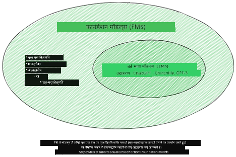

छवि स्रोत: [Essential Guide to Foundation Models and Large Language Models | by Babar M Bhatti | Medium
](https://thebabar.medium.com/essential-guide-to-foundation-models-and-large-language-models-27dab58f7404)

इस भेद को और स्पष्ट करने के लिए, चलिए ChatGPT को एक ऐतिहासिक उदाहरण के रूप में लेते हैं। ChatGPT के प्रारंभिक संस्करणों ने GPT-3.5 का उपयोग फाउंडेशन मॉडल के रूप में किया। OpenAI ने फिर चैट-विशिष्ट डेटा और संरेखण तकनीकों का उपयोग करके एक ट्यून किए गए संस्करण का निर्माण किया जो संवादी स्थितियों, जैसे चैटबॉट्स में बेहतर प्रदर्शन करता है। आधुनिक AI सेवाएं अक्सर कई मॉडल संस्करणों के बीच मार्गदर्शन करती हैं, इसलिए सेवा नाम और अंतर्निहित मॉडल नाम हमेशा एक ही नहीं होते।

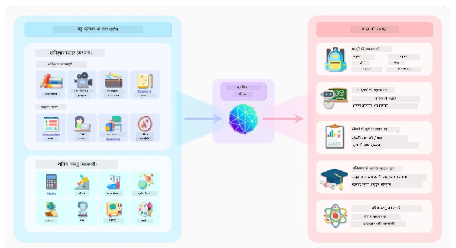

छवि स्रोत: [2108.07258.pdf (arxiv.org)](https://arxiv.org/pdf/2108.07258.pdf?WT.mc_id=academic-105485-koreyst)

### ओपन-वेट/ओपन-सोर्स बनाम प्रोपाइटरी मॉडल

LLMs को वर्गीकृत करने का एक और तरीका है कि वे ओपन-वेट, ओपन-सोर्स, या प्रोपाइटरी हैं या नहीं।

ओपन-सोर्स और ओपन-वेट मॉडल मॉडल आर्टिफैक्ट्स की जांच, डाउनलोड, या अनुकूलन के लिए उपलब्ध कराते हैं, लेकिन उनके लाइसेंस अलग होते हैं। कुछ पूरी तरह से ओपन-सोर्स होते हैं, जबकि अन्य उपयोग सीमा के साथ ओपन-वेट मॉडल होते हैं। ये उस समय उपयोगी हो सकते हैं जब व्यवसाय को तैनाती, डेटा स्थानिकता, लागत, या अनुकूलन पर अधिक नियंत्रण की आवश्यकता होती है। हालांकि, टीमों को प्रोडक्शन में उपयोग करने से पहले लाइसेंस शर्तों, सेवा लागत, रखरखाव, सुरक्षा अपडेट, और मूल्यांकन गुणवत्ता की समीक्षा करनी चाहिए। उदाहरणों में [Meta Llama 4](https://ai.meta.com/blog/llama-4-multimodal-intelligence/?WT.mc_id=academic-105485-koreyst), कुछ [Mistral मॉडल](https://docs.mistral.ai/models/overview?WT.mc_id=academic-105485-koreyst), और कई मॉडल शामिल हैं जो [Hugging Face](https://huggingface.co/models?WT.mc_id=academic-105485-koreyst) पर होस्ट किए गए हैं।

प्रोपाइटरी मॉडल प्रोवाइडर के स्वामित्व और होस्ट किए गए होते हैं। ये मॉडल अक्सर प्रबंधित प्रोडक्शन उपयोग के लिए अनुकूलित होते हैं और मजबूत समर्थन, सुरक्षा प्रणालियां, टूल एकीकरण, और पैमाना प्रदान कर सकते हैं। हालांकि, ग्राहक आमतौर पर मॉडल वज़न की जांच या संशोधन नहीं कर सकते, और उन्हें गोपनीयता, संचयन, अनुपालन, और स्वीकार्य उपयोग के लिए प्रदाता की शर्तों की समीक्षा करनी चाहिए। उदाहरणों में [OpenAI मॉडल](https://platform.openai.com/docs/models?WT.mc_id=academic-105485-koreyst), [Google Gemini](https://deepmind.google/models/gemini/pro/?WT.mc_id=academic-105485-koreyst), और [Anthropic Claude](https://platform.claude.com/docs/en/about-claude/models/overview?WT.mc_id=academic-105485-koreyst) शामिल हैं।

### एम्बेडिंग बनाम इमेज जनरेशन बनाम टेक्स्ट और कोड जनरेशन

LLMs को आउटपुट के आधार पर भी वर्गीकृत किया जा सकता है।

एम्बेडिंग्स मॉडल का एक सेट है जो टेक्स्ट को एक सांख्यिकीय रूप में परिवर्तित कर सकता है, जिसे एम्बेडिंग कहा जाता है, जो इनपुट टेक्स्ट का एक संख्यात्मक प्रतिनिधित्व है। एम्बेडिंग्स मशीनों के लिए शब्दों या वाक्यों के बीच संबंधों को समझना आसान बनाती हैं और इन्हें अन्य मॉडलों द्वारा इनपुट के रूप में उपयोग किया जा सकता है, जैसे कि वर्गीकरण मॉडल, या क्लस्टरिंग मॉडल जो संख्यात्मक डेटा पर बेहतर प्रदर्शन करते हैं। एम्बेडिंग मॉडल का अक्सर ट्रांसफर लर्निंग के लिए उपयोग किया जाता है, जहां एक मॉडल को एक आधार कार्य के लिए बनाया जाता है जिसके लिए बहुत डेटा उपलब्ध होता है, और फिर मॉडल वज़न (एम्बेडिंग्स) को अन्य डाउनस्ट्रीम कार्यों के लिए पुनः उपयोग किया जाता है। इस श्रेणी का एक उदाहरण है [OpenAI एम्बेडिंग्स](https://platform.openai.com/docs/models/embeddings?WT.mc_id=academic-105485-koreyst)।

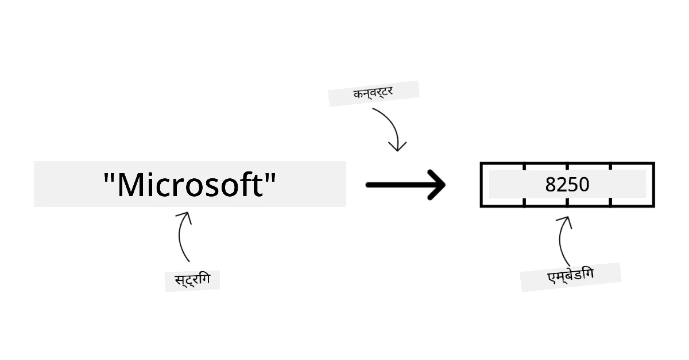

इमेज जनरेशन मॉडल वे मॉडल हैं जो छवियां उत्पन्न करते हैं। ये मॉडल अक्सर इमेज संपादन, इमेज संश्लेषण, और इमेज अनुवाद के लिए उपयोग किए जाते हैं। इमेज जनरेशन मॉडल अक्सर बड़ी छवि डेटासेट पर प्रशिक्षित किए जाते हैं, जैसे [LAION-5B](https://laion.ai/blog/laion-5b/?WT.mc_id=academic-105485-koreyst), और नए छवियां बनाने या इनपेंटिंग, सुपर-रिज़ॉल्यूशन, और कलराइजेशन तकनीकों के साथ मौजूदा छवियों को संपादित करने के लिए उपयोग किए जा सकते हैं। उदाहरणों में [GPT Image मॉडल](https://platform.openai.com/docs/guides/images?WT.mc_id=academic-105485-koreyst), [Stable Diffusion मॉडल](https://github.com/Stability-AI/StableDiffusion?WT.mc_id=academic-105485-koreyst), और Imagen मॉडल शामिल हैं।

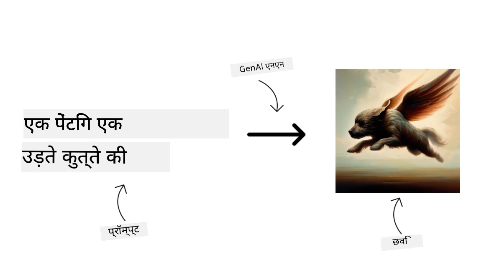

टेक्स्ट और कोड जनरेशन मॉडल वे मॉडल हैं जो टेक्स्ट या कोड उत्पन्न करते हैं। ये मॉडल अक्सर टेक्स्ट सारांशण, अनुवाद, और प्रश्नोत्तरी के लिए उपयोग किए जाते हैं। टेक्स्ट जनरेशन मॉडल अक्सर बड़े टेक्स्ट डेटासेट पर प्रशिक्षित किए जाते हैं, जैसे [BookCorpus](https://www.cv-foundation.org/openaccess/content_iccv_2015/html/Zhu_Aligning_Books_and_ICCV_2015_paper.html?WT.mc_id=academic-105485-koreyst), और नए टेक्स्ट उत्पन्न करने या प्रश्नों के उत्तर देने के लिए उपयोग किए जा सकते हैं। कोड जनरेशन मॉडल, जैसे [CodeParrot](https://huggingface.co/codeparrot?WT.mc_id=academic-105485-koreyst), अक्सर बड़े कोड डेटासेट पर प्रशिक्षित होते हैं, जैसे GitHub, और नए कोड उत्पन्न करने या मौजूदा कोड में बग ठीक करने के लिए उपयोग किए जाते हैं।

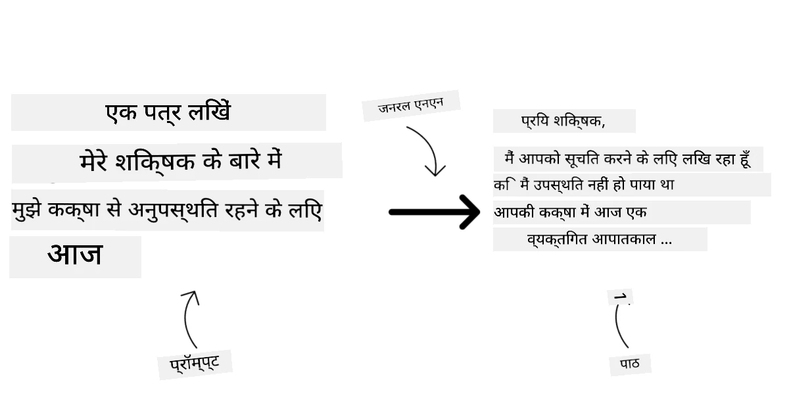

### एन्कोडर-डिकोडर बनाम केवल डिकोडर

LLMs की विभिन्न आर्किटेक्चर के प्रकारों के बारे में बात करने के लिए, आइए एक उपमा का उपयोग करें।

कल्पना करें कि आपके मैनेजर ने छात्रों के लिए एक क्विज़ लिखने के लिए आपको एक कार्य दिया है। आपके दो सहकर्मी हैं; एक सामग्री बनाने की देखरेख करता है और दूसरा समीक्षा करने की।

सामग्री निर्माता एक केवल डिकोडर मॉडल जैसा है: वे विषय को देखते हैं, जो आपने पहले लिखा है उसे देखते हैं, और फिर उस संदर्भ के आधार पर सामग्री उत्पन्न करते हैं। वे आकर्षक और सूचनात्मक सामग्री लिखने में बहुत अच्छे हैं, लेकिन जब कार्य केवल वर्गीकरण, पुनर्प्राप्ति, या एन्कोडिंग जानकारी का होता है, तो वे हमेशा सबसे अच्छा विकल्प नहीं होते। उदाहरण के लिए केवल डिकोडर मॉडल परिवारों में GPT और Llama मॉडल शामिल हैं।

समीक्षक एक केवल एन्कोडर मॉडल जैसा है, वे लिखे गए पाठ्यक्रम और उत्तरों को देखते हैं, उनके बीच संबंधों को नोटिस करते हैं और संदर्भ को समझते हैं, लेकिन वे सामग्री उत्पन्न करने में अच्छे नहीं हैं। केवल एन्कोडर मॉडल का उदाहरण BERT हो सकता है।

कल्पना करें कि हमारे पास कोई ऐसा भी हो जो क्विज़ को बनाए और समीक्षा करे, यही एन्कोडर-डिकोडर मॉडल है। कुछ उदाहरण BART और T5 हैं।

### सेवा बनाम मॉडल

अब, आइए सेवा और मॉडल के बीच के अंतर के बारे में बात करें। सेवा एक उत्पाद है जो क्लाउड सेवा प्रदाता द्वारा प्रदान किया जाता है, और अक्सर मॉडल, डेटा, और अन्य घटकों का संयोजन होता है। मॉडल किसी सेवा का मूल घटक होता है, और अक्सर एक फाउंडेशन मॉडल होता है, जैसे कि LLM।

सेवाएं अक्सर उत्पादक उपयोग के लिए अनुकूलित होती हैं और मॉडल की तुलना में उपयोग में आसान होती हैं, ग्राफिकल यूजर इंटरफेस के माध्यम से। हालांकि, सेवाएं हमेशा मुफ्त उपलब्ध नहीं होतीं, और उपयोग करने के लिए सदस्यता या भुगतान आवश्यक हो सकता है, जिससे सेवा मालिक के उपकरण और संसाधनों का लाभ उठाकर खर्चों का अनुकूलन और स्केलिंग आसान होती है। एक सेवा का उदाहरण है [Azure OpenAI Service](https://learn.microsoft.com/azure/ai-foundry/openai/overview?WT.mc_id=academic-105485-koreyst), जो एक पे-एज़-यू-गो दर योजना प्रदान करता है, जिसका मतलब है उपयोगकर्ताओं से उनके सेवा उपयोग के अनुसार शुल्क लिया जाता है। Azure OpenAI Service मॉडल की क्षमताओं के ऊपर एंटरप्राइज-ग्रेड सुरक्षा और एक जिम्मेदार AI फ्रेमवर्क भी प्रदान करता है।

मॉडल न्यूरल नेटवर्क आर्टिफैक्ट्स होते हैं: पैरामीटर, वज़न, आर्किटेक्चर, टोकनाइज़र, और सहायक विन्यास। मॉडल को स्थानीय या निजी वातावरण में चलाने के लिए उपयुक्त हार्डवेयर, सर्विंग इन्फ्रास्ट्रक्चर, निगरानी, और या तो संगत ओपन-सोर्स/ओपन-वेट लाइसेंस या एक व्यावसायिक लाइसेंस की आवश्यकता होती है। ओपन-वेट मॉडल जैसे Llama 4 या Mistral मॉडल को स्व-होस्ट किया जा सकता है, लेकिन इसके लिए फिर भी कम्प्यूटेशनल शक्ति और संचालन विशेषज्ञता की आवश्यकता होती है।

## Azure पर प्रदर्शन को समझने के लिए विभिन्न मॉडलों के साथ परीक्षण और पुनरावृत्ति कैसे करें

एक बार हमारी टीम ने वर्तमान LLMs परिदृश्य का अन्वेषण कर लिया और उनके परिदृश्यों के लिए कुछ अच्छे उम्मीदवारों की पहचान कर ली, अगला कदम उन्हें उनके डेटा और उनके कार्यभार पर परीक्षण करना है। यह एक पुनरावर्ती प्रक्रिया है, जो प्रयोगों और उपायों द्वारा की जाती है।
हमने पिछले पैराग्राफ़ों में जिन मॉडल्स का उल्लेख किया है (OpenAI मॉडल, खुले-वजन वाले मॉडल जैसे Llama 4 और Mistral, और Hugging Face मॉडल) वे अधिकांश [Microsoft Foundry Models](https://learn.microsoft.com/azure/foundry/concepts/foundry-models-overview?WT.mc_id=academic-105485-koreyst) में उपलब्ध हैं।

[Microsoft Foundry](https://learn.microsoft.com/azure/foundry/what-is-foundry?WT.mc_id=academic-105485-koreyst), जिसे पहले Azure AI Studio/Azure AI Foundry कहा जाता था, AI ऐप्स और एजेंट बनाने के लिए एक एकीकृत Azure प्लेटफ़ॉर्म है। यह डेवलपर्स को प्रयोग, मूल्यांकन से लेकर परिनियोजन, निगरानी, और शासन तक के लाइफसाइकल प्रबंधन में सहायता करता है। Microsoft Foundry में मॉडल कैटलॉग उपयोगकर्ता को सक्षम बनाता है:

- कैटलॉग में रुचिकर बेस मॉडल खोजने के लिए, जिसमें Azure द्वारा बेचे गए मॉडल और भागीदारों तथा समुदाय प्रदाताओं के मॉडल शामिल हैं। उपयोगकर्ता कार्य, प्रदाता, लाइसेंस, परिनियोजन विकल्प, या नाम के आधार पर फ़िल्टर कर सकते हैं।

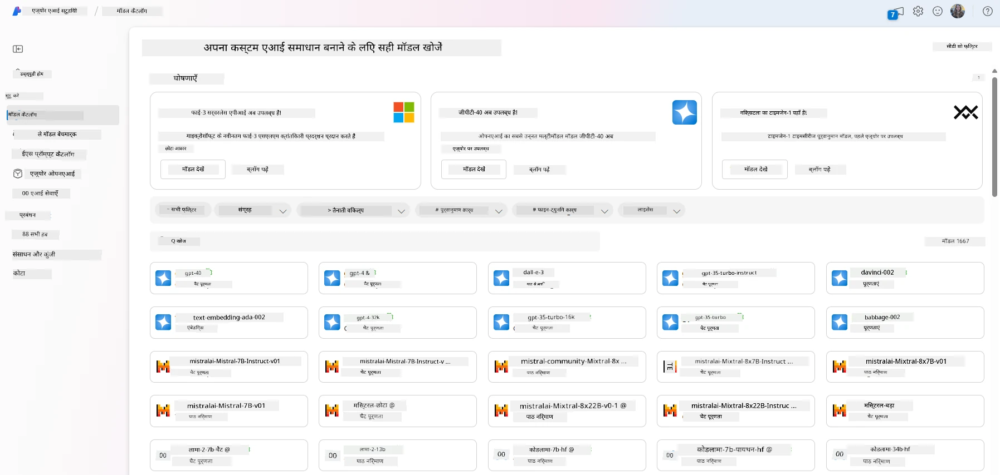

- मॉडल कार्ड की समीक्षा करें, जिसमें उपयोग के इरादे और प्रशिक्षण डेटा का विस्तृत विवरण, कोड उदाहरण और आंतरिक मूल्यांकन पुस्तकालय पर मूल्यांकन परिणाम शामिल हैं।

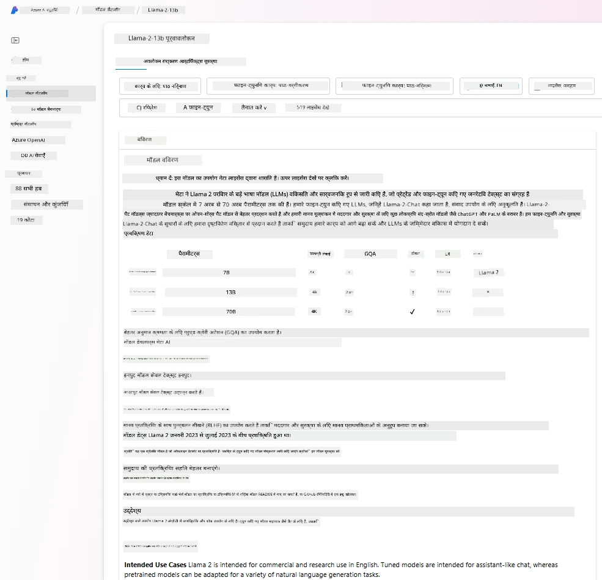

- उद्योग में उपलब्ध मॉडल और डाटासेट्स के बीच बेंचमार्क की तुलना करें ताकि यह आंका जा सके कि कौन सा व्यवसाय परिदृश्य को पूरा करता है, [Model Benchmarks](https://learn.microsoft.com/azure/ai-foundry/concepts/model-benchmarks?WT.mc_id=academic-105485-koreyst) पैन के माध्यम से।

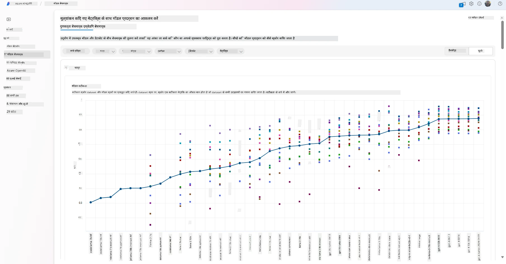

- कस्टम प्रशिक्षण डेटा पर समर्थित मॉडलों का फाइन-ट्यूनिंग करें ताकि किसी विशिष्ट कार्यभार में मॉडल प्रदर्शन में सुधार हो, Microsoft Foundry की प्रयोग और ट्रैकिंग क्षमताओं का लाभ उठाएं।

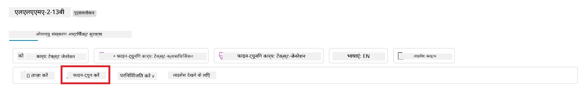

- मूल पूर्व-प्रशिक्षित मॉडल या फाइन-ट्यून किए गए संस्करण को रिमोट रीयल-टाइम इनफरेंस एंडपॉइंट पर तैनात करें, प्रबंधित कंप्यूट या सर्वरलेस परिनियोजन विकल्पों का उपयोग करके, ताकि एप्लिकेशन इसे उपभोग कर सकें।

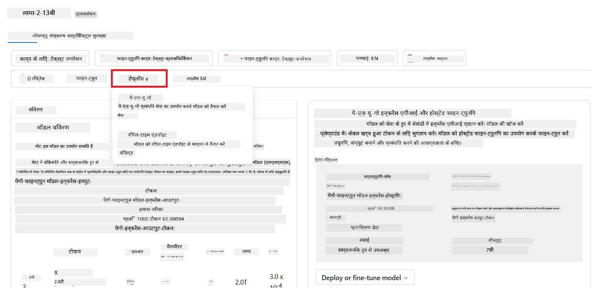

> [!NOTE]
> कैटलॉग में सभी मॉडल वर्तमान में फाइन-ट्यूनिंग और/या पे-एज़-यू-गो परिनियोजन के लिए उपलब्ध नहीं हैं। मॉडल की क्षमताओं और सीमाओं के विवरण के लिए मॉडल कार्ड देखें।

## LLM परिणामों में सुधार

हमने अपनी स्टार्टअप टीम के साथ विभिन्न प्रकार के LLMs और एक क्लाउड प्लेटफ़ॉर्म (Microsoft Foundry) का अन्वेषण किया है जो हमें विभिन्न मॉडलों की तुलना करने, उन्हें परीक्षण डेटा पर मूल्यांकन करने, प्रदर्शन सुधारने और उन्हें इनफरेंस एंडपॉइंट्स पर तैनात करने में सक्षम बनाता है।

लेकिन उन्हें कब एक पूर्व-प्रशिक्षित मॉडल का उपयोग करने की बजाय मॉडल का फाइन-ट्यूनिंग करना चाहिए? क्या विशिष्ट कार्यभारों में मॉडल प्रदर्शन सुधारने के लिए अन्य दृष्टिकोण हैं?

बिजनेस LLM से आवश्यक परिणाम प्राप्त करने के लिए कई दृष्टिकोण इस्तेमाल कर सकता है। प्रोडक्शन में LLM परिनियोजित करते समय आप विभिन्न प्रशिक्षण स्तरों वाले विभिन्न प्रकार के मॉडल चुन सकते हैं, जिनकी जटिलता, लागत, और गुणवत्ता अलग-अलग होती है। यहाँ कुछ भिन्न दृष्टिकोण हैं:

- **संदर्भ के साथ प्रॉम्प्ट इंजीनियरिंग**। विचार यह है कि प्रॉम्प्ट करते समय पर्याप्त संदर्भ प्रदान करें ताकि आपको आवश्यक उत्तर प्राप्त हो सकें।

- **Retrieval Augmented Generation, RAG**। आपके डेटा किसी डेटाबेस या वेब एंडपॉइंट पर मौजूद हो सकता है, उदाहरण के लिए, यह सुनिश्चित करने के लिए कि यह डेटा या इसका कोई उपसेट प्रॉम्प्टिंग के समय शामिल हो, आप प्रासंगिक डेटा लाकर उसे उपयोगकर्ता के प्रॉम्प्ट का हिस्सा बना सकते हैं।

- **फाइन-ट्यून किया गया मॉडल**। यहाँ, आपने अपने डेटा पर मॉडल को और प्रशिक्षित किया जो मॉडल को अधिक सटीक और आपकी आवश्यकताओं के प्रति संवेदनशील बनाता है, लेकिन यह महंगा हो सकता है।

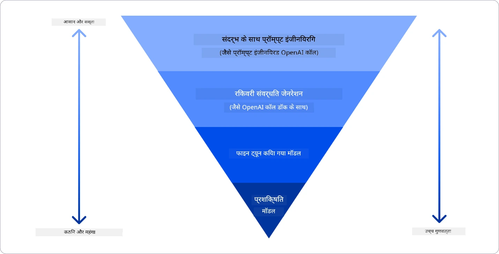

छवि स्रोत: [Four Ways that Enterprises Deploy LLMs | Fiddler AI Blog](https://www.fiddler.ai/blog/four-ways-that-enterprises-deploy-llms?WT.mc_id=academic-105485-koreyst)

### संदर्भ के साथ प्रॉम्प्ट इंजीनियरिंग

पूर्व-प्रशिक्षित LLMs सामान्यकृत प्राकृतिक भाषा कार्यों में बहुत अच्छी तरह से काम करते हैं, यहां तक कि उन्हें एक छोटे प्रॉम्प्ट के साथ बुलाने पर भी, जैसे पूर्ण करने के लिए एक वाक्य या प्रश्न – जिसे “जीरो-शॉट” सीखना कहा जाता है।

हालांकि, जब उपयोगकर्ता अपनी क्वेरी को विस्तार से अनुरोध और उदाहरणों के साथ – संदर्भ – ढाल सकता है, तो उत्तर अधिक सटीक और उपयोगकर्ता की अपेक्षाओं के करीब होगा। इस मामले में, यदि प्रॉम्प्ट में केवल एक उदाहरण शामिल है तो इसे “वन-शॉट” लर्निंग कहते हैं और यदि इसमें कई उदाहरण हैं तो इसे “फ्यू शॉट” लर्निंग कहते हैं।
संदर्भ के साथ प्रॉम्प्ट इंजीनियरिंग शुरुआत करने के लिए सबसे लागत-कुशल दृष्टिकोण है।

### Retrieval Augmented Generation (RAG)

LLMs की एक सीमा है कि वे केवल उस डेटा का उपयोग कर सकते हैं जिसका उपयोग उनके प्रशिक्षण के दौरान किया गया है उत्तर बनाने के लिए। इसका मतलब है कि वे अपने प्रशिक्षण प्रक्रिया के बाद हुई घटनाओं के बारे में कुछ भी नहीं जानते, और वे गैर-सार्वजनिक जानकारी (जैसे कंपनी डेटा) तक पहुंच नहीं सकते।
इसे RAG के माध्यम से पार किया जा सकता है, एक तकनीक जो दस्तावेजों के टुकड़ों के रूप में बाहरी डेटा के साथ प्रॉम्प्ट को बढ़ाती है, प्रॉम्प्ट की लंबाई सीमा को ध्यान में रखते हुए। यह वेक्टर डेटाबेस उपकरणों (जैसे [Azure Vector Search](https://learn.microsoft.com/azure/search/vector-search-overview?WT.mc_id=academic-105485-koreyst)) द्वारा समर्थित है जो विभिन्न पूर्व-परिभाषित डेटा स्रोतों से उपयोगी टुकड़े पुनः प्राप्त करते हैं और उन्हें प्रॉम्प्ट संदर्भ में जोड़ते हैं।

यह तकनीक तब बहुत सहायक होती है जब किसी व्यवसाय के पास पर्याप्त डेटा, पर्याप्त समय, या संसाधन नहीं होते हैं LLM को फाइन-ट्यून करने के लिए, लेकिन फिर भी विशिष्ट कार्यभार पर प्रदर्शन सुधारना चाहते हैं और कल्पित, अप्रचलित, या असमर्थित उत्तरों के जोखिम को कम करना चाहते हैं।

### फाइन-ट्यून किया गया मॉडल

फाइन-ट्यूनिंग एक प्रक्रिया है जो ट्रांसफर लर्निंग का उपयोग करके मॉडल को डाउनस्ट्रीम कार्य के लिए 'अनुकूलित' करने या किसी विशेष समस्या को हल करने के लिए करती है। कुछ-शॉट लर्निंग और RAG से अलग, यह एक नया मॉडल उत्पन्न करता है, जिसमें अपडेटेड वेट्स और बायस होते हैं। इसके लिए प्रशिक्षण उदाहरणों का एक सेट चाहिए, जिसमें एकल इनपुट (प्रॉम्प्ट) और उसका संबंधित आउटपुट (पूरक) शामिल होता है।
यह दृष्टिकोण प्राथमिक होगा यदि:

- **छोटे कार्य-विशिष्ट मॉडलों का उपयोग करना**। कोई व्यवसाय बार-बार बड़े अग्रणी मॉडल को प्रॉम्प्ट करने के बजाय एक संकुचित कार्य के लिए छोटे मॉडल का फाइन-ट्यून करना पसंद करेगा, जिससे अधिक लागत-कुशल और तेज़ समाधान मिलेगा।

- **प्रतीक्षा समय को ध्यान में रखना**। किसी विशिष्ट उपयोग-मामले के लिए प्रतीक्षा समय महत्वपूर्ण है, इसलिए बहुत लंबे प्रॉम्प्ट का उपयोग संभव नहीं है या मॉडल को जिन उदाहरणों से सीखना चाहिए उनकी संख्या प्रॉम्प्ट की लंबाई सीमा से मेल नहीं खाती।

- **स्थिर व्यवहार को अनुकूलित करना**। किसी व्यवसाय के पास कई उच्च-गुणवत्ता वाले उदाहरण हैं और वे चाहते हैं कि मॉडल निरंतर एक कार्य पैटर्न, आउटपुट प्रारूप, स्वर, या क्षेत्र-विशिष्ट शैली का पालन करे। यदि मुख्य समस्या ताजा तथ्य या निजी ज्ञान है जो अक्सर बदलता रहता है, तो केवल फाइन-ट्यूनिंग पर भरोसा करने के बजाय RAG का उपयोग करें।

### प्रशिक्षित मॉडल

एक LLM को शुरू से प्रशिक्षित करना निस्संदेह सबसे कठिन और सबसे जटिल दृष्टिकोण है, जिसके लिए भारी मात्रा में डेटा, कुशल संसाधन और उपयुक्त कंप्यूटेशनल शक्ति की आवश्यकता होती है। यह विकल्प केवल उस स्थिति में विचार किया जाना चाहिए जब किसी व्यवसाय के पास डोमेन-विशिष्ट उपयोग मामला हो और बड़ी मात्रा में डोमेन-केंद्रित डेटा उपलब्ध हो।

## ज्ञान जांच

LLM पूर्णता परिणामों में सुधार के लिए एक अच्छा दृष्टिकोण क्या हो सकता है?

1. संदर्भ के साथ प्रॉम्प्ट इंजीनियरिंग
1. RAG
1. फाइन-ट्यून किया गया मॉडल

उत्तर: तीनों मदद कर सकते हैं। त्वरित सुधारों के लिए संदर्भ और प्रॉम्प्ट इंजीनियरिंग से शुरू करें, और जब मॉडल को वर्तमान तथ्य या निजी व्यावसायिक डेटा की आवश्यकता हो तब RAG का उपयोग करें। जब आपके पास पर्याप्त उच्च-गुणवत्ता वाले उदाहरण हों और मॉडल को निरंतर एक कार्य, प्रारूप, स्वर, या डोमेन पैटर्न का पालन करना हो तो फाइन-ट्यूनिंग चुनें।

## 🚀 चुनौती

पढ़ें कि आप अपने व्यवसाय के लिए [RAG का उपयोग कैसे कर सकते हैं](https://learn.microsoft.com/azure/search/retrieval-augmented-generation-overview?WT.mc_id=academic-105485-koreyst)।

## शानदार काम, अपनी सीख जारी रखें

इस पाठ को पूरा करने के बाद, हमारे [Generative AI Learning संग्रह](https://aka.ms/genai-collection?WT.mc_id=academic-105485-koreyst) को देखें ताकि आप अपनी जनरेटिव AI ज्ञान को aur बढ़ा सकें!

पाठ 3 पर जाएं जहाँ हम देखेंगे कि [जनरेटिव AI के साथ जिम्मेदारी से कैसे निर्माण करें](../03-using-generative-ai-responsibly/README.md?WT.mc_id=academic-105485-koreyst)!

---

<!-- CO-OP TRANSLATOR DISCLAIMER START -->
**अस्वीकरण**:
इस दस्तावेज़ का अनुवाद AI अनुवाद सेवा [Co-op Translator](https://github.com/Azure/co-op-translator) का उपयोग करके किया गया है। जबकि हम सटीकता के लिए प्रयास करते हैं, कृपया ध्यान दें कि स्वचालित अनुवादों में त्रुटियाँ या अशुद्धियाँ हो सकती हैं। मूल दस्तावेज़ अपनी मूल भाषा में ही प्रामाणिक स्रोत माना जाना चाहिए। महत्वपूर्ण जानकारी के लिए, पेशेवर मानव अनुवाद की सिफारिश की जाती है। इस अनुवाद के उपयोग से उत्पन्न किसी भी गलतफहमी या गलत व्याख्या के लिए हम उत्तरदायी नहीं हैं।
<!-- CO-OP TRANSLATOR DISCLAIMER END -->