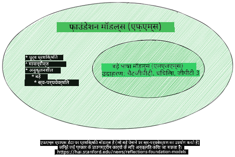
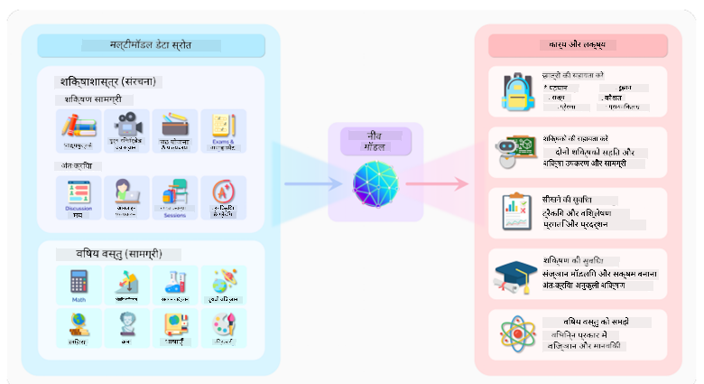
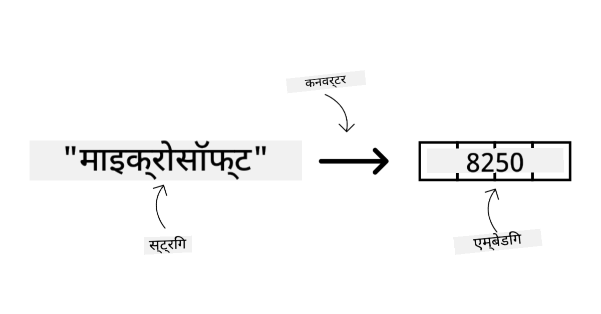
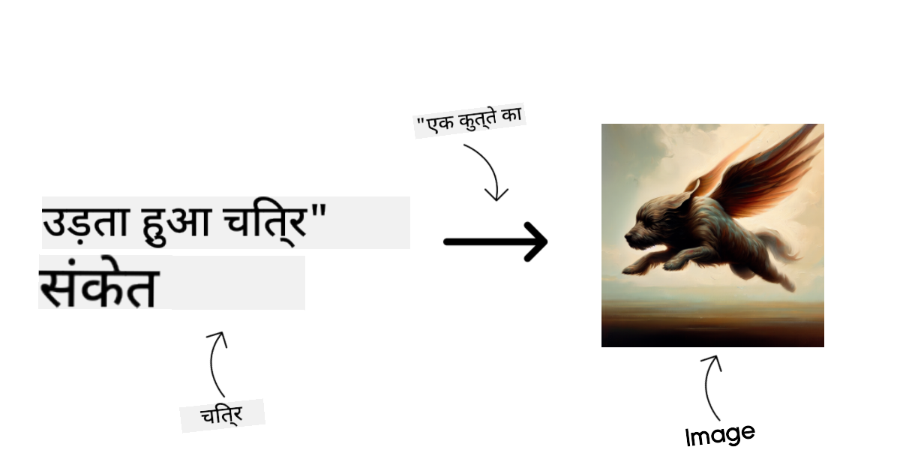
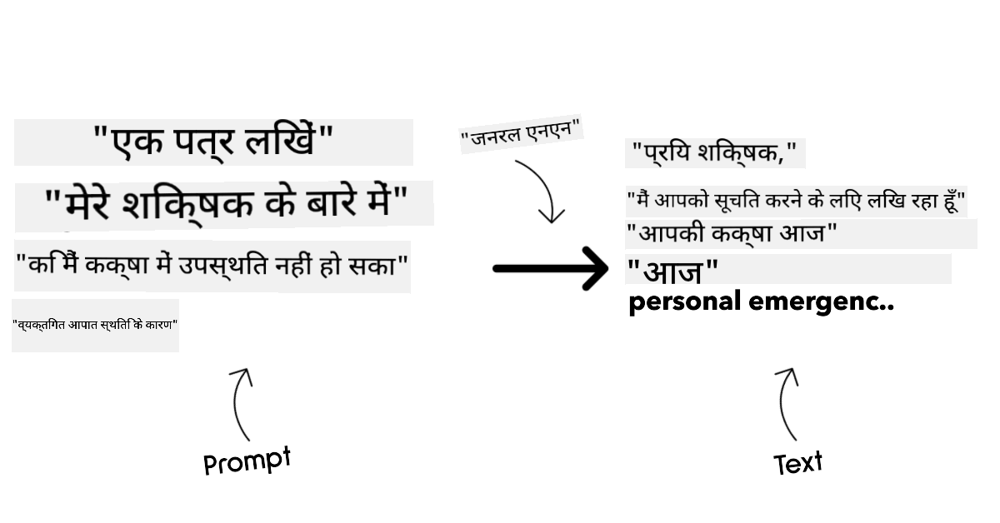
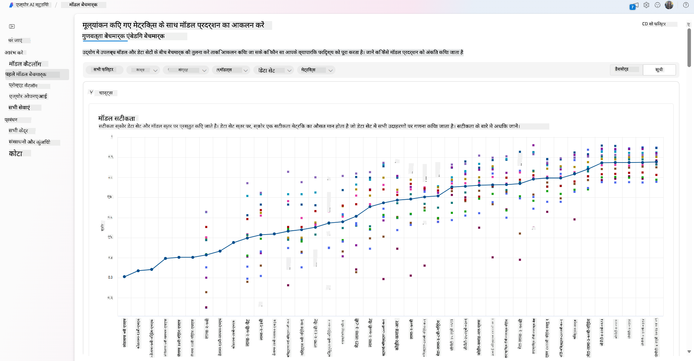
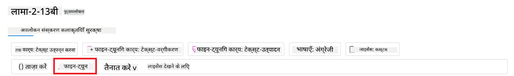
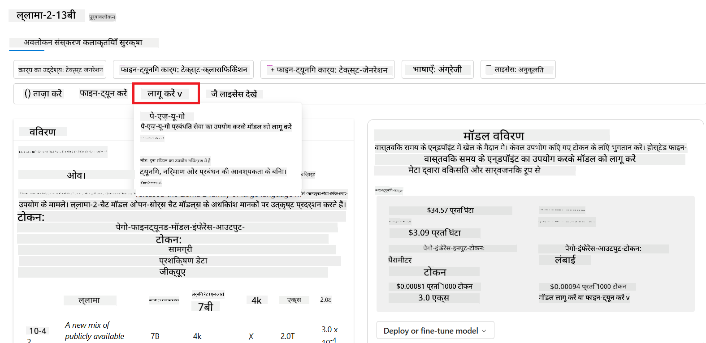
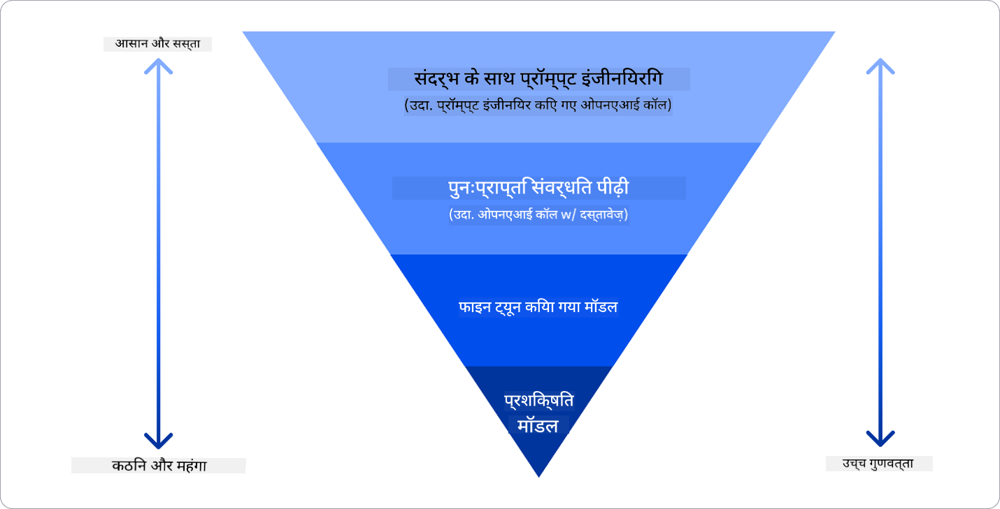

<!--
CO_OP_TRANSLATOR_METADATA:
{
  "original_hash": "e2f686f2eb794941761252ac5e8e090b",
  "translation_date": "2025-06-25T10:25:52+00:00",
  "source_file": "02-exploring-and-comparing-different-llms/README.md",
  "language_code": "hi"
}
-->
# विभिन्न LLMs का अन्वेषण और तुलना

> _इस पाठ के वीडियो को देखने के लिए ऊपर की छवि पर क्लिक करें_

पिछले पाठ के साथ, हमने देखा कि कैसे जनरेटिव एआई तकनीकी परिदृश्य को बदल रहा है, कैसे बड़े भाषा मॉडल (LLMs) काम करते हैं और कैसे एक व्यवसाय - जैसे हमारा स्टार्टअप - उन्हें अपने उपयोग मामलों में लागू कर सकता है और विकास कर सकता है! इस अध्याय में, हम विभिन्न प्रकार के बड़े भाषा मॉडलों (LLMs) की तुलना और विरोध करने की कोशिश कर रहे हैं ताकि उनके फायदे और नुकसान समझ सकें।

हमारे स्टार्टअप की यात्रा का अगला कदम LLMs के वर्तमान परिदृश्य का अन्वेषण करना और यह समझना है कि कौन से हमारे उपयोग के मामले के लिए उपयुक्त हैं।

## परिचय

यह पाठ शामिल करेगा:

- वर्तमान परिदृश्य में विभिन्न प्रकार के LLMs।
- Azure में आपके उपयोग के मामले के लिए विभिन्न मॉडलों का परीक्षण, पुनरावृत्ति, और तुलना।
- एक LLM को कैसे तैनात करें।

## सीखने के लक्ष्य

इस पाठ को पूरा करने के बाद, आप सक्षम होंगे:

- अपने उपयोग के मामले के लिए सही मॉडल का चयन करना।
- यह समझना कि अपने मॉडल का परीक्षण, पुनरावृत्ति, और प्रदर्शन कैसे सुधारें।
- जानें कि व्यवसाय मॉडल कैसे तैनात करते हैं।

## विभिन्न प्रकार के LLMs को समझें

LLMs को उनकी आर्किटेक्चर, प्रशिक्षण डेटा, और उपयोग के मामले के आधार पर विभिन्न श्रेणियों में विभाजित किया जा सकता है। इन अंतरों को समझने से हमारे स्टार्टअप को सही मॉडल चुनने में मदद मिलेगी, और यह समझने में मदद मिलेगी कि परीक्षण, पुनरावृत्ति, और प्रदर्शन कैसे सुधारें।

कई विभिन्न प्रकार के LLM मॉडल हैं, आपके मॉडल का चयन इस पर निर्भर करता है कि आप उन्हें किस उद्देश्य के लिए उपयोग करना चाहते हैं, आपका डेटा, आप कितना भुगतान करने के लिए तैयार हैं और भी बहुत कुछ।

यदि आप मॉडल का उपयोग टेक्स्ट, ऑडियो, वीडियो, इमेज जनरेशन आदि के लिए करना चाहते हैं, तो आप एक अलग प्रकार के मॉडल का चयन कर सकते हैं।

- **ऑडियो और स्पीच मान्यता**। इस उद्देश्य के लिए, Whisper-प्रकार के मॉडल एक बढ़िया विकल्प हैं क्योंकि वे सामान्य-उद्देश्यीय हैं और स्पीच मान्यता पर लक्षित हैं। यह विविध ऑडियो पर प्रशिक्षित है और बहुभाषी स्पीच मान्यता कर सकता है। [Whisper प्रकार के मॉडल के बारे में और जानें](https://platform.openai.com/docs/models/whisper?WT.mc_id=academic-105485-koreyst)।

- **छवि जनरेशन**। छवि जनरेशन के लिए, DALL-E और Midjourney दो बहुत ही प्रसिद्ध विकल्प हैं। DALL-E Azure OpenAI द्वारा प्रदान किया जाता है। [DALL-E के बारे में और पढ़ें](https://platform.openai.com/docs/models/dall-e?WT.mc_id=academic-105485-koreyst) और इस पाठ्यक्रम के अध्याय 9 में भी।

- **टेक्स्ट जनरेशन**। अधिकांश मॉडल टेक्स्ट जनरेशन पर प्रशिक्षित होते हैं और आपके पास GPT-3.5 से GPT-4 तक के कई विकल्प होते हैं। वे विभिन्न लागतों पर आते हैं, GPT-4 सबसे महंगा है। [Azure OpenAI प्लेग्राउंड](https://oai.azure.com/portal/playground?WT.mc_id=academic-105485-koreyst) में यह मूल्यांकन करना सार्थक है कि कौन से मॉडल आपके जरूरतों के लिए क्षमता और लागत के मामले में सबसे उपयुक्त हैं।

- **मल्टी-मोडैलिटी**। यदि आप इनपुट और आउटपुट में कई प्रकार के डेटा को संभालना चाहते हैं, तो आप [gpt-4 turbo with vision या gpt-4o](https://learn.microsoft.com/azure/ai-services/openai/concepts/models#gpt-4-and-gpt-4-turbo-models?WT.mc_id=academic-105485-koreyst) जैसे मॉडलों को देख सकते हैं - OpenAI मॉडलों की नवीनतम रिलीज़ - जो प्राकृतिक भाषा प्रसंस्करण को दृश्य समझ के साथ संयोजित करने में सक्षम हैं, जिससे मल्टी-मोडल इंटरफेस के माध्यम से इंटरैक्शन संभव होता है।

मॉडल का चयन करने का मतलब है कि आपको कुछ बुनियादी क्षमताएं मिलती हैं, जो हालांकि पर्याप्त नहीं हो सकती हैं। अक्सर आपके पास कंपनी विशेष डेटा होता है जिसके बारे में आपको किसी तरह से LLM को बताना होता है। इसके लिए कुछ विभिन्न विकल्प हैं, जिनके बारे में आगामी अनुभागों में अधिक जानकारी है।

### फाउंडेशन मॉडल बनाम LLMs

फाउंडेशन मॉडल शब्द [स्टैनफोर्ड शोधकर्ताओं द्वारा गढ़ा गया](https://arxiv.org/abs/2108.07258?WT.mc_id=academic-105485-koreyst) गया था और इसे एक AI मॉडल के रूप में परिभाषित किया गया है जो कुछ मानदंडों का पालन करता है, जैसे कि:

- **वे असुपरवाइज्ड लर्निंग या सेल्फ-सुपरवाइज्ड लर्निंग का उपयोग करके प्रशिक्षित होते हैं**, जिसका अर्थ है कि वे लेबल रहित मल्टी-मोडल डेटा पर प्रशिक्षित होते हैं, और उनके प्रशिक्षण प्रक्रिया के लिए मानव एनोटेशन या लेबलिंग की आवश्यकता नहीं होती है।
- **वे बहुत बड़े मॉडल होते हैं**, जो बहुत गहरे न्यूरल नेटवर्क पर आधारित होते हैं और अरबों पैरामीटरों पर प्रशिक्षित होते हैं।
- **वे सामान्यतः अन्य मॉडलों के लिए एक 'फाउंडेशन' के रूप में सेवा करने का इरादा रखते हैं**, जिसका अर्थ है कि उन्हें अन्य मॉडलों के लिए एक प्रारंभिक बिंदु के रूप में उपयोग किया जा सकता है, जो फाइन-ट्यूनिंग द्वारा किया जा सकता है।

छवि स्रोत: [फाउंडेशन मॉडल्स और बड़े भाषा मॉडलों के लिए आवश्यक गाइड | बाबर एम भट्टी द्वारा | मीडियम](https://thebabar.medium.com/essential-guide-to-foundation-models-and-large-language-models-27dab58f7404)

इस भेद को और स्पष्ट करने के लिए, चलिए ChatGPT का एक उदाहरण लेते हैं। ChatGPT का पहला संस्करण बनाने के लिए, एक मॉडल जिसे GPT-3.5 कहा जाता है, फाउंडेशन मॉडल के रूप में कार्य किया। इसका मतलब है कि OpenAI ने कुछ चैट-विशिष्ट डेटा का उपयोग करके GPT-3.5 का एक ट्यून किया गया संस्करण बनाया जो चैटबॉट्स जैसे संवादात्मक परिदृश्यों में अच्छा प्रदर्शन करने में विशेष था।

छवि स्रोत: [2108.07258.pdf (arxiv.org)](https://arxiv.org/pdf/2108.07258.pdf?WT.mc_id=academic-105485-koreyst)

### ओपन सोर्स बनाम प्रोपायटरी मॉडल

एक और तरीका जिससे LLMs को वर्गीकृत किया जा सकता है वह है कि वे ओपन सोर्स हैं या प्रोपायटरी।

ओपन-सोर्स मॉडल वे मॉडल होते हैं जो सार्वजनिक रूप से उपलब्ध कराए जाते हैं और कोई भी उनका उपयोग कर सकता है। इन्हें अक्सर उस कंपनी द्वारा उपलब्ध कराया जाता है जिसने उन्हें बनाया, या शोध समुदाय द्वारा। इन मॉडलों को निरीक्षण, संशोधित, और विभिन्न उपयोग मामलों के लिए अनुकूलित किया जा सकता है। हालांकि, वे हमेशा उत्पादन उपयोग के लिए अनुकूलित नहीं होते हैं, और प्रोपायटरी मॉडलों जितने प्रदर्शनकारी नहीं हो सकते। साथ ही, ओपन-सोर्स मॉडलों के लिए फंडिंग सीमित हो सकती है, और वे लंबे समय तक बनाए नहीं रखे जा सकते हैं या नवीनतम शोध के साथ अपडेट नहीं किए जा सकते हैं। लोकप्रिय ओपन सोर्स मॉडलों के उदाहरणों में [Alpaca](https://crfm.stanford.edu/2023/03/13/alpaca.html?WT.mc_id=academic-105485-koreyst), [Bloom](https://huggingface.co/bigscience/bloom) और [LLaMA](https://llama.meta.com) शामिल हैं।

प्रोपायटरी मॉडल वे मॉडल होते हैं जो किसी कंपनी के स्वामित्व में होते हैं और सार्वजनिक रूप से उपलब्ध नहीं होते हैं। ये मॉडल अक्सर उत्पादन उपयोग के लिए अनुकूलित होते हैं। हालांकि, इन्हें विभिन्न उपयोग मामलों के लिए निरीक्षण, संशोधित, या अनुकूलित करने की अनुमति नहीं होती है। साथ ही, वे हमेशा मुफ्त में उपलब्ध नहीं होते हैं, और उपयोग के लिए सदस्यता या भुगतान की आवश्यकता हो सकती है। साथ ही, उपयोगकर्ताओं के पास उस डेटा पर नियंत्रण नहीं होता है जिसका उपयोग मॉडल को प्रशिक्षित करने के लिए किया जाता है, जिसका अर्थ है कि उन्हें डेटा गोपनीयता और AI के जिम्मेदार उपयोग के प्रति प्रतिबद्धता सुनिश्चित करने के लिए मॉडल के मालिक पर भरोसा करना चाहिए। लोकप्रिय प्रोपायटरी मॉडलों के उदाहरणों में [OpenAI मॉडल](https://platform.openai.com/docs/models/overview?WT.mc_id=academic-105485-koreyst), [Google Bard](https://sapling.ai/llm/bard?WT.mc_id=academic-105485-koreyst) या [Claude 2](https://www.anthropic.com/index/claude-2?WT.mc_id=academic-105485-koreyst) शामिल हैं।

### एंबेडिंग बनाम इमेज जनरेशन बनाम टेक्स्ट और कोड जनरेशन

LLMs को उनके द्वारा उत्पन्न आउटपुट के आधार पर भी वर्गीकृत किया जा सकता है।

एंबेडिंग्स मॉडल का एक सेट होता है जो टेक्स्ट को संख्यात्मक रूप में परिवर्तित कर सकता है, जिसे एंबेडिंग कहा जाता है, जो इनपुट टेक्स्ट का संख्यात्मक प्रतिनिधित्व होता है। एंबेडिंग्स मशीनों के लिए शब्दों या वाक्यों के बीच के संबंधों को समझना आसान बनाते हैं और अन्य मॉडलों द्वारा इनपुट के रूप में उपभोग किए जा सकते हैं, जैसे कि वर्गीकरण मॉडल, या क्लस्टरिंग मॉडल जो संख्यात्मक डेटा पर बेहतर प्रदर्शन करते हैं। एंबेडिंग मॉडल अक्सर ट्रांसफर लर्निंग के लिए उपयोग किए जाते हैं, जहां एक मॉडल एक सरोगेट टास्क के लिए बनाया जाता है जिसके लिए डेटा की प्रचुरता होती है, और फिर मॉडल के वजन (एंबेडिंग्स) अन्य डाउनस्ट्रीम टास्क के लिए पुनः उपयोग किए जाते हैं। इस श्रेणी का एक उदाहरण [OpenAI एंबेडिंग्स](https://platform.openai.com/docs/models/embeddings?WT.mc_id=academic-105485-koreyst) है।

इमेज जनरेशन मॉडल वे मॉडल होते हैं जो छवियों का उत्पादन करते हैं। ये मॉडल अक्सर इमेज एडिटिंग, इमेज सिंथेसिस, और इमेज ट्रांसलेशन के लिए उपयोग किए जाते हैं। इमेज जनरेशन मॉडल अक्सर बड़ी छवियों के डेटासेट पर प्रशिक्षित होते हैं, जैसे कि [LAION-5B](https://laion.ai/blog/laion-5b/?WT.mc_id=academic-105485-koreyst), और नए चित्र उत्पन्न करने या मौजूदा चित्रों को संपादित करने के लिए इनपेंटिंग, सुपर-रिज़ॉल्यूशन, और कलराइजेशन तकनीकों के साथ उपयोग किए जा सकते हैं। उदाहरणों में [DALL-E-3](https://openai.com/dall-e-3?WT.mc_id=academic-105485-koreyst) और [स्टेबल डिफ्यूजन मॉडल](https://github.com/Stability-AI/StableDiffusion?WT.mc_id=academic-105485-koreyst) शामिल हैं।

टेक्स्ट और कोड जनरेशन मॉडल वे मॉडल होते हैं जो टेक्स्ट या कोड का उत्पादन करते हैं। ये मॉडल अक्सर टेक्स्ट संक्षेपण, अनुवाद, और प्रश्न उत्तर के लिए उपयोग किए जाते हैं। टेक्स्ट जनरेशन मॉडल अक्सर बड़े टेक्स्ट डेटासेट पर प्रशिक्षित होते हैं, जैसे कि [BookCorpus](https://www.cv-foundation.org/openaccess/content_iccv_2015/html/Zhu_Aligning_Books_and_ICCV_2015_paper.html?WT.mc_id=academic-105485-koreyst), और नए टेक्स्ट उत्पन्न करने के लिए, या प्रश्नों का उत्तर देने के लिए उपयोग किए जा सकते हैं। कोड जनरेशन मॉडल, जैसे [CodeParrot](https://huggingface.co/codeparrot?WT.mc_id=academic-105485-koreyst), अक्सर बड़े कोड डेटासेट पर प्रशिक्षित होते हैं, जैसे कि GitHub, और नए कोड उत्पन्न करने के लिए, या मौजूदा कोड में बग्स को ठीक करने के लिए उपयोग किए जा सकते हैं।

### एन्कोडर-डिकोडर बनाम डिकोडर-केवल

LLMs की विभिन्न प्रकार की आर्किटेक्चर के बारे में बात करने के लिए, चलिए एक उपमा का उपयोग करते हैं।

कल्पना करें कि आपके प्रबंधक ने आपको छात्रों के लिए एक क्विज लिखने का कार्य दिया है। आपके पास दो सहयोगी हैं; एक सामग्री बनाने की देखरेख करता है और दूसरा उनकी समीक्षा करता है।

सामग्री निर्माता एक डिकोडर-केवल मॉडल की तरह है, वे विषय को देख सकते हैं और जो आपने पहले से लिखा है उसे देख सकते हैं और फिर वह एक कोर्स लिख सकते हैं। वे आकर्षक और सूचनात्मक सामग्री लिखने में बहुत अच्छे होते हैं, लेकिन वे विषय और सीखने के उद्देश्यों को समझने में बहुत अच्छे नहीं होते हैं। डिकोडर मॉडल के कुछ उदाहरण GPT परिवार के मॉडल हैं, जैसे GPT-3।

समीक्षक एक एन्कोडर-केवल मॉडल की तरह है, वे लिखित कोर्स और उत्तरों को देखते हैं, उनके बीच संबंध को नोटिस करते हैं और संदर्भ को समझते हैं, लेकिन वे सामग्री उत्पन्न करने में अच्छे नहीं होते हैं। एन्कोडर-केवल मॉडल का एक उदाहरण BERT होगा।

कल्पना करें कि हमारे पास कोई ऐसा व्यक्ति भी हो सकता है जो क्विज को बना और समीक्षा कर सके, यह एक एन्कोडर-डिकोडर मॉडल है। कुछ उदाहरण BART और T5 होंगे।

### सेवा बनाम मॉडल

अब, चलिए सेवा और मॉडल के बीच के अंतर के बारे में बात करते हैं। एक सेवा एक उत्पाद है जो एक क्लाउड सेवा प्रदाता द्वारा पेश की जाती है, और अक्सर मॉडलों, डेटा, और अन्य घटकों का संयोजन होती है। एक मॉडल सेवा का मुख्य घटक होता है, और अक्सर एक फाउंडेशन मॉडल होता है, जैसे कि एक LLM।

सेवाएं अक्सर उत्पादन उपयोग के लिए अनुकूलित होती हैं और अक्सर मॉडलों की तुलना में उपयोग में आसान होती हैं, एक ग्राफिकल यूजर इंटरफेस के माध्यम से। हालांकि, सेवाएं हमेशा मुफ्त में उपलब्ध नहीं होती हैं, और उपयोग के लिए सदस्यता या भुगतान की आवश्यकता हो सकती है, सेवा मालिक के उपकरण और संसाधनों का लाभ उठाने के बदले में, खर्चों को अनुकूलित करने और आसानी से स्केलिंग करने के लिए। एक सेवा का उदाहरण [Azure OpenAI सेवा](https://learn.microsoft.com/azure/ai-services/openai/overview?WT.mc_id=academic-105485-koreyst) है, जो एक पे-एज़-यू-गो दर योजना पेश करती है, जिसका मतलब है कि उपयोगकर्ताओं से सेवा का कितना उपयोग करते हैं उसके अनुसार चार्ज किया जाता है। साथ ही, Azure OpenAI सेवा एंटरप्राइज़-ग्रेड सुरक्षा और मॉडलों की क्षमताओं के ऊपर एक जिम्मेदार AI फ्रेमवर्क प्रदान करती है।

मॉडल सिर्फ न्यूरल नेटवर्क होते हैं, जिनमें पैरामीटर, वेट्स, और अन्य होते हैं। कंपनियों को स्थानीय रूप से चलाने की अनुमति देते हुए, हालांकि, उन्हें उपकरण खरीदने, स्केल करने के लिए एक संरचना बनाने और एक लाइसेंस खरीदने या एक ओपन-सोर्स मॉडल का उपयोग करने की आवश्यकता होगी। एक मॉडल जैसे LLaMA का उपयोग किया जा सकता है, जिसमें मॉडल को चलाने के लिए कम्प्यूटेशनल पावर की आवश्यकता होती है।

## Azure पर प्रदर्शन को समझने के लिए विभिन्न मॉडलों के साथ परीक्षण और पुनरावृत्ति कैसे करें

एक बार जब हमारी टीम ने वर्तमान LLMs परिदृश्य का अन्वेषण किया और उनके परिदृश्यों के लिए कुछ अच्छे उम्मीदवारों की पहचान की, तो अगला कदम उनके डेटा और उनके वर्कलोड पर उनका परीक्षण करना है। यह एक पुनरावृत्त प्रक्रिया है, जो प्रयोगों और उपायों द्वारा की जाती है।
ज्यादातर मॉडल जो हमने पिछले अनुच्छेदों में उल्लेख किए (OpenAI मॉडल, ओपन सोर्स मॉडल जैसे Llama2, और Hugging Face ट्रांसफॉर्मर्स) [Azure AI स्टूडियो](https://ai.azure.com/?WT.mc_id=academic-105485-koreyst) के [मॉडल कैटलॉग](https://learn.microsoft.com/azure/ai-studio/how-to/model-catalog-overview?WT.mc_id=academic-105485-koreyst) में उपलब्ध हैं।

[Azure AI स्टूडियो](https://learn.microsoft.com/azure/ai-studio/what-is-ai-studio?WT.mc_id=academic-105485-koreyst) एक क्लाउड प्लेटफॉर्म है जिसे डेवलपर्स के लिए जनरेटिव AI एप्लिकेशन बनाने और संपूर्ण विकास जीवनचक्र का प्रबंधन करने के लिए डिज़ाइन किया गया है - प्रयोग से मूल्यांकन तक - सभी Azure AI सेवाओं को एक ही हब में एक सुविधाजनक GUI के साथ संयोजित करके। Azure AI स्टूडियो में मॉडल कैटलॉग उपयोगकर्ता को सक्षम करता है:

- कैटलॉग में रुचि का फाउंडेशन मॉडल ढूंढें - चाहे वह प्रोपायटरी हो या ओपन सोर्स, कार्य, लाइसेंस, या नाम द्वारा फ़िल्टर करके। खोज को बेहतर बनाने के लिए, मॉडल संग्रहों में संगठित होते हैं, जैसे Azure OpenAI संग्रह, Hugging Face संग्रह, और
- उद्योग में उपलब्ध मॉडलों और डाटासेट्स के बीच बेंचमार्क की तुलना करें ताकि यह आकलन किया जा सके कि कौन सा व्यावसायिक परिदृश्य को पूरा करता है, [मॉडल बेंचमार्क्स](https://learn.microsoft.com/azure/ai-studio/how-to/model-benchmarks?WT.mc_id=academic-105485-koreyst) पैन के माध्यम से।

- किसी विशिष्ट कार्यभार में मॉडल के प्रदर्शन को सुधारने के लिए कस्टम प्रशिक्षण डेटा पर मॉडल को फाइन-ट्यून करें, Azure AI स्टूडियो की प्रयोग और ट्रैकिंग क्षमताओं का लाभ उठाते हुए।

- मूल प्री-ट्रेंड मॉडल या फाइन-ट्यून संस्करण को रिमोट रियल टाइम इन्फरेंस - प्रबंधित कंप्यूट - या सर्वरलेस एपीआई एंडपॉइंट - [पे-एज़-यू-गो](https://learn.microsoft.com/azure/ai-studio/how-to/model-catalog-overview#model-deployment-managed-compute-and-serverless-api-pay-as-you-go?WT.mc_id=academic-105485-koreyst) - पर तैनात करें ताकि अनुप्रयोग इसे उपभोग कर सकें।

> [!NOTE]
> कैटलॉग में सभी मॉडल वर्तमान में फाइन-ट्यूनिंग और/या पे-एज़-यू-गो डिप्लॉयमेंट के लिए उपलब्ध नहीं हैं। मॉडल की क्षमताओं और सीमाओं के विवरण के लिए मॉडल कार्ड की जाँच करें।

## LLM परिणामों में सुधार

हमने अपनी स्टार्टअप टीम के साथ विभिन्न प्रकार के LLMs और एक क्लाउड प्लेटफ़ॉर्म (Azure Machine Learning) का अन्वेषण किया है, जो हमें विभिन्न मॉडलों की तुलना करने, उन्हें परीक्षण डेटा पर मूल्यांकन करने, प्रदर्शन सुधारने और उन्हें इन्फरेंस एंडपॉइंट्स पर तैनात करने में सक्षम बनाता है।

लेकिन वे कब एक मॉडल को फाइन-ट्यून करने पर विचार करेंगे बजाय एक प्री-ट्रेंड मॉडल का उपयोग करने के? क्या विशेष कार्यभार पर मॉडल के प्रदर्शन में सुधार करने के अन्य दृष्टिकोण हैं?

किसी व्यवसाय को LLM से आवश्यक परिणाम प्राप्त करने के लिए कई दृष्टिकोण हो सकते हैं। आप उत्पादन में LLM तैनात करते समय विभिन्न प्रकार के मॉडलों का चयन कर सकते हैं, जिनमें प्रशिक्षण की विभिन्न डिग्री होती हैं, जटिलता, लागत और गुणवत्ता के विभिन्न स्तर होते हैं। यहाँ कुछ विभिन्न दृष्टिकोण दिए गए हैं:

- **संदर्भ के साथ प्रॉम्प्ट इंजीनियरिंग**। विचार यह है कि जब आप प्रॉम्प्ट करें तो पर्याप्त संदर्भ प्रदान करें ताकि आप वह प्रतिक्रिया प्राप्त कर सकें जो आपको चाहिए।

- **रिट्रीवल ऑगमेंटेड जनरेशन, RAG**। आपका डेटा उदाहरण के लिए एक डेटाबेस या वेब एंडपॉइंट में मौजूद हो सकता है, यह सुनिश्चित करने के लिए कि यह डेटा, या इसका एक उपसमूह, प्रॉम्प्टिंग के समय शामिल है, आप प्रासंगिक डेटा को प्राप्त कर सकते हैं और उसे उपयोगकर्ता के प्रॉम्प्ट का हिस्सा बना सकते हैं।

- **फाइन-ट्यून मॉडल**। यहाँ, आपने अपने स्वयं के डेटा पर मॉडल को और अधिक प्रशिक्षित किया जिससे मॉडल आपकी आवश्यकताओं के लिए अधिक सटीक और उत्तरदायी हो गया, लेकिन यह महंगा हो सकता है।

छवि स्रोत: [फोर वेज़ दैट एंटरप्राइजेज डिप्लॉय LLMs | Fiddler AI ब्लॉग](https://www.fiddler.ai/blog/four-ways-that-enterprises-deploy-llms?WT.mc_id=academic-105485-koreyst)

### संदर्भ के साथ प्रॉम्प्ट इंजीनियरिंग

प्री-ट्रेंड LLMs सामान्यीकृत प्राकृतिक भाषा कार्यों पर बहुत अच्छी तरह से काम करते हैं, भले ही उन्हें एक छोटे प्रॉम्प्ट के साथ बुलाया जाए, जैसे कि पूरा करने के लिए एक वाक्य या एक प्रश्न - जिसे "जीरो-शॉट" लर्निंग कहा जाता है।

हालांकि, जितना अधिक उपयोगकर्ता अपनी क्वेरी को फ्रेम कर सकते हैं, एक विस्तृत अनुरोध और उदाहरणों के साथ - संदर्भ - उतना ही अधिक सटीक और उपयोगकर्ता की अपेक्षाओं के निकट उत्तर होगा। इस मामले में, हम "वन-शॉट" लर्निंग के बारे में बात करते हैं यदि प्रॉम्प्ट में केवल एक उदाहरण शामिल है और "फ्यू शॉट लर्निंग" यदि इसमें कई उदाहरण शामिल हैं।
संदर्भ के साथ प्रॉम्प्ट इंजीनियरिंग शुरू करने के लिए सबसे किफायती दृष्टिकोण है।

### रिट्रीवल ऑगमेंटेड जनरेशन (RAG)

LLMs की सीमा है कि वे केवल उस डेटा का उपयोग कर सकते हैं जिसका उपयोग उनके प्रशिक्षण के दौरान किया गया है, एक उत्तर उत्पन्न करने के लिए। इसका मतलब है कि वे अपने प्रशिक्षण प्रक्रिया के बाद हुई तथ्यों के बारे में कुछ नहीं जानते हैं, और वे गैर-सार्वजनिक जानकारी (जैसे कंपनी डेटा) तक पहुंच नहीं सकते हैं।
इसे RAG के माध्यम से पार किया जा सकता है, एक तकनीक जो प्रॉम्प्ट को बाहरी डेटा के साथ दस्तावेजों के टुकड़ों के रूप में बढ़ाती है, प्रॉम्प्ट लंबाई की सीमाओं को ध्यान में रखते हुए। यह वेक्टर डेटाबेस टूल्स (जैसे [Azure वेक्टर सर्च](https://learn.microsoft.com/azure/search/vector-search-overview?WT.mc_id=academic-105485-koreyst)) द्वारा समर्थित है जो विभिन्न पूर्व-परिभाषित डेटा स्रोतों से उपयोगी टुकड़ों को पुनः प्राप्त करते हैं और उन्हें प्रॉम्प्ट संदर्भ में जोड़ते हैं।

यह तकनीक तब बहुत सहायक होती है जब किसी व्यवसाय के पास पर्याप्त डेटा, पर्याप्त समय, या LLM को फाइन-ट्यून करने के लिए संसाधन नहीं होते हैं, लेकिन फिर भी एक विशेष कार्यभार पर प्रदर्शन में सुधार करना चाहते हैं और मिथ्याकरण के जोखिम को कम करना चाहते हैं, यानी वास्तविकता की मिथ्या या हानिकारक सामग्री।

### फाइन-ट्यून मॉडल

फाइन-ट्यूनिंग एक प्रक्रिया है जो स्थानांतरण लर्निंग का लाभ उठाती है ताकि मॉडल को डाउनस्ट्रीम कार्य के लिए 'अनुकूलित' किया जा सके या एक विशिष्ट समस्या को हल किया जा सके। फ्यू शॉट लर्निंग और RAG से अलग, यह एक नए मॉडल के उत्पन्न होने के परिणामस्वरूप होता है, अद्यतन वज़न और पूर्वाग्रहों के साथ। इसके लिए प्रशिक्षण उदाहरणों के एक सेट की आवश्यकता होती है जिसमें एकल इनपुट (प्रॉम्प्ट) और इसका संबंधित आउटपुट (पूर्णता) शामिल होता है।
यह पसंदीदा दृष्टिकोण होगा यदि:

- **फाइन-ट्यून मॉडल का उपयोग करना**। एक व्यवसाय कम सक्षम मॉडलों (जैसे एम्बेडिंग मॉडल) का उपयोग करना चाहता है बजाय उच्च प्रदर्शन वाले मॉडलों के, जिसके परिणामस्वरूप एक अधिक लागत प्रभावी और तेज़ समाधान होता है।

- **विलंबता पर विचार करना**। विलंबता एक विशिष्ट उपयोग-मामले के लिए महत्वपूर्ण है, इसलिए बहुत लंबे प्रॉम्प्ट्स का उपयोग करना संभव नहीं है या उदाहरणों की संख्या जो मॉडल से सीखी जानी चाहिए वह प्रॉम्प्ट लंबाई सीमा के साथ फिट नहीं होती है।

- **अप-टू-डेट रहना**। एक व्यवसाय के पास उच्च गुणवत्ता वाले डेटा और ग्राउंड ट्रुथ लेबल्स की बहुतायत होती है और समय के साथ इस डेटा को अद्यतन रखने के लिए आवश्यक संसाधन होते हैं।

### प्रशिक्षित मॉडल

शुरुआत से एक LLM को प्रशिक्षित करना निस्संदेह सबसे कठिन और सबसे जटिल दृष्टिकोण है जिसे अपनाना है, इसके लिए विशाल मात्रा में डेटा, कुशल संसाधन और उपयुक्त कंप्यूटेशनल शक्ति की आवश्यकता होती है। इस विकल्प पर केवल एक परिदृश्य में विचार किया जाना चाहिए जहां एक व्यवसाय के पास एक डोमेन-विशिष्ट उपयोग मामला और डोमेन-केंद्रित डेटा की एक बड़ी मात्रा हो।

## ज्ञान जांच

LLM पूर्णता परिणामों में सुधार करने के लिए एक अच्छा दृष्टिकोण क्या हो सकता है?

1. संदर्भ के साथ प्रॉम्प्ट इंजीनियरिंग
1. RAG
1. फाइन-ट्यून मॉडल

A:3, यदि आपके पास समय और संसाधन हैं और उच्च गुणवत्ता वाला डेटा है, तो फाइन-ट्यूनिंग अप-टू-डेट रहने के लिए बेहतर विकल्प है। हालांकि, यदि आप सुधार की तलाश में हैं और आपके पास समय की कमी है, तो पहले RAG पर विचार करना उचित है।

## 🚀 चुनौती

पढ़ें कि आप अपने व्यवसाय के लिए [RAG का उपयोग](https://learn.microsoft.com/azure/search/retrieval-augmented-generation-overview?WT.mc_id=academic-105485-koreyst) कैसे कर सकते हैं।

## शानदार काम, अपनी सीख जारी रखें

इस पाठ को पूरा करने के बाद, हमारे [जनरेटिव AI लर्निंग संग्रह](https://aka.ms/genai-collection?WT.mc_id=academic-105485-koreyst) को देखें ताकि आप अपनी जनरेटिव AI की जानकारी को बढ़ा सकें!

पाठ 3 पर जाएं जहां हम देखेंगे कि कैसे [जनरेटिव AI के साथ जिम्मेदारी से निर्माण करें](../03-using-generative-ai-responsibly/README.md?WT.mc_id=academic-105485-koreyst)!

**अस्वीकरण**:  
यह दस्तावेज़ AI अनुवाद सेवा [Co-op Translator](https://github.com/Azure/co-op-translator) का उपयोग करके अनुवादित किया गया है। जबकि हम सटीकता के लिए प्रयासरत हैं, कृपया ध्यान दें कि स्वचालित अनुवादों में त्रुटियाँ या अशुद्धियाँ हो सकती हैं। अपनी मूल भाषा में मूल दस्तावेज़ को आधिकारिक स्रोत माना जाना चाहिए। महत्वपूर्ण जानकारी के लिए, पेशेवर मानव अनुवाद की सिफारिश की जाती है। इस अनुवाद के उपयोग से उत्पन्न किसी भी गलतफहमी या गलत व्याख्या के लिए हम उत्तरदायी नहीं हैं।