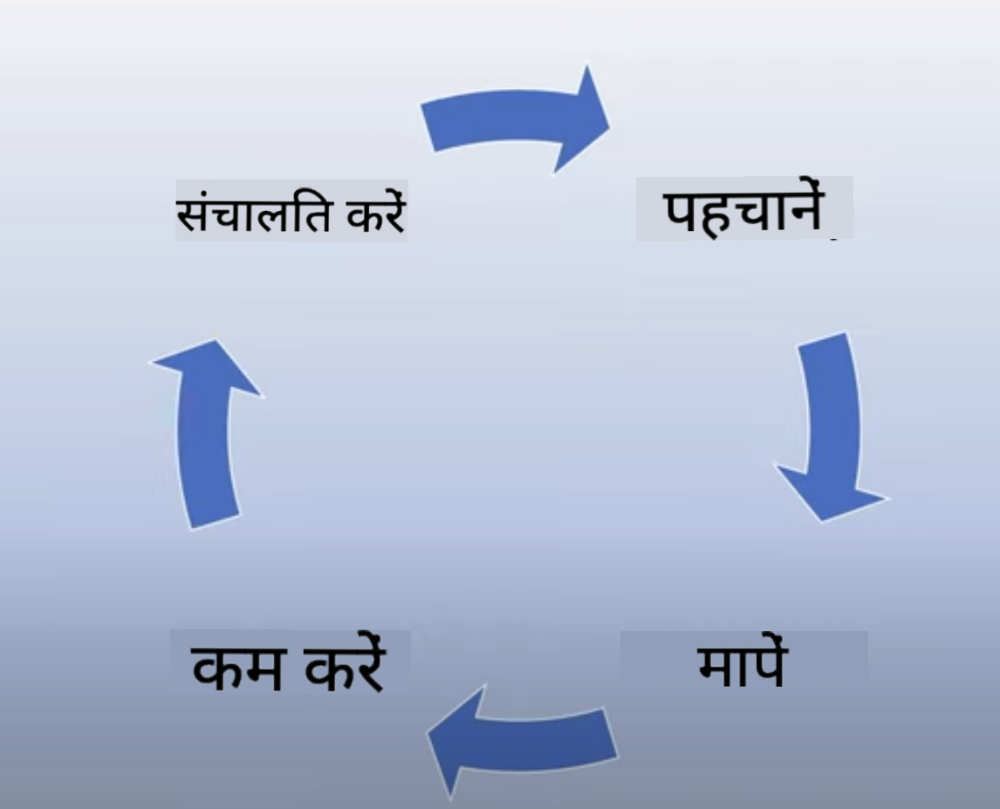
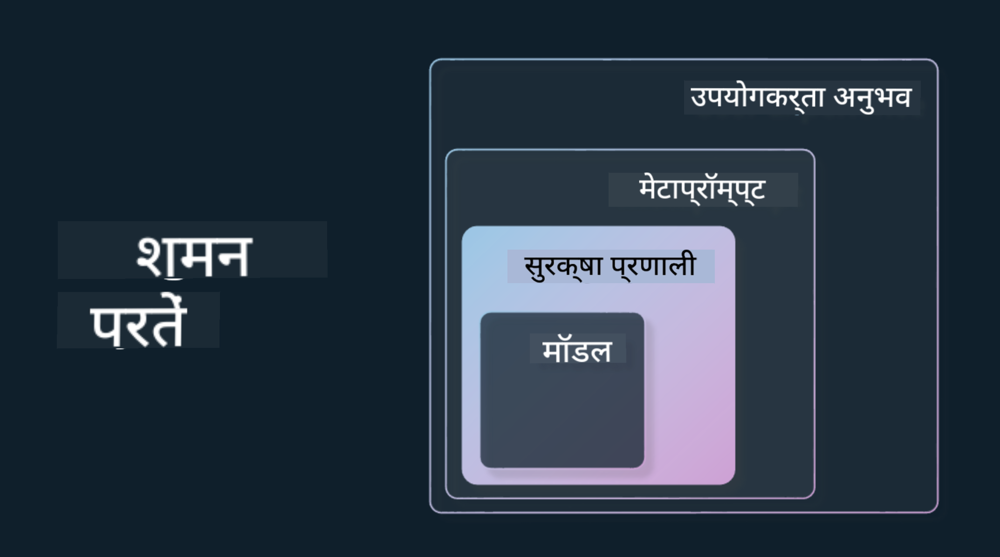

<!--
CO_OP_TRANSLATOR_METADATA:
{
  "original_hash": "7f8f4c11f8c1cb6e1794442dead414ea",
  "translation_date": "2025-07-09T08:51:42+00:00",
  "source_file": "03-using-generative-ai-responsibly/README.md",
  "language_code": "hi"
}
-->
# जिम्मेदारी से Generative AI का उपयोग करना

> _इस पाठ का वीडियो देखने के लिए ऊपर की छवि पर क्लिक करें_

AI और विशेष रूप से Generative AI से आकर्षित होना आसान है, लेकिन आपको यह सोचने की जरूरत है कि आप इसे जिम्मेदारी से कैसे उपयोग करेंगे। आपको यह ध्यान में रखना होगा कि आउटपुट निष्पक्ष, हानिरहित और अन्य पहलुओं में कैसे सुनिश्चित किया जाए। यह अध्याय आपको इस संदर्भ, विचार करने योग्य बातों, और AI के उपयोग को बेहतर बनाने के लिए सक्रिय कदम उठाने के तरीकों से परिचित कराएगा।

## परिचय

यह पाठ निम्नलिखित विषयों को कवर करेगा:

- Generative AI एप्लिकेशन बनाते समय Responsible AI को प्राथमिकता क्यों देनी चाहिए।
- Responsible AI के मूल सिद्धांत और वे Generative AI से कैसे संबंधित हैं।
- रणनीति और टूलिंग के माध्यम से इन Responsible AI सिद्धांतों को व्यवहार में कैसे लाया जाए।

## सीखने के लक्ष्य

इस पाठ को पूरा करने के बाद आप जानेंगे:

- Generative AI एप्लिकेशन बनाते समय Responsible AI का महत्व।
- कब और कैसे Responsible AI के मूल सिद्धांतों को लागू करना चाहिए।
- Responsible AI के सिद्धांतों को व्यवहार में लाने के लिए उपलब्ध टूल और रणनीतियाँ।

## Responsible AI के सिद्धांत

Generative AI का उत्साह कभी इतना अधिक नहीं रहा। इस उत्साह ने इस क्षेत्र में नए डेवलपर्स, ध्यान और फंडिंग को आकर्षित किया है। यह उन सभी के लिए बहुत सकारात्मक है जो Generative AI का उपयोग करके उत्पाद और कंपनियां बनाना चाहते हैं, लेकिन यह भी जरूरी है कि हम जिम्मेदारी से आगे बढ़ें।

इस कोर्स के दौरान, हम अपने स्टार्टअप और AI शिक्षा उत्पाद के निर्माण पर ध्यान केंद्रित कर रहे हैं। हम Responsible AI के सिद्धांतों का उपयोग करेंगे: निष्पक्षता, समावेशन, विश्वसनीयता/सुरक्षा, सुरक्षा और गोपनीयता, पारदर्शिता और जवाबदेही। इन सिद्धांतों के साथ, हम देखेंगे कि ये हमारे उत्पादों में Generative AI के उपयोग से कैसे संबंधित हैं।

## आपको Responsible AI को प्राथमिकता क्यों देनी चाहिए

जब आप कोई उत्पाद बनाते हैं, तो उपयोगकर्ता के सर्वोत्तम हित को ध्यान में रखते हुए मानव-केंद्रित दृष्टिकोण अपनाना सबसे अच्छे परिणाम देता है।

Generative AI की खासियत इसकी क्षमता है कि यह उपयोगकर्ताओं के लिए सहायक उत्तर, जानकारी, मार्गदर्शन और सामग्री बना सकता है। यह कई मैनुअल कदमों के बिना किया जा सकता है, जिससे प्रभावशाली परिणाम मिलते हैं। लेकिन बिना उचित योजना और रणनीतियों के, यह दुर्भाग्यवश आपके उपयोगकर्ताओं, आपके उत्पाद और समाज के लिए हानिकारक परिणाम भी ला सकता है।

आइए कुछ (लेकिन सभी नहीं) संभावित हानिकारक परिणामों पर नजर डालते हैं:

### भ्रम (Hallucinations)

Hallucinations उस स्थिति को कहते हैं जब कोई LLM ऐसा कंटेंट उत्पन्न करता है जो पूरी तरह से बेतुका होता है या जिसे हम अन्य स्रोतों के आधार पर तथ्यात्मक रूप से गलत जानते हैं।

उदाहरण के लिए, मान लीजिए हम अपने स्टार्टअप के लिए एक फीचर बनाते हैं जो छात्रों को ऐतिहासिक प्रश्न पूछने की अनुमति देता है। एक छात्र पूछता है `Who was the sole survivor of Titanic?`

मॉडल नीचे दिए गए उत्तर जैसा जवाब देता है:

> _(स्रोत: [Flying bisons](https://flyingbisons.com?WT.mc_id=academic-105485-koreyst))_

यह एक बहुत आत्मविश्वासी और विस्तृत उत्तर है। दुर्भाग्य से, यह गलत है। थोड़ी सी रिसर्च से पता चलता है कि Titanic हादसे के एक से अधिक जीवित बचे थे। एक छात्र जो इस विषय पर अभी शोध शुरू कर रहा है, इस उत्तर को तथ्य मान सकता है। इसके परिणामस्वरूप AI सिस्टम अविश्वसनीय हो सकता है और हमारे स्टार्टअप की प्रतिष्ठा को नुकसान पहुंचा सकता है।

किसी भी LLM के प्रत्येक संस्करण के साथ, हमने hallucinations को कम करने में सुधार देखा है। फिर भी, हमें एप्लिकेशन बिल्डर और उपयोगकर्ता के रूप में इन सीमाओं के प्रति सतर्क रहना चाहिए।

### हानिकारक सामग्री

पिछले सेक्शन में हमने देखा कि जब LLM गलत या बेतुका जवाब देता है। एक और जोखिम है जब मॉडल हानिकारक सामग्री प्रदान करता है।

हानिकारक सामग्री को इस प्रकार परिभाषित किया जा सकता है:

- आत्म-हानि या किसी विशेष समूह को नुकसान पहुंचाने के निर्देश या प्रोत्साहन देना।
- घृणास्पद या अपमानजनक सामग्री।
- किसी भी प्रकार के हमले या हिंसक कृत्यों की योजना बनाना।
- अवैध सामग्री खोजने या अवैध कृत्यों को अंजाम देने के निर्देश देना।
- यौन रूप से स्पष्ट सामग्री दिखाना।

हमारे स्टार्टअप के लिए, हम यह सुनिश्चित करना चाहते हैं कि हमारे पास सही टूल और रणनीतियाँ हों ताकि छात्र इस प्रकार की सामग्री न देखें।

### निष्पक्षता की कमी

निष्पक्षता का अर्थ है “यह सुनिश्चित करना कि AI सिस्टम पूर्वाग्रह और भेदभाव से मुक्त हो और सभी के साथ समान और न्यायसंगत व्यवहार करे।” Generative AI की दुनिया में, हम यह सुनिश्चित करना चाहते हैं कि हाशिए पर पड़े समूहों के बहिष्कृत दृष्टिकोण मॉडल के आउटपुट द्वारा मजबूत न हों।

इस प्रकार के आउटपुट न केवल हमारे उपयोगकर्ताओं के लिए सकारात्मक उत्पाद अनुभव बनाने में बाधा डालते हैं, बल्कि वे समाज को भी नुकसान पहुंचाते हैं। एप्लिकेशन बिल्डर के रूप में, हमें Generative AI के साथ समाधान बनाते समय एक व्यापक और विविध उपयोगकर्ता आधार को ध्यान में रखना चाहिए।

## Generative AI का जिम्मेदारी से उपयोग कैसे करें

अब जब हमने Responsible Generative AI के महत्व को पहचाना है, तो आइए देखें कि हम अपने AI समाधान जिम्मेदारी से बनाने के लिए कौन से 4 कदम उठा सकते हैं:

### संभावित हानियों को मापें

सॉफ्टवेयर परीक्षण में, हम एप्लिकेशन पर उपयोगकर्ता की अपेक्षित क्रियाओं का परीक्षण करते हैं। इसी तरह, उपयोगकर्ताओं द्वारा सबसे अधिक उपयोग किए जाने वाले विविध प्रकार के प्रॉम्प्ट का परीक्षण संभावित हानि को मापने का अच्छा तरीका है।

चूंकि हमारा स्टार्टअप एक शिक्षा उत्पाद बना रहा है, इसलिए शिक्षा से संबंधित प्रॉम्प्ट की एक सूची तैयार करना अच्छा होगा। यह किसी विषय, ऐतिहासिक तथ्यों, और छात्र जीवन से संबंधित प्रॉम्प्ट हो सकते हैं।

### संभावित हानियों को कम करें

अब समय है उन तरीकों को खोजने का जिनसे हम मॉडल और उसके उत्तरों से होने वाली संभावित हानि को रोक या सीमित कर सकें। हम इसे 4 अलग-अलग स्तरों पर देख सकते हैं:

- **मॉडल**। सही उपयोग के लिए सही मॉडल चुनना। GPT-4 जैसे बड़े और जटिल मॉडल छोटे और विशिष्ट उपयोग मामलों में हानिकारक सामग्री का जोखिम बढ़ा सकते हैं। अपने प्रशिक्षण डेटा का उपयोग करके फाइन-ट्यूनिंग करने से भी हानिकारक सामग्री का जोखिम कम होता है।

- **सुरक्षा प्रणाली**। सुरक्षा प्रणाली प्लेटफ़ॉर्म पर टूल और कॉन्फ़िगरेशन का सेट होती है जो हानि को कम करने में मदद करती है। उदाहरण के लिए Azure OpenAI सेवा पर कंटेंट फ़िल्टरिंग सिस्टम। सिस्टम को जेलब्रेक हमलों और बॉट्स जैसी अवांछित गतिविधियों का पता भी लगाना चाहिए।

- **मेटाप्रॉम्प्ट**। मेटाप्रॉम्प्ट और ग्राउंडिंग ऐसे तरीके हैं जिनसे हम मॉडल को कुछ व्यवहारों और जानकारी के आधार पर निर्देशित या सीमित कर सकते हैं। यह सिस्टम इनपुट का उपयोग करके मॉडल की कुछ सीमाएं निर्धारित कर सकता है। साथ ही, आउटपुट को सिस्टम के दायरे या डोमेन के अधिक प्रासंगिक बनाने के लिए।

यह Retrieval Augmented Generation (RAG) जैसी तकनीकों का उपयोग भी हो सकता है, जिससे मॉडल केवल विश्वसनीय स्रोतों से जानकारी खींचे। इस कोर्स में बाद में [सर्च एप्लिकेशन बनाने](../08-building-search-applications/README.md?WT.mc_id=academic-105485-koreyst) का एक पाठ है।

- **उपयोगकर्ता अनुभव**। अंतिम स्तर वह है जहां उपयोगकर्ता सीधे हमारे एप्लिकेशन के इंटरफ़ेस के माध्यम से मॉडल के साथ इंटरैक्ट करता है। इस तरह हम UI/UX को इस तरह डिज़ाइन कर सकते हैं कि उपयोगकर्ता द्वारा मॉडल को भेजे जाने वाले इनपुट के प्रकारों को सीमित किया जा सके, साथ ही उपयोगकर्ता को दिखाए जाने वाले टेक्स्ट या चित्रों को भी नियंत्रित किया जा सके। AI एप्लिकेशन को तैनात करते समय, हमें यह भी पारदर्शी होना चाहिए कि हमारा Generative AI एप्लिकेशन क्या कर सकता है और क्या नहीं।

हमारे पास [AI एप्लिकेशन के लिए UX डिज़ाइन](../12-designing-ux-for-ai-applications/README.md?WT.mc_id=academic-105485-koreyst) पर एक पूरा पाठ है।

- **मॉडल का मूल्यांकन करें**। LLM के साथ काम करना चुनौतीपूर्ण हो सकता है क्योंकि हमारे पास हमेशा उस डेटा पर नियंत्रण नहीं होता जिस पर मॉडल प्रशिक्षित हुआ है। फिर भी, हमें हमेशा मॉडल के प्रदर्शन और आउटपुट का मूल्यांकन करना चाहिए। मॉडल की सटीकता, समानता, ग्राउंडेडनेस और आउटपुट की प्रासंगिकता को मापना महत्वपूर्ण है। यह हितधारकों और उपयोगकर्ताओं को पारदर्शिता और विश्वास प्रदान करता है।

### जिम्मेदार Generative AI समाधान संचालित करें

अपने AI एप्लिकेशन के आसपास एक संचालन अभ्यास बनाना अंतिम चरण है। इसमें हमारे स्टार्टअप के अन्य विभागों जैसे कानूनी और सुरक्षा के साथ साझेदारी करना शामिल है ताकि हम सभी नियामक नीतियों का पालन कर सकें। लॉन्च से पहले, हम डिलीवरी, घटनाओं के प्रबंधन, और रोलबैक की योजनाएं बनाना चाहते हैं ताकि हमारे उपयोगकर्ताओं को किसी भी हानि से बचाया जा सके।

## टूल्स

हालांकि Responsible AI समाधान विकसित करना काफी काम लग सकता है, यह प्रयास सार्थक है। जैसे-जैसे Generative AI का क्षेत्र बढ़ेगा, डेवलपर्स को जिम्मेदारी को अपने वर्कफ़्लो में कुशलतापूर्वक शामिल करने में मदद करने वाले टूल्स भी विकसित होंगे। उदाहरण के लिए, [Azure AI Content Safety](https://learn.microsoft.com/azure/ai-services/content-safety/overview?WT.mc_id=academic-105485-koreyst) API अनुरोध के माध्यम से हानिकारक सामग्री और छवियों का पता लगाने में मदद कर सकता है।

## ज्ञान जांच

जिम्मेदार AI उपयोग सुनिश्चित करने के लिए आपको किन बातों का ध्यान रखना चाहिए?

1. कि उत्तर सही हो।
1. हानिकारक उपयोग, कि AI का उपयोग अपराध के लिए न हो।
1. यह सुनिश्चित करना कि AI पूर्वाग्रह और भेदभाव से मुक्त हो।

उत्तर: 2 और 3 सही हैं। Responsible AI आपको हानिकारक प्रभावों और पूर्वाग्रहों को कम करने के तरीकों पर विचार करने में मदद करता है।

## 🚀 चुनौती

[Azure AI Content Safety](https://learn.microsoft.com/azure/ai-services/content-safety/overview?WT.mc_id=academic-105485-koreyst) के बारे में पढ़ें और देखें कि आप इसे अपने उपयोग के लिए कैसे अपना सकते हैं।

## शानदार काम, अपनी सीख जारी रखें

इस पाठ को पूरा करने के बाद, हमारे [Generative AI Learning संग्रह](https://aka.ms/genai-collection?WT.mc_id=academic-105485-koreyst) को देखें और अपनी Generative AI की जानकारी को और बढ़ाएं!

अब लेसन 4 पर जाएं जहां हम [Prompt Engineering Fundamentals](../04-prompt-engineering-fundamentals/README.md?WT.mc_id=academic-105485-koreyst) देखेंगे!

**अस्वीकरण**:  
यह दस्तावेज़ AI अनुवाद सेवा [Co-op Translator](https://github.com/Azure/co-op-translator) का उपयोग करके अनुवादित किया गया है। जबकि हम सटीकता के लिए प्रयासरत हैं, कृपया ध्यान दें कि स्वचालित अनुवादों में त्रुटियाँ या अशुद्धियाँ हो सकती हैं। मूल दस्तावेज़ अपनी मूल भाषा में ही अधिकारिक स्रोत माना जाना चाहिए। महत्वपूर्ण जानकारी के लिए, पेशेवर मानव अनुवाद की सलाह दी जाती है। इस अनुवाद के उपयोग से उत्पन्न किसी भी गलतफहमी या गलत व्याख्या के लिए हम जिम्मेदार नहीं हैं।