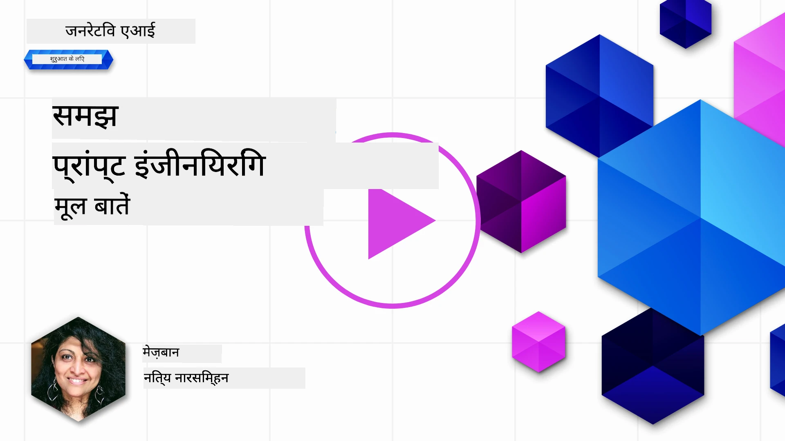
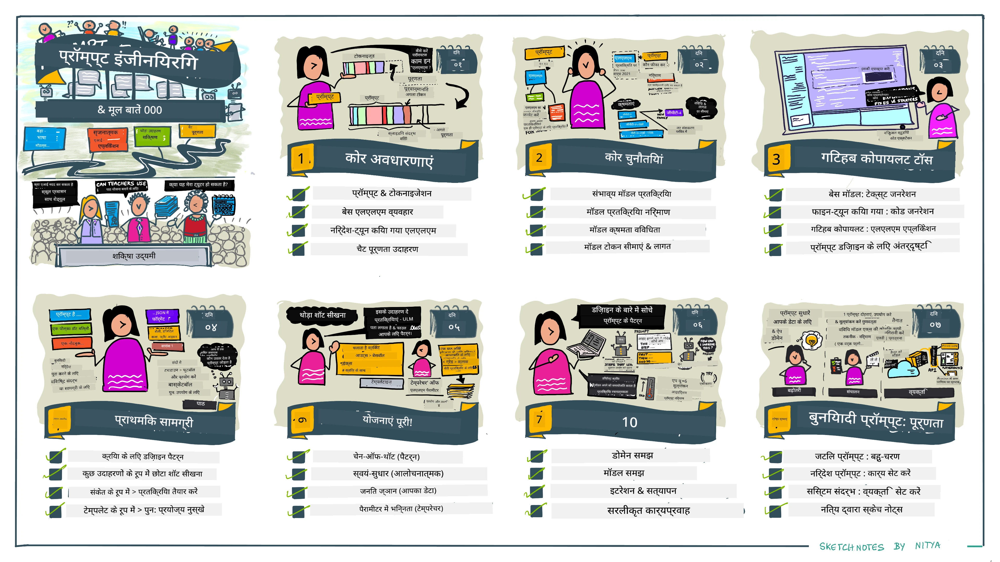
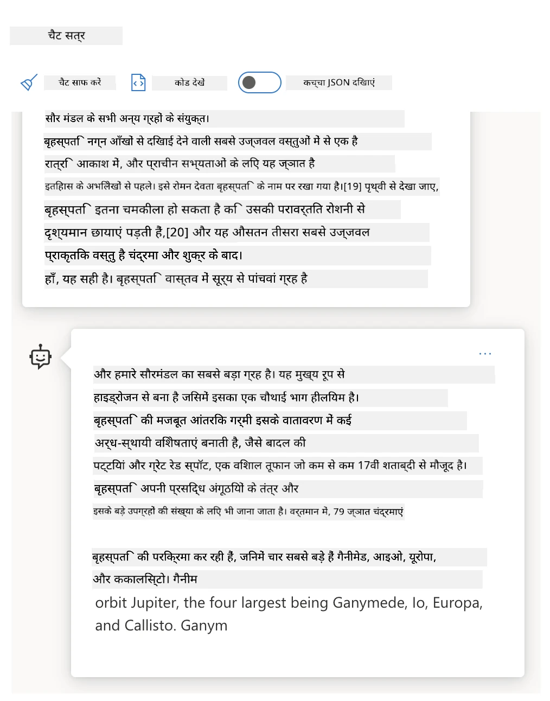
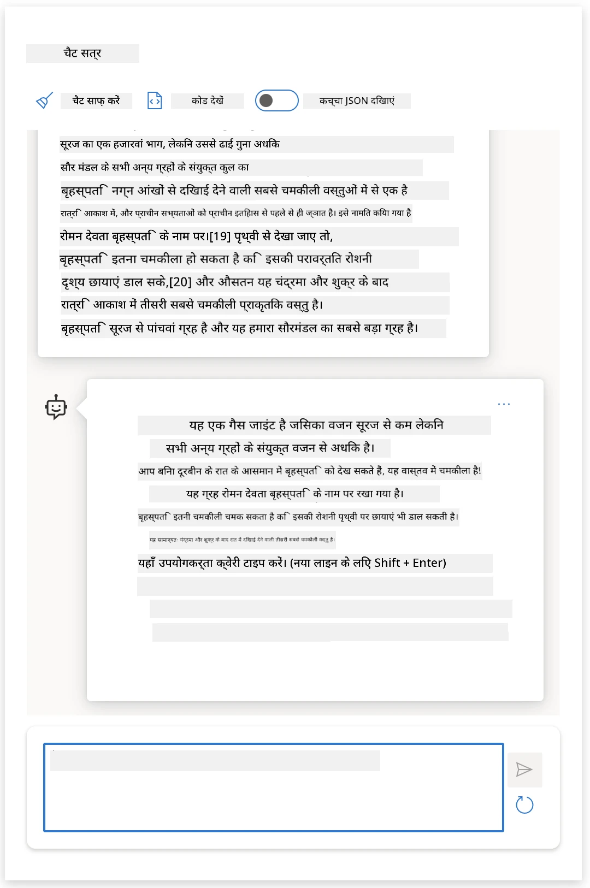
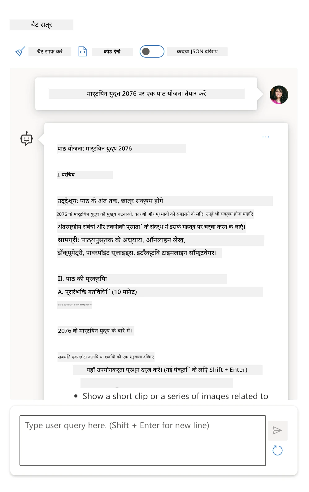
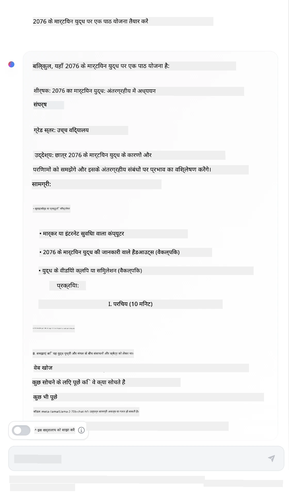

# प्रॉम्प्ट इंजीनियरिंग के मूल सिद्धांत

[](https://youtu.be/GElCu2kUlRs?si=qrXsBvXnCW12epb8)

## परिचय
यह माड्यूल जेनरेटिव AI मॉडलों में प्रभावी प्रॉम्प्ट बनाने के लिए आवश्यक अवधारणाओं और तकनीकों को कवर करता है। जिस तरह से आप LLM को अपना प्रॉम्प्ट लिखते हैं, वह भी मायने रखता है। एक सावधानीपूर्वक निर्मित प्रॉम्प्ट बेहतर गुणवत्ता के उत्तर प्राप्त कर सकता है। लेकिन _प्रॉम्प्ट_ और _प्रॉम्प्ट इंजीनियरिंग_ जैसे शब्द वास्तव में क्या अर्थ रखते हैं? और मैं LLM को भेजे जाने वाले प्रॉम्प्ट _इनपुट_ को कैसे सुधार सकता हूँ? ये ऐसे प्रश्न हैं जिनके उत्तर हम इस अध्याय और अगले में देने की कोशिश करेंगे।

_जेनरेटिव AI_ नया कंटेंट (जैसे पाठ, चित्र, ऑडियो, कोड आदि) उपयोगकर्ता की रिक्वेस्ट के जवाब में बना सकता है। यह यह प्राप्त करता है _लार्ज लैंग्वेज मॉडल्स_ (LLMs) जैसे OpenAI का GPT ("Generative Pre-trained Transformer") सीरीज, जिन्हें प्राकृतिक भाषा और कोड उपयोग के लिए प्रशिक्षित किया गया है।

उपयोगकर्ता अब तकनीकी विशेषज्ञता या प्रशिक्षण के बिना ही चैट जैसे परिचित पैराबैडाइम्स का उपयोग करके इन मॉडलों के साथ संवाद कर सकते हैं। ये मॉडल _प्रॉम्प्ट-आधारित_ हैं - उपयोगकर्ता एक टेक्स्ट इनपुट (प्रॉम्प्ट) भेजते हैं और AI प्रतिक्रिया (completion) प्राप्त करते हैं। वे फिर "AI के साथ चैट" कर सकते हैं, कई राउंड बातचीत में, अपने प्रॉम्प्ट को संशोधित करते हुए जब तक प्रतिक्रिया उनकी अपेक्षाओं से मेल न खा जाए।

"प्रॉम्प्ट्स" अब जेनरेटिव AI ऐप्स के लिए मुख्य _प्रोग्रामिंग इंटरफेस_ बन जाते हैं, जो मॉडलों को कार्य करने के लिए बताते हैं और लौटाए गए उत्तरों की गुणवत्ता को प्रभावित करते हैं। "प्रॉम्प्ट इंजीनियरिंग" एक तेज़ी से बढ़ता हुआ अध्ययन क्षेत्र है जो प्रॉम्प्ट के _डिजाइन और ऑप्टिमाइज़ेशन_ पर केंद्रित है ताकि पैमाने पर लगातार और गुणवत्तापूर्ण प्रतिक्रियाएं दी जा सकें।

## सीखने के लक्ष्य

इस पाठ में, हम सीखेंगे कि प्रॉम्प्ट इंजीनियरिंग क्या है, यह क्यों महत्वपूर्ण है, और हम किसी दिए गए मॉडल और एप्लिकेशन उद्देश्य के लिए अधिक प्रभावी प्रॉम्प्ट कैसे तैयार कर सकते हैं। हम प्रॉम्प्ट इंजीनियरिंग के मूल सिद्धांतों और सर्वोत्तम प्रथाओं को समझेंगे - और जानेंगे एक इंटरैक्टिव Jupyter नोटबुक "सैंडबॉक्स" पर्यावरण के बारे में जहाँ हम इन सिद्धांतों को वास्तविक उदाहरणों पर लागू होता देख सकते हैं।

इस पाठ के अंत तक हम सक्षम होंगे:

1. समझाना कि प्रॉम्प्ट इंजीनियरिंग क्या है और यह क्यों महत्वपूर्ण है।
2. प्रॉम्प्ट के घटकों का वर्णन करना और उनका उपयोग कैसे होता है।
3. प्रॉम्प्ट इंजीनियरिंग के सर्वोत्तम अभ्यास और तकनीकों को सीखना।
4. अपने सीखे हुए तकनीकों को वास्तविक उदाहरणों पर लागू करना, OpenAI एंडपॉइंट का उपयोग करके।

## प्रमुख शब्द

प्रॉम्प्ट इंजीनियरिंग: AI मॉडलों को इच्छित आउटपुट प्रदान करने के लिए इनपुट के डिजाइन और परिष्करण का अभ्यास।  
टोकनाइज़ेशन: टेक्स्ट को छोटे यूनिट्स, जिन्हें टोकन कहा जाता है, में बदलने की प्रक्रिया, जिन्हें मॉडल समझ सकता है और संसाधित कर सकता है।  
इंस्ट्रक्शन-ट्यूनड LLMs: ऐसे बड़े भाषा मॉडल (LLMs) जिन्हें विशिष्ट निर्देशों के साथ बेहतर उत्तर की सटीकता और प्रासंगिकता के लिए फाइन-ट्यून किया गया है।  

## सीखने का सैंडबॉक्स

प्रॉम्प्ट इंजीनियरिंग वर्तमान में विज्ञान से अधिक कला है। इसे बेहतर समझने का सबसे अच्छा तरीका है _अधिक अभ्यास_ करना और ट्रायल-एंड-एरर दृष्टिकोण अपनाना जो एप्लिकेशन डोमेन विशेषज्ञता को अनुशंसित तकनीकों और मॉडल-विशिष्ट ऑप्टिमाइजेशन के साथ जोड़ता है।

इस पाठ के साथ आने वाला Jupyter नोटबुक एक _सैंडबॉक्स_ वातावरण प्रदान करता है जहाँ आप जैसी-तैसी सीख रहे हैं वैसे-वैसे प्रयास कर सकते हैं - या पाठ के अंत में कोड चुनौती के हिस्से के रूप में। अभ्यास पूरा करने के लिए, आपको चाहिए:

1. **एक Azure OpenAI API कुंजी** - तैनात किए गए LLM के लिए सेवा एंडपॉइंट।  
2. **एक Python रनटाइम** - जिसमें नोटबुक को चलाया जा सके।  
3. **स्थानीय पर्यावरण चरों (Env Variables)** - _[SETUP](./../00-course-setup/02-setup-local.md?WT.mc_id=academic-105485-koreyst) चरणों को अभी पूरा करें ताकि आप तैयार हो सकें।_

नोटबुक में _स्टार्टर_ अभ्यास शामिल हैं - लेकिन आपको प्रोत्साहित किया जाता है कि आप अपने स्वयं के _Markdown_ (विवरण) और _Code_ (प्रॉम्प्ट अनुरोध) अनुभाग जोड़ें, और अधिक उदाहरणों या विचारों को आज़माएं - तथा प्रॉम्प्ट डिज़ाइन के लिए अपनी समझ विकसित करें।

## चित्रात्मक मार्गदर्शिका

क्या आप इस पाठ में शामिल मुख्य विषयों का बड़ा चित्र देखना चाहते हैं इससे पहले कि आप शुरू करें? यह चित्रात्मक मार्गदर्शिका देखें, जो आपको मुख्य विषयों की झलक देती है और प्रत्येक में आपके सोचने के लिए महत्वपूर्ण बातें बताती है। पाठ की रोडमैप आपको मूल अवधारणाओं और चुनौतियों को समझने से लेकर संबंधित प्रॉम्प्ट इंजीनियरिंग तकनीक और सर्वोत्तम प्रथाओं के साथ उनका समाधान करने तक ले जाती है। ध्यान दें कि इस मार्गदर्शिका में "उन्नत तकनीकें" अनुभाग इस पाठ्यक्रम के _अगले_ अध्याय में शामिल सामग्री का संदर्भ देता है।



## हमारी स्टार्टअप

अब, आइए बात करते हैं कि _यह विषय_ हमारे स्टार्टअप मिशन से कैसे संबंधित है जो [शिक्षा में AI नवाचार लाने](https://educationblog.microsoft.com/2023/06/collaborating-to-bring-ai-innovation-to-education?WT.mc_id=academic-105485-koreyst) का लक्ष्य रखता है। हम _व्यक्तिगत शिक्षण_ की AI-शक्ति वाले अनुप्रयोग बनाना चाहते हैं - तो आइए सोचें कि हमारे एप्लिकेशन के विभिन्न उपयोगकर्ता प्रॉम्प्ट "डिज़ाइन" कैसे कर सकते हैं:

- **प्रशासक** AI से पूछ सकते हैं कि _पाठ्यक्रम डेटा का विश्लेषण कर कवर किए गए विषयों में अंतराल की पहचान करें_। AI परिणामों का सारांश दे सकता है या उन्हें कोड के साथ विज़ुअलाइज़ कर सकता है।  
- **शिक्षक** AI से पूछ सकते हैं कि _लक्षित दर्शकों और विषय के लिए एक पाठ योजना तैयार करें_। AI निर्दिष्ट प्रारूप में व्यक्तिगत योजना बना सकता है।  
- **छात्र** AI से पूछ सकते हैं कि _कठिन विषय में उन्हें ट्यूटोर करें_। AI अब छात्रों को उनके स्तर के अनुसार पाठ, संकेत और उदाहरण प्रदान कर सकता है।

यह तो बस शुरुआत है। [Prompts For Education](https://github.com/microsoft/prompts-for-edu/tree/main?WT.mc_id=academic-105485-koreyst) देखें - एक ओपन-सोर्स प्रॉम्प्ट पुस्तकालय जिसे शिक्षा विशेषज्ञों ने संग्रहित किया है - ताकि संभावनाओं की व्यापक समझ प्राप्त हो! _इन प्रॉम्प्ट्स को सैंडबॉक्स में या OpenAI Playground में चलाने का प्रयास करें और देखें कि क्या होता है!_

<!--
LESSON TEMPLATE:
This unit should cover core concept #1.
Reinforce the concept with examples and references.

CONCEPT #1:
Prompt Engineering.
Define it and explain why it is needed.
-->

## प्रॉम्प्ट इंजीनियरिंग क्या है?

हमने इस पाठ की शुरुआत यह परिभाषित करके की कि **प्रॉम्प्ट इंजीनियरिंग** वह प्रक्रिया है जिसमें किसी दिए गए एप्लिकेशन उद्देश्य और मॉडल के लिए निरंतर और उच्च गुणवत्ता वाली प्रतिक्रियाएं (completions) देने हेतु टेक्स्ट इनपुट (प्रॉम्प्ट) को _डिज़ाइन_ और _ऑप्टिमाइज़_ किया जाता है। हम इसे दो-चरणीय प्रक्रिया के रूप में सोच सकते हैं:

- किसी दिए गए मॉडल और उद्देश्य के लिए प्रारंभिक प्रॉम्प्ट का _डिज़ाइन_ करना  
- प्रतिक्रिया की गुणवत्ता सुधारने के लिए प्रॉम्प्ट का पुन: संशोधन (रीफाइनिंग)  

यह अनिवार्य रूप से एक ट्रायल-एंड-एरर प्रक्रिया है जिसमें बेहतर परिणाम पाने के लिए उपयोगकर्ता की समझ और प्रयास आवश्यक होता है। तो यह क्यों आवश्यक है? इसका उत्तर पाने के लिए हमें तीन अवधारणाएँ समझनी होंगी:

- _टोकनाइज़ेशन_ = मॉडल प्रॉम्प्ट को कैसे "देखता" है  
- _बेस LLMs_ = मूल मॉडल प्रॉम्प्ट को कैसे "प्रोसेस" करता है  
- _इन्स्ट्रक्शन-ट्यूनड LLMs_ = मॉडल अब "कार्य" को कैसे देख सकता है  

### टोकनाइज़ेशन

एक LLM प्रॉम्प्ट्स को एक _टोकन अनुक्रम_ के रूप में देखता है जहाँ विभिन्न मॉडल (या एक मॉडल के संस्करण) एक ही प्रॉम्प्ट को विभिन्न तरीकों से टोकनाइज़ कर सकते हैं। चूंकि LLMs टोकन पर प्रशिक्षित होते हैं (कच्चे टेक्स्ट पर नहीं), इसलिए प्रॉम्प्ट्स का टोकनाइज़ेशन इस बात पर सीधे असर डालता है कि प्रतिक्रिया की गुणवत्ता कैसी होगी।

टोकनाइज़ेशन कैसे काम करता है, इसे समझने के लिए [OpenAI टोकनाइज़र](https://platform.openai.com/tokenizer?WT.mc_id=academic-105485-koreyst) जैसे टूल का उपयोग करें। अपना प्रॉम्प्ट कॉपी करें - और देखें कि इसे कैसे टोकन्स में बदला गया है, ध्यान रखें कि व्हाइटस्पेस कैरेक्टर्स और विराम चिह्न कैसे संभाले गए हैं। ध्यान दें कि यह उदाहरण एक पुराने LLM (GPT-3) को दिखाता है - इसलिए इसे नए मॉडल के साथ आज़माने पर परिणाम अलग हो सकता है।


### अवधारणा: फाउंडेशन मॉडल्स

एक बार जब प्रॉम्प्ट को टोकनाइज़ किया जाता है, तो ["बेस LLM"](https://blog.gopenai.com/an-introduction-to-base-and-instruction-tuned-large-language-models-8de102c785a6?WT.mc_id=academic-105485-koreyst) (या फाउंडेशन मॉडल) का प्राथमिक कार्य उस अनुक्रम में अगला टोकन भविष्यवाणी करना होता है। चूंकि LLMs बड़े टेक्स्ट डेटासेट पर प्रशिक्षित होते हैं, वे टोकन के बीच सांख्यिकीय संबंधों को अच्छी तरह समझते हैं और आत्मविश्वास के साथ अगला टोकन भविष्यवाणी कर सकते हैं। ध्यान दें कि वे प्रॉम्प्ट या टोकन में शब्दों का _अर्थ_ नहीं समझते; वे केवल एक पैटर्न देखते हैं जिसे वे अपनी अगली भविष्यवाणी से "पूरा" कर सकते हैं। वे तब तक अनुक्रम की भविष्यवाणी जारी रख सकते हैं जब तक उपयोगकर्ता या कोई पूर्व-निर्धारित शर्त उसे रोक न दे।

प्रॉम्प्ट-आधारित पूर्णता कैसे काम करती है यह देखना चाहते हैं? ऊपर दिया गया प्रॉम्प्ट Azure OpenAI Studio के [_Chat Playground_](https://oai.azure.com/playground?WT.mc_id=academic-105485-koreyst) में डिफ़ॉल्ट सेटिंग्स पर दर्ज करें। सिस्टम प्रॉम्प्ट को सूचना के अनुरोध के रूप में मानता है - इसलिए आपको ऐसी पूर्णता देखनी चाहिए जो इस संदर्भ को संतुष्ट करे।

लेकिन अगर उपयोगकर्ता कुछ विशेष देखना चाहता है जो किसी मानदंड या कार्य उद्देश्य को पूरा करता हो? तब _इंस्ट्रक्शन-ट्यूनड_ LLMs भूमिका में आते हैं।



### अवधारणा: इंस्ट्रक्शन-ट्यूनड LLMs

एक [इंस्ट्रक्शन-ट्यूनड LLM](https://blog.gopenai.com/an-introduction-to-base-and-instruction-tuned-large-language-models-8de102c785a6?WT.mc_id=academic-105485-koreyst) मूल फाउंडेशन मॉडल से शुरू होता है और इसे उदाहरणों या इनपुट / आउटपुट जोड़ों (जैसे, बहु-चरण "संदेश") के साथ फाइन-ट्यून करता है जिनमें स्पष्ट निर्देश हो सकते हैं - और AI का उत्तर उस निर्देश का पालन करने का प्रयास करता है।

यह मानव प्रतिक्रिया के साथ सुदृढीकरण सीखने (Reinforcement Learning with Human Feedback - RLHF) जैसी तकनीकों का उपयोग करता है जो मॉडल को _निर्देशों का पालन_ करना और _प्रतिक्रिया से सीखना_ सिखाता है ताकि यह व्यवहारिक अनुप्रयोगों के लिए अधिक उपयुक्त और उपयोगकर्ता उद्देश्यों के प्रति अधिक प्रासंगिक प्रतिक्रियाएं दे सके।

चलो इसे आज़माते हैं - ऊपर के प्रॉम्प्ट पर वापसी करें, लेकिन अब _सिस्टम संदेश_ को निम्नलिखित संदर्भ निर्देश के रूप में बदलें:

> _आपको प्रदान की गई सामग्री को दूसरे ग्रेड के छात्र के लिए सारांशित करें। परिणाम को एक पैराग्राफ़ में 3-5 बुलेट पॉइंट्स के साथ रखें।_

देखें कि परिणाम अब इच्छित लक्ष्य और प्रारूप के अनुसार है? एक शिक्षक इस प्रतिक्रिया का उपयोग सीधे अपने कक्षा के स्लाइड्स में कर सकता है।



## हमें प्रॉम्प्ट इंजीनियरिंग की क्यों जरूरत है?

अब जब हम जानते हैं कि LLMs प्रॉम्प्ट्स को कैसे संसाधित करते हैं, तो आइए बात करें कि _क्यों_ हमें प्रॉम्प्ट इंजीनियरिंग की आवश्यकता है। इसका उत्तर इस तथ्य में निहित है कि वर्तमान LLMs कई चुनौतियां प्रस्तुत करते हैं जो _विश्वसनीय और लगातार पूर्णताएं_ प्राप्त करना मुश्किल बनाती हैं जब तक प्रॉम्प्ट निर्माण और अनुकूलन में प्रयास न किया जाए। उदाहरण के लिए:

1. **मॉडल प्रतिक्रियाएँ सांख्यिकीय होती हैं।** एक _ही प्रॉम्प्ट_ संभवतः विभिन्न मॉडलों या मॉडल संस्करणों के साथ अलग प्रतिक्रियाएं देगा। और यह _एक ही मॉडल_ के साथ भी अलग समयों पर भिन्न परिणाम दे सकता है। _प्रॉम्प्ट इंजीनियरिंग तकनीकें इन विविधताओं को कम करने में मदद कर सकती हैं बेहतर गार्डरेल प्रदान करके_।

1. **मॉडल प्रतिक्रिया का निर्माण कर सकते हैं।** मॉडल बड़े लेकिन सीमित डेटा सेट पर प्री-ट्रेंड होते हैं, जिसका मतलब है कि उनके पास उन प्रशिक्षण दायरे के बाहर के अवधारणाओं का ज्ञान नहीं होता। नतीजतन, वे ऐसी पूर्णताएं पैदा कर सकते हैं जो गलत, कल्पित, या ज्ञात तथ्यों के विपरीत हों। _प्रॉम्प्ट इंजीनियरिंग तकनीकें उपयोगकर्ताओं को ऐसी बनावटों की पहचान करने और उन्हें कम करने में मदद करती हैं, जैसे कि AI से संदर्भ या तार्किक व्याख्या मांगना_।

1. **मॉडल क्षमताएँ भिन्न होंगी।** नए मॉडल या मॉडल पीढ़ियाँ अधिक समृद्ध क्षमताएँ लेकर आएंगी पर उनके साथ लागत और जटिलता में विशिष्ट विचित्रताएँ और समझौते भी आएंगे। _प्रॉम्प्ट इंजीनियरिंग हमें सर्वोत्तम प्रथाओं और वर्कफ़्लोज़ विकसित करने में मदद कर सकती है जो अंतर को समेटती हैं और मॉडल-विशिष्ट आवश्यकताओं के अनुकूल स्केलेबल, सहज तरीकों से अनुकूलित होती हैं_।

इसे OpenAI या Azure OpenAI Playground में क्रियान्वित करें:

- विभिन्न LLM डिप्लॉयमेंट्स (जैसे, OpenAI, Azure OpenAI, Hugging Face) के साथ एक ही प्रॉम्प्ट का उपयोग करें - क्या आपने विभिन्नताएँ देखीं?  
- एक ही LLM डिप्लॉयमेंट (जैसे, Azure OpenAI playground) के साथ एक ही प्रॉम्प्ट को बार-बार चलाएं - ये विविधताएं कैसे भिन्न थीं?  

### बनावटों का उदाहरण

इस कोर्स में, हम **"बनावट"** शब्द का उपयोग उस घटना के लिए करते हैं जहाँ LLMs कभी-कभी अपनी प्रशिक्षण सीमाओं या अन्य प्रतिबंधों के कारण तथ्यात्मक रूप से गलत जानकारी उत्पन्न करते हैं। आपने इसे लोकप्रिय लेखों या शोध पत्रों में _"हैलुसीनेशंस"_ के रूप में भी सुना होगा। हालांकि, हम सिफारिश करते हैं कि _"बनावट"_ शब्द का उपयोग करें ताकि हम गलती से मशीन द्वारा उत्पन्न परिणाम के लिए मानवीय गुण न लगा दें। यह [उत्तरदायी AI दिशानिर्देशों](https://www.microsoft.com/ai/responsible-ai?WT.mc_id=academic-105485-koreyst) को भी मजबूत करता है, जो अशिष्ट या गैर-समावेशी शब्दावली को हटा देता है।

बनावट कैसे काम करती है यह समझना चाहते हैं? ऐसा प्रॉम्प्ट सोचें जो AI को एक मौजूद न होने वाले विषय पर सामग्री बनाने के लिए कहता है (ताकि यह सुनिश्चित हो सके कि यह प्रशिक्षण डेटासेट में न हो)। उदाहरण के लिए - मैंने यह प्रॉम्प्ट आज़माया:

> **प्रॉम्प्ट:** 2076 के मार्टियन युद्ध पर एक पाठ योजना बनाएं।
एक वेब खोज ने मुझे दिखाया कि मार्शियन युद्धों पर काल्पनिक कथाएँ (जैसे, टेलीविजन श्रृंखला या पुस्तकें) थीं - लेकिन 2076 में नहीं। सामान्य समझ भी कहती है कि 2076 _भविष्य में_ है और इसलिए, इसे किसी वास्तविक घटना से जोड़ा नहीं जा सकता।

तो जब हम इस प्रॉम्प्ट को विभिन्न LLM प्रदाताओं के साथ चलाते हैं तो क्या होता है?

> **प्रतिक्रिया 1**: OpenAI प्लेग्राउंड (GPT-35)


> **प्रतिक्रिया 2**: Azure OpenAI प्लेग्राउंड (GPT-35)



> **प्रतिक्रिया 3**: : Hugging Face चैट प्लेग्राउंड (LLama-2)



अपेक्षित रूप से, प्रत्येक मॉडल (या मॉडल संस्करण) में कुछ अलग प्रतिक्रियाएँ होती हैं जो यादृच्छिक व्यवहार और मॉडल क्षमता के भिन्नताओं की वजह से होती हैं। उदाहरण के लिए, एक मॉडल 8वीं कक्षा के दर्शकों को लक्षित करता है जबकि दूसरा हाई-स्कूल के छात्र को समझता है। लेकिन तीनों मॉडलों ने ऐसी प्रतिक्रियाएँ दीं जो एक अनजान उपयोगकर्ता को यह विश्वास दिला सकती हैं कि वह घटना वास्तविक थी।

_मेटाप्रोम्प्टिंग_ और _टेम्परेचर कॉन्फ़िगरेशन_ जैसे प्रॉम्प्ट इंजीनियरिंग तकनीकें मॉडल के बुनावटों को कुछ हद तक कम कर सकती हैं। नई प्रॉम्प्ट इंजीनियरिंग _आर्किटेक्चर_ नए उपकरणों और तकनीकों को सहजता से प्रॉम्प्ट फ्लो में शामिल करते हैं, ताकि इन प्रभावों को कम किया जा सके।

## केस स्टडी: GitHub Copilot

आइए इस अनुभाग को समाप्त करते हैं यह समझने के लिए कि वास्तविक दुनिया के समाधानों में प्रॉम्प्ट इंजीनियरिंग का उपयोग कैसे किया जाता है, एक केस स्टडी देखने के द्वारा: [GitHub Copilot](https://github.com/features/copilot?WT.mc_id=academic-105485-koreyst)।

GitHub Copilot आपका "AI जोड़ी प्रोग्रामर" है - यह टेक्स्ट प्रॉम्प्ट को कोड पूर्णताओं में परिवर्तित करता है और आपके विकास पर्यावरण (जैसे, Visual Studio Code) में एक सहज उपयोगकर्ता अनुभव के लिए एकीकृत है। नीचे उल्लिखित ब्लॉग श्रृंखला में वर्णित, प्रारंभिक संस्करण OpenAI Codex मॉडल पर आधारित था - जिसमें अभियंता तेजी से मॉडल को बेहतर बनाने और बेहतर प्रॉम्प्ट इंजीनियरिंग तकनीकों को विकसित करने की आवश्यकता को समझते हुए कोड गुणवत्ता सुधारने के लिए काम कर रहे थे। जुलाई में, उन्होंने [Codex से आगे जाने वाले एक बेहतर AI मॉडल का परिचय दिया](https://github.blog/2023-07-28-smarter-more-efficient-coding-github-copilot-goes-beyond-codex-with-improved-ai-model/?WT.mc_id=academic-105485-koreyst) ताकि और तेज सुझावों के लिए।

उनके सीखने की यात्रा का पालन करने के लिए निम्नलिखित पोस्ट क्रम में पढ़ें।

- **मई 2023** | [GitHub Copilot आपके कोड को समझने में बेहतर हो रहा है](https://github.blog/2023-05-17-how-github-copilot-is-getting-better-at-understanding-your-code/?WT.mc_id=academic-105485-koreyst)
- **मई 2023** | [GitHub के अंदर: GitHub Copilot के पीछे LLMs के साथ काम करना](https://github.blog/2023-05-17-inside-github-working-with-the-llms-behind-github-copilot/?WT.mc_id=academic-105485-koreyst)
- **जून 2023** | [GitHub Copilot के लिए बेहतर प्रॉम्प्ट कैसे लिखें](https://github.blog/2023-06-20-how-to-write-better-prompts-for-github-copilot/?WT.mc_id=academic-105485-koreyst)
- **जुलाई 2023** | [.. GitHub Copilot बेहतर AI मॉडल के साथ Codex से आगे बढ़ता है](https://github.blog/2023-07-28-smarter-more-efficient-coding-github-copilot-goes-beyond-codex-with-improved-ai-model/?WT.mc_id=academic-105485-koreyst)
- **जुलाई 2023** | [प्रॉम्प्ट इंजीनियरिंग और LLMs के लिए एक डेवलपर का गाइड](https://github.blog/2023-07-17-prompt-engineering-guide-generative-ai-llms/?WT.mc_id=academic-105485-koreyst)
- **सितंबर 2023** | [एंटरप्राइज LLM एप्लिकेशन कैसे बनाएं: GitHub Copilot से सबक](https://github.blog/2023-09-06-how-to-build-an-enterprise-llm-application-lessons-from-github-copilot/?WT.mc_id=academic-105485-koreyst)

आप उनके [इंजीनियरिंग ब्लॉग](https://github.blog/category/engineering/?WT.mc_id=academic-105485-koreyst) में ऐसे और पोस्ट भी देख सकते हैं जैसे [यहां बताया गया](https://github.blog/2023-09-27-how-i-used-github-copilot-chat-to-build-a-reactjs-gallery-prototype/?WT.mc_id=academic-105485-koreyst) कि ये मॉडल और तकनीकें वास्तविक दुनिया के अनुप्रयोगों को संचालित करने के लिए कैसे _लागू_ होती हैं।

---

<!--
LESSON TEMPLATE:
This unit should cover core concept #2.
Reinforce the concept with examples and references.

CONCEPT #2:
Prompt Design.
Illustrated with examples.
-->

## प्रॉम्प्ट निर्माण

हमने देखा कि प्रॉम्प्ट इंजीनियरिंग क्यों महत्वपूर्ण है - अब समझते हैं कि प्रॉम्प्ट कैसे _निर्मित_ होते हैं ताकि हम और अधिक प्रभावी प्रॉम्प्ट डिज़ाइन के लिए विभिन्न तकनीकों का मूल्यांकन कर सकें।

### मूल प्रॉम्प्ट

आइए मूल प्रॉम्प्ट से शुरू करें: एक टेक्स्ट इनपुट जो मॉडल को बिना किसी अन्य संदर्भ के भेजा जाता है। यहाँ एक उदाहरण है - जब हम यूएस राष्ट्रीय गान के पहले कुछ शब्द OpenAI [Completion API](https://platform.openai.com/docs/api-reference/completions?WT.mc_id=academic-105485-koreyst) को भेजते हैं, तो यह तुरंत अगली कुछ पंक्तियाँ _पूरा_ कर देता है, जो बुनियादी भविष्यवाणी व्यवहार को दर्शाता है।

| प्रॉम्प्ट (इनपुट)    | पूर्णता (आउटपुट)                                                                                                                        |
| :----------------- | :----------------------------------------------------------------------------------------------------------------------------------------- |
| Oh say can you see | ऐसा लगता है कि आप "The Star-Spangled Banner," जो संयुक्त राज्य अमेरिका का राष्ट्रीय गान है, के गीत शुरू कर रहे हैं। पूरा गीत है ... |

### जटिल प्रॉम्प्ट

अब हम उस मूल प्रॉम्प्ट में संदर्भ और निर्देश जोड़ते हैं। [चैट पूर्णता API](https://learn.microsoft.com/azure/ai-services/openai/how-to/chatgpt?WT.mc_id=academic-105485-koreyst) हमें एक जटिल प्रॉम्प्ट को _संदेशों_ के संग्रह के रूप में बनाने देता है जिसमें:

- उपयोगकर्ता इनपुट और सहायक प्रतिक्रिया को प्रतिबिंबित करने वाले इनपुट/आउटपुट जोड़े।
- सिस्टम संदेश जो सहायक के व्यवहार या व्यक्तित्व के लिए संदर्भ सेट करता है।

अनुरोध अब नीचे दिए गए प्रारूप में है, जहां _टोकनाइजेशन_ प्रभावी ढंग से संदर्भ और संवाद से संबंधित जानकारी पकड़ता है। अब, सिस्टम संदर्भ बदलना पूर्णताओं की गुणवत्ता पर उतना ही प्रभाव डाल सकता है जितना दिए गए उपयोगकर्ता इनपुट्स।

```python
response = openai.chat.completions.create(
    model="gpt-3.5-turbo",
    messages=[
        {"role": "system", "content": "You are a helpful assistant."},
        {"role": "user", "content": "Who won the world series in 2020?"},
        {"role": "assistant", "content": "The Los Angeles Dodgers won the World Series in 2020."},
        {"role": "user", "content": "Where was it played?"}
    ]
)
```

### निर्देश प्रॉम्प्ट

ऊपर दिए गए उदाहरणों में, उपयोगकर्ता प्रॉम्प्ट एक साधारण टेक्स्ट क्वेरी था जिसे जानकारी के लिए अनुरोध के रूप में समझा जा सकता है। _निर्देश_ प्रॉम्प्ट के साथ, हम उस टेक्स्ट का उपयोग एक कार्य को अधिक विस्तार से निर्दिष्ट करने के लिए कर सकते हैं, AI को बेहतर मार्गदर्शन प्रदान करते हुए। यहाँ एक उदाहरण है:

| प्रॉम्प्ट (इनपुट)                                                                                                                                                                                                                         | पूर्णता (आउटपुट)                                                                                                        | निर्देश प्रकार    |
| :------------------------------------------------------------------------------------------------------------------------------------------------------------------------------------------------------------------------------------- | :------------------------------------------------------------------------------------------------------------------------- | :------------------ |
| Write a description of the Civil War                                                                                                                                                                                                   | _एक साधारण पैराग्राफ लौटाया_                                                                                               | सरल              |
| Write a description of the Civil War. Provide key dates and events and describe their significance                                                                                                                                     | _एक पैराग्राफ लौटाया जिसके बाद प्रमुख घटनाओं की तिथियों और विवरणों की सूची_                                             | जटिल             |
| Write a description of the Civil War in 1 paragraph. Provide 3 bullet points with key dates and their significance. Provide 3 more bullet points with key historical figures and their contributions. Return the output as a JSON file | _अधिक विस्तृत विवरण एक टेक्स्ट बॉक्स में लौटाता है, जो JSON के रूप में स्वरूपित होता है जिसे आप कॉपी-पेस्ट करके फ़ाइल में उपयोग और सत्यापित कर सकते हैं_ | जटिल। स्वरूपित। |

## प्राथमिक सामग्री

ऊपर दिए गए उदाहरणों में, प्रॉम्प्ट अभी भी काफी खुला था, जिससे LLM को यह निर्णय लेने की आज़ादी थी कि उसके पूर्व-प्रशिक्षित डेटासेट का कौन सा हिस्सा प्रासंगिक है। _प्राथमिक सामग्री_ डिज़ाइन पैटर्न के साथ, इनपुट टेक्स्ट को दो भागों में विभाजित किया जाता है:

- एक निर्देश (क्रिया)
- संबंधित सामग्री (जो क्रिया को प्रभावित करती है)

यहाँ एक उदाहरण है जहाँ निर्देश है "इसे 2 वाक्यों में सारांशित करें"।

| प्रॉम्प्ट (इनपुट)                                                                                                                                                                                                                                                                                                                                                                                                                                                                                                                                                                                                                                                                                      | पूर्णता (आउटपुट)                                                                                                                                                                                                                                                                             |
| :-------------------------------------------------------------------------------------------------------------------------------------------------------------------------------------------------------------------------------------------------------------------------------------------------------------------------------------------------------------------------------------------------------------------------------------------------------------------------------------------------------------------------------------------------------------------------------------------------------------------------------------------------------------------------------------------------- | :---------------------------------------------------------------------------------------------------------------------------------------------------------------------------------------------------------------------------------------------------------------------------------------------- |
| बृहस्पति सूर्य से पांचवां ग्रह है और सौरमंडल का सबसे बड़ा ग्रह है। यह एक गैस विशाल है जिसका द्रव्यमान सूर्य के द्रव्यमान का एक हजारवां हिस्सा है, लेकिन सौरमंडल के सभी अन्य ग्रहों के कुल द्रव्यमान का ढाई गुना है। बृहस्पति ने नग्न आंखों से देखा जा सकने वाले सबसे चमकीले पिंडों में से एक है, और प्राचीन सभ्यताओं के लिए रिकॉर्ड इतिहास से पहले ज्ञात था। इसका नाम रोमन देवता बृहस्पति के नाम पर रखा गया है।[19] पृथ्वी से देखने पर, बृहस्पति का प्रतिबिंबित प्रकाश इतना उज्ज्वल हो सकता है कि यह दृश्य छायाएँ डालता है,[20] और यह औसतन चंद्रमा और शुक्र ग्रह के बाद रात के आकाश में तीसरा सबसे चमकीला प्राकृतिक पिंड है। <br/> **इसे 2 छोटे वाक्यों में सारांशित करें** | बृहस्पति, सूर्य से पांचवां ग्रह, सौरमंडल का सबसे बड़ा ग्रह है और रात के आकाश में सबसे चमकीले पिंडों में से एक माना जाता है। इसका नाम रोमन देवता बृहस्पति के नाम पर रखा गया है, यह एक गैस विशाल है जिसका द्रव्यमान सौरमंडल के सभी अन्य ग्रहों के द्रव्यमान का ढाई गुना है। |

प्राथमिक सामग्री खंड का उपयोग विभिन्न तरीकों से किया जा सकता है ताकि प्रभावी निर्देश दिए जा सकें:

- **उदाहरण** - मॉडल को एक स्पष्ट निर्देश देने के बजाय, उसे वांछित आउटपुट के कुछ उदाहरण दें और वह पैटर्न को समझे।
- **संकेत** - निर्देश के बाद एक "संकेत" दें जो पूर्णता को प्रेरित करता है, जिससे मॉडल अधिक प्रासंगिक प्रतिक्रियाओं की ओर बढ़े।
- **टेम्पलेट्स** - ये प्रॉम्प्ट्स के दोहराए जाने वाले 'रेसिपी' हैं जिनमें प्लेसहोल्डर (वैरिएबल) होते हैं जिन्हें विशिष्ट उपयोग मामलों के लिए डेटा के साथ कस्टमाइज़ किया जा सकता है।

आइए इन्हें क्रियान्वयन में देखें।

### उदाहरणों का उपयोग

यह एक तरीका है जहाँ आप प्राथमिक सामग्री का उपयोग करते हुए एक निर्देश के लिए वांछित आउटपुट के कुछ उदाहरण "मॉडल को खिलाते" हैं, और इसे वांछित आउटपुट के पैटर्न का अनुमान लगाने देते हैं। उदाहरणों की संख्या के आधार पर, हमारे पास ज़ीरो-शॉट प्रॉम्प्टिंग, वन-शॉट प्रॉम्प्टिंग, फ़्यू-शॉट प्रॉम्प्टिंग आदि हो सकते हैं।

प्रॉम्प्ट अब तीन घटकों से बना होता है:

- एक कार्य विवरण
- वांछित आउटपुट के कुछ उदाहरण
- एक नए उदाहरण की शुरुआत (जो एक अप्रत्यक्ष कार्य विवरण बन जाता है)

| सीखने का प्रकार | प्रॉम्प्ट (इनपुट)                                                                                                                                        | पूर्णता (आउटपुट)         |
| :------------ | :---------------------------------------------------------------------------------------------------------------------------------------------------- | :-------------------------- |
| ज़ीरो-शॉट     | "The Sun is Shining". Translate to Spanish                                                                                                            | "El Sol está brillando".    |
| वन-शॉट        | "The Sun is Shining" => ""El Sol está brillando". <br> "It's a Cold and Windy Day" =>                                                                 | "Es un día frío y ventoso". |
| फ़्यू-शॉट      | The player ran the bases => Baseball <br/> The player hit an ace => Tennis <br/> The player hit a six => Cricket <br/> The player made a slam-dunk => | Basketball                  |
|               |                                                                                                                                                       |                             |

देखें कि हमने ज़ीरो-शॉट प्रॉम्प्टिंग में स्पष्ट निर्देश ("Translate to Spanish") देना पड़ा, लेकिन वन-शॉट प्रॉम्प्टिंग उदाहरण में यह अनुमानित हो जाता है। फ़्यू-शॉट उदाहरण यह दिखाता है कि अधिक उदाहरण जोड़ने से मॉडल को बिना किसी अतिरिक्त निर्देश के अधिक सटीक अनुमान लगाने में मदद मिलती है।

### प्रॉम्प्ट संकेत

प्राथमिक सामग्री का उपयोग करने की एक और तकनीक है _संकेत_ देना बजाय उदाहरण के। इस मामले में, हम मॉडल को सही दिशा में एक संकेत देकर प्रारंभ कर रहे हैं जो वांछित प्रतिक्रिया प्रारूप को प्रतिबिंबित करता है। मॉडल फिर "संकेत लेता है" और उसी शैली में जारी रखता है।

| संकेतों की संख्या | प्रॉम्प्ट (इनपुट)                                                                                                                                                                                                                                                                                                                                                                                                                                               | पूर्णता (आउटपुट)                                                                                                                                                                                                                                                                                       |
| :------------- | :----------------------------------------------------------------------------------------------------------------------------------------------------------------------------------------------------------------------------------------------------------------------------------------------------------------------------------------------------------------------------------------------------------------------------------------------------------- | :-------------------------------------------------------------------------------------------------------------------------------------------------------------------------------------------------------------------------------------------------------------------------------------------------------- |
| 0              | बृहस्पति सूर्य से पांचवां ग्रह है और सौरमंडल का सबसे बड़ा ग्रह है। यह एक गैस विशाल है जिसका द्रव्यमान सूर्य के द्रव्यमान का एक हजारवां हिस्सा है, लेकिन सौरमंडल के सभी अन्य ग्रहों के कुल द्रव्यमान का ढाई गुना है। बृहस्पति ने नग्न आंखों से देखा जा सकने वाले सबसे चमकीले पिंडों में से एक है, और प्राचीन सभ्यताओं के लिए रिकॉर्ड इतिहास से पहले ज्ञात था। <br/>**इसे सारांशित करें**                                       | बृहस्पति हमारे सौरमंडल का सबसे बड़ा ग्रह है और सूर्य से पांचवां ग्रह है। यह एक गैस विशाल है जिसकी द्रव्यमान सूर्य के द्रव्यमान का 1/1000वां हिस्सा है, लेकिन यह सभी अन्य ग्रहों के कुल द्रव्यमान से भारी है। प्राचीन सभ्यताओं को बृहस्पति के बारे में लंबे समय से जानकारी थी, और यह रात के आकाश में आसानी से दिखाई देता है। |
| 1              | बृहस्पति सूर्य से पाँचवाँ ग्रह है और सौरमंडल में सबसे बड़ा है। यह एक गैस दिग्गज है जिसका द्रव्यमान सूर्य के द्रव्यमान का एक-हज़ारवाँ भाग है, लेकिन यह सौरमंडल के सभी अन्य ग्रहों के द्रव्यमान का ढाई गुना है। बृहस्पति नंगी आंख से रात के आकाश में दिखाई देने वाले सबसे चमकीले पिंडों में से एक है, और प्राचीन सभ्यताओं को ज्ञात है जो अभिलेखित इतिहास से पहले से मौजूद थीं। <br/>**इसका सारांश** <br/> हमने यह सीखा कि बृहस्पति | सूर्य से पाँचवाँ ग्रह है और सौरमंडल में सबसे बड़ा है। यह एक गैस दिग्गज है जिसका द्रव्यमान सूर्य के द्रव्यमान का एक-हज़ारवाँ भाग है, लेकिन यह सभी अन्य ग्रहों के सम्मिलित द्रव्यमान का ढाई गुना है। यह नंगी आंख से आसानी से दिखाई देता है और प्राचीन काल से जाना जाता है।                        |
| 2              | बृहस्पति सूर्य से पाँचवाँ ग्रह है और सौरमंडल में सबसे बड़ा है। यह एक गैस दिग्गज है जिसका द्रव्यमान सूर्य के द्रव्यमान का एक-हज़ारवाँ भाग है, लेकिन यह सौरमंडल के सभी अन्य ग्रहों के द्रव्यमान का ढाई गुना है। बृहस्पति नंगी आंख से रात के आकाश में दिखाई देने वाले सबसे चमकीले पिंडों में से एक है, और प्राचीन सभ्यताओं को ज्ञात है जो अभिलेखित इतिहास से पहले से मौजूद थीं। <br/>**इसका सारांश** <br/> हमने सीखे गए शीर्ष 3 तथ्य:         | 1. बृहस्पति सूर्य से पाँचवाँ ग्रह है और सौरमंडल में सबसे बड़ा है। <br/> 2. यह एक गैस दिग्गज है जिसका द्रव्यमान सूर्य के द्रव्यमान का एक-हज़ारवाँ भाग है...<br/> 3. बृहस्पति प्राचीन काल से नंगी आंख से दिखाई देता रहा है ...                                                                       |
|                |                                                                                                                                                                                                                                                                                                                                                                                                                                                              |                                                                                                                                                                                                                                                                                                           |

### प्रेरणा टेम्प्लेट्स

एक प्रेरणा टेम्प्लेट एक _पूर्व-निर्धारित प्रेरणा की विधि_ है जिसे आवश्यकतानुसार संग्रहित और पुनः उपयोग किया जा सकता है ताकि बड़े पैमाने पर उपयोगकर्ताओं के अनुभव समान और सुसंगत बन सकें। अपने सरलतम रूप में, यह केवल उपयोगकर्ता और सिस्टम संदेशों सहित इंटरेक्टिव प्रेरणा घटकों और एपीआई-चालित अनुरोध प्रारूप दोनों को प्रदान करने वाले [OpenAI के इस उदाहरण](https://platform.openai.com/examples?WT.mc_id=academic-105485-koreyst) जैसे प्रेरणा उदाहरणों का संग्रह है - पुनः उपयोग का समर्थन करने के लिए।

इसके जटिल रूप में, जैसे [LangChain का यह उदाहरण](https://python.langchain.com/docs/concepts/prompt_templates/?WT.mc_id=academic-105485-koreyst), इसमें _प्लेसहोल्डर्स_ होते हैं जिन्हें विभिन्न स्रोतों (उपयोगकर्ता इनपुट, सिस्टम संदर्भ, बाहरी डेटा स्रोत आदि) से डेटा से प्रतिस्थापित किया जा सकता है ताकि प्रेरणा को गतिशील रूप से बनाया जा सके। यह हमें एक लाइब्रेरी बनाने की अनुमति देता है जिसमें पुन: प्रयोज्य प्रेरणाएँ होती हैं जिन्हें प्रोग्रामेटिक रूप से बड़े पैमाने पर निरंतर उपयोगकर्ता अनुभव प्रदान करने के लिए उपयोग किया जा सकता है।

अंत में, टेम्प्लेट्स का असली मूल्य वर्टिकल एप्लिकेशन डोमेन के लिए प्रेरणा लाइब्रेरी बनाने और प्रकाशित करने की क्षमता में निहित है - जहाँ प्रेरणा टेम्प्लेट अब ऐसे एप्लिकेशन-विशिष्ट संदर्भ या उदाहरणों को प्रतिबिंबित करने के लिए _इष्टतम_ होते हैं जो लक्षित उपयोगकर्ता दर्शकों के लिए प्रतिक्रियाओं को अधिक प्रासंगिक और सटीक बनाते हैं। [Prompts For Edu](https://github.com/microsoft/prompts-for-edu?WT.mc_id=academic-105485-koreyst) रिपॉजिटरी इस दृष्टिकोण का एक शानदार उदाहरण है, जो शिक्षा डोमेन के लिए प्रेरणा की एक लाइब्रेरी तैयार करता है, जिसमें पाठ योजना, पाठ्यक्रम डिज़ाइन, छात्र ट्यूटरिंग आदि जैसे प्रमुख उद्देश्यों पर जोर दिया गया है।

## सहायक सामग्री

यदि हम प्रेरणा निर्माण को एक निर्देश (कार्य) और एक लक्ष्य (प्राथमिक सामग्री) के रूप में सोचें, तो _माध्यमिक सामग्री_ वह अतिरिक्त संदर्भ जैसी होती है जिसे हम आउटपुट को कुछ न कुछ तरीके से प्रभावित करने के लिए प्रदान करते हैं। यह ट्यूनिंग पैरामीटर, स्वरूपण निर्देश, विषय श्रेणियाँ आदि हो सकती हैं जो मॉडल को _अपने उत्तर को इच्छित उपयोगकर्ता उद्देश्यों या अपेक्षाओं के अनुसार अनुकूलित_ करने में मदद करती हैं।

उदाहरण के लिए: यदि हमारे पास पाठ्यक्रम सूची है जिसमें व्यापक मेटाडेटा (नाम, विवरण, स्तर, मेटाडेटा टैग, प्रशिक्षक आदि) हो, तो:

- हम एक निर्देश दे सकते हैं "फॉल 2023 के लिए पाठ्यक्रम सूची का सारांश बनाओ"
- हम प्राथमिक सामग्री में इच्छित परिणाम के कुछ उदाहरण प्रदान कर सकते हैं
- हम माध्यमिक सामग्री में शीर्ष 5 "टैग" पहचान सकते हैं जिनमें रुचि हो।

अब, मॉडल कुछ उदाहरणों द्वारा दिखाए गए प्रारूप में सारांश प्रदान कर सकता है - लेकिन यदि किसी परिणाम में कई टैग हों, तो यह माध्यमिक सामग्री में पहचाने गए 5 टैग को प्राथमिकता दे सकता है।

---

<!--
LESSON TEMPLATE:
यह इकाई मुख्य अवधारणा #1 कवर करनी चाहिए।
उदाहरणों और संदर्भों से अवधारणा को मजबूत करें।

अवधारणा #3:
प्रेरणा इंजीनियरिंग तकनीकें।
प्रेरणा इंजीनियरिंग के कुछ मूलभूत तकनीकें क्या हैं?
इसे कुछ अभ्यासों के साथ प्रस्तुत करें।
-->

## प्रेरणा के सर्वोत्तम अभ्यास

अब जब हमें पता है कि प्रेरणाएँ _कैसे बनायीं जा सकती हैं_, तो हम सोच सकते हैं कि उन्हें डिजाइन कैसे किया जाए ताकि सर्वोत्तम अभ्यासों को प्रतिबिंबित किया जा सके। हम इसे दो भागों में सोच सकते हैं - सही _मनोवृत्ति_ होना और सही _तकनीकों_ को लागू करना।

### प्रेरणा इंजीनियरिंग का मनोवृत्ति

प्रेरणा इंजीनियरिंग एक प्रयत्न-त्रुटि प्रक्रिया है, इसलिए तीन व्यापक मार्गदर्शक बिंदुओं को ध्यान रखिए:

1. **डोमेन की समझ महत्वपूर्ण है।** प्रतिक्रिया की सटीकता और प्रासंगिकता उस _डोमेन_ पर निर्भर करती है जिसमें वह एप्लिकेशन या उपयोगकर्ता काम कर रहा है। अपनी सहजज्ञान और डोमेन विशेषज्ञता का उपयोग करें और **तकनीकों को अधिक कस्टमाइज़ करें।** उदाहरण के लिए, अपने सिस्टम प्रेरणा में _डोमेन-विशिष्ट व्यक्तित्व_ परिभाषित करें, या अपने उपयोगकर्ता प्रेरणा में _डोमेन-विशिष्ट टेम्प्लेट्स_ का उपयोग करें। माध्यमिक सामग्री प्रदान करें जो डोमेन-विशिष्ट संदर्भों को प्रतिबिंबित करे, या मॉडल को परिचित उपयोग पैटर्न की ओर मार्गदर्शन करने के लिए _डोमेन-विशिष्ट संकेत और उदाहरण_ का उपयोग करें।

2. **मॉडल की समझ महत्वपूर्ण है।** हम जानते हैं कि मॉडल स्वाभाविक रूप से यादृच्छिक होते हैं। लेकिन मॉडल के कार्यान्वयन प्रशिक्षण डेटासेट (पूर्व-प्रशिक्षित ज्ञान), प्रदान की जाने वाली क्षमताओं (जैसे एपीआई या SDK के माध्यम से) और जिन प्रकार की सामग्री के लिए वे अनुकूलित हैं (जैसे कोड, चित्र, या पाठ) के आधार पर भिन्न हो सकते हैं। अपने उपयोग किए गए मॉडल की ताकत और सीमाओं को समझें, और उस ज्ञान का उपयोग कर _कार्य को प्राथमिकता_ दें या _कस्टम टेम्प्लेट_ बनाएं जो मॉडल की क्षमताओं के लिए इष्टतम हों।

3. **पुनरावृत्ति और मान्यकरण महत्वपूर्ण हैं।** मॉडल तेजी से विकसित हो रहे हैं, और प्रेरणा इंजीनियरिंग के तरीके भी। एक डोमेन विशेषज्ञ के रूप में, आपके पास कुछ अन्य संदर्भ या मानदंड हो सकते हैं जो _आपके_ विशेष एप्लिकेशन के लिए प्रासंगिक हों, जो व्यापक समुदाय पर लागू न हों। प्रेरणा इंजीनियरिंग उपकरणों और तकनीकों का उपयोग करें ताकि प्रेरणा निर्माण की "शुरुआत" हो सके, फिर अपने स्वयं के सहजज्ञान और डोमेन विशेषज्ञता का उपयोग करते हुए परिणामों को पुनरावृत्त और मान्य करें। अपने निरीक्षण रिकॉर्ड करें और एक **ज्ञान आधार** (उदाहरण के लिए प्रेरणा लाइब्रेरी) बनाएं जो दूसरों द्वारा नए आधार के रूप में उपयोग हो सके ताकि भविष्य में पुनरावृत्ति तेज़ हो।

## सर्वोत्तम अभ्यास

अब देखते हैं कुछ सामान्य सर्वोत्तम अभ्यास जिन्हें [OpenAI](https://help.openai.com/en/articles/6654000-best-practices-for-prompt-engineering-with-openai-api?WT.mc_id=academic-105485-koreyst) और [Azure OpenAI](https://learn.microsoft.com/azure/ai-services/openai/concepts/prompt-engineering#best-practices?WT.mc_id=academic-105485-koreyst) के अभ्यासकर्ता सुझाते हैं।

| क्या                              | क्यों                                                                                                                                                                                                                                               |
| :-------------------------------- | :------------------------------------------------------------------------------------------------------------------------------------------------------------------------------------------------------------------------------------------------ |
| नवीनतम मॉडलों का मूल्यांकन करें। | नए मॉडल पीढ़ियाँ संभवतः बेहतर फीचर्स और गुणवत्ता प्रदान करेंगी - लेकिन महंगी भी हो सकती हैं। प्रभाव का मूल्यांकन करें, फिर माइग्रेशन के निर्णय लें।                                                                                                               |
| निर्देश और संदर्भ अलग रखें       | देखें कि क्या आपका मॉडल/प्रदाता निर्देश, प्राथमिक और माध्यमिक सामग्री को स्पष्ट करने के लिए _डेलीमीटर_ परिभाषित करता है। यह मॉडल को टोकन पर अधिक सटीक भार देने में मदद कर सकता है।                                                                       |
| विशिष्ट और स्पष्ट रहें           | इच्छित संदर्भ, परिणाम, लंबाई, प्रारूप, शैली आदि के बारे में अधिक विवरण दें। इससे प्रतिक्रियाओं की गुणवत्ता और सुसंगतता दोनों सुधरेंगी। पुन: उपयोग योग्य टेम्प्लेट में नुस्खे कैप्चर करें।                                                                  |
| वर्णनात्मक हों, उदाहरण दें       | मॉडल "देखाओ और बताओ" दृष्टिकोण को बेहतर प्रतिक्रिया दे सकते हैं। `ज़ीरो-शॉट` पद्धति से शुरू करें जिसमें आप निर्देश देते हैं (लेकिन उदाहरण नहीं), फिर इच्छित आउटपुट के कुछ उदाहरण देते हुए `फ्यु-शॉट` का प्रयोग करें। उपमाओं का उपयोग करें।                      |
| प्रतिक्रिया को प्रारंभ करने के लिए संकेत दें | इसे कुछ शुरुआती शब्द या वाक्यांश देकर इच्छित परिणाम की ओर प्रोत्साहित करें जिन्हें यह प्रतिक्रिया की शुरुआत के तौर पर उपयोग कर सके।                                                                                                                   |
| दोहराएं                         | कभी-कभी आपको मॉडल को दोहराना पड़ सकता है। अपने प्राथमिक सामग्री से पहले और बाद में निर्देश दें, एक निर्देश और एक संकेत का उपयोग करें, आदि। काम करता है क्या देखें इसके लिए पुनरावृत्ति और मान्यकरण करें।                                                   |
| क्रम का महत्व है               | जिस क्रम में आप जानकारी मॉडल को प्रस्तुत करते हैं, उसका आउटपुट पर प्रभाव पड़ सकता है, यहां तक कि सीखने के उदाहरणों में भी, हालिया स्वभाव (recency bias) के कारण। अलग-अलग विकल्प आज़माएं और देखें कि क्या बेहतर काम करता है।                                         |
| मॉडल को “आउट” विकल्प दें      | मॉडल को एक _फॉलबैक_ पूर्णता प्रतिक्रिया दें जिसे वह उपयोग कर सके यदि किसी कारणवश कार्य पूरा न कर सके। इससे मॉडल के झूठे या काल्पनिक उत्तर देने की संभावना कम होती है।                                                                           |
|                                  |                                                                                                                                                                                                                                                   |

किसी भी सर्वोत्तम अभ्यास की तरह, याद रखें कि _आपका अनुभव मॉडल, कार्य और डोमेन के आधार पर अलग हो सकता है।_ इन्हें एक शुरुआत के रूप में उपयोग करें, और देखें कि आपके लिए क्या बेहतर काम करता है। नए मॉडल और उपकरण उपलब्ध होते रहने के साथ अपनी प्रेरणा इंजीनियरिंग प्रक्रिया का लगातार पुनर्मूल्यांकन करें, प्रक्रिया के पैमाने और प्रतिक्रिया की गुणवत्ता पर ध्यान केंद्रित करते हुए। 

<!--
LESSON TEMPLATE:
यदि लागू हो तो इस इकाई के अंत में कोड चुनौती प्रदान करें।

चुनौती:
ऐसे Jupyter नोटबुक का लिंक दें जिसमें केवल निर्देशों में कोड टिप्पणियाँ हों (कोड खंड खाली हों)।

समाधान:
उस नोटबुक की उस प्रति का लिंक दें जिसमें प्रेरणाएँ भरी गई हों और चलायी गई हों, यह दिखाते हुए कि एक उदाहरण क्या हो सकता है।
-->

## असाइनमेंट

बधाई हो! आपने पाठ के अंत तक पहुंच गए हैं! अब उन कुछ अवधारणाओं और तकनीकों को वास्तविक उदाहरणों के साथ परखने का समय है!

हमारे असाइनमेंट में, हम एक Jupyter नोटबुक का उपयोग करेंगे जिसमें ऐसे अभ्यास होंगे जिन्हें आप इंटरैक्टिव तरीके से पूरा कर सकते हैं। आप खुद के विचारों और तकनीकों का पता लगाने के लिए इस नोटबुक को अपने मार्कडाउन और कोड सेल के साथ बढ़ा भी सकते हैं।

### शुरू करने के लिए, रिपॉजिटरी फ़ोर्क करें, फिर

- (अनुशंसित) GitHub Codespaces लॉन्च करें
- (वैकल्पिक) रिपॉजिटरी को अपने स्थानीय डिवाइस पर क्लोन करें और Docker Desktop के साथ उपयोग करें
- (वैकल्पिक) नोटबुक को अपनी पसंदीदा नोटबुक रनटाइम वातावरण में खोलें।

### अगला, अपने पर्यावरण चर (environment variables) कॉन्फ़िगर करें

- रिपॉजिटरी रूट में `.env.copy` फाइल को कॉपी करके `.env` नाम दें और `AZURE_OPENAI_API_KEY`, `AZURE_OPENAI_ENDPOINT` और `AZURE_OPENAI_DEPLOYMENT` मान भरें। फिर वापस [Learning Sandbox सेक्शन](../../../04-prompt-engineering-fundamentals) पर आएं और सीखें कि कैसे।

### फिर, Jupyter नोटबुक खोलें

- रनटाइम कर्नेल चुनें। यदि आप विकल्प 1 या 2 का उपयोग कर रहे हैं, तो बस डिफ़ॉल्ट Python 3.10.x कर्नेल चुनें जो देव कंटेनर द्वारा प्रदान किया गया हो।

अब आप अभ्यास शुरू करने के लिए तैयार हैं। ध्यान दें कि यहां कोई _सही या गलत_ उत्तर नहीं हैं - केवल प्रयास-त्रुटि द्वारा विकल्पों का पता लगाना और किसी दिए गए मॉडल और एप्लिकेशन डोमेन के लिए क्या काम करता है इसकी सहजज्ञान बनाना है।

_इस कारण इस पाठ में कोई कोड समाधान खंड नहीं हैं। इसके बजाय नोटबुक में "मेरा समाधान:" शीर्षक वाले मार्कडाउन सेल होंगे जो संदर्भ के लिए एक उदाहरण आउटपुट दिखाएंगे।_

 <!--
LESSON TEMPLATE:
सेक्शन का सारांश और स्वयं-निर्देशित सीखने के संसाधनों के साथ समापन करें।
-->

## ज्ञान जांच

निम्नलिखित में से कौन सा एक अच्छा प्रेरणा है जो कुछ उचित सर्वोत्तम अभ्यासों का पालन करता है?

1. मुझे लाल कार की एक तस्वीर दिखाओ
2. मुझे एक लाल कार की तस्वीर दिखाओ जिसका मेक वोल्वो और मॉडल XC90 हो जो एक चट्टान के किनारे पार्क हो और सूरज अस्त हो रहा हो
3. मुझे लाल कार की तस्वीर दिखाओ जिसका मेक वोल्वो और मॉडल XC90 हो

उत्तर: 2, यह सबसे अच्छा प्रेरणा है क्योंकि यह "क्या" बारे में विवरण देता है और विशिष्ट जानकारी देता है (केवल कोई कार नहीं बल्कि एक विशिष्ट मेक और मॉडल)। यह समग्र माहौल का भी वर्णन करता है। 3 अगला सबसे अच्छा है क्योंकि इसमें भी बहुत सा विवरण है।

## 🚀 चुनौती

देखें कि आप "संकेत" तकनीक का उपयोग इस प्रेरणा के साथ कर सकते हैं: वाक्य पूरा करें "मुझे एक लाल कार की तस्वीर दिखाओ जिसका मेक वोल्वो और "। यह किस प्रकार उत्तर देता है, और आप इसे कैसे सुधारेंगे?

## शानदार कार्य! अपनी सीख जारी रखें

क्या आप विभिन्न प्रेरणा इंजीनियरिंग अवधारणाओं के बारे में अधिक सीखना चाहते हैं? विषय पर अन्य बेहतरीन संसाधनों को खोजने के लिए [अधिक सीखने वाले पृष्ठ](https://aka.ms/genai-collection?WT.mc_id=academic-105485-koreyst) पर जाएं।

लेसन 5 पर जाएं जहां हम [उन्नत प्रेरणा तकनीकों](../05-advanced-prompts/README.md?WT.mc_id=academic-105485-koreyst) को देखेंगे!

---

<!-- CO-OP TRANSLATOR DISCLAIMER START -->
**अस्वीकरण**:
यह दस्तावेज़ AI अनुवाद सेवा [Co-op Translator](https://github.com/Azure/co-op-translator) का उपयोग करके अनुवादित किया गया है। हम सटीकता के लिए प्रयासरत हैं, लेकिन कृपया ध्यान दें कि स्वचालित अनुवाद में त्रुटियाँ या असंगतियाँ हो सकती हैं। मूल दस्तावेज़ अपनी मूल भाषा में ही प्राधिकृत स्रोत माना जाना चाहिए। महत्वपूर्ण जानकारी के लिए, पेशेवर मानव अनुवाद की सलाह दी जाती है। इस अनुवाद के उपयोग से होने वाली किसी भी गलतफहमी या व्याख्या के लिए हम जिम्मेदार नहीं हैं।
<!-- CO-OP TRANSLATOR DISCLAIMER END -->