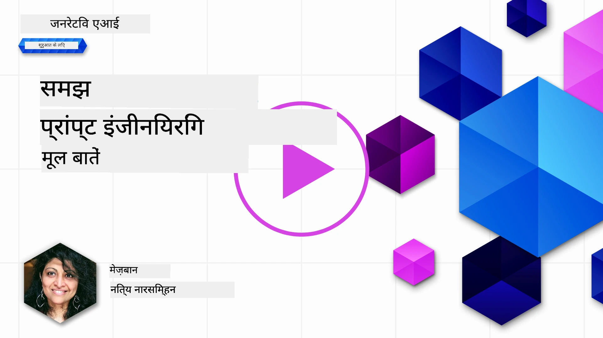
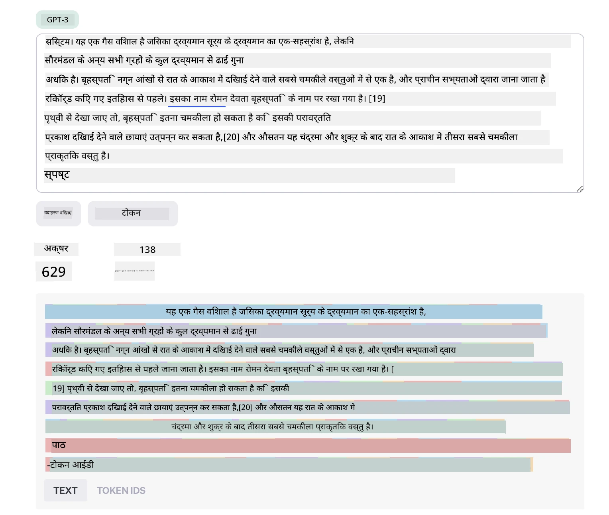
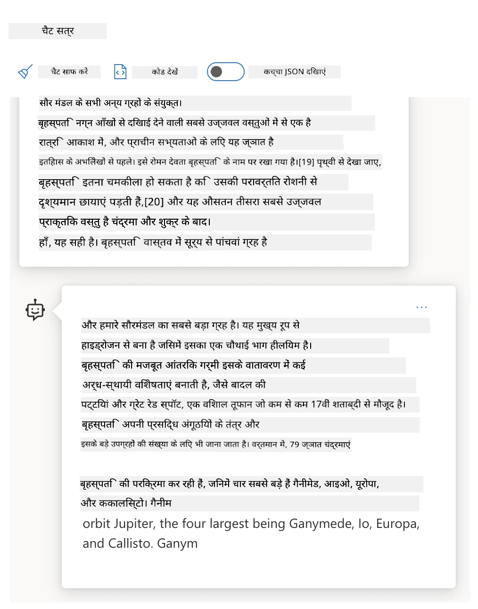
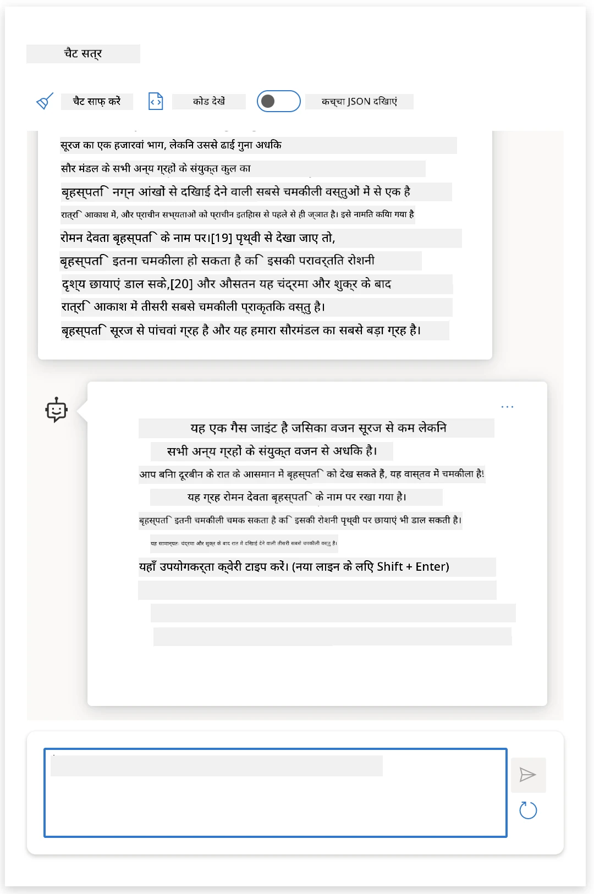
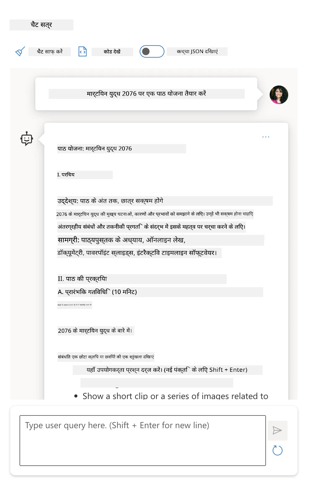

# प्रॉम्प्ट इंजीनियरिंग के मूल सिद्धांत

[](https://youtu.be/GElCu2kUlRs?si=qrXsBvXnCW12epb8)

## परिचय
यह मॉड्यूल जेनरेटिव AI मॉडलों में प्रभावी प्रॉम्प्ट बनाने के लिए आवश्यक अवधारणाओं और तकनीकों को कवर करता है। आप जिस प्रकार से LLM को प्रॉम्प्ट लिखते हैं, वह भी महत्वपूर्ण है। सावधानीपूर्वक तैयार किया गया प्रॉम्प्ट बेहतर गुणवत्ता वाली प्रतिक्रिया प्राप्त कर सकता है। लेकिन _प्रॉम्प्ट_ और _प्रॉम्प्ट इंजीनियरिंग_ जैसे शब्दों का असल अर्थ क्या है? और मैं LLM को भेजे जाने वाले प्रॉम्प्ट _इनपुट_ को कैसे सुधार सकता हूँ? ये प्रश्न हम इस अध्याय और अगले अध्याय में उत्तर पाने की कोशिश करेंगे।

_जेनरेटिव AI_ नए कंटेंट (जैसे, टेक्स्ट, छवियाँ, ऑडियो, कोड आदि) यूज़र के अनुरोधों के अनुसार बनाने में सक्षम है। यह _लार्ज लैंग्वेज मॉडल_ (LLMs) जैसे OpenAI के GPT ("Generative Pre-trained Transformer") श्रृंखला का उपयोग करता है, जिन्हें प्राकृतिक भाषा और कोड के उपयोग के लिए प्रशिक्षित किया गया है।

उपयोगकर्ता अब तकनीकी विशेषज्ञता या प्रशिक्षण की आवश्यकता के बिना चैट जैसे परिचित विधानों का उपयोग करके इन मॉडलों के साथ बातचीत कर सकते हैं। ये मॉडल _प्रॉम्प्ट-आधारित_ हैं - उपयोगकर्ता एक टेक्स्ट इनपुट (प्रॉम्प्ट) भेजते हैं और AI प्रतिक्रिया (completion) प्राप्त करते हैं। वे फिर "AI के साथ बातचीत" को कई चरणों में दोहराते हुए अपने प्रॉम्प्ट को परिष्कृत करते हैं जब तक कि प्रतिक्रिया उनकी उम्मीदों के अनुरूप न हो।

"प्रॉम्प्ट" अब जेनरेटिव AI ऐप्स के लिए प्राथमिक _प्रोग्रामिंग इंटरफेस_ बन जाते हैं, जो मॉडल को निर्देश देते हैं कि क्या करना है और लौटाई गई प्रतिक्रियाओं की गुणवत्ता को प्रभावित करते हैं। "प्रॉम्प्ट इंजीनियरिंग" तेजी से बढ़ता हुआ अध्ययन क्षेत्र है जो प्रभावी और गुणवत्ता पूर्ण प्रतिक्रियाएं प्रदान करने के लिए प्रॉम्प्ट के _डिजाइन और अनुकूलन_ पर केंद्रित है।

## सीखने के लक्ष्य

इस पाठ में, हम सीखेंगे कि प्रॉम्प्ट इंजीनियरिंग क्या है, क्यों महत्वपूर्ण है, और हम एक दिए गए मॉडल और एप्लिकेशन उद्देश्य के लिए अधिक प्रभावी प्रॉम्प्ट कैसे बना सकते हैं। हम प्रॉम्प्ट इंजीनियरिंग की मूल अवधारणाओं और सर्वोत्तम प्रथाओं को समझेंगे - और एक इंटरैक्टिव जुपिटर नोटबुक "सैंडबॉक्स" वातावरण के बारे में जानेंगे जहाँ हम इन अवधारणाओं को वास्तविक उदाहरणों पर लागू होते देख सकते हैं।

इस पाठ के अंत तक हम सक्षम होंगे:

1. यह समझाना कि प्रॉम्प्ट इंजीनियरिंग क्या है और यह क्यों महत्वपूर्ण है।
2. प्रॉम्प्ट के घटकों का वर्णन करना और वे कैसे उपयोग होते हैं।
3. प्रॉम्प्ट इंजीनियरिंग के लिए सर्वोत्तम प्रथाओं और तकनीकों को सीखना।
4. एक OpenAI एंडपॉइंट का उपयोग करके सीखी गई तकनीकों को वास्तविक उदाहरणों पर लागू करना।

## मुख्य शब्दावली

प्रॉम्प्ट इंजीनियरिंग: AI मॉडलों को वांछित आउटपुट उत्पन्न करने के लिए निर्देशित करने हेतु इनपुट्स के डिज़ाइन और सुधार की प्रक्रिया।
टोकनाइज़ेशन: टेक्स्ट को छोटे इकाइयों, जिन्हें टोकन कहा जाता है, में बदलने की प्रक्रिया जिसे मॉडल समझ सकता है और प्रोसेस कर सकता है।
इंस्ट्रक्शन-ट्यूनड LLMs: लार्ज लैंग्वेज मॉडल जिन्हें विशिष्ट निर्देशों के साथ फाइन-ट्यून किया गया है ताकि उनकी प्रतिक्रिया की सटीकता और प्रासंगिकता में सुधार हो सके।

## सीखने का सैंडबॉक्स

वर्तमान में प्रॉम्प्ट इंजीनियरिंग अधिक कला है, विज्ञान से। इस पर अपनी समझ बढ़ाने का सबसे अच्छा तरीका है _ज्यादा अभ्यास_ करना और एक परीक्षण-और-त्रुटि दृष्टिकोण अपनाना जो एप्लिकेशन डोमेन विशेषज्ञता को अनुशंसित तकनीकों और मॉडल-विशिष्ट अनुकूलनों के साथ जोड़ता है।

इस पाठ के साथ साथ आने वाला जुपिटर नोटबुक एक _सैंडबॉक्स_ वातावरण प्रदान करता है, जहाँ आप जो सीखते हैं उसे आज़मा सकते हैं - पढ़ाई के दौरान या अंत में कोड चुनौती का हिस्सा के रूप में। अभ्यास करने के लिए, आपको चाहिए:

1. **एक Azure OpenAI API कुंजी** - एक तैनात LLM के सेवा अंतबिंदु के लिए।
2. **एक पायथन रनटाइम** - जिसमें नोटबुक को चलाया जा सके।
3. **स्थानीय पर्यावरण चर** - _अभी [SETUP](./../00-course-setup/02-setup-local.md?WT.mc_id=academic-105485-koreyst) चरण पूरा करें ताकि तैयारी हो सके_।

नोटबुक के साथ _शुरुआती_ अभ्यास आते हैं - पर आप अपने स्वयं के _मार्कडाउन_ (विवरण) और _कोड_ (प्रॉम्प्ट अनुरोध) सेक्शन भी जोड़ने के लिए प्रोत्साहित हैं ताकि अधिक उदाहरणों या विचारों को आज़मा सकें - और प्रॉम्प्ट डिज़ाइन के लिए अपनी अंतर्दृष्टि बना सकें।

## चित्रित मार्गदर्शिका

इस पाठ को शुरू करने से पहले आप कुल चित्र लेना चाहते हैं? इस चित्रित मार्गदर्शिका को देखें, जो मुख्य विषयों और आपके लिए सोचने के लिए प्रमुख बिंदुओं का संक्षेप देती है। पाठ रोडमैप आपको मुख्य अवधारणाओं और चुनौतियों को समझने से लेकर संबंधित प्रॉम्प्ट इंजीनियरिंग तकनीकों और सर्वोत्तम प्रथाओं के साथ इन्हें संबोधित करने तक ले जाता है। ध्यान दें कि इस मार्गदर्शिका में "उन्नत तकनीकें" अनुभाग इस पाठ्यक्रम के _ अगले _ अध्याय का संदर्भ देता है।


## हमारी स्टार्टअप

अब, आइए बात करें कि _यह विषय_ हमारी स्टार्टअप मिशन [शिक्षा में AI नवाचार लाने](https://educationblog.microsoft.com/2023/06/collaborating-to-bring-ai-innovation-to-education?WT.mc_id=academic-105485-koreyst) से कैसे जुड़ता है। हम _व्यक्तिगत शिक्षण_ के AI-संचालित अनुप्रयोग बनाना चाहते हैं - तो चलिए सोचते हैं कि हमारे एप्लिकेशन के विभिन्न उपयोगकर्ता प्रॉम्प्ट कैसे "डिज़ाइन" कर सकते हैं:

- **प्रशासक** AI से _पाठ्यक्रम डेटा का विश्लेषण करके कवरेज में अंतराल की पहचान_ करने को कह सकते हैं। AI परिणामों का सारांश बना सकता है या कोड के साथ उन्हें विज़ुअलाइज़ कर सकता है।
- **शिक्षक** AI से _लक्षित दर्शकों और विषय के लिए पाठ योजना जनरेट_ करने को कह सकते हैं। AI निर्दिष्ट प्रारूप में व्यक्तिगत योजना बना सकता है।
- **छात्र** AI से _एक कठिन विषय में ट्यूशन_ करवाने को कह सकते हैं। AI अब छात्रों को उनके स्तर के अनुसार पाठ, सुझावों और उदाहरणों के साथ मार्गदर्शन कर सकता है।

यह तो बस शुरुआत है। [Prompts For Education](https://github.com/microsoft/prompts-for-edu/tree/main?WT.mc_id=academic-105485-koreyst) - एक खुले स्रोत की प्रॉम्प्ट लाइब्रेरी जिसे शिक्षा विशेषज्ञों ने तैयार किया है - देखें ताकि संभावनाओं का व्यापक आभास हो सके! _इन प्रॉम्प्ट्स को सैंडबॉक्स में या OpenAI Playground में चलाकर देखें कि क्या होता है!_

<!--
LESSON TEMPLATE:
यह इकाई मुख्य अवधारणा #1 को कवर करनी चाहिए।
उदाहरणों और संदर्भों से अवधारणा को मजबूत करें।

अवधारणा #1:
प्रॉम्प्ट इंजीनियरिंग।
इसे परिभाषित करें और बताएं कि इसकी आवश्यकता क्यों है।
-->

## प्रॉम्प्ट इंजीनियरिंग क्या है?

हमने इस पाठ की शुरुआत में **प्रॉम्प्ट इंजीनियरिंग** को एक प्रक्रिया के रूप में परिभाषित किया, जिसमें एक एप्लिकेशन उद्देश्य और मॉडल के लिए सुसंगत और गुणवत्ता पूर्ण प्रतिक्रियाएं (completion) प्राप्त करने के लिए टेक्स्ट इनपुट (प्रॉम्प्ट) को _डिज़ाइन और अनुकूलित_ किया जाता है। हम इसे दो-चरणीय प्रक्रिया के रूप में सोच सकते हैं:

- एक मॉडल और उद्देश्य के लिए प्रारंभिक प्रॉम्प्ट का _डिज़ाइन_ करना
- प्रतिक्रिया की गुणवत्ता में सुधार के लिए प्रॉम्प्ट को क्रमिक रूप से _परिष्कृत_ करना

यह आवश्यक रूप से एक परीक्षण-और-त्रुटि प्रक्रिया है जिसे उपयोगकर्ता की अंतर्दृष्टि और प्रयास की आवश्यकता होती है ताकि उत्तम परिणाम मिल सकें। तो यह महत्वपूर्ण क्यों है? इस प्रश्न का उत्तर देने के लिए, पहले हमें तीन अवधारणाओं को समझना होगा:

- _टोकनाइज़ेशन_ = मॉडल प्रॉम्प्ट को कैसे "देखता" है
- _बेस LLMs_ = आधार मॉडल प्रॉम्प्ट को कैसे "प्रोसेस" करता है
- _इंस्ट्रक्शन-ट्यूनड LLMs_ = मॉडल अब "कार्य" कैसे देख सकता है

### टोकनाइज़ेशन

एक LLM प्रॉम्प्ट को _टोकनों के अनुक्रम_ के रूप में देखता है जहाँ विभिन्न मॉडल (या एक ही मॉडल के संस्करण) एक ही प्रॉम्प्ट को विभिन्न तरीकों से टोकनाइज़ कर सकते हैं। क्योंकि LLMs टोकनों (कच्चे टेक्स्ट नहीं) पर प्रशिक्षित होते हैं, प्रॉम्प्ट के टोकनाइज़ेशन का तरीके का सीधे उत्पन्न प्रतिक्रिया की गुणवत्ता पर प्रभाव पड़ता है।

टोकनाइज़ेशन कैसे काम करता है, यह समझने के लिए, [OpenAI Tokenizer](https://platform.openai.com/tokenizer?WT.mc_id=academic-105485-koreyst) जैसे उपकरणों का उपयोग करें। अपना प्रॉम्प्ट कॉपी करें - और देखें कि वह टोकनों में कैसे परिवर्तित होता है, खासकर ध्यान दें कि खाली स्थान और विराम चिह्न कैसे संभाले जाते हैं। ध्यान दें कि यह उदाहरण पुराने LLM (GPT-3) का है - इसलिए नए मॉडल के साथ कोशिश करने पर परिणाम भिन्न हो सकते हैं।



### अवधारणा: फाउंडेशन मॉडल्स

एक बार जब प्रॉम्प्ट को टोकनाइज़ कर दिया जाता है, तो ["बेस LLM"](https://blog.gopenai.com/an-introduction-to-base-and-instruction-tuned-large-language-models-8de102c785a6?WT.mc_id=academic-105485-koreyst) (या फाउंडेशन मॉडल) का प्रमुख कार्य उस अनुक्रम में अगला टोकन भविष्यवाणी करना होता है। क्योंकि LLMs विशाल टेक्स्ट डेटासेट्स पर प्रशिक्षित होते हैं, उनके पास टोकनों के बीच सांख्यिकीय संबंधों का अच्छा ज्ञान होता है और वे उस भविष्यवाणी को कुछ हद तक आत्मविश्वास के साथ कर सकते हैं। याद रखें कि वे प्रॉम्प्ट या टोकन में शब्दों का _अर्थ_ नहीं समझते; वे केवल एक पैटर्न देखते हैं जिसे वे अपने अगले भविष्यवाणी से "पूरा" कर सकते हैं। वे तब तक अनुक्रम की भविष्यवाणी जारी रख सकते हैं जब तक उपयोगकर्ता हस्तक्षेप या कोई पूर्वनिर्धारित स्थिति उन्हें रोक न दे।

आप प्रॉम्प्ट-आधारित पूर्णता कैसे काम करती है, देखना चाहते हैं? ऊपर दिया गया प्रॉम्प्ट [Microsoft Foundry playground](https://ai.azure.com?WT.mc_id=academic-105485-koreyst) में डिफ़ॉल्ट सेटिंग्स के साथ डालें। सिस्टम प्रॉम्प्ट्स को सूचना के अनुरोध के रूप में व्यवहार करता है - इसलिए आपको एक ऐसी पूर्णता दिखनी चाहिए जो इस संदर्भ को संतुष्ट करे।

लेकिन अगर उपयोगकर्ता कुछ विशिष्ट देखना चाहता था जो किसी मानदंड या कार्य उद्देश्य को पूरा करता हो? तब _इंस्ट्रक्शन-ट्यूनड_ LLMs की भूमिका आती है।



### अवधारणा: इंस्ट्रक्शन ट्यूनड LLMs

एक [इंस्ट्रक्शन ट्यूनड LLM](https://blog.gopenai.com/an-introduction-to-base-and-instruction-tuned-large-language-models-8de102c785a6?WT.mc_id=academic-105485-koreyst) फाउंडेशन मॉडल से शुरू होता है और इसे उदाहरणों या इनपुट/आउटपुट जोड़ों (जैसे, कई चरणों वाले "संदेश") के साथ फाइन-ट्यून करता है जिनमें स्पष्ट निर्देश हो सकते हैं - और AI की प्रतिक्रिया उस निर्देश का पालन करने का प्रयास करती है।

यह तकनीकों का उपयोग करता है जैसे कि मानव प्रतिक्रिया के साथ रिइंफोर्समेंट लर्निंग (RLHF) जो मॉडल को _निर्देशों का पालन_ करने और _प्रतिक्रिया से सीखने_ के लिए प्रशिक्षित कर सकता है ताकि वह ऐसे उत्तर दे जो व्यावहारिक अनुप्रयोगों के लिए बेहतर और उपयोगकर्ता उद्देश्यों के लिए अधिक प्रासंगिक हों।

चलिए इसे आज़माते हैं - ऊपर दिए प्रॉम्प्ट पर वापस जाएं, लेकिन अब _सिस्टम संदेश_ को निम्न निर्देश के रूप में संदर्भित करें:

> _जो सामग्री आपको दी गई है उसका सारांश द्वितीय कक्षा के छात्र के लिए बनाएं। परिणाम को एक पैराग्राफ में 3-5 बुलेट पॉइंट्स तक सीमित रखें।_

देखें कि परिणाम अब वांछित लक्ष्य और प्रारूप के अनुरूप हो गया है? एक शिक्षक अब इस प्रतिक्रिया को सीधे अपनी कक्षा की स्लाइड्स में उपयोग कर सकता है।



## हमें प्रॉम्प्ट इंजीनियरिंग क्यों चाहिए?

अब जबकि हम जानते हैं कि LLMs प्रॉम्प्ट्स को कैसे प्रोसेस करते हैं, आइए बात करें कि हमें प्रॉम्प्ट इंजीनियरिंग की आवश्यकता _क्यों_ है। इसका जवाब इस तथ्य में निहित है कि वर्तमान LLMs कई चुनौतियां पेश करते हैं जो _विश्वसनीय और सुसंगत पूर्णताएँ_ प्राप्त करना बिना प्रॉम्प्ट निर्माण और अनुकूलन में प्रयास के अधिक चुनौतीपूर्ण बना देती हैं। उदाहरण के लिए:

1. **मॉडल प्रतिक्रियाएं स्टोकेस्टिक होती हैं।** _वही प्रॉम्प्ट_ विभिन्न मॉडल या मॉडल संस्करणों के साथ अलग-अलग प्रतिक्रियाएं दे सकता है। और यह संभव है कि _वही मॉडल_ अलग समय पर भी विभिन्न परिणाम दे। _प्रॉम्प्ट इंजीनियरिंग तकनीकें इन विविधताओं को न्यूनतम करने में मदद कर सकती हैं बेहतर गार्डरेल्स प्रदान करके_।

1. **मॉडल प्रतिक्रियाएं कल्पित कर सकते हैं।** मॉडल _बड़े लेकिन सिमित_ डेटासेट पर प्री-ट्रेन होते हैं, जिसका मतलब है कि उनके पास उस प्रशिक्षण सीमा के बाहर के अवधारणाओं का ज्ञान नहीं होता। नतीजतन, वे ऐसी पूर्णताएं उत्पन्न कर सकते हैं जो गलत, काल्पनिक, या ज्ञात तथ्यों के विपरीत हों। _प्रॉम्प्ट इंजीनियरिंग तकनीकें उपयोगकर्ताओं को ऐसी कल्पनाओं की पहचान करने और उन्हें कम करने में मदद करती हैं, जैसे कि AI से संदर्भ या तर्क मांगा जाना_।

1. **मॉडल क्षमताएँ अलग-अलग होती हैं।** नए मॉडल या मॉडल पीढ़ियां अधिक क्षमताएँ लेकर आती हैं लेकिन लागत और जटिलता में भी विशेषताएं और समझौतों के साथ। _प्रॉम्प्ट इंजीनियरिंग हमें सर्वोत्तम प्रथाओं और वर्कफ़्लो विकसित करने में मदद कर सकती है जो इन भिन्नताओं को abstracts करती हैं और मॉडल-विशिष्ट आवश्यकताओं के अनुसार अनुकूलित होती हैं, वह भी स्केलेबल और सहज तरीकों से_।

आइए देखें कि OpenAI या Azure OpenAI Playground में इसे कैसे लागू करें:

- एक ही प्रॉम्प्ट का उपयोग विभिन्न LLM तैनातियों (जैसे, OpenAI, Azure OpenAI, Hugging Face) के साथ करें - क्या आपने अंतर देखे?
- एक ही प्रॉम्प्ट को _वही_ LLM तैनाती (जैसे, Azure OpenAI playground) के साथ बार-बार उपयोग करें - ये अंतर कैसे भिन्न थे?

### कल्पनाएँ उदाहरण

इस पाठ्यक्रम में, हम शब्द **"कल्पना"** का उपयोग इस घटना के लिए करते हैं जहाँ LLMs कभी-कभी अपने प्रशिक्षण या अन्य प्रतिबंधों के कारण तथ्यगत रूप से गलत जानकारी उत्पन्न करते हैं। आपने अक्सर इसे लोकप्रिय लेखों या शोधपत्रों में _"हेलुसिनेशन"_ के रूप में भी सुना होगा। हालांकि, हम ज़ोर देते हैं कि _"कल्पना"_ शब्द का उपयोग किया जाए ताकि हम आकस्मिक रूप से इस व्यवहार को मानव जैसा गुण न दें। यह [रिस्पॉन्सिबल AI गाइडलाइंस](https://www.microsoft.com/ai/responsible-ai?WT.mc_id=academic-105485-koreyst) की भी पुष्टि करता है, जो ऐसे शब्द हटाता है जो कुछ संदर्भों में आपत्तिजनक या गैर-समावेशी माने जा सकते हैं।

कल्पनाओं का अंदाजा लगाने के लिए, उस प्रॉम्प्ट के बारे में सोचें जो AI को एक गैर-मौजूद विषय पर सामग्री उत्पन्न करने के लिए निर्देशित करता है (ताकि यह सुनिश्चित हो कि वह प्रशिक्षण डेटासेट में नहीं है)। उदाहरण के लिए - मैंने यह प्रॉम्प्ट आज़माया:

> **प्रॉम्प्ट:** मार्टियन युद्ध 2076 पर एक पाठ योजना बनाएं।

एक वेब खोज से पता चला कि मार्टियन युद्धों पर काल्पनिक विवरण (जैसे, टीवी शो या पुस्तकें) थे - लेकिन 2076 में नहीं। सामान्य ज्ञान भी बताता है कि 2076 _भविष्य_ में है और इसलिए इसे किसी वास्तविक घटना से जोड़ा नहीं जा सकता।


तो जब हम इस प्रॉम्प्ट को विभिन्न LLM प्रदाताओं के साथ चलाते हैं तो क्या होता है?

> **प्रतिक्रिया 1**: OpenAI Playground (GPT-35)


> **प्रतिक्रिया 2**: Azure OpenAI Playground (GPT-35)



> **प्रतिक्रिया 3**: : Hugging Face Chat Playground (LLama-2)


जैसा कि अपेक्षित था, प्रत्येक मॉडल (या मॉडल संस्करण) यादृच्छिक व्यवहार और मॉडल क्षमता भिन्नताओं के कारण थोड़ा अलग प्रतिक्रियाएँ उत्पन्न करता है। उदाहरण के लिए, एक मॉडल 8वीं कक्षा के दर्शकों को लक्षित करता है जबकि दूसरा एक हाई-स्कूल छात्र मानता है। लेकिन सभी तीनों मॉडलों ने ऐसी प्रतिक्रियाएँ बनाईं जो एक अनजान उपयोगकर्ता को यह विश्वास दिला सकती थीं कि घटना वास्तविक थी।

प्रॉम्प्ट इंजीनियरिंग तकनीकें जैसे _मेटा प्रॉम्प्टिंग_ और _टेम्परेचर कॉन्फिगरेशन_ कुछ हद तक मॉडल की गढ़ना को कम कर सकती हैं। नए प्रॉम्प्ट इंजीनियरिंग _आर्किटेक्चर_ भी नए उपकरणों और तकनीकों को सहजता से प्रॉम्प्ट प्रवाह में शामिल करते हैं, ताकि इन प्रभावों को कम किया जा सके या रोकथाम की जा सके।

## केस स्टडी: GitHub Copilot

आइए इस अनुभाग को समेटते हैं कि वास्तविक दुनिया के समाधानों में प्रॉम्प्ट इंजीनियरिंग कैसे उपयोग की जाती है, एक केस स्टडी देखकर: [GitHub Copilot](https://github.com/features/copilot?WT.mc_id=academic-105485-koreyst)।

GitHub Copilot आपका "AI जोड़ी कार्यक्रमकर्ता" है - यह टेक्स्ट प्रॉम्प्ट को कोड पूर्णताओं में बदलता है और आपके विकास वातावरण (जैसे, Visual Studio Code) में एक सहज उपयोगकर्ता अनुभव के लिए एकीकृत है। नीचे दी गई ब्लॉग श्रृंखला में वर्णित, सबसे प्रारंभिक संस्करण OpenAI Codex मॉडल पर आधारित था - जिसमें इंजीनियरों ने जल्दी से महसूस किया कि मॉडल को सही करने और बेहतर प्रॉम्प्ट इंजीनियरिंग तकनीकों का विकास करने की आवश्यकता है, ताकि कोड गुणवत्ता सुधारी जा सके। जुलाई में, उन्होंने [Codex से परे बेहतर AI मॉडल पेश किया](https://github.blog/2023-07-28-smarter-more-efficient-coding-github-copilot-goes-beyond-codex-with-improved-ai-model/?WT.mc_id=academic-105485-koreyst) जो और भी तेज सुझाव देता है।

उनकी सीखने की यात्रा को समझने के लिए पोस्ट को क्रम में पढ़ें।

- **मई 2023** | [GitHub Copilot आपकी कोडिंग को बेहतर समझ रहा है](https://github.blog/2023-05-17-how-github-copilot-is-getting-better-at-understanding-your-code/?WT.mc_id=academic-105485-koreyst)
- **मई 2023** | [GitHub के अंदर: GitHub Copilot के पीछे LLMs के साथ काम करना](https://github.blog/2023-05-17-inside-github-working-with-the-llms-behind-github-copilot/?WT.mc_id=academic-105485-koreyst).
- **जून 2023** | [GitHub Copilot के लिए बेहतर प्रॉम्प्ट कैसे लिखें](https://github.blog/2023-06-20-how-to-write-better-prompts-for-github-copilot/?WT.mc_id=academic-105485-koreyst).
- **जुलाई 2023** | [.. GitHub Copilot Codex से परे बेहतर AI मॉडल के साथ](https://github.blog/2023-07-28-smarter-more-efficient-coding-github-copilot-goes-beyond-codex-with-improved-ai-model/?WT.mc_id=academic-105485-koreyst)
- **जुलाई 2023** | [डेवलपर का गाइड: प्रॉम्प्ट इंजीनियरिंग और LLMs](https://github.blog/2023-07-17-prompt-engineering-guide-generative-ai-llms/?WT.mc_id=academic-105485-koreyst)
- **सितंबर 2023** | [एंटरप्राइज़ LLM ऐप कैसे बनाएं: GitHub Copilot से सबक](https://github.blog/2023-09-06-how-to-build-an-enterprise-llm-application-lessons-from-github-copilot/?WT.mc_id=academic-105485-koreyst)

आप उनकी [इंजीनियरिंग ब्लॉग](https://github.blog/category/engineering/?WT.mc_id=academic-105485-koreyst) भी देख सकते हैं, जहाँ और पोस्ट जैसे [यहाँ](https://github.blog/2023-09-27-how-i-used-github-copilot-chat-to-build-a-reactjs-gallery-prototype/?WT.mc_id=academic-105485-koreyst) प्रदर्शित हैं जो दिखाते हैं कि ये मॉडल और तकनीकें वास्तविक दुनिया के अनुप्रयोगों को चलाने के लिए कैसे _लागू_ होती हैं।

---

<!--
LESSON TEMPLATE:
यह यूनिट मुख्य अवधारणा #2 को कवर करनी चाहिए।
अवधारणा को उदाहरणों और संदर्भों के साथ मजबूत करें।

अवधारणा #2:
प्रॉम्प्ट डिज़ाइन।
उदाहरणों के साथ चित्रित।
-->

## प्रॉम्प्ट निर्माण

हमने देखा है कि प्रॉम्प्ट इंजीनियरिंग क्यों महत्वपूर्ण है - अब समझते हैं कि प्रॉम्प्ट कैसे _निर्मित_ होते हैं ताकि हम अधिक प्रभावी प्रॉम्प्ट डिज़ाइन के लिए विभिन्न तकनीकों का मूल्यांकन कर सकें।

### बुनियादी प्रॉम्प्ट

चलिए बुनियादी प्रॉम्प्ट से शुरू करते हैं: एक टेक्स्ट इनपुट जो मॉडल को बिना किसी अतिरिक्त संदर्भ के भेजा जाता है। यहाँ एक उदाहरण है - जब हम अमेरिकी राष्ट्रीय गीत के पहले कुछ शब्द OpenAI [Completion API](https://platform.openai.com/docs/api-reference/completions?WT.mc_id=academic-105485-koreyst) को भेजते हैं, यह तुरंत अगले कुछ पंक्तियों के साथ प्रतिक्रिया _पूरा_ कर देता है, जो बुनियादी भविष्यवाणी व्यवहार को दर्शाता है।

| प्रॉम्प्ट (इनपुट)     | पूरा करना (आउटपुट)                                                                                                                         |
| :----------------- | :--------------------------------------------------------------------------------------------------------------------------------------- |
| ओह, क्या तुम देख सकते हो | ऐसा लगता है कि आप "The Star-Spangled Banner," जो संयुक्त राज्य का राष्ट्रीय गीत है, के बोल शुरू कर रहे हैं। पूरे गीत के बोल हैं ... |

### जटिल प्रॉम्प्ट

अब आइए उस बुनियादी प्रॉम्प्ट में संदर्भ और निर्देश जोड़ें। [Chat Completion API](https://learn.microsoft.com/azure/ai-foundry/openai/how-to/chatgpt?WT.mc_id=academic-105485-koreyst) हमें प्रॉम्प्ट को एक संग्रह के रूप में जटिल प्रॉम्प्ट बनाने की अनुमति देता है जिसमें _संदेश_ होते हैं:

- इनपुट/आउटपुट जोड़े जो _उपयोगकर्ता_ इनपुट और _सहायक_ प्रतिक्रिया को दर्शाते हैं।
- सहायक के व्यवहार या व्यक्तित्व के लिए संदर्भ सेट करने वाला सिस्टम संदेश।

अनुरोध अब नीचे दिए गए रूप में है, जहाँ _टोकनकरण_ प्रभावी ढंग से संदर्भ और बातचीत से संबंधित जानकारी पकड़ता है। अब, सिस्टम संदर्भ बदलना पूर्णताओं की गुणवत्ता पर उतना ही प्रभावशाली हो सकता है, जितना कि उपयोगकर्ता द्वारा प्रदान किया गया इनपुट।

```python
response = client.responses.create(
    model="gpt-5-mini",
    input=[
        {"role": "system", "content": "You are a helpful assistant."},
        {"role": "user", "content": "Who won the world series in 2020?"},
        {"role": "assistant", "content": "The Los Angeles Dodgers won the World Series in 2020."},
        {"role": "user", "content": "Where was it played?"}
    ]
)
```

### निर्देश प्रॉम्प्ट

ऊपर के उदाहरणों में, उपयोगकर्ता प्रॉम्प्ट एक सरल टेक्स्ट क्वेरी था जिसे सूचना के लिए अनुरोध के रूप में समझा जा सकता है। _निर्देश_ प्रॉम्प्ट के साथ, हम उस टेक्स्ट का उपयोग करके AI को बेहतर मार्गदर्शन देने के लिए किसी कार्य को अधिक विस्तार से निर्दिष्ट कर सकते हैं। यहाँ एक उदाहरण है:

| प्रॉम्प्ट (इनपुट)                                                                                                                                                                                                                         | पूरा करना (आउटपुट)                                                                                                        | निर्देश प्रकार    |
| :------------------------------------------------------------------------------------------------------------------------------------------------------------------------------------------------------------------------------------- | :------------------------------------------------------------------------------------------------------------------------- | :------------------ |
| सिविल वार का विवरण लिखें                                                                                                                                                                                                   | _एक सरल पैराग्राफ लौटा_                                                                                              | सरल              |
| सिविल वार का विवरण लिखें। प्रमुख तिथियाँ और घटनाएँ प्रदान करें और उनके महत्व का वर्णन करें                                                                                                                                     | _एक पैराग्राफ और उसके बाद प्रमुख घटनाओं की तिथियों के साथ सूची लौटी_                                             | जटिल             |
| सिविल वार का विवरण 1 पैराग्राफ में लिखें। प्रमुख तिथियाँ और उनके महत्व के साथ 3 बुलेट पॉइंट प्रदान करें। प्रमुख ऐतिहासिक व्यक्तित्वों और उनके योगदान के साथ 3 और बुलेट पॉइंट प्रदान करें। आउटपुट को JSON फ़ाइल के रूप में लौटाएं | _JSON के रूप में अधिक विस्तार से विवरण लौटाता है जिसे आप कॉपी-पेस्ट करके फ़ाइल में वैलिडेट कर सकते हैं_ | जटिल। स्वरूपित। |

## प्राथमिक सामग्री

ऊपर के उदाहरणों में, प्रॉम्प्ट अभी भी काफी खुला था, जिससे LLM यह तय कर सकता था कि उसका प्री-ट्रेंड डेटासेट का कौन सा हिस्सा प्रासंगिक है। _प्राथमिक सामग्री_ डिज़ाइन पैटर्न के साथ, इनपुट टेक्स्ट को दो भागों में विभाजित किया जाता है:

- एक निर्देश (कार्रवाई)
- प्रासंगिक सामग्री (जो कार्रवाई को प्रभावित करती है)

यहाँ एक उदाहरण है जहाँ निर्देश है "इसे 2 वाक्यों में सारांशित करें"।

| प्रॉम्प्ट (इनपुट)                                                                                                                                                                                                                                                                                                                                                                                                                                                                                                                                                                                                                                                                                      | पूरा करना (आउटपुट)                                                                                                                                                                                                                                                                             |
| :-------------------------------------------------------------------------------------------------------------------------------------------------------------------------------------------------------------------------------------------------------------------------------------------------------------------------------------------------------------------------------------------------------------------------------------------------------------------------------------------------------------------------------------------------------------------------------------------------------------------------------------------------------------------------------------------------- | :---------------------------------------------------------------------------------------------------------------------------------------------------------------------------------------------------------------------------------------------------------------------------------------------- |
| बृहस्पति सूर्य से पाँचवाँ ग्रह है और सौरमंडल में सबसे बड़ा है। यह एक गैस दानव है जिसकी द्रव्यमान सूर्य के द्रव्यमान का एक-हजारवां हिस्सा है, लेकिन सौरमंडल के अन्य सभी ग्रहों के संयुक्त द्रव्यमान से ढाई गुना है। बृहस्पति नग्न आंखों से दिखाई देने वाली सबसे चमकदार वस्तुओं में से एक है, और प्राचीन सभ्यताओं से ज्ञात है। इसका नाम रोमन देवता बृहस्पति के नाम पर है।[19] पृथ्वी से देखने पर, बृहस्पति इतना चमकीला हो सकता है कि इसकी परावर्तित रोशनी से छाया दिखाई दे सकती है,[20] और औसतन यह चाँद और शुक्र के बाद रात के आकाश की तीसरी सबसे चमकदार प्राकृतिक वस्तु है। <br/> **इसे 2 छोटे वाक्यों में सारांशित करें** | बृहस्पति, सूर्य से पाँचवाँ ग्रह, सौरमंडल में सबसे बड़ा है और रात के आकाश में सबसे चमकदार वस्तुओं में से एक के रूप में जाना जाता है। रोमन देवता बृहस्पति के नाम पर रखा गया, यह एक गैस दानव है जिसकी द्रव्यमान सौरमंडल के अन्य सभी ग्रहों के संयुक्त द्रव्यमान से ढाई गुना है। |

प्राथमिक सामग्री खंड का उपयोग प्रभावी निर्देश देने के लिए विभिन्न तरीकों से किया जा सकता है:

- **उदाहरण** - मॉडल को स्पष्ट निर्देश देने के बजाय, इसे क्या करना है के उदाहरण दें और मॉडल पैटर्न समझने की अनुमति दें।
- **संकेत** - एक "संकेत" के साथ निर्देश का पालन करें जो पूर्णता को प्राइम करता है, और मॉडल को अधिक प्रासंगिक प्रतिक्रियाओं की ओर मार्गदर्शन करता है।
- **टेम्पलेट** - ये पुनरावृत्त 'रेसिपी' प्रॉम्प्ट के लिए हैं जिनमें प्लेसहोल्डर (वैरिएबल) होते हैं जिन्हें विशिष्ट उपयोग मामलों के लिए डेटा से अनुकूलित किया जा सकता है।

आइए इन्हें क्रियान्वयन में देखें।

### उदाहरणों का उपयोग

यह एक ऐसी विधि है जिसमें आप प्राथमिक सामग्री का उपयोग करके एक दिए गए निर्देश के लिए वांछित आउटपुट के कुछ उदाहरण "मॉडल को खिलाते" हैं, और इसे वांछित आउटपुट के पैटर्न का अनुमान लगाने देते हैं। प्रदान किए गए उदाहरणों की संख्या के आधार पर हमारे पास ज़ीरो-शॉट प्रॉम्प्टिंग, वन-शॉट प्रॉम्प्टिंग, फ्यू-शॉट प्रॉम्प्टिंग आदि हो सकते हैं।

अब प्रॉम्प्ट में तीन घटक होते हैं:

- एक कार्य विवरण
- वांछित आउटपुट के कुछ उदाहरण
- एक नए उदाहरण की शुरुआत (जो एक निहित कार्य विवरण बन जाता है)

| सीखने का प्रकार | प्रॉम्प्ट (इनपुट)                                                                                                                                        | पूरा करना (आउटपुट)         |
| :------------ | :---------------------------------------------------------------------------------------------------------------------------------------------------- | :-------------------------- |
| ज़ीरो-शॉट     | "The Sun is Shining". स्पेनिश में अनुवाद करें                                                                                                            | "El Sol está brillando".    |
| वन-शॉट      | "The Sun is Shining" => ""El Sol está brillando". <br> "It's a Cold and Windy Day" =>                                                                 | "Es un día frío y ventoso". |
| फ्यू-शॉट      | The player ran the bases => Baseball <br/> The player hit an ace => Tennis <br/> The player hit a six => Cricket <br/> The player made a slam-dunk => | Basketball                  |
|               |                                                                                                                                                       |                             |

ध्यान दें कि हमने ज़ीरो-शॉट प्रॉम्प्टिंग में स्पष्ट निर्देश ("स्पेनिश में अनुवाद करें") प्रदान किया था, लेकिन वन-शॉट प्रॉम्प्टिंग उदाहरण में यह अनुमानित हो जाता है। फ्यू-शॉट उदाहरण दिखाता है कि अधिक उदाहरण जोड़ने से मॉडल बिना अतिरिक्त निर्देश के अधिक सटीक अनुमान लगा सकते हैं।

### प्रॉम्प्ट संकेत

प्राथमिक सामग्री का उपयोग करने की एक और तकनीक है _संकेत_ प्रदान करना बजाय उदाहरणों के। इस मामले में, हम मॉडल को सही दिशा में एक नज़रिया देने के लिए प्रतिक्रिया स्वरूप की एक प्रारंभिक झलक प्रदान करते हैं। मॉडल फिर उस झलक को पकड़कर उसी अंदाज में जारी रखता है।

| संकेतों की संख्या | प्रॉम्प्ट (इनपुट)                                                                                                                                                                                                                                                                                                                                                                                                                                               | पूरा करना (आउटपुट)                                                                                                                                                                                                                                                                                       |
| :------------- | :----------------------------------------------------------------------------------------------------------------------------------------------------------------------------------------------------------------------------------------------------------------------------------------------------------------------------------------------------------------------------------------------------------------------------------------------------------- | :-------------------------------------------------------------------------------------------------------------------------------------------------------------------------------------------------------------------------------------------------------------------------------------------------------- |
| 0              | बृहस्पति सूर्य से पाँचवाँ ग्रह है और सौरमंडल में सबसे बड़ा है। यह एक गैस दानव है जिसकी द्रव्यमान सूर्य के द्रव्यमान का एक-हजारवां हिस्सा है, लेकिन सौरमंडल के अन्य सभी ग्रहों के संयुक्त द्रव्यमान से ढाई गुना है। बृहस्पति नग्न आंखों से दिखाई देने वाली सबसे चमकदार वस्तुओं में से एक है, और प्राचीन सभ्यताओं से ज्ञात है। <br/>**इसे सारांशित करें**                                       | बृहस्पति हमारे सौरमंडल का सबसे बड़ा ग्रह है और सूर्य से पाँचवाँ ग्रह है। यह एक गैस दानव है जिसकी द्रव्यमान सूर्य के एक-हजारवें हिस्से के बराबर है, लेकिन यह अन्य सभी ग्रहों से भारी है। प्राचीन सभ्यताओं से यह ज्ञात रहा है, और यह रात के आकाश में आसानी से दिखाई देता है। |
| 1              | बृहस्पति सूर्य से पाँचवाँ ग्रह है और सौरमंडल में सबसे बड़ा है। यह एक गैस दानव है जिसकी द्रव्यमान सूर्य के द्रव्यमान का एक-हजारवां हिस्सा है, लेकिन सौरमंडल के अन्य सभी ग्रहों के संयुक्त द्रव्यमान से ढाई गुना है। बृहस्पति नग्न आंखों से दिखाई देने वाली सबसे चमकदार वस्तुओं में से एक है, और प्राचीन सभ्यताओं से ज्ञात है। <br/>**इसे सारांशित करें** <br/> हमने जाना कि बृहस्पति | सूर्य से पाँचवाँ ग्रह है और सौरमंडल में सबसे बड़ा है। यह एक गैस दानव है जिसकी द्रव्यमान सूर्य के द्रव्यमान का एक-हजारवां हिस्सा है, लेकिन सौरमंडल के अन्य सभी ग्रहों से ढाई गुना है। यह नग्न आंखों से स्पष्ट दिखता है और प्राचीन काल से जाना जाता है।                        |

| 2              | बृहस्पति सूर्य से पाँचवा ग्रह है और सौर मंडल का सबसे बड़ा ग्रह है। यह एक गैस जायंट है जिसकी द्रव्यमान सूर्य के द्रव्यमान का एक हजारवां हिस्सा है, लेकिन सौर मंडल के सभी अन्य ग्रहों के द्रव्यमान का दो और आधा गुना है। बृहस्पति नग्न आंखों से दिखाई देने वाले सबसे चमकीले पिंडों में से एक है, और प्राचीन सभ्यताओं के लिए भी इतिहास दर्ज होने से पहले से जाना जाता है। <br/>**संक्षेप करें** <br/> हमने जो शीर्ष 3 तथ्य सीखे:         | 1. बृहस्पति सूर्य से पाँचवा ग्रह है और सौर मंडल का सबसे बड़ा ग्रह है। <br/> 2. यह एक गैस जायंट है जिसकी द्रव्यमान सूर्य के द्रव्यमान का एक हजारवां हिस्सा है...<br/> 3. बृहस्पति प्राचीन काल से नग्न आंखों से दिखाई देता रहा है ...                                                                       |
|                |                                                                                                                                                                                                                                                                                                                                                                                                                                                              |                                                                                                                                                                                                                                                                                                           |

### प्रॉम्प्ट टेम्पलेट्स

एक प्रॉम्प्ट टेम्पलेट एक _पूर्व-परिभाषित नुस्खा है_ जो आवश्यकतानुसार संग्रहीत और पुनः उपयोग किया जा सकता है, ताकि पैमाने पर अधिक सुसंगत उपयोगकर्ता अनुभव प्रदान किए जा सकें। इसके सबसे सरल रूप में, यह केवल प्रॉम्प्ट उदाहरणों का संग्रह है, जैसे [OpenAI का यह उदाहरण](https://cookbook.openai.com/examples/gpt4-1_prompting_guide?WT.mc_id=academic-105485-koreyst) जो इंटरैक्टिव प्रॉम्प्ट घटकों (उपयोगकर्ता और सिस्टम संदेश) और एपीआई-चालित अनुरोध प्रारूप दोनों को प्रदान करता है - पुनः उपयोग का समर्थन करने के लिए।

इसके अधिक जटिल रूप में जैसे [LangChain का यह उदाहरण](https://python.langchain.com/docs/concepts/prompt_templates/?WT.mc_id=academic-105485-koreyst) इसमें _प्लेसहोल्डर_ होते हैं जिन्हें विभिन्न स्रोतों (उपयोगकर्ता इनपुट, सिस्टम संदर्भ, बाहरी डेटा स्रोत आदि) से डेटा के साथ बदला जा सकता है ताकि गतिशील रूप से प्रॉम्प्ट बनाया जा सके। यह हमें पुन: उपयोग योग्य प्रॉम्प्ट का एक पुस्तकालय बनाने देता है जिसका उपयोग पैमाने पर **प्रोग्रामेटिक रूप से** सुसंगत उपयोगकर्ता अनुभव संचालित करने के लिए किया जा सकता है।

अंत में, टेम्पलेटों का असली मूल्य इस क्षमता में निहित है कि वे ऊर्ध्वाधर अनुप्रयोग डोमेन के लिए _प्रॉम्प्ट पुस्तकालय_ बनाने और प्रकाशित करने की अनुमति देते हैं - जहाँ प्रॉम्प्ट टेम्पलेट अब _संदर्भित_ किया गया है ताकि अनुप्रयोग-विशिष्ट संदर्भ या उदाहरण प्रतिबिंबित हों, जो लक्षित उपयोगकर्ता दर्शकों के लिए प्रतिक्रियाओं को अधिक प्रासंगिक और सटीक बनाते हैं। [Prompts For Edu](https://github.com/microsoft/prompts-for-edu?WT.mc_id=academic-105485-koreyst) रिपॉजिटरी इस दृष्टिकोण का एक बेहतरीन उदाहरण है, जो शिक्षा डोमेन के लिए प्रॉम्प्ट लाइब्रेरी का संग्रह करता है, जिसमें पाठ योजना, पाठ्यक्रम डिजाइन, छात्र ट्यूटरिंग आदि जैसे महत्वपूर्ण उद्देश्यों पर जोर दिया गया है।

## सहायक सामग्री

यदि हम प्रॉम्प्ट निर्माण को एक निर्देश (कार्य) और एक लक्ष्य (प्राथमिक सामग्री) के रूप में सोचें, तो _द्वितीयक सामग्री_ अतिरिक्त संदर्भ की तरह होती है जो हम आउटपुट को किसी तरह प्रभावित करने के लिए प्रदान करते हैं। यह ट्यूनिंग पैरामीटर, स्वरूपण निर्देश, विषय टैक्सोनॉमी आदि हो सकते हैं जो मॉडल को उसके जवाब को वांछित उपयोगकर्ता उद्देश्यों या अपेक्षाओं के अनुरूप ढालने में मदद करते हैं।

उदाहरण के लिए: एक पाठ्यक्रम कैटलॉग दिया गया है जिसमें पाठ्यक्रम के नाम, विवरण, स्तर, मेटाडेटा टैग, प्रशिक्षक आदि जैसे विस्तृत मेटाडेटा शामिल हैं:

- हम "पतझड़ 2023 के लिए पाठ्यक्रम कैटलॉग का सारांश बनाएं" निर्देश दे सकते हैं
- हम प्राथमिक सामग्री का उपयोग वांछित आउटपुट के कुछ उदाहरण प्रदान करने के लिए कर सकते हैं
- हम द्वितीयक सामग्री का उपयोग शीर्ष 5 "टैग" की पहचान करने के लिए कर सकते हैं।

अब, मॉडल कुछ उदाहरणों द्वारा दिखाए गए प्रारूप में सारांश प्रदान कर सकता है - पर यदि किसी परिणाम में कई टैग हों, तो यह द्वितीयक सामग्री में पहचाने गए 5 टैगों को प्राथमिकता दे सकता है।

---

<!--
पाठ योजना टेम्पलेट:
इस इकाई में मूल अवधारणा #1 शामिल होनी चाहिए।
उदाहरणों और संदर्भों के साथ अवधारणा को मजबूत करें।

अवधारणा #3:
प्रॉम्प्ट इंजीनियरिंग तकनीकें।
प्रॉम्प्ट इंजीनियरिंग के कुछ मूलभूत तकनीकें क्या हैं?
इसे कुछ अभ्यासों के साथ चित्रित करें।
-->

## प्रॉम्प्टिंग के सर्वोत्तम अभ्यास

अब जब हम जानते हैं कि प्रॉम्प्ट कैसे _निर्मित_ किया जाता है, तो हम सोच सकते हैं कि उन्हें सही _मनोवृत्ति_ और सही _तकनीकों_ के साथ कैसे _डिज़ाइन_ किया जाए ताकि सर्वोत्तम अभ्यास प्रतिबिंबित हों।

### प्रॉम्प्ट इंजीनियरिंग मनोवृत्ति

प्रॉम्प्ट इंजीनियरिंग एक परीक्षण-और-त्रुटि प्रक्रिया है इसलिए ध्यान में तीन व्यापक मार्गदर्शक कारक रखें:

1. **डोमेन समझ महत्वपूर्ण है।** प्रतिक्रिया की सटीकता और प्रासंगिकता उस _डोमेन_ का कार्य है जिसमें वह अनुप्रयोग या उपयोगकर्ता संचालित होता है। अपनी अंतर्दृष्टि और डोमेन विशेषज्ञता को लागू करें ताकि **तकनीकों को और अनुकूलित करें।** उदाहरण के लिए, अपने सिस्टम प्रॉम्प्ट में _डोमेन-विशिष्ट व्यक्तित्व_ परिभाषित करें, या अपने उपयोगकर्ता प्रॉम्प्ट में _डोमेन-विशिष्ट टेम्पलेट्स_ का उपयोग करें। द्वितीयक सामग्री प्रदान करें जो डोमेन-विशिष्ट संदर्भों को प्रतिबिंबित करती हो, या मॉडल को परिचित उपयोग पैटर्न की ओर मार्गदर्शित करने के लिए _डोमेन-विशिष्ट संकेत और उदाहरण_ का उपयोग करें।

2. **मॉडल समझ महत्वपूर्ण है।** हम जानते हैं कि मॉडल स्वाभाविक रूप से स्टोकास्टिक होते हैं। लेकिन मॉडल कार्यान्वयन प्री-ट्रेंडेड ज्ञान, उनके द्वारा उपलब्ध कराई गई क्षमताओं (जैसे API या SDK के माध्यम से) और वे किस प्रकार की सामग्री के लिए अनुकूलित हैं (जैसे कोड बनाम छवियाँ बनाम टेक्स्ट) के संदर्भ में भिन्न हो सकते हैं। आप जिस मॉडल का उपयोग कर रहे हैं उसकी ताकत और सीमाओं को समझें, और उस ज्ञान का उपयोग करके _कार्य प्राथमिकता दें_ या _कस्टम टेम्प्लेट_ बनाएं जो मॉडल की क्षमताओं के लिए अनुकूलित हों।

3. **पुनरावृत्ति और सत्यापन महत्वपूर्ण है।** मॉडल तेजी से विकसित हो रहे हैं, और प्रॉम्प्ट इंजीनियरिंग की तकनीकें भी। एक डोमेन विशेषज्ञ के रूप में, आप के पास अन्य संदर्भ या मापदंड हो सकते हैं जो आपके विशिष्ट अनुप्रयोग के लिए हैं, और जो व्यापक समुदाय पर लागू नहीं होते। प्रॉम्प्ट इंजीनियरिंग उपकरण और तकनीकों का उपयोग करें ताकि आप प्रॉम्प्ट निर्माण को "जंप स्टार्ट" कर सकें, फिर अपने स्वयं के अंतर्ज्ञान और डोमेन विशेषज्ञता का उपयोग करके पुनरावृत्त करें और परिणामों का सत्यापन करें। अपने अंतर्दृष्टि को रिकॉर्ड करें और एक **ज्ञान आधार** (जैसे, प्रॉम्प्ट लाइब्रेरी) बनाएं जो दूसरों द्वारा भविष्य में तेज पुनरावृत्तियों के लिए आधार के रूप में उपयोग किया जा सके।

## सर्वोत्तम अभ्यास

अब चलिए सामान्य सर्वोत्तम अभ्यासों को देखें जिन्हें [OpenAI](https://help.openai.com/en/articles/6654000-best-practices-for-prompt-engineering-with-openai-api?WT.mc_id=academic-105485-koreyst) और [Azure OpenAI](https://learn.microsoft.com/azure/ai-foundry/openai/concepts/prompt-engineering#best-practices?WT.mc_id=academic-105485-koreyst) विशेषज्ञों द्वारा अनुशंसित किया गया है।

| क्या                              | क्यों                                                                                                                                                                                                                                               |
| :-------------------------------- | :------------------------------------------------------------------------------------------------------------------------------------------------------------------------------------------------------------------------------------------------ |
| नवीनतम मॉडलों का मूल्यांकन करें।       | नए मॉडल पीढ़ियां बेहतर सुविधाएँ और गुणवत्ता प्रदान कर सकती हैं - लेकिन इनके अधिक लागत भी हो सकती है। प्रभाव के लिए उनका मूल्यांकन करें, फिर माइग्रेशन निर्णय लें।                                                                                |
| निर्देश और संदर्भ को अलग रखें।   | जांचें कि आपका मॉडल/प्रदाता निर्देशों, प्राथमिक और द्वितीयक सामग्री को अधिक स्पष्ट रूप से भेदित करने के लिए _डेलिमिटर्स_ परिभाषित करता है या नहीं। इससे मॉडल अधिक सटीक रूप में टोकन का भार आंड़ित कर सकता है।                                                         |
| विशिष्ट और स्पष्ट रहें             | वांछित संदर्भ, परिणाम, लंबाई, प्रारूप, शैली आदि के बारे में अधिक विवरण दें। इससे दोनों गुणवत्ता और प्रतिक्रियाओं की सुसंगतता में सुधार होगा। नुस्खे को पुन: उपयोग करने योग्य टेम्प्लेट में कैप्चर करें।                                                          |
| वर्णनात्मक रहें, उदाहरणों का उपयोग करें      | मॉडल संभवतः "दिखाओ और बताओ" दृष्टिकोण पर बेहतर प्रतिक्रिया देते हैं। पहले `ज़ीरो-शॉट` दृष्टिकोण से शुरू करें जहाँ आप इसे निर्देश देते हैं (लेकिन कोई उदाहरण नहीं) फिर सुधार के लिए `फ्यू-शॉट` प्रयास करें, वांछित आउटपुट के कुछ उदाहरण प्रदान करते हुए। उपमाएं उपयोग करें। |
| पूर्णता को प्रारंभ करने के लिए संकेतों का उपयोग करें | इसे वांछित परिणाम की ओर प्रेरित करें कुछ शुरुआती शब्द या वाक्यों को देकर जिसे यह जवाब के लिए प्रारंभिक बिंदु के रूप में उपयोग कर सके।                                                                                                               |
| दोहराएँ                        | कभी-कभी आपको मॉडल को दोहराना पड़ सकता है। अपने मुख्य कंटेंट से पहले और बाद में निर्देश दें, एक निर्देश और एक संकेत का उपयोग करें आदि। पुनरावृत्ति करें और देखें क्या काम करता है।                                                         |
| क्रम महत्वपूर्ण है              | जिस क्रम में आप मॉडल को सूचना प्रदान करते हैं वह आउटपुट को प्रभावित कर सकता है, यहाँ तक कि सीखने के उदाहरणों में भी, हालिया पूर्वाग्रह की वजह से। देखें कि कौन सा विकल्प सबसे अच्छा काम करता है।                                                               |
| मॉडल को एक “बाहर” दें           | मॉडल को एक _fallback_ पूर्णता प्रतिक्रिया दें जिसे यह दे सकता है यदि किसी कारणवश यह कार्य पूरा नहीं कर पाता। इससे मॉडल द्वारा गलत या आविष्कृत प्रतिक्रिया उत्पन्न करने की संभावना कम हो सकती है।                                                         |
|                                   |                                                                                                                                                                                                                                                   |

किसी भी सर्वोत्तम अभ्यास की तरह, याद रखें कि _आपका अनुभव मॉडल, कार्य और डोमेन पर निर्भर कर सकता है_। इन्हें एक प्रारंभिक बिंदु के रूप में उपयोग करें, और पुनरावृत्त करें ताकि आपको सबसे अच्छा क्या सूट करता है वह पता चल सके। नए मॉडलों और उपकरणों के उपलब्ध होते ही अपने प्रॉम्प्ट इंजीनियरिंग प्रक्रिया को लगातार पुनर्मूल्यांकन करें, प्रक्रिया के पैमाने और प्रतिक्रिया की गुणवत्ता पर ध्यान केंद्रित करते हुए।

<!--
पाठ योजना टेम्पलेट:
यदि लागू हो तो एक कोड चुनौती प्रदान करें

चुनौती:
उस Jupyter Notebook का लिंक जिसमें केवल कोड टिप्पणियां निर्देशों में हों (कोड सेक्शन खाली हों)।

समाधान:
उस नोटबुक की एक कॉपी का लिंक जिसमें प्रॉम्प्ट भरे गए हों और रन हो रहे हों, यह दिखाते हुए कि एक उदाहरण क्या हो सकता है।
-->

## असाइनमेंट

बधाई हो! आप पाठ के अंत तक पहुंच गए हैं! अब समय है कुछ अवधारणाओं और तकनीकों को वास्तविक उदाहरणों के साथ परखने का!

हमारे असाइनमेंट के लिए, हम एक Jupyter Notebook का उपयोग करेंगे जिसमें अभ्यास हैं जिन्हें आप इंटरैक्टिव रूप से पूरा कर सकते हैं। आप इसे अपने खुद के मार्कडाउन और कोड सेल्स से भी बढ़ा सकते हैं ताकि आप अपने विचारों और तकनीकों का स्वतंत्र अन्वेषण कर सकें।

### शुरुआत करने के लिए, रिपॉजिटरी को फोर्क करें, फिर

- (अनुशंसित) GitHub Codespaces लॉन्च करें
- (वैकल्पिक) रिपॉजिटरी को अपने स्थानीय डिवाइस पर क्लोन करें और Docker Desktop के साथ इसका उपयोग करें
- (वैकल्पिक) अपनी पसन्दीदा नोटबुक रनटाइम वातावरण के साथ नोटबुक खोलें।

### अगला, अपने पर्यावरण चर कॉन्फ़िगर करें

- रिपॉजिटरी रूट में `.env.copy` फ़ाइल को `.env` में कॉपी करें और `AZURE_OPENAI_API_KEY`, `AZURE_OPENAI_ENDPOINT` और `AZURE_OPENAI_DEPLOYMENT` मान भरें। सीखने के सैंडबॉक्स अनुभाग में वापस आकर जानें कि कैसे।

### अगला, Jupyter Notebook खोलें

- रनटाइम कर्नेल चुनें। विकल्प 1 या 2 का उपयोग करते हुए, आसानी से डेवलपमेंट कंटेनर द्वारा दिए गए डिफ़ॉल्ट Python 3.10.x कर्नेल का चयन करें।

आप अभ्यास चलाने के लिए तैयार हैं। ध्यान दें कि यहाँ कोई _सही और गलत_ उत्तर नहीं हैं - केवल परीक्षण-और-त्रुटि द्वारा विकल्पों का अन्वेषण करना और एक मॉडल और अनुप्रयोग डोमेन के लिए क्या काम करता है इसकी समझ विकसित करना।

_इसी कारण इस पाठ में कोई कोड समाधान खंड नहीं है। इसके बजाय, नोटबुक में "मेरे समाधान:" शीर्षक वाले मार्कडाउन सेल होंगे जो संदर्भ के लिए एक उदाहरण आउटपुट दिखाएंगे।_

 <!--
पाठ योजना टेम्पलेट:
स्व-निर्देशित सीखने के लिए सारांश और संसाधनों के साथ अनुभाग को लपेटें।
-->

## ज्ञान जांच

निम्न में से कौन सा एक अच्छा प्रॉम्प्ट है जो कुछ तर्कसंगत सर्वोत्तम अभ्यासों का पालन करता है?

1. मुझे लाल कार की एक छवि दिखाओ
2. मुझे एक लाल कार की छवि दिखाओ जिसका मेक वोल्वो हो और मॉडल XC90 हो, जो एक पहाड़ी की चोटी के पास पार्क की गई हो और सूर्य ढल रहा हो
3. मुझे एक लाल कार की छवि दिखाओ जिसका मेक वोल्वो हो और मॉडल XC90 हो

उत्तर: 2, यह सबसे अच्छा प्रॉम्प्ट है क्योंकि यह "क्या" के बारे में विवरण प्रदान करता है और विशिष्टताओं में जाता है (केवल कोई कार नहीं बल्कि एक विशिष्ट मेक और मॉडल) और यह संपूर्ण सेटिंग भी बताता है। 3 अगला सबसे अच्छा है क्योंकि इसमें भी बहुत विवरण है।

## 🚀 चुनौती

देखें कि क्या आप "संकेत" तकनीक का उपयोग कर सकते हैं प्रॉम्प्ट के साथ: वाक्य को पूरा करें "मुझे लाल कार की छवि दिखाओ जिसका मेक वोल्वो हो और "। यह किस प्रकार प्रतिक्रिया देता है, और आप इसे कैसे सुधारेंगे?

## शानदार कार्य! अपनी सीख जारी रखें

विभिन्न प्रॉम्प्ट इंजीनियरिंग अवधारणाओं के बारे में और जानना चाहते हैं? इस विषय पर अन्य बेहतरीन संसाधन खोजने के लिए [लगातार सीखने के पृष्ठ](https://aka.ms/genai-collection?WT.mc_id=academic-105485-koreyst) पर जाएं।

पाठ 5 पर जाएं जहाँ हम [उन्नत प्रॉम्प्टिंग तकनीकों](../05-advanced-prompts/README.md?WT.mc_id=academic-105485-koreyst) को देखेंगे!

---

<!-- CO-OP TRANSLATOR DISCLAIMER START -->
**अस्वीकरण**:
इस दस्तावेज़ का अनुवाद AI अनुवाद सेवा [Co-op Translator](https://github.com/Azure/co-op-translator) का उपयोग करके किया गया है। जबकि हम सटीकता के लिए प्रयास करते हैं, कृपया ध्यान दें कि स्वचालित अनुवादों में त्रुटियाँ या अशुद्धियाँ हो सकती हैं। मूल दस्तावेज़ अपनी मूल भाषा में ही प्रामाणिक स्रोत माना जाना चाहिए। महत्वपूर्ण जानकारी के लिए, पेशेवर मानव अनुवाद की सिफारिश की जाती है। इस अनुवाद के उपयोग से उत्पन्न किसी भी गलतफहमी या गलत व्याख्या के लिए हम उत्तरदायी नहीं हैं।
<!-- CO-OP TRANSLATOR DISCLAIMER END -->