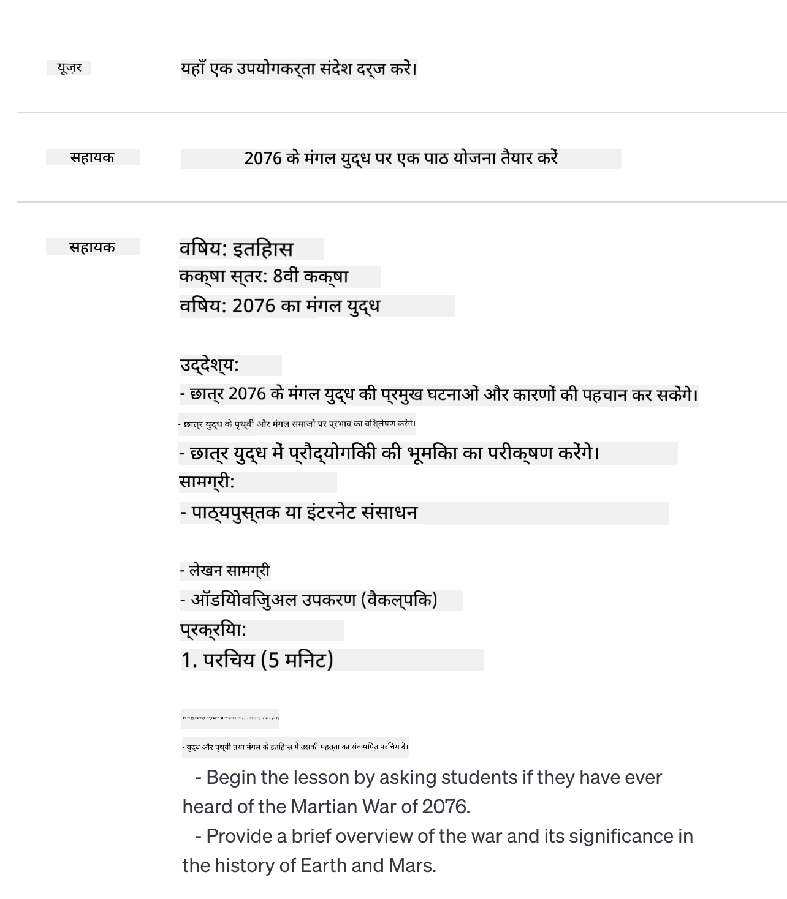

<!--
CO_OP_TRANSLATOR_METADATA:
{
  "original_hash": "dcbaaae026cb50fee071e690685b5843",
  "translation_date": "2025-08-26T15:27:54+00:00",
  "source_file": "04-prompt-engineering-fundamentals/README.md",
  "language_code": "hi"
}
-->
# प्रॉम्प्ट इंजीनियरिंग की मूल बातें

[](https://aka.ms/gen-ai-lesson4-gh?WT.mc_id=academic-105485-koreyst)

## परिचय
यह मॉड्यूल जनरेटिव एआई मॉडल्स में प्रभावी प्रॉम्प्ट बनाने के लिए जरूरी अवधारणाओं और तकनीकों को कवर करता है। जिस तरह आप अपना प्रॉम्प्ट LLM को लिखते हैं, वह भी मायने रखता है। एक ध्यानपूर्वक तैयार किया गया प्रॉम्प्ट बेहतर क्वालिटी का जवाब दिला सकता है। लेकिन आखिर _प्रॉम्प्ट_ और _प्रॉम्प्ट इंजीनियरिंग_ जैसे शब्दों का मतलब क्या है? और मैं LLM को भेजे जाने वाले प्रॉम्प्ट _इनपुट_ को कैसे बेहतर बना सकता हूँ? इन सवालों के जवाब हम इस चैप्टर और अगले में जानने की कोशिश करेंगे।

_जनरेटिव एआई_ यूज़र की रिक्वेस्ट पर नया कंटेंट (जैसे टेक्स्ट, इमेज, ऑडियो, कोड आदि) बना सकता है। यह _लार्ज लैंग्वेज मॉडल्स_ जैसे OpenAI के GPT ("Generative Pre-trained Transformer") सीरीज़ का इस्तेमाल करता है, जिन्हें नेचुरल लैंग्वेज और कोड के लिए ट्रेन किया गया है।

अब यूज़र्स इन मॉडल्स से चैट जैसे परिचित तरीकों से बातचीत कर सकते हैं, इसके लिए किसी तकनीकी जानकारी या ट्रेनिंग की जरूरत नहीं है। ये मॉडल्स _प्रॉम्प्ट-बेस्ड_ हैं - यूज़र टेक्स्ट इनपुट (प्रॉम्प्ट) भेजता है और एआई से जवाब (completion) पाता है। वे फिर "एआई से चैट" कर सकते हैं, कई बार बातचीत करके अपने प्रॉम्प्ट को सुधार सकते हैं जब तक जवाब उनकी उम्मीदों के मुताबिक न हो जाए।

"प्रॉम्प्ट्स" अब जनरेटिव एआई ऐप्स के लिए मुख्य _प्रोग्रामिंग इंटरफेस_ बन गए हैं, जो मॉडल्स को बताते हैं कि क्या करना है और जवाब की क्वालिटी को प्रभावित करते हैं। "प्रॉम्प्ट इंजीनियरिंग" एक तेजी से बढ़ता हुआ क्षेत्र है, जो प्रॉम्प्ट्स के _डिज़ाइन और ऑप्टिमाइज़ेशन_ पर फोकस करता है ताकि बड़े स्तर पर लगातार और क्वालिटी वाले जवाब मिल सकें।

## सीखने के लक्ष्य

इस पाठ में हम जानेंगे कि प्रॉम्प्ट इंजीनियरिंग क्या है, यह क्यों जरूरी है, और हम किसी मॉडल और एप्लिकेशन उद्देश्य के लिए अधिक प्रभावी प्रॉम्प्ट कैसे बना सकते हैं। हम प्रॉम्प्ट इंजीनियरिंग के मुख्य सिद्धांत और सर्वोत्तम प्रथाओं को समझेंगे - और एक इंटरैक्टिव Jupyter Notebooks "सैंडबॉक्स" वातावरण के बारे में जानेंगे, जिसमें हम इन सिद्धांतों को असली उदाहरणों पर लागू होते देख सकते हैं।

इस पाठ के अंत तक हम सक्षम होंगे:

1. समझा सकें कि प्रॉम्प्ट इंजीनियरिंग क्या है और यह क्यों जरूरी है।
2. प्रॉम्प्ट के घटकों का वर्णन कर सकें और वे कैसे इस्तेमाल होते हैं।
3. प्रॉम्प्ट इंजीनियरिंग के सर्वोत्तम तरीके और तकनीकें सीख सकें।
4. सीखी गई तकनीकों को असली उदाहरणों पर लागू कर सकें, OpenAI एंडपॉइंट का इस्तेमाल करके।

## मुख्य शब्दावली

Prompt Engineering: एआई मॉडल्स को मनचाहा आउटपुट देने के लिए इनपुट्स को डिज़ाइन और सुधारने की प्रक्रिया।
Tokenization: टेक्स्ट को छोटे हिस्सों (टोकन) में बदलने की प्रक्रिया, जिन्हें मॉडल समझ और प्रोसेस कर सकता है।
Instruction-Tuned LLMs: वे लार्ज लैंग्वेज मॉडल्स (LLMs) जिन्हें खास निर्देशों के साथ फाइन-ट्यून किया गया है ताकि उनके जवाब अधिक सटीक और प्रासंगिक हों।

## सीखने का सैंडबॉक्स

प्रॉम्प्ट इंजीनियरिंग फिलहाल विज्ञान से ज्यादा कला है। इसे समझने का सबसे अच्छा तरीका है _अधिक अभ्यास_ करना और ट्रायल-एंड-एरर अप्रोच अपनाना, जिसमें एप्लिकेशन डोमेन की जानकारी, सुझाई गई तकनीकें और मॉडल-विशिष्ट ऑप्टिमाइज़ेशन शामिल हों।

इस पाठ के साथ दिया गया Jupyter Notebook एक _सैंडबॉक्स_ वातावरण देता है, जिसमें आप जो सीखते हैं उसे आजमा सकते हैं - चाहे साथ-साथ या अंत में कोड चैलेंज के रूप में। एक्सरसाइज चलाने के लिए आपको चाहिए:

1. **Azure OpenAI API key** - डिप्लॉय किए गए LLM के लिए सर्विस एंडपॉइंट।
2. **Python Runtime** - जिसमें Notebook चल सके।
3. **Local Env Variables** - _[SETUP](./../00-course-setup/02-setup-local.md?WT.mc_id=academic-105485-koreyst) के स्टेप्स अभी पूरे करें ताकि तैयार हो सकें_।

Notebook में _स्टार्टर_ एक्सरसाइज दी गई हैं - लेकिन आपको प्रोत्साहित किया जाता है कि आप अपनी खुद की _Markdown_ (विवरण) और _Code_ (प्रॉम्प्ट रिक्वेस्ट) सेक्शन जोड़ें, ताकि और उदाहरण या आइडिया आजमा सकें - और प्रॉम्प्ट डिज़ाइन के लिए अपनी समझ बना सकें।

## चित्रित गाइड

क्या आप जानना चाहते हैं कि यह पाठ क्या-क्या कवर करता है, इससे पहले कि आप शुरू करें? इस चित्रित गाइड को देखें, जो आपको मुख्य विषयों और हर एक में सोचने लायक मुख्य बातें बताता है। पाठ का रोडमैप आपको मूल अवधारणाओं और चुनौतियों को समझने से लेकर, उन्हें प्रॉम्प्ट इंजीनियरिंग की तकनीकों और सर्वोत्तम प्रथाओं से हल करने तक ले जाता है। ध्यान दें कि इस गाइड का "Advanced Techniques" सेक्शन अगले चैप्टर में कवर किए गए कंटेंट को दर्शाता है।


## हमारा स्टार्टअप

अब, चलिए बात करते हैं कि _यह विषय_ हमारे स्टार्टअप मिशन से कैसे जुड़ा है, जिसका उद्देश्य है [शिक्षा में एआई इनोवेशन लाना](https://educationblog.microsoft.com/2023/06/collaborating-to-bring-ai-innovation-to-education?WT.mc_id=academic-105485-koreyst)। हम एआई-पावर्ड _पर्सनलाइज़्ड लर्निंग_ एप्लिकेशन बनाना चाहते हैं - तो सोचिए कि हमारे एप्लिकेशन के अलग-अलग यूज़र्स कैसे "प्रॉम्प्ट डिज़ाइन" कर सकते हैं:

- **प्रशासक** एआई से _पाठ्यक्रम डेटा का विश्लेषण करके कवरेज में गैप्स_ खोजने को कह सकते हैं। एआई नतीजों का सारांश दे सकता है या कोड से उन्हें विज़ुअलाइज़ कर सकता है।
- **शिक्षक** एआई से _किसी टारगेट ऑडियंस और विषय के लिए पाठ योजना_ बनाने को कह सकते हैं। एआई तय फॉर्मेट में पर्सनलाइज़्ड प्लान बना सकता है।
- **छात्र** एआई से _कठिन विषय में ट्यूटरिंग_ मांग सकते हैं। एआई अब छात्रों को उनके स्तर के मुताबिक पाठ, हिंट्स और उदाहरण देकर गाइड कर सकता है।

यह तो बस शुरुआत है। [Prompts For Education](https://github.com/microsoft/prompts-for-edu/tree/main?WT.mc_id=academic-105485-koreyst) देखें - यह एक ओपन-सोर्स प्रॉम्प्ट्स लाइब्रेरी है, जिसे शिक्षा विशेषज्ञों ने तैयार किया है - ताकि आप संभावनाओं का व्यापक अंदाजा लगा सकें! _इनमें से कुछ प्रॉम्प्ट्स को सैंडबॉक्स या OpenAI Playground में चलाकर देखें कि क्या होता है!_

<!--
LESSON TEMPLATE:
यह यूनिट मुख्य अवधारणा #1 को कवर करे।
उदाहरणों और रेफरेंस से अवधारणा को मजबूत करें।

CONCEPT #1:
Prompt Engineering.
इसे परिभाषित करें और समझाएं कि इसकी जरूरत क्यों है।
-->

## प्रॉम्प्ट इंजीनियरिंग क्या है?

हमने इस पाठ की शुरुआत **Prompt Engineering** को _टेक्स्ट इनपुट्स (प्रॉम्प्ट्स) को डिज़ाइन और ऑप्टिमाइज़_ करने की प्रक्रिया के रूप में परिभाषित करके की थी, ताकि किसी एप्लिकेशन उद्देश्य और मॉडल के लिए लगातार और क्वालिटी वाले जवाब (completions) मिल सकें। इसे हम दो-स्टेप प्रक्रिया के रूप में देख सकते हैं:

- दिए गए मॉडल और उद्देश्य के लिए शुरुआती प्रॉम्प्ट को _डिज़ाइन_ करना
- जवाब की क्वालिटी सुधारने के लिए प्रॉम्प्ट को _बार-बार सुधारना_

यह जरूरी तौर पर ट्रायल-एंड-एरर प्रक्रिया है, जिसमें यूज़र की समझ और मेहनत से ही बेहतर नतीजे मिलते हैं। तो यह जरूरी क्यों है? इसका जवाब जानने के लिए पहले हमें तीन अवधारणाएं समझनी होंगी:

- _Tokenization_ = मॉडल प्रॉम्प्ट को कैसे "देखता" है
- _Base LLMs_ = फाउंडेशन मॉडल प्रॉम्प्ट को कैसे "प्रोसेस" करता है
- _Instruction-Tuned LLMs_ = मॉडल अब "टास्क्स" को कैसे देख सकता है

### Tokenization

एक LLM प्रॉम्प्ट्स को _टोकन्स की सीक्वेंस_ के रूप में देखता है, जिसमें अलग-अलग मॉडल (या मॉडल के वर्शन) एक ही प्रॉम्प्ट को अलग-अलग तरीके से टोकनाइज़ कर सकते हैं। चूंकि LLMs को टोकन्स पर ट्रेन किया जाता है (कच्चे टेक्स्ट पर नहीं), प्रॉम्प्ट्स का टोकनाइज़ेशन सीधे जवाब की क्वालिटी को प्रभावित करता है।

टोकनाइज़ेशन कैसे काम करता है, इसका अंदाजा पाने के लिए [OpenAI Tokenizer](https://platform.openai.com/tokenizer?WT.mc_id=academic-105485-koreyst) जैसे टूल्स आजमाएं। अपना प्रॉम्प्ट कॉपी करें - और देखें कि वह कैसे टोकन्स में बदलता है, खासकर व्हाइटस्पेस और पंक्चुएशन मार्क्स को कैसे हैंडल किया जाता है। ध्यान दें कि यह उदाहरण पुराने LLM (GPT-3) का है - तो नए मॉडल के साथ आजमाने पर अलग नतीजे मिल सकते हैं।


### अवधारणा: फाउंडेशन मॉडल्स

एक बार प्रॉम्प्ट टोकनाइज़ हो जाए, तो ["Base LLM"](https://blog.gopenai.com/an-introduction-to-base-and-instruction-tuned-large-language-models-8de102c785a6?WT.mc_id=academic-105485-koreyst) (या फाउंडेशन मॉडल) का मुख्य काम उस सीक्वेंस में अगला टोकन प्रेडिक्ट करना है। चूंकि LLMs को विशाल टेक्स्ट डाटासेट्स पर ट्रेन किया गया है, वे टोकन्स के बीच सांख्यिकीय संबंधों को अच्छी तरह समझते हैं और आत्मविश्वास के साथ प्रेडिक्शन कर सकते हैं। ध्यान दें कि वे प्रॉम्प्ट या टोकन के शब्दों का _मतलब_ नहीं समझते; वे बस पैटर्न देखते हैं जिसे वे अगले प्रेडिक्शन से "पूरा" कर सकते हैं। वे यूज़र के हस्तक्षेप या किसी तय शर्त तक सीक्वेंस प्रेडिक्ट करते रह सकते हैं।

क्या आप देखना चाहते हैं कि प्रॉम्प्ट-बेस्ड कम्प्लीशन कैसे काम करता है? ऊपर दिया गया प्रॉम्प्ट Azure OpenAI Studio के [_Chat Playground_](https://oai.azure.com/playground?WT.mc_id=academic-105485-koreyst) में डिफॉल्ट सेटिंग्स के साथ डालें। सिस्टम प्रॉम्प्ट्स को जानकारी की रिक्वेस्ट मानता है - तो आपको ऐसा कम्प्लीशन दिखेगा जो इस संदर्भ को पूरा करता है।

लेकिन अगर यूज़र कुछ खास देखना चाहता है, जो किसी क्राइटेरिया या टास्क उद्देश्य को पूरा करता हो? यही वह जगह है जहां _instruction-tuned_ LLMs काम आते हैं।


### अवधारणा: Instruction Tuned LLMs

एक [Instruction Tuned LLM](https://blog.gopenai.com/an-introduction-to-base-and-instruction-tuned-large-language-models-8de102c785a6?WT.mc_id=academic-105485-koreyst) फाउंडेशन मॉडल से शुरू होता है और उसे उदाहरणों या इनपुट/आउटपुट पेयर्स (जैसे, मल्टी-टर्न "messages") से फाइन-ट्यून किया जाता है, जिनमें स्पष्ट निर्देश हो सकते हैं - और एआई का जवाब उस निर्देश का पालन करने की कोशिश करता है।

यह Reinforcement Learning with Human Feedback (RLHF) जैसी तकनीकों का इस्तेमाल करता है, जिससे मॉडल _निर्देशों का पालन_ करना और _फीडबैक से सीखना_ सीखता है, ताकि उसके जवाब व्यावहारिक एप्लिकेशनों के लिए अधिक उपयुक्त और यूज़र के उद्देश्य के लिए अधिक प्रासंगिक हों।

आइए इसे आजमाएं - ऊपर दिए गए प्रॉम्प्ट को फिर से देखें, लेकिन अब _system message_ को बदलकर यह निर्देश दें:

> _आपको जो कंटेंट दिया गया है, उसका दूसरी कक्षा के छात्र के लिए सारांश बनाएं। नतीजा एक पैराग्राफ में रखें, जिसमें 3-5 बुलेट पॉइंट्स हों।_

देखिए कैसे नतीजा अब मनचाहे उद्देश्य और फॉर्मेट के मुताबिक ट्यून हो गया है? शिक्षक अब इस जवाब को सीधे अपनी क्लास की स्लाइड्स में इस्तेमाल कर सकते हैं।


## प्रॉम्प्ट इंजीनियरिंग की जरूरत क्यों है?

अब जब हम जानते हैं कि LLMs प्रॉम्प्ट्स को कैसे प्रोसेस करते हैं, तो बात करते हैं कि _हमें प्रॉम्प्ट इंजीनियरिंग की जरूरत क्यों है_। इसका जवाब यह है कि मौजूदा LLMs में कई चुनौतियां हैं, जिनकी वजह से _विश्वसनीय और लगातार कम्प्लीशन_ पाना मुश्किल हो जाता है, अगर प्रॉम्प्ट बनाने और ऑप्टिमाइज़ करने में मेहनत न की जाए। उदाहरण के लिए:

1. **मॉडल के जवाब स्टोकेस्टिक होते हैं।** _एक ही प्रॉम्प्ट_ अलग-अलग मॉडल्स या वर्शन के साथ अलग जवाब देगा। और एक ही मॉडल के साथ भी अलग-अलग समय पर अलग नतीजे मिल सकते हैं। _प्रॉम्प्ट इंजीनियरिंग तकनीकें इन बदलावों को कम करने में मदद कर सकती हैं, बेहतर गार्डरेल्स देकर।_

1. **मॉडल जवाब गढ़ सकते हैं।** मॉडल्स को _बड़े लेकिन सीमित_ डाटासेट्स पर प्री-ट्रेन किया जाता है, यानी वे उस ट्रेनिंग के बाहर की जानकारी नहीं रखते। नतीजतन, वे ऐसे कम्प्लीशन दे सकते हैं जो गलत, काल्पनिक या ज्ञात तथ्यों के विपरीत हों। _प्रॉम्प्ट इंजीनियरिंग तकनीकें यूज़र्स को ऐसी गढ़ी गई बातों की पहचान और रोकथाम में मदद करती हैं, जैसे एआई से स्रोत या तर्क पूछना।_

1. **मॉडल्स की क्षमताएं अलग होंगी।** नए मॉडल्स या जेनरेशन में ज्यादा क्षमताएं होंगी, लेकिन साथ ही लागत और जटिलता में अलग-अलग समझौते भी होंगे। _प्रॉम्प्ट इंजीनियरिंग हमें ऐसी सर्वोत्तम प्रथाएं और वर्कफ्लो विकसित करने में मदद करता है, जो इन अंतर को छुपा दें और मॉडल-विशिष्ट जरूरतों के मुताबिक स्केलेबल, आसान तरीके से एडजस्ट हो जाएं।_

आइए इसे OpenAI या Azure OpenAI Playground में देखें:

- एक ही प्रॉम्प्ट को अलग-अलग LLM डिप्लॉयमेंट्स (जैसे, OpenAI, Azure OpenAI, Hugging Face) के साथ इस्तेमाल करें - क्या आपको बदलाव दिखे?
- एक ही प्रॉम्प्ट को बार-बार _एक ही_ LLM डिप्लॉयमेंट (जैसे, Azure OpenAI playground) के साथ इस्तेमाल करें - इन बदलावों में क्या फर्क था?

### Fabrications का उदाहरण

इस कोर्स में हम **"fabrication"** शब्द का इस्तेमाल उस स्थिति के लिए करते हैं, जब LLMs कभी-कभी अपनी ट्रेनिंग या अन्य सीमाओं के कारण तथ्यात्मक रूप से गलत जानकारी बना देते हैं। आपने इसे लोकप्रिय लेखों या शोध पत्रों में _"hallucinations"_ के नाम से भी सुना होगा। हालांकि, हम _"fabrication"_ शब्द का इस्तेमाल करने की सलाह देते हैं, ताकि हम मशीन के व्यवहार को गलती से इंसानी गुण न दे दें। यह [Responsible AI guidelines](https://www.microsoft.com/ai/responsible-ai?WT.mc_id=academic-105485-koreyst) को भी मजबूत करता है, क्योंकि कुछ संदर्भों में अन्य शब्द आपत्तिजनक या गैर-समावेशी माने जा सकते हैं।

क्या आप देखना चाहते हैं कि fabrications कैसे काम करती हैं? ऐसा प्रॉम्प्ट सोचें, जिसमें एआई को किसी गैर-मौजूद विषय पर कंटेंट बनाने को कहा जाए (ताकि वह ट्रेनिंग डाटासेट में न हो)। उदाहरण के लिए - मैंने यह प्रॉम्प्ट आजमाया:
# मार्टियन युद्ध 2076 पर पाठ योजना

## उद्देश्य
छात्रों को मार्टियन युद्ध 2076 की प्रमुख घटनाओं, कारणों और परिणामों के बारे में समझाना। साथ ही, युद्ध के सामाजिक, राजनीतिक और वैज्ञानिक प्रभावों पर चर्चा करना।

## परिचय
- मार्टियन युद्ध 2076 मानव इतिहास का एक महत्वपूर्ण मोड़ था।
- इस युद्ध में पृथ्वी और मंगल के बीच संघर्ष हुआ, जिसमें कई देशों और संगठनों ने भाग लिया।
- युद्ध के पीछे संसाधनों, राजनीतिक शक्ति और वैज्ञानिक खोजों की होड़ मुख्य कारण थी।

## मुख्य विषय

### 1. युद्ध के कारण
- मंगल पर बस्तियों का विस्तार और वहां के संसाधनों पर नियंत्रण।
- पृथ्वी और मंगल के बीच बढ़ती प्रतिस्पर्धा।
- तकनीकी प्रगति और नई ऊर्जा स्रोतों की खोज।

### 2. प्रमुख घटनाएँ
- मंगल पर पहली झड़प: 2076 की शुरुआत में।
- अंतरिक्ष में रणनीतिक लड़ाइयाँ।
- पृथ्वी और मंगल के नेताओं के बीच वार्ता और समझौते की कोशिशें।
- युद्ध का निर्णायक मोड़: मंगल की बस्तियों का आत्मसमर्पण।

### 3. परिणाम
- मंगल और पृथ्वी के बीच नया समझौता।
- अंतरिक्ष कानूनों और संसाधनों के बंटवारे में बदलाव।
- वैज्ञानिक और तकनीकी विकास में तेजी।
- सामाजिक और सांस्कृतिक प्रभाव: दोनों ग्रहों के लोगों के बीच संबंधों में बदलाव।

## गतिविधियाँ

### चर्चा
- छात्रों से पूछें: अगर आप मंगल पर होते, तो युद्ध को रोकने के लिए क्या कदम उठाते?
- युद्ध के नैतिक पक्षों पर विचार-विमर्श।

### समूह कार्य
- छात्रों को दो समूहों में बाँटें: एक पृथ्वी का प्रतिनिधित्व करे, दूसरा मंगल का।
- दोनों पक्ष अपने-अपने दृष्टिकोण से युद्ध के कारण और समाधान प्रस्तुत करें।

### अनुसंधान कार्य
- छात्र मार्टियन युद्ध 2076 से जुड़े वैज्ञानिक आविष्कारों पर रिपोर्ट तैयार करें।
- युद्ध के बाद अंतरिक्ष में शांति स्थापना के प्रयासों का अध्ययन करें।

## मूल्यांकन

- कक्षा में चर्चा में भागीदारी।
- समूह कार्य में प्रस्तुत विचार।
- अनुसंधान रिपोर्ट की गुणवत्ता।

## निष्कर्ष

- मार्टियन युद्ध 2076 ने मानवता को अंतरिक्ष में शांति और सहयोग की आवश्यकता का एहसास कराया।
- इस युद्ध से मिली सीख भविष्य के अंतरिक्ष मिशनों और ग्रहों के बीच संबंधों के लिए महत्वपूर्ण है।

## अतिरिक्त संसाधन

- मार्टियन युद्ध 2076 पर डॉक्यूमेंट्री और लेख।
- अंतरिक्ष कानूनों और अंतर-ग्रह संबंधों पर अध्ययन सामग्री।
- वैज्ञानिक पत्रिकाएँ और शोध पत्र।
एक वेब खोज से पता चला कि मंगल युद्धों पर कई काल्पनिक कहानियाँ (जैसे, टीवी सीरीज़ या किताबें) हैं - लेकिन 2076 में कोई नहीं है। सामान्य समझ भी बताती है कि 2076 _भविष्य_ में है, इसलिए इसे किसी वास्तविक घटना से नहीं जोड़ा जा सकता।

तो क्या होता है जब हम यह प्रॉम्प्ट अलग-अलग LLM प्रदाताओं के साथ चलाते हैं?

> **Response 1**: OpenAI Playground (GPT-35)



> **Response 2**: Azure OpenAI Playground (GPT-35)


> **Response 3**: : Hugging Face Chat Playground (LLama-2)


जैसा कि उम्मीद थी, हर मॉडल (या मॉडल वर्शन) थोड़े अलग जवाब देता है, क्योंकि उनमें यादृच्छिक व्यवहार और क्षमताओं में अंतर होता है। उदाहरण के लिए, एक मॉडल 8वीं कक्षा के छात्रों को ध्यान में रखकर जवाब देता है, जबकि दूसरा हाई-स्कूल के छात्र को। लेकिन तीनों ही मॉडल ऐसे जवाब देते हैं, जो किसी अनजान उपयोगकर्ता को यह यकीन दिला सकते हैं कि घटना असली थी।

प्रॉम्प्ट इंजीनियरिंग की तकनीकें जैसे _मेटाप्रॉम्प्टिंग_ और _टेम्परेचर कॉन्फ़िगरेशन_ मॉडल की मनगढ़ंतियों को कुछ हद तक कम कर सकती हैं। नई प्रॉम्प्ट इंजीनियरिंग _आर्किटेक्चर_ भी प्रॉम्प्ट फ्लो में नए टूल्स और तकनीकों को सहजता से शामिल करते हैं, ताकि इन प्रभावों को कम किया जा सके।

## केस स्टडी: GitHub Copilot

आइए इस सेक्शन को समेटते हैं और देखते हैं कि प्रॉम्प्ट इंजीनियरिंग असली दुनिया के समाधानों में कैसे इस्तेमाल होती है, एक केस स्टडी के ज़रिए: [GitHub Copilot](https://github.com/features/copilot?WT.mc_id=academic-105485-koreyst)।

GitHub Copilot आपका "AI पेयर प्रोग्रामर" है - यह टेक्स्ट प्रॉम्प्ट्स को कोड कम्प्लीशन में बदलता है और आपके डेवलपमेंट एनवायरनमेंट (जैसे Visual Studio Code) में इंटीग्रेटेड होता है, जिससे यूज़र एक्सपीरियंस सहज रहता है। नीचे दी गई ब्लॉग सीरीज़ में बताया गया है कि इसकी शुरुआती वर्शन OpenAI Codex मॉडल पर आधारित थी - लेकिन इंजीनियरों ने जल्दी ही महसूस किया कि मॉडल को फाइन-ट्यून करने और बेहतर प्रॉम्प्ट इंजीनियरिंग तकनीकें विकसित करने की ज़रूरत है, ताकि कोड क्वालिटी सुधारी जा सके। जुलाई में, उन्होंने [एक बेहतर AI मॉडल पेश किया जो Codex से आगे है](https://github.blog/2023-07-28-smarter-more-efficient-coding-github-copilot-goes-beyond-codex-with-improved-ai-model/?WT.mc_id=academic-105485-koreyst), जिससे सुझाव और तेज़ हो गए।

इन पोस्ट्स को क्रम में पढ़ें, ताकि उनकी लर्निंग जर्नी को समझ सकें।

- **मई 2023** | [GitHub Copilot आपके कोड को समझने में और बेहतर हो रहा है](https://github.blog/2023-05-17-how-github-copilot-is-getting-better-at-understanding-your-code/?WT.mc_id=academic-105485-koreyst)
- **मई 2023** | [GitHub के अंदर: GitHub Copilot के पीछे LLMs के साथ काम करना](https://github.blog/2023-05-17-inside-github-working-with-the-llms-behind-github-copilot/?WT.mc_id=academic-105485-koreyst)
- **जून 2023** | [GitHub Copilot के लिए बेहतर प्रॉम्प्ट्स कैसे लिखें](https://github.blog/2023-06-20-how-to-write-better-prompts-for-github-copilot/?WT.mc_id=academic-105485-koreyst)
- **जुलाई 2023** | [.. GitHub Copilot बेहतर AI मॉडल के साथ Codex से आगे बढ़ता है](https://github.blog/2023-07-28-smarter-more-efficient-coding-github-copilot-goes-beyond-codex-with-improved-ai-model/?WT.mc_id=academic-105485-koreyst)
- **जुलाई 2023** | [डेवलपर के लिए प्रॉम्प्ट इंजीनियरिंग और LLMs गाइड](https://github.blog/2023-07-17-prompt-engineering-guide-generative-ai-llms/?WT.mc_id=academic-105485-koreyst)
- **सितंबर 2023** | [एंटरप्राइज LLM ऐप कैसे बनाएं: GitHub Copilot से सीखे गए सबक](https://github.blog/2023-09-06-how-to-build-an-enterprise-llm-application-lessons-from-github-copilot/?WT.mc_id=academic-105485-koreyst)

आप उनके [इंजीनियरिंग ब्लॉग](https://github.blog/category/engineering/?WT.mc_id=academic-105485-koreyst) को भी देख सकते हैं, जहाँ [यह पोस्ट](https://github.blog/2023-09-27-how-i-used-github-copilot-chat-to-build-a-reactjs-gallery-prototype/?WT.mc_id=academic-105485-koreyst) जैसी और पोस्ट्स मिलेंगी, जो दिखाती हैं कि ये मॉडल और तकनीकें असली दुनिया के ऐप्लिकेशन्स में _कैसे लागू_ होती हैं।

---

## प्रॉम्प्ट कंस्ट्रक्शन

हमने देखा कि प्रॉम्प्ट इंजीनियरिंग क्यों ज़रूरी है - अब समझते हैं कि प्रॉम्प्ट्स _कैसे बनाए जाते हैं_, ताकि हम अलग-अलग तकनीकों का मूल्यांकन कर सकें और अधिक प्रभावी प्रॉम्प्ट डिज़ाइन कर सकें।

### बेसिक प्रॉम्प्ट

आइए बेसिक प्रॉम्प्ट से शुरू करते हैं: एक टेक्स्ट इनपुट जो मॉडल को बिना किसी अतिरिक्त संदर्भ के भेजा जाता है। उदाहरण के लिए - जब हम US के नेशनल एंथम के शुरुआती शब्द OpenAI [Completion API](https://platform.openai.com/docs/api-reference/completions?WT.mc_id=academic-105485-koreyst) को भेजते हैं, तो यह तुरंत अगले कुछ पंक्तियों के साथ जवाब _पूरा_ कर देता है, जिससे बेसिक प्रेडिक्शन व्यवहार दिखता है।

| प्रॉम्प्ट (इनपुट)     | कम्प्लीशन (आउटपुट)                                                                                                                        |
| :-------------------- | :----------------------------------------------------------------------------------------------------------------------------------------- |
| Oh say can you see    | ऐसा लगता है कि आप "The Star-Spangled Banner," जो कि संयुक्त राज्य अमेरिका का राष्ट्रगान है, के बोल शुरू कर रहे हैं। इसके पूरे बोल हैं ... |

### जटिल प्रॉम्प्ट

अब उस बेसिक प्रॉम्प्ट में संदर्भ और निर्देश जोड़ते हैं। [Chat Completion API](https://learn.microsoft.com/azure/ai-services/openai/how-to/chatgpt?WT.mc_id=academic-105485-koreyst) हमें एक जटिल प्रॉम्प्ट को _संदेशों_ के संग्रह के रूप में बनाने देती है, जिसमें:

- इनपुट/आउटपुट जोड़े होते हैं, जो _यूज़र_ इनपुट और _असिस्टेंट_ के जवाब को दर्शाते हैं।
- सिस्टम मैसेज, जो असिस्टेंट के व्यवहार या पर्सनैलिटी के लिए संदर्भ सेट करता है।

अब अनुरोध नीचे दिए गए फॉर्म में है, जहाँ _टोकनाइज़ेशन_ संदर्भ और बातचीत से प्रासंगिक जानकारी को प्रभावी ढंग से कैप्चर करता है। अब, सिस्टम संदर्भ बदलना कम्प्लीशन की गुणवत्ता पर उतना ही असर डाल सकता है, जितना यूज़र इनपुट्स का।

```python
response = openai.chat.completions.create(
    model="gpt-3.5-turbo",
    messages=[
        {"role": "system", "content": "You are a helpful assistant."},
        {"role": "user", "content": "Who won the world series in 2020?"},
        {"role": "assistant", "content": "The Los Angeles Dodgers won the World Series in 2020."},
        {"role": "user", "content": "Where was it played?"}
    ]
)
```

### इंस्ट्रक्शन प्रॉम्प्ट

ऊपर के उदाहरणों में, यूज़र प्रॉम्प्ट एक साधारण टेक्स्ट क्वेरी थी, जिसे जानकारी के अनुरोध के रूप में समझा जा सकता है। _इंस्ट्रक्शन_ प्रॉम्प्ट्स के साथ, हम उस टेक्स्ट का उपयोग करके टास्क को और विस्तार से बता सकते हैं, जिससे AI को बेहतर गाइडेंस मिलती है। उदाहरण:

| प्रॉम्प्ट (इनपुट)                                                                                                                                                                                                                         | कम्प्लीशन (आउटपुट)                                                                                                        | इंस्ट्रक्शन टाइप    |
| :---------------------------------------------------------------------------------------------------------------------------------------------------------------------------------------------------------------------------------------- | :------------------------------------------------------------------------------------------------------------------------- | :------------------ |
| Write a description of the Civil War                                                                                                                                                                                                      | _एक साधारण पैराग्राफ लौटाया गया_                                                                                          | साधारण              |
| Write a description of the Civil War. Provide key dates and events and describe their significance                                                                                                  | _एक पैराग्राफ के बाद मुख्य घटनाओं की तारीखों की सूची और उनका विवरण लौटाया गया_                                             | जटिल                |
| Write a description of the Civil War in 1 paragraph. Provide 3 bullet points with key dates and their significance. Provide 3 more bullet points with key historical figures and their contributions. Return the output as a JSON file | _और अधिक विस्तृत जानकारी एक टेक्स्ट बॉक्स में लौटाई गई, जिसे JSON के रूप में फॉर्मेट किया गया है, ताकि आप उसे फाइल में कॉपी-पेस्ट कर सकें और जरूरत के अनुसार वैलिडेट कर सकें_ | जटिल। फॉर्मेटेड।    |

## प्राइमरी कंटेंट

ऊपर के उदाहरणों में, प्रॉम्प्ट अभी भी काफी ओपन-एंडेड था, जिससे LLM खुद तय करता था कि उसके प्री-ट्रेंड डाटासेट का कौन सा हिस्सा प्रासंगिक है। _प्राइमरी कंटेंट_ डिज़ाइन पैटर्न के साथ, इनपुट टेक्स्ट को दो हिस्सों में बांटा जाता है:

- एक इंस्ट्रक्शन (एक्शन)
- प्रासंगिक कंटेंट (जो एक्शन को प्रभावित करता है)

यहाँ एक उदाहरण है, जहाँ इंस्ट्रक्शन है "इसे 2 वाक्यों में संक्षेप में बताएं"।

| प्रॉम्प्ट (इनपुट)                                                                                                                                                                                                                                                                                                                                                                                                                                                                                                                                                                                                                                                                                      | कम्प्लीशन (आउटपुट)                                                                                                                                                                                                                                                                             |
| :-------------------------------------------------------------------------------------------------------------------------------------------------------------------------------------------------------------------------------------------------------------------------------------------------------------------------------------------------------------------------------------------------------------------------------------------------------------------------------------------------------------------------------------------------------------------------------------------------------------------------------------------------------------------------------------------------- | :---------------------------------------------------------------------------------------------------------------------------------------------------------------------------------------------------------------------------------------------------------------------------------------------- |
| Jupiter सूर्य से पाँचवां ग्रह है और सौरमंडल का सबसे बड़ा ग्रह है। यह एक गैस जायंट है, जिसका द्रव्यमान सूर्य का एक-हज़ारवां है, लेकिन सौरमंडल के बाकी सभी ग्रहों के कुल द्रव्यमान से ढाई गुना अधिक है। बृहस्पति नग्न आंखों से रात के आकाश में दिखने वाली सबसे चमकीली वस्तुओं में से एक है, और इसे प्राचीन सभ्यताएं रिकॉर्डेड इतिहास से पहले से जानती थीं। इसका नाम रोमन देवता Jupiter के नाम पर रखा गया है।[19] पृथ्वी से देखने पर, बृहस्पति इतना चमकीला हो सकता है कि इसकी परावर्तित रोशनी से दृश्य छाया बन सकती है,[20] और औसतन यह चंद्रमा और शुक्र के बाद रात के आकाश में तीसरी सबसे चमकीली प्राकृतिक वस्तु है। <br/> **Summarize this in 2 short sentences** | बृहस्पति, सूर्य से पाँचवां ग्रह है, सौरमंडल का सबसे बड़ा ग्रह है और रात के आकाश में सबसे चमकीली वस्तुओं में से एक है। रोमन देवता Jupiter के नाम पर रखा गया यह गैस जायंट, बाकी सभी ग्रहों के कुल द्रव्यमान से ढाई गुना भारी है। |

प्राइमरी कंटेंट सेगमेंट का उपयोग कई तरीकों से किया जा सकता है, ताकि निर्देश और प्रभावी बन सकें:

- **उदाहरण** - मॉडल को स्पष्ट निर्देश देने के बजाय, उसे वांछित आउटपुट के उदाहरण दें और उसे पैटर्न समझने दें।
- **क्यूज़** - इंस्ट्रक्शन के बाद एक "क्यू" दें, जो कम्प्लीशन को प्राइम करता है और मॉडल को अधिक प्रासंगिक जवाब की ओर गाइड करता है।
- **टेम्प्लेट्स** - ये दोहराए जाने योग्य 'रेसिपी' हैं, जिनमें प्लेसहोल्डर (वेरिएबल्स) होते हैं, जिन्हें खास डेटा के लिए कस्टमाइज़ किया जा सकता है।

आइए इन्हें एक्शन में देखें।

### उदाहरणों का उपयोग

यह एक तरीका है जिसमें आप प्राइमरी कंटेंट का उपयोग करके मॉडल को वांछित आउटपुट के कुछ उदाहरण "खिलाते" हैं, और उसे वांछित आउटपुट का पैटर्न समझने देते हैं। दिए गए उदाहरणों की संख्या के आधार पर, हम ज़ीरो-शॉट प्रॉम्प्टिंग, वन-शॉट प्रॉम्प्टिंग, फ्यू-शॉट प्रॉम्प्टिंग आदि कर सकते हैं।

अब प्रॉम्प्ट में तीन घटक होते हैं:

- एक टास्क विवरण
- वांछित आउटपुट के कुछ उदाहरण
- एक नए उदाहरण की शुरुआत (जो एक अप्रत्यक्ष टास्क विवरण बन जाता है)

| लर्निंग टाइप | प्रॉम्प्ट (इनपुट)                                                                                                                                        | कम्प्लीशन (आउटपुट)         |
| :----------- | :-------------------------------------------------------------------------------------------------------------------------------------------------------- | :-------------------------- |
| ज़ीरो-शॉट    | "The Sun is Shining". Translate to Spanish                                                                                                               | "El Sol está brillando".    |
| वन-शॉट      | "The Sun is Shining" => ""El Sol está brillando". <br> "It's a Cold and Windy Day" =>                                                                    | "Es un día frío y ventoso". |
| फ्यू-शॉट     | The player ran the bases => Baseball <br/> The player hit an ace => Tennis <br/> The player hit a six => Cricket <br/> The player made a slam-dunk =>   | Basketball                  |
|              |                                                                                                                                                          |                             |

ध्यान दें कि ज़ीरो-शॉट प्रॉम्प्टिंग में हमें स्पष्ट निर्देश ("Translate to Spanish") देना पड़ा, लेकिन वन-शॉट प्रॉम्प्टिंग के उदाहरण में यह निर्देश अप्रत्यक्ष रूप से समझा गया। फ्यू-शॉट उदाहरण दिखाता है कि अधिक उदाहरण जोड़ने से मॉडल बिना अतिरिक्त निर्देश के अधिक सटीक अनुमान लगा सकता है।

### प्रॉम्प्ट क्यूज़

प्राइमरी कंटेंट का उपयोग करने की एक और तकनीक है _क्यूज़_ देना, न कि उदाहरण। इसमें हम मॉडल को वांछित उत्तर के फॉर्मेट का एक स्निपेट देकर सही दिशा में "धक्का" देते हैं। मॉडल फिर उस क्यू को पकड़कर उसी तरह आगे बढ़ता है।

| क्यू की संख्या | प्रॉम्प्ट (इनपुट)                                                                                                                                                                                                                                                                                                                                                                                                                                               | कम्प्लीशन (आउटपुट)                                                                                                                                                                                                                                                                                       |
| :------------ | :--------------------------------------------------------------------------------------------------------------------------------------------------------------------------------------------------------------------------------------------------------------------------------------------------------------------------------------------------------------------------------------------------------------------------------------------------------------- | :-------------------------------------------------------------------------------------------------------------------------------------------------------------------------------------------------------------------------------------------------------------------------------------------------------- |
| 0             | Jupiter सूर्य से पाँचवां ग्रह है और सौरमंडल का सबसे बड़ा ग्रह है। यह एक गैस जायंट है, जिसका द्रव्यमान सूर्य का एक-हज़ारवां है, लेकिन सौरमंडल के बाकी सभी ग्रहों के कुल द्रव्यमान से ढाई गुना अधिक है। बृहस्पति नग्न आंखों से रात के आकाश में दिखने वाली सबसे चमकीली वस्तुओं में से एक है, और इसे प्राचीन सभ्यताएं रिकॉर्डेड इतिहास से पहले से जानती थीं।

**इसका सारांश बताएं**                                       | बृहस्पति हमारे सौरमंडल का सबसे बड़ा ग्रह है और सूर्य से पाँचवां ग्रह है। यह एक गैस दानव है जिसकी द्रव्यमान सूर्य का 1/1000 है, लेकिन यह बाकी सभी ग्रहों के कुल द्रव्यमान से भी भारी है। प्राचीन सभ्यताएँ बृहस्पति को बहुत पहले से जानती थीं, और यह रात के आकाश में आसानी से दिखाई देता है। |
| 1              | बृहस्पति सूर्य से पाँचवां ग्रह है और सौरमंडल का सबसे बड़ा ग्रह है। यह एक गैस दानव है जिसका द्रव्यमान सूर्य का एक-हज़ारवां हिस्सा है, लेकिन बाकी सभी ग्रहों के कुल द्रव्यमान से ढाई गुना अधिक है। बृहस्पति रात के आकाश में बिना किसी उपकरण के सबसे चमकीले वस्तुओं में से एक है, और इसे प्राचीन सभ्यताएँ लिखित इतिहास से पहले से जानती थीं। <br/>**इसका सारांश बताएं** <br/> हमने यह जाना कि बृहस्पति | सूर्य से पाँचवां ग्रह है और सौरमंडल का सबसे बड़ा ग्रह है। यह एक गैस दानव है जिसका द्रव्यमान सूर्य का एक-हज़ारवां हिस्सा है, लेकिन बाकी सभी ग्रहों के कुल द्रव्यमान से ढाई गुना अधिक है। यह बिना किसी उपकरण के आसानी से दिखाई देता है और प्राचीन काल से जाना जाता है।                        |
| 2              | बृहस्पति सूर्य से पाँचवां ग्रह है और सौरमंडल का सबसे बड़ा ग्रह है। यह एक गैस दानव है जिसका द्रव्यमान सूर्य का एक-हज़ारवां हिस्सा है, लेकिन बाकी सभी ग्रहों के कुल द्रव्यमान से ढाई गुना अधिक है। बृहस्पति रात के आकाश में बिना किसी उपकरण के सबसे चमकीले वस्तुओं में से एक है, और इसे प्राचीन सभ्यताएँ लिखित इतिहास से पहले से जानती थीं। <br/>**इसका सारांश बताएं** <br/> शीर्ष 3 तथ्य जो हमने सीखे:         | 1. बृहस्पति सूर्य से पाँचवां ग्रह है और सौरमंडल का सबसे बड़ा ग्रह है। <br/> 2. यह एक गैस दानव है जिसका द्रव्यमान सूर्य का एक-हज़ारवां हिस्सा है...<br/> 3. बृहस्पति प्राचीन काल से बिना किसी उपकरण के दिखाई देता रहा है ...                                                                       |
|                |                                                                                                                                                                                                                                                                                                                                                                                                                                                              |                                                                                                                                                                                                                                                                                                           |

### प्रॉम्प्ट टेम्पलेट्स

प्रॉम्प्ट टेम्पलेट एक _पूर्व-निर्धारित प्रॉम्प्ट की रेसिपी_ है जिसे स्टोर किया जा सकता है और ज़रूरत पड़ने पर दोबारा इस्तेमाल किया जा सकता है, ताकि बड़े स्तर पर यूज़र अनुभव में निरंतरता लाई जा सके। सबसे सरल रूप में, यह प्रॉम्प्ट उदाहरणों का संग्रह होता है जैसे [OpenAI का यह उदाहरण](https://platform.openai.com/examples?WT.mc_id=academic-105485-koreyst), जिसमें इंटरैक्टिव प्रॉम्प्ट कंपोनेंट्स (यूज़र और सिस्टम मैसेज) और API-आधारित रिक्वेस्ट फॉर्मेट दोनों होते हैं - जिससे दोबारा इस्तेमाल संभव हो सके।

थोड़ा जटिल रूप में, जैसे [LangChain का यह उदाहरण](https://python.langchain.com/docs/concepts/prompt_templates/?WT.mc_id=academic-105485-koreyst), इसमें _प्लेसहोल्डर_ होते हैं जिन्हें अलग-अलग स्रोतों (यूज़र इनपुट, सिस्टम कॉन्टेक्स्ट, बाहरी डेटा स्रोत आदि) से डेटा लेकर डायनामिक रूप से प्रॉम्प्ट बनाने के लिए बदला जा सकता है। इससे हम दोबारा इस्तेमाल के लिए प्रॉम्प्ट की लाइब्रेरी बना सकते हैं, जो बड़े स्तर पर यूज़र अनुभव को **प्रोग्रामेटिकली** बेहतर बनाती है।

अंत में, टेम्पलेट्स की असली ताकत _प्रॉम्प्ट लाइब्रेरी_ बनाने में है, खासकर वर्टिकल एप्लिकेशन डोमेन के लिए - जहाँ प्रॉम्प्ट टेम्पलेट को एप्लिकेशन-विशिष्ट कॉन्टेक्स्ट या उदाहरणों के अनुसार _ऑप्टिमाइज़_ किया जाता है, जिससे जवाब यूज़र के लिए ज्यादा प्रासंगिक और सटीक हो जाते हैं। [Prompts For Edu](https://github.com/microsoft/prompts-for-edu?WT.mc_id=academic-105485-koreyst) रिपॉजिटरी इसका बेहतरीन उदाहरण है, जिसमें शिक्षा क्षेत्र के लिए प्रॉम्प्ट्स की लाइब्रेरी बनाई गई है, जिसमें पाठ योजना, पाठ्यक्रम डिजाइन, छात्र ट्यूटरिंग आदि जैसे मुख्य उद्देश्यों पर ज़ोर दिया गया है।

## सहायक सामग्री

अगर हम प्रॉम्प्ट निर्माण को एक निर्देश (टास्क) और एक लक्ष्य (मुख्य सामग्री) के रूप में सोचें, तो _द्वितीयक सामग्री_ वह अतिरिक्त कॉन्टेक्स्ट है जिसे हम **आउटपुट को किसी तरह प्रभावित करने के लिए** देते हैं। यह ट्यूनिंग पैरामीटर, फॉर्मेटिंग निर्देश, विषय टैक्सोनॉमी आदि हो सकते हैं, जो मॉडल को जवाब को यूज़र की अपेक्षाओं के अनुसार _अनुकूलित_ करने में मदद करते हैं।

उदाहरण के लिए: अगर हमारे पास कोर्स कैटलॉग है जिसमें सभी उपलब्ध कोर्स के बारे में विस्तृत मेटाडेटा (नाम, विवरण, स्तर, टैग, प्रशिक्षक आदि) है:

- हम एक निर्देश दे सकते हैं "Fall 2023 के लिए कोर्स कैटलॉग का सारांश बनाएं"
- हम मुख्य सामग्री में वांछित आउटपुट के कुछ उदाहरण दे सकते हैं
- हम द्वितीयक सामग्री में रुचि के शीर्ष 5 "टैग" पहचान सकते हैं

अब, मॉडल कुछ उदाहरणों में दिखाए गए फॉर्मेट में सारांश दे सकता है - लेकिन अगर किसी परिणाम में कई टैग हैं, तो वह द्वितीयक सामग्री में दिए गए 5 टैग को प्राथमिकता दे सकता है।

---

<!--
पाठ टेम्पलेट:
इस यूनिट में मुख्य अवधारणा #1 शामिल होनी चाहिए।
उदाहरणों और संदर्भों से अवधारणा को मजबूत करें।

अवधारणा #3:
प्रॉम्प्ट इंजीनियरिंग तकनीकें।
प्रॉम्प्ट इंजीनियरिंग की कुछ बुनियादी तकनीकें क्या हैं?
इसे कुछ अभ्यासों के साथ समझाएं।
-->

## प्रॉम्प्टिंग के सर्वोत्तम तरीके

अब जब हमें पता है कि प्रॉम्प्ट कैसे _बनाए_ जा सकते हैं, तो हम यह सोच सकते हैं कि उन्हें _डिज़ाइन_ कैसे करें ताकि सर्वोत्तम तरीके अपनाए जा सकें। इसे दो हिस्सों में सोच सकते हैं - सही _माइंडसेट_ रखना और सही _तकनीकें_ लागू करना।

### प्रॉम्प्ट इंजीनियरिंग माइंडसेट

प्रॉम्प्ट इंजीनियरिंग एक ट्रायल-एंड-एरर प्रक्रिया है, इसलिए तीन मुख्य बातों का ध्यान रखें:

1. **डोमेन की समझ जरूरी है।** जवाब की सटीकता और प्रासंगिकता उस _डोमेन_ पर निर्भर करती है जिसमें एप्लिकेशन या यूज़र काम करता है। अपनी समझ और विशेषज्ञता का इस्तेमाल करके तकनीकों को **कस्टमाइज़** करें। उदाहरण के लिए, अपने सिस्टम प्रॉम्प्ट्स में _डोमेन-विशिष्ट पर्सनैलिटी_ परिभाषित करें, या यूज़र प्रॉम्प्ट्स में _डोमेन-विशिष्ट टेम्पलेट्स_ इस्तेमाल करें। द्वितीयक सामग्री में डोमेन-विशिष्ट कॉन्टेक्स्ट दें, या _डोमेन-विशिष्ट संकेत और उदाहरण_ दें ताकि मॉडल को परिचित पैटर्न की ओर निर्देशित किया जा सके।

2. **मॉडल की समझ जरूरी है।** हम जानते हैं कि मॉडल स्वभाव से स्टोकास्टिक होते हैं। लेकिन मॉडल के इम्प्लीमेंटेशन भी अलग-अलग हो सकते हैं - जैसे वे किस ट्रेनिंग डेटा का इस्तेमाल करते हैं (पूर्व-प्रशिक्षित ज्ञान), वे कौन सी क्षमताएँ देते हैं (जैसे API या SDK के ज़रिए), और किस प्रकार की सामग्री के लिए वे अनुकूलित हैं (जैसे, कोड, इमेज, टेक्स्ट)। जिस मॉडल का इस्तेमाल कर रहे हैं, उसकी ताकत और सीमाएँ समझें, और उस जानकारी का इस्तेमाल करके _टास्क को प्राथमिकता_ दें या _कस्टम टेम्पलेट्स_ बनाएं जो मॉडल की क्षमताओं के अनुसार अनुकूलित हों।

3. **पुनरावृत्ति और सत्यापन जरूरी है।** मॉडल तेज़ी से बदल रहे हैं, और प्रॉम्प्ट इंजीनियरिंग की तकनीकें भी। एक डोमेन विशेषज्ञ के रूप में आपके पास अपने एप्लिकेशन के लिए अन्य कॉन्टेक्स्ट या मानदंड हो सकते हैं, जो व्यापक समुदाय पर लागू नहीं होते। प्रॉम्प्ट इंजीनियरिंग टूल्स और तकनीकों का इस्तेमाल करके प्रॉम्प्ट निर्माण की शुरुआत करें, फिर अपनी समझ और विशेषज्ञता से परिणामों को दोहराएं और सत्यापित करें। अपनी जानकारी रिकॉर्ड करें और एक **ज्ञान आधार** (जैसे, प्रॉम्प्ट लाइब्रेरी) बनाएं जिसे अन्य लोग भविष्य में तेज़ी से दोहराने के लिए इस्तेमाल कर सकें।

## सर्वोत्तम तरीके

अब आइए देखें कि [OpenAI](https://help.openai.com/en/articles/6654000-best-practices-for-prompt-engineering-with-openai-api?WT.mc_id=academic-105485-koreyst) और [Azure OpenAI](https://learn.microsoft.com/azure/ai-services/openai/concepts/prompt-engineering#best-practices?WT.mc_id=academic-105485-koreyst) के विशेषज्ञ कौन-कौन से सामान्य सर्वोत्तम तरीके सुझाते हैं।

| क्या                              | क्यों                                                                                                                                                                                                                                               |
| :-------------------------------- | :------------------------------------------------------------------------------------------------------------------------------------------------------------------------------------------------------------------------------------------------ |
| नवीनतम मॉडल का मूल्यांकन करें       | नए मॉडल पीढ़ियों में बेहतर फीचर्स और गुणवत्ता हो सकती है - लेकिन लागत भी अधिक हो सकती है। प्रभाव का मूल्यांकन करें, फिर माइग्रेशन का निर्णय लें।                                                                                |
| निर्देश और कॉन्टेक्स्ट अलग रखें   | देखें कि क्या आपका मॉडल/प्रदाता _डिलिमिटर_ परिभाषित करता है जिससे निर्देश, मुख्य और द्वितीयक सामग्री को स्पष्ट रूप से अलग किया जा सके। इससे मॉडल टोकन को अधिक सटीक वेट दे सकते हैं।                                                         |
| स्पष्ट और विशिष्ट रहें             | वांछित कॉन्टेक्स्ट, परिणाम, लंबाई, फॉर्मेट, शैली आदि के बारे में अधिक विवरण दें। इससे जवाब की गुणवत्ता और निरंतरता दोनों बेहतर होगी। रेसिपी को दोबारा इस्तेमाल के लिए टेम्पलेट्स में कैप्चर करें।                                                          |
| वर्णनात्मक बनें, उदाहरण दें      | मॉडल "दिखाओ और बताओ" तरीके से बेहतर जवाब दे सकते हैं। पहले `zero-shot` तरीके से सिर्फ निर्देश दें (कोई उदाहरण नहीं), फिर `few-shot` तरीके से कुछ उदाहरण देकर आउटपुट को सुधारें। उपमाएँ इस्तेमाल करें। |
| संकेतों से जवाब शुरू करवाएँ | वांछित परिणाम की ओर मॉडल को ले जाने के लिए कुछ शुरुआती शब्द या वाक्यांश दें, जिससे वह जवाब शुरू कर सके।                                                                                                               |
| दोहराएँ                       | कभी-कभी मॉडल को निर्देश दोहराने पड़ सकते हैं। मुख्य सामग्री से पहले और बाद में निर्देश दें, या निर्देश और संकेत दोनों दें। दोहराएँ और सत्यापित करें कि क्या काम करता है।                                                         |
| क्रम मायने रखता है                     | जिस क्रम में आप जानकारी मॉडल को देते हैं, वह आउटपुट को प्रभावित कर सकता है, खासकर उदाहरणों में, क्योंकि हाल की जानकारी का प्रभाव होता है। अलग-अलग विकल्प आज़माएँ कि क्या सबसे अच्छा काम करता है।                                                               |
| मॉडल को "आउट" दें           | अगर मॉडल किसी कारणवश टास्क पूरा नहीं कर सकता, तो उसे एक _फॉलबैक_ जवाब देने का विकल्प दें। इससे झूठे या मनगढ़ंत जवाब आने की संभावना कम हो जाती है।                                                         |
|                                   |                                                                                                                                                                                                                                                   |

जैसे किसी भी सर्वोत्तम तरीके में होता है, याद रखें कि _आपका अनुभव_ मॉडल, टास्क और डोमेन के अनुसार अलग हो सकता है। इन्हें शुरुआती बिंदु के रूप में इस्तेमाल करें, और दोहराएँ कि आपके लिए क्या सबसे अच्छा काम करता है। जैसे-जैसे नए मॉडल और टूल्स आते हैं, अपने प्रॉम्प्ट इंजीनियरिंग प्रक्रिया का पुनर्मूल्यांकन करते रहें, खासकर प्रक्रिया की स्केलेबिलिटी और जवाब की गुणवत्ता पर ध्यान दें।

<!--
पाठ टेम्पलेट:
अगर लागू हो तो इस यूनिट में कोड चैलेंज दें

चैलेंज:
एक Jupyter Notebook का लिंक जिसमें सिर्फ कोड कमेंट्स में निर्देश हैं (कोड सेक्शन खाली हैं)।

समाधान:
उस Notebook की एक कॉपी का लिंक जिसमें प्रॉम्प्ट्स भरे हुए और रन किए गए हैं, जिससे एक उदाहरण दिखता है।
-->

## असाइनमेंट

बधाई हो! आपने पाठ का अंत पूरा कर लिया है! अब समय है कि इन अवधारणाओं और तकनीकों को असली उदाहरणों के साथ आज़माएँ!

इस असाइनमेंट के लिए हम एक Jupyter Notebook का इस्तेमाल करेंगे जिसमें आप इंटरैक्टिव तरीके से अभ्यास कर सकते हैं। आप Notebook में अपने खुद के Markdown और Code सेल्स भी जोड़ सकते हैं ताकि अपनी सोच और तकनीकों को खुद एक्सप्लोर कर सकें।

### शुरू करने के लिए, रिपॉजिटरी को फोर्क करें, फिर

- (सुझाव) GitHub Codespaces लॉन्च करें
- (वैकल्पिक) रिपॉजिटरी को अपने लोकल डिवाइस पर क्लोन करें और Docker Desktop के साथ इस्तेमाल करें
- (वैकल्पिक) Notebook को अपनी पसंदीदा Notebook रनटाइम एनवायरनमेंट में खोलें।

### इसके बाद, अपने एनवायरनमेंट वेरिएबल्स कॉन्फ़िगर करें

- रिपॉजिटरी रूट में `.env.copy` फाइल को कॉपी करके `.env` बनाएं और उसमें `AZURE_OPENAI_API_KEY`, `AZURE_OPENAI_ENDPOINT` और `AZURE_OPENAI_DEPLOYMENT` की वैल्यू भरें। [Learning Sandbox सेक्शन](../../../04-prompt-engineering-fundamentals/04-prompt-engineering-fundamentals) में जाकर जानें कैसे।

### इसके बाद, Jupyter Notebook खोलें

- रनटाइम कर्नेल चुनें। अगर विकल्प 1 या 2 इस्तेमाल कर रहे हैं, तो डिफॉल्ट Python 3.10.x कर्नेल चुनें जो dev container में दिया गया है।

अब आप अभ्यास चला सकते हैं। ध्यान दें कि यहाँ _सही या गलत_ जवाब नहीं हैं - बस ट्रायल-एंड-एरर से विकल्पों को एक्सप्लोर करना है और यह समझना है कि किस मॉडल और एप्लिकेशन डोमेन के लिए क्या काम करता है।

_इसी वजह से इस पाठ में कोई Code Solution सेगमेंट नहीं है। इसके बजाय, Notebook में "My Solution:" शीर्षक वाले Markdown सेल्स होंगे, जिसमें एक उदाहरण आउटपुट दिखाया गया है संदर्भ के लिए।_

 <!--
पाठ टेम्पलेट:
सेक्शन को एक सारांश और स्व-अध्ययन के लिए संसाधनों के साथ समाप्त करें।
-->

## ज्ञान जांच

निम्न में से कौन सा प्रॉम्प्ट कुछ उचित सर्वोत्तम तरीकों का पालन करता है?

1. मुझे लाल कार की एक तस्वीर दिखाओ
2. मुझे लाल कार की एक तस्वीर दिखाओ, जो Volvo कंपनी की हो, मॉडल XC90 हो, और वह एक चट्टान के पास सूर्यास्त के समय खड़ी हो
3. मुझे लाल कार की एक तस्वीर दिखाओ, जो Volvo कंपनी की हो, मॉडल XC90 हो

A: 2, यह सबसे अच्छा प्रॉम्प्ट है क्योंकि इसमें "क्या" के बारे में विस्तार से बताया गया है (सिर्फ कोई भी कार नहीं, बल्कि एक खास कंपनी और मॉडल) और साथ ही पूरे दृश्य का भी वर्णन किया गया है। 3 अगला सबसे अच्छा है क्योंकि इसमें भी काफी विवरण है।

## 🚀 चैलेंज

देखें कि क्या आप "संकेत" तकनीक का इस्तेमाल कर सकते हैं इस प्रॉम्प्ट के साथ: वाक्य पूरा करें "मुझे लाल कार की एक तस्वीर दिखाओ, जो Volvo कंपनी की हो और ". इसका क्या जवाब आता है, और आप इसे कैसे बेहतर बनाएँगे?

## शानदार काम! अपनी सीख जारी रखें

क्या आप प्रॉम्प्ट इंजीनियरिंग की अलग-अलग अवधारणाओं के बारे में और जानना चाहते हैं? [continued learning page](https://aka.ms/genai-collection?WT.mc_id=academic-105485-koreyst) पर जाएँ, जहाँ इस विषय पर अन्य बेहतरीन संसाधन मिलेंगे।

Lesson 5 पर जाएँ, जहाँ हम [उन्नत प्रॉम्प्टिंग तकनीकों](../05-advanced-prompts/README.md?WT.mc_id=academic-105485-koreyst) को देखेंगे!

---

**अस्वीकरण**:  
यह दस्तावेज़ AI अनुवाद सेवा [Co-op Translator](https://github.com/Azure/co-op-translator) का उपयोग करके अनुवादित किया गया है। जबकि हम सटीकता के लिए प्रयासरत हैं, कृपया ध्यान दें कि स्वचालित अनुवादों में त्रुटियाँ या गलतियाँ हो सकती हैं। मूल दस्तावेज़ को उसकी मूल भाषा में ही प्रामाणिक स्रोत माना जाना चाहिए। महत्वपूर्ण जानकारी के लिए, पेशेवर मानव अनुवाद की सलाह दी जाती है। इस अनुवाद के उपयोग से उत्पन्न किसी भी गलतफहमी या गलत व्याख्या के लिए हम उत्तरदायी नहीं हैं।