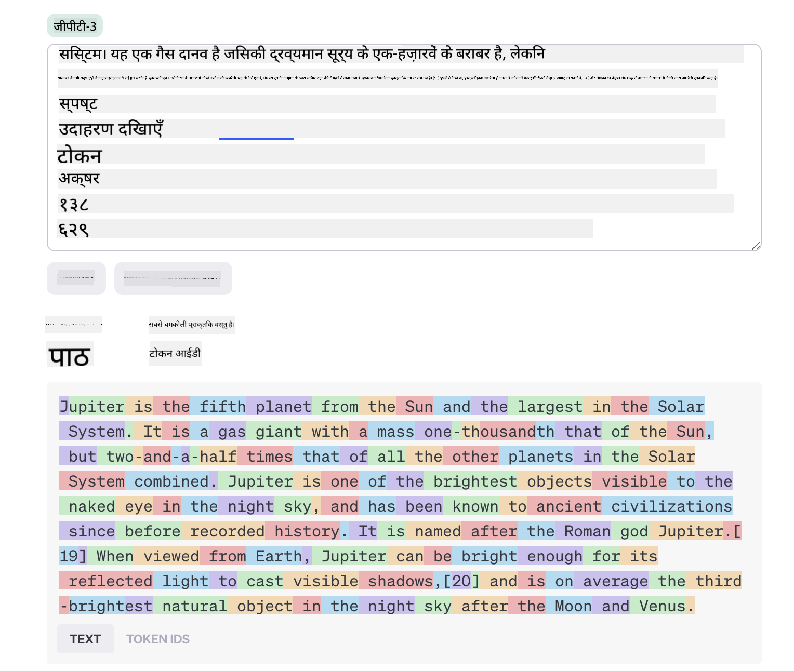
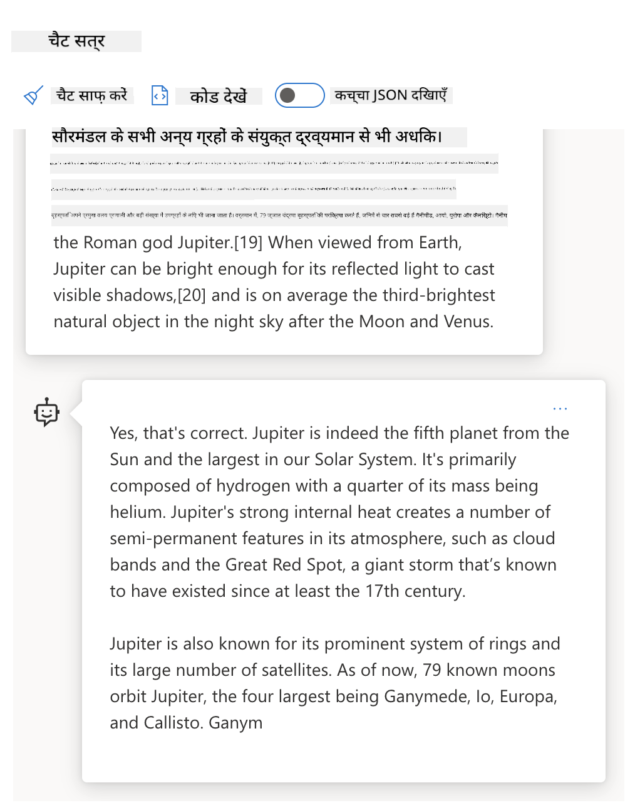
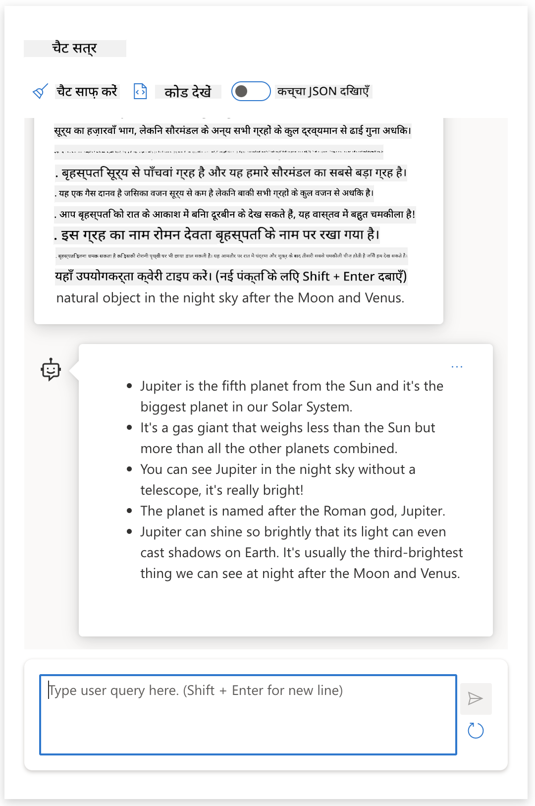
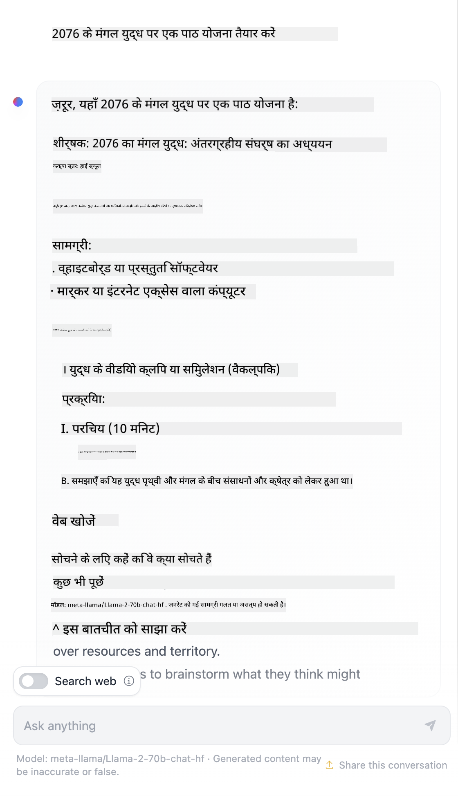

<!--
CO_OP_TRANSLATOR_METADATA:
{
  "original_hash": "0135e6c271f3ece8699050d4debbce88",
  "translation_date": "2025-10-18T00:18:26+00:00",
  "source_file": "04-prompt-engineering-fundamentals/README.md",
  "language_code": "hi"
}
-->
# प्रॉम्प्ट इंजीनियरिंग की मूल बातें

[](https://youtu.be/GElCu2kUlRs?si=qrXsBvXnCW12epb8)

## परिचय
यह मॉड्यूल जनरेटिव एआई मॉडल्स में प्रभावी प्रॉम्प्ट बनाने के लिए आवश्यक अवधारणाओं और तकनीकों को कवर करता है। जिस तरह से आप LLM को प्रॉम्प्ट लिखते हैं, वह भी मायने रखता है। एक सावधानीपूर्वक तैयार किया गया प्रॉम्प्ट बेहतर गुणवत्ता वाली प्रतिक्रिया प्राप्त कर सकता है। लेकिन वास्तव में _प्रॉम्प्ट_ और _प्रॉम्प्ट इंजीनियरिंग_ जैसे शब्दों का क्या मतलब है? और मैं LLM को भेजे गए प्रॉम्प्ट _इनपुट_ को कैसे सुधार सकता हूं? ये वे प्रश्न हैं जिनका उत्तर हम इस अध्याय और अगले अध्याय में देने की कोशिश करेंगे।

_जनरेटिव एआई_ उपयोगकर्ता अनुरोधों के जवाब में नया कंटेंट (जैसे, टेक्स्ट, इमेज, ऑडियो, कोड आदि) बनाने में सक्षम है। यह OpenAI के GPT ("Generative Pre-trained Transformer") सीरीज जैसे _बड़े भाषा मॉडल्स_ का उपयोग करके इसे प्राप्त करता है, जो प्राकृतिक भाषा और कोड का उपयोग करने के लिए प्रशिक्षित हैं।

अब उपयोगकर्ता इन मॉडलों के साथ चैट जैसे परिचित तरीकों का उपयोग करके बातचीत कर सकते हैं, बिना किसी तकनीकी विशेषज्ञता या प्रशिक्षण की आवश्यकता के। ये मॉडल _प्रॉम्प्ट-आधारित_ हैं - उपयोगकर्ता एक टेक्स्ट इनपुट (प्रॉम्प्ट) भेजते हैं और एआई प्रतिक्रिया (कम्प्लीशन) प्राप्त करते हैं। फिर वे "एआई के साथ चैट" कर सकते हैं, कई बार बातचीत में अपने प्रॉम्प्ट को तब तक सुधार सकते हैं जब तक प्रतिक्रिया उनकी अपेक्षाओं से मेल न खा जाए।

"प्रॉम्प्ट" अब जनरेटिव एआई ऐप्स के लिए प्राथमिक _प्रोग्रामिंग इंटरफेस_ बन जाते हैं, जो मॉडलों को क्या करना है और लौटाई गई प्रतिक्रियाओं की गुणवत्ता को प्रभावित करते हैं। "प्रॉम्प्ट इंजीनियरिंग" एक तेजी से बढ़ता हुआ अध्ययन क्षेत्र है जो _प्रॉम्प्ट्स के डिज़ाइन और अनुकूलन_ पर केंद्रित है ताकि बड़े पैमाने पर लगातार और गुणवत्ता वाली प्रतिक्रियाएं प्रदान की जा सकें।

## सीखने के लक्ष्य

इस पाठ में, हम सीखेंगे कि प्रॉम्प्ट इंजीनियरिंग क्या है, यह क्यों महत्वपूर्ण है, और हम किसी दिए गए मॉडल और एप्लिकेशन उद्देश्य के लिए अधिक प्रभावी प्रॉम्प्ट्स कैसे तैयार कर सकते हैं। हम प्रॉम्प्ट इंजीनियरिंग के मुख्य अवधारणाओं और सर्वोत्तम प्रथाओं को समझेंगे - और एक इंटरैक्टिव जुपिटर नोटबुक्स "सैंडबॉक्स" वातावरण के बारे में जानेंगे जहां हम इन अवधारणाओं को वास्तविक उदाहरणों पर लागू होते देख सकते हैं।

इस पाठ के अंत तक हम सक्षम होंगे:

1. समझाएं कि प्रॉम्प्ट इंजीनियरिंग क्या है और यह क्यों महत्वपूर्ण है।
2. प्रॉम्प्ट के घटकों का वर्णन करें और उनका उपयोग कैसे किया जाता है।
3. प्रॉम्प्ट इंजीनियरिंग के सर्वोत्तम प्रथाओं और तकनीकों को सीखें।
4. सीखे गए तकनीकों को वास्तविक उदाहरणों पर लागू करें, OpenAI एन्डपॉइंट का उपयोग करके।

## मुख्य शब्दावली

प्रॉम्प्ट इंजीनियरिंग: एआई मॉडल्स को वांछित आउटपुट उत्पन्न करने के लिए मार्गदर्शन देने हेतु इनपुट्स को डिज़ाइन और परिष्कृत करने का अभ्यास।  
टोकनाइजेशन: टेक्स्ट को छोटे इकाइयों में बदलने की प्रक्रिया, जिन्हें मॉडल समझ और प्रक्रिया कर सकता है।  
इंस्ट्रक्शन-ट्यूनड LLMs: बड़े भाषा मॉडल्स (LLMs) जिन्हें विशिष्ट निर्देशों के साथ फाइन-ट्यून किया गया है ताकि उनकी प्रतिक्रिया की सटीकता और प्रासंगिकता में सुधार हो सके।

## लर्निंग सैंडबॉक्स

प्रॉम्प्ट इंजीनियरिंग वर्तमान में विज्ञान से अधिक कला है। इसके लिए हमारी अंतर्दृष्टि को सुधारने का सबसे अच्छा तरीका है _अधिक अभ्यास करना_ और एक ट्रायल-एंड-एरर दृष्टिकोण अपनाना जो एप्लिकेशन डोमेन विशेषज्ञता को अनुशंसित तकनीकों और मॉडल-विशिष्ट अनुकूलन के साथ जोड़ता है।

इस पाठ के साथ आने वाला जुपिटर नोटबुक आपको एक _सैंडबॉक्स_ वातावरण प्रदान करता है जहां आप जो सीखते हैं उसे आजमा सकते हैं - जैसे-जैसे आप आगे बढ़ते हैं या पाठ के अंत में कोड चुनौती के हिस्से के रूप में। अभ्यासों को निष्पादित करने के लिए, आपको आवश्यकता होगी:

1. **एक Azure OpenAI API कुंजी** - एक तैनात LLM के लिए सेवा एन्डपॉइंट।  
2. **एक पायथन रनटाइम** - जिसमें नोटबुक को निष्पादित किया जा सके।  
3. **स्थानीय पर्यावरण चर** - _[सेटअप](./../00-course-setup/02-setup-local.md?WT.mc_id=academic-105485-koreyst) चरणों को अभी पूरा करें।_

नोटबुक में _स्टार्टर_ अभ्यास शामिल हैं - लेकिन आपको अपने स्वयं के _मार्कडाउन_ (विवरण) और _कोड_ (प्रॉम्प्ट अनुरोध) अनुभाग जोड़ने के लिए प्रोत्साहित किया जाता है ताकि अधिक उदाहरणों या विचारों को आजमाया जा सके - और प्रॉम्प्ट डिज़ाइन के लिए अपनी अंतर्दृष्टि का निर्माण किया जा सके।

## चित्रात्मक मार्गदर्शिका

क्या आप इस पाठ में शामिल मुख्य विषयों का बड़ा चित्र देखना चाहते हैं? इस चित्रात्मक मार्गदर्शिका को देखें, जो आपको मुख्य विषयों का एक विचार देती है और प्रत्येक में सोचने के लिए मुख्य बातें बताती है। पाठ का रोडमैप आपको मुख्य अवधारणाओं और चुनौतियों को समझने से लेकर प्रासंगिक प्रॉम्प्ट इंजीनियरिंग तकनीकों और सर्वोत्तम प्रथाओं के साथ उन्हें संबोधित करने तक ले जाता है। ध्यान दें कि इस मार्गदर्शिका में "उन्नत तकनीकें" अनुभाग इस पाठ्यक्रम के _अगले_ अध्याय में शामिल सामग्री को संदर्भित करता है।


## हमारा स्टार्टअप

अब, आइए बात करते हैं कि _यह विषय_ हमारे स्टार्टअप मिशन से [शिक्षा में एआई नवाचार लाने](https://educationblog.microsoft.com/2023/06/collaborating-to-bring-ai-innovation-to-education?WT.mc_id=academic-105485-koreyst) से कैसे संबंधित है। हम _व्यक्तिगत शिक्षा_ के एआई-संचालित एप्लिकेशन बनाना चाहते हैं - तो आइए सोचें कि हमारे एप्लिकेशन के विभिन्न उपयोगकर्ता प्रॉम्प्ट्स को कैसे "डिज़ाइन" कर सकते हैं:

- **प्रशासक** एआई से _पाठ्यक्रम डेटा का विश्लेषण करने और कवरेज में अंतराल की पहचान करने_ के लिए कह सकते हैं। एआई परिणामों का सारांश दे सकता है या उन्हें कोड के साथ विज़ुअलाइज़ कर सकता है।  
- **शिक्षक** एआई से _लक्षित दर्शकों और विषय के लिए पाठ योजना बनाने_ के लिए कह सकते हैं। एआई निर्दिष्ट प्रारूप में व्यक्तिगत योजना बना सकता है।  
- **छात्र** एआई से _कठिन विषय में उन्हें ट्यूटर करने_ के लिए कह सकते हैं। एआई अब छात्रों को उनके स्तर के अनुसार पाठ, संकेत और उदाहरणों के साथ मार्गदर्शन कर सकता है।  

यह तो बस शुरुआत है। [शिक्षा के लिए प्रॉम्प्ट्स](https://github.com/microsoft/prompts-for-edu/tree/main?WT.mc_id=academic-105485-koreyst) देखें - एक ओपन-सोर्स प्रॉम्प्ट्स लाइब्रेरी जो शिक्षा विशेषज्ञों द्वारा क्यूरेट की गई है - संभावनाओं की व्यापक समझ प्राप्त करने के लिए! _सैंडबॉक्स में या OpenAI प्लेग्राउंड का उपयोग करके उन प्रॉम्प्ट्स में से कुछ को चलाने की कोशिश करें और देखें कि क्या होता है!_

<!--
पाठ टेम्पलेट:
यह इकाई मुख्य अवधारणा #1 को कवर करनी चाहिए।
उदाहरण और संदर्भों के साथ अवधारणा को मजबूत करें।

अवधारणा #1:
प्रॉम्प्ट इंजीनियरिंग।
इसे परिभाषित करें और समझाएं कि इसकी आवश्यकता क्यों है।
-->

## प्रॉम्प्ट इंजीनियरिंग क्या है?

हमने इस पाठ की शुरुआत **प्रॉम्प्ट इंजीनियरिंग** को _टेक्स्ट इनपुट्स (प्रॉम्प्ट्स) को डिज़ाइन और अनुकूलित करने की प्रक्रिया_ के रूप में परिभाषित करके की, ताकि किसी दिए गए एप्लिकेशन उद्देश्य और मॉडल के लिए लगातार और गुणवत्ता वाली प्रतिक्रियाएं (कम्प्लीशन) प्रदान की जा सकें। हम इसे एक 2-चरणीय प्रक्रिया के रूप में सोच सकते हैं:

- _डिज़ाइन करना_ एक दिए गए मॉडल और उद्देश्य के लिए प्रारंभिक प्रॉम्प्ट।  
- _प्रतिक्रिया की गुणवत्ता में सुधार_ के लिए प्रॉम्प्ट को बार-बार परिष्कृत करना।  

यह अनिवार्य रूप से एक ट्रायल-एंड-एरर प्रक्रिया है जो इष्टतम परिणाम प्राप्त करने के लिए उपयोगकर्ता की अंतर्दृष्टि और प्रयास की आवश्यकता होती है। तो यह महत्वपूर्ण क्यों है? इस प्रश्न का उत्तर देने के लिए, हमें पहले तीन अवधारणाओं को समझने की आवश्यकता है:

- _टोकनाइजेशन_ = मॉडल प्रॉम्प्ट को कैसे "देखता" है।  
- _बेस LLMs_ = फाउंडेशन मॉडल प्रॉम्प्ट को कैसे "प्रोसेस" करता है।  
- _इंस्ट्रक्शन-ट्यूनड LLMs_ = मॉडल अब "कार्य" को कैसे देख सकता है।  

### टोकनाइजेशन

एक LLM प्रॉम्प्ट्स को _टोकन के अनुक्रम_ के रूप में देखता है, जहां विभिन्न मॉडल्स (या मॉडल का संस्करण) एक ही प्रॉम्प्ट को अलग-अलग तरीकों से टोकनाइज कर सकते हैं। चूंकि LLMs को टोकन पर प्रशिक्षित किया जाता है (और कच्चे टेक्स्ट पर नहीं), इसलिए प्रॉम्प्ट्स को टोकनाइज करने का तरीका उत्पन्न प्रतिक्रिया की गुणवत्ता पर सीधा प्रभाव डालता है।

टोकनाइजेशन कैसे काम करता है, इसका अंदाजा लगाने के लिए [OpenAI Tokenizer](https://platform.openai.com/tokenizer?WT.mc_id=academic-105485-koreyst) जैसे टूल्स आज़माएं। अपने प्रॉम्प्ट को कॉपी करें - और देखें कि वह टोकन में कैसे परिवर्तित होता है, ध्यान दें कि व्हाइटस्पेस कैरेक्टर्स और पंक्चुएशन मार्क्स को कैसे संभाला जाता है। ध्यान दें कि यह उदाहरण एक पुराने LLM (GPT-3) को दिखाता है - इसलिए इसे एक नए मॉडल के साथ आज़माने पर अलग परिणाम मिल सकते हैं।



### अवधारणा: फाउंडेशन मॉडल्स

एक बार प्रॉम्प्ट टोकनाइज हो जाने के बाद, ["बेस LLM"](https://blog.gopenai.com/an-introduction-to-base-and-instruction-tuned-large-language-models-8de102c785a6?WT.mc_id=academic-105485-koreyst) (या फाउंडेशन मॉडल) का प्राथमिक कार्य उस अनुक्रम में टोकन की भविष्यवाणी करना है। चूंकि LLMs को विशाल टेक्स्ट डेटासेट्स पर प्रशिक्षित किया गया है, उनके पास टोकन के बीच सांख्यिकीय संबंधों की अच्छी समझ होती है और वे उस भविष्यवाणी को कुछ आत्मविश्वास के साथ कर सकते हैं। ध्यान दें कि वे प्रॉम्प्ट या टोकन में शब्दों के _अर्थ_ को नहीं समझते हैं; वे केवल एक पैटर्न देखते हैं जिसे वे अपनी अगली भविष्यवाणी के साथ "पूरा" कर सकते हैं। वे तब तक अनुक्रम की भविष्यवाणी करना जारी रख सकते हैं जब तक उपयोगकर्ता हस्तक्षेप न करे या कोई पूर्व-स्थापित शर्त पूरी न हो जाए।

क्या आप देखना चाहते हैं कि प्रॉम्प्ट-आधारित कम्प्लीशन कैसे काम करता है? ऊपर दिए गए प्रॉम्प्ट को Azure OpenAI Studio [_Chat Playground_](https://oai.azure.com/playground?WT.mc_id=academic-105485-koreyst) में डिफ़ॉल्ट सेटिंग्स के साथ दर्ज करें। सिस्टम को प्रॉम्प्ट्स को जानकारी के अनुरोध के रूप में मानने के लिए कॉन्फ़िगर किया गया है - इसलिए आपको एक कम्प्लीशन देखना चाहिए जो इस संदर्भ को संतुष्ट करता है।

लेकिन क्या होगा अगर उपयोगकर्ता कुछ विशिष्ट देखना चाहता है जो कुछ मानदंडों या कार्य उद्देश्य को पूरा करता हो? यही वह जगह है जहां _इंस्ट्रक्शन-ट्यूनड_ LLMs तस्वीर में आते हैं।



### अवधारणा: इंस्ट्रक्शन ट्यूनड LLMs

एक [इंस्ट्रक्शन ट्यूनड LLM](https://blog.gopenai.com/an-introduction-to-base-and-instruction-tuned-large-language-models-8de102c785a6?WT.mc_id=academic-105485-koreyst) फाउंडेशन मॉडल से शुरू होता है और इसे उदाहरणों या इनपुट/आउटपुट जोड़े (जैसे, मल्टी-टर्न "मैसेजेस") के साथ फाइन-ट्यून करता है जो स्पष्ट निर्देशों को शामिल कर सकते हैं - और एआई का प्रयास उस निर्देश का पालन करने के लिए प्रतिक्रिया देने का होता है।

यह तकनीकों जैसे Reinforcement Learning with Human Feedback (RLHF) का उपयोग करता है जो मॉडल को _निर्देशों का पालन करने_ और _फीडबैक से सीखने_ के लिए प्रशिक्षित कर सकता है ताकि यह प्रतिक्रियाएं उत्पन्न करे जो व्यावहारिक अनुप्रयोगों के लिए बेहतर अनुकूल हों और उपयोगकर्ता उद्देश्यों के लिए अधिक प्रासंगिक हों।

आइए इसे आजमाएं - ऊपर दिए गए प्रॉम्प्ट पर फिर से जाएं, लेकिन अब _सिस्टम मैसेज_ को निम्नलिखित निर्देश के रूप में संदर्भ प्रदान करने के लिए बदलें:

> _आपको प्रदान की गई सामग्री को दूसरे ग्रेड के छात्र के लिए सारांशित करें। परिणाम को एक पैराग्राफ में 3-5 बुलेट पॉइंट्स के साथ रखें।_

देखें कि परिणाम अब वांछित लक्ष्य और प्रारूप को कैसे दर्शाता है? एक शिक्षक अब सीधे इस प्रतिक्रिया का उपयोग अपनी कक्षा के लिए स्लाइड्स में कर सकता है।



## हमें प्रॉम्प्ट इंजीनियरिंग की आवश्यकता क्यों है?

अब जब हम जानते हैं कि LLMs प्रॉम्प्ट्स को कैसे प्रोसेस करते हैं, तो आइए बात करते हैं कि _हमें प्रॉम्प्ट इंजीनियरिंग की आवश्यकता क्यों है।_ इसका उत्तर इस तथ्य में निहित है कि वर्तमान LLMs कई चुनौतियां पेश करते हैं जो _विश्वसनीय और सुसंगत कम्प्लीशन_ को प्राप्त करना अधिक चुनौतीपूर्ण बनाते हैं, बिना प्रॉम्प्ट निर्माण और अनुकूलन में प्रयास किए। उदाहरण के लिए:

1. **मॉडल प्रतिक्रियाएं स्टोकेस्टिक होती हैं।** _एक ही प्रॉम्प्ट_ संभवतः विभिन्न मॉडलों या मॉडल संस्करणों के साथ अलग-अलग प्रतिक्रियाएं उत्पन्न करेगा। और यह _एक ही मॉडल_ के साथ अलग-अलग समय पर भी अलग-अलग परिणाम उत्पन्न कर सकता है। _प्रॉम्प्ट इंजीनियरिंग तकनीकें हमें इन भिन्नताओं को बेहतर गार्डरेल्स प्रदान करके कम करने में मदद कर सकती हैं।_

1. **मॉडल प्रतिक्रियाओं का निर्माण कर सकते हैं।** मॉडल्स को _बड़े लेकिन सीमित_ डेटासेट्स के साथ प्री-ट्रेन किया गया है, जिसका अर्थ है कि उनके पास उस प्रशिक्षण दायरे के बाहर की अवधारणाओं के बारे में ज्ञान की कमी है। परिणामस्वरूप, वे कम्प्लीशन उत्पन्न कर सकते हैं जो गलत, काल्पनिक, या ज्ञात तथ्यों के सीधे विरोधाभासी हो सकते हैं। _प्रॉम्प्ट इंजीनियरिंग तकनीकें उपयोगकर्ताओं को ऐसी निर्माणों की पहचान करने और उन्हें कम करने में मदद करती हैं, जैसे कि एआई से उद्धरण या तर्क पूछना।_

1. **मॉडल की क्षमताएं भिन्न होंगी।** नए मॉडल्स या मॉडल पीढ़ियों में समृद्ध क्षमताएं होंगी लेकिन लागत और जटिलता में अद्वितीय विचित्रताओं और समझौतों को भी लाएंगी। _प्रॉम्प्ट इंजीनियरिंग हमें सर्वोत्तम प्रथाओं और वर्कफ़्लो विकसित करने में मदद कर सकती है जो अंतर को दूर करते हैं और मॉडल-विशिष्ट आवश्यकताओं को स्केलेबल, सहज तरीके से अनुकूलित करते हैं।_

आइए इसे OpenAI या Azure OpenAI Playground में देखें:

- एक ही प्रॉम्प्ट का उपयोग विभिन्न LLM डिप्लॉयमेंट्स (जैसे, OpenAI, Azure OpenAI, Hugging Face) के साथ करें - क्या आपने भिन्नताओं को देखा?  
- एक ही प्रॉम्प्ट का बार-बार उपयोग _एक ही_ LLM डिप्लॉयमेंट (जैसे, Azure OpenAI Playground) के साथ करें - ये भिन्नताएं कैसे अलग थीं?  

### निर्माण का उदाहरण

इस पाठ में, हम **"निर्माण"** शब्द का उपयोग उस घटना को संदर्भित करने के लिए करते हैं जहां LLMs कभी-कभी अपने प्रशिक्षण की सीमाओं या अन्य बाधाओं के कारण तथ्यात्मक रूप से गलत जानकारी उत्पन्न करते हैं। आपने इसे लोकप्रिय लेखों या
एक वेब खोज से पता चला कि मंगल ग्रह के युद्धों पर काल्पनिक कहानियां (जैसे, टेलीविजन श्रृंखला या किताबें) मौजूद हैं - लेकिन 2076 में कोई नहीं। सामान्य ज्ञान से भी पता चलता है कि 2076 _भविष्य_ में है और इसलिए इसे किसी वास्तविक घटना से नहीं जोड़ा जा सकता।

तो क्या होता है जब हम इस प्रॉम्प्ट को विभिन्न LLM प्रदाताओं के साथ चलाते हैं?

> **प्रतिक्रिया 1**: OpenAI Playground (GPT-35)


> **प्रतिक्रिया 2**: Azure OpenAI Playground (GPT-35)


> **प्रतिक्रिया 3**: Hugging Face Chat Playground (LLama-2)



जैसा कि अपेक्षित था, प्रत्येक मॉडल (या मॉडल संस्करण) थोड़ा अलग प्रतिक्रिया उत्पन्न करता है, जो स्टोकेस्टिक व्यवहार और मॉडल क्षमता में भिन्नताओं के कारण होता है। उदाहरण के लिए, एक मॉडल 8वीं कक्षा के दर्शकों को लक्षित करता है जबकि दूसरा हाई-स्कूल के छात्रों को ध्यान में रखता है। लेकिन सभी तीन मॉडलों ने ऐसी प्रतिक्रियाएं उत्पन्न कीं जो एक अनजान उपयोगकर्ता को यह विश्वास दिला सकती थीं कि घटना वास्तविक थी।

प्रॉम्प्ट इंजीनियरिंग तकनीकें जैसे _मेटाप्रॉम्प्टिंग_ और _टेम्परेचर कॉन्फ़िगरेशन_ मॉडल की गलतियों को कुछ हद तक कम कर सकती हैं। नई प्रॉम्प्ट इंजीनियरिंग _आर्किटेक्चर_ भी प्रॉम्प्ट प्रवाह में नए उपकरण और तकनीकों को सहजता से शामिल करती हैं, ताकि इन प्रभावों को कम किया जा सके।

## केस स्टडी: GitHub Copilot

इस अनुभाग को समाप्त करते हुए, आइए देखें कि वास्तविक दुनिया के समाधान में प्रॉम्प्ट इंजीनियरिंग का उपयोग कैसे किया जाता है। इसके लिए एक केस स्टडी पर नज़र डालते हैं: [GitHub Copilot](https://github.com/features/copilot?WT.mc_id=academic-105485-koreyst)।

GitHub Copilot आपका "AI पेयर प्रोग्रामर" है - यह टेक्स्ट प्रॉम्प्ट को कोड कंप्लीशन में बदलता है और आपके डेवलपमेंट एनवायरनमेंट (जैसे, Visual Studio Code) में एक सहज उपयोगकर्ता अनुभव के लिए एकीकृत होता है। नीचे दिए गए ब्लॉग श्रृंखला में दस्तावेज़ित किया गया है कि इसका शुरुआती संस्करण OpenAI Codex मॉडल पर आधारित था - जिसमें इंजीनियरों ने जल्दी ही मॉडल को बेहतर बनाने और कोड की गुणवत्ता सुधारने के लिए बेहतर प्रॉम्प्ट इंजीनियरिंग तकनीकों को विकसित करने की आवश्यकता को महसूस किया। जुलाई में, उन्होंने [एक बेहतर AI मॉडल पेश किया जो Codex से आगे जाता है](https://github.blog/2023-07-28-smarter-more-efficient-coding-github-copilot-goes-beyond-codex-with-improved-ai-model/?WT.mc_id=academic-105485-koreyst) और तेज सुझाव प्रदान करता है।

उनकी सीखने की यात्रा का अनुसरण करने के लिए पोस्ट को क्रम में पढ़ें।

- **मई 2023** | [GitHub Copilot आपके कोड को समझने में बेहतर हो रहा है](https://github.blog/2023-05-17-how-github-copilot-is-getting-better-at-understanding-your-code/?WT.mc_id=academic-105485-koreyst)
- **मई 2023** | [GitHub के अंदर: GitHub Copilot के पीछे LLMs के साथ काम करना](https://github.blog/2023-05-17-inside-github-working-with-the-llms-behind-github-copilot/?WT.mc_id=academic-105485-koreyst)
- **जून 2023** | [GitHub Copilot के लिए बेहतर प्रॉम्प्ट कैसे लिखें](https://github.blog/2023-06-20-how-to-write-better-prompts-for-github-copilot/?WT.mc_id=academic-105485-koreyst)
- **जुलाई 2023** | [.. GitHub Copilot बेहतर AI मॉडल के साथ Codex से आगे बढ़ता है](https://github.blog/2023-07-28-smarter-more-efficient-coding-github-copilot-goes-beyond-codex-with-improved-ai-model/?WT.mc_id=academic-105485-koreyst)
- **जुलाई 2023** | [डेवलपर के लिए प्रॉम्प्ट इंजीनियरिंग और LLMs गाइड](https://github.blog/2023-07-17-prompt-engineering-guide-generative-ai-llms/?WT.mc_id=academic-105485-koreyst)
- **सितंबर 2023** | [एक एंटरप्राइज LLM ऐप कैसे बनाएं: GitHub Copilot से सबक](https://github.blog/2023-09-06-how-to-build-an-enterprise-llm-application-lessons-from-github-copilot/?WT.mc_id=academic-105485-koreyst)

आप उनके [इंजीनियरिंग ब्लॉग](https://github.blog/category/engineering/?WT.mc_id=academic-105485-koreyst) को भी ब्राउज़ कर सकते हैं, जैसे [यह पोस्ट](https://github.blog/2023-09-27-how-i-used-github-copilot-chat-to-build-a-reactjs-gallery-prototype/?WT.mc_id=academic-105485-koreyst) जो दिखाता है कि इन मॉडलों और तकनीकों का उपयोग वास्तविक दुनिया के अनुप्रयोगों को चलाने के लिए कैसे किया जाता है।

---

## प्रॉम्प्ट निर्माण

हमने देखा कि प्रॉम्प्ट इंजीनियरिंग क्यों महत्वपूर्ण है - अब समझते हैं कि प्रॉम्प्ट कैसे _निर्मित_ किए जाते हैं ताकि हम अधिक प्रभावी प्रॉम्प्ट डिज़ाइन के लिए विभिन्न तकनीकों का मूल्यांकन कर सकें।

### बेसिक प्रॉम्प्ट

आइए बेसिक प्रॉम्प्ट से शुरू करें: एक टेक्स्ट इनपुट जो मॉडल को बिना किसी अन्य संदर्भ के भेजा जाता है। यहां एक उदाहरण है - जब हम अमेरिकी राष्ट्रीय गान के पहले कुछ शब्द OpenAI [Completion API](https://platform.openai.com/docs/api-reference/completions?WT.mc_id=academic-105485-koreyst) को भेजते हैं, तो यह तुरंत प्रतिक्रिया को _पूरा_ करता है और अगले कुछ पंक्तियों को प्रदर्शित करता है, जो बुनियादी भविष्यवाणी व्यवहार को दर्शाता है।

| प्रॉम्प्ट (इनपुट) | प्रतिक्रिया (आउटपुट)                                                                                                                        |
| :----------------- | :----------------------------------------------------------------------------------------------------------------------------------------- |
| Oh say can you see | ऐसा लगता है कि आप "द स्टार-स्पैंगल्ड बैनर," संयुक्त राज्य अमेरिका के राष्ट्रीय गान के गीत शुरू कर रहे हैं। पूरे गीत हैं ... |

### जटिल प्रॉम्प्ट

अब आइए उस बेसिक प्रॉम्प्ट में संदर्भ और निर्देश जोड़ें। [Chat Completion API](https://learn.microsoft.com/azure/ai-services/openai/how-to/chatgpt?WT.mc_id=academic-105485-koreyst) हमें एक जटिल प्रॉम्प्ट को _संदेशों_ के संग्रह के रूप में बनाने की अनुमति देता है जिसमें शामिल हैं:

- इनपुट/आउटपुट जोड़े जो _उपयोगकर्ता_ इनपुट और _सहायक_ प्रतिक्रिया को दर्शाते हैं।
- सहायक व्यवहार या व्यक्तित्व के संदर्भ को सेट करने वाला सिस्टम संदेश।

अब अनुरोध नीचे दिए गए रूप में है, जहां _टोकनाइजेशन_ प्रभावी रूप से संदर्भ और बातचीत से संबंधित जानकारी को कैप्चर करता है। अब, सिस्टम संदर्भ को बदलना प्रतिक्रिया की गुणवत्ता पर उतना ही प्रभाव डाल सकता है जितना कि उपयोगकर्ता द्वारा प्रदान किए गए इनपुट।

```python
response = openai.chat.completions.create(
    model="gpt-3.5-turbo",
    messages=[
        {"role": "system", "content": "You are a helpful assistant."},
        {"role": "user", "content": "Who won the world series in 2020?"},
        {"role": "assistant", "content": "The Los Angeles Dodgers won the World Series in 2020."},
        {"role": "user", "content": "Where was it played?"}
    ]
)
```

### निर्देश प्रॉम्प्ट

ऊपर दिए गए उदाहरणों में, उपयोगकर्ता प्रॉम्प्ट एक साधारण टेक्स्ट क्वेरी थी जिसे जानकारी के अनुरोध के रूप में व्याख्या किया जा सकता है। _निर्देश_ प्रॉम्प्ट के साथ, हम उस टेक्स्ट का उपयोग करके कार्य को अधिक विस्तार से निर्दिष्ट कर सकते हैं, जिससे AI को बेहतर मार्गदर्शन मिल सके। यहां एक उदाहरण है:

| प्रॉम्प्ट (इनपुट)                                                                                                                                                                                                                         | प्रतिक्रिया (आउटपुट)                                                                                                        | निर्देश प्रकार    |
| :------------------------------------------------------------------------------------------------------------------------------------------------------------------------------------------------------------------------------------- | :------------------------------------------------------------------------------------------------------------------------- | :------------------ |
| Write a description of the Civil War                                                                                                                                                                                                   | _एक साधारण पैराग्राफ लौटाया गया_                                                                                              | साधारण              |
| Write a description of the Civil War. Provide key dates and events and describe their significance                                                                                                                                     | _एक पैराग्राफ और प्रमुख घटनाओं की तारीखों और उनके विवरणों की सूची लौटाई गई_                                             | जटिल             |
| Write a description of the Civil War in 1 paragraph. Provide 3 bullet points with key dates and their significance. Provide 3 more bullet points with key historical figures and their contributions. Return the output as a JSON file | _अधिक विस्तृत विवरण एक टेक्स्ट बॉक्स में लौटाया गया, JSON के रूप में स्वरूपित जिसे आप कॉपी-पेस्ट करके फाइल में डाल सकते हैं और आवश्यकतानुसार सत्यापित कर सकते हैं_ | जटिल। स्वरूपित। |

## प्राथमिक सामग्री

ऊपर दिए गए उदाहरणों में, प्रॉम्प्ट अभी भी काफी खुला था, जिससे LLM को यह तय करने की अनुमति मिली कि उसके प्री-ट्रेंड डेटासेट का कौन सा हिस्सा प्रासंगिक है। _प्राथमिक सामग्री_ डिज़ाइन पैटर्न के साथ, इनपुट टेक्स्ट को दो भागों में विभाजित किया जाता है:

- एक निर्देश (कार्य)
- प्रासंगिक सामग्री (जो कार्य को प्रभावित करती है)

यहां एक उदाहरण है जहां निर्देश है "इसे 2 वाक्यों में सारांशित करें"।

| प्रॉम्प्ट (इनपुट)                                                                                                                                                                                                                                                                                                                                                                                                                                                                                                                                                                                                                                                                                      | प्रतिक्रिया (आउटपुट)                                                                                                                                                                                                                                                                             |
| :-------------------------------------------------------------------------------------------------------------------------------------------------------------------------------------------------------------------------------------------------------------------------------------------------------------------------------------------------------------------------------------------------------------------------------------------------------------------------------------------------------------------------------------------------------------------------------------------------------------------------------------------------------------------------------------------------- | :---------------------------------------------------------------------------------------------------------------------------------------------------------------------------------------------------------------------------------------------------------------------------------------------- |
| Jupiter सूर्य से पांचवां ग्रह और सौर मंडल में सबसे बड़ा है। यह एक गैस विशाल है जिसका द्रव्यमान सूर्य का एक-हजारवां है, लेकिन सौर मंडल के सभी अन्य ग्रहों के संयुक्त द्रव्यमान का दो-गुना है। बृहस्पति नग्न आंखों से रात के आकाश में दिखाई देने वाली सबसे चमकीली वस्तुओं में से एक है, और इसे प्राचीन सभ्यताओं द्वारा दर्ज इतिहास से पहले से जाना जाता है। इसका नाम रोमन देवता बृहस्पति के नाम पर रखा गया है। जब पृथ्वी से देखा जाता है, तो बृहस्पति इतना चमकीला हो सकता है कि इसकी परावर्तित रोशनी दिखाई देने वाली छाया डाल सके, और औसतन यह चंद्रमा और शुक्र के बाद रात के आकाश में तीसरी सबसे चमकीली प्राकृतिक वस्तु है। <br/> **इसे 2 छोटे वाक्यों में सारांशित करें** | बृहस्पति, सूर्य से पांचवां ग्रह, सौर मंडल में सबसे बड़ा है और रात के आकाश में सबसे चमकीली वस्तुओं में से एक है। रोमन देवता बृहस्पति के नाम पर रखा गया, यह एक गैस विशाल है जिसका द्रव्यमान सौर मंडल के सभी अन्य ग्रहों के संयुक्त द्रव्यमान का दो-गुना है। |

प्राथमिक सामग्री खंड का उपयोग अधिक प्रभावी निर्देशों को चलाने के लिए विभिन्न तरीकों से किया जा सकता है:

- **उदाहरण** - मॉडल को स्पष्ट निर्देश देने के बजाय, वांछित आउटपुट के कुछ उदाहरण दें और इसे पैटर्न का अनुमान लगाने दें।
- **संकेत** - निर्देश के बाद एक "संकेत" दें जो प्रतिक्रिया को प्रासंगिक उत्तरों की ओर मार्गदर्शन करता है।
- **टेम्पलेट्स** - ये प्रॉम्प्ट के लिए दोहराने योग्य 'रेसिपी' हैं जिनमें प्लेसहोल्डर (वेरिएबल्स) होते हैं जिन्हें विशिष्ट उपयोग मामलों के लिए डेटा के साथ अनुकूलित किया जा सकता है।

आइए इनका उपयोग करके देखें।

### उदाहरणों का उपयोग करना

यह एक दृष्टिकोण है जहां आप प्राथमिक सामग्री का उपयोग करके मॉडल को वांछित आउटपुट के कुछ उदाहरण "फीड" करते हैं और इसे वांछित आउटपुट के पैटर्न का अनुमान लगाने देते हैं। प्रदान किए गए उदाहरणों की संख्या के आधार पर, हमारे पास जीरो-शॉट प्रॉम्प्टिंग, वन-शॉट प्रॉम्प्टिंग, फ्यू-शॉट प्रॉम्प्टिंग आदि हो सकते हैं।

अब प्रॉम्प्ट में तीन घटक होते हैं:

- एक कार्य विवरण
- वांछित आउटपुट के कुछ उदाहरण
- एक नए उदाहरण की शुरुआत (जो एक अप्रत्यक्ष कार्य विवरण बन जाता है)

| सीखने का प्रकार | प्रॉम्प्ट (इनपुट)                                                                                                                                        | प्रतिक्रिया (आउटपुट)         |
| :------------ | :---------------------------------------------------------------------------------------------------------------------------------------------------- | :-------------------------- |
| जीरो-शॉट     | "The Sun is Shining". Translate to Spanish                                                                                                            | "El Sol está brillando".    |
| वन-शॉट      | "The Sun is Shining" => ""El Sol está brillando". <br> "It's a Cold and Windy Day" =>                                                                 | "Es un día frío y ventoso". |
| फ्यू-शॉट      | The player ran the bases => Baseball <br/> The player hit an ace => Tennis <br/> The player hit a six => Cricket <br/> The player made a slam-dunk => | Basketball                  |
|               |                                                                                                                                                       |                             |

ध्यान दें कि हमें जीरो-शॉट प्रॉम्प्टिंग में स्पष्ट निर्देश ("स्पेनिश में अनुवाद करें") प्रदान करना पड़ा, लेकिन यह वन-शॉट प्रॉम्प्टिंग उदाहरण में अनुमानित हो गया। फ्यू-शॉट उदाहरण दिखाता है कि अधिक उदाहरण जोड़ने से मॉडल को अधिक सटीक अनुमान लगाने में मदद मिलती है, बिना अतिरिक्त निर्देश दिए।

### प्रॉम्प्ट संकेत

प्राथमिक सामग्री का उपयोग करने की एक और तकनीक _संकेत_ प्रदान करना है बजाय उदाहरणों के। इस मामले में, हम मॉडल को वांछित प्रतिक्रिया प्रारूप को दर्शाने वाले एक स्निपेट के साथ _शुरू_ करके सही दिशा में "धक्का" दे रहे हैं। मॉडल फिर उस संकेत को लेकर उसी प्रकार की प्रतिक्रिया देता है।

| संकेतों की संख्या | प्रॉम्प्ट (इनपुट)                                                                                                                                                                                                                                                                                                                                                                                                                                               | प्रतिक्रिया (आउटपुट)                                                                                                                                                                                                                                                                                       |
| :------------- | :----------------------------------------------------------------------------------------------------------------------------------------------------------------------------------------------------------------------------------------------------------------------------------------------------------------------------------------------------------------------------------------------------------------------------------------------------------- | :-------------------------------------------------------------------------------------------------------------------------------------------------------------------------------------------------------------------------------------------------------------------------------------------------------- |
| 0              | Jupiter सूर्य से पांचवां ग्रह और सौर मंडल में सबसे बड़ा है। यह एक गैस विशाल है जिसका द्रव्यमान सूर्य का एक-हजारवां है, लेकिन सौर मंडल के सभी अन्य ग्रहों के संयुक्त द्रव्यमान का दो-गुना है। बृहस्पति नग्न आंखों से रात के आकाश में दिखाई देने वाली सबसे चमकीली वस्तुओं में से एक है, और इसे प्राचीन सभ्यताओं द्वारा दर्ज इतिहास से पहले से जाना जाता है। <br/>**इसे सारांशित करें**                                       | बृहस्पति सौर मंडल का सबसे बड़ा ग्रह है और सूर्य से पांचवां ग्रह है। यह एक गैस विशाल है जिसका द्रव्यमान सौर मंडल के अन्य सभी ग्रहों के संयुक्त द्रव्यमान से दो गुना अधिक है। प्राचीन सभ्यताओं द्वारा इसे लंबे समय से जाना जाता है और यह रात के आकाश में आसानी से दिखाई देता है। |
| 1              | बृहस्पति सूर्य से पांचवां ग्रह है और सौर मंडल का सबसे बड़ा ग्रह है। यह एक गैस दानव है जिसका द्रव्यमान सूर्य का एक-हज़ारवां हिस्सा है, लेकिन सौर मंडल के अन्य सभी ग्रहों के संयुक्त द्रव्यमान से ढाई गुना अधिक है। बृहस्पति रात के आकाश में नग्न आंखों से दिखाई देने वाली सबसे चमकीली वस्तुओं में से एक है, और इसे प्राचीन सभ्यताओं द्वारा इतिहास दर्ज होने से पहले से जाना जाता है। <br/>**इसका सारांश बनाएं** <br/> हमने जो सीखा वह यह है कि बृहस्पति | सूर्य से पांचवां ग्रह है और सौर मंडल का सबसे बड़ा ग्रह है। यह एक गैस दानव है जिसका द्रव्यमान सूर्य का एक-हज़ारवां हिस्सा है, लेकिन अन्य सभी ग्रहों के संयुक्त द्रव्यमान से ढाई गुना अधिक है। यह नग्न आंखों से आसानी से दिखाई देता है और इसे प्राचीन काल से जाना जाता है।                        |
| 2              | बृहस्पति सूर्य से पांचवां ग्रह है और सौर मंडल का सबसे बड़ा ग्रह है। यह एक गैस दानव है जिसका द्रव्यमान सूर्य का एक-हज़ारवां हिस्सा है, लेकिन सौर मंडल के अन्य सभी ग्रहों के संयुक्त द्रव्यमान से ढाई गुना अधिक है। बृहस्पति रात के आकाश में नग्न आंखों से दिखाई देने वाली सबसे चमकीली वस्तुओं में से एक है, और इसे प्राचीन सभ्यताओं द्वारा इतिहास दर्ज होने से पहले से जाना जाता है। <br/>**इसका सारांश बनाएं** <br/> हमने जो शीर्ष 3 तथ्य सीखे:         | 1. बृहस्पति सूर्य से पांचवां ग्रह है और सौर मंडल का सबसे बड़ा ग्रह है। <br/> 2. यह एक गैस दानव है जिसका द्रव्यमान सूर्य का एक-हज़ारवां हिस्सा है...<br/> 3. बृहस्पति प्राचीन काल से नग्न आंखों से दिखाई देता रहा है ...                                                                       |
|                |                                                                                                                                                                                                                                                                                                                                                                                                                                                              |                                                                                                                                                                                                                                                                                                           |

### प्रॉम्प्ट टेम्पलेट्स

एक प्रॉम्प्ट टेम्पलेट एक _पूर्व-निर्धारित प्रॉम्प्ट का नुस्खा_ है जिसे आवश्यकतानुसार संग्रहीत और पुन: उपयोग किया जा सकता है, ताकि बड़े पैमाने पर अधिक सुसंगत उपयोगकर्ता अनुभव प्राप्त किया जा सके। इसके सबसे सरल रूप में, यह केवल प्रॉम्प्ट उदाहरणों का संग्रह है जैसे [OpenAI का यह उदाहरण](https://platform.openai.com/examples?WT.mc_id=academic-105485-koreyst) जो इंटरैक्टिव प्रॉम्प्ट घटकों (उपयोगकर्ता और सिस्टम संदेश) और API-चालित अनुरोध प्रारूप दोनों प्रदान करता है - पुन: उपयोग का समर्थन करने के लिए।

इसके अधिक जटिल रूप में जैसे [LangChain का यह उदाहरण](https://python.langchain.com/docs/concepts/prompt_templates/?WT.mc_id=academic-105485-koreyst) इसमें _प्लेसहोल्डर्स_ होते हैं जिन्हें विभिन्न स्रोतों (उपयोगकर्ता इनपुट, सिस्टम संदर्भ, बाहरी डेटा स्रोत आदि) से डेटा के साथ प्रतिस्थापित किया जा सकता है ताकि प्रॉम्प्ट को गतिशील रूप से उत्पन्न किया जा सके। यह हमें पुन: उपयोग योग्य प्रॉम्प्ट्स की एक लाइब्रेरी बनाने की अनुमति देता है जिसका उपयोग बड़े पैमाने पर सुसंगत उपयोगकर्ता अनुभव को **प्रोग्रामेटिक रूप से** चलाने के लिए किया जा सकता है।

अंत में, टेम्पलेट्स का वास्तविक मूल्य _प्रॉम्प्ट लाइब्रेरी_ बनाने और प्रकाशित करने की क्षमता में निहित है जो वर्टिकल एप्लिकेशन डोमेन के लिए है - जहां प्रॉम्प्ट टेम्पलेट अब _अनुकूलित_ है ताकि एप्लिकेशन-विशिष्ट संदर्भ या उदाहरणों को प्रतिबिंबित किया जा सके जो लक्षित उपयोगकर्ता दर्शकों के लिए प्रतिक्रियाओं को अधिक प्रासंगिक और सटीक बनाते हैं। [Prompts For Edu](https://github.com/microsoft/prompts-for-edu?WT.mc_id=academic-105485-koreyst) रिपॉजिटरी इस दृष्टिकोण का एक शानदार उदाहरण है, जो शिक्षा डोमेन के लिए प्रॉम्प्ट्स की एक लाइब्रेरी को क्यूरेट करता है और पाठ योजना, पाठ्यक्रम डिजाइन, छात्र ट्यूटरिंग आदि जैसे प्रमुख उद्देश्यों पर जोर देता है।

## सहायक सामग्री

यदि हम प्रॉम्प्ट निर्माण को एक निर्देश (कार्य) और एक लक्ष्य (प्राथमिक सामग्री) के रूप में सोचते हैं, तो _माध्यमिक सामग्री_ अतिरिक्त संदर्भ की तरह है जिसे हम **आउटपुट को किसी न किसी तरीके से प्रभावित करने के लिए** प्रदान करते हैं। यह ट्यूनिंग पैरामीटर, स्वरूपण निर्देश, विषय वर्गीकरण आदि हो सकता है जो मॉडल को _प्रतिक्रिया को उपयोगकर्ता के इच्छित उद्देश्यों या अपेक्षाओं के अनुरूप_ बनाने में मदद कर सकता है।

उदाहरण के लिए: यदि हमारे पास पाठ्यक्रम कैटलॉग है जिसमें पाठ्यक्रम में उपलब्ध सभी पाठ्यक्रमों के नाम, विवरण, स्तर, मेटाडेटा टैग, प्रशिक्षक आदि का विस्तृत मेटाडेटा है:

- हम "Fall 2023 के लिए पाठ्यक्रम कैटलॉग का सारांश बनाएं" का निर्देश परिभाषित कर सकते हैं।
- हम प्राथमिक सामग्री का उपयोग वांछित आउटपुट के कुछ उदाहरण प्रदान करने के लिए कर सकते हैं।
- हम माध्यमिक सामग्री का उपयोग रुचि के शीर्ष 5 "टैग्स" की पहचान करने के लिए कर सकते हैं।

अब, मॉडल कुछ उदाहरणों द्वारा दिखाए गए प्रारूप में सारांश प्रदान कर सकता है - लेकिन यदि किसी परिणाम में कई टैग्स हैं, तो यह माध्यमिक सामग्री में पहचाने गए 5 टैग्स को प्राथमिकता दे सकता है।

---

<!--
पाठ टेम्पलेट:
इस इकाई को मुख्य अवधारणा #1 को कवर करना चाहिए।
उदाहरण और संदर्भों के साथ अवधारणा को सुदृढ़ करें।

अवधारणा #3:
प्रॉम्प्ट इंजीनियरिंग तकनीकें।
प्रॉम्प्ट इंजीनियरिंग की कुछ बुनियादी तकनीकें क्या हैं?
इसे कुछ अभ्यासों के साथ चित्रित करें।
-->

## प्रॉम्प्टिंग के सर्वोत्तम अभ्यास

अब जब हम जानते हैं कि प्रॉम्प्ट्स को कैसे _निर्मित_ किया जा सकता है, तो हम यह सोच सकते हैं कि उन्हें _डिज़ाइन_ कैसे किया जाए ताकि सर्वोत्तम अभ्यासों को प्रतिबिंबित किया जा सके। हम इसे दो भागों में सोच सकते हैं - सही _सोच_ रखना और सही _तकनीकों_ को लागू करना।

### प्रॉम्प्ट इंजीनियरिंग की सोच

प्रॉम्प्ट इंजीनियरिंग एक ट्रायल-एंड-एरर प्रक्रिया है, इसलिए तीन व्यापक मार्गदर्शक कारकों को ध्यान में रखें:

1. **डोमेन की समझ महत्वपूर्ण है।** प्रतिक्रिया की सटीकता और प्रासंगिकता उस _डोमेन_ का कार्य है जिसमें वह एप्लिकेशन या उपयोगकर्ता संचालित होता है। अपनी अंतर्दृष्टि और डोमेन विशेषज्ञता का उपयोग करके तकनीकों को **अनुकूलित करें**। उदाहरण के लिए, अपने सिस्टम प्रॉम्प्ट्स में _डोमेन-विशिष्ट व्यक्तित्व_ परिभाषित करें, या अपने उपयोगकर्ता प्रॉम्प्ट्स में _डोमेन-विशिष्ट टेम्पलेट्स_ का उपयोग करें। माध्यमिक सामग्री प्रदान करें जो डोमेन-विशिष्ट संदर्भों को प्रतिबिंबित करती है, या मॉडल को परिचित उपयोग पैटर्न की ओर मार्गदर्शन करने के लिए _डोमेन-विशिष्ट संकेत और उदाहरण_ का उपयोग करें।

2. **मॉडल की समझ महत्वपूर्ण है।** हम जानते हैं कि मॉडल स्वाभाविक रूप से स्टोकेस्टिक होते हैं। लेकिन मॉडल कार्यान्वयन उस प्रशिक्षण डेटासेट (पूर्व-प्रशिक्षित ज्ञान) के संदर्भ में भी भिन्न हो सकते हैं जिसका वे उपयोग करते हैं, वे जो क्षमताएं प्रदान करते हैं (जैसे, API या SDK के माध्यम से) और जिस प्रकार की सामग्री के लिए वे अनुकूलित होते हैं (जैसे, कोड बनाम छवियां बनाम पाठ)। आप जिस मॉडल का उपयोग कर रहे हैं, उसकी ताकत और सीमाओं को समझें, और उस ज्ञान का उपयोग करके _कार्य प्राथमिकता दें_ या _अनुकूलित टेम्पलेट्स_ बनाएं जो मॉडल की क्षमताओं के लिए अनुकूलित हों।

3. **पुनरावृत्ति और मान्यता महत्वपूर्ण है।** मॉडल तेजी से विकसित हो रहे हैं, और प्रॉम्प्ट इंजीनियरिंग के लिए तकनीकें भी। एक डोमेन विशेषज्ञ के रूप में, आपके पास अन्य संदर्भ या मानदंड हो सकते हैं जो आपके विशिष्ट एप्लिकेशन पर लागू होते हैं, जो व्यापक समुदाय पर लागू नहीं हो सकते। प्रॉम्प्ट निर्माण को "जंप स्टार्ट" करने के लिए प्रॉम्प्ट इंजीनियरिंग टूल और तकनीकों का उपयोग करें, फिर अपने अंतर्ज्ञान और डोमेन विशेषज्ञता का उपयोग करके परिणामों को दोहराएं और मान्य करें। अपनी अंतर्दृष्टि रिकॉर्ड करें और एक **ज्ञान आधार** (जैसे, प्रॉम्प्ट लाइब्रेरी) बनाएं जिसका उपयोग भविष्य में तेज़ पुनरावृत्तियों के लिए दूसरों द्वारा एक नए आधार रेखा के रूप में किया जा सकता है।

## सर्वोत्तम अभ्यास

अब आइए सामान्य सर्वोत्तम अभ्यासों पर नज़र डालें जो [OpenAI](https://help.openai.com/en/articles/6654000-best-practices-for-prompt-engineering-with-openai-api?WT.mc_id=academic-105485-koreyst) और [Azure OpenAI](https://learn.microsoft.com/azure/ai-services/openai/concepts/prompt-engineering#best-practices?WT.mc_id=academic-105485-koreyst) के विशेषज्ञों द्वारा अनुशंसित हैं।

| क्या                              | क्यों                                                                                                                                                                                                                                               |
| :-------------------------------- | :------------------------------------------------------------------------------------------------------------------------------------------------------------------------------------------------------------------------------------------------ |
| नवीनतम मॉडलों का मूल्यांकन करें।       | नए मॉडल पीढ़ियों में बेहतर सुविधाएँ और गुणवत्ता होने की संभावना है - लेकिन इसमें अधिक लागत भी लग सकती है। प्रभाव का मूल्यांकन करें, फिर माइग्रेशन निर्णय लें।                                                                                |
| निर्देश और संदर्भ अलग करें   | जांचें कि क्या आपका मॉडल/प्रदाता _डेलिमिटर्स_ को परिभाषित करता है ताकि निर्देशों, प्राथमिक और माध्यमिक सामग्री को अधिक स्पष्ट रूप से अलग किया जा सके। यह मॉडल को टोकन को अधिक सटीकता से वेट देने में मदद कर सकता है।                                                         |
| विशिष्ट और स्पष्ट रहें             | वांछित संदर्भ, परिणाम, लंबाई, स्वरूप, शैली आदि के बारे में अधिक विवरण दें। यह प्रतिक्रियाओं की गुणवत्ता और सुसंगतता दोनों में सुधार करेगा। पुन: उपयोग योग्य टेम्पलेट्स में व्यंजनों को कैप्चर करें।                                                          |
| वर्णनात्मक बनें, उदाहरण का उपयोग करें      | मॉडल "दिखाओ और बताओ" दृष्टिकोण के लिए बेहतर प्रतिक्रिया दे सकते हैं। एक `zero-shot` दृष्टिकोण से शुरू करें जहां आप इसे एक निर्देश देते हैं (लेकिन कोई उदाहरण नहीं) फिर इसे परिष्कृत करने के लिए `few-shot` आज़माएं, वांछित आउटपुट के कुछ उदाहरण प्रदान करें। उपमाओं का उपयोग करें। |
| पूर्णता को शुरू करने के लिए संकेतों का उपयोग करें | इसे प्रतिक्रिया के लिए प्रारंभिक बिंदु के रूप में उपयोग करने के लिए कुछ अग्रणी शब्द या वाक्यांश देकर वांछित परिणाम की ओर प्रेरित करें।                                                                                                               |
| दोहराएं                       | कभी-कभी आपको मॉडल से दोबारा बात करनी पड़ सकती है। अपनी प्राथमिक सामग्री से पहले और बाद में निर्देश दें, एक निर्देश और एक संकेत का उपयोग करें, आदि। यह देखने के लिए पुनरावृत्ति और मान्यता करें कि क्या काम करता है।                                                         |
| क्रम महत्वपूर्ण है                     | जिस क्रम में आप मॉडल को जानकारी प्रस्तुत करते हैं वह आउटपुट को प्रभावित कर सकता है, यहां तक कि सीखने के उदाहरणों में भी, हाल की पूर्वाग्रह के कारण। यह देखने के लिए विभिन्न विकल्पों को आज़माएं कि क्या सबसे अच्छा काम करता है।                                                               |
| मॉडल को "बाहर निकलने" का विकल्प दें           | मॉडल को एक _फॉलबैक_ पूर्णता प्रतिक्रिया दें जिसे वह किसी भी कारण से कार्य को पूरा करने में असमर्थ होने पर प्रदान कर सकता है। इससे मॉडल के झूठी या गढ़ी गई प्रतिक्रियाएं उत्पन्न करने की संभावना कम हो सकती है।                                                         |
|                                   |                                                                                                                                                                                                                                                   |

किसी भी सर्वोत्तम अभ्यास की तरह, याद रखें कि _आपका अनुभव_ मॉडल, कार्य और डोमेन के आधार पर भिन्न हो सकता है। इन्हें एक प्रारंभिक बिंदु के रूप में उपयोग करें, और यह पता लगाने के लिए पुनरावृत्ति करें कि आपके लिए सबसे अच्छा क्या काम करता है। नए मॉडल और टूल्स उपलब्ध होने के साथ-साथ अपने प्रॉम्प्ट इंजीनियरिंग प्रक्रिया का लगातार पुनर्मूल्यांकन करें, प्रक्रिया की मापनीयता और प्रतिक्रिया की गुणवत्ता पर ध्यान केंद्रित करें।

<!--
पाठ टेम्पलेट:
यदि लागू हो तो यह इकाई एक कोड चुनौती प्रदान करनी चाहिए।

चुनौती:
केवल निर्देशों में कोड टिप्पणियों के साथ एक जुपिटर नोटबुक का लिंक (कोड अनुभाग खाली हैं)।

समाधान:
उस नोटबुक की एक प्रति का लिंक जिसमें प्रॉम्प्ट्स भरे गए हैं और चलाए गए हैं, यह दिखाने के लिए कि एक उदाहरण क्या हो सकता है।
-->

## असाइनमेंट

बधाई हो! आपने पाठ का अंत कर लिया है! अब वास्तविक उदाहरणों के साथ उन अवधारणाओं और तकनीकों को परखने का समय है!

हमारे असाइनमेंट के लिए, हम एक जुपिटर नोटबुक का उपयोग करेंगे जिसमें आप इंटरैक्टिव रूप से अभ्यास पूरा कर सकते हैं। आप अपने विचारों और तकनीकों का पता लगाने के लिए नोटबुक को अपने स्वयं के मार्कडाउन और कोड सेल्स के साथ भी विस्तारित कर सकते हैं।

### शुरू करने के लिए, रिपॉजिटरी को फोर्क करें, फिर

- (अनुशंसित) GitHub Codespaces लॉन्च करें
- (वैकल्पिक) रिपॉजिटरी को अपने स्थानीय डिवाइस पर क्लोन करें और इसे Docker Desktop के साथ उपयोग करें
- (वैकल्पिक) नोटबुक को अपने पसंदीदा नोटबुक रनटाइम वातावरण के साथ खोलें।

### अगला, अपने पर्यावरण वेरिएबल्स को कॉन्फ़िगर करें

- रिपॉजिटरी रूट में `.env.copy` फाइल को `.env` में कॉपी करें और `AZURE_OPENAI_API_KEY`, `AZURE_OPENAI_ENDPOINT` और `AZURE_OPENAI_DEPLOYMENT` मान भरें। [लर्निंग सैंडबॉक्स सेक्शन](../../../04-prompt-engineering-fundamentals/04-prompt-engineering-fundamentals) पर वापस आएं और जानें कैसे।

### अगला, जुपिटर नोटबुक खोलें

- रनटाइम कर्नेल का चयन करें। यदि विकल्प 1 या 2 का उपयोग कर रहे हैं, तो बस डिफ़ॉल्ट Python 3.10.x कर्नेल का चयन करें जो डेवलपमेंट कंटेनर द्वारा प्रदान किया गया है।

आप अभ्यास चलाने के लिए पूरी तरह तैयार हैं। ध्यान दें कि यहां कोई _सही और गलत_ उत्तर नहीं हैं - बस विकल्पों का परीक्षण करके और यह समझने के लिए कि किसी दिए गए मॉडल और एप्लिकेशन डोमेन के लिए क्या काम करता है।

_इस कारण से इस पाठ में कोई कोड समाधान खंड नहीं हैं। इसके बजाय, नोटबुक में "मेरा समाधान:" शीर्षक वाले मार्कडाउन सेल्स होंगे जो संदर्भ के लिए एक उदाहरण आउटपुट दिखाते हैं।_

 <!--
पाठ टेम्पलेट:
सारांश और स्व-निर्देशित सीखने के लिए संसाधनों के साथ अनुभाग को लपेटें।
-->

## ज्ञान जांच

निम्नलिखित में से कौन सा प्रॉम्प्ट कुछ उचित सर्वोत्तम अभ्यासों का पालन करता है?

1. मुझे लाल कार की एक तस्वीर दिखाएं
2. मुझे लाल कार की एक तस्वीर दिखाएं, जिसका मेक वोल्वो और मॉडल XC90 हो, जो एक चट्टान के पास पार्क की गई हो और सूर्यास्त हो रहा हो।
3. मुझे लाल कार की एक तस्वीर दिखाएं, जिसका मेक वोल्वो और मॉडल XC90 हो।

उत्तर: 2, यह सबसे अच्छा प्रॉम्प्ट है क्योंकि यह "क्या" के बारे में विवरण प्रदान करता है और विशिष्टताओं में जाता है (सिर्फ कोई भी कार नहीं बल्कि एक विशिष्ट मेक और मॉडल) और यह समग्र सेटिंग का भी वर्णन करता है। 3 अगला सबसे अच्छा है क्योंकि इसमें भी बहुत विवरण है।

## 🚀 चुनौती

देखें कि क्या आप "संकेत" तकनीक का उपयोग प्रॉम्प्ट के साथ कर सकते हैं: वाक्य पूरा करें "मुझे लाल कार की एक तस्वीर दिखाएं, जिसका मेक वोल्वो और "। यह किसके साथ प्रतिक्रिया करता है, और आप इसे कैसे सुधारेंगे?

## शानदार काम! अपनी सीख जारी रखें

क्या आप प्रॉम्प्ट इंजीनियरिंग की विभिन्न अवधारणाओं के बारे में अधिक जानना चाहते हैं? [अतिरिक्त सीखने के पृष्ठ](https://aka.ms/genai-collection?WT.mc_id=academic-105485-koreyst) पर जाएं और इस विषय पर अन्य शानदार संसाधन खोजें।

पाठ 5 पर जाएं जहां हम [उन्नत प्रॉम्प्टिंग तकनीकों](../05-advanced-prompts/README.md?WT.mc_id=academic-105485-koreyst) को देखेंगे!

---

**अस्वीकरण**:  
यह दस्तावेज़ AI अनुवाद सेवा [Co-op Translator](https://github.com/Azure/co-op-translator) का उपयोग करके अनुवादित किया गया है। जबकि हम सटीकता के लिए प्रयास करते हैं, कृपया ध्यान दें कि स्वचालित अनुवाद में त्रुटियां या अशुद्धियां हो सकती हैं। मूल भाषा में दस्तावेज़ को आधिकारिक स्रोत माना जाना चाहिए। महत्वपूर्ण जानकारी के लिए, पेशेवर मानव अनुवाद की सिफारिश की जाती है। इस अनुवाद के उपयोग से उत्पन्न किसी भी गलतफहमी या गलत व्याख्या के लिए हम उत्तरदायी नहीं हैं।