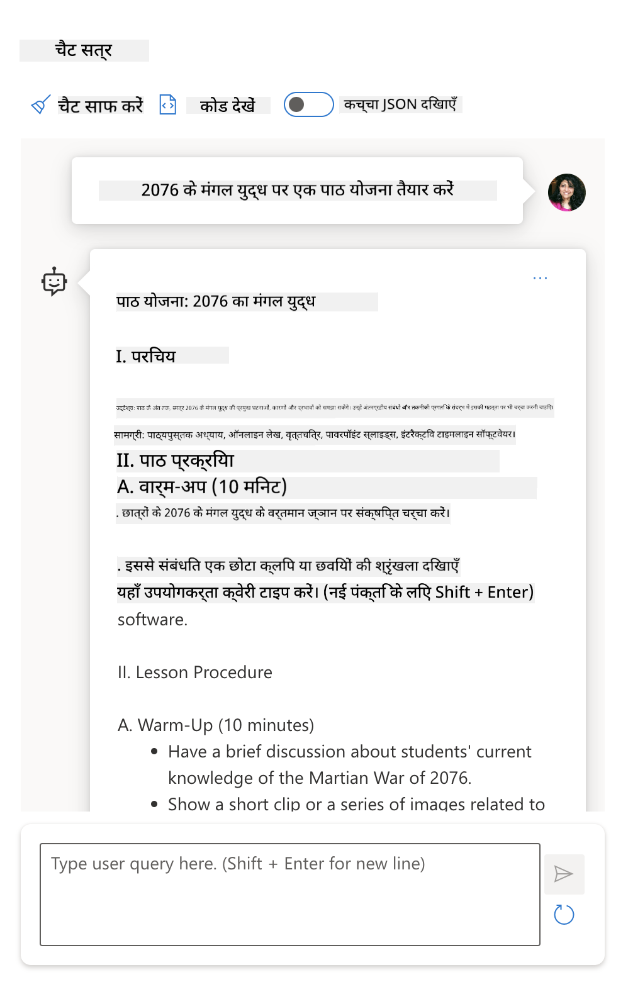

<!--
CO_OP_TRANSLATOR_METADATA:
{
  "original_hash": "a45c318dc6ebc2604f35b8b829f93af2",
  "translation_date": "2025-07-09T09:46:37+00:00",
  "source_file": "04-prompt-engineering-fundamentals/README.md",
  "language_code": "hi"
}
-->
# प्रॉम्प्ट इंजीनियरिंग के मूल सिद्धांत

[](https://aka.ms/gen-ai-lesson4-gh?WT.mc_id=academic-105485-koreyst)

## परिचय  
यह मॉड्यूल जनरेटिव AI मॉडलों में प्रभावी प्रॉम्प्ट बनाने के लिए आवश्यक अवधारणाओं और तकनीकों को कवर करता है। आप जिस तरह से LLM को प्रॉम्प्ट लिखते हैं, वह भी महत्वपूर्ण होता है। एक सावधानीपूर्वक तैयार किया गया प्रॉम्प्ट बेहतर गुणवत्ता वाली प्रतिक्रिया प्राप्त कर सकता है। लेकिन _प्रॉम्प्ट_ और _प्रॉम्प्ट इंजीनियरिंग_ जैसे शब्दों का क्या मतलब है? और मैं LLM को भेजे जाने वाले प्रॉम्प्ट _इनपुट_ को कैसे बेहतर बना सकता हूँ? ये वे सवाल हैं जिनका हम इस अध्याय और अगले में जवाब खोजने की कोशिश करेंगे।

_जनरेटिव AI_ उपयोगकर्ता की मांगों के जवाब में नई सामग्री (जैसे, टेक्स्ट, इमेज, ऑडियो, कोड आदि) बना सकता है। यह OpenAI के GPT ("Generative Pre-trained Transformer") जैसे _लार्ज लैंग्वेज मॉडल_ का उपयोग करता है, जो प्राकृतिक भाषा और कोड के लिए प्रशिक्षित होते हैं।

अब उपयोगकर्ता बिना किसी तकनीकी विशेषज्ञता या प्रशिक्षण के, चैट जैसे परिचित तरीकों से इन मॉडलों के साथ बातचीत कर सकते हैं। ये मॉडल _प्रॉम्प्ट-आधारित_ होते हैं - उपयोगकर्ता एक टेक्स्ट इनपुट (प्रॉम्प्ट) भेजते हैं और AI प्रतिक्रिया (completion) प्राप्त करते हैं। वे फिर "AI के साथ बातचीत" कर सकते हैं, कई चरणों में प्रॉम्प्ट को सुधारते हुए जब तक प्रतिक्रिया उनकी अपेक्षाओं के अनुरूप न हो।

"प्रॉम्प्ट" अब जनरेटिव AI ऐप्स के लिए मुख्य _प्रोग्रामिंग इंटरफेस_ बन गए हैं, जो मॉडल को बताते हैं कि क्या करना है और लौटाई गई प्रतिक्रियाओं की गुणवत्ता को प्रभावित करते हैं। "प्रॉम्प्ट इंजीनियरिंग" एक तेजी से बढ़ता क्षेत्र है जो प्रॉम्प्ट के _डिजाइन और अनुकूलन_ पर केंद्रित है ताकि बड़े पैमाने पर लगातार और गुणवत्ता वाली प्रतिक्रियाएं दी जा सकें।

## सीखने के लक्ष्य

इस पाठ में, हम जानेंगे कि प्रॉम्प्ट इंजीनियरिंग क्या है, यह क्यों महत्वपूर्ण है, और हम किसी दिए गए मॉडल और एप्लिकेशन उद्देश्य के लिए अधिक प्रभावी प्रॉम्प्ट कैसे बना सकते हैं। हम प्रॉम्प्ट इंजीनियरिंग के मूल सिद्धांतों और सर्वोत्तम प्रथाओं को समझेंगे - और एक इंटरैक्टिव Jupyter नोटबुक "सैंडबॉक्स" वातावरण के बारे में जानेंगे जहाँ हम इन अवधारणाओं को वास्तविक उदाहरणों पर लागू होते देख सकते हैं।

इस पाठ के अंत तक हम सक्षम होंगे:

1. समझाना कि प्रॉम्प्ट इंजीनियरिंग क्या है और यह क्यों महत्वपूर्ण है।
2. प्रॉम्प्ट के घटकों का वर्णन करना और उनका उपयोग कैसे होता है।
3. प्रॉम्प्ट इंजीनियरिंग के लिए सर्वोत्तम प्रथाओं और तकनीकों को सीखना।
4. सीखी गई तकनीकों को वास्तविक उदाहरणों पर लागू करना, OpenAI endpoint का उपयोग करते हुए।

## मुख्य शब्द

प्रॉम्प्ट इंजीनियरिंग: AI मॉडलों को वांछित आउटपुट देने के लिए इनपुट डिज़ाइन और परिष्कृत करने की प्रक्रिया।  
टोकनाइज़ेशन: टेक्स्ट को छोटे यूनिट्स (टोकन) में बदलने की प्रक्रिया, जिन्हें मॉडल समझ और संसाधित कर सकता है।  
इंस्ट्रक्शन-ट्यूनड LLMs: बड़े भाषा मॉडल जिन्हें विशिष्ट निर्देशों के साथ फाइन-ट्यून किया गया है ताकि उनकी प्रतिक्रिया की सटीकता और प्रासंगिकता बेहतर हो।

## सीखने का सैंडबॉक्स

प्रॉम्प्ट इंजीनियरिंग फिलहाल विज्ञान से अधिक कला है। इसे बेहतर समझने का सबसे अच्छा तरीका है _अधिक अभ्यास_ करना और एक ट्रायल-एंड-एरर दृष्टिकोण अपनाना, जो एप्लिकेशन डोमेन विशेषज्ञता को अनुशंसित तकनीकों और मॉडल-विशिष्ट अनुकूलनों के साथ जोड़ता है।

इस पाठ के साथ आने वाली Jupyter नोटबुक एक _सैंडबॉक्स_ वातावरण प्रदान करती है जहाँ आप जो सीखते हैं उसे तुरंत आज़मा सकते हैं - चाहे चलते-चलते या अंत में कोड चुनौती के हिस्से के रूप में। अभ्यास करने के लिए, आपको चाहिए:

1. **एक Azure OpenAI API कुंजी** - तैनात LLM के लिए सेवा एंडपॉइंट।  
2. **एक Python रनटाइम** - जिसमें नोटबुक को चलाया जा सके।  
3. **स्थानीय पर्यावरण चर** - _[SETUP](./../00-course-setup/SETUP.md?WT.mc_id=academic-105485-koreyst) चरणों को पूरा करें ताकि आप तैयार हो सकें_।

नोटबुक में _शुरुआती_ अभ्यास शामिल हैं - लेकिन आप अपने खुद के _Markdown_ (विवरण) और _Code_ (प्रॉम्प्ट अनुरोध) सेक्शन जोड़ने के लिए प्रोत्साहित हैं ताकि और उदाहरण या विचार आज़माए जा सकें - और प्रॉम्प्ट डिज़ाइन के लिए अपनी समझ विकसित कर सकें।

## चित्रित मार्गदर्शिका

क्या आप इस पाठ में कवर किए गए मुख्य विषयों का एक बड़ा चित्र देखना चाहते हैं इससे पहले कि आप गहराई में जाएं? इस चित्रित मार्गदर्शिका को देखें, जो आपको मुख्य विषयों और प्रत्येक में सोचने के लिए प्रमुख बिंदुओं का एक सारांश देती है। पाठ का रोडमैप आपको मूल अवधारणाओं और चुनौतियों को समझने से लेकर प्रासंगिक प्रॉम्प्ट इंजीनियरिंग तकनीकों और सर्वोत्तम प्रथाओं के साथ उन्हें संबोधित करने तक ले जाता है। ध्यान दें कि इस मार्गदर्शिका में "उन्नत तकनीकें" अनुभाग इस पाठ्यक्रम के _अगले_ अध्याय में कवर की गई सामग्री को संदर्भित करता है।


## हमारी स्टार्टअप

अब, आइए बात करें कि _यह विषय_ हमारी स्टार्टअप मिशन से कैसे जुड़ा है, जो [शिक्षा में AI नवाचार लाने](https://educationblog.microsoft.com/2023/06/collaborating-to-bring-ai-innovation-to-education?WT.mc_id=academic-105485-koreyst) के लिए है। हम _व्यक्तिगत शिक्षण_ के AI-संचालित अनुप्रयोग बनाना चाहते हैं - तो आइए सोचें कि हमारे एप्लिकेशन के विभिन्न उपयोगकर्ता प्रॉम्प्ट कैसे "डिज़ाइन" कर सकते हैं:

- **प्रशासक** AI से _पाठ्यक्रम डेटा का विश्लेषण करके कवरेज में अंतराल की पहचान_ करने के लिए कह सकते हैं। AI परिणामों का सारांश बना सकता है या कोड के साथ उन्हें विज़ुअलाइज़ कर सकता है।  
- **शिक्षक** AI से _लक्षित दर्शकों और विषय के लिए पाठ योजना_ बनाने के लिए कह सकते हैं। AI निर्दिष्ट प्रारूप में व्यक्तिगत योजना तैयार कर सकता है।  
- **छात्र** AI से _कठिन विषय में ट्यूटरिंग_ के लिए कह सकते हैं। AI अब छात्रों को उनके स्तर के अनुसार पाठ, संकेत और उदाहरणों के साथ मार्गदर्शन कर सकता है।

यह तो बस शुरुआत है। [Prompts For Education](https://github.com/microsoft/prompts-for-edu/tree/main?WT.mc_id=academic-105485-koreyst) देखें - एक ओपन-सोर्स प्रॉम्प्ट लाइब्रेरी जिसे शिक्षा विशेषज्ञों ने तैयार किया है - ताकि संभावनाओं की व्यापक समझ मिल सके! _इन प्रॉम्प्ट्स को सैंडबॉक्स में या OpenAI Playground में चलाकर देखें कि क्या होता है!_

<!--  
LESSON TEMPLATE:  
This unit should cover core concept #1.  
Reinforce the concept with examples and references.  

CONCEPT #1:  
Prompt Engineering.  
Define it and explain why it is needed.  
-->

## प्रॉम्प्ट इंजीनियरिंग क्या है?

हमने इस पाठ की शुरुआत **प्रॉम्प्ट इंजीनियरिंग** को इस रूप में परिभाषित करके की कि यह टेक्स्ट इनपुट (प्रॉम्प्ट) को _डिज़ाइन और अनुकूलित_ करने की प्रक्रिया है ताकि किसी दिए गए एप्लिकेशन उद्देश्य और मॉडल के लिए लगातार और गुणवत्ता वाली प्रतिक्रियाएं (completion) मिल सकें। इसे हम दो चरणों की प्रक्रिया मान सकते हैं:

- किसी दिए गए मॉडल और उद्देश्य के लिए प्रारंभिक प्रॉम्प्ट _डिज़ाइन_ करना  
- प्रतिक्रिया की गुणवत्ता सुधारने के लिए प्रॉम्प्ट को पुनः और पुनः _परिष्कृत_ करना  

यह अनिवार्य रूप से एक ट्रायल-एंड-एरर प्रक्रिया है, जिसमें उपयोगकर्ता की समझ और प्रयास की आवश्यकता होती है ताकि सर्वोत्तम परिणाम मिल सकें। तो यह क्यों महत्वपूर्ण है? इसका जवाब देने के लिए हमें पहले तीन अवधारणाओं को समझना होगा:

- _टोकनाइज़ेशन_ = मॉडल प्रॉम्प्ट को कैसे "देखता" है  
- _बेस LLMs_ = आधार मॉडल प्रॉम्प्ट को कैसे "प्रोसेस" करता है  
- _इंस्ट्रक्शन-ट्यूनड LLMs_ = मॉडल अब "टास्क" को कैसे समझ सकता है  

### टोकनाइज़ेशन

एक LLM प्रॉम्प्ट को _टोकन की एक श्रृंखला_ के रूप में देखता है, जहाँ विभिन्न मॉडल (या मॉडल के संस्करण) एक ही प्रॉम्प्ट को अलग-अलग तरीकों से टोकनाइज़ कर सकते हैं। चूंकि LLMs टोकन पर प्रशिक्षित होते हैं (कच्चे टेक्स्ट पर नहीं), इसलिए प्रॉम्प्ट के टोकनाइज़ेशन का तरीका उत्पन्न प्रतिक्रिया की गुणवत्ता पर सीधे प्रभाव डालता है।

टोकनाइज़ेशन कैसे काम करता है, यह समझने के लिए [OpenAI Tokenizer](https://platform.openai.com/tokenizer?WT.mc_id=academic-105485-koreyst) जैसे टूल्स का उपयोग करें। अपना प्रॉम्प्ट कॉपी करें - और देखें कि यह टोकन में कैसे बदलता है, खासकर व्हाइटस्पेस कैरेक्टर्स और विराम चिह्नों को कैसे संभाला जाता है। ध्यान दें कि यह उदाहरण एक पुराने LLM (GPT-3) को दिखाता है - इसलिए नए मॉडल के साथ इसे आजमाने पर परिणाम अलग हो सकता है।


### अवधारणा: फाउंडेशन मॉडल

एक बार प्रॉम्प्ट टोकनाइज़ हो जाने के बाद, ["Base LLM"](https://blog.gopenai.com/an-introduction-to-base-and-instruction-tuned-large-language-models-8de102c785a6?WT.mc_id=academic-105485-koreyst) (या फाउंडेशन मॉडल) का मुख्य कार्य उस श्रृंखला में अगला टोकन भविष्यवाणी करना होता है। चूंकि LLMs विशाल टेक्स्ट डेटासेट पर प्रशिक्षित होते हैं, उन्हें टोकन के बीच सांख्यिकीय संबंधों का अच्छा ज्ञान होता है और वे आत्मविश्वास के साथ भविष्यवाणी कर सकते हैं। ध्यान दें कि वे प्रॉम्प्ट या टोकन के शब्दों का _अर्थ_ नहीं समझते; वे केवल एक पैटर्न देखते हैं जिसे वे अपनी अगली भविष्यवाणी से "पूरा" कर सकते हैं। वे तब तक भविष्यवाणी करते रहते हैं जब तक उपयोगकर्ता हस्तक्षेप या कोई पूर्व निर्धारित शर्त उन्हें रोकती नहीं।

क्या आप देखना चाहते हैं कि प्रॉम्प्ट-आधारित पूर्णता कैसे काम करती है? ऊपर दिया गया प्रॉम्प्ट Azure OpenAI Studio के [_Chat Playground_](https://oai.azure.com/playground?WT.mc_id=academic-105485-koreyst) में डिफ़ॉल्ट सेटिंग्स के साथ दर्ज करें। सिस्टम प्रॉम्प्ट को सूचना के अनुरोध के रूप में मानता है - इसलिए आपको ऐसी पूर्णता दिखनी चाहिए जो इस संदर्भ को संतुष्ट करे।

लेकिन अगर उपयोगकर्ता कुछ विशिष्ट देखना चाहता है जो किसी मानदंड या कार्य उद्देश्य को पूरा करता हो? तब _इंस्ट्रक्शन-ट्यूनड_ LLMs काम में आते हैं।


### अवधारणा: इंस्ट्रक्शन-ट्यूनड LLMs

[इंस्ट्रक्शन-ट्यूनड LLM](https://blog.gopenai.com/an-introduction-to-base-and-instruction-tuned-large-language-models-8de102c785a6?WT.mc_id=academic-105485-koreyst) फाउंडेशन मॉडल से शुरू होता है और इसे उदाहरणों या इनपुट/आउटपुट जोड़ों (जैसे, मल्टी-टर्न "मैसेजेस") के साथ फाइन-ट्यून करता है, जिनमें स्पष्ट निर्देश हो सकते हैं - और AI की प्रतिक्रिया उस निर्देश का पालन करने का प्रयास करती है।

यह Reinforcement Learning with Human Feedback (RLHF) जैसी तकनीकों का उपयोग करता है, जो मॉडल को _निर्देशों का पालन_ करना और _फीडबैक से सीखना_ सिखाता है ताकि यह ऐसी प्रतिक्रियाएं दे जो व्यावहारिक अनुप्रयोगों के लिए बेहतर उपयुक्त और उपयोगकर्ता उद्देश्यों के लिए अधिक प्रासंगिक हों।

आइए इसे आजमाएं - ऊपर दिए गए प्रॉम्प्ट को फिर से देखें, लेकिन अब _सिस्टम संदेश_ को निम्नलिखित निर्देश के साथ बदलें:

> _आपको जो सामग्री दी गई है, उसका सारांश दूसरे दर्जे के छात्र के लिए बनाएं। परिणाम को 3-5 बुलेट पॉइंट्स के साथ एक पैराग्राफ तक सीमित रखें।_

देखें कि परिणाम अब वांछित लक्ष्य और प्रारूप के अनुरूप कैसे अनुकूलित हो गया है? एक शिक्षक अब इस प्रतिक्रिया का सीधे अपने कक्षा के स्लाइड में उपयोग कर सकता है।


## हमें प्रॉम्प्ट इंजीनियरिंग की आवश्यकता क्यों है?

अब जब हम जानते हैं कि LLMs प्रॉम्प्ट को कैसे प्रोसेस करते हैं, तो आइए बात करें कि _हमें_ प्रॉम्प्ट इंजीनियरिंग की आवश्यकता क्यों है। इसका जवाब इस तथ्य में निहित है कि वर्तमान LLMs कई चुनौतियां पेश करते हैं, जो _विश्वसनीय और लगातार पूर्णताएं_ प्राप्त करना बिना प्रॉम्प्ट निर्माण और अनुकूलन में प्रयास किए कठिन बना देती हैं। उदाहरण के लिए:

1. **मॉडल प्रतिक्रियाएं यादृच्छिक होती हैं।** _एक ही प्रॉम्प्ट_ विभिन्न मॉडलों या मॉडल संस्करणों के साथ अलग-अलग प्रतिक्रियाएं दे सकता है। और यह _एक ही मॉडल_ के साथ भी अलग-अलग समय पर अलग परिणाम दे सकता है। _प्रॉम्प्ट इंजीनियरिंग तकनीकें इन भिन्नताओं को कम करने में मदद कर सकती हैं बेहतर गार्डरेल प्रदान करके_।

2. **मॉडल प्रतिक्रियाएं गढ़ सकते हैं।** मॉडल _बड़े लेकिन सीमित_ डेटासेट पर पूर्व-प्रशिक्षित होते हैं, जिसका अर्थ है कि उनके पास प्रशिक्षण दायरे के बाहर के अवधारणाओं का ज्ञान नहीं होता। परिणामस्वरूप, वे ऐसी पूर्णताएं उत्पन्न कर सकते हैं जो गलत, काल्पनिक या ज्ञात तथ्यों के सीधे विरोधाभासी हों। _प्रॉम्प्ट इंजीनियरिंग तकनीकें उपयोगकर्ताओं को ऐसी गढ़ी हुई जानकारियों की पहचान करने और उन्हें कम करने में मदद करती हैं, जैसे AI से संदर्भ या तर्क मांगना_।

3. **मॉडल की क्षमताएं भिन्न होंगी।** नए मॉडल या मॉडल पीढ़ियां अधिक समृद्ध क्षमताएं लाएंगी लेकिन साथ ही लागत और जटिलता में अनूठे विचित्रताएं और समझौते भी लेकर आएंगी। _प्रॉम्प्ट इंजीनियरिंग हमें सर्वोत्तम प्रथाओं और वर्कफ़्लोज़ को विकसित करने में मदद कर सकती है जो भिन्नताओं को छुपा कर मॉडल-विशिष्ट आवश्यकताओं के अनुसार स्केलेबल और सहज तरीके से अनुकूलित हो सकें_।

आइए इसे OpenAI या Azure OpenAI Playground में देखें:

- एक ही प्रॉम्प्ट को विभिन्न LLM तैनाती (जैसे, OpenAI, Azure OpenAI, Hugging Face) के साथ उपयोग करें - क्या आपने भिन्नताएं देखीं?  
- एक ही प्रॉम्प्ट को बार-बार _एक ही_ LLM तैनाती (जैसे, Azure OpenAI playground) के साथ उपयोग करें - ये भिन्नताएं कैसे अलग थीं?  

### गढ़ी हुई जानकारियों का उदाहरण

इस कोर्स में, हम शब्द **"गढ़ना"** का उपयोग उस घटना के लिए करते हैं जहाँ LLMs कभी-कभी अपने प्रशिक्षण या अन्य सीमाओं के कारण तथ्यात्मक रूप से गलत जानकारी उत्पन्न करते हैं। आपने इसे लोकप्रिय लेखों या शोध पत्रों में _"हैलुसिनेशन"_ के रूप में भी सुना होगा। हालांकि, हम दृढ़ता से सुझाव देते हैं कि _"गढ़ना"_ शब्द का उपयोग करें ताकि हम गलती से इस व्यवहार को मानव-समान गुण न मान लें, जो मशीन-चालित परिणाम है। यह [Responsible AI guidelines](https://www.microsoft.com/ai/responsible-ai?WT.mc_id=academic-105485-koreyst) के अनुरूप भी है, जो ऐसे शब्दों को हटाता है जो कुछ संदर्भों में अपमानजनक या गैर-समावेशी माने जा सकते हैं।

गढ़ी हुई जानकारियों के काम करने का अंदाजा लगाना चाहते हैं? ऐसा प्रॉम्प्ट सोचें जो AI को एक अस्तित्वहीन विषय के लिए सामग्री बनाने का निर्देश देता हो (ताकि यह प्रशिक्षण डेटासेट में न मिले)। उदाहरण के लिए - मैंने यह प्रॉम्प्ट आजमाया:
# मार्टियन युद्ध 2076 पर पाठ योजना

## पाठ का उद्देश्य
छात्रों को 2076 के मार्टियन युद्ध के इतिहास, कारणों, प्रमुख घटनाओं और परिणामों के बारे में समझ विकसित करना।

## पाठ की अवधि
45 मिनट

## आवश्यक सामग्री
- पाठ्यपुस्तक के संबंधित अध्याय
- मार्टियन युद्ध के नक्शे और चित्र
- वीडियो क्लिप (यदि उपलब्ध हो)
- नोटबुक और पेन

## पाठ योजना

### 1. परिचय (5 मिनट)
- छात्रों से पूछें कि वे मंगल ग्रह के बारे में क्या जानते हैं।
- संक्षेप में मार्टियन युद्ध के विषय का परिचय दें।
- युद्ध के समय और स्थान का उल्लेख करें।

### 2. युद्ध के कारण (10 मिनट)
- मार्टियन युद्ध के मुख्य कारणों पर चर्चा करें:
  - संसाधनों के लिए संघर्ष
  - राजनीतिक तनाव
  - तकनीकी विकास और प्रतिस्पर्धा
- छात्रों को कारणों को समझाने के लिए उदाहरण दें।

### 3. प्रमुख घटनाएँ (15 मिनट)
- युद्ध के दौरान हुई महत्वपूर्ण घटनाओं को क्रमवार समझाएं:
  - युद्ध की शुरुआत
  - मुख्य लड़ाइयाँ और रणनीतियाँ
  - निर्णायक क्षण
- नक्शे और चित्रों की मदद से घटनाओं को स्पष्ट करें।

### 4. युद्ध के परिणाम (10 मिनट)
- युद्ध के प्रभावों पर चर्चा करें:
  - मार्टियन समाज पर प्रभाव
  - पृथ्वी और मंगल के बीच संबंधों में बदलाव
  - तकनीकी और सामाजिक बदलाव
- छात्रों से युद्ध के परिणामों पर अपने विचार साझा करने को कहें।

### 5. सारांश और प्रश्नोत्तर (5 मिनट)
- पूरे पाठ का संक्षिप्त पुनरावलोकन करें।
- छात्रों के सवालों का उत्तर दें।

## गृहकार्य
- छात्रों को मार्टियन युद्ध पर एक संक्षिप्त निबंध लिखने के लिए कहें, जिसमें वे युद्ध के कारण और परिणामों पर अपने विचार व्यक्त करें।
एक वेब खोज ने मुझे दिखाया कि मंगल युद्धों पर काल्पनिक कहानियाँ (जैसे, टेलीविजन सीरीज या किताबें) थीं - लेकिन 2076 में कोई नहीं। सामान्य समझ भी बताती है कि 2076 _भविष्य में_ है और इसलिए, इसे किसी वास्तविक घटना से जोड़ा नहीं जा सकता।

तो जब हम इस प्रॉम्प्ट को विभिन्न LLM प्रदाताओं के साथ चलाते हैं तो क्या होता है?

> **Response 1**: OpenAI Playground (GPT-35)


> **Response 2**: Azure OpenAI Playground (GPT-35)



> **Response 3**: : Hugging Face Chat Playground (LLama-2)


जैसा कि उम्मीद थी, प्रत्येक मॉडल (या मॉडल संस्करण) थोड़ा अलग प्रतिक्रिया देता है, जो यादृच्छिक व्यवहार और मॉडल की क्षमता में भिन्नता के कारण होता है। उदाहरण के लिए, एक मॉडल 8वीं कक्षा के छात्रों को लक्षित करता है जबकि दूसरा हाई-स्कूल के छात्र को मानता है। लेकिन तीनों मॉडलों ने ऐसी प्रतिक्रियाएँ दीं जो एक अनजान उपयोगकर्ता को यह विश्वास दिला सकती थीं कि यह घटना वास्तविक थी।

प्रॉम्प्ट इंजीनियरिंग तकनीकें जैसे _मेटाप्रॉम्प्टिंग_ और _टेम्परेचर कॉन्फ़िगरेशन_ मॉडल की गलतियों को कुछ हद तक कम कर सकती हैं। नए प्रॉम्प्ट इंजीनियरिंग _आर्किटेक्चर_ भी नए टूल्स और तकनीकों को सहजता से प्रॉम्प्ट फ्लो में शामिल करते हैं, ताकि इन प्रभावों को कम किया जा सके।

## केस स्टडी: GitHub Copilot

इस सेक्शन को समाप्त करते हैं यह समझकर कि प्रॉम्प्ट इंजीनियरिंग का वास्तविक दुनिया के समाधानों में कैसे उपयोग होता है, एक केस स्टडी देखकर: [GitHub Copilot](https://github.com/features/copilot?WT.mc_id=academic-105485-koreyst)।

GitHub Copilot आपका "AI जोड़ीदार प्रोग्रामर" है - यह टेक्स्ट प्रॉम्प्ट्स को कोड पूर्णताओं में बदलता है और आपके विकास वातावरण (जैसे, Visual Studio Code) में एक सहज उपयोगकर्ता अनुभव के लिए एकीकृत होता है। नीचे दिए गए ब्लॉग श्रृंखला में दस्तावेज़ित अनुसार, सबसे पहला संस्करण OpenAI Codex मॉडल पर आधारित था - जिसमें इंजीनियरों ने जल्दी ही मॉडल को बेहतर बनाने और बेहतर प्रॉम्प्ट इंजीनियरिंग तकनीकों को विकसित करने की आवश्यकता महसूस की, ताकि कोड की गुणवत्ता सुधारी जा सके। जुलाई में, उन्होंने [Codex से आगे बढ़ने वाला एक बेहतर AI मॉडल](https://github.blog/2023-07-28-smarter-more-efficient-coding-github-copilot-goes-beyond-codex-with-improved-ai-model/?WT.mc_id=academic-105485-koreyst) पेश किया, जो और भी तेज सुझाव देता है।

उनके सीखने की यात्रा को समझने के लिए पोस्ट्स को क्रम में पढ़ें।

- **मई 2023** | [GitHub Copilot आपके कोड को समझने में बेहतर हो रहा है](https://github.blog/2023-05-17-how-github-copilot-is-getting-better-at-understanding-your-code/?WT.mc_id=academic-105485-koreyst)
- **मई 2023** | [GitHub के अंदर: GitHub Copilot के पीछे के LLMs के साथ काम करना](https://github.blog/2023-05-17-inside-github-working-with-the-llms-behind-github-copilot/?WT.mc_id=academic-105485-koreyst)
- **जून 2023** | [GitHub Copilot के लिए बेहतर प्रॉम्प्ट कैसे लिखें](https://github.blog/2023-06-20-how-to-write-better-prompts-for-github-copilot/?WT.mc_id=academic-105485-koreyst)
- **जुलाई 2023** | [.. GitHub Copilot बेहतर AI मॉडल के साथ Codex से आगे बढ़ता है](https://github.blog/2023-07-28-smarter-more-efficient-coding-github-copilot-goes-beyond-codex-with-improved-ai-model/?WT.mc_id=academic-105485-koreyst)
- **जुलाई 2023** | [प्रॉम्प्ट इंजीनियरिंग और LLMs के लिए डेवलपर गाइड](https://github.blog/2023-07-17-prompt-engineering-guide-generative-ai-llms/?WT.mc_id=academic-105485-koreyst)
- **सितंबर 2023** | [एंटरप्राइज LLM ऐप कैसे बनाएं: GitHub Copilot से सीख](https://github.blog/2023-09-06-how-to-build-an-enterprise-llm-application-lessons-from-github-copilot/?WT.mc_id=academic-105485-koreyst)

आप उनके [इंजीनियरिंग ब्लॉग](https://github.blog/category/engineering/?WT.mc_id=academic-105485-koreyst) में भी ऐसे और पोस्ट देख सकते हैं, जैसे [यहाँ](https://github.blog/2023-09-27-how-i-used-github-copilot-chat-to-build-a-reactjs-gallery-prototype/?WT.mc_id=academic-105485-koreyst), जो दिखाता है कि ये मॉडल और तकनीकें वास्तविक दुनिया के अनुप्रयोगों को चलाने के लिए कैसे _लागू_ की जाती हैं।

---

<!--
LESSON TEMPLATE:
यह यूनिट मुख्य अवधारणा #2 को कवर करेगी।
उदाहरणों और संदर्भों के साथ अवधारणा को मजबूत करें।

CONCEPT #2:
प्रॉम्प्ट डिज़ाइन।
उदाहरणों के साथ चित्रित।
-->

## प्रॉम्प्ट निर्माण

हमने देखा कि प्रॉम्प्ट इंजीनियरिंग क्यों महत्वपूर्ण है - अब समझते हैं कि प्रॉम्प्ट कैसे _निर्मित_ होते हैं ताकि हम अधिक प्रभावी प्रॉम्प्ट डिज़ाइन के लिए विभिन्न तकनीकों का मूल्यांकन कर सकें।

### बेसिक प्रॉम्प्ट

आइए बेसिक प्रॉम्प्ट से शुरू करें: एक टेक्स्ट इनपुट जो मॉडल को बिना किसी अन्य संदर्भ के भेजा जाता है। यहाँ एक उदाहरण है - जब हम US राष्ट्रीय गान के पहले कुछ शब्द OpenAI [Completion API](https://platform.openai.com/docs/api-reference/completions?WT.mc_id=academic-105485-koreyst) को भेजते हैं, तो यह तुरंत अगली कुछ पंक्तियाँ _पूरा_ कर देता है, जो बुनियादी भविष्यवाणी व्यवहार को दर्शाता है।

| प्रॉम्प्ट (इनपुट)     | पूर्णता (आउटपुट)                                                                                                                        |
| :----------------- | :----------------------------------------------------------------------------------------------------------------------------------------- |
| Oh say can you see | ऐसा लगता है कि आप "The Star-Spangled Banner," जो संयुक्त राज्य अमेरिका का राष्ट्रीय गान है, के बोल शुरू कर रहे हैं। पूरा गीत इस प्रकार है ... |

### जटिल प्रॉम्प्ट

अब उस बेसिक प्रॉम्प्ट में संदर्भ और निर्देश जोड़ते हैं। [Chat Completion API](https://learn.microsoft.com/azure/ai-services/openai/how-to/chatgpt?WT.mc_id=academic-105485-koreyst) हमें एक जटिल प्रॉम्प्ट को _मैसेजेस_ के संग्रह के रूप में बनाने देता है, जिसमें:

- इनपुट/आउटपुट जोड़े जो _यूजर_ इनपुट और _असिस्टेंट_ प्रतिक्रिया को दर्शाते हैं।
- सिस्टम मैसेज जो असिस्टेंट के व्यवहार या व्यक्तित्व के लिए संदर्भ सेट करता है।

अब अनुरोध नीचे दिए गए रूप में होता है, जहाँ _टोकनाइज़ेशन_ प्रभावी रूप से संदर्भ और बातचीत से संबंधित जानकारी पकड़ता है। अब, सिस्टम संदर्भ बदलना पूर्णताओं की गुणवत्ता पर उतना ही प्रभाव डाल सकता है, जितना कि उपयोगकर्ता द्वारा दिया गया इनपुट।

```python
response = openai.chat.completions.create(
    model="gpt-3.5-turbo",
    messages=[
        {"role": "system", "content": "You are a helpful assistant."},
        {"role": "user", "content": "Who won the world series in 2020?"},
        {"role": "assistant", "content": "The Los Angeles Dodgers won the World Series in 2020."},
        {"role": "user", "content": "Where was it played?"}
    ]
)
```

### निर्देशात्मक प्रॉम्प्ट

उपरोक्त उदाहरणों में, उपयोगकर्ता प्रॉम्प्ट एक सरल टेक्स्ट क्वेरी था जिसे सूचना के लिए अनुरोध के रूप में समझा जा सकता है। _निर्देशात्मक_ प्रॉम्प्ट्स के साथ, हम उस टेक्स्ट का उपयोग किसी कार्य को अधिक विस्तार से निर्दिष्ट करने के लिए कर सकते हैं, जिससे AI को बेहतर मार्गदर्शन मिलता है। यहाँ एक उदाहरण है:

| प्रॉम्प्ट (इनपुट)                                                                                                                                                                                                                         | पूर्णता (आउटपुट)                                                                                                        | निर्देश प्रकार    |
| :------------------------------------------------------------------------------------------------------------------------------------------------------------------------------------------------------------------------------------- | :------------------------------------------------------------------------------------------------------------------------- | :------------------ |
| Write a description of the Civil War                                                                                                                                                                                                   | _एक सरल पैराग्राफ लौटाया गया_                                                                                              | सरल              |
| Write a description of the Civil War. Provide key dates and events and describe their significance                                                                                                                                     | _एक पैराग्राफ के बाद मुख्य घटनाओं की तारीखों की सूची के साथ विवरण लौटाया गया_                                             | जटिल             |
| Write a description of the Civil War in 1 paragraph. Provide 3 bullet points with key dates and their significance. Provide 3 more bullet points with key historical figures and their contributions. Return the output as a JSON file | _अधिक विस्तृत विवरण एक टेक्स्ट बॉक्स में JSON स्वरूप में लौटाता है जिसे आप कॉपी-पेस्ट कर फाइल में सेव कर सकते हैं और आवश्यकतानुसार सत्यापित कर सकते हैं_ | जटिल। स्वरूपित। |

## प्राथमिक सामग्री

उपरोक्त उदाहरणों में, प्रॉम्प्ट अभी भी काफी खुला था, जिससे LLM यह तय कर सकता था कि उसके पूर्व-प्रशिक्षित डेटासेट का कौन सा हिस्सा प्रासंगिक है। _प्राथमिक सामग्री_ डिज़ाइन पैटर्न के साथ, इनपुट टेक्स्ट को दो भागों में विभाजित किया जाता है:

- एक निर्देश (क्रिया)
- प्रासंगिक सामग्री (जो क्रिया को प्रभावित करती है)

यहाँ एक उदाहरण है जहाँ निर्देश है "इसे 2 वाक्यों में संक्षेप करें"।

| प्रॉम्प्ट (इनपुट)                                                                                                                                                                                                                                                                                                                                                                                                                                                                                                                                                                                                                                                                                      | पूर्णता (आउटपुट)                                                                                                                                                                                                                                                                             |
| :-------------------------------------------------------------------------------------------------------------------------------------------------------------------------------------------------------------------------------------------------------------------------------------------------------------------------------------------------------------------------------------------------------------------------------------------------------------------------------------------------------------------------------------------------------------------------------------------------------------------------------------------------------------------------------------------------- | :---------------------------------------------------------------------------------------------------------------------------------------------------------------------------------------------------------------------------------------------------------------------------------------------- |
| Jupiter is the fifth planet from the Sun and the largest in the Solar System. It is a gas giant with a mass one-thousandth that of the Sun, but two-and-a-half times that of all the other planets in the Solar System combined. Jupiter is one of the brightest objects visible to the naked eye in the night sky, and has been known to ancient civilizations since before recorded history. It is named after the Roman god Jupiter.[19] When viewed from Earth, Jupiter can be bright enough for its reflected light to cast visible shadows,[20] and is on average the third-brightest natural object in the night sky after the Moon and Venus. <br/> **Summarize this in 2 short sentences** | Jupiter, सूर्य से पाँचवाँ ग्रह, सौरमंडल का सबसे बड़ा ग्रह है और रात के आकाश में सबसे चमकीले पिंडों में से एक माना जाता है। इसका नाम रोमन देवता Jupiter के नाम पर रखा गया है, यह एक गैस जायंट है जिसका द्रव्यमान सौरमंडल के अन्य सभी ग्रहों के द्रव्यमान का दो और आधा गुना है। |

प्राथमिक सामग्री खंड का उपयोग विभिन्न तरीकों से किया जा सकता है ताकि अधिक प्रभावी निर्देश दिए जा सकें:

- **उदाहरण** - मॉडल को स्पष्ट निर्देश देने के बजाय, उसे कुछ उदाहरण दें और वह पैटर्न को समझे।
- **संकेत** - निर्देश के बाद एक "संकेत" दें जो पूर्णता को प्रेरित करता है, जिससे मॉडल अधिक प्रासंगिक प्रतिक्रियाओं की ओर बढ़े।
- **टेम्पलेट्स** - ये दोहराए जाने वाले 'रेसिपी' होते हैं जिनमें प्लेसहोल्डर्स (वेरिएबल्स) होते हैं जिन्हें विशिष्ट उपयोग मामलों के लिए डेटा के साथ अनुकूलित किया जा सकता है।

आइए इन्हें क्रियान्वित करते हैं।

### उदाहरणों का उपयोग

यह एक तरीका है जहाँ आप प्राथमिक सामग्री का उपयोग करके मॉडल को इच्छित आउटपुट के कुछ उदाहरण देते हैं, और मॉडल पैटर्न को समझता है। दिए गए उदाहरणों की संख्या के आधार पर, हमारे पास ज़ीरो-शॉट, वन-शॉट, फ्यू-शॉट प्रॉम्प्टिंग हो सकती है।

प्रॉम्प्ट अब तीन घटकों से बना है:

- एक कार्य विवरण
- इच्छित आउटपुट के कुछ उदाहरण
- एक नए उदाहरण की शुरुआत (जो अप्रत्यक्ष रूप से कार्य विवरण बन जाता है)

| सीखने का प्रकार | प्रॉम्प्ट (इनपुट)                                                                                                                                        | पूर्णता (आउटपुट)         |
| :------------ | :---------------------------------------------------------------------------------------------------------------------------------------------------- | :-------------------------- |
| ज़ीरो-शॉट     | "The Sun is Shining". Translate to Spanish                                                                                                            | "El Sol está brillando".    |
| वन-शॉट      | "The Sun is Shining" => ""El Sol está brillando". <br> "It's a Cold and Windy Day" =>                                                                 | "Es un día frío y ventoso". |
| फ्यू-शॉट      | The player ran the bases => Baseball <br/> The player hit an ace => Tennis <br/> The player hit a six => Cricket <br/> The player made a slam-dunk => | Basketball                  |
|               |                                                                                                                                                       |                             |

ध्यान दें कि ज़ीरो-शॉट प्रॉम्प्टिंग में हमें स्पष्ट निर्देश ("Translate to Spanish") देना पड़ा, लेकिन वन-शॉट प्रॉम्प्टिंग में यह अप्रत्यक्ष रूप से समझ लिया गया। फ्यू-शॉट उदाहरण दिखाता है कि अधिक उदाहरण जोड़ने से मॉडल बिना अतिरिक्त निर्देश के अधिक सटीक अनुमान लगा सकता है।

### प्रॉम्प्ट संकेत

प्राथमिक सामग्री का उपयोग करने की एक और तकनीक है _संकेत_ देना बजाय उदाहरणों के। इस मामले में, हम मॉडल को सही दिशा में एक छोटा सा संकेत देते हैं जो इच्छित प्रतिक्रिया प्रारूप को दर्शाता है। मॉडल फिर उस संकेत को लेकर उसी शैली में जारी रखता है।

| संकेतों की संख्या | प्रॉम्प्ट (इनपुट)                                                                                                                                                                                                                                                                                                                                                                                                                                               | पूर्णता (आउटपुट)                                                                                                                                                                                                                                                                                       |
| :------------- | :----------------------------------------------------------------------------------------------------------------------------------------------------------------------------------------------------------------------------------------------------------------------------------------------------------------------------------------------------------------------------------------------------------------------------------------------------------- | :-------------------------------------------------------------------------------------------------------------------------------------------------------------------------------------------------------------------------------------------------------------------------------------------------------- |
| 0              | Jupiter is the fifth planet from the Sun and the largest in the Solar System. It is a gas giant with a mass one-thousandth that of the Sun, but two-and-a-half times that of all the other planets in the Solar System combined. Jupiter is one of the brightest objects visible to the naked eye in the night sky, and has been known to ancient civilizations since before recorded history.

**Summarize This**                                       | बृहस्पति हमारे सौरमंडल का सबसे बड़ा ग्रह है और सूर्य से पाँचवां ग्रह है। यह एक गैस जायंट है जिसकी द्रव्यमान सूर्य के द्रव्यमान का 1/1000वां हिस्सा है, लेकिन यह सभी अन्य ग्रहों के कुल द्रव्यमान से भारी है। प्राचीन सभ्यताओं को बृहस्पति के बारे में लंबे समय से पता है, और यह रात के आकाश में आसानी से दिखाई देता है। |
| 1              | बृहस्पति सूर्य से पाँचवां ग्रह है और सौरमंडल का सबसे बड़ा ग्रह है। यह एक गैस जायंट है जिसकी द्रव्यमान सूर्य के द्रव्यमान का एक हजारवां हिस्सा है, लेकिन सौरमंडल के सभी अन्य ग्रहों के कुल द्रव्यमान से ढाई गुना अधिक है। बृहस्पति रात के आकाश में नग्न आंखों से दिखाई देने वाले सबसे चमकीले पिंडों में से एक है, और इसे प्राचीन सभ्यताओं ने इतिहास के रिकॉर्ड होने से पहले से जाना है। <br/>**Summarize This** <br/> हमने जो सीखा वह यह है कि बृहस्पति | सूर्य से पाँचवां ग्रह है और सौरमंडल का सबसे बड़ा ग्रह है। यह एक गैस जायंट है जिसकी द्रव्यमान सूर्य के द्रव्यमान का एक हजारवां हिस्सा है, लेकिन सभी अन्य ग्रहों के कुल द्रव्यमान से ढाई गुना अधिक है। यह आसानी से नग्न आंखों से दिखाई देता है और प्राचीन काल से जाना जाता है।                        |
| 2              | बृहस्पति सूर्य से पाँचवां ग्रह है और सौरमंडल का सबसे बड़ा ग्रह है। यह एक गैस जायंट है जिसकी द्रव्यमान सूर्य के द्रव्यमान का एक हजारवां हिस्सा है, लेकिन सौरमंडल के सभी अन्य ग्रहों के कुल द्रव्यमान से ढाई गुना अधिक है। बृहस्पति रात के आकाश में नग्न आंखों से दिखाई देने वाले सबसे चमकीले पिंडों में से एक है, और इसे प्राचीन सभ्यताओं ने इतिहास के रिकॉर्ड होने से पहले से जाना है। <br/>**Summarize This** <br/> हमने जो शीर्ष 3 तथ्य सीखे:         | 1. बृहस्पति सूर्य से पाँचवां ग्रह है और सौरमंडल का सबसे बड़ा ग्रह है। <br/> 2. यह एक गैस जायंट है जिसकी द्रव्यमान सूर्य के द्रव्यमान का एक हजारवां हिस्सा है...<br/> 3. बृहस्पति प्राचीन काल से नग्न आंखों से दिखाई देता रहा है ...                                                                       |
|                |                                                                                                                                                                                                                                                                                                                                                                                                                                                              |                                                                                                                                                                                                                                                                                                           |

### प्रॉम्प्ट टेम्प्लेट्स

प्रॉम्प्ट टेम्प्लेट एक _पूर्व-निर्धारित प्रॉम्प्ट का नुस्खा_ होता है जिसे जरूरत के अनुसार संग्रहित और पुनः उपयोग किया जा सकता है, ताकि बड़े पैमाने पर अधिक सुसंगत उपयोगकर्ता अनुभव प्रदान किए जा सकें। सबसे सरल रूप में, यह प्रॉम्प्ट उदाहरणों का एक संग्रह होता है जैसे [OpenAI का यह उदाहरण](https://platform.openai.com/examples?WT.mc_id=academic-105485-koreyst) जो इंटरैक्टिव प्रॉम्प्ट घटकों (उपयोगकर्ता और सिस्टम संदेश) और API-आधारित अनुरोध प्रारूप दोनों को प्रदान करता है - पुनः उपयोग का समर्थन करने के लिए।

इसके अधिक जटिल रूप में, जैसे [LangChain का यह उदाहरण](https://python.langchain.com/docs/concepts/prompt_templates/?WT.mc_id=academic-105485-koreyst), इसमें _प्लेसहोल्डर_ होते हैं जिन्हें विभिन्न स्रोतों (उपयोगकर्ता इनपुट, सिस्टम संदर्भ, बाहरी डेटा स्रोत आदि) से डेटा के साथ बदला जा सकता है ताकि प्रॉम्प्ट को गतिशील रूप से बनाया जा सके। इससे हम पुनः उपयोग योग्य प्रॉम्प्ट्स की एक लाइब्रेरी बना सकते हैं जो **प्रोग्रामेटिक रूप से** बड़े पैमाने पर सुसंगत उपयोगकर्ता अनुभव प्रदान कर सके।

अंत में, टेम्प्लेट्स का असली मूल्य इस बात में है कि हम _प्रॉम्प्ट लाइब्रेरीज़_ बना और प्रकाशित कर सकें जो विशिष्ट अनुप्रयोग क्षेत्रों के लिए अनुकूलित हों - जहां प्रॉम्प्ट टेम्प्लेट अब _ऐसे संदर्भ या उदाहरणों को प्रतिबिंबित करता है_ जो लक्षित उपयोगकर्ता समूह के लिए प्रतिक्रियाओं को अधिक प्रासंगिक और सटीक बनाते हैं। [Prompts For Edu](https://github.com/microsoft/prompts-for-edu?WT.mc_id=academic-105485-koreyst) रिपॉजिटरी इस दृष्टिकोण का एक बेहतरीन उदाहरण है, जो शिक्षा क्षेत्र के लिए प्रॉम्प्ट्स की लाइब्रेरी तैयार करता है, जिसमें पाठ योजना, पाठ्यक्रम डिजाइन, छात्र ट्यूटरिंग जैसे मुख्य उद्देश्यों पर जोर दिया गया है।

## सहायक सामग्री

यदि हम प्रॉम्प्ट निर्माण को एक निर्देश (कार्य) और एक लक्ष्य (प्राथमिक सामग्री) के रूप में सोचें, तो _माध्यमिक सामग्री_ वह अतिरिक्त संदर्भ है जो हम आउटपुट को किसी न किसी तरह प्रभावित करने के लिए प्रदान करते हैं। यह ट्यूनिंग पैरामीटर, फॉर्मेटिंग निर्देश, विषय वर्गीकरण आदि हो सकते हैं जो मॉडल को प्रतिक्रिया को इच्छित उपयोगकर्ता उद्देश्यों या अपेक्षाओं के अनुरूप _अनुकूलित_ करने में मदद करते हैं।

उदाहरण के लिए: यदि हमारे पास पाठ्यक्रम सूची है जिसमें सभी उपलब्ध पाठ्यक्रमों के विस्तृत मेटाडेटा (नाम, विवरण, स्तर, मेटाडेटा टैग, प्रशिक्षक आदि) शामिल हैं:

- हम एक निर्देश दे सकते हैं "Fall 2023 के लिए पाठ्यक्रम सूची का सारांश बनाओ"
- हम प्राथमिक सामग्री के रूप में कुछ उदाहरण दे सकते हैं कि आउटपुट कैसा होना चाहिए
- हम माध्यमिक सामग्री के रूप में शीर्ष 5 "टैग" की पहचान कर सकते हैं।

अब, मॉडल कुछ उदाहरणों द्वारा दिखाए गए प्रारूप में सारांश प्रदान कर सकता है - लेकिन यदि परिणाम में कई टैग हों, तो यह माध्यमिक सामग्री में पहचाने गए 5 टैग को प्राथमिकता दे सकता है।

---

<!--
LESSON TEMPLATE:
यह यूनिट मुख्य अवधारणा #1 को कवर करनी चाहिए।
अवधारणा को उदाहरणों और संदर्भों के साथ मजबूत करें।

CONCEPT #3:
प्रॉम्प्ट इंजीनियरिंग तकनीकें।
प्रॉम्प्ट इंजीनियरिंग के कुछ बुनियादी तरीके क्या हैं?
इसे कुछ अभ्यासों के साथ समझाएं।
-->

## प्रॉम्प्टिंग के सर्वोत्तम अभ्यास

अब जब हमें पता चल गया है कि प्रॉम्प्ट कैसे _निर्मित_ किए जा सकते हैं, तो हम सोच सकते हैं कि उन्हें _डिजाइन_ कैसे किया जाए ताकि सर्वोत्तम अभ्यासों को प्रतिबिंबित किया जा सके। इसे हम दो भागों में सोच सकते हैं - सही _मानसिकता_ रखना और सही _तकनीक_ लागू करना।

### प्रॉम्प्ट इंजीनियरिंग मानसिकता

प्रॉम्प्ट इंजीनियरिंग एक परीक्षण-और-त्रुटि प्रक्रिया है, इसलिए तीन व्यापक मार्गदर्शक कारकों को ध्यान में रखें:

1. **डोमेन की समझ महत्वपूर्ण है।** प्रतिक्रिया की सटीकता और प्रासंगिकता उस _डोमेन_ पर निर्भर करती है जिसमें वह एप्लिकेशन या उपयोगकर्ता काम करता है। अपनी अंतर्दृष्टि और डोमेन विशेषज्ञता का उपयोग करके तकनीकों को और अनुकूलित करें। उदाहरण के लिए, अपने सिस्टम प्रॉम्प्ट में _डोमेन-विशिष्ट व्यक्तित्व_ परिभाषित करें, या उपयोगकर्ता प्रॉम्प्ट में _डोमेन-विशिष्ट टेम्प्लेट_ का उपयोग करें। माध्यमिक सामग्री प्रदान करें जो डोमेन-विशिष्ट संदर्भों को दर्शाती हो, या मॉडल को परिचित उपयोग पैटर्न की ओर मार्गदर्शन करने के लिए _डोमेन-विशिष्ट संकेत और उदाहरण_ का उपयोग करें।

2. **मॉडल की समझ महत्वपूर्ण है।** हम जानते हैं कि मॉडल स्वाभाविक रूप से यादृच्छिक होते हैं। लेकिन मॉडल के कार्यान्वयन में भी प्रशिक्षण डेटा सेट (पूर्व-प्रशिक्षित ज्ञान), प्रदान की गई क्षमताओं (जैसे API या SDK के माध्यम से) और जिन प्रकार की सामग्री के लिए वे अनुकूलित हैं (जैसे कोड, छवियां, या टेक्स्ट) के आधार पर भिन्नता हो सकती है। आप जिस मॉडल का उपयोग कर रहे हैं उसकी ताकत और सीमाओं को समझें, और उस ज्ञान का उपयोग करके कार्यों को प्राथमिकता दें या _कस्टम टेम्प्लेट_ बनाएं जो मॉडल की क्षमताओं के लिए अनुकूलित हों।

3. **पुनरावृत्ति और सत्यापन महत्वपूर्ण है।** मॉडल तेजी से विकसित हो रहे हैं, और प्रॉम्प्ट इंजीनियरिंग की तकनीकें भी। एक डोमेन विशेषज्ञ के रूप में, आपके पास अन्य संदर्भ या मानदंड हो सकते हैं जो आपके विशिष्ट एप्लिकेशन के लिए प्रासंगिक हों, जो व्यापक समुदाय पर लागू न हों। प्रॉम्प्ट इंजीनियरिंग उपकरणों और तकनीकों का उपयोग करके प्रॉम्प्ट निर्माण को "जल्दी शुरू" करें, फिर अपने स्वयं के अंतर्ज्ञान और डोमेन विशेषज्ञता का उपयोग करके परिणामों को पुनरावृत्त और सत्यापित करें। अपनी अंतर्दृष्टि को रिकॉर्ड करें और एक **ज्ञान आधार** (जैसे प्रॉम्प्ट लाइब्रेरीज़) बनाएं जिसे अन्य लोग भविष्य में तेज पुनरावृत्तियों के लिए नए आधार के रूप में उपयोग कर सकें।

## सर्वोत्तम अभ्यास

अब आइए सामान्य सर्वोत्तम अभ्यास देखें जिन्हें [OpenAI](https://help.openai.com/en/articles/6654000-best-practices-for-prompt-engineering-with-openai-api?WT.mc_id=academic-105485-koreyst) और [Azure OpenAI](https://learn.microsoft.com/azure/ai-services/openai/concepts/prompt-engineering#best-practices?WT.mc_id=academic-105485-koreyst) के विशेषज्ञ सुझाते हैं।

| क्या                              | क्यों                                                                                                                                                                                                                                               |
| :-------------------------------- | :------------------------------------------------------------------------------------------------------------------------------------------------------------------------------------------------------------------------------------------------ |
| नवीनतम मॉडल का मूल्यांकन करें।       | नए मॉडल पीढ़ियों में बेहतर फीचर्स और गुणवत्ता हो सकती है - लेकिन लागत भी अधिक हो सकती है। प्रभाव का मूल्यांकन करें, फिर माइग्रेशन के निर्णय लें।                                                                                |
| निर्देश और संदर्भ अलग रखें।   | जांचें कि आपका मॉडल/प्रदाता क्या _डेलिमिटर्स_ प्रदान करता है जो निर्देश, प्राथमिक और माध्यमिक सामग्री को स्पष्ट रूप से अलग करते हैं। इससे मॉडल टोकन को अधिक सटीकता से वज़न दे सकते हैं।                                                         |
| स्पष्ट और विशिष्ट रहें।             | इच्छित संदर्भ, परिणाम, लंबाई, प्रारूप, शैली आदि के बारे में अधिक विवरण दें। इससे प्रतिक्रियाओं की गुणवत्ता और सुसंगतता दोनों बेहतर होगी। नुस्खे को पुनः उपयोग योग्य टेम्प्लेट्स में कैप्चर करें।                                                          |
| वर्णनात्मक बनें, उदाहरणों का उपयोग करें।      | मॉडल "दिखाओ और बताओ" के तरीके पर बेहतर प्रतिक्रिया दे सकते हैं। `zero-shot` विधि से शुरू करें जहां आप केवल निर्देश देते हैं (कोई उदाहरण नहीं), फिर `few-shot` विधि से सुधार करें, जिसमें कुछ उदाहरण दिए गए हों। उपमाओं का उपयोग करें। |
| प्रतिक्रिया शुरू करने के लिए संकेत दें | इसे इच्छित परिणाम की ओर प्रेरित करने के लिए कुछ प्रारंभिक शब्द या वाक्यांश दें जिन्हें यह प्रतिक्रिया की शुरुआत के लिए उपयोग कर सके।                                                                                                               |
| दोहराव करें                       | कभी-कभी आपको मॉडल को दोहराना पड़ सकता है। प्राथमिक सामग्री से पहले और बाद में निर्देश दें, एक निर्देश और एक संकेत का उपयोग करें, आदि। पुनरावृत्ति करें और देखें क्या काम करता है।                                                         |
| क्रम महत्वपूर्ण है                     | आप जो जानकारी मॉडल को देते हैं उसका क्रम आउटपुट को प्रभावित कर सकता है, यहां तक कि सीखने के उदाहरणों में भी, हाल की जानकारी को प्राथमिकता देने के कारण। विभिन्न विकल्प आजमाएं और देखें क्या सबसे अच्छा काम करता है।                                                               |
| मॉडल को एक “आउट” विकल्प दें           | मॉडल को एक _फॉलबैक_ प्रतिक्रिया विकल्प दें जिसे वह तब उपयोग कर सके जब वह किसी कारण से कार्य पूरा नहीं कर पाता। इससे गलत या काल्पनिक प्रतिक्रियाओं की संभावना कम हो सकती है।                                                         |
|                                   |                                                                                                                                                                                                                                                   |

किसी भी सर्वोत्तम अभ्यास की तरह, याद रखें कि _आपका अनुभव मॉडल, कार्य और डोमेन के आधार पर भिन्न हो सकता है_। इन्हें एक प्रारंभिक बिंदु के रूप में उपयोग करें, और पुनरावृत्त करें ताकि आपको जो सबसे अच्छा लगे वह मिल सके। नए मॉडल और उपकरण उपलब्ध होने पर अपने प्रॉम्प्ट इंजीनियरिंग प्रक्रिया का लगातार पुनर्मूल्यांकन करें, प्रक्रिया की मापनीयता और प्रतिक्रिया की गुणवत्ता पर ध्यान केंद्रित करते हुए।

<!--
LESSON TEMPLATE:
यदि लागू हो तो इस यूनिट में कोड चुनौती प्रदान करें

CHALLENGE:
एक Jupyter Notebook का लिंक जिसमें केवल कोड टिप्पणियाँ हों (कोड सेक्शन खाली हों)।

SOLUTION:
उस Notebook की एक कॉपी का लिंक जिसमें प्रॉम्प्ट भरे गए हों और चलाए गए हों, जो एक उदाहरण आउटपुट दिखाता हो।
-->

## असाइनमेंट

बधाई हो! आप पाठ के अंत तक पहुँच गए हैं! अब समय है कि आप उन अवधारणाओं और तकनीकों को वास्तविक उदाहरणों के साथ आजमाएं!

हमारे असाइनमेंट के लिए, हम एक Jupyter Notebook का उपयोग करेंगे जिसमें आप इंटरैक्टिव रूप से अभ्यास पूरा कर सकते हैं। आप अपनी खुद की Markdown और Code सेल्स के साथ Notebook को बढ़ा भी सकते हैं ताकि अपने विचारों और तकनीकों का स्वतंत्र रूप से अन्वेषण कर सकें।

### शुरू करने के लिए, रिपॉजिटरी को फोर्क करें, फिर

- (सिफारिश की गई) GitHub Codespaces लॉन्च करें
- (वैकल्पिक) रिपॉजिटरी को अपने स्थानीय डिवाइस पर क्लोन करें और Docker Desktop के साथ उपयोग करें
- (वैकल्पिक) अपनी पसंदीदा Notebook रनटाइम वातावरण में Notebook खोलें।

### अगला, अपने पर्यावरण चर कॉन्फ़िगर करें

- रिपॉजिटरी रूट में `.env.copy` फ़ाइल को `.env` में कॉपी करें और `AZURE_OPENAI_API_KEY`, `AZURE_OPENAI_ENDPOINT` और `AZURE_OPENAI_DEPLOYMENT` मान भरें। सीखने के लिए [Learning Sandbox सेक्शन](../../../04-prompt-engineering-fundamentals/04-prompt-engineering-fundamentals) पर वापस आएं।

### फिर, Jupyter Notebook खोलें

- रनटाइम कर्नेल चुनें। यदि आप विकल्प 1 या 2 का उपयोग कर रहे हैं, तो बस डिफ़ॉल्ट Python 3.10.x कर्नेल चुनें जो डेवलपमेंट कंटेनर द्वारा प्रदान किया गया है।

आप अभ्यास चलाने के लिए तैयार हैं। ध्यान दें कि यहां कोई _सही या गलत_ उत्तर नहीं हैं - केवल परीक्षण-और-त्रुटि द्वारा विकल्पों का अन्वेषण और किसी दिए गए मॉडल और एप्लिकेशन डोमेन के लिए क्या काम करता है इसकी अंतर्दृष्टि बनाना है।

_इस कारण से इस पाठ में कोई कोड समाधान खंड नहीं हैं। इसके बजाय, Notebook में "My Solution:" शीर्षक वाले Markdown सेल होंगे जो संदर्भ के लिए एक उदाहरण आउटपुट दिखाएंगे।_

 <!--
LESSON TEMPLATE:
सेक्शन को सारांश और स्व-निर्देशित सीखने के संसाधनों के साथ समाप्त करें।
-->

## ज्ञान जांच

निम्नलिखित में से कौन सा प्रॉम्प्ट कुछ उचित सर्वोत्तम अभ्यासों का पालन करता है?

1. मुझे लाल कार की एक छवि दिखाओ
2. मुझे लाल कार की एक छवि दिखाओ जो Volvo ब्रांड की है और मॉडल XC90 है, जो एक चट्टान के पास सूर्यास्त के समय खड़ी है
3. मुझे लाल कार की एक छवि दिखाओ जो Volvo ब्रांड की है और मॉडल XC90 है

उत्तर: 2, यह सबसे अच्छा प्रॉम्प्ट है क्योंकि यह "क्या" है इस पर विवरण देता है और विशिष्टताओं में जाता है (सिर्फ कोई कार नहीं बल्कि एक विशिष्ट ब्रांड और मॉडल) और यह समग्र सेटिंग का भी वर्णन करता है। 3 अगला सबसे अच्छा है क्योंकि इसमें भी बहुत विवरण है।

## 🚀 चुनौती

देखें कि क्या आप "संकेत" तकनीक का उपयोग कर सकते हैं इस प्रॉम्प्ट के साथ: वाक्य पूरा करें "मुझे लाल कार की एक छवि दिखाओ जो Volvo ब्रांड की है और "। यह क्या प्रतिक्रिया देता है, और आप इसे कैसे बेहतर बनाएंगे?

## शानदार काम! अपनी सीख जारी रखें

क्या आप प्रॉम्प्ट इंजीनियरिंग की विभिन्न अवधारणाओं के बारे में और जानना चाहते हैं? [जारी सीखने वाले पृष्ठ](https://aka.ms/genai-collection?WT.mc_id=academic-105485-koreyst) पर जाएं जहां इस विषय पर अन्य बेहतरीन संसाधन मिलेंगे।

पाठ 5 पर जाएं जहां हम [उन्नत प्रॉम्प्टिंग तकनीकों](../05-advanced-prompts/README.md?WT.mc_id=academic-105485-koreyst) को देखेंगे!

**अस्वीकरण**:  
यह दस्तावेज़ AI अनुवाद सेवा [Co-op Translator](https://github.com/Azure/co-op-translator) का उपयोग करके अनुवादित किया गया है। जबकि हम सटीकता के लिए प्रयासरत हैं, कृपया ध्यान दें कि स्वचालित अनुवादों में त्रुटियाँ या अशुद्धियाँ हो सकती हैं। मूल दस्तावेज़ अपनी मूल भाषा में ही अधिकारिक स्रोत माना जाना चाहिए। महत्वपूर्ण जानकारी के लिए, पेशेवर मानव अनुवाद की सलाह दी जाती है। इस अनुवाद के उपयोग से उत्पन्न किसी भी गलतफहमी या गलत व्याख्या के लिए हम जिम्मेदार नहीं हैं।