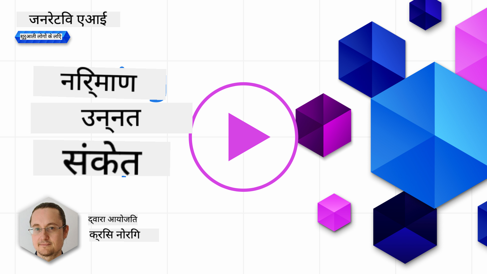

<!--
CO_OP_TRANSLATOR_METADATA:
{
  "original_hash": "b2651fb16bcfbc62b8e518751ed90fdb",
  "translation_date": "2025-10-18T00:08:07+00:00",
  "source_file": "05-advanced-prompts/README.md",
  "language_code": "hi"
}
-->
# उन्नत प्रॉम्प्ट्स बनाना

[](https://youtu.be/BAjzkaCdRok?si=NmUIyRf7-cDgbjtt)

पिछले अध्याय से कुछ सीखों को दोहराते हैं:

> प्रॉम्प्ट _इंजीनियरिंग_ वह प्रक्रिया है जिसके द्वारा हम **मॉडल को अधिक प्रासंगिक उत्तरों की ओर मार्गदर्शन करते हैं**, उपयोगी निर्देश या संदर्भ प्रदान करके।

प्रॉम्प्ट लिखने के दो चरण होते हैं: प्रॉम्प्ट का निर्माण करना, प्रासंगिक संदर्भ प्रदान करके, और _ऑप्टिमाइज़ेशन_, यानी प्रॉम्प्ट को धीरे-धीरे बेहतर बनाना।

इस बिंदु पर, हमें प्रॉम्प्ट लिखने की बुनियादी समझ है, लेकिन हमें इसे और गहराई से समझने की आवश्यकता है। इस अध्याय में, आप विभिन्न प्रॉम्प्ट्स को आजमाने से लेकर यह समझने तक जाएंगे कि एक प्रॉम्प्ट दूसरे से बेहतर क्यों है। आप कुछ बुनियादी तकनीकों का पालन करते हुए प्रॉम्प्ट्स बनाने का तरीका सीखेंगे, जिन्हें किसी भी LLM पर लागू किया जा सकता है।

## परिचय

इस अध्याय में, हम निम्नलिखित विषयों को कवर करेंगे:

- प्रॉम्प्ट इंजीनियरिंग के ज्ञान को बढ़ाना, विभिन्न तकनीकों को अपने प्रॉम्प्ट्स पर लागू करके।
- अपने प्रॉम्प्ट्स को आउटपुट में विविधता लाने के लिए कॉन्फ़िगर करना।

## सीखने के लक्ष्य

इस पाठ को पूरा करने के बाद, आप सक्षम होंगे:

- प्रॉम्प्ट इंजीनियरिंग तकनीकों को लागू करना जो आपके प्रॉम्प्ट्स के परिणाम को बेहतर बनाती हैं।
- प्रॉम्प्टिंग करना जो या तो विविध हो या निश्चित।

## प्रॉम्प्ट इंजीनियरिंग

प्रॉम्प्ट इंजीनियरिंग वह प्रक्रिया है जिसमें प्रॉम्प्ट्स बनाए जाते हैं जो वांछित परिणाम उत्पन्न करेंगे। प्रॉम्प्ट इंजीनियरिंग केवल एक टेक्स्ट प्रॉम्प्ट लिखने से कहीं अधिक है। यह एक इंजीनियरिंग अनुशासन नहीं है, बल्कि तकनीकों का एक सेट है जिसे आप वांछित परिणाम प्राप्त करने के लिए लागू कर सकते हैं।

### प्रॉम्प्ट का एक उदाहरण

आइए एक साधारण प्रॉम्प्ट लें:

> भूगोल पर 10 प्रश्न उत्पन्न करें।

इस प्रॉम्प्ट में, आप वास्तव में विभिन्न प्रॉम्प्ट तकनीकों का एक सेट लागू कर रहे हैं।

आइए इसे विस्तार से समझें।

- **संदर्भ**, आप निर्दिष्ट करते हैं कि यह "भूगोल" के बारे में होना चाहिए।
- **आउटपुट को सीमित करना**, आप 10 से अधिक प्रश्न नहीं चाहते।

### सरल प्रॉम्प्टिंग की सीमाएँ

आपको वांछित परिणाम मिल सकता है या नहीं। आपके प्रश्न उत्पन्न हो जाएंगे, लेकिन भूगोल एक बड़ा विषय है और आपको वह नहीं मिल सकता जो आप चाहते हैं, निम्नलिखित कारणों से:

- **बड़ा विषय**, आप नहीं जानते कि यह देशों, राजधानियों, नदियों आदि के बारे में होगा।
- **प्रारूप**, अगर आप चाहते हैं कि प्रश्न एक निश्चित तरीके से स्वरूपित हों तो क्या होगा?

जैसा कि आप देख सकते हैं, प्रॉम्प्ट्स बनाते समय विचार करने के लिए बहुत कुछ है।

अब तक, हमने एक साधारण प्रॉम्प्ट का उदाहरण देखा है, लेकिन जनरेटिव एआई विभिन्न भूमिकाओं और उद्योगों में लोगों की मदद करने के लिए बहुत कुछ करने में सक्षम है। आइए अगली कुछ बुनियादी तकनीकों का पता लगाएं।

### प्रॉम्प्टिंग के लिए तकनीकें

सबसे पहले, हमें यह समझने की आवश्यकता है कि प्रॉम्प्टिंग एक LLM का _उद्भव_ गुण है, जिसका अर्थ है कि यह मॉडल में निर्मित कोई विशेषता नहीं है बल्कि कुछ ऐसा है जिसे हम मॉडल का उपयोग करते समय खोजते हैं।

कुछ बुनियादी तकनीकें हैं जिन्हें हम LLM को प्रॉम्प्ट करने के लिए उपयोग कर सकते हैं। आइए उन्हें समझें।

- **ज़ीरो-शॉट प्रॉम्प्टिंग**, यह प्रॉम्प्टिंग का सबसे बुनियादी रूप है। यह एकल प्रॉम्प्ट है जो केवल LLM के प्रशिक्षण डेटा के आधार पर प्रतिक्रिया का अनुरोध करता है।
- **फ्यू-शॉट प्रॉम्प्टिंग**, इस प्रकार की प्रॉम्प्टिंग LLM को 1 या अधिक उदाहरण प्रदान करके मार्गदर्शन करती है, जिन पर वह अपनी प्रतिक्रिया उत्पन्न करने के लिए भरोसा कर सकता है।
- **चेन-ऑफ-थॉट**, इस प्रकार की प्रॉम्प्टिंग LLM को बताती है कि किसी समस्या को चरणों में कैसे विभाजित किया जाए।
- **जनरेटेड नॉलेज**, प्रॉम्प्ट की प्रतिक्रिया को बेहतर बनाने के लिए, आप अपने प्रॉम्प्ट में अतिरिक्त रूप से उत्पन्न तथ्य या ज्ञान प्रदान कर सकते हैं।
- **लीस्ट टू मोस्ट**, चेन-ऑफ-थॉट की तरह, यह तकनीक किसी समस्या को चरणों की एक श्रृंखला में विभाजित करने और फिर इन चरणों को क्रम में करने के लिए कहने के बारे में है।
- **सेल्फ-रिफाइन**, यह तकनीक LLM के आउटपुट की आलोचना करने और फिर इसे सुधारने के लिए कहने के बारे में है।
- **मायूटिक प्रॉम्प्टिंग**, यहां आप सुनिश्चित करना चाहते हैं कि LLM का उत्तर सही है और आप इसे उत्तर के विभिन्न भागों की व्याख्या करने के लिए कहते हैं। यह सेल्फ-रिफाइन का एक रूप है।

### ज़ीरो-शॉट प्रॉम्प्टिंग

प्रॉम्प्टिंग की यह शैली बहुत सरल है, इसमें एकल प्रॉम्प्ट होता है। यह तकनीक शायद वही है जिसे आप LLMs के बारे में सीखना शुरू करते समय उपयोग कर रहे हैं। यहाँ एक उदाहरण है:

- प्रॉम्प्ट: "बीजगणित क्या है?"
- उत्तर: "बीजगणित गणित की एक शाखा है जो गणितीय प्रतीकों और इन प्रतीकों को हेरफेर करने के नियमों का अध्ययन करती है।"

### फ्यू-शॉट प्रॉम्प्टिंग

प्रॉम्प्टिंग की यह शैली मॉडल को कुछ उदाहरण प्रदान करके मदद करती है। इसमें एकल प्रॉम्प्ट होता है जिसमें अतिरिक्त कार्य-विशिष्ट डेटा होता है। यहाँ एक उदाहरण है:

- प्रॉम्प्ट: "शेक्सपियर की शैली में एक कविता लिखें। यहाँ शेक्सपियरियन सॉनेट्स के कुछ उदाहरण हैं:
  सॉनेट 18: 'क्या मैं तुम्हारी तुलना एक गर्मी के दिन से करूं? तुम अधिक सुंदर और अधिक संतुलित हो...'
  सॉनेट 116: 'सच्चे मनों के विवाह में बाधा को स्वीकार न करें। प्रेम वह नहीं है जो परिवर्तन के साथ बदलता है...'
  सॉनेट 132: 'तुम्हारी आँखें मुझे प्रिय हैं, और वे, मुझे दया करते हुए, तुम्हारे दिल को जानते हुए मुझे तिरस्कार के साथ पीड़ा देती हैं,...'
  अब, चाँद की सुंदरता के बारे में एक सॉनेट लिखें।"
- उत्तर: "आकाश पर, चाँद धीरे-धीरे चमकता है, अपनी चांदी की रोशनी में जो अपनी कोमल कृपा डालता है,..."

उदाहरण LLM को वांछित आउटपुट का संदर्भ, प्रारूप या शैली प्रदान करते हैं। वे मॉडल को विशिष्ट कार्य को समझने और अधिक सटीक और प्रासंगिक प्रतिक्रियाएँ उत्पन्न करने में मदद करते हैं।

### चेन-ऑफ-थॉट

चेन-ऑफ-थॉट एक बहुत ही दिलचस्प तकनीक है क्योंकि यह LLM को चरणों की एक श्रृंखला के माध्यम से ले जाने के बारे में है। विचार यह है कि LLM को इस तरह से निर्देशित किया जाए कि वह कुछ कैसे करे। निम्नलिखित उदाहरण पर विचार करें, चेन-ऑफ-थॉट के साथ और बिना:

    - प्रॉम्प्ट: "एलिस के पास 5 सेब हैं, वह 3 सेब फेंकती है, 2 बॉब को देती है और बॉब एक वापस देता है, एलिस के पास कितने सेब हैं?"
    - उत्तर: 5

LLM 5 के साथ उत्तर देता है, जो गलत है। सही उत्तर 1 सेब है, दिए गए गणना के अनुसार (5 -3 -2 + 1 = 1)।

तो हम LLM को इसे सही तरीके से कैसे सिखा सकते हैं?

आइए चेन-ऑफ-थॉट आजमाएं। चेन-ऑफ-थॉट लागू करने का मतलब है:

1. LLM को एक समान उदाहरण दें।
1. गणना दिखाएं, और इसे सही तरीके से कैसे गणना करें।
1. मूल प्रॉम्प्ट प्रदान करें।

यहाँ कैसे:

- प्रॉम्प्ट: "लिसा के पास 7 सेब हैं, वह 1 सेब फेंकती है, 4 सेब बार्ट को देती है और बार्ट एक वापस देता है:
  7 -1 = 6
  6 -4 = 2
  2 +1 = 3  
  एलिस के पास 5 सेब हैं, वह 3 सेब फेंकती है, 2 बॉब को देती है और बॉब एक वापस देता है, एलिस के पास कितने सेब हैं?"
  उत्तर: 1

ध्यान दें कि हम काफी लंबे प्रॉम्प्ट लिखते हैं जिसमें एक और उदाहरण, एक गणना और फिर मूल प्रॉम्प्ट होता है और हम सही उत्तर 1 पर पहुँचते हैं।

जैसा कि आप देख सकते हैं, चेन-ऑफ-थॉट एक बहुत ही शक्तिशाली तकनीक है।

### जनरेटेड नॉलेज

कई बार जब आप प्रॉम्प्ट बनाना चाहते हैं, तो आप इसे अपने कंपनी के डेटा का उपयोग करके करना चाहते हैं। आप चाहते हैं कि प्रॉम्प्ट का एक हिस्सा कंपनी से हो और दूसरा हिस्सा वह प्रॉम्प्ट हो जिसमें आप रुचि रखते हैं।

उदाहरण के लिए, यदि आप बीमा व्यवसाय में हैं तो आपका प्रॉम्प्ट इस प्रकार दिख सकता है:

```text
{{company}}: {{company_name}}
{{products}}:
{{products_list}}
Please suggest an insurance given the following budget and requirements:
Budget: {{budget}}
Requirements: {{requirements}}
```

ऊपर, आप देख सकते हैं कि प्रॉम्प्ट एक टेम्पलेट का उपयोग करके बनाया गया है। टेम्पलेट में कई वेरिएबल्स हैं, जिन्हें `{{variable}}` द्वारा दर्शाया गया है, जिन्हें कंपनी API से वास्तविक मानों के साथ प्रतिस्थापित किया जाएगा।

यहाँ एक उदाहरण है कि जब वेरिएबल्स को आपकी कंपनी की सामग्री से प्रतिस्थापित किया जाता है तो प्रॉम्प्ट कैसा दिख सकता है:

```text
Insurance company: ACME Insurance
Insurance products (cost per month):
- Car, cheap, 500 USD
- Car, expensive, 1100 USD
- Home, cheap, 600 USD
- Home, expensive, 1200 USD
- Life, cheap, 100 USD

Please suggest an insurance given the following budget and requirements:
Budget: $1000
Requirements: Car, Home, and Life insurance
```

इस प्रॉम्प्ट को LLM के माध्यम से चलाने से इस प्रकार की प्रतिक्रिया उत्पन्न होगी:

```output
Given the budget and requirements, we suggest the following insurance package from ACME Insurance:
- Car, cheap, 500 USD
- Home, cheap, 600 USD
- Life, cheap, 100 USD
Total cost: $1,200 USD
```

जैसा कि आप देख सकते हैं, यह लाइफ इंश्योरेंस का सुझाव भी देता है, जो इसे नहीं करना चाहिए। यह परिणाम इस बात का संकेत है कि हमें प्रॉम्प्ट को स्पष्ट करने के लिए बदलकर इसे ऑप्टिमाइज़ करने की आवश्यकता है कि यह क्या अनुमति दे सकता है। कुछ _ट्रायल और एरर_ के बाद, हम निम्नलिखित प्रॉम्प्ट पर पहुँचते हैं:

```text
Insurance company: ACME Insurance
Insurance products (cost per month):
- type: Car, cheap, cost: 500 USD
- type: Car, expensive, cost: 1100 USD
- type: Home, cheap, cost: 600 USD
- type: Home, expensive, cost: 1200 USD
- type: Life, cheap, cost: 100 USD

Please suggest an insurance given the following budget and requirements:
Budget: $1000 restrict choice to types: Car, Home
```

ध्यान दें कि _टाइप_ और _कॉस्ट_ जोड़ने और कीवर्ड _रिस्ट्रिक्ट_ का उपयोग करने से LLM को यह समझने में मदद मिलती है कि हम क्या चाहते हैं।

अब हमें निम्नलिखित प्रतिक्रिया मिलती है:

```output
Given the budget and requirements, we suggest the Car, Cheap insurance product which costs 500 USD per month.
```

इस उदाहरण का उद्देश्य यह दिखाना था कि भले ही हम _जनरेटेड नॉलेज_ जैसी एक बुनियादी तकनीक का उपयोग कर रहे हों, हमें अधिकांश मामलों में वांछित परिणाम प्राप्त करने के लिए प्रॉम्प्ट को ऑप्टिमाइज़ करने की आवश्यकता होती है।

### लीस्ट-टू-मोस्ट

लीस्ट-टू-मोस्ट प्रॉम्प्टिंग का विचार एक बड़ी समस्या को उप-समस्याओं में विभाजित करना है। इस तरह, आप LLM को "बड़ी समस्या को जीतने" के तरीके पर मार्गदर्शन करने में मदद करते हैं। डेटा साइंस के लिए एक अच्छा उदाहरण हो सकता है जहाँ आप LLM से इस तरह समस्या को विभाजित करने के लिए कह सकते हैं:

> प्रॉम्प्ट: डेटा साइंस को 5 चरणों में कैसे करें?

आपका एआई सहायक इस प्रकार उत्तर देगा:

1. डेटा एकत्र करें
1. डेटा साफ करें
1. डेटा का विश्लेषण करें
1. डेटा का प्लॉट बनाएं
1. डेटा प्रस्तुत करें

### सेल्फ-रिफाइन, परिणामों की आलोचना करें

जनरेटिव एआई और LLMs के साथ, आप आउटपुट पर भरोसा नहीं कर सकते। आपको इसे सत्यापित करने की आवश्यकता है। आखिरकार, LLM केवल आपको यह प्रस्तुत कर रहा है कि अगली सबसे संभावित बात क्या कहनी है, न कि क्या सही है। इसलिए, LLM से खुद की आलोचना करने के लिए कहना एक अच्छा विचार है, जो हमें सेल्फ-रिफाइन तकनीक की ओर ले जाता है।

यह कैसे काम करता है, इसके चरण निम्नलिखित हैं:

1. प्रारंभिक प्रॉम्प्ट जो LLM से समस्या हल करने के लिए कहता है
1. LLM उत्तर देता है
1. आप उत्तर की आलोचना करते हैं और एआई से इसे सुधारने के लिए कहते हैं
1. LLM फिर से उत्तर देता है, इस बार आलोचना को ध्यान में रखते हुए और सुझाए गए समाधान प्रस्तुत करता है

आप इस प्रक्रिया को जितनी बार चाहें दोहरा सकते हैं।

यहाँ इस तकनीक का उपयोग करते हुए एक उदाहरण है:

> प्रॉम्प्ट: "रूट्स प्रोडक्ट्स और कस्टमर्स के साथ एक पायथन वेब एपीआई बनाएं"

एआई उत्तर:

```python
import flask
app = Flask(__name__)

@app.route('/products')
def products():
    return 'Products'

@app.route('/customers')
def customers():
    return 'Customers'
```

> प्रॉम्प्ट: ऊपर दिए गए कोड में 3 सुधार सुझाएं

एआई उत्तर:

```text
Sure, here are three suggestions to improve the code:

Import the correct module: The first line should import Flask instead of flask. The correct import statement should be from flask import Flask.

Add a main function: Add a if __name__ == '__main__': block to the end of the file to run the application when the file is executed.

Use f-strings: Use f-strings to format the return statements in the route functions. For example, return 'Products' can be changed to return f'This is the {request.path} page'.
```

```python
from flask import Flask, request

app = Flask(__name__)

@app.route('/products')
def products():
    return f'This is the {request.path} page'

@app.route('/customers')
def customers():
    return f'This is the {request.path} page'

if __name__ == '__main__':
    app.run()
```

जैसा कि आप देख सकते हैं, ऊपर दिया गया एआई उत्तर पहले सुझाए गए कोड को सुधार रहा है, पहली प्रतिक्रिया की आलोचना करने के लिए धन्यवाद।

### मायूटिक प्रॉम्प्टिंग

मायूटिक प्रॉम्प्टिंग एक तकनीक है जो सेल्फ-रिफाइन के समान है लेकिन यह LLM से खुद को समझाने के लिए कहने के बारे में अधिक है। लक्ष्य LLM के आउटपुट में असंगतताओं को कम करना है ताकि यह सुनिश्चित किया जा सके कि यह सही उत्तर पर पहुँचे। अनुसरण करने के लिए वर्कफ़्लो है:

1. LLM से एक प्रश्न का उत्तर देने के लिए कहें
1. उत्तर के प्रत्येक भाग के लिए, LLM से इसे अधिक गहराई से समझाने के लिए कहें।
1. यदि असंगतताएँ हैं, तो असंगत भागों को हटा दें।

2 और 3 को तब तक दोहराएं जब तक आप सभी भागों से गुजर न लें और उत्तर से संतुष्ट न हों।

यहाँ एक उदाहरण प्रॉम्प्ट है:

> प्रॉम्प्ट: महामारी को कम करने के लिए संकट योजना बनाने के 5 चरण कैसे हैं?
> LLM उत्तर:

```text
1. Identify the risks
1. Identify the stakeholders
1. Identify the resources
1. Identify the actions
1. Identify the communication channels
```

इसने 5 चरणों की पहचान की है, लेकिन क्या हम यह निर्धारित कर सकते हैं कि यह सही है? आइए LLM से प्रत्येक चरण को अधिक विस्तार से समझाने के लिए कहें:

> प्रॉम्प्ट: पहले चरण को अधिक विस्तार से समझाएं, महामारी के साथ विस्तार से क्या जोखिम हैं?

```text
The risks are the following:

- Loss of life
- Loss of business
- Loss of reputation
- Loss of customers
- Loss of employees
```

इस बिंदु पर, हम यह सुनिश्चित करना चाहते हैं कि LLM सही है, इसलिए हम इसे पहले जोखिम को अधिक विस्तार से समझाने के लिए कहते हैं और उम्मीद करते हैं कि यह ऊपर दिए गए उत्तर के साथ सुसंगत है:

> प्रॉम्प्ट: महामारी में सबसे बड़ा जोखिम क्या है और क्यों?

```text
The biggest risk is loss of life because it's the most important thing to protect.
```

> महामारी में दो सबसे बड़े जोखिम क्या हैं?

```text
The two biggest risks are loss of life and loss of business.
```

इस बिंदु पर, LLM सुसंगत है और "जीवन" और "व्यवसाय" को शीर्ष दो जोखिमों के रूप में उल्लेख करता है। अब हम अगले चरण पर जा सकते हैं और काफी आत्मविश्वास महसूस कर सकते हैं। हालांकि, हमें LLM पर अंधाधुंध भरोसा नहीं करना चाहिए, हमें हमेशा आउटपुट को सत्यापित करना चाहिए।

## अपने आउटपुट में विविधता लाएं

LLMs स्वाभाविक रूप से गैर-निर्धारक होते हैं, जिसका अर्थ है कि जब आप एक ही प्रॉम्प्ट को बार-बार चलाते हैं तो आपको अलग-अलग परिणाम मिलेंगे। उदाहरण के लिए निम्नलिखित प्रॉम्प्ट आज़माएं:

> "पायथन वेब एपीआई के लिए कोड उत्पन्न करें"

```python
# Import necessary modules
import flask
from flask import request, jsonify

# Create a Flask app
app = flask.Flask(__name__)

# Create a route for the API
@app.route('/api', methods=['GET'])
def api():
    # Get the data from the request
    data = request.args

    # Process the data
    result = process_data(data)

    # Return the result as JSON
    return jsonify(result)

# Function to process the data
def process_data(data):
    # Do something with the data
    result = data + 1

    # Return the result
    return result

# Run the app
if __name__ == '__main__':
    app.run()

```

उसी प्रॉम्प्ट को फिर से चलाने पर थोड़ा अलग उत्तर उत्पन्न होता है:

```python
#import necessary packages
import flask
from flask import request, jsonify

#create the Flask application
app = flask.Flask(__name__)
app.config["DEBUG"] = True

#create a list of books
books = [
    {'id': 0,
     'title': 'A Fire Upon the Deep',
     'author': 'Vernor Vinge',
     'first_sentence': 'The coldsleep itself was dreamless.',
     'year_published': '1992'},
    {'id': 1,
     'title': 'The Ones Who Walk Away From Omelas',
     'author': 'Ursula K. Le Guin',
     'first_sentence': 'With a clamor of bells that set the swallows soaring, the Festival of Summer came to the city Omelas, bright-towered by the sea.',
     'published': '1973'},
    {'id': 2,
     'title': 'Dhalgren',
     'author': 'Samuel R. Delany',
     'first_sentence': 'to wound the autumnal city.',
     'published': '1975'}
]

#create an endpoint for the API
@app.route('/', methods=['GET'])
def home():
    return '''<h1>Books API</h1>
<p>A prototype API for retrieving books.</p>'''

#create an endpoint to return all books
@app.route('/api/v1/resources/books/all', methods=['GET'])
def api_all():
    return jsonify(books)

#create an endpoint to return a single book
@app.route('/api/v1/resources/books', methods=['GET'])
def api_id():
    #check if an ID was provided as part of the URL
    #if ID is provided, assign it to a variable
    #if no ID is provided, display an error
    if 'id' in request.args:
        id = int(request.args['id'])
    else:
        return "Error: No id field provided. Please specify an id."

    #create an empty list for our results
    results = []

    #loop through the data and match results that fit the requested ID
    #IDs are unique, but other fields might return many results
    for book in books:
        if book['id'] == id:
            results.append(book)

    #use the jsonify function from Flask to convert our list of
    #Python dictionaries to the JSON format
    return jsonify(results)

app.run()
```

> तो क्या विविध आउटपुट एक समस्या है?

यह इस बात पर निर्भर करता है कि आप क्या करने की कोशिश कर रहे हैं। यदि आप एक विशिष्ट प्रतिक्रिया चाहते हैं तो यह एक समस्या है। यदि आप विविध आउटपुट जैसे "भूगोल पर कोई 3 प्रश्न उत्पन्न करें" के साथ ठीक हैं, तो यह कोई समस्या नहीं है।

### अपने आउटपुट में विविधता लाने के लिए तापमान का उपयोग करना

ठीक है, तो हमने तय किया है कि हम आउटपुट को अधिक अनुमानित, यानी अधिक निश्चित बनाना चाहते हैं। हम ऐसा कैसे करें?

तापमान 0 और 1 के बीच का मान है, जहाँ 0 सबसे अधिक निश्चित है और 1 सबसे अधिक विविध है। डिफ़ॉल्ट मान 0.7 है। आइए देखें कि तापमान को 0.1 पर सेट करने के साथ एक ही प्रॉम्प्ट के दो रन के साथ क्या होता है:

> "पायथन वेब एपीआई के लिए कोड उत्पन्न करें"

```python
#import necessary libraries
import flask
from flask import request, jsonify

#create an instance of the Flask class
app = flask.Flask(__name__)

#create an endpoint for the API
@app.route('/api/v1/endpoint', methods=['GET'])
def api_endpoint():
    #get the request data
    data = request.get_json()

    #process the data
    result = process_data(data)

    #return the result
    return jsonify(result)

#function to process the data
def process_data(data):
    #process the data
    result = {'result': 'success'}

    #return the result
    return result

#run the Flask app
if __name__ == '__main__':
    app.run()

```

प्रॉम्प्ट को फिर से चलाने पर हमें यह परिणाम मिलता है:

```python
#import necessary libraries
import flask
from flask import request, jsonify

#create a Flask app
app = flask.Flask(__name__)

#create a route for the API
@app.route('/api', methods=['GET'])
def api_call():
    #get the data from the request
    data = request.get_json()

    #process the data
    result = process_data(data)

    #return the result
    return jsonify(result)

#define the process_data function
def process_data(data):
    #do something with the data
    result = data + 1

    #return the result
    return result

#run the app
if __name__ == '__main__':
    app.run()

```

इन दोनों आउटपुट्स के बीच केवल एक छोटा सा अंतर है। इस बार विपरीत करते हैं, तापमान को 0.9 पर सेट करते हैं:

```python
# Import necessary libraries
import flask
from flask import request, jsonify

# Create a Flask app
app = flask.Flask(__name__)

# Create a route for the API
@app.route('/api', methods=['GET'])
def api_call():
    # Get the data from the request
    data = request.args

    # Process the data
    result = process_data(data)

    # Return the result
    return jsonify(result)

# Function to process the data
def process_data(data):
    # Do something with the data
    result = data + 1

    # Return the result
    return result

# Run the app
if __name__ == '__main__':
    app.run()

```

और तापमान मान को 0.9 पर सेट करने का दूसरा प्रयास:

```python
import flask
from flask import request, jsonify

# create the Flask app
app = flask.Flask(__name__)
app.config['DEBUG'] = True

# create some test data
books = [
    {'id': 0, 'title': 'A Fire Upon The Deep', 'author': 'Vernor Vinge', 'first_sentence': 'The coldsleep itself was dreamless.', 'year_published': '1992'},
    {'id': 1, 'title': 'The Ones Who Walk Away From Omelas', 'author': 'Ursula K. Le Guin', 'first_sentence': 'With a clamor of bells that set the swallows soaring, the Festival of Summer came to the city Omelas, bright-towered by the sea.', 'published': '1973'},
    {'id': 2, 'title': 'Dhalgren', 'author': 'Samuel R. Delany', 'first_sentence': 'to wound the autumnal city.', 'published': '1975'}
]

# create an endpoint
@app.route('/', methods=['GET'])
def home():
    return '''<h1>Welcome to our book API!</h1>'''

@app.route('/api/v1/resources/books

```

जैसा कि आप देख सकते हैं, परिणाम अधिक विविध नहीं हो सकते थे।

> ध्यान दें कि आउटपुट को बदलने के लिए और भी पैरामीटर हैं जिन्हें आप बदल सकते हैं, जैसे top-k, top-p, repetition penalty, length penalty और diversity penalty, लेकिन ये इस पाठ्यक्रम के दायरे से बाहर हैं।

## अच्छी प्रथाएं

ऐसी कई प्रथाएं हैं जिन्हें आप अपना सकते हैं ताकि आप अपनी इच्छानुसार परिणाम प्राप्त कर सकें। जैसे-जैसे आप प्रॉम्प्टिंग का अधिक उपयोग करेंगे, आप अपनी खुद की शैली विकसित करेंगे।

हमने जिन तकनीकों को कवर किया है, उनके अलावा, LLM को प्रॉम्प्ट करते समय कुछ अच्छी प्रथाओं पर विचार करना चाहिए।

यहां कुछ अच्छी प्रथाएं दी गई हैं जिन पर विचार किया जा सकता है:

- **संदर्भ निर्दिष्ट करें**। संदर्भ महत्वपूर्ण है, जितना अधिक आप डोमेन, विषय आदि जैसे विवरण निर्दिष्ट कर सकते हैं, उतना ही बेहतर।
- आउटपुट को सीमित करें। यदि आप एक निश्चित संख्या में आइटम या एक निश्चित लंबाई चाहते हैं, तो इसे निर्दिष्ट करें।
- **क्या और कैसे दोनों निर्दिष्ट करें**। याद रखें कि आप क्या चाहते हैं और कैसे चाहते हैं, दोनों का उल्लेख करें, उदाहरण के लिए "एक Python Web API बनाएं जिसमें routes products और customers हों, इसे 3 फाइलों में विभाजित करें"।
- **टेम्पलेट्स का उपयोग करें**। अक्सर, आप अपने प्रॉम्प्ट्स को अपनी कंपनी के डेटा से समृद्ध करना चाहेंगे। ऐसा करने के लिए टेम्पलेट्स का उपयोग करें। टेम्पलेट्स में वेरिएबल्स हो सकते हैं जिन्हें आप वास्तविक डेटा से बदल सकते हैं।
- **सही वर्तनी लिखें**। LLMs आपको सही उत्तर प्रदान कर सकते हैं, लेकिन यदि आप सही वर्तनी लिखते हैं, तो आपको बेहतर उत्तर मिलेगा।

## असाइनमेंट

यहां Python में कोड दिया गया है जो Flask का उपयोग करके एक साधारण API बनाने का तरीका दिखाता है:

```python
from flask import Flask, request

app = Flask(__name__)

@app.route('/')
def hello():
    name = request.args.get('name', 'World')
    return f'Hello, {name}!'

if __name__ == '__main__':
    app.run()
```

GitHub Copilot या ChatGPT जैसे AI सहायक का उपयोग करें और "self-refine" तकनीक लागू करके कोड को बेहतर बनाएं।

## समाधान

कृपया कोड में उपयुक्त प्रॉम्प्ट्स जोड़कर असाइनमेंट को हल करने का प्रयास करें।

> [!TIP]
> सुधार के लिए प्रॉम्प्ट को वाक्यांशित करें, सुधारों की संख्या को सीमित करना एक अच्छा विचार है। आप इसे किसी विशेष तरीके से सुधारने के लिए भी कह सकते हैं, जैसे आर्किटेक्चर, प्रदर्शन, सुरक्षा आदि।

[Solution](../../../05-advanced-prompts/python/aoai-solution.py)

## ज्ञान जांच

मैं chain-of-thought प्रॉम्प्टिंग का उपयोग क्यों करूंगा? मुझे 1 सही उत्तर और 2 गलत उत्तर दिखाएं।

1. LLM को समस्या हल करना सिखाने के लिए।
1. B, LLM को कोड में त्रुटियां ढूंढने के लिए सिखाने के लिए।
1. C, LLM को विभिन्न समाधान निकालने के लिए निर्देशित करने के लिए।

A: 1, क्योंकि chain-of-thought का मतलब है कि LLM को समस्या हल करने का तरीका दिखाना, उसे चरणों की एक श्रृंखला प्रदान करके, और इसी तरह की समस्याओं को कैसे हल किया गया।

## 🚀 चुनौती

आपने अभी-अभी असाइनमेंट में self-refine तकनीक का उपयोग किया। आपने जो भी प्रोग्राम बनाया है, उसे लें और विचार करें कि आप उसमें कौन-कौन से सुधार लागू करना चाहेंगे। अब प्रस्तावित परिवर्तनों को लागू करने के लिए self-refine तकनीक का उपयोग करें। आपको परिणाम कैसा लगा, बेहतर या खराब?

## शानदार काम! अपनी सीख जारी रखें

इस पाठ को पूरा करने के बाद, हमारे [Generative AI Learning collection](https://aka.ms/genai-collection?WT.mc_id=academic-105485-koreyst) को देखें ताकि आप अपनी Generative AI की जानकारी को और बढ़ा सकें!

Lesson 6 पर जाएं जहां हम Prompt Engineering के अपने ज्ञान को लागू करके [text generation apps बनाएंगे](../06-text-generation-apps/README.md?WT.mc_id=academic-105485-koreyst)

---

**अस्वीकरण**:  
यह दस्तावेज़ AI अनुवाद सेवा [Co-op Translator](https://github.com/Azure/co-op-translator) का उपयोग करके अनुवादित किया गया है। जबकि हम सटीकता के लिए प्रयास करते हैं, कृपया ध्यान दें कि स्वचालित अनुवाद में त्रुटियां या अशुद्धियां हो सकती हैं। मूल भाषा में दस्तावेज़ को आधिकारिक स्रोत माना जाना चाहिए। महत्वपूर्ण जानकारी के लिए, पेशेवर मानव अनुवाद की सिफारिश की जाती है। इस अनुवाद के उपयोग से उत्पन्न किसी भी गलतफहमी या गलत व्याख्या के लिए हम जिम्मेदार नहीं हैं।