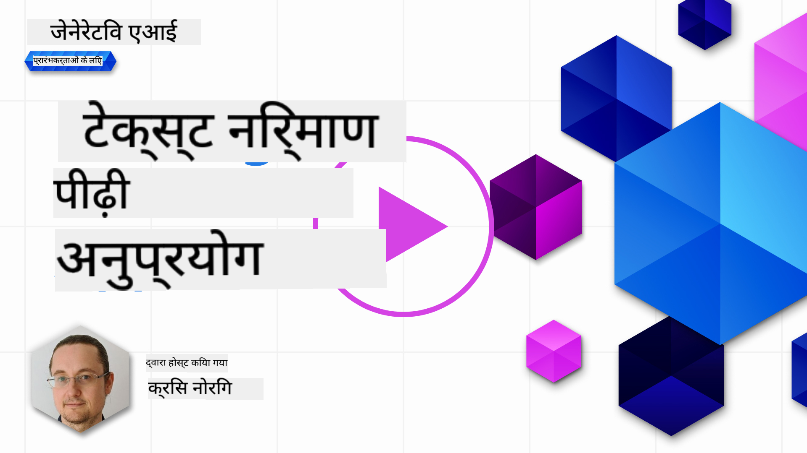

<!--
CO_OP_TRANSLATOR_METADATA:
{
  "original_hash": "ce8224073b86b728ed52b19bed7932fd",
  "translation_date": "2025-07-09T11:50:24+00:00",
  "source_file": "06-text-generation-apps/README.md",
  "language_code": "hi"
}
-->
# टेक्स्ट जनरेशन एप्लिकेशन बनाना

[](https://aka.ms/gen-ai-lesson6-gh?WT.mc_id=academic-105485-koreyst)

> _(इस पाठ का वीडियो देखने के लिए ऊपर की छवि पर क्लिक करें)_

अब तक आपने इस पाठ्यक्रम में देखा है कि प्रॉम्प्ट्स जैसे मूलभूत अवधारणाएं हैं और एक पूरी विधा है जिसे "प्रॉम्प्ट इंजीनियरिंग" कहा जाता है। कई टूल्स जिनसे आप इंटरैक्ट कर सकते हैं जैसे ChatGPT, Office 365, Microsoft Power Platform और अन्य, प्रॉम्प्ट्स का उपयोग करके आपको कुछ हासिल करने में मदद करते हैं।

ऐसे अनुभव को किसी ऐप में जोड़ने के लिए, आपको प्रॉम्प्ट्स, कम्प्लीशन्स जैसी अवधारणाओं को समझना होगा और काम करने के लिए एक लाइब्रेरी चुननी होगी। ठीक यही आप इस अध्याय में सीखेंगे।

## परिचय

इस अध्याय में, आप:

- openai लाइब्रेरी और इसकी मूल अवधारणाओं के बारे में जानेंगे।
- openai का उपयोग करके एक टेक्स्ट जनरेशन ऐप बनाएंगे।
- प्रॉम्प्ट, टेम्परेचर, और टोकन्स जैसी अवधारणाओं का उपयोग करके टेक्स्ट जनरेशन ऐप बनाना समझेंगे।

## सीखने के लक्ष्य

इस पाठ के अंत में, आप सक्षम होंगे:

- समझा सकेंगे कि टेक्स्ट जनरेशन ऐप क्या होता है।
- openai का उपयोग करके टेक्स्ट जनरेशन ऐप बना सकेंगे।
- अपने ऐप को अधिक या कम टोकन्स का उपयोग करने के लिए कॉन्फ़िगर कर सकेंगे और टेम्परेचर भी बदल सकेंगे, जिससे आउटपुट में विविधता आए।

## टेक्स्ट जनरेशन ऐप क्या है?

आमतौर पर जब आप कोई ऐप बनाते हैं तो उसमें कुछ प्रकार का इंटरफ़ेस होता है, जैसे:

- कमांड-आधारित। कंसोल ऐप्स वे ऐप्स होते हैं जहाँ आप कमांड टाइप करते हैं और वह कोई कार्य करता है। उदाहरण के लिए, `git` एक कमांड-आधारित ऐप है।
- यूजर इंटरफ़ेस (UI)। कुछ ऐप्स में ग्राफिकल यूजर इंटरफेस (GUI) होता है जहाँ आप बटन क्लिक करते हैं, टेक्स्ट इनपुट करते हैं, विकल्प चुनते हैं आदि।

### कंसोल और UI ऐप्स सीमित होते हैं

इसे एक कमांड-आधारित ऐप से तुलना करें जहाँ आप कमांड टाइप करते हैं:

- **यह सीमित है**। आप कोई भी कमांड नहीं टाइप कर सकते, केवल वही जो ऐप सपोर्ट करता है।
- **भाषा-विशिष्ट**। कुछ ऐप्स कई भाषाओं का समर्थन करते हैं, लेकिन डिफ़ॉल्ट रूप से ऐप किसी विशेष भाषा के लिए बनाया जाता है, भले ही आप अतिरिक्त भाषा समर्थन जोड़ सकें।

### टेक्स्ट जनरेशन ऐप्स के फायदे

तो टेक्स्ट जनरेशन ऐप कैसे अलग है?

टेक्स्ट जनरेशन ऐप में आपके पास अधिक लचीलापन होता है, आप कमांड्स या किसी विशेष इनपुट भाषा तक सीमित नहीं होते। इसके बजाय, आप प्राकृतिक भाषा का उपयोग करके ऐप से बातचीत कर सकते हैं। एक और फायदा यह है कि आप पहले से ही एक ऐसे डेटा स्रोत के साथ इंटरैक्ट कर रहे हैं जिसे विशाल जानकारी के संग्रह पर प्रशिक्षित किया गया है, जबकि पारंपरिक ऐप्स डेटाबेस में मौजूद जानकारी तक सीमित हो सकते हैं।

### मैं टेक्स्ट जनरेशन ऐप से क्या बना सकता हूँ?

आप कई चीजें बना सकते हैं। उदाहरण के लिए:

- **एक चैटबॉट**। एक चैटबॉट जो आपके कंपनी और उसके उत्पादों जैसे विषयों पर सवालों के जवाब देता है, अच्छा विकल्प हो सकता है।
- **सहायक**। LLMs टेक्स्ट का सारांश बनाने, टेक्स्ट से जानकारी निकालने, रिज्यूमे जैसे टेक्स्ट उत्पन्न करने में बहुत अच्छे हैं।
- **कोड असिस्टेंट**। जिस भाषा मॉडल का आप उपयोग करते हैं, उसके आधार पर आप एक कोड असिस्टेंट बना सकते हैं जो कोड लिखने में मदद करता है। उदाहरण के लिए, आप GitHub Copilot या ChatGPT जैसे उत्पादों का उपयोग कर सकते हैं।

## मैं कैसे शुरू कर सकता हूँ?

आपको LLM के साथ इंटीग्रेट करने का तरीका ढूंढना होगा, जो आमतौर पर निम्न दो तरीकों में से एक होता है:

- API का उपयोग करें। यहाँ आप अपने प्रॉम्प्ट के साथ वेब रिक्वेस्ट बनाते हैं और जनरेटेड टेक्स्ट वापस पाते हैं।
- लाइब्रेरी का उपयोग करें। लाइब्रेरी API कॉल्स को संक्षिप्त करती हैं और उपयोग में आसान बनाती हैं।

## लाइब्रेरी/SDKs

LLMs के साथ काम करने के लिए कुछ प्रसिद्ध लाइब्रेरी हैं जैसे:

- **openai**, यह लाइब्रेरी आपके मॉडल से कनेक्ट करना और प्रॉम्प्ट भेजना आसान बनाती है।

फिर कुछ उच्च स्तरीय लाइब्रेरी भी हैं जैसे:

- **Langchain**। Langchain प्रसिद्ध है और Python का समर्थन करता है।
- **Semantic Kernel**। Semantic Kernel Microsoft की एक लाइब्रेरी है जो C#, Python, और Java भाषाओं का समर्थन करती है।

## openai का उपयोग करके पहला ऐप

आइए देखें कि हम अपना पहला ऐप कैसे बना सकते हैं, हमें कौन-कौन सी लाइब्रेरी चाहिए, कितना आवश्यक है आदि।

### openai इंस्टॉल करें

OpenAI या Azure OpenAI के साथ इंटरैक्ट करने के लिए कई लाइब्रेरी उपलब्ध हैं। आप कई प्रोग्रामिंग भाषाओं का उपयोग कर सकते हैं जैसे C#, Python, JavaScript, Java आदि। हमने `openai` Python लाइब्रेरी का चयन किया है, इसलिए हम इसे `pip` से इंस्टॉल करेंगे।

```bash
pip install openai
```

### एक रिसोर्स बनाएं

आपको निम्नलिखित कदम उठाने होंगे:

- Azure पर एक अकाउंट बनाएं [https://azure.microsoft.com/free/](https://azure.microsoft.com/free/?WT.mc_id=academic-105485-koreyst)।
- Azure OpenAI का एक्सेस प्राप्त करें। [https://learn.microsoft.com/azure/ai-services/openai/overview#how-do-i-get-access-to-azure-openai](https://learn.microsoft.com/azure/ai-services/openai/overview#how-do-i-get-access-to-azure-openai?WT.mc_id=academic-105485-koreyst) पर जाएं और एक्सेस के लिए अनुरोध करें।

  > [!NOTE]
  > लेखन के समय, आपको Azure OpenAI के लिए एक्सेस के लिए आवेदन करना होता है।

- Python इंस्टॉल करें <https://www.python.org/>
- Azure OpenAI Service रिसोर्स बनाएं। इस गाइड को देखें कि [कैसे रिसोर्स बनाएं](https://learn.microsoft.com/azure/ai-services/openai/how-to/create-resource?pivots=web-portal?WT.mc_id=academic-105485-koreyst)।

### API की और एंडपॉइंट खोजें

अब आपको अपनी `openai` लाइब्रेरी को बताना होगा कि कौन सा API की उपयोग करनी है। अपनी API की खोजने के लिए, Azure OpenAI रिसोर्स के "Keys and Endpoint" सेक्शन में जाएं और "Key 1" का मान कॉपी करें।


अब जब आपके पास यह जानकारी कॉपी हो गई है, तो चलिए लाइब्रेरी को इसे उपयोग करने के लिए निर्देशित करते हैं।

> [!NOTE]
> अपने API की कोड से अलग रखना बेहतर होता है। आप इसे पर्यावरण चर (environment variables) का उपयोग करके कर सकते हैं।
>
> - पर्यावरण चर `OPENAI_API_KEY` को अपनी API की पर सेट करें।
>   `export OPENAI_API_KEY='sk-...'`

### Azure कॉन्फ़िगरेशन सेटअप करें

यदि आप Azure OpenAI का उपयोग कर रहे हैं, तो कॉन्फ़िगरेशन इस प्रकार सेट करें:

```python
openai.api_type = 'azure'
openai.api_key = os.environ["OPENAI_API_KEY"]
openai.api_version = '2023-05-15'
openai.api_base = os.getenv("API_BASE")
```

ऊपर हम निम्न सेट कर रहे हैं:

- `api_type` को `azure` पर सेट कर रहे हैं। यह लाइब्रेरी को बताता है कि Azure OpenAI का उपयोग करना है, न कि OpenAI का।
- `api_key`, यह आपकी Azure Portal में मिली API की है।
- `api_version`, यह API का वह संस्करण है जिसे आप उपयोग करना चाहते हैं। लेखन के समय नवीनतम संस्करण `2023-05-15` है।
- `api_base`, यह API का एंडपॉइंट है। आप इसे Azure Portal में अपनी API की के पास पा सकते हैं।

> [!NOTE]
> `os.getenv` एक फ़ंक्शन है जो पर्यावरण चर पढ़ता है। आप इसका उपयोग `OPENAI_API_KEY` और `API_BASE` जैसे पर्यावरण चर पढ़ने के लिए कर सकते हैं। इन्हें अपने टर्मिनल में या `dotenv` जैसी लाइब्रेरी का उपयोग करके सेट करें।

## टेक्स्ट जनरेट करें

टेक्स्ट जनरेट करने का तरीका `Completion` क्लास का उपयोग करना है। उदाहरण:

```python
prompt = "Complete the following: Once upon a time there was a"

completion = openai.Completion.create(model="davinci-002", prompt=prompt)
print(completion.choices[0].text)
```

ऊपर के कोड में, हम एक completion ऑब्जेक्ट बनाते हैं और उस मॉडल और प्रॉम्प्ट को पास करते हैं जिसे हम उपयोग करना चाहते हैं। फिर हम जनरेटेड टेक्स्ट प्रिंट करते हैं।

### चैट कम्प्लीशन्स

अब तक आपने देखा कि हम `Completion` का उपयोग करके टेक्स्ट जनरेट कर रहे हैं। लेकिन एक और क्लास है जिसका नाम `ChatCompletion` है जो चैटबॉट्स के लिए अधिक उपयुक्त है। इसका उपयोग करने का उदाहरण:

```python
import openai

openai.api_key = "sk-..."

completion = openai.ChatCompletion.create(model="gpt-3.5-turbo", messages=[{"role": "user", "content": "Hello world"}])
print(completion.choices[0].message.content)
```

इस फ़ंक्शनैलिटी पर अगले अध्याय में और चर्चा होगी।

## अभ्यास - आपका पहला टेक्स्ट जनरेशन ऐप

अब जब हमने openai को सेटअप और कॉन्फ़िगर करना सीख लिया है, तो समय है अपना पहला टेक्स्ट जनरेशन ऐप बनाने का। अपने ऐप को बनाने के लिए, निम्न चरणों का पालन करें:

1. एक वर्चुअल एनवायरनमेंट बनाएं और openai इंस्टॉल करें:

   ```bash
   python -m venv venv
   source venv/bin/activate
   pip install openai
   ```

   > [!NOTE]
   > यदि आप Windows उपयोग कर रहे हैं तो `source venv/bin/activate` की जगह `venv\Scripts\activate` टाइप करें।

   > [!NOTE]
   > अपनी Azure OpenAI की खोजने के लिए [https://portal.azure.com/](https://portal.azure.com/?WT.mc_id=academic-105485-koreyst) पर जाएं, `Open AI` खोजें, `Open AI resource` चुनें, फिर `Keys and Endpoint` पर जाएं और `Key 1` कॉपी करें।

1. एक _app.py_ फ़ाइल बनाएं और इसमें निम्न कोड डालें:

   ```python
   import openai

   openai.api_key = "<replace this value with your open ai key or Azure OpenAI key>"

   openai.api_type = 'azure'
   openai.api_version = '2023-05-15'
   openai.api_base = "<endpoint found in Azure Portal where your API key is>"
   deployment_name = "<deployment name>"

   # add your completion code
   prompt = "Complete the following: Once upon a time there was a"
   messages = [{"role": "user", "content": prompt}]

   # make completion
   completion = openai.chat.completions.create(model=deployment_name, messages=messages)

   # print response
   print(completion.choices[0].message.content)
   ```

   > [!NOTE]
   > यदि आप Azure OpenAI का उपयोग कर रहे हैं, तो `api_type` को `azure` पर सेट करें और `api_key` को अपनी Azure OpenAI की पर सेट करें।

   आपको निम्नलिखित जैसा आउटपुट दिखाई देगा:

   ```output
    very unhappy _____.

   Once upon a time there was a very unhappy mermaid.
   ```

## विभिन्न प्रकार के प्रॉम्प्ट्स, विभिन्न कार्यों के लिए

अब आपने देखा कि प्रॉम्प्ट का उपयोग करके टेक्स्ट कैसे जनरेट किया जाता है। आपके पास एक प्रोग्राम भी है जो चल रहा है और जिसे आप संशोधित करके विभिन्न प्रकार के टेक्स्ट जनरेट कर सकते हैं।

प्रॉम्प्ट्स का उपयोग कई तरह के कार्यों के लिए किया जा सकता है। उदाहरण के लिए:

- **किसी प्रकार का टेक्स्ट जनरेट करें**। उदाहरण के लिए, आप कविता, क्विज़ के प्रश्न आदि जनरेट कर सकते हैं।
- **जानकारी खोजें**। आप प्रॉम्प्ट्स का उपयोग जानकारी खोजने के लिए कर सकते हैं, जैसे 'वेब डेवलपमेंट में CORS का क्या मतलब है?'।
- **कोड जनरेट करें**। आप प्रॉम्प्ट्स का उपयोग कोड जनरेट करने के लिए कर सकते हैं, जैसे ईमेल वैलिडेशन के लिए रेगुलर एक्सप्रेशन बनाना या पूरा प्रोग्राम, जैसे वेब ऐप बनाना।

## एक अधिक व्यावहारिक उपयोग मामला: रेसिपी जनरेटर

कल्पना करें कि आपके पास घर पर कुछ सामग्री है और आप कुछ पकाना चाहते हैं। इसके लिए आपको एक रेसिपी चाहिए। रेसिपी खोजने का एक तरीका सर्च इंजन का उपयोग करना है या आप LLM का उपयोग कर सकते हैं।

आप ऐसा प्रॉम्प्ट लिख सकते हैं:

> "मुझे निम्न सामग्री के साथ एक डिश के लिए 5 रेसिपी दिखाएं: चिकन, आलू, और गाजर। प्रत्येक रेसिपी के लिए सभी उपयोग की गई सामग्री सूचीबद्ध करें।"

ऊपर दिए गए प्रॉम्प्ट के आधार पर, आपको कुछ ऐसा उत्तर मिल सकता है:

```output
1. Roasted Chicken and Vegetables:
Ingredients:
- 4 chicken thighs
- 2 potatoes, cut into cubes
- 2 carrots, cut into cubes
- 2 tablespoons olive oil
- 2 cloves garlic, minced
- 1 teaspoon dried thyme
- 1 teaspoon dried oregano
- Salt and pepper, to taste

2. Chicken and Potato Stew:
Ingredients:
- 2 tablespoons olive oil
- 1 onion, diced
- 2 cloves garlic, minced
- 2 chicken breasts, cut into cubes
- 2 potatoes, cut into cubes
- 2 carrots, cut into cubes
- 1 teaspoon dried oregano
- 1 teaspoon dried thyme
- 1 cup chicken broth
- Salt and pepper, to taste

3. Chicken and Potato Bake:
Ingredients:
- 2 tablespoons olive oil
- 2 chicken breasts, cut into cubes
- 2 potatoes, cut into cubes
- 2 carrots, cut into cubes
- 1 onion, diced
- 2 cloves garlic, minced
- 1 teaspoon dried oregano
- 1 teaspoon dried thyme
- 1 cup chicken broth
- Salt and pepper, to taste

4. Chicken and Potato Soup:
Ingredients:
- 2 tablespoons olive oil
- 1 onion, diced
- 2 cloves garlic, minced
- 2 chicken breasts, cut into cubes
- 2 potatoes, cut into cubes
- 2 carrots, cut into cubes
- 1 teaspoon dried oregano
- 1 teaspoon dried thyme
- 4 cups chicken broth
- Salt and pepper, to taste

5. Chicken and Potato Hash:
Ingredients:
- 2 tablespoons olive oil
- 2 chicken breasts, cut into cubes
- 2 potatoes, cut into cubes
- 2 carrots, cut into cubes
- 1 onion, diced
- 2 cloves garlic, minced
- 1 teaspoon dried oregano
```

यह परिणाम बहुत अच्छा है, मुझे पता चल गया कि क्या पकाना है। इस बिंदु पर, कुछ उपयोगी सुधार हो सकते हैं:

- उन सामग्री को फ़िल्टर करना जिन्हें मैं पसंद नहीं करता या जिनसे मुझे एलर्जी है।
- एक शॉपिंग लिस्ट बनाना, अगर मेरे पास घर पर सभी सामग्री नहीं हैं।

इन मामलों के लिए, एक अतिरिक्त प्रॉम्प्ट जोड़ते हैं:

> "कृपया उन रेसिपी को हटा दें जिनमें लहसुन हो क्योंकि मुझे उससे एलर्जी है और इसे किसी अन्य सामग्री से बदल दें। साथ ही, कृपया रेसिपी के लिए एक शॉपिंग लिस्ट बनाएं, ध्यान में रखते हुए कि मेरे पास पहले से चिकन, आलू और गाजर हैं।"

अब आपके पास नया परिणाम होगा, जैसे:

```output
1. Roasted Chicken and Vegetables:
Ingredients:
- 4 chicken thighs
- 2 potatoes, cut into cubes
- 2 carrots, cut into cubes
- 2 tablespoons olive oil
- 1 teaspoon dried thyme
- 1 teaspoon dried oregano
- Salt and pepper, to taste

2. Chicken and Potato Stew:
Ingredients:
- 2 tablespoons olive oil
- 1 onion, diced
- 2 chicken breasts, cut into cubes
- 2 potatoes, cut into cubes
- 2 carrots, cut into cubes
- 1 teaspoon dried oregano
- 1 teaspoon dried thyme
- 1 cup chicken broth
- Salt and pepper, to taste

3. Chicken and Potato Bake:
Ingredients:
- 2 tablespoons olive oil
- 2 chicken breasts, cut into cubes
- 2 potatoes, cut into cubes
- 2 carrots, cut into cubes
- 1 onion, diced
- 1 teaspoon dried oregano
- 1 teaspoon dried thyme
- 1 cup chicken broth
- Salt and pepper, to taste

4. Chicken and Potato Soup:
Ingredients:
- 2 tablespoons olive oil
- 1 onion, diced
- 2 chicken breasts, cut into cubes
- 2 potatoes, cut into cubes
- 2 carrots, cut into cubes
- 1 teaspoon dried oregano
- 1 teaspoon dried thyme
- 4 cups chicken broth
- Salt and pepper, to taste

5. Chicken and Potato Hash:
Ingredients:
- 2 tablespoons olive oil
- 2 chicken breasts, cut into cubes
- 2 potatoes, cut into cubes
- 2 carrots, cut into cubes
- 1 onion, diced
- 1 teaspoon dried oregano

Shopping List:
- Olive oil
- Onion
- Thyme
- Oregano
- Salt
- Pepper
```

यह आपकी पांच रेसिपी हैं, जिनमें लहसुन शामिल नहीं है और आपके पास एक शॉपिंग लिस्ट भी है जो आपके घर पर पहले से मौजूद सामग्री को ध्यान में रखती है।

## अभ्यास - रेसिपी जनरेटर बनाएं

अब जब हमने एक परिदृश्य खेला है, तो चलिए उस परिदृश्य के अनुसार कोड लिखते हैं। ऐसा करने के लिए, निम्न चरणों का पालन करें:

1. मौजूदा _app.py_ फ़ाइल का उपयोग प्रारंभिक बिंदु के रूप में करें।
1. `prompt` वेरिएबल खोजें और इसका कोड निम्नलिखित में बदलें:

   ```python
   prompt = "Show me 5 recipes for a dish with the following ingredients: chicken, potatoes, and carrots. Per recipe, list all the ingredients used"
   ```

   यदि आप अब कोड चलाते हैं, तो आपको कुछ ऐसा आउटपुट दिखाई देगा:

   ```output
   -Chicken Stew with Potatoes and Carrots: 3 tablespoons oil, 1 onion, chopped, 2 cloves garlic, minced, 1 carrot, peeled and chopped, 1 potato, peeled and chopped, 1 bay leaf, 1 thyme sprig, 1/2 teaspoon salt, 1/4 teaspoon black pepper, 1 1/2 cups chicken broth, 1/2 cup dry white wine, 2 tablespoons chopped fresh parsley, 2 tablespoons unsalted butter, 1 1/2 pounds boneless, skinless chicken thighs, cut into 1-inch pieces
   -Oven-Roasted Chicken with Potatoes and Carrots: 3 tablespoons extra-virgin olive oil, 1 tablespoon Dijon mustard, 1 tablespoon chopped fresh rosemary, 1 tablespoon chopped fresh thyme, 4 cloves garlic, minced, 1 1/2 pounds small red potatoes, quartered, 1 1/2 pounds carrots, quartered lengthwise, 1/2 teaspoon salt, 1/4 teaspoon black pepper, 1 (4-pound) whole chicken
   -Chicken, Potato, and Carrot Casserole: cooking spray, 1 large onion, chopped, 2 cloves garlic, minced, 1 carrot, peeled and shredded, 1 potato, peeled and shredded, 1/2 teaspoon dried thyme leaves, 1/4 teaspoon salt, 1/4 teaspoon black pepper, 2 cups fat-free, low-sodium chicken broth, 1 cup frozen peas, 1/4 cup all-purpose flour, 1 cup 2% reduced-fat milk, 1/4 cup grated Parmesan cheese

   -One Pot Chicken and Potato Dinner: 2 tablespoons olive oil, 1 pound boneless, skinless chicken thighs, cut into 1-inch pieces, 1 large onion, chopped, 3 cloves garlic, minced, 1 carrot, peeled and chopped, 1 potato, peeled and chopped, 1 bay leaf, 1 thyme sprig, 1/2 teaspoon salt, 1/4 teaspoon black pepper, 2 cups chicken broth, 1/2 cup dry white wine

   -Chicken, Potato, and Carrot Curry: 1 tablespoon vegetable oil, 1 large onion, chopped, 2 cloves garlic, minced, 1 carrot, peeled and chopped, 1 potato, peeled and chopped, 1 teaspoon ground coriander, 1 teaspoon ground cumin, 1/2 teaspoon ground turmeric, 1/2 teaspoon ground ginger, 1/4 teaspoon cayenne pepper, 2 cups chicken broth, 1/2 cup dry white wine, 1 (15-ounce) can chickpeas, drained and rinsed, 1/2 cup raisins, 1/2 cup chopped fresh cilantro
   ```

   > NOTE, आपका LLM गैर-नियतात्मक (nondeterministic) है, इसलिए हर बार प्रोग्राम चलाने पर आपको अलग परिणाम मिल सकते हैं।

   बढ़िया, अब देखते हैं कि हम चीजों को कैसे बेहतर बना सकते हैं। सुधार के लिए, हम चाहते हैं कि कोड लचीला हो ताकि सामग्री और रेसिपी की संख्या को बदला और सुधारा जा सके।

1. चलिए कोड को इस तरह बदलते हैं:

   ```python
   no_recipes = input("No of recipes (for example, 5): ")

   ingredients = input("List of ingredients (for example, chicken, potatoes, and carrots): ")

   # interpolate the number of recipes into the prompt an ingredients
   prompt = f"Show me {no_recipes} recipes for a dish with the following ingredients: {ingredients}. Per recipe, list all the ingredients used"
   ```

   परीक्षण के लिए कोड इस तरह दिख सकता है:

   ```output
   No of recipes (for example, 5): 3
   List of ingredients (for example, chicken, potatoes, and carrots): milk,strawberries

   -Strawberry milk shake: milk, strawberries, sugar, vanilla extract, ice cubes
   -Strawberry shortcake: milk, flour, baking powder, sugar, salt, unsalted butter, strawberries, whipped cream
   -Strawberry milk: milk, strawberries, sugar, vanilla extract
   ```

### फ़िल्टर और शॉपिंग लिस्ट जोड़कर सुधारें

अब हमारे पास एक काम करने वाला ऐप है जो रेसिपी बना सकता है और यह लचीला है क्योंकि यह उपयोगकर्ता से इनपुट पर निर्भर करता है, रेसिपी की संख्या और उपयोग की गई सामग्री दोनों पर।

इसे और बेहतर बनाने के लिए, हम निम्न जोड़ना चाहते हैं:

- **सामग्री को फ़िल्टर करें**। हम उन सामग्री को फ़िल्टर करना चाहते हैं जिन्हें हम पसंद नहीं करते या जिनसे हमें एलर्जी है। इसे पूरा करने के लिए, हम अपने मौजूदा प्रॉम्प्ट को संपादित कर सकते हैं और अंत में एक फ़िल्टर शर्त जोड़ सकते हैं, जैसे:

  ```python
  filter = input("Filter (for example, vegetarian, vegan, or gluten-free): ")

  prompt = f"Show me {no_recipes} recipes for a dish with the following ingredients: {ingredients}. Per recipe, list all the ingredients used, no {filter}"
  ```

  ऊपर, हमने प्रॉम्प्ट के अंत में `{filter}` जोड़ा है और उपयोगकर्ता से फ़िल्टर मान भी लिया है।

  प्रोग्राम चलाने का एक उदाहरण इनपुट अब इस तरह दिख सकता है:

  ```output
  No of recipes (for example, 5): 3
  List of ingredients (for example, chicken, potatoes, and carrots): onion,milk
  Filter (for example, vegetarian, vegan, or gluten-free): no milk

  1. French Onion Soup

  Ingredients:

  -1 large onion, sliced
  -3 cups beef broth
  -1 cup milk
  -6 slices french bread
  -1/4 cup shredded Parmesan cheese
  -1 tablespoon butter
  -1 teaspoon dried thyme
  -1/4 teaspoon salt
  -1/4 teaspoon black pepper

  Instructions:

  1. In a large pot, sauté onions in butter until golden brown.
  2. Add beef broth, milk, thyme, salt, and pepper. Bring to a boil.
  3. Reduce heat and simmer for 10 minutes.
  4. Place french bread slices on soup bowls.
  5. Ladle soup over bread.
  6. Sprinkle with Parmesan cheese.

  2. Onion and Potato Soup

  Ingredients:

  -1 large onion, chopped
  -2 cups potatoes, diced
  -3 cups vegetable broth
  -1 cup milk
  -1/4 teaspoon black pepper

  Instructions:

  1. In a large pot, sauté onions in butter until golden brown.
  2. Add potatoes, vegetable broth, milk, and pepper. Bring to a boil.
  3. Reduce heat and simmer for 10 minutes.
  4. Serve hot.

  3. Creamy Onion Soup

  Ingredients:

  -1 large onion, chopped
  -3 cups vegetable broth
  -1 cup milk
  -1/4 teaspoon black pepper
  -1/4 cup all-purpose flour
  -1/2 cup shredded Parmesan cheese

  Instructions:

  1. In a large pot, sauté onions in butter until golden brown.
  2. Add vegetable broth, milk, and pepper. Bring to a boil.
  3. Reduce heat and simmer for 10 minutes.
  4. In a small bowl, whisk together flour and Parmesan cheese until smooth.
  5. Add to soup and simmer for an additional 5 minutes, or until soup has thickened.
  ```

  जैसा कि आप देख सकते हैं, जिन रेसिपी में दूध है वे फ़िल्टर हो गई हैं। लेकिन यदि आप लैक्टोज असहिष्णु हैं, तो आप पनीर वाली रेसिपी भी फ़िल्टर करना चाहेंगे, इसलिए स्पष्ट होना आवश्यक है।

- **शॉपिंग लिस्ट बनाएं**। हम एक शॉपिंग लिस्ट बनाना चाहते हैं, यह ध्यान में रखते हुए कि हमारे पास घर पर क्या सामग्री पहले से है।

  इस फ़ंक्शनैलिटी के लिए, हम या तो सब कुछ एक प्रॉम्प्ट में हल कर सकते हैं या इसे दो प्रॉम्प्ट्स में विभाजित कर सकते हैं। चलिए दूसरा तरीका अपनाते हैं। यहाँ हम एक अतिरिक्त प्रॉम्प्ट जोड़ने का सुझाव दे रहे हैं, लेकिन इसके लिए हमें पहले प्रॉम्प्ट के परिणाम को दूसरे प्रॉम्प्ट के संदर्भ के रूप में जोड़ना होगा।

  कोड में उस भाग को खोजें जो पहले प्रॉम्प्ट का परिणाम प्रिंट करता है और इसके नीचे निम्न कोड जोड़ें:

  ```python
  old_prompt_result = completion.choices[0].message.content
  prompt = "Produce a shopping list for the generated recipes and please don't include ingredients that I already have."

  new_prompt = f"{old_prompt_result} {prompt}"
  messages = [{"role": "user", "content": new_prompt}]
  completion = openai.Completion.create(engine=deployment_name, messages=messages, max_tokens=1200)

  # print response
  print("Shopping list:")
  print(completion.choices[0].message.content)
  ```

  ध्यान दें:

  1. हम एक नया प्रॉम्प्ट बना रहे हैं जिसमें पहले प्रॉम्प्ट का परिणाम जोड़ा गया है:

     ```python
     new_prompt = f"{old_prompt_result} {prompt}"
     ```
1. हम एक नया अनुरोध बनाते हैं, लेकिन पहले प्रॉम्प्ट में मांगे गए टोकन की संख्या को भी ध्यान में रखते हैं, इसलिए इस बार हम कहते हैं कि `max_tokens` 1200 है।

```python
     completion = openai.Completion.create(engine=deployment_name, prompt=new_prompt, max_tokens=1200)
     ```

इस कोड को चलाने पर, हमें निम्नलिखित आउटपुट मिलता है:

```output
     No of recipes (for example, 5): 2
     List of ingredients (for example, chicken, potatoes, and carrots): apple,flour
     Filter (for example, vegetarian, vegan, or gluten-free): sugar


     -Apple and flour pancakes: 1 cup flour, 1/2 tsp baking powder, 1/2 tsp baking soda, 1/4 tsp salt, 1 tbsp sugar, 1 egg, 1 cup buttermilk or sour milk, 1/4 cup melted butter, 1 Granny Smith apple, peeled and grated
     -Apple fritters: 1-1/2 cups flour, 1 tsp baking powder, 1/4 tsp salt, 1/4 tsp baking soda, 1/4 tsp nutmeg, 1/4 tsp cinnamon, 1/4 tsp allspice, 1/4 cup sugar, 1/4 cup vegetable shortening, 1/4 cup milk, 1 egg, 2 cups shredded, peeled apples
     Shopping list:
     -Flour, baking powder, baking soda, salt, sugar, egg, buttermilk, butter, apple, nutmeg, cinnamon, allspice
     ```

## अपनी सेटअप को बेहतर बनाएं

अब तक हमारे पास काम करने वाला कोड है, लेकिन कुछ सुधार हैं जो हमें और बेहतर करने चाहिए। कुछ चीजें जो हमें करनी चाहिए:

- **कोड से सीक्रेट्स अलग करें**, जैसे API key। सीक्रेट्स कोड में नहीं होने चाहिए और इन्हें सुरक्षित स्थान पर स्टोर करना चाहिए। कोड से सीक्रेट्स अलग करने के लिए, हम environment variables और `python-dotenv` जैसी लाइब्रेरी का उपयोग कर सकते हैं जो इन्हें फाइल से लोड करती है। कोड में यह कुछ इस तरह दिखेगा:

  1. एक `.env` फाइल बनाएं जिसमें निम्नलिखित सामग्री हो:

     ```bash
     OPENAI_API_KEY=sk-...
     ```

     
> ध्यान दें, Azure के लिए आपको निम्न environment variables सेट करने होंगे:

     ```bash
     OPENAI_API_TYPE=azure
     OPENAI_API_VERSION=2023-05-15
     OPENAI_API_BASE=<replace>
     ```

     कोड में, आप environment variables इस तरह लोड करेंगे:

     ```python
     from dotenv import load_dotenv

     load_dotenv()

     openai.api_key = os.environ["OPENAI_API_KEY"]
     ```

- **टोकन की लंबाई पर एक बात**। हमें यह ध्यान में रखना चाहिए कि हमें कितने टोकन चाहिए जो हम चाहते हैं वह टेक्स्ट जनरेट करने के लिए। टोकन की लागत होती है, इसलिए जहां संभव हो, हमें टोकन की संख्या को कम रखने की कोशिश करनी चाहिए। उदाहरण के लिए, क्या हम प्रॉम्प्ट को इस तरह लिख सकते हैं कि कम टोकन इस्तेमाल हों?

  टोकन की संख्या बदलने के लिए, आप `max_tokens` पैरामीटर का उपयोग कर सकते हैं। उदाहरण के लिए, अगर आप 100 टोकन इस्तेमाल करना चाहते हैं, तो आप ऐसा करेंगे:

  ```python
  completion = client.chat.completions.create(model=deployment, messages=messages, max_tokens=100)
  ```

- **temperature के साथ प्रयोग करना**। temperature एक ऐसा पैरामीटर है जिसका हमने अब तक उल्लेख नहीं किया है, लेकिन यह हमारे प्रोग्राम के प्रदर्शन के लिए महत्वपूर्ण है। जितना अधिक temperature होगा, आउटपुट उतना ही अधिक यादृच्छिक (random) होगा। इसके विपरीत, जितना कम temperature होगा, आउटपुट उतना ही अधिक पूर्वानुमेय (predictable) होगा। सोचें कि क्या आप अपने आउटपुट में विविधता चाहते हैं या नहीं।

  temperature बदलने के लिए, आप `temperature` पैरामीटर का उपयोग कर सकते हैं। उदाहरण के लिए, अगर आप 0.5 temperature सेट करना चाहते हैं, तो आप ऐसा करेंगे:

  ```python
  completion = client.chat.completions.create(model=deployment, messages=messages, temperature=0.5)
  ```

  > ध्यान दें, 1.0 के करीब होने पर आउटपुट अधिक विविध होगा।

## असाइनमेंट

इस असाइनमेंट के लिए, आप चुन सकते हैं कि क्या बनाना है।

यहाँ कुछ सुझाव दिए गए हैं:

- रेसिपी जनरेटर ऐप को और बेहतर बनाने के लिए ट्वीक करें। temperature मानों और प्रॉम्प्ट्स के साथ प्रयोग करें और देखें कि आप क्या नया बना सकते हैं।
- एक "स्टडी बडी" बनाएं। यह ऐप किसी विषय जैसे Python के बारे में सवालों के जवाब दे सके। उदाहरण के लिए, आपके पास प्रॉम्प्ट हो सकते हैं जैसे "Python में किसी विशेष विषय का क्या अर्थ है?" या "किसी विषय के लिए कोड दिखाओ" आदि।
- इतिहास बॉट बनाएं, इतिहास को जीवंत करें, बॉट को किसी ऐतिहासिक पात्र की भूमिका निभाने के लिए कहें और उसके जीवन और समय के बारे में सवाल पूछें।

## समाधान

### स्टडी बडी

नीचे एक शुरुआती प्रॉम्प्ट दिया गया है, देखें कि आप इसे कैसे उपयोग कर सकते हैं और अपनी पसंद के अनुसार ट्वीक कर सकते हैं।

```text
- "You're an expert on the Python language

    Suggest a beginner lesson for Python in the following format:

    Format:
    - concepts:
    - brief explanation of the lesson:
    - exercise in code with solutions"
```

### इतिहास बॉट

यहाँ कुछ प्रॉम्प्ट्स हैं जिन्हें आप उपयोग कर सकते हैं:

```text
- "You are Abe Lincoln, tell me about yourself in 3 sentences, and respond using grammar and words like Abe would have used"
- "You are Abe Lincoln, respond using grammar and words like Abe would have used:

   Tell me about your greatest accomplishments, in 300 words"
```

## ज्ञान जांच

temperature कॉन्सेप्ट क्या करता है?

1. यह नियंत्रित करता है कि आउटपुट कितना यादृच्छिक होगा।
1. यह नियंत्रित करता है कि प्रतिक्रिया कितनी बड़ी होगी।
1. यह नियंत्रित करता है कि कितने टोकन इस्तेमाल होंगे।

## 🚀 चुनौती

असाइनमेंट पर काम करते समय, temperature को बदलकर देखें, इसे 0, 0.5, और 1 पर सेट करें। याद रखें कि 0 सबसे कम विविधता वाला है और 1 सबसे अधिक। आपके ऐप के लिए कौन सा मान सबसे अच्छा काम करता है?

## शानदार काम! अपनी सीख जारी रखें

इस पाठ को पूरा करने के बाद, हमारे [Generative AI Learning collection](https://aka.ms/genai-collection?WT.mc_id=academic-105485-koreyst) को देखें ताकि आप अपनी Generative AI की जानकारी को और बढ़ा सकें!

अब Lesson 7 पर जाएं जहाँ हम देखेंगे कि कैसे [चैट एप्लिकेशन बनाएं](../07-building-chat-applications/README.md?WT.mc_id=academic-105485-koreyst)!

**अस्वीकरण**:  
यह दस्तावेज़ AI अनुवाद सेवा [Co-op Translator](https://github.com/Azure/co-op-translator) का उपयोग करके अनुवादित किया गया है। जबकि हम सटीकता के लिए प्रयासरत हैं, कृपया ध्यान दें कि स्वचालित अनुवादों में त्रुटियाँ या अशुद्धियाँ हो सकती हैं। मूल दस्तावेज़ अपनी मूल भाषा में ही अधिकारिक स्रोत माना जाना चाहिए। महत्वपूर्ण जानकारी के लिए, पेशेवर मानव अनुवाद की सलाह दी जाती है। इस अनुवाद के उपयोग से उत्पन्न किसी भी गलतफहमी या गलत व्याख्या के लिए हम जिम्मेदार नहीं हैं।