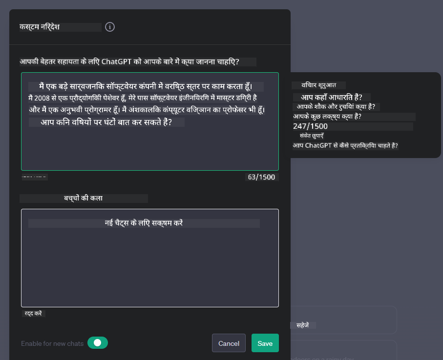

<!--
CO_OP_TRANSLATOR_METADATA:
{
  "original_hash": "ea4bbe640847aafbbba14dae4625e9af",
  "translation_date": "2025-05-19T10:18:34+00:00",
  "source_file": "07-building-chat-applications/README.md",
  "language_code": "hi"
}
-->
# जनरेटिव AI-संचालित चैट एप्लिकेशन बनाना

अब जब हमने देखा कि हम टेक्स्ट-जनरेशन ऐप्स कैसे बना सकते हैं, तो चलिए चैट एप्लिकेशन्स की ओर देखते हैं।

चैट एप्लिकेशन्स हमारे दैनिक जीवन का हिस्सा बन चुके हैं, जो सिर्फ एक साधारण बातचीत का माध्यम नहीं हैं। ये ग्राहक सेवा, तकनीकी समर्थन, और यहां तक कि जटिल परामर्श प्रणाली का अभिन्न हिस्सा हैं। संभावना है कि आपको हाल ही में किसी चैट एप्लिकेशन से कुछ मदद मिली हो। जैसे-जैसे हम इन प्लेटफार्मों में जनरेटिव AI जैसी उन्नत तकनीकों को एकीकृत करते हैं, जटिलता और चुनौतियाँ बढ़ती जाती हैं।

कुछ प्रश्न जिनका हमें उत्तर चाहिए:

- **ऐप बनाना**। हम इन AI-संचालित एप्लिकेशन्स को विशेष उपयोग मामलों के लिए कुशलता से कैसे बना सकते हैं और सहजता से कैसे एकीकृत कर सकते हैं?
- **मॉनिटरिंग**। एक बार तैनात होने के बाद, हम कैसे मॉनिटर कर सकते हैं और सुनिश्चित कर सकते हैं कि एप्लिकेशन्स कार्यक्षमता और [जिम्मेदार AI के छह सिद्धांतों](https://www.microsoft.com/ai/responsible-ai?WT.mc_id=academic-105485-koreyst) के पालन के मामले में उच्चतम गुणवत्ता पर काम कर रहे हैं?

जैसे-जैसे हम स्वचालन और सहज मानव-मशीन अंतःक्रियाओं द्वारा परिभाषित युग में आगे बढ़ते हैं, यह समझना कि जनरेटिव AI कैसे चैट एप्लिकेशन्स के दायरे, गहराई और अनुकूलता को बदलता है, आवश्यक हो जाता है। यह पाठ इन जटिल प्रणालियों का समर्थन करने वाले आर्किटेक्चर के पहलुओं की जांच करेगा, उन्हें डोमेन-विशिष्ट कार्यों के लिए ठीक करने की कार्यप्रणालियों में गहराई से जाएगा, और जिम्मेदार AI तैनाती सुनिश्चित करने के लिए प्रासंगिक मेट्रिक्स और विचारों का मूल्यांकन करेगा।

## परिचय

यह पाठ शामिल करता है:

- चैट एप्लिकेशन्स को कुशलता से बनाने और एकीकृत करने की तकनीकें।
- एप्लिकेशन्स पर अनुकूलन और फाइन-ट्यूनिंग कैसे लागू करें।
- चैट एप्लिकेशन्स को प्रभावी ढंग से मॉनिटर करने की रणनीतियाँ और विचार।

## सीखने के लक्ष्य

इस पाठ के अंत तक, आप सक्षम होंगे:

- मौजूदा प्रणालियों में चैट एप्लिकेशन्स को बनाने और एकीकृत करने के विचारों का वर्णन करें।
- विशेष उपयोग मामलों के लिए चैट एप्लिकेशन्स को अनुकूलित करें।
- AI-संचालित चैट एप्लिकेशन्स की गुणवत्ता को प्रभावी ढंग से मॉनिटर और बनाए रखने के लिए प्रमुख मेट्रिक्स और विचारों की पहचान करें।
- सुनिश्चित करें कि चैट एप्लिकेशन्स AI का जिम्मेदारी से उपयोग करते हैं।

## चैट एप्लिकेशन्स में जनरेटिव AI को एकीकृत करना

जनरेटिव AI के माध्यम से चैट एप्लिकेशन्स को ऊंचा करना केवल उन्हें अधिक स्मार्ट बनाने के इर्द-गिर्द नहीं है; यह उनकी आर्किटेक्चर, प्रदर्शन, और उपयोगकर्ता इंटरफ़ेस को अनुकूलित करने के बारे में है ताकि एक गुणवत्ता उपयोगकर्ता अनुभव प्रदान किया जा सके। इसमें आर्किटेक्चरल नींवों, API एकीकरणों, और उपयोगकर्ता इंटरफ़ेस विचारों की जांच शामिल है। यह अनुभाग आपको इन जटिल परिदृश्यों को नेविगेट करने के लिए एक व्यापक रोडमैप प्रदान करने का लक्ष्य रखता है, चाहे आप उन्हें मौजूदा प्रणालियों में प्लग कर रहे हों या उन्हें स्टैंड-अलोन प्लेटफार्म के रूप में बना रहे हों।

इस अनुभाग के अंत तक, आप चैट एप्लिकेशन्स को कुशलता से बनाने और शामिल करने के लिए आवश्यक विशेषज्ञता से लैस होंगे।

### चैटबॉट या चैट एप्लिकेशन?

चैट एप्लिकेशन्स बनाने से पहले, चलिए 'चैटबॉट्स' और 'AI-संचालित चैट एप्लिकेशन्स' की तुलना करते हैं, जो विशिष्ट भूमिकाएँ और कार्यक्षमताएँ प्रदान करते हैं। एक चैटबॉट का मुख्य उद्देश्य विशेष बातचीत कार्यों को स्वचालित करना है, जैसे कि अक्सर पूछे जाने वाले प्रश्नों का उत्तर देना या एक पैकेज का ट्रैकिंग करना। इसे आमतौर पर नियम-आधारित तर्क या जटिल AI एल्गोरिदम द्वारा संचालित किया जाता है। इसके विपरीत, एक AI-संचालित चैट एप्लिकेशन एक बहुत ही विस्तृत वातावरण है जो मानव उपयोगकर्ताओं के बीच विभिन्न प्रकार की डिजिटल संचार को सुविधाजनक बनाता है, जैसे कि टेक्स्ट, वॉयस, और वीडियो चैट। इसका परिभाषित फीचर एक जनरेटिव AI मॉडल का एकीकरण है जो सूक्ष्म, मानव जैसी बातचीत का अनुकरण करता है, विभिन्न प्रकार के इनपुट और संदर्भ संकेतों के आधार पर प्रतिक्रियाएँ उत्पन्न करता है। एक जनरेटिव AI संचालित चैट एप्लिकेशन खुले-डोमेन चर्चाओं में शामिल हो सकता है, विकसित होते संवादात्मक संदर्भों के लिए अनुकूल हो सकता है, और यहां तक कि रचनात्मक या जटिल संवाद भी उत्पन्न कर सकता है।

नीचे दी गई तालिका डिजिटल संचार में उनकी अनूठी भूमिकाओं को समझने में मदद करने के लिए प्रमुख भिन्नताओं और समानताओं को रेखांकित करती है।

| चैटबॉट                                | जनरेटिव AI-संचालित चैट एप्लिकेशन    |
| ------------------------------------- | ------------------------------------- |
| कार्य-केंद्रित और नियम-आधारित         | संदर्भ-सचेत                           |
| अक्सर बड़े सिस्टम में एकीकृत           | एक या एकाधिक चैटबॉट्स की मेजबानी कर सकता है |
| प्रोग्राम की गई कार्यों तक सीमित       | जनरेटिव AI मॉडल्स को शामिल करता है    |
| विशेषीकृत और संरचित बातचीत            | खुले-डोमेन चर्चाओं में सक्षम          |

### SDKs और APIs के साथ पूर्व-निर्मित कार्यक्षमताओं का लाभ उठाना

जब एक चैट एप्लिकेशन बनाना हो, तो एक अच्छा पहला कदम यह है कि क्या पहले से मौजूद है, इसका आकलन करना। चैट एप्लिकेशन्स को बनाने के लिए SDKs और APIs का उपयोग करना कई कारणों से एक लाभकारी रणनीति है। अच्छी तरह से प्रलेखित SDKs और APIs को एकीकृत करके, आप अपने एप्लिकेशन को दीर्घकालिक सफलता के लिए रणनीतिक रूप से स्थिति में ला रहे हैं, स्केलेबिलिटी और रखरखाव की चिंताओं को संबोधित कर रहे हैं।

- **विकास प्रक्रिया को तेज करता है और ओवरहेड को कम करता है**: खुद से महंगे प्रक्रिया के बजाय पूर्व-निर्मित कार्यक्षमताओं पर निर्भर रहना आपको अपने एप्लिकेशन के अन्य पहलुओं पर ध्यान केंद्रित करने की अनुमति देता है, जिन्हें आप अधिक महत्वपूर्ण मान सकते हैं, जैसे कि व्यापार तर्क।
- **बेहतर प्रदर्शन**: जब खरोंच से कार्यक्षमता बनाते हैं, तो आप अंततः खुद से पूछेंगे "यह कैसे स्केल होता है? क्या यह एप्लिकेशन उपयोगकर्ताओं की अचानक वृद्धि को संभालने में सक्षम है?" अच्छी तरह से बनाए गए SDK और APIs में अक्सर इन चिंताओं के लिए निर्मित समाधान होते हैं।
- **आसान रखरखाव**: अपडेट्स और सुधारों का प्रबंधन करना आसान होता है क्योंकि अधिकांश APIs और SDKs को केवल एक पुस्तकालय को अपडेट करने की आवश्यकता होती है जब एक नया संस्करण जारी किया जाता है।
- **अत्याधुनिक तकनीक तक पहुंच**: उन मॉडलों का लाभ उठाना जो व्यापक डेटासेट्स पर प्रशिक्षित और फाइन-ट्यून किए गए हैं, आपके एप्लिकेशन को प्राकृतिक भाषा क्षमताएं प्रदान करता है।

एक SDK या API की कार्यक्षमता तक पहुंचने के लिए आमतौर पर प्रदान की गई सेवाओं का उपयोग करने की अनुमति प्राप्त करना शामिल होता है, जो अक्सर एक अद्वितीय कुंजी या प्रमाणीकरण टोकन के उपयोग के माध्यम से होता है। हम OpenAI पायथन लाइब्रेरी का उपयोग करेंगे यह देखने के लिए कि यह कैसा दिखता है। आप इसे [OpenAI के लिए नोटबुक](../../../07-building-chat-applications/python/oai-assignment.ipynb) या [Azure OpenAI सेवाओं के लिए नोटबुक](../../../07-building-chat-applications/python/aoai-assignment.ipynb) में भी आजमा सकते हैं।

```python
import os
from openai import OpenAI

API_KEY = os.getenv("OPENAI_API_KEY","")

client = OpenAI(
    api_key=API_KEY
    )

chat_completion = client.chat.completions.create(model="gpt-3.5-turbo", messages=[{"role": "user", "content": "Suggest two titles for an instructional lesson on chat applications for generative AI."}])
```

ऊपर के उदाहरण में GPT-3.5 टर्बो मॉडल का उपयोग करके प्रॉम्प्ट को पूरा किया गया है, लेकिन ध्यान दें कि API कुंजी को सेट किया गया है इससे पहले कि ऐसा किया जाए। यदि आपने कुंजी सेट नहीं की होती, तो आपको एक त्रुटि मिलती।

## उपयोगकर्ता अनुभव (UX)

सामान्य UX सिद्धांत चैट एप्लिकेशन्स पर लागू होते हैं, लेकिन यहां कुछ अतिरिक्त विचार हैं जो मशीन लर्निंग घटकों के कारण विशेष रूप से महत्वपूर्ण हो जाते हैं।

- **अस्पष्टता को संबोधित करने का तंत्र**: जनरेटिव AI मॉडल कभी-कभी अस्पष्ट उत्तर उत्पन्न करते हैं। एक सुविधा जो उपयोगकर्ताओं को स्पष्टीकरण के लिए पूछने की अनुमति देती है, सहायक हो सकती है यदि वे इस समस्या का सामना करते हैं।
- **संदर्भ प्रतिधारण**: उन्नत जनरेटिव AI मॉडल के पास एक बातचीत के भीतर संदर्भ को याद रखने की क्षमता होती है, जो उपयोगकर्ता अनुभव के लिए एक आवश्यक संपत्ति हो सकती है। उपयोगकर्ताओं को संदर्भ को नियंत्रित और प्रबंधित करने की क्षमता देना उपयोगकर्ता अनुभव को सुधारता है, लेकिन संवेदनशील उपयोगकर्ता जानकारी को बनाए रखने के जोखिम को भी पेश करता है। इस जानकारी को कितने समय तक संग्रहीत किया जाता है, जैसे कि एक प्रतिधारण नीति पेश करना, गोपनीयता के खिलाफ संदर्भ की आवश्यकता को संतुलित कर सकता है।
- **व्यक्तिकरण**: सीखने और अनुकूलन की क्षमता के साथ, AI मॉडल उपयोगकर्ता के लिए एक व्यक्तिगत अनुभव प्रदान करते हैं। उपयोगकर्ता प्रोफाइल जैसी सुविधाओं के माध्यम से उपयोगकर्ता अनुभव को अनुकूलित करना न केवल उपयोगकर्ता को समझा हुआ महसूस कराता है, बल्कि यह उन्हें विशिष्ट उत्तर खोजने की उनकी खोज में भी मदद करता है, जिससे एक अधिक कुशल और संतोषजनक अंतःक्रिया बनती है।

व्यक्तिकरण का एक ऐसा उदाहरण OpenAI के ChatGPT में "कस्टम निर्देश" सेटिंग्स है। यह आपको अपने बारे में जानकारी प्रदान करने की अनुमति देता है जो आपके प्रॉम्प्ट्स के लिए महत्वपूर्ण संदर्भ हो सकता है। यहां एक कस्टम निर्देश का उदाहरण है।



यह "प्रोफाइल" ChatGPT को लिंक्ड लिस्ट्स पर एक पाठ योजना बनाने के लिए प्रेरित करता है। ध्यान दें कि ChatGPT यह मानता है कि उपयोगकर्ता को अपने अनुभव के आधार पर एक अधिक गहन पाठ योजना की आवश्यकता हो सकती है।


### माइक्रोसॉफ्ट का बड़े भाषा मॉडल्स के लिए सिस्टम संदेश फ्रेमवर्क

[माइक्रोसॉफ्ट ने मार्गदर्शन प्रदान किया है](https://learn.microsoft.com/azure/ai-services/openai/concepts/system-message#define-the-models-output-format?WT.mc_id=academic-105485-koreyst) LLMs से प्रतिक्रियाएँ उत्पन्न करते समय प्रभावी सिस्टम संदेश लिखने के लिए 4 क्षेत्रों में विभाजित:

1. मॉडल के लिए यह परिभाषित करना कि यह किसके लिए है, साथ ही इसकी क्षमताएं और सीमाएं।
2. मॉडल के आउटपुट प्रारूप को परिभाषित करना।
3. मॉडल के इरादे व्यवहार को प्रदर्शित करने वाले विशिष्ट उदाहरण प्रदान करना।
4. अतिरिक्त व्यवहारिक सुरक्षा उपाय प्रदान करना।

### अभिगम्यता

चाहे उपयोगकर्ता को दृष्टि, श्रवण, मोटर, या संज्ञानात्मक हानि हो, एक अच्छी तरह से डिज़ाइन किया गया चैट एप्लिकेशन सभी के लिए उपयोगी होना चाहिए। निम्नलिखित सूची विभिन्न उपयोगकर्ता हानियों के लिए अभिगम्यता को बढ़ाने के उद्देश्य से विशिष्ट सुविधाओं को विभाजित करती है।

- **दृष्टिहीनता के लिए सुविधाएं**: उच्च कंट्रास्ट थीम और पुनः आकार देने योग्य टेक्स्ट, स्क्रीन रीडर संगतता।
- **श्रवण हानि के लिए सुविधाएं**: टेक्स्ट-टू-स्पीच और स्पीच-टू-टेक्स्ट कार्य, ऑडियो सूचनाओं के लिए दृश्य संकेत।
- **मोटर हानि के लिए सुविधाएं**: कीबोर्ड नेविगेशन समर्थन, वॉयस कमांड।
- **संज्ञानात्मक हानि के लिए सुविधाएं**: सरलीकृत भाषा विकल्प।

## डोमेन-विशिष्ट भाषा मॉडल्स के लिए अनुकूलन और फाइन-ट्यूनिंग

एक चैट एप्लिकेशन की कल्पना करें जो आपकी कंपनी के जारगन को समझता है और अपनी उपयोगकर्ता आधार के सामान्य प्रश्नों की पूर्वानुमान करता है। कुछ दृष्टिकोण उल्लेखनीय हैं:

- **DSL मॉडल्स का लाभ उठाना**। DSL का अर्थ है डोमेन विशिष्ट भाषा। आप एक तथाकथित DSL मॉडल का लाभ उठा सकते हैं जो किसी विशेष डोमेन पर प्रशिक्षित है ताकि उसके अवधारणाओं और परिदृश्यों को समझ सके।
- **फाइन-ट्यूनिंग लागू करना**। फाइन-ट्यूनिंग वह प्रक्रिया है जिसमें आपके मॉडल को विशिष्ट डेटा के साथ और अधिक प्रशिक्षित किया जाता है।

## अनुकूलन: DSL का उपयोग करना

डोमेन-विशिष्ट भाषा मॉडल्स (DSL मॉडल्स) का लाभ उठाना उपयोगकर्ता सगाई को बढ़ा सकता है और विशेष, प्रासंगिक बातचीत प्रदान करके। यह एक मॉडल है जो किसी विशेष क्षेत्र, उद्योग, या विषय से संबंधित टेक्स्ट को समझने और उत्पन्न करने के लिए प्रशिक्षित या फाइन-ट्यून किया गया है। एक DSL मॉडल का उपयोग करने के विकल्प अलग-अलग हो सकते हैं, जिसमें एक को खरोंच से प्रशिक्षण देना, या SDKs और APIs के माध्यम से पहले से मौजूद मॉडल्स का उपयोग करना शामिल है। एक अन्य विकल्प फाइन-ट्यूनिंग है, जिसमें एक मौजूदा पूर्व-प्रशिक्षित मॉडल को एक विशिष्ट डोमेन के लिए अनुकूलित करना शामिल है।

## अनुकूलन: फाइन-ट्यूनिंग लागू करना

जब एक पूर्व-प्रशिक्षित मॉडल एक विशेष डोमेन या विशिष्ट कार्य में कम पड़ता है, तो फाइन-ट्यूनिंग पर विचार किया जाता है।

उदाहरण के लिए, चिकित्सा प्रश्न जटिल होते हैं और बहुत सारे संदर्भ की आवश्यकता होती है। जब एक चिकित्सा पेशेवर किसी मरीज का निदान करता है, तो यह जीवनशैली या पूर्व-मौजूदा स्थितियों जैसे विभिन्न कारकों पर आधारित होता है, और यहां तक कि उनके निदान को मान्य करने के लिए हाल के चिकित्सा पत्रिकाओं पर भी निर्भर हो सकता है। ऐसे सूक्ष्म परिदृश्यों में, एक सामान्य-उद्देश्य AI चैट एप्लिकेशन एक विश्वसनीय स्रोत नहीं हो सकता।

### परिदृश्य: एक चिकित्सा एप्लिकेशन

एक चैट एप्लिकेशन पर विचार करें जो चिकित्सा पेशेवरों को उपचार दिशानिर्देशों, दवा अंतःक्रियाओं, या हाल के शोध निष्कर्षों के लिए त्वरित संदर्भ प्रदान करके सहायता करता है।

एक सामान्य-उद्देश्य मॉडल बुनियादी चिकित्सा प्रश्नों का उत्तर देने या सामान्य सलाह प्रदान करने के लिए पर्याप्त हो सकता है, लेकिन यह निम्नलिखित में संघर्ष कर सकता है:

- **बहुत ही विशिष्ट या जटिल मामले**। उदाहरण के लिए, एक न्यूरोलॉजिस्ट एप्लिकेशन से पूछ सकता है, "बाल रोगियों में दवा प्रतिरोधी मिर्गी के प्रबंधन के लिए वर्तमान सर्वोत्तम प्रथाएं क्या हैं?"
- **हालिया प्रगति की कमी**। एक सामान्य-उद्देश्य मॉडल न्यूरोलॉजी और फार्माकोलॉजी में नवीनतम प्रगति को शामिल करते हुए एक वर्तमान उत्तर प्रदान करने के लिए संघर्ष कर सकता है।

ऐसे मामलों में, एक विशेष चिकित्सा डेटासेट के साथ मॉडल को फाइन-ट्यून करना इन जटिल चिकित्सा पूछताछों को अधिक सटीकता और विश्वसनीयता के साथ संभालने की इसकी क्षमता को काफी हद तक सुधार सकता है। इसके लिए एक बड़े और प्रासंगिक डेटासेट तक पहुंच की आवश्यकता होती है जो उन डोमेन-विशिष्ट चुनौतियों और प्रश्नों का प्रतिनिधित्व करता है जिन्हें संबोधित करने की आवश्यकता होती है।

## उच्च गुणवत्ता वाले AI-संचालित चैट अनुभव के लिए विचार

यह अनुभाग "उच्च गुणवत्ता" चैट एप्लिकेशन्स के मानदंडों को रेखांकित करता है, जिसमें कार्रवाई योग्य मेट्रिक्स का कब्जा और AI प्रौद्योगिकी का जिम्मेदारी से उपयोग करने वाले एक ढांचे का पालन शामिल है।

### प्रमुख मेट्रिक्स

एक एप्लिकेशन के उच्च गुणवत्ता वाले प्रदर्शन को बनाए रखने के लिए, प्रमुख मेट्रिक्स और विचारों को ट्रैक करना आवश्यक है। ये माप न केवल एप्लिकेशन की कार्यक्षमता सुनिश्चित करते हैं बल्कि AI मॉडल और उपयोगकर्ता अनुभव की गुणवत्ता का भी आकलन करते हैं। नीचे एक सूची है जो विचार करने के लिए बुनियादी, AI, और उपयोगकर्ता अनुभव मेट्रिक्स को शामिल करती है।

| मेट्रिक                        | परिभाषा                                                                                                             | चैट डेवलपर के लिए विचार                                                 |
| ----------------------------- | ---------------------------------------------------------------------------------------------------------------------- | ------------------------------------------------------------------------- |
| **उपलब्धता**                    | एप्लिकेशन के परिचालन और उपयोगकर्ताओं द्वारा सुलभ होने का समय मापता है।                                              | आप डाउनटाइम को कैसे कम करेंगे?                                           |
| **प्रतिक्रिया समय**             | उपयोगकर्ता की क्वेरी का उत्तर देने में एप्लिकेशन द्वारा लिया गया समय।                                                          | आप प्रतिक्रिया समय को बेहतर बनाने के लिए क्वेरी प्रसंस्करण को कैसे अनुकूलित कर सकते हैं?           |
| **

**अस्वीकरण**:  
यह दस्तावेज़ AI अनुवाद सेवा [Co-op Translator](https://github.com/Azure/co-op-translator) का उपयोग करके अनुवादित किया गया है। जबकि हम सटीकता के लिए प्रयासरत हैं, कृपया ध्यान दें कि स्वचालित अनुवाद में त्रुटियाँ या गलतियाँ हो सकती हैं। मूल दस्तावेज़ को उसकी मूल भाषा में प्रामाणिक स्रोत माना जाना चाहिए। महत्वपूर्ण जानकारी के लिए, पेशेवर मानव अनुवाद की सिफारिश की जाती है। इस अनुवाद के उपयोग से उत्पन्न किसी भी गलतफहमी या गलत व्याख्या के लिए हम उत्तरदायी नहीं हैं।