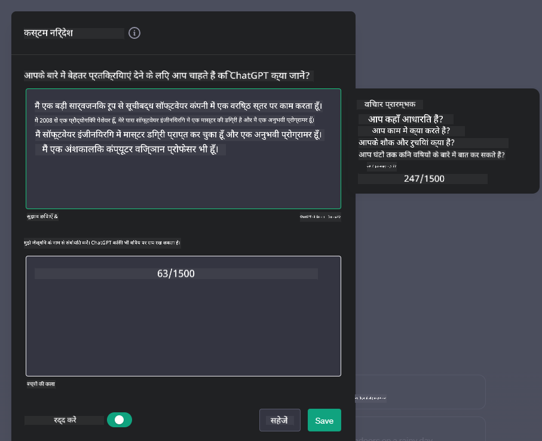
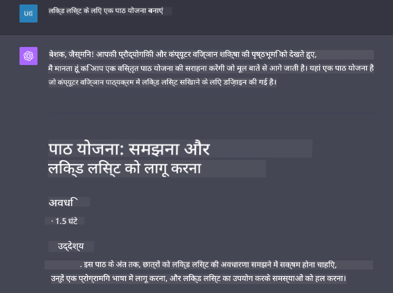

<!--
CO_OP_TRANSLATOR_METADATA:
{
  "original_hash": "ea4bbe640847aafbbba14dae4625e9af",
  "translation_date": "2025-06-25T15:18:04+00:00",
  "source_file": "07-building-chat-applications/README.md",
  "language_code": "hi"
}
-->
# जनरेटिव AI-संचालित चैट एप्लिकेशन बनाना

अब जब हमने देखा कि हम टेक्स्ट-जनरेशन एप्लिकेशन कैसे बना सकते हैं, तो आइए चैट एप्लिकेशन पर ध्यान दें।

चैट एप्लिकेशन हमारे दैनिक जीवन का हिस्सा बन गए हैं, जो सिर्फ आकस्मिक बातचीत के माध्यम नहीं हैं। वे ग्राहक सेवा, तकनीकी समर्थन, और यहां तक कि परिष्कृत सलाह प्रणाली का अभिन्न अंग हैं। यह संभव है कि आपको हाल ही में किसी चैट एप्लिकेशन से मदद मिली हो। जैसे-जैसे हम इन प्लेटफार्मों में जनरेटिव AI जैसी उन्नत तकनीकों को एकीकृत करते हैं, जटिलता और चुनौतियां बढ़ती जाती हैं।

कुछ सवाल जो हमें हल करने की जरूरत है:

- **एप्लिकेशन बनाना**। हम इन AI-संचालित एप्लिकेशन को विशेष उपयोग मामलों के लिए कुशलतापूर्वक कैसे बनाएं और निर्बाध रूप से एकीकृत करें?
- **निगरानी**। एक बार तैनात होने के बाद, हम कैसे सुनिश्चित करें कि एप्लिकेशन उच्चतम गुणवत्ता के स्तर पर कार्य कर रहे हैं, कार्यक्षमता के मामले में और [जिम्मेदार AI के छह सिद्धांतों](https://www.microsoft.com/ai/responsible-ai?WT.mc_id=academic-105485-koreyst) का पालन करते हुए?

जैसे-जैसे हम स्वचालन और निर्बाध मानव-मशीन इंटरैक्शन की परिभाषित युग में आगे बढ़ते हैं, यह समझना आवश्यक हो जाता है कि जनरेटिव AI कैसे चैट एप्लिकेशन के दायरे, गहराई, और अनुकूलनशीलता को बदलता है। यह पाठ इन जटिल प्रणालियों का समर्थन करने वाले वास्तुकला के पहलुओं की जांच करेगा, उन्हें डोमेन-विशिष्ट कार्यों के लिए ठीक करने की पद्धतियों में गहराई से उतरेगा, और जिम्मेदार AI तैनाती सुनिश्चित करने के लिए प्रासंगिक मीट्रिक और विचारों का मूल्यांकन करेगा।

## परिचय

यह पाठ शामिल करता है:

- चैट एप्लिकेशन को कुशलतापूर्वक बनाने और एकीकृत करने की तकनीकें।
- एप्लिकेशन में अनुकूलन और फाइन-ट्यूनिंग कैसे लागू करें।
- चैट एप्लिकेशन की प्रभावी निगरानी के लिए रणनीतियाँ और विचार।

## सीखने के लक्ष्य

इस पाठ के अंत तक, आप सक्षम होंगे:

- मौजूदा प्रणालियों में चैट एप्लिकेशन को बनाने और एकीकृत करने के लिए विचारों का वर्णन करें।
- विशेष उपयोग मामलों के लिए चैट एप्लिकेशन को अनुकूलित करें।
- AI-संचालित चैट एप्लिकेशन की गुणवत्ता को प्रभावी ढंग से मॉनिटर और बनाए रखने के लिए प्रमुख मीट्रिक और विचारों की पहचान करें।
- सुनिश्चित करें कि चैट एप्लिकेशन AI का जिम्मेदारी से उपयोग करते हैं।

## चैट एप्लिकेशन में जनरेटिव AI का एकीकरण

जनरेटिव AI के माध्यम से चैट एप्लिकेशन को उन्नत करना केवल उन्हें स्मार्ट बनाना नहीं है; यह उनकी वास्तुकला, प्रदर्शन, और उपयोगकर्ता इंटरफ़ेस को अनुकूलित करने के बारे में है ताकि एक गुणवत्ता उपयोगकर्ता अनुभव प्रदान किया जा सके। इसमें वास्तुकला की नींव, API एकीकरण, और उपयोगकर्ता इंटरफ़ेस के विचारों की जांच करना शामिल है। यह खंड आपको इन जटिल परिदृश्यों को नेविगेट करने के लिए एक व्यापक रोडमैप प्रदान करने का लक्ष्य रखता है, चाहे आप उन्हें मौजूदा प्रणालियों में प्लग कर रहे हों या उन्हें स्टैंड-अलोन प्लेटफॉर्म के रूप में बना रहे हों।

इस खंड के अंत तक, आप चैट एप्लिकेशन को कुशलतापूर्वक बनाने और शामिल करने के लिए आवश्यक विशेषज्ञता से लैस होंगे।

### चैटबॉट या चैट एप्लिकेशन?

चैट एप्लिकेशन बनाने से पहले, आइए 'चैटबॉट्स' और 'AI-संचालित चैट एप्लिकेशन' की तुलना करें, जो विशिष्ट भूमिकाएं और कार्यक्षमताएं प्रदान करते हैं। एक चैटबॉट का मुख्य उद्देश्य विशिष्ट बातचीत कार्यों को स्वचालित करना है, जैसे कि अक्सर पूछे जाने वाले प्रश्नों का उत्तर देना या पैकेज को ट्रैक करना। यह आमतौर पर नियम-आधारित लॉजिक या जटिल AI एल्गोरिदम द्वारा शासित होता है। इसके विपरीत, एक AI-संचालित चैट एप्लिकेशन एक अधिक व्यापक वातावरण है जिसे मानव उपयोगकर्ताओं के बीच विभिन्न प्रकार के डिजिटल संचार की सुविधा के लिए डिज़ाइन किया गया है, जैसे कि टेक्स्ट, वॉयस, और वीडियो चैट। इसकी परिभाषित विशेषता एक जनरेटिव AI मॉडल का एकीकरण है जो सूक्ष्म, मानव-जैसी बातचीत का अनुकरण करता है, जो विभिन्न प्रकार के इनपुट और संदर्भ संकेतों के आधार पर प्रतिक्रियाएं उत्पन्न करता है। एक जनरेटिव AI संचालित चैट एप्लिकेशन खुली-डोमेन चर्चाओं में शामिल हो सकता है, विकसित हो रही बातचीत के संदर्भों के अनुकूल हो सकता है, और यहां तक कि रचनात्मक या जटिल संवाद भी उत्पन्न कर सकता है।

नीचे दी गई तालिका डिजिटल संचार में उनकी अनूठी भूमिकाओं को समझने में मदद करने के लिए प्रमुख अंतरों और समानताओं को रेखांकित करती है।

| चैटबॉट                                | जनरेटिव AI-संचालित चैट एप्लिकेशन |
| ------------------------------------- | ----------------------------------- |
| कार्य-केंद्रित और नियम-आधारित         | संदर्भ-सचेत                         |
| अक्सर बड़े सिस्टमों में एकीकृत          | एक या एकाधिक चैटबॉट्स की मेजबानी कर सकते हैं |
| प्रोग्राम्ड कार्यों तक सीमित            | जनरेटिव AI मॉडल शामिल करता है     |
| विशेषीकृत और संरचित बातचीत             | खुली-डोमेन चर्चाओं में सक्षम      |

### SDKs और APIs के साथ पहले से निर्मित कार्यक्षमताओं का लाभ उठाना

चैट एप्लिकेशन बनाते समय, पहले से मौजूद क्या है, इसका आकलन करना एक बेहतरीन पहला कदम है। SDKs और APIs का उपयोग करके चैट एप्लिकेशन बनाना कई कारणों से एक लाभकारी रणनीति है। अच्छी तरह से प्रलेखित SDKs और APIs को एकीकृत करके, आप अपने एप्लिकेशन को दीर्घकालिक सफलता के लिए रणनीतिक रूप से स्थिति में ला रहे हैं, स्केलेबिलिटी और रखरखाव की चिंताओं को संबोधित करते हुए।

- **विकास प्रक्रिया को तेज करता है और ओवरहेड को कम करता है**: पहले से निर्मित कार्यक्षमताओं पर निर्भर रहना, बजाय खुद उन्हें बनाने की महंगी प्रक्रिया के, आपको अपने एप्लिकेशन के अन्य पहलुओं पर ध्यान केंद्रित करने की अनुमति देता है जिन्हें आप अधिक महत्वपूर्ण मान सकते हैं, जैसे कि व्यवसाय लॉजिक।
- **बेहतर प्रदर्शन**: जब आप स्क्रैच से कार्यक्षमता बनाते हैं, तो अंततः आप खुद से पूछेंगे "यह कैसे स्केल करता है? क्या यह एप्लिकेशन अचानक उपयोगकर्ताओं की बाढ़ को संभालने में सक्षम है?" अच्छी तरह से बनाए गए SDK और APIs में अक्सर इन चिंताओं के लिए अंतर्निहित समाधान होते हैं।
- **आसान रखरखाव**: अपडेट और सुधारों का प्रबंधन आसान होता है क्योंकि अधिकांश APIs और SDKs को केवल एक लाइब्रेरी को अपडेट करने की आवश्यकता होती है जब एक नया संस्करण जारी किया जाता है।
- **अत्याधुनिक तकनीक तक पहुंच**: उन मॉडलों का लाभ उठाना जो व्यापक डेटासेट पर फाइन-ट्यून और प्रशिक्षित किए गए हैं, आपके एप्लिकेशन को प्राकृतिक भाषा क्षमताएं प्रदान करता है।

किसी SDK या API की कार्यक्षमता का उपयोग करने में आमतौर पर प्रदत्त सेवाओं का उपयोग करने की अनुमति प्राप्त करना शामिल होता है, जो अक्सर एक अद्वितीय कुंजी या प्रमाणीकरण टोकन के उपयोग के माध्यम से होता है। हम OpenAI Python लाइब्रेरी का उपयोग करके देखेंगे कि यह कैसा दिखता है। आप इसे अपने आप भी आज़मा सकते हैं इस पाठ के लिए [OpenAI के लिए नोटबुक](../../../07-building-chat-applications/python/oai-assignment.ipynb) या [Azure OpenAI सेवाओं के लिए नोटबुक](../../../07-building-chat-applications/python/aoai-assignment.ipynb) में।

```python
import os
from openai import OpenAI

API_KEY = os.getenv("OPENAI_API_KEY","")

client = OpenAI(
    api_key=API_KEY
    )

chat_completion = client.chat.completions.create(model="gpt-3.5-turbo", messages=[{"role": "user", "content": "Suggest two titles for an instructional lesson on chat applications for generative AI."}])
```

ऊपर दिए गए उदाहरण में GPT-3.5 Turbo मॉडल का उपयोग प्रॉम्प्ट को पूरा करने के लिए किया गया है, लेकिन ध्यान दें कि ऐसा करने से पहले API कुंजी सेट की गई है। अगर आपने कुंजी सेट नहीं की होती तो आपको एक त्रुटि प्राप्त होती।

## उपयोगकर्ता अनुभव (UX)

सामान्य UX सिद्धांत चैट एप्लिकेशन पर लागू होते हैं, लेकिन यहां कुछ अतिरिक्त विचार हैं जो मशीन लर्निंग घटकों के कारण विशेष रूप से महत्वपूर्ण हो जाते हैं।

- **अस्पष्टता को संबोधित करने के लिए तंत्र**: जनरेटिव AI मॉडल कभी-कभी अस्पष्ट उत्तर उत्पन्न करते हैं। एक ऐसी विशेषता जो उपयोगकर्ताओं को स्पष्टीकरण के लिए पूछने की अनुमति देती है, तब सहायक हो सकती है जब वे इस समस्या का सामना करते हैं।
- **संदर्भ प्रतिधारण**: उन्नत जनरेटिव AI मॉडल के पास एक बातचीत के भीतर संदर्भ को याद रखने की क्षमता होती है, जो उपयोगकर्ता अनुभव के लिए एक आवश्यक संपत्ति हो सकती है। उपयोगकर्ताओं को संदर्भ को नियंत्रित और प्रबंधित करने की क्षमता देना उपयोगकर्ता अनुभव को सुधारता है, लेकिन संवेदनशील उपयोगकर्ता जानकारी को बनाए रखने के जोखिम को भी प्रस्तुत करता है। इस जानकारी को कितने समय तक संग्रहीत किया जाता है, जैसे कि एक प्रतिधारण नीति पेश करना, गोपनीयता के खिलाफ संदर्भ की आवश्यकता को संतुलित कर सकता है।
- **व्यक्तिगतकरण**: सीखने और अनुकूलन की क्षमता के साथ, AI मॉडल उपयोगकर्ता के लिए एक व्यक्तिगत अनुभव प्रदान करते हैं। उपयोगकर्ता प्रोफाइल जैसी सुविधाओं के माध्यम से उपयोगकर्ता अनुभव को अनुकूलित करना न केवल उपयोगकर्ता को समझा हुआ महसूस कराता है, बल्कि यह उन्हें विशिष्ट उत्तर खोजने में मदद करता है, जिससे अधिक कुशल और संतोषजनक बातचीत होती है।

व्यक्तिगतकरण का एक उदाहरण OpenAI के ChatGPT में "कस्टम निर्देश" सेटिंग्स है। यह आपको अपने बारे में जानकारी प्रदान करने की अनुमति देता है जो आपके प्रॉम्प्ट्स के लिए महत्वपूर्ण संदर्भ हो सकता है। यहां एक कस्टम निर्देश का उदाहरण है।



यह "प्रोफ़ाइल" ChatGPT को लिंक्ड लिस्ट्स पर एक पाठ योजना बनाने के लिए प्रेरित करता है। ध्यान दें कि ChatGPT इस बात को ध्यान में रखता है कि उपयोगकर्ता अपने अनुभव के आधार पर एक अधिक गहराई वाली पाठ योजना चाह सकता है।



### बड़े भाषा मॉडल के लिए माइक्रोसॉफ्ट का सिस्टम संदेश फ्रेमवर्क

[माइक्रोसॉफ्ट ने मार्गदर्शन प्रदान किया है](https://learn.microsoft.com/azure/ai-services/openai/concepts/system-message#define-the-models-output-format?WT.mc_id=academic-105485-koreyst) जब LLMs से प्रतिक्रियाएं उत्पन्न करने के लिए प्रभावी सिस्टम संदेश लिखने की बात आती है, जो 4 क्षेत्रों में विभाजित है:

1. मॉडल के लिए कौन है, साथ ही इसकी क्षमताएं और सीमाएं परिभाषित करना।
2. मॉडल के आउटपुट प्रारूप को परिभाषित करना।
3. मॉडल के इरादे वाले व्यवहार को प्रदर्शित करने वाले विशिष्ट उदाहरण प्रदान करना।
4. अतिरिक्त व्यवहारिक गार्डरेल प्रदान करना।

### पहुंच

चाहे उपयोगकर्ता को दृष्टि, श्रवण, मोटर, या संज्ञानात्मक विकलांगता हो, एक अच्छी तरह से डिज़ाइन किया गया चैट एप्लिकेशन सभी के लिए उपयोग करने योग्य होना चाहिए। निम्नलिखित सूची विभिन्न उपयोगकर्ता विकलांगताओं के लिए पहुंच को बढ़ाने के उद्देश्य से विशिष्ट सुविधाओं को तोड़ती है।

- **दृष्टिबाधितों के लिए सुविधाएँ**: उच्च कंट्रास्ट थीम और पुनः आकार देने योग्य पाठ, स्क्रीन रीडर संगतता।
- **श्रवण बाधितों के लिए सुविधाएँ**: टेक्स्ट-टू-स्पीच और स्पीच-टू-टेक्स्ट कार्य, ऑडियो सूचनाओं के लिए दृश्य संकेत।
- **मोटर बाधितों के लिए सुविधाएँ**: कीबोर्ड नेविगेशन समर्थन, वॉयस कमांड।
- **संज्ञानात्मक विकलांगता के लिए सुविधाएँ**: सरल भाषा विकल्प।

## डोमेन-विशिष्ट भाषा मॉडल के लिए अनुकूलन और फाइन-ट्यूनिंग

कल्पना करें एक चैट एप्लिकेशन जो आपकी कंपनी के जारगन को समझता है और उन विशेष प्रश्नों की पूर्वानुमान लगाता है जो इसके उपयोगकर्ता आधार को सामान्यतः होते हैं। कुछ दृष्टिकोण हैं जिनका उल्लेख करना महत्वपूर्ण है:

- **DSL मॉडल का लाभ उठाना**। DSL का मतलब डोमेन-विशिष्ट भाषा है। आप एक तथाकथित DSL मॉडल का लाभ उठा सकते हैं जो एक विशिष्ट डोमेन पर प्रशिक्षित होता है ताकि इसके अवधारणाओं और परिदृश्यों को समझ सके।
- **फाइन-ट्यूनिंग लागू करना**। फाइन-ट्यूनिंग एक विशेष डेटा के साथ आपके मॉडल को और अधिक प्रशिक्षित करने की प्रक्रिया है।

## अनुकूलन: एक DSL का उपयोग करना

डोमेन-विशिष्ट भाषा मॉडल (DSL मॉडल) का लाभ उठाना उपयोगकर्ता जुड़ाव को बढ़ा सकता है और विशेषीकृत, संदर्भ-संबंधित इंटरैक्शन प्रदान कर सकता है। यह एक मॉडल है जिसे किसी विशिष्ट क्षेत्र, उद्योग, या विषय से संबंधित पाठ को समझने और उत्पन्न करने के लिए प्रशिक्षित या फाइन-ट्यून किया गया है। एक DSL मॉडल का उपयोग करने के विकल्प स्क्रैच से एक प्रशिक्षण से लेकर, SDKs और APIs के माध्यम से पहले से मौजूद एक का उपयोग करने तक भिन्न हो सकते हैं। एक अन्य विकल्प फाइन-ट्यूनिंग है, जिसमें एक मौजूदा पूर्व-प्रशिक्षित मॉडल को एक विशिष्ट डोमेन के लिए अनुकूलित करना शामिल है।

## अनुकूलन: फाइन-ट्यूनिंग लागू करना

फाइन-ट्यूनिंग अक्सर तब विचार किया जाता है जब एक पूर्व-प्रशिक्षित मॉडल एक विशेष डोमेन या विशिष्ट कार्य में कमी करता है।

उदाहरण के लिए, चिकित्सा प्रश्न जटिल होते हैं और बहुत सारे संदर्भ की आवश्यकता होती है। जब एक चिकित्सा पेशेवर एक मरीज का निदान करता है, तो यह जीवनशैली या पूर्व-मौजूद स्थितियों जैसे विभिन्न कारकों पर आधारित होता है, और यहां तक कि उनके निदान को मान्य करने के लिए हाल के चिकित्सा पत्रिकाओं पर भी निर्भर हो सकता है। ऐसे सूक्ष्म परिदृश्यों में, एक सामान्य-उद्देश्य AI चैट एप्लिकेशन एक विश्वसनीय स्रोत नहीं हो सकता है।

### परिदृश्य: एक चिकित्सा एप्लिकेशन

एक चैट एप्लिकेशन की कल्पना करें जिसे चिकित्सा चिकित्सकों की सहायता के लिए डिज़ाइन किया गया है, जो उपचार दिशानिर्देशों, दवा अंतःक्रियाओं, या हाल के अनुसंधान निष्कर्षों के लिए त्वरित संदर्भ प्रदान करता है।

एक सामान्य-उद्देश्य मॉडल बुनियादी चिकित्सा प्रश्नों का उत्तर देने या सामान्य सलाह प्रदान करने के लिए पर्याप्त हो सकता है, लेकिन यह निम्नलिखित में संघर्ष कर सकता है:

- **अत्यधिक विशिष्ट या जटिल मामले**। उदाहरण के लिए, एक न्यूरोलॉजिस्ट एप्लिकेशन से पूछ सकता है, "बाल रोगियों में दवा-प्रतिरोधी मिर्गी के प्रबंधन के लिए वर्तमान सर्वोत्तम प्रथाएं क्या हैं?"
- **हालिया प्रगति की कमी**। एक सामान्य-उद्देश्य मॉडल न्यूरोलॉजी और फार्माकोलॉजी में सबसे हाल की प्रगति को शामिल करते हुए एक वर्तमान उत्तर प्रदान करने में संघर्ष कर सकता है।

ऐसे मामलों में, एक विशेष चिकित्सा डेटासेट के साथ मॉडल को फाइन-ट्यून करना इन जटिल चिकित्सा पूछताछों को अधिक सटीक और विश्वसनीय रूप से संभालने की इसकी क्षमता को काफी हद तक सुधार सकता है। इसके लिए एक बड़े और प्रासंगिक डेटासेट की आवश्यकता होती है जो डोमेन-विशिष्ट चुनौतियों और प्रश्नों का प्रतिनिधित्व करता है जिन्हें संबोधित करने की आवश्यकता होती है।

## उच्च गुणवत्ता वाले AI-संचालित चैट अनुभव के लिए विचार

यह खंड "उच्च गुणवत्ता" चैट एप्लिकेशन के लिए मानदंडों को रेखांकित करता है, जिसमें क्रियाशील मीट्रिक का कब्जा और AI तकनीक का जिम्मेदारी से लाभ उठाने के लिए एक फ्रेमवर्क का पालन शामिल है।

### प्रमुख मीट्रिक

एप्लिकेशन के उच्च-गुणवत्ता वाले प्रदर्शन को बनाए रखने के लिए, प्रमुख मीट्रिक और विचारों पर नज़र रखना आवश्यक है। ये माप न केवल एप्लिकेशन की कार्यक्षमता सुनिश्चित करते हैं बल्कि AI मॉडल और उपयोगकर्ता अनुभव की गुणवत्ता का भी आकलन करते हैं। नीचे एक सूची है जो विचार करने के लिए बुनियादी, AI, और उपयोगकर्ता अनुभव मीट्रिक को कवर करती है।

| मीट्रिक                        | परिभाषा                                                                                                             | चैट डेवलपर के लिए विचार                                                  |
| ----------------------------- | ------------------------------------------------------------------------------------------------------------------ | ------------------------------------------------------------------------ |
| **अपटाइम**                    | एप्लिकेशन के संचालन और उपयोगकर्ताओं द्वारा सुलभ समय को मापता है।                                                   | आप डाउनटाइम को कैसे कम करेंगे?                                            |
| **प्रतिक्रिया समय**             | एप्लिकेशन द्वारा उपयोगकर्ता के प्रश्न का उत्तर देने में लिया गया समय।                                               | आप प्रतिक्रिया समय को सुधारने के लिए क्वेरी प्रोसेसिंग को कैसे अनुकूलित करेंगे?  |
| **प्रेसिजन**                 | सकारात्मक भविष्यवाणियों की कुल संख्या

**अस्वीकरण**:  
यह दस्तावेज़ AI अनुवाद सेवा [Co-op Translator](https://github.com/Azure/co-op-translator) का उपयोग करके अनुवादित किया गया है। जबकि हम सटीकता के लिए प्रयासरत हैं, कृपया ध्यान दें कि स्वचालित अनुवादों में त्रुटियाँ या अशुद्धियाँ हो सकती हैं। मूल दस्तावेज़ को इसकी मूल भाषा में प्राधिकारी स्रोत माना जाना चाहिए। महत्वपूर्ण जानकारी के लिए, पेशेवर मानव अनुवाद की सिफारिश की जाती है। इस अनुवाद के उपयोग से उत्पन्न किसी भी गलतफहमी या गलत व्याख्या के लिए हम उत्तरदायी नहीं हैं।