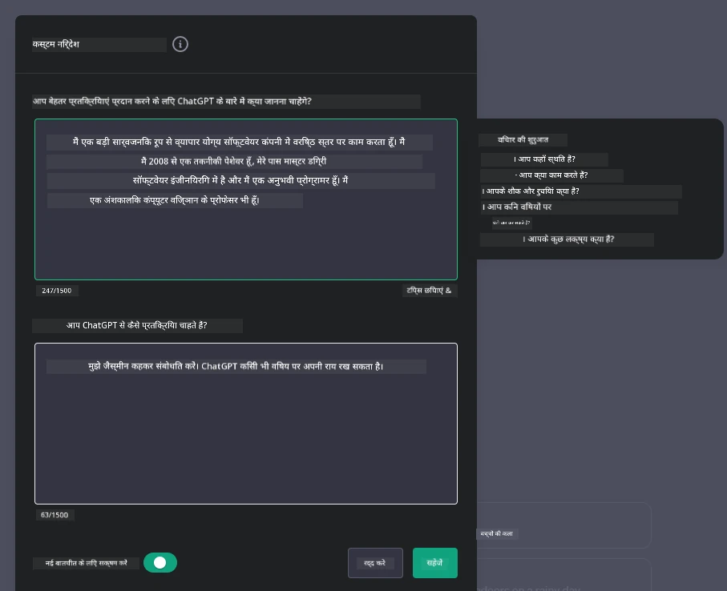

# जनरेटिव एआई-संचालित चैट ऐप्लिकेशन बनाना

[](https://youtu.be/R9V0ZY1BEQo?si=IHuU-fS9YWT8s4sA)

> _(इस पाठ का वीडियो देखने के लिए ऊपर छवि पर क्लिक करें)_

अब जब हमने देखा कि कैसे हम टेक्स्ट-जेनरेशन ऐप्लिकेशन बना सकते हैं, तो आइए चैट ऐप्लिकेशन देखें।

चैट ऐप्लिकेशन हमारे दैनिक जीवन में एकीकृत हो गए हैं, जो केवल आकस्मिक वार्तालाप के साधन से कहीं अधिक प्रदान करते हैं। वे ग्राहक सेवा, तकनीकी सहायता, और यहां तक कि परिष्कृत सलाहकार प्रणालियों के अभिन्न अंग हैं। संभावना है कि आपने हाल ही में किसी चैट ऐप्लिकेशन से मदद ली हो। जैसे-जैसे हम जनरेटिव एआई जैसी उन्नत तकनीकों को इन प्लेटफार्मों में एकीकृत करते हैं, जटिलता बढ़ती है और चुनौतियां भी।

कुछ प्रश्न जिन्हें हमें उत्तर देने की आवश्यकता है:

- **ऐप बनाना**। हम विशिष्ट उपयोग मामलों के लिए इन एआई-संचालित ऐप्लिकेशन को प्रभावी ढंग से कैसे बना सकते हैं और निर्बाध रूप से एकीकृत कर सकते हैं?
- **निगरानी**। एक बार तैनात हो जाने के बाद, हम कैसे निगरानी कर सकते हैं और सुनिश्चित कर सकते हैं कि ऐप्लिकेशन कार्यक्षमता और [जिम्मेदार AI के छह सिद्धांतों](https://www.microsoft.com/ai/responsible-ai?WT.mc_id=academic-105485-koreyst) के पालन दोनों में उच्चतम गुणवत्ता स्तर पर काम कर रहे हैं?

जैसे-जैसे हम स्वचालन और निर्बाध मानव-मशीन इंटरैक्शन युग में आगे बढ़ते हैं, यह समझना आवश्यक हो जाता है कि जनरेटिव एआई चैट ऐप्लिकेशन की सीमा, गहराई, और अनुकूलन क्षमता को कैसे बदलता है। यह पाठ इन जटिल प्रणालियों का समर्थन करने वाली वास्तुकला के पहलुओं की जांच करेगा, डोमेन-विशिष्ट कार्यों के लिए इन्हें फाइन-ट्यून करने की पद्धतियों में गहराई से जाएगा, और जिम्मेदार एआई तैनाती सुनिश्चित करने के लिए विचारणीय मीट्रिक्स और विचारों का मूल्यांकन करेगा।

## परिचय

यह पाठ निम्नलिखित विषयों को कवर करता है:

- चैट ऐप्लिकेशन को प्रभावी ढंग से बनाने और एकीकृत करने की तकनीकें।
- ऐप्लिकेशन में कस्टमाइज़ेशन और फाइन-ट्यूनिंग कैसे लागू करें।
- चैट ऐप्लिकेशन की प्रभावी निगरानी के लिए रणनीतियाँ और विचार।

## सीखने के लक्ष्य

इस पाठ के अंत तक, आप सक्षम होंगे:

- मौजूदा प्रणालियों में चैट ऐप्लिकेशन को बनाने और एकीकृत करने के विचारों का वर्णन करें।
- विशिष्ट उपयोग मामलों के लिए चैट ऐप्लिकेशन को अनुकूलित करें।
- एआई-संचालित चैट ऐप्लिकेशन की गुणवत्ता की प्रभावी निगरानी और रख-रखाव के लिए महत्वपूर्ण मीट्रिक्स और विचारों की पहचान करें।
- सुनिश्चित करें कि चैट ऐप्लिकेशन जिम्मेदारी से एआई का उपयोग करें।

## चैट ऐप्लिकेशन में जनरेटिव एआई को एकीकृत करना

चैट ऐप्लिकेशन को जनरेटिव एआई के माध्यम से उन्नत करना केवल उन्हें स्मार्ट बनाने के बारे में नहीं है; यह उनकी वास्तुकला, प्रदर्शन, और उपयोगकर्ता इंटरफ़ेस को बेहतर बनाकर एक गुणवत्तापूर्ण उपयोगकर्ता अनुभव प्रदान करने के बारे में है। इसमें वास्तुकला की नींव, API एकीकरण, और उपयोगकर्ता इंटरफ़ेस विचार शामिल हैं। यह खंड आपको इन जटिल क्षेत्रों को नेविगेट करने के लिए एक व्यापक रोडमैप प्रदान करने का उद्देश्य रखता है, चाहे आप इन्हें मौजूदा प्रणालियों में प्लग इन कर रहे हों या स्वतंत्र प्लेटफॉर्म के रूप में बना रहे हों।

इस खंड के अंत तक, आप चैट ऐप्लिकेशन को कुशलतापूर्वक निर्माण और सम्मिलित करने के लिए आवश्यक विशेषज्ञता से लैस होंगे।

### चैटबॉट या चैट ऐप्लिकेशन?

चैट ऐप्लिकेशन बनाने में गहराई से जाने से पहले, चलिए 'चैटबॉट' और 'एआई-संचालित चैट ऐप्लिकेशन' की तुलना करते हैं, जो अलग-अलग भूमिकाओं और कार्यक्षमताओं की सेवा करते हैं। एक चैटबॉट का मुख्य उद्देश्य विशिष्ट बातचीत के कार्यों को स्वचालित करना है, जैसे अक्सर पूछे जाने वाले प्रश्नों का जवाब देना या एक पैकेज को ट्रैक करना। यह आमतौर पर नियम-आधारित तर्क या जटिल एआई एल्गोरिदम द्वारा संचालित होता है। इसके विपरीत, एक एआई-संचालित चैट ऐप्लिकेशन एक बहुत व्यापक वातावरण है जो विभिन्न प्रकार की डिजिटल संचार के लिए डिज़ाइन किया गया है, जैसे मानव उपयोगकर्ताओं के बीच टेक्स्ट, आवाज़, और वीडियो चैट। इसकी परिभाषित विशेषता एक जनरेटिव एआई मॉडल का एकीकरण है जो सूक्ष्म, मानव-समान वार्तालाप की नकल करता है, जो विभिन्न इनपुट और संदर्भ संकेतों के आधार पर प्रतिक्रियाएं उत्पन्न करता है। एक जनरेटिव एआई संचालित चैट ऐप्लिकेशन खुले-डोमेन चर्चाओं में संलग्न हो सकता है, बदलते वार्तालाप संदर्भों के अनुकूल हो सकता है, और यहां तक ​​कि रचनात्मक या जटिल संवाद भी उत्पन्न कर सकता है।

नीचे दी गई तालिका उनके विशिष्ट भूमिकाओं को डिजिटल संचार में समझने में मदद करने के लिए मुख्य अंतर और समानताएं दर्शाती है।

| चैटबॉट                               | जनरेटिव एआई-संचालित चैट ऐप्लिकेशन                 |
| ------------------------------------- | -------------------------------------- |
| कार्य-केंद्रित और नियम आधारित         | संदर्भ-संज्ञानी                            |
| अक्सर बड़े सिस्टम में एकीकृत             | एक या एक से अधिक चैटबॉट होस्ट कर सकता है         |
| प्रोग्राम किए गए कार्यों तक सीमित        | जनरेटिव एआई मॉडल शामिल करता है                   |
| विशिष्ट और संरचित इंटरैक्शन             | खुले-डोमेन चर्चाओं में सक्षम                     |

### SDKs और APIs के साथ पूर्व-निर्मित कार्यक्षमता का लाभ उठाना

जब आप चैट ऐप्लिकेशन बना रहे हों, तो एक अच्छा पहला कदम यह आकलन करना है कि पहले से क्या उपलब्ध है। SDKs और APIs का उपयोग करके चैट ऐप्लिकेशन बनाना कई कारणों से एक लाभकारी रणनीति है। अच्छी तरह से प्रलेखित SDKs और APIs को एकीकृत करके, आप अपनी ऐप्लिकेशन को दीर्घकालिक सफलता के लिए रणनीतिक रूप से स्थिति देते हैं, जिससे पैमाने पर विस्तार और रखरखाव चिंताओं को संबोधित किया जाता है।

- **विकास प्रक्रिया को गति देता है और ओवरहेड कम करता है**: स्वयं उन्हें बनाने की महंगी प्रक्रिया के बजाय पूर्व-निर्मित कार्यक्षमता पर निर्भर रहने से आप अपनी ऐप्लिकेशन के अन्य पहलुओं पर ध्यान केंद्रित कर सकते हैं, जैसे कि व्यवसाय तर्क।
- **बेहतर प्रदर्शन**: जब आप कार्यक्षमता को शुरुआत से बनाते हैं, तो आप अंततः पूछेंगे "यह कैसे स्केल करता है? क्या यह ऐप्लिकेशन अचानक उपयोगकर्ताओं की बढ़ोतरी को संभालने में सक्षम है?" अच्छी तरह से प्रबंधित SDK और APIs में अक्सर इन चिंताओं के लिए अंतर्निर्मित समाधान होते हैं।
- **सरल रखरखाव**: अधिकांश APIs और SDKs सिर्फ एक लाइब्रेरी अपडेट की आवश्यकता होती है जब नई संस्करण रिलीज होती है, जिससे अपडेट और सुधार को प्रबंधित करना आसान होता है।
- **अग्रिम तकनीक तक पहुंच**: व्यापक डेटासेट पर फाइन-ट्यून और प्रशिक्षण प्राप्त मॉडल का उपयोग करके आपकी ऐप्लिकेशन को प्राकृतिक भाषा क्षमताएं मिलती हैं।

SDK या API की कार्यक्षमता तक पहुंच आमतौर पर प्रदान की गई सेवाओं का उपयोग करने की अनुमति प्राप्त करने से होती है, जो अक्सर एक अद्वितीय कुंजी या ऑथेंटिकेशन टोकन के माध्यम से होती है। हम OpenAI Python लाइब्रेरी का उपयोग करके यह जांचेंगे कि यह कैसा दिखता है। आप इसे इस पाठ के लिए निम्नलिखित [OpenAI के नोटबुक](./python/oai-assignment.ipynb?WT.mc_id=academic-105485-koreyst) या [Azure OpenAI सेवाओं के नोटबुक](./python/aoai-assignment.ipynb?WT.mc_id=academic-105485-koreys) में स्वयं प्रयास कर सकते हैं।

```python
import os
from openai import OpenAI

API_KEY = os.getenv("OPENAI_API_KEY","")

client = OpenAI(
    api_key=API_KEY
    )

response = client.responses.create(model="gpt-5-mini", input="Suggest two titles for an instructional lesson on chat applications for generative AI.", store=False)
print(response.output_text)
```

ऊपर दिए गए उदाहरण में GPT-5 मिनी मॉडल का उपयोग Responses API के साथ किया गया है ताकि प्रांप्ट पूरा किया जा सके, लेकिन ध्यान दें कि API कुंजी इसे करने से पहले सेट की गई है। यदि आप कुंजी सेट नहीं करते हैं तो आपको त्रुटि प्राप्त होगी।

## उपयोगकर्ता अनुभव (UX)

सामान्य UX सिद्धांत चैट ऐप्लिकेशन पर लागू होते हैं, लेकिन मशीन लर्निंग घटकों के कारण कुछ अतिरिक्त विचार विशेष रूप से महत्वपूर्ण हो जाते हैं।

- **अस्पष्टता को संबोधित करने का तंत्र**: जनरेटिव एआई मॉडल कभी-कभी अस्पष्ट उत्तर उत्पन्न करते हैं। एक ऐसी सुविधा जो उपयोगकर्ताओं को स्पष्टता मांगने की अनुमति देती है, मददगार साबित हो सकती है यदि वे इस समस्या से मिलते हैं।
- **संदर्भ की रक्षा**: उन्नत जनरेटिव एआई मॉडल वार्तालाप के भीतर संदर्भ याद रखने में सक्षम होते हैं, जो उपयोगकर्ता अनुभव के लिए आवश्यक हो सकता है। उपयोगकर्ताओं को संदर्भ नियंत्रित करने और प्रबंधित करने की क्षमता देना उपयोगकर्ता अनुभव को बेहतर बनाता है, लेकिन संवेदनशील उपयोगकर्ता जानकारी बचाने के जोखिम को भी जन्म देता है। इस जानकारी को कितनी देर तक रखा जाता है, जैसे कि एक प्रतिधारण नीति लागू करना, संदर्भ की आवश्यकता और गोपनीयता के बीच संतुलन बना सकता है।
- **व्यक्तिगत अनुकूलन**: सीखने और अनुकूलन की क्षमता के साथ, एआई मॉडल उपयोगकर्ता के लिए व्यक्तिगत अनुभव प्रदान करते हैं। उपयोगकर्ता प्रोफाइल जैसी विशेषताओं के माध्यम से उपयोगकर्ता अनुभव को निजीकृत करना न केवल उपयोगकर्ता को समझा हुआ महसूस कराता है, बल्कि विशिष्ट उत्तर खोजने में उनकी मदद करता है, जिससे इंटरैक्शन अधिक प्रभावी और संतोषजनक हो जाता है।

एक ऐसा उदाहरण OpenAI के ChatGPT में "Custom instructions" सेटिंग है। यह आपको अपने बारे में ऐसी जानकारी प्रदान करने की अनुमति देता है जो आपके प्रांप्ट के लिए महत्वपूर्ण संदर्भ हो सकती है। यहां कस्टम इंस्ट्रक्शन का एक उदाहरण है।



इस "प्रोफाइल" से ChatGPT लिंक्ड लिस्ट पर एक लेसन प्लान बनाता है। ध्यान दें कि ChatGPT उपयोगकर्ता के अनुभव के आधार पर अधिक गहरे लेसन प्लान का विचार करता है।


### Microsoft का LLM के लिए System Message Framework

[Microsoft ने प्रभावी सिस्टम मेसेज लिखने के लिए मार्गदर्शन प्रदान किया है](https://learn.microsoft.com/azure/ai-foundry/openai/concepts/system-message#define-the-models-output-format?WT.mc_id=academic-105485-koreyst), जो LLMs से प्रतिक्रियाएं उत्पन्न करते समय 4 क्षेत्रों में विभाजित है:

1. यह परिभाषित करना कि मॉडल किसके लिए है, साथ ही इसकी क्षमताएं और सीमाएं।
2. मॉडल के आउटपुट प्रारूप को परिभाषित करना।
3. विशिष्ट उदाहरण प्रदान करना जो मॉडल के इच्छित व्यवहार को दर्शाते हैं।
4. अतिरिक्त व्यवहारिक गार्डरेल्स प्रदान करना।

### पहुंच योग्यता

चाहे उपयोगकर्ता को दृष्टि, श्रवण, मोटर, या संज्ञान संबंधी विकलांगताएं हों, एक अच्छी तरह डिज़ाइन्ड चैट ऐप्लिकेशन सभी के लिए उपयोगी होनी चाहिए। नीचे की सूची विभिन्न उपयोगकर्ता विकलांगताओं के लिए पहुंच योग्यता बढ़ाने वाली विशिष्ट विशेषताओं को तोड़ती है।

- **दृष्टि विकलांगता के लिए विशेषताएं**: उच्च कंट्रास्ट थीम और रिसाइज़ेबल टेक्स्ट, स्क्रीन रीडर संगतता।
- **श्रवण विकलांगता के लिए विशेषताएं**: टेक्स्ट-टू-स्पीच और स्पीच-टू-टेक्स्ट फ़ंक्शंस, ऑडियो सूचनाओं के लिए दृश्य संकेत।
- **मोटर विकलांगता के लिए विशेषताएं**: कीबोर्ड नेविगेशन समर्थन, वॉइस कमांड।
- **संज्ञानात्मक विकलांगता के लिए विशेषताएं**: सरल भाषा विकल्प।

## डोमेन-विशिष्ट भाषा मॉडलों के लिए कस्टमाइज़ेशन और फाइन-ट्यूनिंग

कल्पना करें एक ऐसा चैट ऐप्लिकेशन जो आपकी कंपनी की भाषा को समझता है और उपयोगकर्ता आधार के सामान्य प्रश्नों का अनुमान लगाता है। उल्लेखनीय कुछ तरीके हैं:

- **DSL मॉडल का उपयोग करना**। DSL का मतलब डोमेन विशेष भाषा है। आप ऐसे DSL मॉडल का उपयोग कर सकते हैं जो एक विशेष डोमेन पर प्रशिक्षित हो ताकि उसके कॉन्सेप्ट्स और परिदृश्यों को समझ सके।
- **फाइन-ट्यूनिंग लागू करें**। फाइन-ट्यूनिंग आपके मॉडल को विशिष्ट डेटा के साथ आगे प्रशिक्षण देने की प्रक्रिया है।

## कस्टमाइज़ेशन: DSL का उपयोग करना

डोमेन-विशिष्ट भाषा मॉडलों (DSL मॉडल) का उपयोग करके उपयोगकर्ता जुड़ाव बढ़ाया जा सकता है और विशेषीकृत, संदर्भानुसार प्रासंगिक इंटरैक्शन प्रदान किए जा सकते हैं। यह एक ऐसा मॉडल है जो एक विशिष्ट क्षेत्र, उद्योग, या विषय से संबंधित टेक्स्ट को समझने और उत्पन्न करने के लिए प्रशिक्षित या फाइन-ट्यून किया गया है। DSL मॉडल का उपयोग विभिन्न विकल्पों से हो सकता है, जैसे स्क्रैच से प्रशिक्षण, या SDKs और APIs के माध्यम से पूर्व-निर्मित मॉडल का उपयोग। एक और विकल्प फाइन-ट्यूनिंग है, जिसमें मौजूदा प्री-ट्रेंड मॉडल को लेकर इसे एक विशेष डोमेन के लिए अनुकूलित किया जाता है।

## कस्टमाइज़ेशन: फाइन-ट्यूनिंग लागू करें

जब एक प्री-ट्रेंड मॉडल विशेष डोमेन या विशिष्ट कार्य में कम पड़ता है, तो फाइन-ट्यूनिंग की अक्सर आवश्यकता होती है।

उदाहरण के लिए, चिकित्सा पूछताछ जटिल होती है और इसमें बहुत संदर्भ की आवश्यकता होती है। जब एक चिकित्सा पेशेवर मरीज का निदान करता है, तो यह जीवनशैली या पूर्व-स्थापित स्थितियों जैसे कई कारकों पर आधारित होता है, और हाल के चिकित्सा जर्नलों पर भी निर्भर हो सकता है ताकि उनके निदान को सत्यापित किया जा सके। ऐसे सूक्ष्म परिदृश्यों में, एक सामान्य-उद्देश्य का AI चैट ऐप्लिकेशन विश्वसनीय स्रोत नहीं हो सकता।

### परिदृश्य: चिकित्सा ऐप्लिकेशन

एक ऐसा चैट ऐप्लिकेशन विचार करें जो चिकित्सा पेशेवरों की मदद करने के लिए डिज़ाइन किया गया हो, जो उपचार दिशानिर्देश, दवा परस्पर क्रियाएं, या हाल के शोध निष्कर्षों के त्वरित संदर्भ प्रदान करता हो।

एक सामान्य-उद्देश्य मॉडल बुनियादी चिकित्सा प्रश्नों का उत्तर देने या सामान्य सलाह प्रदान करने के लिए उपयुक्त हो सकता है, लेकिन यह निम्नलिखित में संघर्ष कर सकता है:

- **अत्यंत विशिष्ट या जटिल मामलों में**। उदाहरण के लिए, एक न्यूरोलॉजिस्ट ऐप्लिकेशन से पूछ सकता है, "बाल रोगी में दवा-प्रतिरोधी मिर्गी के प्रबंधन के लिए वर्तमान सर्वोत्तम प्रथाएं क्या हैं?"
- **नवीनतम प्रगति की कमी**। एक सामान्य-उद्देश्य मॉडल न्यूरोलॉजी और फार्माकोलॉजी में नवीनतम प्रगति को शामिल करने वाला वर्तमान उत्तर प्रदान करने के लिए संघर्ष कर सकता है।

इस तरह के मामलों में, एक विशेषज्ञ चिकित्सा डेटासेट के साथ मॉडल का फाइन-ट्यूनिंग इसकी जटिल चिकित्सा पूछताछ को अधिक सटीक और विश्वसनीय रूप से संभालने की क्षमता में सुधार कर सकता है। इसके लिए एक बड़ा और प्रासंगिक डेटासेट आवश्यक होता है जो डोमेन-विशिष्ट चुनौतियों और प्रश्नों का प्रतिनिधित्व करता हो जिन्हें संबोधित किया जाना आवश्यक है।

## उच्च गुणवत्ता वाले एआई-चालित चैट अनुभव के लिए विचार

यह खंड "उच्च गुणवत्ता" वाले चैट ऐप्लिकेशन के मानदंडों को रेखांकित करता है, जिनमें कार्रवाई योग्य मीट्रिक्स कैप्चर करना और एआई तकनीक का जिम्मेदारी से उपयोग करने के लिए एक ढांचे का पालन शामिल है।

### प्रमुख मीट्रिक्स

ऐप्लिकेशन के उच्च गुणवत्ता प्रदर्शन को बनाए रखने के लिए, प्रमुख मीट्रिक्स और विचारों पर नज़र रखना आवश्यक है। ये माप न केवल ऐप्लिकेशन की कार्यक्षमता सुनिश्चित करते हैं बल्कि एआई मॉडल और उपयोगकर्ता अनुभव की गुणवत्ता का भी आकलन करते हैं। नीचे एक सूची है जो बुनियादी, एआई, और उपयोगकर्ता अनुभव मीट्रिक्स को कवर करती है।

| मीट्रिक                        | परिभाषा                                                                                                               | चैट डेवलपर के लिए विचार                                         |
| ----------------------------- | ---------------------------------------------------------------------------------------------------------------------- | ----------------------------------------------------------------- |
| **संचालन समय (Uptime)**        | वह समय जो ऐप्लिकेशन संचालित और उपयोगकर्ताओं के लिए सुलभ होता है।                                                       | आप डाउनटाइम को कैसे कम करेंगे?                                    |
| **प्रतिक्रिया समय**             | उपयोगकर्ता के प्रश्न का ऐप्लिकेशन द्वारा उत्तर देने में लगने वाला समय।                                                   | आप प्रतिक्रिया समय बेहतर करने के लिए क्वेरी प्रोसेसिंग को कैसे अनुकूलित करेंगे?  |
| **सटीकता (Precision)**           | सकारात्मक भविष्यवाणियों की कुल संख्या में से सही सकारात्मक भविष्यवाणियों का अनुपात।                                  | आप अपने मॉडल की सटीकता को कैसे सत्यापित करेंगे?                |
| **रिकॉल (संवेदनशीलता)**         | वास्तविक सकारात्मकों की संख्या में से सही सकारात्मक भविष्यवाणियों का अनुपात।                                         | आप रिकॉल को कैसे मापेंगे और सुधारेंगे?                            |
| **F1 स्कोर**                    | सटीकता और रिकॉल का हार्मोनिक माध्य, जो दोनों के बीच संतुलन बनाता है।                                                  | आपका लक्ष्य F1 स्कोर क्या है? आप सटीकता और रिकॉल को कैसे संतुलित करेंगे?   |
| **पर्प्लेक्सिटी**               | मापता है कि मॉडल द्वारा अनुमानित संभावना वितरण वास्तविक डेटा वितरण के कितना निकट है।                                   | आप पर्प्लेक्सिटी को कैसे कम करेंगे?                              |
| **उपयोगकर्ता संतुष्टि मीट्रिक्स** | मापता है कि उपयोगकर्ता ऐप्लिकेशन के बारे में क्या अनुभव करता है। अक्सर समीक्षाओं के माध्यम से प्राप्त किया जाता है।      | आप कितनी बार उपयोगकर्ता प्रतिक्रिया संग्रहित करेंगे? और उस पर कैसे अनुकूलित करेंगे? |
| **त्रुटि दर**                   | मॉडल की समझ या आउटपुट में त्रुटियां होने की दर।                                                                         | त्रुटि दर कम करने के लिए आपकी क्या रणनीतियां हैं?                |
| **पुनः प्रशिक्षण चक्र**           | कितनी बार मॉडल को नए डेटा और जानकारियों को शामिल करने के लिए अपडेट किया जाता है।                                       | आप मॉडल को कितनी बार पुनः प्रशिक्षित करेंगे? पुनः प्रशिक्षण चक्र को कौन से कारण सक्रिय करेंगे?   |

| **विचित्रता पहचान (Anomaly Detection)**         | असामान्य पैटर्न की पहचान के लिए उपकरण और तकनीक जो अपेक्षित व्यवहार के अनुरूप नहीं हैं।                        | आप विचित्रताओं पर कैसे प्रतिक्रिया देंगे?                                        |

### चैट एप्लिकेशन में ज़िम्मेदार एआई प्रथाओं को लागू करना

माइक्रोसॉफ्ट के ज़िम्मेदार एआई दृष्टिकोण ने छह सिद्धांतों की पहचान की है जो एआई विकास और उपयोग का मार्गदर्शन करना चाहिए। नीचे ये सिद्धांत, उनकी परिभाषा, और चैट डेवलपर को क्या विचार करना चाहिए और उन्हें गंभीरता से क्यों लेना चाहिए, बताया गया है।

| सिद्धांत               | माइक्रोसॉफ्ट की परिभाषा                            | चैट डेवलपर के लिए विचार                                      | यह महत्वपूर्ण क्यों है                                                                     |
| ---------------------- | ----------------------------------------------------- | ---------------------------------------------------------------------- | -------------------------------------------------------------------------------------- |
| निष्पक्षता (Fairness)    | एआई सिस्टम को सभी लोगों के साथ निष्पक्ष व्यवहार करना चाहिए।            | सुनिश्चित करें कि चैट एप्लिकेशन उपयोगकर्ता डेटा के आधार पर भेदभाव न करे।  | उपयोगकर्ताओं के बीच विश्वास और समावेशिता बनाना; कानूनी जटिलताओं से बचाव।                |
| विश्वसनीयता और सुरक्षा (Reliability and Safety) | एआई सिस्टम को विश्वसनीय और सुरक्षित प्रदर्शन करना चाहिए।        | त्रुटियों और जोखिमों को कम करने के लिए परीक्षण और फेल-सेफ कार्यान्वित करें।         | उपयोगकर्ता संतुष्टि सुनिश्चित करता है और संभावित हानि को रोकता है।                                 |
| गोपनीयता और सुरक्षा (Privacy and Security) | एआई सिस्टम को सुरक्षित होना चाहिए और गोपनीयता का सम्मान करना चाहिए।      | मजबूत एन्क्रिप्शन और डेटा संरक्षण उपाय लागू करें।              | संवेदनशील उपयोगकर्ता डेटा की सुरक्षा और गोपनीयता कानूनों का पालन करना।                         |
| समावेशन (Inclusiveness)          | एआई सिस्टम को सभी को सशक्त बनाना और लोगों को जोड़ना चाहिए। | विविध दर्शकों के लिए सुलभ और उपयोग में आसान UI/UX डिज़ाइन करें। | सुनिश्चित करता है कि अधिक लोगों की एप्लिकेशन का प्रभावी ढंग से उपयोग कर सकें।                   |
| पारदर्शिता (Transparency)           | एआई सिस्टम को समझने योग्य होना चाहिए।                  | एआई प्रतिक्रियाओं के लिए स्पष्ट दस्तावेज और तर्क प्रदान करें।            | उपयोगकर्ता अधिक भरोसा करते हैं यदि वे समझ सकें कि निर्णय कैसे लिए जाते हैं। |
| जवाबदेही (Accountability)         | लोगों को एआई सिस्टम के लिए जवाबदेह होना चाहिए।          | एआई निर्णयों के ऑडिटिंग और सुधार के लिए स्पष्ट प्रक्रिया स्थापित करें।     | गलतियों की स्थिति में सुधारात्मक उपायों और निरंतर सुधार को सक्षम बनाता है।               |

## असाइनमेंट

देखें [assignment](../../../07-building-chat-applications/python)। यह आपको आपकी पहली चैट प्रॉम्प्ट चलाने से लेकर टेक्स्ट को वर्गीकृत और सारांशित करने आदि की एक श्रृंखला के माध्यम से ले जाएगा। ध्यान दें कि असाइनमेंट विभिन्न प्रोग्रामिंग भाषाओं में उपलब्ध हैं!

## उत्कृष्ट कार्य! यात्रा जारी रखें

इस पाठ को पूरा करने के बाद, हमारे [Generative AI Learning collection](https://aka.ms/genai-collection?WT.mc_id=academic-105485-koreyst) को देखें ताकि आप अपने जनरेटिव एआई ज्ञान को और बढ़ा सकें!

लेसन 8 पर जाएं और देखें कि कैसे आप [सर्च एप्लिकेशन बनाना शुरू कर सकते हैं](../08-building-search-applications/README.md?WT.mc_id=academic-105485-koreyst)!

---

<!-- CO-OP TRANSLATOR DISCLAIMER START -->
**अस्वीकरण**:
इस दस्तावेज़ का अनुवाद AI अनुवाद सेवा [Co-op Translator](https://github.com/Azure/co-op-translator) का उपयोग करके किया गया है। जबकि हम सटीकता के लिए प्रयास करते हैं, कृपया ध्यान दें कि स्वचालित अनुवादों में त्रुटियाँ या अशुद्धियाँ हो सकती हैं। मूल दस्तावेज़ अपनी मूल भाषा में ही प्रामाणिक स्रोत माना जाना चाहिए। महत्वपूर्ण जानकारी के लिए, पेशेवर मानव अनुवाद की सिफारिश की जाती है। इस अनुवाद के उपयोग से उत्पन्न किसी भी गलतफहमी या गलत व्याख्या के लिए हम उत्तरदायी नहीं हैं।
<!-- CO-OP TRANSLATOR DISCLAIMER END -->