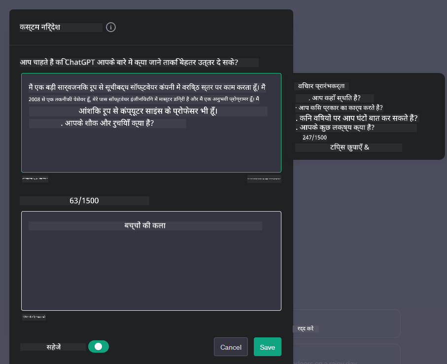

<!--
CO_OP_TRANSLATOR_METADATA:
{
  "original_hash": "ea4bbe640847aafbbba14dae4625e9af",
  "translation_date": "2025-07-09T12:21:28+00:00",
  "source_file": "07-building-chat-applications/README.md",
  "language_code": "hi"
}
-->
# जनरेटिव AI-संचालित चैट एप्लिकेशन बनाना

[](https://aka.ms/gen-ai-lessons7-gh?WT.mc_id=academic-105485-koreyst)

> _(इस पाठ का वीडियो देखने के लिए ऊपर की छवि पर क्लिक करें)_

अब जब हमने देखा कि हम टेक्स्ट-जनरेशन ऐप्स कैसे बना सकते हैं, तो आइए चैट एप्लिकेशन पर नजर डालते हैं।

चैट एप्लिकेशन हमारे दैनिक जीवन का हिस्सा बन गए हैं, जो केवल सामान्य बातचीत का माध्यम नहीं हैं। ये ग्राहक सेवा, तकनीकी सहायता, और यहां तक कि जटिल सलाहकार प्रणालियों का अभिन्न हिस्सा हैं। संभव है कि आपने हाल ही में किसी चैट एप्लिकेशन से मदद ली हो। जैसे-जैसे हम इन प्लेटफार्मों में जनरेटिव AI जैसी उन्नत तकनीकों को शामिल करते हैं, जटिलता बढ़ती है और चुनौतियां भी।

कुछ सवाल जिनका जवाब हमें चाहिए:

- **ऐप बनाना**। हम इन AI-संचालित एप्लिकेशन को विशिष्ट उपयोग मामलों के लिए कैसे कुशलतापूर्वक बना सकते हैं और सहजता से एकीकृत कर सकते हैं?
- **निगरानी**। एक बार तैनात होने के बाद, हम कैसे सुनिश्चित करें कि एप्लिकेशन कार्यक्षमता और [जिम्मेदार AI के छह सिद्धांतों](https://www.microsoft.com/ai/responsible-ai?WT.mc_id=academic-105485-koreyst) के अनुसार उच्चतम गुणवत्ता स्तर पर काम कर रहे हैं?

जैसे-जैसे हम स्वचालन और सहज मानव-मशीन इंटरैक्शन के युग में आगे बढ़ रहे हैं, यह समझना आवश्यक हो जाता है कि जनरेटिव AI चैट एप्लिकेशन के दायरे, गहराई और अनुकूलन को कैसे बदलता है। यह पाठ उन वास्तुकला पहलुओं की जांच करेगा जो इन जटिल प्रणालियों का समर्थन करते हैं, डोमेन-विशिष्ट कार्यों के लिए उन्हें फाइन-ट्यून करने की विधियों में गहराई से जाएगा, और जिम्मेदार AI तैनाती सुनिश्चित करने के लिए मेट्रिक्स और विचारों का मूल्यांकन करेगा।

## परिचय

यह पाठ निम्नलिखित विषयों को कवर करता है:

- चैट एप्लिकेशन को कुशलतापूर्वक बनाने और एकीकृत करने की तकनीकें।
- एप्लिकेशन में कस्टमाइज़ेशन और फाइन-ट्यूनिंग कैसे लागू करें।
- चैट एप्लिकेशन की प्रभावी निगरानी के लिए रणनीतियाँ और विचार।

## सीखने के लक्ष्य

इस पाठ के अंत तक, आप सक्षम होंगे:

- मौजूदा सिस्टम में चैट एप्लिकेशन बनाने और एकीकृत करने के लिए विचारों का वर्णन करना।
- विशिष्ट उपयोग मामलों के लिए चैट एप्लिकेशन को कस्टमाइज़ करना।
- AI-संचालित चैट एप्लिकेशन की गुणवत्ता बनाए रखने और प्रभावी निगरानी के लिए प्रमुख मेट्रिक्स और विचारों की पहचान करना।
- सुनिश्चित करना कि चैट एप्लिकेशन AI का जिम्मेदारी से उपयोग करें।

## चैट एप्लिकेशन में जनरेटिव AI का एकीकरण

जनरेटिव AI के माध्यम से चैट एप्लिकेशन को उन्नत बनाना केवल उन्हें स्मार्ट बनाने तक सीमित नहीं है; यह उनकी वास्तुकला, प्रदर्शन, और उपयोगकर्ता इंटरफ़ेस को बेहतर बनाकर उच्च गुणवत्ता वाला उपयोगकर्ता अनुभव प्रदान करने के बारे में है। इसमें वास्तुकला की नींव, API एकीकरण, और उपयोगकर्ता इंटरफ़ेस के विचार शामिल हैं। यह अनुभाग आपको इन जटिल क्षेत्रों में नेविगेट करने के लिए एक व्यापक रोडमैप प्रदान करने का लक्ष्य रखता है, चाहे आप इन्हें मौजूदा सिस्टम में जोड़ रहे हों या स्वतंत्र प्लेटफॉर्म के रूप में बना रहे हों।

इस अनुभाग के अंत तक, आपके पास चैट एप्लिकेशन को कुशलतापूर्वक बनाने और शामिल करने के लिए आवश्यक विशेषज्ञता होगी।

### चैटबॉट या चैट एप्लिकेशन?

चैट एप्लिकेशन बनाने में उतरने से पहले, आइए 'चैटबॉट' और 'AI-संचालित चैट एप्लिकेशन' की तुलना करें, जो अलग-अलग भूमिकाएं और कार्यक्षमताएं निभाते हैं। एक चैटबॉट का मुख्य उद्देश्य विशिष्ट संवादात्मक कार्यों को स्वचालित करना है, जैसे अक्सर पूछे जाने वाले प्रश्नों का उत्तर देना या किसी पैकेज को ट्रैक करना। यह आमतौर पर नियम-आधारित लॉजिक या जटिल AI एल्गोरिदम द्वारा संचालित होता है। इसके विपरीत, AI-संचालित चैट एप्लिकेशन एक व्यापक वातावरण है जो विभिन्न प्रकार के डिजिटल संचार को सक्षम करता है, जैसे मानव उपयोगकर्ताओं के बीच टेक्स्ट, वॉयस, और वीडियो चैट। इसकी प्रमुख विशेषता एक जनरेटिव AI मॉडल का समावेश है जो सूक्ष्म, मानव-समान संवादों का अनुकरण करता है, जो विभिन्न इनपुट और संदर्भ संकेतों के आधार पर प्रतिक्रियाएं उत्पन्न करता है। एक जनरेटिव AI-संचालित चैट एप्लिकेशन खुले-डोमेन चर्चाओं में भाग ले सकता है, बदलते संवाद संदर्भों के अनुसार अनुकूलित हो सकता है, और यहां तक कि रचनात्मक या जटिल संवाद भी उत्पन्न कर सकता है।

नीचे दी गई तालिका उनके प्रमुख अंतर और समानताओं को दर्शाती है ताकि हम उनके डिजिटल संचार में विशिष्ट भूमिकाओं को समझ सकें।

| चैटबॉट                              | जनरेटिव AI-संचालित चैट एप्लिकेशन          |
| ----------------------------------- | ------------------------------------------ |
| कार्य-केंद्रित और नियम आधारित       | संदर्भ-सचेत                                |
| अक्सर बड़े सिस्टम में एकीकृत         | एक या एक से अधिक चैटबॉट होस्ट कर सकता है |
| प्रोग्राम किए गए कार्यों तक सीमित    | जनरेटिव AI मॉडल शामिल करता है              |
| विशिष्ट और संरचित इंटरैक्शन         | खुले-डोमेन चर्चाओं में सक्षम                |

### SDKs और APIs के साथ पूर्व-निर्मित कार्यक्षमताओं का लाभ उठाना

चैट एप्लिकेशन बनाते समय, यह जानना अच्छा होता है कि पहले से क्या उपलब्ध है। SDKs और APIs का उपयोग करके चैट एप्लिकेशन बनाना कई कारणों से एक लाभकारी रणनीति है। अच्छी तरह से प्रलेखित SDKs और APIs को एकीकृत करके, आप अपने एप्लिकेशन को दीर्घकालिक सफलता के लिए रणनीतिक रूप से तैयार कर रहे हैं, जो स्केलेबिलिटी और रखरखाव की चिंताओं को संबोधित करता है।

- **विकास प्रक्रिया को तेज करता है और ओवरहेड कम करता है**: स्वयं से महंगी प्रक्रिया के बजाय पूर्व-निर्मित कार्यक्षमताओं पर निर्भर रहना आपको अपने एप्लिकेशन के अन्य महत्वपूर्ण पहलुओं, जैसे व्यवसाय लॉजिक, पर ध्यान केंद्रित करने की अनुमति देता है।
- **बेहतर प्रदर्शन**: जब आप कार्यक्षमता को स्क्रैच से बनाते हैं, तो आप अंततः पूछेंगे "यह कैसे स्केल करता है? क्या यह एप्लिकेशन अचानक उपयोगकर्ताओं की बढ़ोतरी को संभाल सकता है?" अच्छी तरह से बनाए गए SDKs और APIs में अक्सर इन चिंताओं के लिए अंतर्निहित समाधान होते हैं।
- **आसान रखरखाव**: अपडेट और सुधार प्रबंधित करना आसान होता है क्योंकि अधिकांश APIs और SDKs को केवल लाइब्रेरी के नए संस्करण को अपडेट करने की आवश्यकता होती है।
- **आधुनिक तकनीक तक पहुंच**: व्यापक डेटासेट पर प्रशिक्षित और फाइन-ट्यून किए गए मॉडल का उपयोग आपके एप्लिकेशन को प्राकृतिक भाषा क्षमताएं प्रदान करता है।

SDK या API की कार्यक्षमता तक पहुंच आमतौर पर प्रदान की गई सेवाओं का उपयोग करने की अनुमति प्राप्त करने के माध्यम से होती है, जो अक्सर एक अद्वितीय कुंजी या प्रमाणीकरण टोकन के उपयोग से होती है। हम OpenAI Python लाइब्रेरी का उपयोग करके देखेंगे कि यह कैसा दिखता है। आप इसे इस पाठ के लिए निम्नलिखित [OpenAI नोटबुक](python/oai-assignment.ipynb) या [Azure OpenAI Services नोटबुक](python/aoai-assignment.ipynb) में भी आजमा सकते हैं।

```python
import os
from openai import OpenAI

API_KEY = os.getenv("OPENAI_API_KEY","")

client = OpenAI(
    api_key=API_KEY
    )

chat_completion = client.chat.completions.create(model="gpt-3.5-turbo", messages=[{"role": "user", "content": "Suggest two titles for an instructional lesson on chat applications for generative AI."}])
```

उपरोक्त उदाहरण में GPT-3.5 Turbo मॉडल का उपयोग प्रॉम्प्ट पूरा करने के लिए किया गया है, लेकिन ध्यान दें कि API कुंजी सेट करने से पहले सेट की गई है। यदि आप कुंजी सेट नहीं करते हैं तो आपको त्रुटि मिलेगी।

## उपयोगकर्ता अनुभव (UX)

सामान्य UX सिद्धांत चैट एप्लिकेशन पर लागू होते हैं, लेकिन यहां कुछ अतिरिक्त विचार हैं जो मशीन लर्निंग घटकों के कारण विशेष रूप से महत्वपूर्ण हो जाते हैं।

- **अस्पष्टता को संबोधित करने की व्यवस्था**: जनरेटिव AI मॉडल कभी-कभी अस्पष्ट उत्तर उत्पन्न करते हैं। एक ऐसी सुविधा जो उपयोगकर्ताओं को स्पष्टीकरण मांगने की अनुमति देती है, उपयोगी हो सकती है यदि वे इस समस्या का सामना करते हैं।
- **संदर्भ बनाए रखना**: उन्नत जनरेटिव AI मॉडल बातचीत के भीतर संदर्भ को याद रखने में सक्षम होते हैं, जो उपयोगकर्ता अनुभव के लिए आवश्यक हो सकता है। उपयोगकर्ताओं को संदर्भ को नियंत्रित और प्रबंधित करने की क्षमता देना उपयोगकर्ता अनुभव को बेहतर बनाता है, लेकिन संवेदनशील उपयोगकर्ता जानकारी को बनाए रखने का जोखिम भी लाता है। इस जानकारी को कितनी देर तक संग्रहीत किया जाए, जैसे कि एक प्रतिधारण नीति लागू करना, गोपनीयता और संदर्भ की आवश्यकता के बीच संतुलन बना सकता है।
- **व्यक्तिगत अनुभव**: सीखने और अनुकूलन की क्षमता के साथ, AI मॉडल उपयोगकर्ता के लिए व्यक्तिगत अनुभव प्रदान करते हैं। उपयोगकर्ता प्रोफाइल जैसी विशेषताओं के माध्यम से उपयोगकर्ता अनुभव को अनुकूलित करना न केवल उपयोगकर्ता को समझा हुआ महसूस कराता है, बल्कि विशिष्ट उत्तर खोजने में उनकी मदद करता है, जिससे बातचीत अधिक प्रभावी और संतोषजनक बनती है।

व्यक्तिगत अनुभव का एक उदाहरण OpenAI के ChatGPT में "Custom instructions" सेटिंग्स है। यह आपको अपने बारे में जानकारी प्रदान करने की अनुमति देता है जो आपके प्रॉम्प्ट के लिए महत्वपूर्ण संदर्भ हो सकती है। यहां एक कस्टम निर्देश का उदाहरण है।



यह "प्रोफाइल" ChatGPT को लिंक्ड लिस्ट पर एक पाठ योजना बनाने के लिए प्रेरित करता है। ध्यान दें कि ChatGPT उपयोगकर्ता के अनुभव के आधार पर अधिक गहराई वाली पाठ योजना चाहता है।


### Microsoft का System Message Framework बड़े भाषा मॉडल के लिए

[Microsoft ने LLMs से प्रतिक्रियाएं उत्पन्न करते समय प्रभावी सिस्टम संदेश लिखने के लिए मार्गदर्शन प्रदान किया है](https://learn.microsoft.com/azure/ai-services/openai/concepts/system-message#define-the-models-output-format?WT.mc_id=academic-105485-koreyst), जो 4 क्षेत्रों में विभाजित है:

1. मॉडल किसके लिए है, उसकी क्षमताएं और सीमाएं परिभाषित करना।
2. मॉडल के आउटपुट फॉर्मेट को परिभाषित करना।
3. मॉडल के इच्छित व्यवहार को प्रदर्शित करने वाले विशिष्ट उदाहरण प्रदान करना।
4. अतिरिक्त व्यवहार संबंधी गार्डरेल प्रदान करना।

### पहुँच (Accessibility)

चाहे उपयोगकर्ता को दृष्टि, श्रवण, मोटर, या संज्ञानात्मक विकलांगता हो, एक अच्छी तरह से डिज़ाइन किया गया चैट एप्लिकेशन सभी के लिए उपयोगी होना चाहिए। निम्नलिखित सूची विभिन्न उपयोगकर्ता विकलांगताओं के लिए पहुँच बढ़ाने वाली विशिष्ट विशेषताओं को दर्शाती है।

- **दृष्टि विकलांगता के लिए विशेषताएं**: उच्च कंट्रास्ट थीम और पुनः आकार योग्य टेक्स्ट, स्क्रीन रीडर संगतता।
- **श्रवण विकलांगता के लिए विशेषताएं**: टेक्स्ट-टू-स्पीच और स्पीच-टू-टेक्स्ट कार्य, ऑडियो सूचनाओं के लिए दृश्य संकेत।
- **मोटर विकलांगता के लिए विशेषताएं**: कीबोर्ड नेविगेशन समर्थन, वॉयस कमांड।
- **संज्ञानात्मक विकलांगता के लिए विशेषताएं**: सरल भाषा विकल्प।

## डोमेन-विशिष्ट भाषा मॉडलों के लिए कस्टमाइज़ेशन और फाइन-ट्यूनिंग

कल्पना करें एक ऐसा चैट एप्लिकेशन जो आपकी कंपनी की भाषा को समझता है और उपयोगकर्ताओं के सामान्य प्रश्नों का अनुमान लगाता है। इसके लिए कुछ दृष्टिकोण हैं:

- **DSL मॉडल का उपयोग**। DSL का मतलब डोमेन स्पेसिफिक लैंग्वेज है। आप एक ऐसे DSL मॉडल का उपयोग कर सकते हैं जो किसी विशिष्ट डोमेन पर प्रशिक्षित हो ताकि वह उसके सिद्धांतों और परिदृश्यों को समझ सके।
- **फाइन-ट्यूनिंग लागू करें**। फाइन-ट्यूनिंग आपके मॉडल को विशिष्ट डेटा के साथ और अधिक प्रशिक्षण देने की प्रक्रिया है।

## कस्टमाइज़ेशन: DSL का उपयोग

डोमेन-विशिष्ट भाषा मॉडलों (DSL मॉडल) का उपयोग करके आप उपयोगकर्ता की भागीदारी बढ़ा सकते हैं और विशेष, संदर्भानुकूल इंटरैक्शन प्रदान कर सकते हैं। यह एक ऐसा मॉडल है जिसे किसी विशेष क्षेत्र, उद्योग, या विषय से संबंधित टेक्स्ट को समझने और उत्पन्न करने के लिए प्रशिक्षित या फाइन-ट्यून किया गया है। DSL मॉडल का उपयोग करने के विकल्पों में स्क्रैच से प्रशिक्षण, SDKs और APIs के माध्यम से पूर्व-निर्मित मॉडल का उपयोग, या फाइन-ट्यूनिंग शामिल है, जिसमें एक पूर्व-प्रशिक्षित मॉडल को विशिष्ट डोमेन के लिए अनुकूलित किया जाता है।

## कस्टमाइज़ेशन: फाइन-ट्यूनिंग लागू करें

जब कोई पूर्व-प्रशिक्षित मॉडल किसी विशेष डोमेन या विशिष्ट कार्य में कम पड़ता है, तो फाइन-ट्यूनिंग पर विचार किया जाता है।

उदाहरण के लिए, चिकित्सा प्रश्न जटिल होते हैं और बहुत संदर्भ की आवश्यकता होती है। जब एक चिकित्सा पेशेवर रोगी का निदान करता है, तो यह जीवनशैली या पूर्व-स्थितियों जैसे विभिन्न कारकों पर आधारित होता है, और हाल के चिकित्सा जर्नल्स पर भी निर्भर हो सकता है। ऐसे सूक्ष्म परिदृश्यों में, एक सामान्य-उद्देश्य AI चैट एप्लिकेशन विश्वसनीय स्रोत नहीं हो सकता।

### परिदृश्य: एक चिकित्सा एप्लिकेशन

एक चैट एप्लिकेशन की कल्पना करें जो चिकित्सा पेशेवरों की सहायता करता है, जैसे उपचार दिशानिर्देश, दवा इंटरैक्शन, या हाल के शोध निष्कर्षों के त्वरित संदर्भ प्रदान करना।

एक सामान्य-उद्देश्य मॉडल बुनियादी चिकित्सा प्रश्नों का उत्तर देने या सामान्य सलाह देने के लिए पर्याप्त हो सकता है, लेकिन यह निम्नलिखित में संघर्ष कर सकता है:

- **अत्यंत विशिष्ट या जटिल मामले**। उदाहरण के लिए, एक न्यूरोलॉजिस्ट एप्लिकेशन से पूछ सकता है, "बाल रोगियों में दवा-प्रतिरोधी मिर्गी के प्रबंधन के लिए वर्तमान सर्वोत्तम प्रथाएं क्या हैं?"
- **हाल के विकासों की कमी**। एक सामान्य-उद्देश्य मॉडल न्यूरोलॉजी और फार्माकोलॉजी में नवीनतम प्रगति को शामिल करते हुए वर्तमान उत्तर प्रदान करने में असमर्थ हो सकता है।

ऐसे मामलों में, एक विशिष्ट चिकित्सा डेटासेट के साथ मॉडल को फाइन-ट्यून करना इसकी जटिल चिकित्सा पूछताछों को अधिक सटीक और विश्वसनीय तरीके से संभालने की क्षमता को काफी बढ़ा सकता है। इसके लिए एक बड़ा और प्रासंगिक डेटासेट आवश्यक होता है जो डोमेन-विशिष्ट चुनौतियों और प्रश्नों का प्रतिनिधित्व करता हो।

## उच्च गुणवत्ता वाले AI-चालित चैट अनुभव के लिए विचार

यह अनुभाग "उच्च गुणवत्ता" वाले चैट एप्लिकेशन के मानदंडों को रेखांकित करता है, जिसमें क्रियान्वयन योग्य मेट्रिक्स का संग्रह और AI तकनीक के जिम्मेदार उपयोग के लिए एक फ्रेमवर्क का पालन शामिल है।

### प्रमुख मेट्रिक्स

एक एप्लिकेशन के उच्च गुणवत्ता वाले प्रदर्शन को बनाए रखने के लिए, प्रमुख मेट्रिक्स और विचारों पर नज़र रखना आवश्यक है। ये माप न केवल एप्लिकेशन की कार्यक्षमता सुनिश्चित करते हैं, बल्कि AI मॉडल और उपयोगकर्ता अनुभव की गुणवत्ता का भी आकलन करते हैं। नीचे एक सूची है जो बुनियादी, AI, और उपयोगकर्ता अनुभव मेट्रिक्स को कवर करती है।

| मेट्रिक                        | परिभाषा                                                                                                               | चैट डेवलपर के लिए विचार                                              |
| ----------------------------- | ---------------------------------------------------------------------------------------------------------------------- | --------------------------------------------------------------------- |
| **अपटाइम**                    | मापता है कि एप्लिकेशन कितने समय तक चालू और उपयोगकर्ताओं के लिए उपलब्ध है।                                            | आप डाउनटाइम को कैसे कम करेंगे?                                        |
| **प्रतिक्रिया समय**           | उपयोगकर्ता के प्रश्न का उत्तर देने में एप्लिकेशन द्वारा लिया गया समय।                                                  | आप प्रतिक्रिया समय सुधारने के लिए क्वेरी प्रोसेसिंग को कैसे अनुकूलित करेंगे? |
| **प्रिसिजन**                  | सही सकारात्मक भविष्यवाणियों का अनुपात कुल सकारात्मक भविष्यवाणियों में।                                              | आप अपने मॉडल की प्रिसिजन को कैसे मान्य करेंगे?                       |
| **रिकॉल (संवेदनशीलता)**      | सही सकारात्मक भविष्यवाणियों का अनुपात वास्तविक सकारात्मक मामलों में।                                               | आप रिकॉल को कैसे मापेंगे और सुधारेंगे?                               |
| **F1 स्कोर**                  | प्रिसिजन और रिकॉल का हार्मोनिक माध्य जो दोनों के बीच संतुलन बनाता है।                                                | आपका लक्ष्य F1 स्कोर क्या है? आप प्रिसिजन और रिकॉल का संतुलन कैसे बनाएंगे? |
| **पर्प्लेक
| **असामान्यता पहचान**         | असामान्य पैटर्न की पहचान के लिए उपकरण और तकनीकें जो अपेक्षित व्यवहार के अनुरूप नहीं होते।                        | आप असामान्यताओं पर कैसे प्रतिक्रिया देंगे?                                        |

### चैट एप्लिकेशन में जिम्मेदार AI प्रथाओं को लागू करना

Microsoft के जिम्मेदार AI दृष्टिकोण ने छह सिद्धांतों की पहचान की है जो AI विकास और उपयोग का मार्गदर्शन करते हैं। नीचे सिद्धांत, उनकी परिभाषा, और चैट डेवलपर के लिए विचार करने योग्य बातें दी गई हैं, साथ ही यह भी बताया गया है कि इन्हें गंभीरता से क्यों लेना चाहिए।

| सिद्धांत               | Microsoft की परिभाषा                                | चैट डेवलपर के लिए विचार                                      | यह क्यों महत्वपूर्ण है                                                                     |
| ---------------------- | ----------------------------------------------------- | ---------------------------------------------------------------------- | -------------------------------------------------------------------------------------- |
| निष्पक्षता               | AI सिस्टम सभी लोगों के साथ निष्पक्ष व्यवहार करें।            | सुनिश्चित करें कि चैट एप्लिकेशन उपयोगकर्ता डेटा के आधार पर भेदभाव न करे।  | उपयोगकर्ताओं के बीच विश्वास और समावेशन बनाने के लिए; कानूनी परिणामों से बचने के लिए।                |
| विश्वसनीयता और सुरक्षा | AI सिस्टम विश्वसनीय और सुरक्षित रूप से काम करें।        | त्रुटियों और जोखिमों को कम करने के लिए परीक्षण और फेल-सेफ लागू करें।         | उपयोगकर्ता संतुष्टि सुनिश्चित करता है और संभावित नुकसान से बचाता है।                                 |
| गोपनीयता और सुरक्षा   | AI सिस्टम सुरक्षित हों और गोपनीयता का सम्मान करें।      | मजबूत एन्क्रिप्शन और डेटा सुरक्षा उपाय लागू करें।              | संवेदनशील उपयोगकर्ता डेटा की सुरक्षा और गोपनीयता कानूनों का पालन करने के लिए।                         |
| समावेशन          | AI सिस्टम सभी को सशक्त बनाएं और लोगों को शामिल करें। | ऐसे UI/UX डिजाइन करें जो विविध दर्शकों के लिए सुलभ और उपयोग में आसान हो। | सुनिश्चित करता है कि अधिक लोग एप्लिकेशन का प्रभावी ढंग से उपयोग कर सकें।                   |
| पारदर्शिता           | AI सिस्टम समझने योग्य होने चाहिए।                  | AI प्रतिक्रियाओं के लिए स्पष्ट दस्तावेज़ीकरण और तर्क प्रदान करें।            | उपयोगकर्ता उस सिस्टम पर अधिक भरोसा करते हैं यदि वे समझ सकें कि निर्णय कैसे लिए जाते हैं। |
| जवाबदेही         | AI सिस्टम के लिए लोग जवाबदेह होने चाहिए।          | AI निर्णयों के ऑडिटिंग और सुधार के लिए स्पष्ट प्रक्रिया स्थापित करें।     | गलतियों की स्थिति में निरंतर सुधार और सुधारात्मक उपायों को सक्षम बनाता है।               |

## असाइनमेंट

देखें [assignment](../../../07-building-chat-applications/python) यह आपको आपकी पहली चैट प्रॉम्प्ट चलाने से लेकर टेक्स्ट को वर्गीकृत और सारांशित करने तक कई अभ्यासों के माध्यम से ले जाएगा। ध्यान दें कि असाइनमेंट विभिन्न प्रोग्रामिंग भाषाओं में उपलब्ध हैं!

## शानदार काम! यात्रा जारी रखें

इस पाठ को पूरा करने के बाद, हमारे [Generative AI Learning collection](https://aka.ms/genai-collection?WT.mc_id=academic-105485-koreyst) को देखें ताकि आप अपने Generative AI ज्ञान को और बढ़ा सकें!

पाठ 8 पर जाएं और देखें कि आप कैसे [सर्च एप्लिकेशन बनाना शुरू कर सकते हैं](../08-building-search-applications/README.md?WT.mc_id=academic-105485-koreyst)!

**अस्वीकरण**:  
यह दस्तावेज़ AI अनुवाद सेवा [Co-op Translator](https://github.com/Azure/co-op-translator) का उपयोग करके अनुवादित किया गया है। जबकि हम सटीकता के लिए प्रयासरत हैं, कृपया ध्यान दें कि स्वचालित अनुवादों में त्रुटियाँ या अशुद्धियाँ हो सकती हैं। मूल दस्तावेज़ अपनी मूल भाषा में ही अधिकारिक स्रोत माना जाना चाहिए। महत्वपूर्ण जानकारी के लिए, पेशेवर मानव अनुवाद की सलाह दी जाती है। इस अनुवाद के उपयोग से उत्पन्न किसी भी गलतफहमी या गलत व्याख्या के लिए हम जिम्मेदार नहीं हैं।