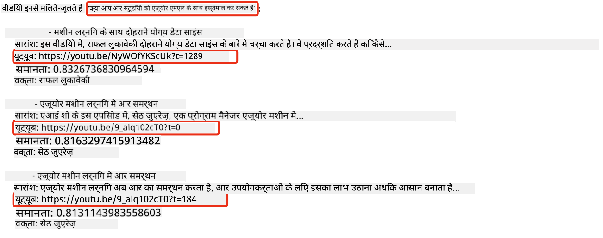
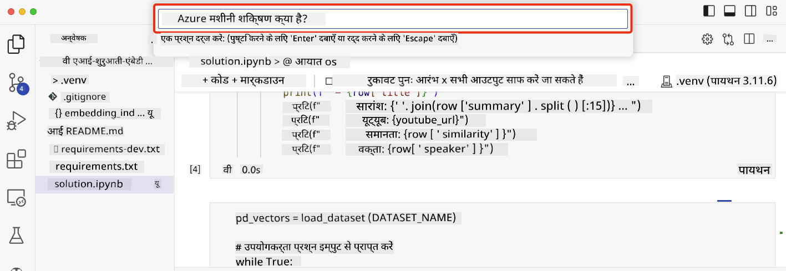

<!--
CO_OP_TRANSLATOR_METADATA:
{
  "original_hash": "d46aad0917a1a342d613e2c13d457da5",
  "translation_date": "2025-05-19T10:24:46+00:00",
  "source_file": "08-building-search-applications/README.md",
  "language_code": "hi"
}
-->
# खोज अनुप्रयोग बनाना

[](https://aka.ms/gen-ai-lesson8-gh?WT.mc_id=academic-105485-koreyst)

> > _इस पाठ का वीडियो देखने के लिए ऊपर की छवि पर क्लिक करें_

LLMs केवल चैटबॉट्स और टेक्स्ट जनरेशन तक सीमित नहीं हैं। एम्बेडिंग्स का उपयोग करके खोज अनुप्रयोग बनाना भी संभव है। एम्बेडिंग्स डेटा के संख्यात्मक प्रतिनिधित्व होते हैं जिन्हें वेक्टर भी कहा जाता है, और इन्हें डेटा के लिए सिमेंटिक खोज में उपयोग किया जा सकता है।

इस पाठ में, आप हमारे शिक्षा स्टार्टअप के लिए एक खोज अनुप्रयोग बनाएंगे। हमारा स्टार्टअप एक गैर-लाभकारी संगठन है जो विकासशील देशों के छात्रों को मुफ्त शिक्षा प्रदान करता है। हमारे स्टार्टअप के पास बड़ी संख्या में YouTube वीडियो हैं जिनका उपयोग छात्र AI के बारे में सीखने के लिए कर सकते हैं। हमारा स्टार्टअप एक खोज अनुप्रयोग बनाना चाहता है जो छात्रों को प्रश्न टाइप करके YouTube वीडियो खोजने की अनुमति देता है।

उदाहरण के लिए, एक छात्र 'जुपिटर नोटबुक्स क्या हैं?' या 'Azure ML क्या है' टाइप कर सकता है और खोज अनुप्रयोग प्रश्न के लिए प्रासंगिक YouTube वीडियो की सूची लौटाएगा, और इससे भी बेहतर, खोज अनुप्रयोग उस वीडियो के स्थान का लिंक लौटाएगा जहां प्रश्न का उत्तर स्थित है।

## परिचय

इस पाठ में हम कवर करेंगे:

- सिमेंटिक बनाम कीवर्ड खोज।
- टेक्स्ट एम्बेडिंग्स क्या हैं।
- टेक्स्ट एम्बेडिंग्स इंडेक्स बनाना।
- टेक्स्ट एम्बेडिंग्स इंडेक्स की खोज करना।

## सीखने के लक्ष्य

इस पाठ को पूरा करने के बाद, आप सक्षम होंगे:

- सिमेंटिक और कीवर्ड खोज के बीच का अंतर बताएं।
- टेक्स्ट एम्बेडिंग्स क्या हैं, समझाएं।
- एम्बेडिंग्स का उपयोग करके डेटा की खोज के लिए एक अनुप्रयोग बनाएं।

## खोज अनुप्रयोग क्यों बनाएं?

एक खोज अनुप्रयोग बनाना आपको समझने में मदद करेगा कि डेटा की खोज के लिए एम्बेडिंग्स का उपयोग कैसे किया जाए। आप यह भी सीखेंगे कि छात्रों को जल्दी से जानकारी खोजने में मदद करने के लिए एक खोज अनुप्रयोग कैसे बनाया जाए।

इस पाठ में Microsoft [AI शो](https://www.youtube.com/playlist?list=PLlrxD0HtieHi0mwteKBOfEeOYf0LJU4O1) YouTube चैनल के लिए YouTube ट्रांसक्रिप्ट्स का एम्बेडिंग इंडेक्स शामिल है। AI शो एक YouTube चैनल है जो आपको AI और मशीन लर्निंग के बारे में सिखाता है। एम्बेडिंग इंडेक्स में अक्टूबर 2023 तक के प्रत्येक YouTube ट्रांसक्रिप्ट के लिए एम्बेडिंग्स शामिल हैं। आप हमारे स्टार्टअप के लिए एक खोज अनुप्रयोग बनाने के लिए एम्बेडिंग इंडेक्स का उपयोग करेंगे। खोज अनुप्रयोग उस वीडियो के स्थान का लिंक लौटाएगा जहां प्रश्न का उत्तर स्थित है। यह छात्रों के लिए आवश्यक जानकारी को जल्दी से खोजने का एक शानदार तरीका है।

निम्नलिखित 'क्या आप Azure ML के साथ rstudio का उपयोग कर सकते हैं?' प्रश्न के लिए एक सिमेंटिक क्वेरी का उदाहरण है। YouTube URL देखें, आप देखेंगे कि URL में एक टाइमस्टैम्प शामिल है जो आपको उस वीडियो के स्थान पर ले जाता है जहां प्रश्न का उत्तर स्थित है।



## सिमेंटिक खोज क्या है?

अब आप सोच रहे होंगे, सिमेंटिक खोज क्या है? सिमेंटिक खोज एक खोज तकनीक है जो क्वेरी में शब्दों के अर्थ का उपयोग करके प्रासंगिक परिणाम लौटाती है।

यहां सिमेंटिक खोज का एक उदाहरण है। मान लें कि आप कार खरीदने के लिए खोज रहे थे, आप 'मेरी ड्रीम कार' खोज सकते हैं, सिमेंटिक खोज समझती है कि आप एक कार के बारे में `dreaming` नहीं कर रहे हैं, बल्कि आप अपनी `ideal` कार खरीदने के लिए खोज रहे हैं। सिमेंटिक खोज आपके इरादे को समझती है और प्रासंगिक परिणाम लौटाती है। वैकल्पिक `keyword search` जो वास्तव में कारों के सपनों के बारे में खोजेगा और अक्सर अप्रासंगिक परिणाम लौटाएगा।

## टेक्स्ट एम्बेडिंग्स क्या हैं?

[टेक्स्ट एम्बेडिंग्स](https://en.wikipedia.org/wiki/Word_embedding?WT.mc_id=academic-105485-koreyst) एक टेक्स्ट प्रतिनिधित्व तकनीक है जो [प्राकृतिक भाषा प्रसंस्करण](https://en.wikipedia.org/wiki/Natural_language_processing?WT.mc_id=academic-105485-koreyst) में उपयोग की जाती है। टेक्स्ट एम्बेडिंग्स टेक्स्ट के सिमेंटिक संख्यात्मक प्रतिनिधित्व होते हैं। एम्बेडिंग्स का उपयोग डेटा को इस तरह से प्रस्तुत करने के लिए किया जाता है जो मशीन के लिए समझने में आसान हो। टेक्स्ट एम्बेडिंग्स बनाने के कई मॉडल हैं, इस पाठ में, हम OpenAI एम्बेडिंग मॉडल का उपयोग करके एम्बेडिंग्स उत्पन्न करने पर ध्यान केंद्रित करेंगे।

यहां एक उदाहरण है, कल्पना करें कि निम्नलिखित टेक्स्ट AI शो YouTube चैनल के एक एपिसोड से ट्रांसक्रिप्ट में है:

```text
Today we are going to learn about Azure Machine Learning.
```

हम टेक्स्ट को OpenAI एम्बेडिंग API को पास करेंगे और यह 1536 संख्याओं के एम्बेडिंग को लौटाएगा जिसे वेक्टर कहा जाता है। वेक्टर में प्रत्येक संख्या टेक्स्ट के विभिन्न पहलुओं का प्रतिनिधित्व करती है। संक्षेप में, यहां वेक्टर में पहले 10 संख्याएं हैं।

```python
[-0.006655829958617687, 0.0026128944009542465, 0.008792596869170666, -0.02446001023054123, -0.008540431968867779, 0.022071078419685364, -0.010703742504119873, 0.003311325330287218, -0.011632772162556648, -0.02187200076878071, ...]
```

## एम्बेडिंग इंडेक्स कैसे बनाया जाता है?

इस पाठ के लिए एम्बेडिंग इंडेक्स एक श्रृंखला की Python स्क्रिप्ट्स के साथ बनाया गया था। आपको इस पाठ के 'स्क्रिप्ट्स' फ़ोल्डर में [README](./scripts/README.md?WT.mc_id=academic-105485-koreyst) में निर्देशों के साथ स्क्रिप्ट्स मिलेंगी। आपको इस पाठ को पूरा करने के लिए इन स्क्रिप्ट्स को चलाने की आवश्यकता नहीं है क्योंकि एम्बेडिंग इंडेक्स आपके लिए प्रदान किया गया है।

स्क्रिप्ट्स निम्नलिखित ऑपरेशन्स करते हैं:

1. [AI शो](https://www.youtube.com/playlist?list=PLlrxD0HtieHi0mwteKBOfEeOYf0LJU4O1) प्लेलिस्ट में प्रत्येक YouTube वीडियो के लिए ट्रांसक्रिप्ट डाउनलोड किया जाता है।
2. [OpenAI फ़ंक्शंस](https://learn.microsoft.com/azure/ai-services/openai/how-to/function-calling?WT.mc_id=academic-105485-koreyst) का उपयोग करके, YouTube ट्रांसक्रिप्ट के पहले 3 मिनट से स्पीकर का नाम निकालने का प्रयास किया जाता है। प्रत्येक वीडियो के लिए स्पीकर का नाम एम्बेडिंग इंडेक्स में `embedding_index_3m.json` नामक में संग्रहीत किया जाता है।
3. ट्रांसक्रिप्ट टेक्स्ट को **3 मिनट के टेक्स्ट सेगमेंट्स** में चंक्स किया जाता है। सेगमेंट में अगले सेगमेंट से लगभग 20 शब्द ओवरलैप होते हैं ताकि सेगमेंट के लिए एम्बेडिंग कट ऑफ न हो और बेहतर खोज संदर्भ प्रदान किया जा सके।
4. प्रत्येक टेक्स्ट सेगमेंट को OpenAI चैट API को पास किया जाता है ताकि टेक्स्ट को 60 शब्दों में संक्षेपित किया जा सके। सारांश भी एम्बेडिंग इंडेक्स `embedding_index_3m.json` में संग्रहीत किया जाता है।
5. अंत में, सेगमेंट टेक्स्ट को OpenAI एम्बेडिंग API को पास किया जाता है। एम्बेडिंग API 1536 संख्याओं का एक वेक्टर लौटाता है जो सेगमेंट के सिमेंटिक अर्थ का प्रतिनिधित्व करता है। सेगमेंट के साथ OpenAI एम्बेडिंग वेक्टर एम्बेडिंग इंडेक्स `embedding_index_3m.json` में संग्रहीत किया जाता है।

### वेक्टर डेटाबेस

पाठ की सरलता के लिए, एम्बेडिंग इंडेक्स को `embedding_index_3m.json` नामक JSON फ़ाइल में संग्रहीत किया जाता है और एक Pandas DataFrame में लोड किया जाता है। हालांकि, उत्पादन में, एम्बेडिंग इंडेक्स को [Azure Cognitive Search](https://learn.microsoft.com/training/modules/improve-search-results-vector-search?WT.mc_id=academic-105485-koreyst), [Redis](https://cookbook.openai.com/examples/vector_databases/redis/readme?WT.mc_id=academic-105485-koreyst), [Pinecone](https://cookbook.openai.com/examples/vector_databases/pinecone/readme?WT.mc_id=academic-105485-koreyst), [Weaviate](https://cookbook.openai.com/examples/vector_databases/weaviate/readme?WT.mc_id=academic-105485-koreyst) जैसे वेक्टर डेटाबेस में संग्रहीत किया जाएगा, कुछ नामों के लिए।

## कोसाइन समानता को समझना

हमने टेक्स्ट एम्बेडिंग्स के बारे में सीखा है, अगला कदम यह सीखना है कि डेटा की खोज के लिए टेक्स्ट एम्बेडिंग्स का उपयोग कैसे किया जाए और विशेष रूप से एक दिए गए क्वेरी के लिए सबसे समान एम्बेडिंग्स को कोसाइन समानता का उपयोग करके कैसे खोजा जाए।

### कोसाइन समानता क्या है?

कोसाइन समानता दो वेक्टरों के बीच समानता का एक माप है, आप इसे `nearest neighbor search` के रूप में भी सुनेंगे। कोसाइन समानता खोज करने के लिए आपको OpenAI एम्बेडिंग API का उपयोग करके _query_ टेक्स्ट के लिए _वेक्टराइज़_ करने की आवश्यकता होती है। फिर क्वेरी वेक्टर और एम्बेडिंग इंडेक्स में प्रत्येक वेक्टर के बीच _कोसाइन समानता_ की गणना करें। याद रखें, एम्बेडिंग इंडेक्स में प्रत्येक YouTube ट्रांसक्रिप्ट टेक्स्ट सेगमेंट के लिए एक वेक्टर होता है। अंत में, कोसाइन समानता द्वारा परिणामों को क्रमित करें और उच्चतम कोसाइन समानता वाले टेक्स्ट सेगमेंट क्वेरी के लिए सबसे समान होते हैं।

गणितीय दृष्टिकोण से, कोसाइन समानता बहु-आयामी स्थान में प्रक्षिप्त दो वेक्टरों के बीच कोण के कोसाइन को मापती है। यह माप लाभकारी है, क्योंकि यदि दो दस्तावेज आकार के कारण यूक्लिडियन दूरी से दूर हैं, तो उनके बीच अभी भी एक छोटा कोण हो सकता है और इसलिए उच्च कोसाइन समानता हो सकती है। कोसाइन समानता समीकरणों के बारे में अधिक जानकारी के लिए, [कोसाइन समानता](https://en.wikipedia.org/wiki/Cosine_similarity?WT.mc_id=academic-105485-koreyst) देखें।

## अपना पहला खोज अनुप्रयोग बनाना

अगला, हम एम्बेडिंग्स का उपयोग करके एक खोज अनुप्रयोग कैसे बनाया जाए, सीखने जा रहे हैं। खोज अनुप्रयोग छात्रों को प्रश्न टाइप करके वीडियो खोजने की अनुमति देगा। खोज अनुप्रयोग प्रश्न के लिए प्रासंगिक वीडियो की एक सूची लौटाएगा। खोज अनुप्रयोग उस वीडियो के स्थान का लिंक भी लौटाएगा जहां प्रश्न का उत्तर स्थित है।

यह समाधान Windows 11, macOS, और Ubuntu 22.04 पर Python 3.10 या बाद में उपयोग करके बनाया और परीक्षण किया गया था। आप [python.org](https://www.python.org/downloads/?WT.mc_id=academic-105485-koreyst) से Python डाउनलोड कर सकते हैं।

## असाइनमेंट - खोज अनुप्रयोग बनाना, छात्रों को सक्षम करना

हमने इस पाठ की शुरुआत में अपने स्टार्टअप का परिचय दिया। अब समय है कि छात्रों को उनके आकलन के लिए एक खोज अनुप्रयोग बनाने में सक्षम करें।

इस असाइनमेंट में, आप Azure OpenAI Services बनाएंगे जो खोज अनुप्रयोग बनाने के लिए उपयोग किए जाएंगे। आप निम्नलिखित Azure OpenAI Services बनाएंगे। इस असाइनमेंट को पूरा करने के लिए आपको एक Azure सदस्यता की आवश्यकता होगी।

### Azure Cloud Shell शुरू करें

1. [Azure पोर्टल](https://portal.azure.com/?WT.mc_id=academic-105485-koreyst) में साइन इन करें।
2. Azure पोर्टल के ऊपरी-दाएं कोने में Cloud Shell आइकन चुनें।
3. **Bash** को पर्यावरण प्रकार के लिए चुनें।

#### एक संसाधन समूह बनाएं

> इन निर्देशों के लिए, हम East US में "semantic-video-search" नामक संसाधन समूह का उपयोग कर रहे हैं।
> आप संसाधन समूह का नाम बदल सकते हैं, लेकिन संसाधनों के लिए स्थान बदलते समय,
> [मॉडल उपलब्धता तालिका](https://aka.ms/oai/models?WT.mc_id=academic-105485-koreyst) की जांच करें।

```shell
az group create --name semantic-video-search --location eastus
```

#### Azure OpenAI सेवा संसाधन बनाएं

Azure Cloud Shell से, Azure OpenAI सेवा संसाधन बनाने के लिए निम्नलिखित कमांड चलाएं।

```shell
az cognitiveservices account create --name semantic-video-openai --resource-group semantic-video-search \
    --location eastus --kind OpenAI --sku s0
```

#### इस अनुप्रयोग में उपयोग के लिए एंडपॉइंट और कुंजियाँ प्राप्त करें

Azure Cloud Shell से, Azure OpenAI सेवा संसाधन के लिए एंडपॉइंट और कुंजियाँ प्राप्त करने के लिए निम्नलिखित कमांड चलाएं।

```shell
az cognitiveservices account show --name semantic-video-openai \
   --resource-group  semantic-video-search | jq -r .properties.endpoint
az cognitiveservices account keys list --name semantic-video-openai \
   --resource-group semantic-video-search | jq -r .key1
```

#### OpenAI एम्बेडिंग मॉडल तैनात करें

Azure Cloud Shell से, OpenAI एम्बेडिंग मॉडल तैनात करने के लिए निम्नलिखित कमांड चलाएं।

```shell
az cognitiveservices account deployment create \
    --name semantic-video-openai \
    --resource-group  semantic-video-search \
    --deployment-name text-embedding-ada-002 \
    --model-name text-embedding-ada-002 \
    --model-version "2"  \
    --model-format OpenAI \
    --sku-capacity 100 --sku-name "Standard"
```

## समाधान

GitHub Codespaces में [solution notebook](../../../08-building-search-applications/python/aoai-solution.ipynb) खोलें और Jupyter Notebook में निर्देशों का पालन करें।

जब आप नोटबुक चलाते हैं, तो आपको एक क्वेरी दर्ज करने के लिए प्रेरित किया जाएगा। इनपुट बॉक्स इस तरह दिखाई देगा:



## शानदार काम! अपनी सीख जारी रखें

इस पाठ को पूरा करने के बाद, हमारी [जनरेटिव AI लर्निंग संग्रह](https://aka.ms/genai-collection?WT.mc_id=academic-105485-koreyst) की जांच करें ताकि आपकी जनरेटिव AI ज्ञान को और बढ़ाया जा सके!

Lesson 9 में जाएं जहां हम [छवि जनरेशन अनुप्रयोगों का निर्माण](../09-building-image-applications/README.md?WT.mc_id=academic-105485-koreyst) देखेंगे!

**अस्वीकरण**:  
यह दस्तावेज़ AI अनुवाद सेवा [Co-op Translator](https://github.com/Azure/co-op-translator) का उपयोग करके अनुवादित किया गया है। हम सटीकता के लिए प्रयासरत हैं, लेकिन कृपया ध्यान दें कि स्वचालित अनुवाद में त्रुटियाँ या अशुद्धियाँ हो सकती हैं। मूल भाषा में मूल दस्तावेज़ को प्रामाणिक स्रोत माना जाना चाहिए। महत्वपूर्ण जानकारी के लिए, पेशेवर मानव अनुवाद की सिफारिश की जाती है। इस अनुवाद के उपयोग से उत्पन्न किसी भी गलतफहमी या गलत व्याख्या के लिए हम उत्तरदायी नहीं हैं।