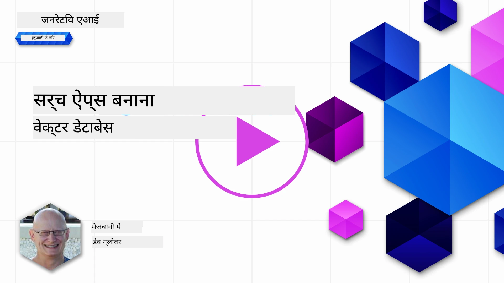
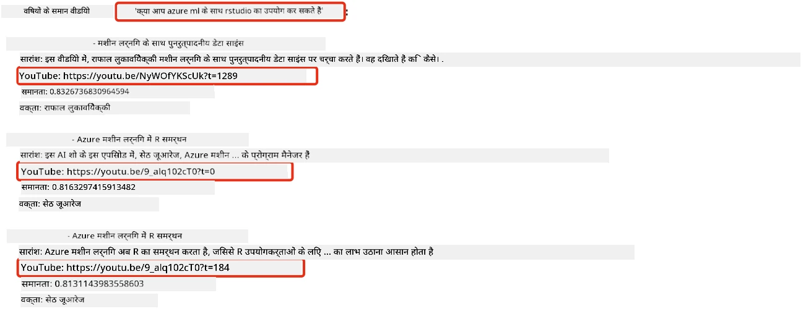
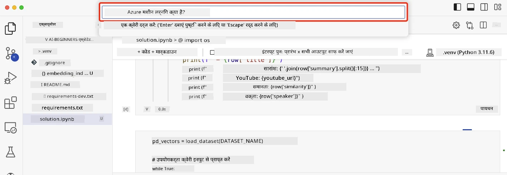

# एक सर्च एप्लिकेशन बनाना

[](https://youtu.be/W0-nzXjOjr0?si=GcsqiTTvd7RKbo7V)

> > _इस पाठ का वीडियो देखने के लिए ऊपर चित्र पर क्लिक करें_

चैटबॉट और टेक्स्ट जनरेशन के अलावा LLMs से और भी बहुत कुछ कर सकते हैं। एम्बेडिंग्स का उपयोग करके खोज अनुप्रयोग बनाना भी संभव है। एम्बेडिंग्स डेटा के संख्यात्मक प्रतिनिधित्व होते हैं जिन्हें वेक्टर भी कहा जाता है, और इन्हें डेटा के लिए सैमांटिक खोज में इस्तेमाल किया जा सकता है।

इस पाठ में, आप हमारे शिक्षा स्टार्टअप के लिए एक खोज आवेदन बनाएंगे। हमारा स्टार्टअप एक गैर-लाभकारी संगठन है जो विकासशील देशों के छात्रों को मुफ्त शिक्षा प्रदान करता है। हमारे स्टार्टअप के पास कई YouTube वीडियो हैं जिनका उपयोग छात्र AI के बारे में सीखने के लिए कर सकते हैं। हमारा स्टार्टअप एक खोज आवेदन बनाना चाहता है जो छात्रों को एक प्रश्न टाइप करके YouTube वीडियो खोजने की अनुमति देता है।

उदाहरण के लिए, कोई छात्र 'What are Jupyter Notebooks?' या 'What is Azure ML' टाइप कर सकता है और खोज आवेदन प्रश्न से संबंधित YouTube वीडियो की एक सूची लौटाएगा, और इससे भी बेहतर, खोज आवेदन उस वीडियो के उस हिस्से का लिंक लौटाएगा जहाँ प्रश्न का उत्तर स्थित है।

## परिचय

इस पाठ में हम निम्नलिखित विषयों को कवर करेंगे:

- सैमांटिक बनाम कीवर्ड खोज।
- टेक्स्ट एम्बेडिंग्स क्या हैं।
- टेक्स्ट एम्बेडिंग्स इंडेक्स बनाना।
- टेक्स्ट एम्बेडिंग्स इंडेक्स में खोज करना।

## सीखने के लक्ष्य

इस पाठ को पूरा करने के बाद, आप सक्षम होंगे:

- सैमांटिक और कीवर्ड खोज में अंतर बताएं।
- टेक्स्ट एम्बेडिंग्स क्या हैं, समझाएं।
- एम्बेडिंग्स का उपयोग करके डेटा खोजने के लिए एक एप्लिकेशन बनाएं।

## खोज एप्लिकेशन क्यों बनाएं?

खोज एप्लिकेशन बनाने से आप यह समझ पाएंगे कि एम्बेडिंग्स का उपयोग करके डेटा खोज कैसे करें। आप यह भी सीखेंगे कि एक ऐसा खोज एप्लिकेशन कैसे बनाया जाए जिसे छात्र जानकारी तेजी से खोजने के लिए इस्तेमाल कर सकें।

इस पाठ में Microsoft [AI Show](https://www.youtube.com/playlist?list=PLlrxD0HtieHi0mwteKBOfEeOYf0LJU4O1) YouTube चैनल के YouTube ट्रांसक्रिप्ट्स के एम्बेडिंग इंडेक्स शामिल हैं। AI Show एक YouTube चैनल है जो आपको AI और मशीन लर्निंग के बारे में सिखाता है। एम्बेडिंग इंडेक्स में अक्टूबर 2023 तक के प्रत्येक YouTube ट्रांसक्रिप्ट के एम्बेडिंग्स होते हैं। आप इस एम्बेडिंग इंडेक्स का उपयोग हमारे स्टार्टअप के लिए एक खोज एप्लिकेशन बनाने के लिए करेंगे। खोज एप्लिकेशन वीडियो के उस हिस्से का लिंक लौटाएगा जहाँ प्रश्न का उत्तर स्थित है। यह छात्रों के लिए आवश्यक जानकारी जल्दी खोजने का एक शानदार तरीका है।

नीचे 'क्या आप rstudio को Azure ML के साथ उपयोग कर सकते हैं?' प्रश्न के लिए एक सैमांटिक क्वेरी का उदाहरण दिया गया है। YouTube URL देखें, आप देखेंगे कि URL में एक टाइमस्टैम्प है जो वीडियो में उस स्थान पर ले जाता है जहाँ प्रश्न का उत्तर है।



## सैमांटिक खोज क्या है?

अब आप सोच रहे होंगे, सैमांटिक खोज क्या है? सैमांटिक खोज एक खोज तकनीक है जो क्वेरी में शब्दों के अर्थ या सैमान्तिक का उपयोग करके प्रासंगिक परिणाम लौटाती है।

यहाँ सैमांटिक खोज का एक उदाहरण है। मान लीजिए आप एक कार खरीदना चाहते हैं, आप 'मेरी सपनों की कार' खोज सकते हैं, सैमांटिक खोज समझती है कि आप कार के `सपने` नहीं देख रहे हैं, बल्कि आप अपनी `आदर्श` कार खरीदना चाहते हैं। सैमांटिक खोज आपकी मंशा को समझती है और प्रासंगिक परिणाम लौटाती है। विकल्प है `कीवर्ड खोज` जो शाब्दिक रूप से कारों के सपनों की खोज करती है और अक्सर अप्रासंगिक परिणाम लौटाती है।

## टेक्स्ट एम्बेडिंग्स क्या हैं?

[टेक्स्ट एम्बेडिंग्स](https://en.wikipedia.org/wiki/Word_embedding?WT.mc_id=academic-105485-koreyst) एक टेक्स्ट प्रतिनिधित्व तकनीक है जिसका उपयोग [प्राकृतिक भाषा संसाधन](https://en.wikipedia.org/wiki/Natural_language_processing?WT.mc_id=academic-105485-koreyst) में किया जाता है। टेक्स्ट एम्बेडिंग्स टेक्स्ट के सैमांटिक संख्यात्मक प्रतिनिधित्व हैं। एम्बेडिंग्स का उपयोग इस तरह से डेटा को प्रदर्शित करने के लिए किया जाता है जिसे मशीन आसानी से समझ सके। टेक्स्ट एम्बेडिंग बनाने के लिए कई मॉडल हैं, इस पाठ में हम OpenAI एम्बेडिंग मॉडल का उपयोग करके एम्बेडिंग उत्पन्न करने पर ध्यान केंद्रित करेंगे।

यहाँ एक उदाहरण है, कल्पना करें कि निम्नलिखित टेक्स्ट AI Show YouTube चैनल के एक एपिसोड के ट्रांसक्रिप्ट में है:

```text
Today we are going to learn about Azure Machine Learning.
```

हम टेक्स्ट को OpenAI एम्बेडिंग API को देंगे और यह 1536 संख्याओं वाला निम्नलिखित एम्बेडिंग लौटाएगा जिसे वेक्टर भी कहा जाता है। वेक्टर में प्रत्येक संख्या टेक्स्ट के विभिन्न पहलुओं का प्रतिनिधित्व करती है। संक्षिप्तता के लिए, यहाँ वेक्टर के पहले 10 संख्याएं दी गई हैं।

```python
[-0.006655829958617687, 0.0026128944009542465, 0.008792596869170666, -0.02446001023054123, -0.008540431968867779, 0.022071078419685364, -0.010703742504119873, 0.003311325330287218, -0.011632772162556648, -0.02187200076878071, ...]
```

## एम्बेडिंग इंडेक्स कैसे बनाया जाता है?

इस पाठ के लिए एम्बेडिंग इंडेक्स एक श्रृंखला Python स्क्रिप्ट्स के साथ बनाया गया था। आप इन स्क्रिप्ट्स को इस पाठ के 'scripts' फ़ोल्डर में [README](./scripts/README.md?WT.mc_id=academic-105485-koreyst) में निर्देशों के साथ पाएंगे। इन स्क्रिप्ट्स को इस पाठ को पूरा करने के लिए चलाने की आवश्यकता नहीं है क्योंकि एम्बेडिंग इंडेक्स आपके लिए प्रदान किया गया है।

स्क्रिप्ट्स निम्नलिखित संचालन करती हैं:

1. [AI Show](https://www.youtube.com/playlist?list=PLlrxD0HtieHi0mwteKBOfEeOYf0LJU4O1) प्लेलिस्ट में प्रत्येक YouTube वीडियो के ट्रांसक्रिप्ट को डाउनलोड किया जाता है।
2. [OpenAI Functions](https://learn.microsoft.com/azure/ai-foundry/openai/how-to/function-calling?WT.mc_id=academic-105485-koreyst) का उपयोग करके, YouTube ट्रांसक्रिप्ट के पहले 3 मिनट से स्पीकर का नाम निकालने का प्रयास किया जाता है। प्रत्येक वीडियो के स्पीकर का नाम एम्बेडिंग इंडेक्स में `embedding_index_3m.json` नामक फ़ाइल में संग्रहीत होता है।
3. फिर ट्रांसक्रिप्ट टेक्स्ट को **3 मिनट के टेक्स्ट सेगमेंट्स** में विभाजित किया जाता है। प्रत्येक सेगमेंट में अगले सेगमेंट से लगभग 20 शब्द ओवरलैप होते हैं ताकि सेगमेंट की एम्बेडिंग कट न जाए और बेहतर खोज संदर्भ मिले।
4. प्रत्येक टेक्स्ट सेगमेंट को OpenAI चैट API को दिया जाता है ताकि उसे 60 शब्दों में सारांशित किया जा सके। सारांश भी एम्बेडिंग इंडेक्स `embedding_index_3m.json` में संग्रहीत किया जाता है।
5. अंत में, सेगमेंट टेक्स्ट को OpenAI एम्बेडिंग API को दिया जाता है। एम्बेडिंग API 1536 संख्याओं वाला वेक्टर लौटाती है जो सेगмент के सैमांटिक अर्थ का प्रतिनिधित्व करता है। सेगमेंट के साथ OpenAI एम्बेडिंग वेक्टर एम्बेडिंग इंडेक्स `embedding_index_3m.json` में संग्रहीत होता है।

### वेक्टर डेटाबेस

इस पाठ की सरलता के लिए, एम्बेडिंग इंडेक्स को `embedding_index_3m.json` नामक JSON फ़ाइल में संग्रहीत किया गया है और Pandas DataFrame में लोड किया गया है। हालांकि, उत्पादन में, एम्बेडिंग इंडेक्स को [Azure Cognitive Search](https://learn.microsoft.com/training/modules/improve-search-results-vector-search?WT.mc_id=academic-105485-koreyst), [Redis](https://cookbook.openai.com/examples/vector_databases/redis/readme?WT.mc_id=academic-105485-koreyst), [Pinecone](https://cookbook.openai.com/examples/vector_databases/pinecone/readme?WT.mc_id=academic-105485-koreyst), [Weaviate](https://cookbook.openai.com/examples/vector_databases/weaviate/readme?WT.mc_id=academic-105485-koreyst) जैसे वेक्टर डेटाबेस में संग्रहीत किया जाएगा।

## कोसाइन सादृश्यता को समझना

हमने टेक्स्ट एम्बेडिंग्स के बारे में सीखा है, अगला कदम यह सीखना है कि टेक्स्ट एम्बेडिंग्स का उपयोग करके डेटा कैसे खोजें और विशेष रूप से कोसाइन सादृश्यता का उपयोग करके किसी क्वेरी के सबसे समान एम्बेडिंग्स कैसे खोजे।

### कोसाइन सादृश्यता क्या है?

कोसाइन सादृश्यता दो वेक्टरों के बीच का सादृश्यता माप है, जिसे आप `निकटतम पड़ोसी खोज` के रूप में भी सुनेंगे। कोसाइन सादृश्यता खोज करने के लिए, आपको OpenAI एम्बेडिंग API का उपयोग करके क्वेरी टेक्स्ट को _वेक्टराइज़_ करना होगा। फिर क्वेरी वेक्टर और एम्बेडिंग इंडेक्स में प्रत्येक वेक्टर के बीच _कोसाइन सादृश्यता_ की गणना करें। ध्यान रखें, एम्बेडिंग इंडेक्स में प्रत्येक YouTube ट्रांसक्रिप्ट टेक्स्ट सेगमेंट के लिए एक वेक्टर होता है। अंत में परिणामों को कोसाइन सादृश्यता के अनुसार छांटें और सबसे अधिक कोसाइन सादृश्यता वाले टेक्स्ट सेगमेंट क्वेरी के सबसे समान होते हैं।

गणितीय दृष्टिकोण से, कोसाइन सादृश्यता एक बहुआयामी स्थान में प्रोजेक्ट किए गए दो वेक्टरों के बीच कोण की कोसाइन को मापती है। यह माप उपयोगी है क्योंकि यदि दो दस्तावेज आकार के कारण यूक्लिडियन दूरी से दूर हैं, तो उनके बीच कोण छोटा हो सकता है और इसलिए अधिक कोसाइन समानता हो सकती है। कोसाइन सादृश्यता समीकरणों के बारे में अधिक जानकारी के लिए देखें [Cosine similarity](https://en.wikipedia.org/wiki/Cosine_similarity?WT.mc_id=academic-105485-koreyst)।

## अपना पहला खोज आवेदन बनाना

अब, हम सीखेंगे कि एम्बेडिंग्स का उपयोग करके खोज आवेदन कैसे बनाएं। खोज आवेदन छात्रों को एक प्रश्न टाइप करके वीडियो खोजने की अनुमति देगा। खोज आवेदन प्रश्न से संबंधित वीडियो की एक सूची लौटाएगा। खोज आवेदन वीडियो के उस हिस्से का लिंक भी लौटाएगा जहाँ प्रश्न का उत्तर मौजूद है।

यह समाधान Windows 11, macOS, और Ubuntu 22.04 पर Python 3.10 या बाद के संस्करण के साथ बनाया और परीक्षण किया गया है। आप Python को [python.org](https://www.python.org/downloads/?WT.mc_id=academic-105485-koreyst) से डाउनलोड कर सकते हैं।

## असाइनमेंट - छात्रों के लिए खोज एप्लिकेशन बनाना

हमने इस पाठ की शुरुआत में हमारे स्टार्टअप का परिचय करवाया था। अब छात्रों को उनके असेसमेंट के लिए खोज आवेदन बनाने में सक्षम बनाने का समय है।

इस असाइनमेंट में, आप Azure OpenAI सेवाएं बनाएंगे जिनका उपयोग खोज एप्लिकेशन बनाने के लिए किया जाएगा। आप निम्नलिखित Azure OpenAI सेवाएं बनाएंगे। इस असाइनमेंट को पूरा करने के लिए आपको Azure सदस्यता की आवश्यकता होगी।

### Azure क्लाउड शेल प्रारंभ करें

1. [Azure पोर्टल](https://portal.azure.com/?WT.mc_id=academic-105485-koreyst) में साइन इन करें।
2. Azure पोर्टल के ऊपर-दाएँ कोने में क्लाउड शेल आइकन चुनें।
3. पर्यावरण प्रकार के लिए **Bash** चुनें।

#### एक संसाधन समूह बनाएं

> इन निर्देशों के लिए, हम "semantic-video-search" नामक East US में संसाधन समूह का उपयोग कर रहे हैं।
> आप संसाधन समूह का नाम बदल सकते हैं, लेकिन संसाधनों के स्थान को बदलते समय,
> [मॉडल उपलब्धता तालिका](https://aka.ms/oai/models?WT.mc_id=academic-105485-koreyst) की जाँच करें।

```shell
az group create --name semantic-video-search --location eastus
```

#### एक Azure OpenAI सेवा संसाधन बनाएं

Azure क्लाउड शेल से, Azure OpenAI सेवा संसाधन बनाने के लिए निम्नलिखित कमांड चलाएं।

```shell
az cognitiveservices account create --name semantic-video-openai --resource-group semantic-video-search \
    --location eastus --kind OpenAI --sku s0
```

#### इस एप्लिकेशन में उपयोग के लिए एंडपॉइंट और कुंजी प्राप्त करें

Azure क्लाउड शेल से, Azure OpenAI सेवा संसाधन के लिए एंडपॉइंट और कुंजी प्राप्त करने के लिए निम्नलिखित कमांड चलाएं।

```shell
az cognitiveservices account show --name semantic-video-openai \
   --resource-group  semantic-video-search | jq -r .properties.endpoint
az cognitiveservices account keys list --name semantic-video-openai \
   --resource-group semantic-video-search | jq -r .key1
```

#### OpenAI एम्बेडिंग मॉडल तैनात करें

Azure क्लाउड शेल से OpenAI एम्बेडिंग मॉडल तैनात करने के लिए निम्नलिखित कमांड चलाएं।

```shell
az cognitiveservices account deployment create \
    --name semantic-video-openai \
    --resource-group  semantic-video-search \
    --deployment-name text-embedding-ada-002 \
    --model-name text-embedding-ada-002 \
    --model-version "2"  \
    --model-format OpenAI \
    --sku-capacity 100 --sku-name "Standard"
```

## समाधान

GitHub Codespaces में [solution notebook](./python/aoai-solution.ipynb?WT.mc_id=academic-105485-koreyst) खोलें और Jupyter Notebook में निर्देशों का पालन करें।

जब आप नोटबुक चलाएंगे, तो आपसे एक क्वेरी दर्ज करने के लिए कहा जाएगा। इनपुट बॉक्स कुछ इस तरह दिखेगा:



## शानदार काम! अपनी सीख जारी रखें

इस पाठ को पूरा करने के बाद, हमारे [जनरेटिव AI लर्निंग संग्रह](https://aka.ms/genai-collection?WT.mc_id=academic-105485-koreyst) को देखें ताकि आप जनरेटिव AI ज्ञान को और बढ़ा सकें!

आगे बढ़ें और पाठ 9 देखें जहाँ हम देखेंगे कि [इमेज जनरेशन एप्लिकेशन कैसे बनाएं](../09-building-image-applications/README.md?WT.mc_id=academic-105485-koreyst)!

---

<!-- CO-OP TRANSLATOR DISCLAIMER START -->
**अस्वीकरण**:
इस दस्तावेज़ का अनुवाद AI अनुवाद सेवा [Co-op Translator](https://github.com/Azure/co-op-translator) का उपयोग करके किया गया है। जबकि हम सटीकता के लिए प्रयास करते हैं, कृपया ध्यान दें कि स्वचालित अनुवादों में त्रुटियाँ या अशुद्धियाँ हो सकती हैं। मूल दस्तावेज़ अपनी मूल भाषा में ही प्रामाणिक स्रोत माना जाना चाहिए। महत्वपूर्ण जानकारी के लिए, पेशेवर मानव अनुवाद की सिफारिश की जाती है। इस अनुवाद के उपयोग से उत्पन्न किसी भी गलतफहमी या गलत व्याख्या के लिए हम उत्तरदायी नहीं हैं।
<!-- CO-OP TRANSLATOR DISCLAIMER END -->