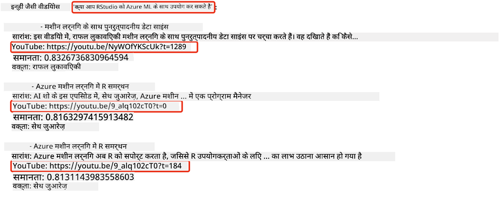
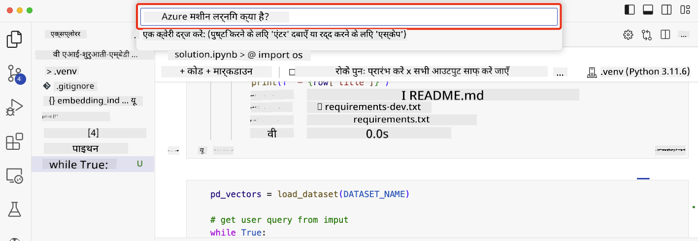

<!--
CO_OP_TRANSLATOR_METADATA:
{
  "original_hash": "d46aad0917a1a342d613e2c13d457da5",
  "translation_date": "2025-07-09T12:50:48+00:00",
  "source_file": "08-building-search-applications/README.md",
  "language_code": "hi"
}
-->
# सर्च एप्लिकेशन बनाना

[](https://aka.ms/gen-ai-lesson8-gh?WT.mc_id=academic-105485-koreyst)

> > _इस पाठ का वीडियो देखने के लिए ऊपर की छवि पर क्लिक करें_

LLMs केवल चैटबॉट्स और टेक्स्ट जनरेशन तक सीमित नहीं हैं। Embeddings का उपयोग करके सर्च एप्लिकेशन बनाना भी संभव है। Embeddings डेटा के संख्यात्मक प्रतिनिधित्व होते हैं जिन्हें वेक्टर भी कहा जाता है, और इन्हें डेटा के लिए सेमांटिक सर्च में इस्तेमाल किया जा सकता है।

इस पाठ में, आप हमारे शिक्षा स्टार्टअप के लिए एक सर्च एप्लिकेशन बनाएंगे। हमारा स्टार्टअप एक गैर-लाभकारी संगठन है जो विकासशील देशों के छात्रों को मुफ्त शिक्षा प्रदान करता है। हमारे स्टार्टअप के पास YouTube पर बहुत सारे वीडियो हैं जिनका उपयोग छात्र AI के बारे में सीखने के लिए कर सकते हैं। हमारा स्टार्टअप एक ऐसा सर्च एप्लिकेशन बनाना चाहता है जो छात्रों को प्रश्न टाइप करके YouTube वीडियो खोजने की अनुमति देता है।

उदाहरण के लिए, कोई छात्र 'What are Jupyter Notebooks?' या 'What is Azure ML' टाइप कर सकता है और सर्च एप्लिकेशन उन YouTube वीडियो की सूची लौटाएगा जो प्रश्न से संबंधित हैं, और इससे भी बेहतर, सर्च एप्लिकेशन उस वीडियो के उस हिस्से का लिंक देगा जहाँ प्रश्न का उत्तर मौजूद है।

## परिचय

इस पाठ में हम निम्नलिखित विषयों को कवर करेंगे:

- सेमांटिक बनाम कीवर्ड सर्च।
- Text Embeddings क्या हैं।
- Text Embeddings इंडेक्स बनाना।
- Text Embeddings इंडेक्स में सर्च करना।

## सीखने के लक्ष्य

इस पाठ को पूरा करने के बाद, आप सक्षम होंगे:

- सेमांटिक और कीवर्ड सर्च के बीच अंतर बताने में।
- Text Embeddings क्या होते हैं, समझाने में।
- Embeddings का उपयोग करके डेटा खोजने के लिए एप्लिकेशन बनाने में।

## सर्च एप्लिकेशन क्यों बनाएं?

सर्च एप्लिकेशन बनाना आपको यह समझने में मदद करेगा कि Embeddings का उपयोग करके डेटा कैसे खोजा जाता है। आप यह भी सीखेंगे कि एक ऐसा सर्च एप्लिकेशन कैसे बनाया जाए जिसे छात्र तेजी से जानकारी खोजने के लिए उपयोग कर सकें।

इस पाठ में Microsoft [AI Show](https://www.youtube.com/playlist?list=PLlrxD0HtieHi0mwteKBOfEeOYf0LJU4O1) YouTube चैनल के ट्रांसक्रिप्ट्स का Embedding Index शामिल है। AI Show एक YouTube चैनल है जो आपको AI और मशीन लर्निंग के बारे में सिखाता है। Embedding Index में अक्टूबर 2023 तक के सभी YouTube ट्रांसक्रिप्ट्स के Embeddings शामिल हैं। आप इस Embedding Index का उपयोग हमारे स्टार्टअप के लिए सर्च एप्लिकेशन बनाने में करेंगे। सर्च एप्लिकेशन उस वीडियो के उस हिस्से का लिंक लौटाएगा जहाँ प्रश्न का उत्तर मौजूद है। यह छात्रों के लिए आवश्यक जानकारी जल्दी खोजने का एक शानदार तरीका है।

नीचे 'can you use rstudio with azure ml?' प्रश्न के लिए एक सेमांटिक क्वेरी का उदाहरण दिया गया है। YouTube URL देखें, इसमें एक टाइमस्टैम्प होता है जो आपको वीडियो के उस हिस्से पर ले जाता है जहाँ प्रश्न का उत्तर है।



## सेमांटिक सर्च क्या है?

अब आप सोच रहे होंगे, सेमांटिक सर्च क्या है? सेमांटिक सर्च एक खोज तकनीक है जो क्वेरी में शब्दों के अर्थ या सेमांटिक्स का उपयोग करके प्रासंगिक परिणाम लौटाती है।

यहाँ सेमांटिक सर्च का एक उदाहरण है। मान लीजिए आप कार खरीदना चाहते हैं, आप 'my dream car' खोजते हैं, सेमांटिक सर्च समझता है कि आप कार के बारे में `सपने` नहीं देख रहे हैं, बल्कि आप अपनी `आदर्श` कार खरीदना चाहते हैं। सेमांटिक सर्च आपकी मंशा को समझता है और प्रासंगिक परिणाम देता है। इसके विपरीत, `कीवर्ड सर्च` शाब्दिक रूप से कारों के सपनों को खोजेगा और अक्सर अप्रासंगिक परिणाम देगा।

## Text Embeddings क्या हैं?

[Text embeddings](https://en.wikipedia.org/wiki/Word_embedding?WT.mc_id=academic-105485-koreyst) एक टेक्स्ट प्रतिनिधित्व तकनीक है जो [natural language processing](https://en.wikipedia.org/wiki/Natural_language_processing?WT.mc_id=academic-105485-koreyst) में उपयोग होती है। Text embeddings टेक्स्ट के सेमांटिक संख्यात्मक प्रतिनिधित्व होते हैं। Embeddings का उपयोग डेटा को इस तरह से प्रस्तुत करने के लिए किया जाता है जिसे मशीन आसानी से समझ सके। टेक्स्ट embeddings बनाने के कई मॉडल हैं, इस पाठ में हम OpenAI Embedding Model का उपयोग करके embeddings बनाने पर ध्यान केंद्रित करेंगे।

यहाँ एक उदाहरण है, कल्पना करें कि निम्नलिखित टेक्स्ट AI Show YouTube चैनल के एक एपिसोड के ट्रांसक्रिप्ट में है:

```text
Today we are going to learn about Azure Machine Learning.
```

हम टेक्स्ट को OpenAI Embedding API को भेजेंगे और यह 1536 संख्याओं वाला एक वेक्टर लौटाएगा। वेक्टर में प्रत्येक संख्या टेक्स्ट के एक अलग पहलू का प्रतिनिधित्व करती है। संक्षिप्तता के लिए, यहाँ वेक्टर के पहले 10 नंबर दिए गए हैं।

```python
[-0.006655829958617687, 0.0026128944009542465, 0.008792596869170666, -0.02446001023054123, -0.008540431968867779, 0.022071078419685364, -0.010703742504119873, 0.003311325330287218, -0.011632772162556648, -0.02187200076878071, ...]
```

## Embedding इंडेक्स कैसे बनाया जाता है?

इस पाठ के लिए Embedding इंडेक्स Python स्क्रिप्ट्स की एक श्रृंखला से बनाया गया है। आप इन स्क्रिप्ट्स को और निर्देशों को इस पाठ के 'scripts' फोल्डर में [README](./scripts/README.md?WT.mc_id=academic-105485-koreyst) में पाएंगे। इस पाठ को पूरा करने के लिए आपको ये स्क्रिप्ट्स चलाने की जरूरत नहीं है क्योंकि Embedding Index पहले से उपलब्ध है।

स्क्रिप्ट्स निम्नलिखित कार्य करते हैं:

1. [AI Show](https://www.youtube.com/playlist?list=PLlrxD0HtieHi0mwteKBOfEeOYf0LJU4O1) प्लेलिस्ट के प्रत्येक YouTube वीडियो का ट्रांसक्रिप्ट डाउनलोड किया जाता है।
2. [OpenAI Functions](https://learn.microsoft.com/azure/ai-services/openai/how-to/function-calling?WT.mc_id=academic-105485-koreyst) का उपयोग करके, YouTube ट्रांसक्रिप्ट के पहले 3 मिनट से स्पीकर का नाम निकालने का प्रयास किया जाता है। प्रत्येक वीडियो के स्पीकर का नाम Embedding Index `embedding_index_3m.json` में संग्रहित किया जाता है।
3. ट्रांसक्रिप्ट टेक्स्ट को **3 मिनट के टेक्स्ट सेगमेंट्स** में विभाजित किया जाता है। प्रत्येक सेगमेंट में अगले सेगमेंट से लगभग 20 शब्द ओवरलैप होते हैं ताकि सेगमेंट का Embedding कट न जाए और बेहतर सर्च संदर्भ मिले।
4. प्रत्येक टेक्स्ट सेगमेंट को OpenAI Chat API को भेजा जाता है ताकि टेक्स्ट को 60 शब्दों में सारांशित किया जा सके। सारांश भी Embedding Index `embedding_index_3m.json` में संग्रहित किया जाता है।
5. अंत में, सेगमेंट टेक्स्ट को OpenAI Embedding API को भेजा जाता है। Embedding API 1536 संख्याओं वाला वेक्टर लौटाता है जो सेगमेंट के सेमांटिक अर्थ का प्रतिनिधित्व करता है। सेगमेंट और OpenAI Embedding वेक्टर को Embedding Index `embedding_index_3m.json` में संग्रहित किया जाता है।

### वेक्टर डेटाबेस

सरलता के लिए, Embedding Index को JSON फ़ाइल `embedding_index_3m.json` में संग्रहित किया गया है और Pandas DataFrame में लोड किया गया है। हालांकि, प्रोडक्शन में Embedding Index को Azure Cognitive Search, Redis, Pinecone, Weaviate जैसे वेक्टर डेटाबेस में संग्रहित किया जाएगा।

## cosine similarity को समझना

हमने टेक्स्ट embeddings के बारे में जाना, अगला कदम है टेक्स्ट embeddings का उपयोग करके डेटा खोजना और विशेष रूप से cosine similarity का उपयोग करके किसी क्वेरी के सबसे समान embeddings ढूंढना।

### cosine similarity क्या है?

Cosine similarity दो वेक्टरों के बीच समानता का माप है, इसे `nearest neighbor search` भी कहा जाता है। cosine similarity सर्च करने के लिए आपको OpenAI Embedding API का उपयोग करके क्वेरी टेक्स्ट का वेक्टर बनाना होगा। फिर क्वेरी वेक्टर और Embedding Index के प्रत्येक वेक्टर के बीच cosine similarity की गणना करनी होगी। याद रखें, Embedding Index में प्रत्येक YouTube ट्रांसक्रिप्ट टेक्स्ट सेगमेंट के लिए एक वेक्टर होता है। अंत में, परिणामों को cosine similarity के अनुसार क्रमबद्ध करें और जिन टेक्स्ट सेगमेंट्स की cosine similarity सबसे अधिक होगी वे क्वेरी के सबसे समान होंगे।

गणितीय दृष्टिकोण से, cosine similarity दो वेक्टरों के बीच के कोण का cosine मापता है जो बहुआयामी स्थान में प्रोजेक्ट किए गए हैं। यह माप उपयोगी है क्योंकि यदि दो दस्तावेज Euclidean दूरी से दूर हैं, तो भी उनके बीच का कोण छोटा हो सकता है और इसलिए उनकी cosine similarity अधिक हो सकती है। अधिक जानकारी के लिए [Cosine similarity](https://en.wikipedia.org/wiki/Cosine_similarity?WT.mc_id=academic-105485-koreyst) देखें।

## अपना पहला सर्च एप्लिकेशन बनाना

अब हम सीखेंगे कि Embeddings का उपयोग करके सर्च एप्लिकेशन कैसे बनाया जाता है। यह सर्च एप्लिकेशन छात्रों को प्रश्न टाइप करके वीडियो खोजने की अनुमति देगा। सर्च एप्लिकेशन प्रश्न से संबंधित वीडियो की सूची लौटाएगा। साथ ही, यह उस वीडियो के उस हिस्से का लिंक भी देगा जहाँ प्रश्न का उत्तर मौजूद है।

यह समाधान Windows 11, macOS, और Ubuntu 22.04 पर Python 3.10 या उससे ऊपर के संस्करण का उपयोग करके बनाया और परीक्षण किया गया है। आप Python [python.org](https://www.python.org/downloads/?WT.mc_id=academic-105485-koreyst) से डाउनलोड कर सकते हैं।

## असाइनमेंट - छात्रों के लिए सर्च एप्लिकेशन बनाना

इस पाठ की शुरुआत में हमने हमारे स्टार्टअप का परिचय दिया था। अब समय है छात्रों को उनके असाइनमेंट के लिए सर्च एप्लिकेशन बनाने में सक्षम बनाने का।

इस असाइनमेंट में, आप Azure OpenAI Services बनाएंगे जिनका उपयोग सर्च एप्लिकेशन बनाने के लिए किया जाएगा। आपको निम्नलिखित Azure OpenAI Services बनानी होंगी। इस असाइनमेंट को पूरा करने के लिए आपके पास Azure सब्सक्रिप्शन होना आवश्यक है।

### Azure Cloud Shell शुरू करें

1. [Azure पोर्टल](https://portal.azure.com/?WT.mc_id=academic-105485-koreyst) में साइन इन करें।
2. Azure पोर्टल के ऊपरी-दाएँ कोने में Cloud Shell आइकन चुनें।
3. पर्यावरण प्रकार के लिए **Bash** चुनें।

#### एक रिसोर्स ग्रुप बनाएं

> इन निर्देशों के लिए, हम East US में "semantic-video-search" नामक रिसोर्स ग्रुप का उपयोग कर रहे हैं।
> आप रिसोर्स ग्रुप का नाम बदल सकते हैं, लेकिन जब संसाधनों के लिए स्थान बदलें,
> तो [model availability table](https://aka.ms/oai/models?WT.mc_id=academic-105485-koreyst) देखें।

```shell
az group create --name semantic-video-search --location eastus
```

#### Azure OpenAI Service रिसोर्स बनाएं

Azure Cloud Shell से, Azure OpenAI Service रिसोर्स बनाने के लिए निम्न कमांड चलाएं।

```shell
az cognitiveservices account create --name semantic-video-openai --resource-group semantic-video-search \
    --location eastus --kind OpenAI --sku s0
```

#### इस एप्लिकेशन में उपयोग के लिए endpoint और keys प्राप्त करें

Azure Cloud Shell से, Azure OpenAI Service रिसोर्स के endpoint और keys प्राप्त करने के लिए निम्न कमांड चलाएं।

```shell
az cognitiveservices account show --name semantic-video-openai \
   --resource-group  semantic-video-search | jq -r .properties.endpoint
az cognitiveservices account keys list --name semantic-video-openai \
   --resource-group semantic-video-search | jq -r .key1
```

#### OpenAI Embedding मॉडल डिप्लॉय करें

Azure Cloud Shell से, OpenAI Embedding मॉडल डिप्लॉय करने के लिए निम्न कमांड चलाएं।

```shell
az cognitiveservices account deployment create \
    --name semantic-video-openai \
    --resource-group  semantic-video-search \
    --deployment-name text-embedding-ada-002 \
    --model-name text-embedding-ada-002 \
    --model-version "2"  \
    --model-format OpenAI \
    --sku-capacity 100 --sku-name "Standard"
```

## समाधान

GitHub Codespaces में [solution notebook](../../../08-building-search-applications/python/aoai-solution.ipynb) खोलें और Jupyter Notebook में दिए गए निर्देशों का पालन करें।

जब आप नोटबुक चलाएंगे, तो आपसे क्वेरी दर्ज करने के लिए कहा जाएगा। इनपुट बॉक्स इस तरह दिखेगा:



## शानदार काम! अपनी सीख जारी रखें

इस पाठ को पूरा करने के बाद, हमारे [Generative AI Learning collection](https://aka.ms/genai-collection?WT.mc_id=academic-105485-koreyst) को देखें और अपनी Generative AI की जानकारी को और बढ़ाएं!

अगले पाठ 9 में जाएं जहाँ हम सीखेंगे कि [इमेज जनरेशन एप्लिकेशन कैसे बनाएं](../09-building-image-applications/README.md?WT.mc_id=academic-105485-koreyst)!

**अस्वीकरण**:  
यह दस्तावेज़ AI अनुवाद सेवा [Co-op Translator](https://github.com/Azure/co-op-translator) का उपयोग करके अनुवादित किया गया है। जबकि हम सटीकता के लिए प्रयासरत हैं, कृपया ध्यान दें कि स्वचालित अनुवादों में त्रुटियाँ या असंगतियाँ हो सकती हैं। मूल दस्तावेज़ अपनी मूल भाषा में ही अधिकारिक स्रोत माना जाना चाहिए। महत्वपूर्ण जानकारी के लिए, पेशेवर मानव अनुवाद की सलाह दी जाती है। इस अनुवाद के उपयोग से उत्पन्न किसी भी गलतफहमी या गलत व्याख्या के लिए हम जिम्मेदार नहीं हैं।