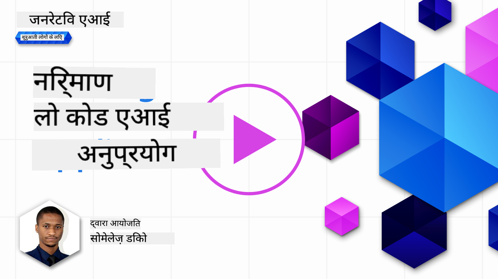
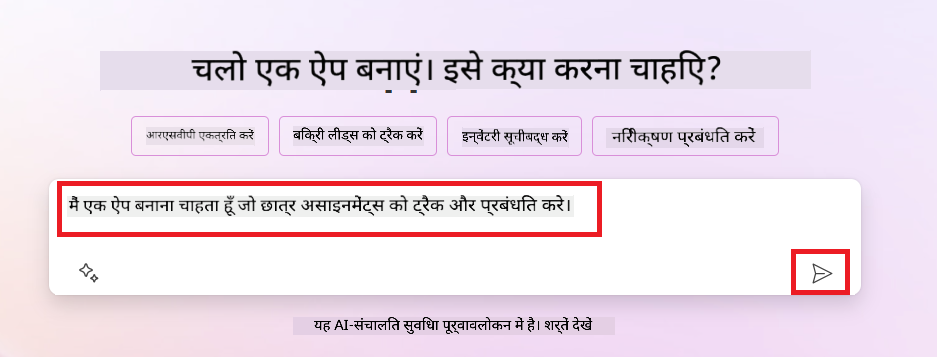
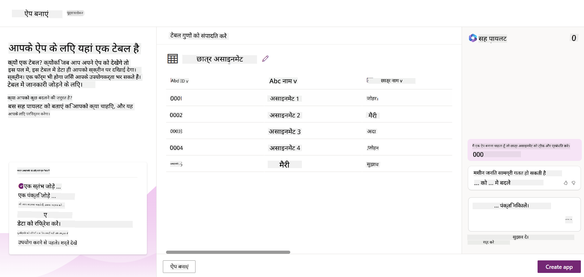
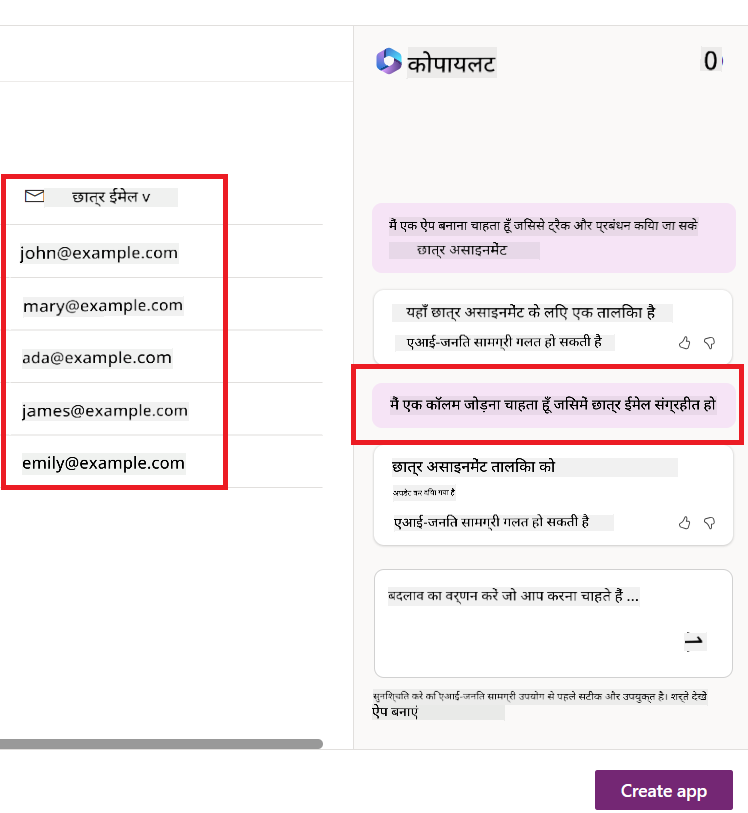
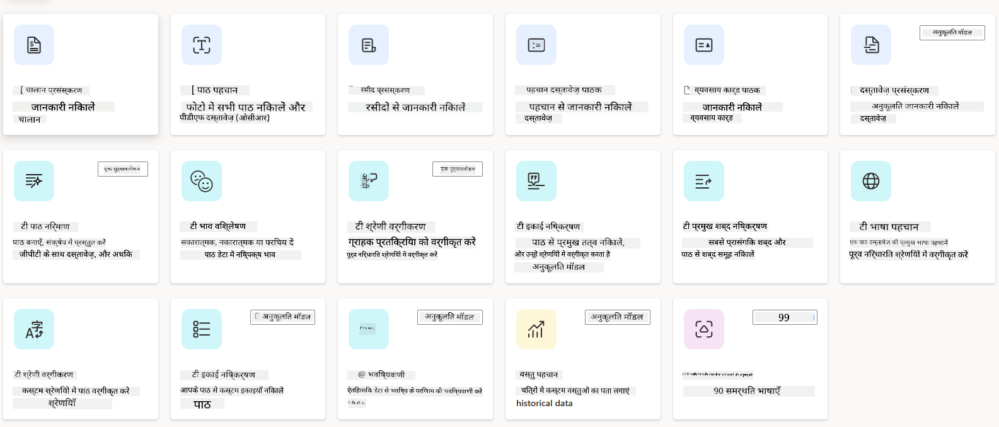
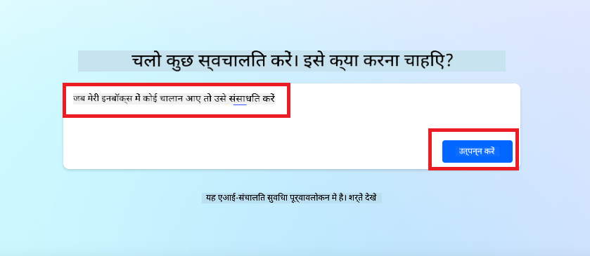
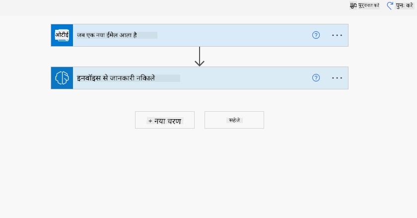
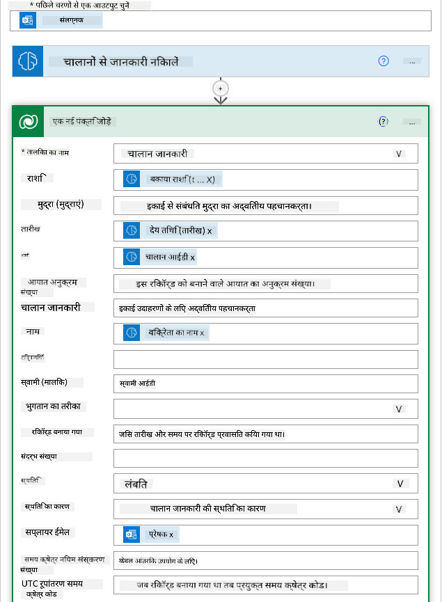
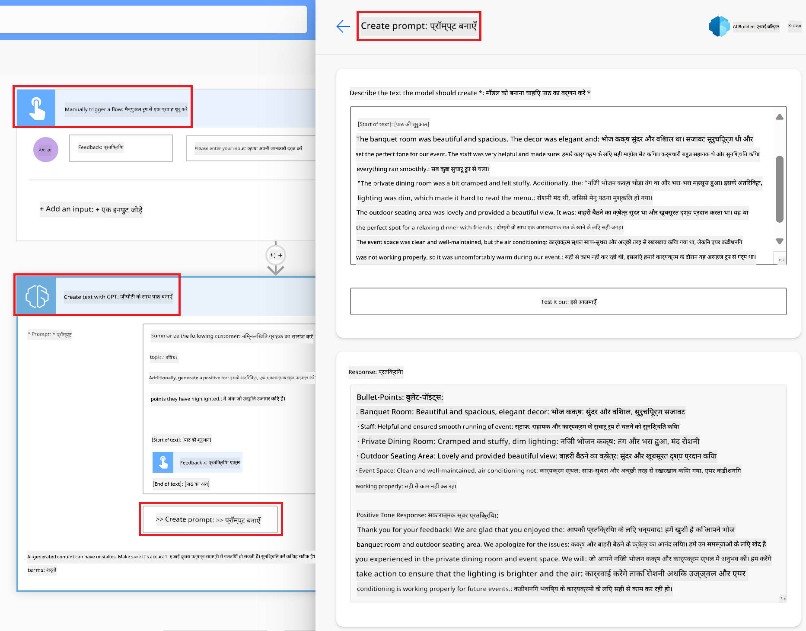

<!--
CO_OP_TRANSLATOR_METADATA:
{
  "original_hash": "f5ff3b6204a695a117d6f452403c95f7",
  "translation_date": "2025-05-19T19:58:23+00:00",
  "source_file": "10-building-low-code-ai-applications/README.md",
  "language_code": "hi"
}
-->
# लो कोड AI एप्लिकेशन बनाना

> _(इस पाठ का वीडियो देखने के लिए ऊपर की छवि पर क्लिक करें)_

## परिचय

अब जब हमने इमेज जनरेटिंग एप्लिकेशन बनाना सीख लिया है, तो आइए लो कोड के बारे में बात करते हैं। जनरेटिव AI का उपयोग विभिन्न क्षेत्रों में किया जा सकता है, जिसमें लो कोड भी शामिल है, लेकिन लो कोड क्या है और हम इसमें AI कैसे जोड़ सकते हैं?

लो कोड डेवलपमेंट प्लेटफॉर्म्स का उपयोग करके पारंपरिक डेवलपर्स और गैर-डेवलपर्स के लिए ऐप्स और समाधान बनाना आसान हो गया है। लो कोड डेवलपमेंट प्लेटफॉर्म्स आपको बिना कोड या बहुत कम कोड के ऐप्स और समाधान बनाने में सक्षम बनाते हैं। यह एक दृश्य विकास वातावरण प्रदान करके हासिल किया जाता है जो आपको ऐप्स और समाधान बनाने के लिए घटकों को खींचने और छोड़ने में सक्षम बनाता है। इससे आप ऐप्स और समाधान तेजी से और कम संसाधनों के साथ बना सकते हैं। इस पाठ में, हम लो कोड का उपयोग कैसे करें और AI का उपयोग करके पावर प्लेटफॉर्म के साथ लो कोड विकास को कैसे बढ़ावा दें, इस पर गहराई से विचार करेंगे।

पावर प्लेटफॉर्म संगठनों को उनके टीमों को एक सहज लो-कोड या नो-कोड वातावरण के माध्यम से अपने स्वयं के समाधान बनाने का अवसर प्रदान करता है। यह वातावरण समाधान बनाने की प्रक्रिया को सरल बनाता है। पावर प्लेटफॉर्म के साथ, समाधान महीनों या वर्षों के बजाय दिनों या हफ्तों में बनाए जा सकते हैं। पावर प्लेटफॉर्म में पांच प्रमुख उत्पाद शामिल हैं: पावर ऐप्स, पावर ऑटोमेट, पावर BI, पावर पेजेज और कोपायलट स्टूडियो।

यह पाठ शामिल करता है:

- पावर प्लेटफॉर्म में जनरेटिव AI का परिचय
- कोपायलट का परिचय और इसका उपयोग कैसे करें
- पावर प्लेटफॉर्म में ऐप्स और फ्लो बनाने के लिए जनरेटिव AI का उपयोग करना
- AI बिल्डर के साथ पावर प्लेटफॉर्म में AI मॉडल्स को समझना

## सीखने के लक्ष्य

इस पाठ के अंत तक, आप सक्षम होंगे:

- पावर प्लेटफॉर्म में कोपायलट कैसे काम करता है, इसे समझें।

- हमारे शिक्षा स्टार्टअप के लिए एक स्टूडेंट असाइनमेंट ट्रैकर ऐप बनाएं।

- एक इनवॉइस प्रोसेसिंग फ्लो बनाएं जो इनवॉइस से जानकारी निकालने के लिए AI का उपयोग करता है।

- GPT AI मॉडल के साथ टेक्स्ट बनाने का उपयोग करते समय सर्वोत्तम प्रथाओं को लागू करें।

इस पाठ में आप जिन उपकरणों और प्रौद्योगिकियों का उपयोग करेंगे, वे हैं:

- **पावर ऐप्स**, स्टूडेंट असाइनमेंट ट्रैकर ऐप के लिए, जो ऐप्स को ट्रैक करने, प्रबंधित करने और डेटा के साथ बातचीत करने के लिए लो-कोड विकास वातावरण प्रदान करता है।

- **डेटावर्स**, स्टूडेंट असाइनमेंट ट्रैकर ऐप के लिए डेटा संग्रहीत करने के लिए, जहां डेटावर्स ऐप के डेटा को संग्रहीत करने के लिए लो-कोड डेटा प्लेटफॉर्म प्रदान करेगा।

- **पावर ऑटोमेट**, इनवॉइस प्रोसेसिंग फ्लो के लिए, जहां आपके पास इनवॉइस प्रोसेसिंग प्रक्रिया को स्वचालित करने के लिए वर्कफ्लो बनाने के लिए लो-कोड विकास वातावरण होगा।

- **AI बिल्डर**, इनवॉइस प्रोसेसिंग AI मॉडल के लिए, जहां आप हमारे स्टार्टअप के लिए इनवॉइस को प्रोसेस करने के लिए प्रीबिल्ट AI मॉडल्स का उपयोग करेंगे।

## पावर प्लेटफॉर्म में जनरेटिव AI

लो-कोड विकास और एप्लिकेशन को जनरेटिव AI के साथ बढ़ाना पावर प्लेटफॉर्म के लिए एक प्रमुख फोकस क्षेत्र है। लक्ष्य यह है कि हर कोई AI-संचालित ऐप्स, साइट्स, डैशबोर्ड बना सके और AI के साथ प्रक्रियाओं को स्वचालित कर सके, _बिना किसी डेटा विज्ञान विशेषज्ञता की आवश्यकता के_। इस लक्ष्य को पावर प्लेटफॉर्म में लो-कोड विकास अनुभव में जनरेटिव AI को कोपायलट और AI बिल्डर के रूप में एकीकृत करके हासिल किया जाता है।

### यह कैसे काम करता है?

कोपायलट एक AI सहायक है जो आपको प्राकृतिक भाषा का उपयोग करके एक श्रृंखला संवादात्मक चरणों में अपनी आवश्यकताओं का वर्णन करके पावर प्लेटफॉर्म समाधान बनाने में सक्षम बनाता है। उदाहरण के लिए, आप अपने AI सहायक को बता सकते हैं कि आपका ऐप किन क्षेत्रों का उपयोग करेगा और यह ऐप और अंतर्निहित डेटा मॉडल दोनों बना देगा या आप पावर ऑटोमेट में फ्लो सेटअप कैसे करें, यह निर्दिष्ट कर सकते हैं।

आप उपयोगकर्ताओं को संवादात्मक बातचीत के माध्यम से अंतर्दृष्टि प्राप्त करने में सक्षम बनाने के लिए अपनी ऐप स्क्रीन में एक फीचर के रूप में कोपायलट संचालित कार्यात्मकताओं का उपयोग कर सकते हैं।

AI बिल्डर पावर प्लेटफॉर्म में उपलब्ध एक लो-कोड AI क्षमता है जो आपको प्रक्रियाओं को स्वचालित करने और परिणामों की भविष्यवाणी करने में मदद करने के लिए AI मॉडल्स का उपयोग करने में सक्षम बनाती है। AI बिल्डर के साथ आप अपने ऐप्स और फ्लो में AI ला सकते हैं जो आपके डेटा को डेटावर्स या विभिन्न क्लाउड डेटा स्रोतों, जैसे कि SharePoint, OneDrive या Azure से जोड़ते हैं।

कोपायलट सभी पावर प्लेटफॉर्म उत्पादों में उपलब्ध है: पावर ऐप्स, पावर ऑटोमेट, पावर BI, पावर पेजेज और पावर वर्चुअल एजेंट्स। AI बिल्डर पावर ऐप्स और पावर ऑटोमेट में उपलब्ध है। इस पाठ में, हम अपने शिक्षा स्टार्टअप के लिए एक समाधान बनाने के लिए पावर ऐप्स और पावर ऑटोमेट में कोपायलट और AI बिल्डर का उपयोग कैसे करें, इस पर ध्यान केंद्रित करेंगे।

### पावर ऐप्स में कोपायलट

पावर प्लेटफॉर्म के हिस्से के रूप में, पावर ऐप्स ऐप्स बनाने के लिए लो-कोड विकास वातावरण प्रदान करता है ताकि डेटा को ट्रैक, प्रबंधित और बातचीत किया जा सके। यह ऐप विकास सेवाओं का एक सूट है जिसमें एक स्केलेबल डेटा प्लेटफॉर्म और क्लाउड सेवाओं और ऑन-प्रिमाइसेस डेटा से कनेक्ट करने की क्षमता है। पावर ऐप्स आपको ऐप्स बनाने की अनुमति देता है जो ब्राउज़र, टैबलेट और फोन पर चलते हैं, और सहकर्मियों के साथ साझा किए जा सकते हैं। पावर ऐप्स उपयोगकर्ताओं को एक सरल इंटरफ़ेस के साथ ऐप विकास में शामिल करता है, ताकि हर व्यवसाय उपयोगकर्ता या प्रो डेवलपर कस्टम ऐप्स बना सके। ऐप विकास अनुभव को कोपायलट के माध्यम से जनरेटिव AI के साथ भी बढ़ाया गया है।

पावर ऐप्स में कोपायलट AI सहायक फीचर आपको यह वर्णन करने में सक्षम बनाता है कि आपको किस प्रकार का ऐप चाहिए और आप चाहते हैं कि आपका ऐप किस प्रकार की जानकारी ट्रैक, संग्रहित या दिखाए। कोपायलट फिर आपके विवरण के आधार पर एक उत्तरदायी कैनवास ऐप उत्पन्न करता है। फिर आप अपने आवश्यकताओं के अनुसार ऐप को अनुकूलित कर सकते हैं। AI कोपायलट यह भी सुझाव देता है कि आपको अपने डेटा को ट्रैक करने के लिए किन क्षेत्रों की आवश्यकता है और कुछ नमूना डेटा के साथ एक डेटावर्स टेबल। हम इस पाठ में बाद में देखेंगे कि डेटावर्स क्या है और आप इसे पावर ऐप्स में कैसे उपयोग कर सकते हैं। आप फिर AI कोपायलट सहायक फीचर के माध्यम से संवादात्मक चरणों का उपयोग करके तालिका को अपनी आवश्यकताओं के अनुसार अनुकूलित कर सकते हैं। यह फीचर पावर ऐप्स होम स्क्रीन से आसानी से उपलब्ध है।

### पावर ऑटोमेट में कोपायलट

पावर प्लेटफॉर्म के हिस्से के रूप में, पावर ऑटोमेट उपयोगकर्ताओं को एप्लिकेशन और सेवाओं के बीच स्वचालित वर्कफ़्लो बनाने की अनुमति देता है। यह संचार, डेटा संग्रहण और निर्णय अनुमोदन जैसे दोहराए जाने वाले व्यवसाय प्रक्रियाओं को स्वचालित करने में मदद करता है। इसका सरल इंटरफ़ेस उपयोगकर्ताओं को हर तकनीकी क्षमता (शुरुआती से लेकर अनुभवी डेवलपर्स तक) के साथ कार्य कार्यों को स्वचालित करने की अनुमति देता है। वर्कफ़्लो विकास अनुभव को कोपायलट के माध्यम से जनरेटिव AI के साथ भी बढ़ाया गया है।

पावर ऑटोमेट में कोपायलट AI सहायक फीचर आपको यह वर्णन करने में सक्षम बनाता है कि आपको किस प्रकार का फ्लो चाहिए और आप चाहते हैं कि आपका फ्लो कौन से कार्य करे। कोपायलट फिर आपके विवरण के आधार पर एक फ्लो उत्पन्न करता है। फिर आप फ्लो को अपनी आवश्यकताओं के अनुसार अनुकूलित कर सकते हैं। AI कोपायलट यह भी सुझाव देता है कि आपको कौन से कार्य करने की आवश्यकता है। हम इस पाठ में बाद में देखेंगे कि फ्लो क्या हैं और आप उन्हें पावर ऑटोमेट में कैसे उपयोग कर सकते हैं। आप फिर AI कोपायलट सहायक फीचर के माध्यम से संवादात्मक चरणों का उपयोग करके कार्यों को अपनी आवश्यकताओं के अनुसार अनुकूलित कर सकते हैं। यह फीचर पावर ऑटोमेट होम स्क्रीन से आसानी से उपलब्ध है।

## असाइनमेंट: हमारे स्टार्टअप के लिए छात्र असाइनमेंट और इनवॉइस प्रबंधन, कोपायलट का उपयोग करके

हमारा स्टार्टअप छात्रों को ऑनलाइन पाठ्यक्रम प्रदान करता है। स्टार्टअप तेजी से बढ़ा है और अब अपनी पाठ्यक्रम की मांग को पूरा करने में संघर्ष कर रहा है। स्टार्टअप ने आपको पावर प्लेटफॉर्म डेवलपर के रूप में नियुक्त किया है ताकि वे अपने छात्र असाइनमेंट और इनवॉइस को प्रबंधित करने में मदद करने के लिए एक लो कोड समाधान बना सकें। उनका समाधान उन्हें ऐप के माध्यम से छात्र असाइनमेंट को ट्रैक और प्रबंधित करने में मदद करने में सक्षम होना चाहिए और वर्कफ़्लो के माध्यम से इनवॉइस प्रोसेसिंग प्रक्रिया को स्वचालित करना चाहिए। आपसे जनरेटिव AI का उपयोग करके समाधान विकसित करने के लिए कहा गया है।

जब आप कोपायलट का उपयोग करना शुरू कर रहे हैं, तो आप [पावर प्लेटफॉर्म कोपायलट प्रॉम्प्ट लाइब्रेरी](https://github.com/pnp/powerplatform-prompts?WT.mc_id=academic-109639-somelezediko) का उपयोग करके प्रॉम्प्ट्स के साथ शुरुआत कर सकते हैं। इस लाइब्रेरी में प्रॉम्प्ट्स की एक सूची शामिल है जिसका उपयोग आप कोपायलट के साथ ऐप्स और फ्लो बनाने के लिए कर सकते हैं। आप लाइब्रेरी में प्रॉम्प्ट्स का उपयोग करके यह विचार प्राप्त कर सकते हैं कि कोपायलट को अपनी आवश्यकताओं का वर्णन कैसे करें।

### हमारे स्टार्टअप के लिए छात्र असाइनमेंट ट्रैकर ऐप बनाएं

हमारे स्टार्टअप के शिक्षकों को छात्र असाइनमेंट को ट्रैक करने में कठिनाई हो रही है। वे असाइनमेंट को ट्रैक करने के लिए एक स्प्रेडशीट का उपयोग कर रहे हैं लेकिन छात्रों की संख्या बढ़ने के साथ यह प्रबंधित करना मुश्किल हो गया है। उन्होंने आपसे एक ऐप बनाने के लिए कहा है जो उन्हें छात्र असाइनमेंट को ट्रैक और प्रबंधित करने में मदद करेगा। ऐप उन्हें नए असाइनमेंट जोड़ने, असाइनमेंट देखने, असाइनमेंट अपडेट करने और असाइनमेंट हटाने में सक्षम होना चाहिए। ऐप शिक्षकों और छात्रों को उन असाइनमेंट को देखने में भी सक्षम होना चाहिए जिन्हें ग्रेड किया गया है और जिन्हें ग्रेड नहीं किया गया है।

आप निम्नलिखित चरणों का पालन करके पावर ऐप्स में कोपायलट का उपयोग करके ऐप बनाएंगे:

1. [पावर ऐप्स](https://make.powerapps.com?WT.mc_id=academic-105485-koreyst) होम स्क्रीन पर जाएं।

1. होम स्क्रीन पर टेक्स्ट एरिया का उपयोग करके उस ऐप का वर्णन करें जिसे आप बनाना चाहते हैं। उदाहरण के लिए, **_मैं छात्र असाइनमेंट को ट्रैक और प्रबंधित करने के लिए एक ऐप बनाना चाहता हूं_**। प्रॉम्प्ट को AI कोपायलट को भेजने के लिए **भेजें** बटन पर क्लिक करें।

1. AI कोपायलट उन क्षेत्रों के साथ एक डेटावर्स टेबल का सुझाव देगा जिनकी आपको डेटा को ट्रैक करने और कुछ नमूना डेटा को संग्रहीत करने की आवश्यकता है। फिर आप संवादात्मक चरणों के माध्यम से AI कोपायलट सहायक फीचर का उपयोग करके तालिका को अपनी आवश्यकताओं के अनुसार अनुकूलित कर सकते हैं।

   > **महत्वपूर्ण**: डेटावर्स पावर प्लेटफॉर्म के लिए अंतर्निहित डेटा प्लेटफॉर्म है। यह ऐप के डेटा को संग्रहीत करने के लिए एक लो-कोड डेटा प्लेटफॉर्म है। यह एक पूर्ण रूप से प्रबंधित सेवा है जो माइक्रोसॉफ्ट क्लाउड में डेटा को सुरक्षित रूप से संग्रहीत करती है और आपके पावर प्लेटफॉर्म वातावरण के भीतर प्रावधान करती है। इसमें डेटा वर्गीकरण, डेटा वंशावली, सूक्ष्म-स्तरीय पहुंच नियंत्रण और अधिक जैसे अंतर्निहित डेटा शासन क्षमताएं हैं। आप डेटावर्स के बारे में [यहां](https://docs.microsoft.com/powerapps/maker/data-platform/data-platform-intro?WT.mc_id=academic-109639-somelezediko) अधिक जान सकते हैं।

   

1. शिक्षक उन छात्रों को ईमेल भेजना चाहते हैं जिन्होंने अपने असाइनमेंट जमा किए हैं ताकि उन्हें उनके असाइनमेंट की प्रगति पर अपडेट रखा जा सके। आप तालिका में छात्र ईमेल संग्रहीत करने के लिए एक नया क्षेत्र जोड़ने के लिए कोपायलट का उपयोग कर सकते हैं। उदाहरण के लिए, आप निम्नलिखित प्रॉम्प्ट का उपयोग करके तालिका में एक नया क्षेत्र जोड़ सकते हैं: **_मैं छात्र ईमेल संग्रहीत करने के लिए एक कॉलम जोड़ना चाहता हूं_**। प्रॉम्प्ट को AI कोपायलट को भेजने के लिए **भेजें** बटन पर क्लिक करें।

1. AI कोपायलट एक नया क्षेत्र उत्पन्न करेगा और फिर आप अपनी आवश्यकताओं के अनुसार क्षेत्र को अनुकूलित कर सकते हैं।

1. तालिका के साथ समाप्त होने के बाद, ऐप बनाने के लिए **ऐप बनाएं** बटन पर क्लिक करें।

1. AI कोपायलट आपके विवरण के आधार पर एक उत्तरदायी कैनवास ऐप उत्पन्न करेगा। फिर आप ऐप को अपनी आवश्यकताओं के अनुसार अनुकूलित कर सकते हैं।

1. शिक्षकों को छात्रों को ईमेल भेजने के लिए, आप ऐप में एक नई स्क्रीन जोड़ने के लिए कोपायलट का उपयोग कर सकते हैं। उदाहरण के लिए, आप निम्नलिखित प्रॉम्प्ट का उपयोग करके ऐप में एक नई स्क्रीन जोड़ सकते हैं: **_मैं छात्रों को ईमेल भेजने के लिए एक स्क्रीन जोड़ना चाहता हूं_**। प्रॉम्प्ट को AI कोपायलट को भेजने के लिए **भेजें** बटन पर क्लिक करें।

1. AI कोपायलट एक नई स्क्रीन उत्पन्न करेगा और फिर आप अपनी आवश्यकताओं के अनुसार स्क्रीन को अनुकूलित कर सकते हैं।

1. ऐप के साथ समाप्त होने के बाद, ऐप को सहेजने के लिए **सहेजें** बटन पर क्लिक करें।

1. शिक्षकों के साथ ऐप साझा करने के लिए, **शेयर** बटन पर क्लिक करें और फिर **शेयर** बटन पर फिर से क्लिक करें। आप शिक्षकों के ईमेल पते दर्ज करके ऐप साझा कर सकते हैं।

> **आपका होमवर्क**: आपने जो ऐप बनाया है वह एक अच्छी शुरुआत है लेकिन इसे बेहतर बनाया जा सकता है। ईमेल फीचर के साथ, शिक्षक केवल छात्रों को मैन्युअल रूप से ईमेल भेज सकते हैं, उन्हें उनके ईमेल टाइप करने की आवश्यकता होती है। क्या आप कोपायलट का उपयोग करके एक स्वचालन बना सकते हैं जो शिक्षकों को छात्रों को उनके असाइनमेंट जमा करने पर स्वचालित रूप से ईमेल भेजने में सक्षम बनाएगा? आपका संकेत है कि सही प्रॉम्प्ट के साथ आप पावर ऑटोमेट में कोपायलट का उपयोग करके इसे बना सकते हैं।

### हमारे स्टार्टअप के लिए इनवॉइस सूचना तालिका बनाएं

हमारे स्टार्टअप की वित्त टीम इनवॉइस को ट्रैक करने में कठिनाई हो रही है। वे इनवॉइस को ट्रैक करने के लिए एक स्प्रेडशीट का उपयोग कर रहे हैं लेकिन इनवॉइस की संख्या बढ़ने के साथ यह प्रबंधित करना मुश्किल हो गया है। उन्होंने आपसे एक तालिका बनाने के लिए कहा है जो उन्हें प्राप्त इनवॉइस की जानकारी को संग्रहीत, ट्रैक और प्रबंधित करने में मदद करेगी। तालिका का उपयोग स्वचालन बनाने के लिए किया जाना चाहिए जो सभी इनवॉइस जानकारी निकाल सके और इसे तालिका में संग्रहीत कर सके। तालिका वित्त टीम को भुगतान किए गए और बिना भुगतान किए गए इनवॉइस को देखने में भी सक्षम बनानी चाहिए।

पावर प्लेटफॉर्म के पास एक अंतर्निहित डेटा प्लेटफॉर्म है जिसे डेटावर्स कहा जाता है जो आपके ऐप्स और समाधानों के डेटा को संग्रहीत करने में सक्षम बनाता है। डेटावर्स ऐप के डेटा को संग्रहीत करने के लिए एक लो-कोड डेटा प्लेटफॉर्म प्रदान करता है। यह एक पूर्ण रूप से प्रबंधित सेवा है जो माइक्रोसॉफ्ट क्लाउड में डेटा को सुरक्षित रूप से संग्रहीत करती है और आपके पावर प्लेटफॉर्म वातावरण के भीतर प्रावधान करती है। इसमें डेटा वर्गीकरण, डेटा वंशावली,
एक पाठ। - **भावना विश्लेषण**: यह मॉडल पाठ में सकारात्मक, नकारात्मक, तटस्थ, या मिश्रित भावना का पता लगाता है। - **व्यापार कार्ड रीडर**: यह मॉडल व्यापार कार्ड से जानकारी निकालता है। - **पाठ पहचान**: यह मॉडल छवियों से पाठ निकालता है। - **वस्तु पहचान**: यह मॉडल छवियों से वस्तुओं का पता लगाता और निकालता है। - **दस्तावेज़ प्रसंस्करण**: यह मॉडल फॉर्म से जानकारी निकालता है। - **चालान प्रसंस्करण**: यह मॉडल चालानों से जानकारी निकालता है। कस्टम एआई मॉडल्स के साथ, आप अपना खुद का मॉडल एआई बिल्डर में ला सकते हैं ताकि यह किसी भी एआई बिल्डर कस्टम मॉडल की तरह काम कर सके, जिससे आप अपने डेटा का उपयोग करके मॉडल को प्रशिक्षित कर सकें। आप इन मॉडलों का उपयोग प्रक्रियाओं को स्वचालित करने और पावर ऐप्स और पावर ऑटोमेट दोनों में परिणामों की भविष्यवाणी करने के लिए कर सकते हैं। जब आप अपना खुद का मॉडल उपयोग करते हैं, तो कुछ सीमाएं लागू होती हैं। इन [सीमाओं](https://learn.microsoft.com/ai-builder/byo-model#limitations?WT.mc_id=academic-105485-koreyst) के बारे में अधिक पढ़ें।  ## असाइनमेंट #2 - हमारे स्टार्टअप के लिए एक चालान प्रसंस्करण प्रवाह बनाएं वित्त टीम को चालानों को संसाधित करने में कठिनाई हो रही है। वे चालानों को ट्रैक करने के लिए स्प्रेडशीट का उपयोग कर रहे हैं, लेकिन चालानों की संख्या बढ़ने के कारण इसे प्रबंधित करना मुश्किल हो गया है। उन्होंने आपसे अनुरोध किया है कि आप एक वर्कफ़्लो बनाएं जो एआई का उपयोग करके उन्हें चालानों को संसाधित करने में मदद करे। वर्कफ़्लो उन्हें चालानों से जानकारी निकालने और जानकारी को एक डेटावर्स टेबल में संग्रहीत करने में सक्षम होना चाहिए। वर्कफ़्लो उन्हें वित्त टीम को निकाली गई जानकारी के साथ ईमेल भेजने में भी सक्षम होना चाहिए। अब जब आप जानते हैं कि एआई बिल्डर क्या है और आपको इसका उपयोग क्यों करना चाहिए, तो आइए देखें कि आप एआई बिल्डर में चालान प्रसंस्करण एआई मॉडल का उपयोग कैसे कर सकते हैं, जिसे हमने पहले कवर किया था, एक वर्कफ़्लो बनाने के लिए जो वित्त टीम को चालानों को संसाधित करने में मदद करेगा। एआई बिल्डर में चालान प्रसंस्करण एआई मॉडल का उपयोग करके वित्त टीम को चालानों को संसाधित करने में मदद करने वाला वर्कफ़्लो बनाने के लिए, नीचे दिए गए चरणों का पालन करें: 1. [पावर ऑटोमेट](https://make.powerautomate.com?WT.mc_id=academic-105485-koreyst) होम स्क्रीन पर जाएं। 2. होम स्क्रीन पर टेक्स्ट क्षेत्र का उपयोग करके उस वर्कफ़्लो का वर्णन करें जिसे आप बनाना चाहते हैं। उदाहरण के लिए, **_जब मेरा मेलबॉक्स में चालान आए तो उसे संसाधित करें_**। एआई कोपायलट को संकेत भेजने के लिए **भेजें** बटन पर क्लिक करें।  3. एआई कोपायलट उन कार्यों का सुझाव देगा जिन्हें आपको स्वचालित करने के लिए करने की आवश्यकता है। आप अगले चरणों को देखने के लिए **अगला** बटन पर क्लिक कर सकते हैं। 4. अगले चरण में, पावर ऑटोमेट आपको प्रवाह के लिए आवश्यक कनेक्शन सेट अप करने के लिए प्रेरित करेगा। एक बार जब आप समाप्त कर लें, तो प्रवाह बनाने के लिए **प्रवाह बनाएं** बटन पर क्लिक करें। 5. एआई कोपायलट एक प्रवाह उत्पन्न करेगा और फिर आप अपनी आवश्यकताओं के अनुसार प्रवाह को अनुकूलित कर सकते हैं। 6. प्रवाह के ट्रिगर को अपडेट करें और **फ़ोल्डर** को उस फ़ोल्डर में सेट करें जहां चालान संग्रहीत किए जाएंगे। उदाहरण के लिए, आप फ़ोल्डर को **इनबॉक्स** पर सेट कर सकते हैं। **उन्नत विकल्प दिखाएं** पर क्लिक करें और **केवल संलग्नक के साथ** को **हां** पर सेट करें। इससे यह सुनिश्चित होगा कि प्रवाह केवल तभी चलेगा जब फ़ोल्डर में एक संलग्नक के साथ ईमेल प्राप्त होगा। 7. प्रवाह से निम्नलिखित कार्यों को हटा दें: **HTML से पाठ**, **रचना**, **रचना 2**, **रचना 3** और **रचना 4** क्योंकि आप उनका उपयोग नहीं करेंगे। 8. प्रवाह से **शर्त** क्रिया को हटा दें क्योंकि आप इसका उपयोग नहीं करेंगे। यह निम्नलिखित स्क्रीनशॉट की तरह दिखना चाहिए:  9. **एक क्रिया जोड़ें** बटन पर क्लिक करें और **डेटावर्स** खोजें। **एक नई पंक्ति जोड़ें** क्रिया का चयन करें। 10. **चालानों से जानकारी निकालें** क्रिया पर, **चालान फ़ाइल** को ईमेल से **संलग्नक सामग्री** की ओर इंगित करने के लिए अपडेट करें। इससे यह सुनिश्चित होगा कि प्रवाह चालान संलग्नक से जानकारी निकालता है। 11. पहले बनाए गए **तालिका** का चयन करें। उदाहरण के लिए, आप **चालान जानकारी** तालिका का चयन कर सकते हैं। निम्नलिखित फ़ील्ड्स को भरने के लिए पिछले कार्य से गतिशील सामग्री चुनें: - आईडी - राशि - तारीख - नाम - स्थिति - **स्थिति** को **लंबित** पर सेट करें। - आपूर्तिकर्ता ईमेल - **जब एक नया ईमेल आता है** ट्रिगर से **से** गतिशील सामग्री का उपयोग करें।  12. एक बार जब आप प्रवाह के साथ समाप्त कर लें, तो प्रवाह को सहेजने के लिए **सहेजें** बटन पर क्लिक करें। आप ट्रिगर में निर्दिष्ट फ़ोल्डर में चालान के साथ एक ईमेल भेजकर प्रवाह का परीक्षण कर सकते हैं। > **आपका होमवर्क**: आपने जो प्रवाह अभी बनाया है वह एक अच्छी शुरुआत है, अब आपको यह सोचना होगा कि आप एक स्वचालन कैसे बना सकते हैं जो हमारी वित्त टीम को उनके चालान की वर्तमान स्थिति के साथ आपूर्तिकर्ता को ईमेल भेजने में सक्षम करेगा। आपका संकेत: प्रवाह को तब चलना चाहिए जब चालान की स्थिति बदलती है।

## पावर ऑटोमेट में एक पाठ जनरेशन एआई मॉडल का उपयोग करें

एआई बिल्डर में जीपीटी एआई मॉडल के साथ पाठ बनाएं, आपको एक संकेत के आधार पर पाठ उत्पन्न करने की अनुमति देता है और यह माइक्रोसॉफ्ट एज़्योर ओपनएआई सेवा द्वारा संचालित होता है। इस क्षमता के साथ, आप अपने ऐप्स और प्रवाह में जीपीटी (जनरेटिव प्री-ट्रेंड ट्रांसफॉर्मर) तकनीक को शामिल कर सकते हैं ताकि विभिन्न स्वचालित प्रवाह और अंतर्दृष्टिपूर्ण अनुप्रयोग बना सकें।

जीपीटी मॉडल व्यापक मात्रा में डेटा पर व्यापक प्रशिक्षण से गुजरते हैं, जिससे उन्हें एक संकेत प्रदान किए जाने पर मानव भाषा के समान पाठ उत्पन्न करने में सक्षम बनाते हैं। वर्कफ़्लो स्वचालन के साथ एकीकृत होने पर, जीपीटी जैसे एआई मॉडल को कार्यों की एक विस्तृत श्रृंखला को सुव्यवस्थित और स्वचालित करने के लिए इस्तेमाल किया जा सकता है।

उदाहरण के लिए, आप विभिन्न उपयोग मामलों के लिए पाठ स्वचालित रूप से उत्पन्न करने के लिए प्रवाह बना सकते हैं, जैसे: ईमेल के ड्राफ्ट, उत्पाद विवरण, और अधिक। आप मॉडल का उपयोग विभिन्न ऐप्स के लिए पाठ उत्पन्न करने के लिए भी कर सकते हैं, जैसे चैटबॉट्स और ग्राहक सेवा ऐप्स जो ग्राहक सेवा एजेंटों को ग्राहक पूछताछ का प्रभावी और कुशलता से जवाब देने में सक्षम बनाते हैं।

इस एआई मॉडल का पावर ऑटोमेट में उपयोग कैसे करें, यह सीखने के लिए [एआई बिल्डर और जीपीटी के साथ बुद्धिमत्ता जोड़ें](https://learn.microsoft.com/training/modules/ai-builder-text-generation/?WT.mc_id=academic-109639-somelezediko) मॉड्यूल देखें।

## शानदार काम! अपनी सीख जारी रखें

इस पाठ को पूरा करने के बाद, हमारी [जनरेटिव एआई लर्निंग संग्रह](https://aka.ms/genai-collection?WT.mc_id=academic-105485-koreyst) देखें ताकि आप अपनी जनरेटिव एआई ज्ञान को और ऊंचा कर सकें!

पाठ 11 पर जाएं जहां हम देखेंगे कि [जनरेटिव एआई को फंक्शन कॉलिंग के साथ कैसे एकीकृत करें](../11-integrating-with-function-calling/README.md?WT.mc_id=academic-105485-koreyst)!

**अस्वीकरण**:  
यह दस्तावेज़ AI अनुवाद सेवा [Co-op Translator](https://github.com/Azure/co-op-translator) का उपयोग करके अनुवादित किया गया है। जबकि हम सटीकता के लिए प्रयासरत हैं, कृपया ध्यान दें कि स्वचालित अनुवाद में त्रुटियाँ या अशुद्धियाँ हो सकती हैं। मूल भाषा में मूल दस्तावेज़ को प्राधिकृत स्रोत माना जाना चाहिए। महत्वपूर्ण जानकारी के लिए, पेशेवर मानव अनुवाद की सिफारिश की जाती है। इस अनुवाद के उपयोग से उत्पन्न किसी भी गलतफहमी या गलत व्याख्या के लिए हम उत्तरदायी नहीं हैं।