# लो कोड एआई एप्लिकेशन बनाना

[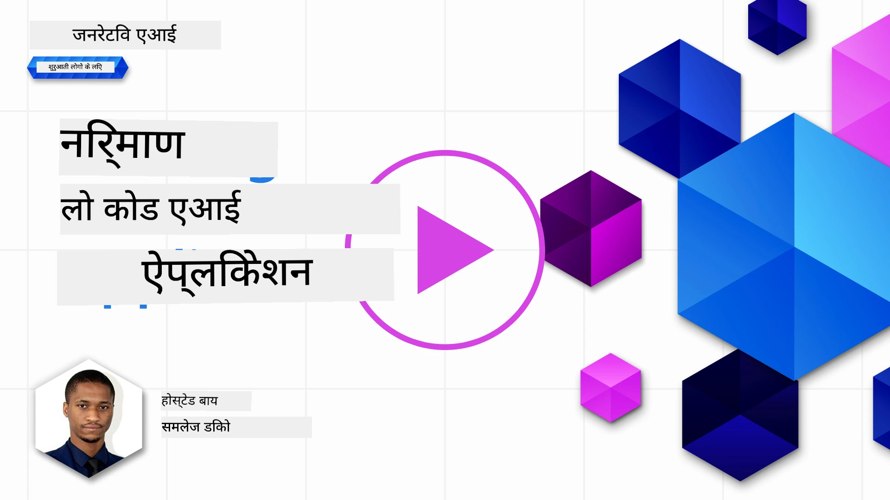](https://youtu.be/1vzq3Nd8GBA?si=h6LHWJXdmqf6mhDg)

> _(इस पाठ का वीडियो देखने के लिए ऊपर दिए गए चित्र पर क्लिक करें)_

## परिचय

अब जब हमने इमेज जनरेटिंग एप्लिकेशन बनाना सीख लिया है, तो चलिए लो कोड के बारे में बात करते हैं। जनरेटिव एआई का उपयोग कई क्षेत्रों में किया जा सकता है, जिसमें लो कोड भी शामिल है, लेकिन लो कोड क्या है और हम इसमें एआई कैसे जोड़ सकते हैं?

एप्लिकेशन और समाधान बनाना पारंपरिक डेवलपर्स और गैर-डेवलपर्स के लिए लो कोड विकास प्लेटफॉर्म के उपयोग के माध्यम से आसान हो गया है। लो कोड विकास प्लेटफॉर्म आपको बहुत कम या बिना कोड के एप्लिकेशन और समाधान बनाने की अनुमति देते हैं। यह एक विज़ुअल विकास पर्यावरण प्रदान करके प्राप्त किया जाता है जो आपको ऐप और समाधान बनाने के लिए घटकों को ड्रैग और ड्रॉप करने की सुविधा देता है। इससे आप तेजी से और कम संसाधनों के साथ ऐप और समाधान बना सकते हैं। इस पाठ में, हम लो कोड कैसे उपयोग करें और पावर प्लेटफ़ॉर्म का उपयोग करके एआई के साथ लो कोड विकास को कैसे बढ़ाएं, इस पर गहराई से चर्चा करेंगे।

पावर प्लेटफ़ॉर्म संगठनों को अपने टीमों को एक सहज लो-कोड या नो-कोड पर्यावरण के माध्यम से अपने समाधान बनाने का अवसर प्रदान करता है। यह पर्यावरण समाधान बनाने की प्रक्रिया को सरल बनाता है। पावर प्लेटफ़ॉर्म के साथ समाधान दिनों या हफ्तों में बनाए जा सकते हैं, महीनों या वर्षों में नहीं। पावर प्लेटफ़ॉर्म में पाँच मुख्य उत्पाद होते हैं: पावर ऐप्स, पावर ऑटोमेट, पावर बीआई, पावर पेजेस, और कापिलट स्टूडियो।

इस पाठ में शामिल हैं:

- पावर प्लेटफ़ॉर्म में जनरेटिव एआई का परिचय
- कापिलट का परिचय और इसे कैसे उपयोग करें
- पावर प्लेटफ़ॉर्म में ऐप्स और फ्लो बनाने के लिए जनरेटिव एआई का उपयोग
- AI बिल्डर के साथ पावर प्लेटफ़ॉर्म के एआई मॉडल को समझना
- माइक्रोसॉफ्ट कापिलट स्टूडियो के साथ इंटेलिजेंट एजेंट बनाना

## सीखने के लक्ष्य

इस पाठ के अंत तक, आप सक्षम होंगे:

- समझें कि पावर प्लेटफ़ॉर्म में कापिलट कैसे काम करता है।

- हमारे शिक्षा स्टार्टअप के लिए एक स्टूडेंट असाइनमेंट ट्रैकर ऐप बनाएं।

- एक ऐसा इनवॉइस प्रोसेसिंग फ्लो बनाएं जो इनवॉइस से जानकारी निकालने के लिए एआई का उपयोग करता हो।

- GPT एआई मॉडल के साथ टेक्स्ट बनाने का उपयोग करते समय सर्वोत्तम प्रथाओं को लागू करें।

- समझें कि माइक्रोसॉफ्ट कापिलट स्टूडियो क्या है और इसके साथ इंटेलिजेंट एजेंट कैसे बनाएं।

इस पाठ में आप जिन टूल्स और तकनीकों का उपयोग करेंगे वे हैं:

- **पावर ऐप्स**, स्टूडेंट असाइनमेंट ट्रैकर ऐप के लिए, जो डेटा ट्रैक, प्रबंधित और इंटरैक्ट करने के लिए लो-कोड विकास पर्यावरण प्रदान करता है।

- **डेटावर्स**, स्टूडेंट असाइनमेंट ट्रैकर ऐप के डेटा को संग्रहित करने के लिए, जहां डेटावर्स ऐप के डेटा को स्टोर करने के लिए एक लो-कोड डाटा प्लेटफ़ॉर्म प्रदान करेगा।

- **पावर ऑटोमेट**, इनवॉइस प्रोसेसिंग फ्लो के लिए जहां आप इनवॉइस प्रोसेसिंग प्रक्रिया को ऑटोमेट करने के लिए वर्कफ़्लो का निर्माण करेंगे।

- **AI बिल्डर**, इनवॉइस प्रोसेसिंग एआई मॉडल के लिए जहां आप हमारे स्टार्टअप के लिए इनवॉइस प्रोसेस करने के लिए पहले से बने एआई मॉडल का उपयोग करेंगे।

## पावर प्लेटफ़ॉर्म में जनरेटिव एआई

जनरेटिव एआई के साथ लो-कोड विकास और अनुप्रयोग को बेहतर बनाना पावर प्लेटफ़ॉर्म के लिए एक प्रमुख फोकस क्षेत्र है। लक्ष्य यह है कि हर कोई बिना किसी डेटा साइंस विशेषज्ञता के एआई-पावर्ड ऐप्स, साइट्स, डैशबोर्ड्स बना सके और एआई के साथ प्रक्रियाओं को ऑटोमेट कर सके। यह लक्ष्य पावर प्लेटफ़ॉर्म में कापिलट और AI बिल्डर के रूप में जनरेटिव एआई को लो-कोड विकास अनुभव में एकीकृत करके पूरा किया जाता है।

### यह कैसे काम करता है?

कापिलट एक एआई सहायक है जो आपको प्राकृतिक भाषा का उपयोग करके अपने आवश्यकताओं के एक श्रृंखला में वर्णन करके पावर प्लेटफ़ॉर्म समाधानों को बनाने में सक्षम बनाता है। उदाहरण के लिए, आप अपने एआई सहायक को बता सकते हैं कि आपका ऐप किन फील्ड्स का उपयोग करेगा और यह ऐप और अंतर्निहित डेटा मॉडल दोनों बनायेगा, या आप पावर ऑटोमेट में एक फ्लो कैसे सेटअप करना है निर्दिष्ट कर सकते हैं।

आप कापिलट संचालित कार्यक्षमताओं का उपयोग अपनी ऐप स्क्रीन में फीचर के रूप में कर सकते हैं ताकि उपयोगकर्ता संवादात्मक इंटरैक्शनों के माध्यम से अंतर्दृष्टि प्राप्त कर सकें।

AI बिल्डर पावर प्लेटफ़ॉर्म में उपलब्ध एक लो-कोड एआई सुविधा है जो आपको प्रक्रियाओं को स्वचालित करने और परिणामों की भविष्यवाणी करने में मदद करने के लिए एआई मॉडल का उपयोग करने में सक्षम बनाती है। AI बिल्डर के साथ आप अपने ऐप्स और फ्लोज़ में एआई ला सकते हैं जो डेटावर्स या विभिन्न क्लाउड डेटा स्रोतों जैसे कि SharePoint, OneDrive, या Azure से जुड़ते हैं।

कापिलट पावर प्लेटफ़ॉर्म के सभी उत्पादों में उपलब्ध है: पावर ऐप्स, पावर ऑटोमेट, पावर बीआई, पावर पेजेस और कापिलट स्टूडियो (पूर्व में पावर वर्चुअल एजेंट्स)। AI बिल्डर पावर ऐप्स और पावर ऑटोमेट में उपलब्ध है। इस पाठ में हम पावर ऐप्स और पावर ऑटोमेट में कापिलट और AI बिल्डर का उपयोग करके हमारे शिक्षा स्टार्टअप के लिए समाधान बनाने पर ध्यान देंगे।

### पावर ऐप्स में कापिलट

पावर प्लेटफ़ॉर्म के भाग के रूप में, पावर ऐप्स ऐसा लो-कोड विकास पर्यावरण प्रदान करता है जो डेटा को ट्रैक, मैनेज और इंटरैक्ट करने के लिए ऐप्स बनाने के लिए है। यह ऐप विकास सेवाओं का एक सूट है जिसमें एक स्केलेबल डेटा प्लेटफ़ॉर्म और क्लाउड सेवाओं और ऑन-प्रिमाइसेस डेटा से कनेक्ट करने की क्षमता होती है। पावर ऐप्स आपको ब्राउज़रों, टैबलेट्स और फोन पर चलने वाले ऐप्स बनाने की अनुमति देता है, जिन्हें सहकर्मियों के साथ साझा किया जा सकता है। पावर ऐप्स उपयोगकर्ताओं को एक सरल इंटरफ़ेस के साथ ऐप विकास में सहजता प्रदान करता है, ताकि हर व्यवसाय उपयोगकर्ता या प्रो डेवलपर कस्टम ऐप्स बना सके। ऐप विकास अनुभव को जनरेटिव एआई के माध्यम से कापिलट द्वारा भी बढ़ाया गया है।

पावर ऐप्स में कापिलट एआई सहायक फीचर आपको यह वर्णित करने की अनुमति देता है कि आपको किस प्रकार का ऐप चाहिए और आप अपने ऐप से किस जानकारी को ट्रैक, संग्रहित या दिखाना चाहते हैं। कापिलट आपके वर्णन के आधार पर एक प्रतिक्रियाशील कैनवास ऐप बनाता है। आप फिर अपने आवश्यकताओं को पूरा करने के लिए ऐप को अनुकूलित कर सकते हैं। एआई कापिलट एक डेटावर्स टेबल भी बनाता है और सुझाव देता है जिसमें वे फील्ड्स होते हैं जिनमें आप ट्रैक की जाने वाली जानकारी को संग्रहीत कर सकते हैं और कुछ नमूना डेटा होता है। इस पाठ में हम बाद में देखेंगे कि डेटावर्स क्या है और आप इसे पावर ऐप्स में कैसे उपयोग कर सकते हैं। फिर आप वार्तालापिक चरणों के माध्यम से AI कापिलट सहायक फीचर का उपयोग करके टेबल को अपनी आवश्यकताओं के अनुरूप अनुकूलित कर सकते हैं। यह सुविधा पावर ऐप्स होम स्क्रीन से आसानी से उपलब्ध है।

### पावर ऑटोमेट में कापिलट

पावर प्लेटफ़ॉर्म का हिस्सा होने के नाते, पावर ऑटोमेट उपयोगकर्ताओं को अनुप्रयोगों और सेवाओं के बीच स्वचालित वर्कफ़्लो बनाने की अनुमति देता है। यह संचार, डेटा संग्रह, और निर्णय अनुमोदन जैसे दोहराए जाने वाले व्यापार प्रक्रियाओं को स्वचालित करने में मदद करता है। इसका सरल इंटरफ़ेस शुरुआती से लेकर अनुभवी डेवलपर्स तक सभी तकनीकी दक्षताओं वाले उपयोगकर्ताओं को कार्य स्वचालन में सक्षम बनाता है। वर्कफ़्लो विकास अनुभव जनरेटिव एआई के माध्यम से कापिलट से भी सशक्त किया गया है।

पावर ऑटोमेट में कापिलट एआई सहायक फीचर आपको यह वर्णित करने की अनुमति देता है कि आपको किस प्रकार का फ्लो चाहिए और आप अपने फ्लो से कौन कौन से क्रियाएं कराना चाहते हैं। कापिलट आपके वर्णन के आधार पर एक फ्लो बनाता है। आप फिर अपने आवश्यकताओं के अनुरूप फ्लो को अनुकूलित कर सकते हैं। एआई कापिलट उन क्रियाओं को भी उत्पन्न और सुझाव देता है जो आपको अपने स्वचालन कार्य को पूरा करने के लिए चाहिए। इस पाठ में हम बाद में देखेंगे कि फ्लो क्या होते हैं और आप उन्हें पावर ऑटोमेट में कैसे उपयोग कर सकते हैं। आप फिर वार्तालापिक चरणों के माध्यम से कापिलट सहायक फीचर का उपयोग करके क्रियाओं को अपनी आवश्यकताओं के अनुसार अनुकूलित कर सकते हैं। यह सुविधा पावर ऑटोमेट होम स्क्रीन से आसानी से उपलब्ध है।

## माइक्रोसॉफ्ट कापिलट स्टूडियो के साथ बुद्धिमान एजेंट बनाना

[माइक्रोसॉफ्ट कापिलट स्टूडियो](https://learn.microsoft.com/microsoft-copilot-studio/fundamentals-what-is-copilot-studio?WT.mc_id=academic-105485-koreyst) (पूर्व में पावर वर्चुअल एजेंट्स) पावर प्लेटफ़ॉर्म का एक लो-कोड सदस्य है जो **एआई एजेंट** बनाता है — संवादात्मक कापिलट जो उपयोगकर्ताओं की ओर से प्रश्नों का उत्तर दे सकते हैं, क्रियाएं कर सकते हैं, और कार्यों को स्वचालित कर सकते हैं। ठीक उसी तरह जैसा कि पावर प्लेटफ़ॉर्म के अन्य भागों में होता है, आप इन एजेंटों को एक विज़ुअल, प्राकृतिक भाषा-प्रथम अनुभव में बनाते हैं: आप यह वर्णन करते हैं कि एजेंट क्या करना चाहता है, और कापिलट स्टूडियो इसके निर्देश, ज्ञान, और क्रियाओं का स्कैफोल्डिंग करने में मदद करता है।

हमारे शिक्षा स्टार्टअप के लिए, आप एक ऐसा एजेंट बना सकते हैं जो छात्रों के कोर्स संबंधित प्रश्नों का जवाब देता हो, असाइनमेंट की समयसीमाएं जांचता हो, और यहां तक कि एक शिक्षक को ईमेल भी करता हो — वह भी बिना किसी कोड लिखे।

यहाँ कुछ नवीनतम क्षमताएं हैं जो कापिलट स्टूडियो को शक्तिशाली बनाती हैं:

- **आपके ज्ञान से जनरेटिव उत्तर**। हर वार्तालाप को हस्त लेखन करने की बजाय, आप** ज्ञान स्रोतों** — सार्वजनिक वेबसाइट्स, SharePoint, OneDrive, Dataverse, अपलोड की गई फाइलें, या कनेक्टर के माध्यम से एंटरप्राइज डेटा — को जोड़ सकते हैं और एजेंट उनसे आधारित उत्तर उत्पन्न करता है।

- **जनरेटिव संयोजन**। कड़ाई से ट्रिगर वाक्यांशों पर निर्भर रहने के बजाय, एजेंट एआई का उपयोग करता है एक अनुरोध को समझने और उस अनुरोध को पूरा करने के लिए ज्ञान, विषयों और क्रियाओं को गतिशील रूप से संयोजित करने के लिए, जिसमें कई चरणों को जोड़ना भी शामिल है।

- **क्रियाएं और कनेक्टर**। एजेंट केवल चैट तक सीमित नहीं हैं। आप एजेंट को 1,500+ प्रीबिल्ट पावर प्लेटफ़ॉर्म कनेक्टर, पावर ऑटोमेट फ्लो, कस्टम REST API, प्रॉम्प्ट, या **मॉडल कॉन्टेक्स्ट प्रोटोकॉल (MCP)** सर्वर द्वारा समर्थित क्रियाएं दे सकते हैं।

- **स्वायत्त एजेंट**। एजेंट केवल चैट विंडो तक सीमित नहीं होते। आप **स्वायत्त एजेंट** बना सकते हैं जो ईवेंट्स जैसे नए ईमेल, डेटावर्स में नया रिकॉर्ड, या फाइल अपलोड होने से ट्रिगर होते हैं और फिर पृष्ठभूमि में कार्य पूर्ण करते हैं।

- **मल्टी-एजेंट संयोजन**। एजेंट अन्य एजेंट को कॉल कर सकते हैं। एक कापिलट स्टूडियो एजेंट अन्य एजेंट को सौंप सकता है, या अन्य एजेंटों द्वारा बढ़ाया जा सकता है, जिसमें माइक्रोसॉफ्ट 365 कापिलट और माइक्रोसॉफ्ट फाउंड्री में निर्मित एजेंट शामिल हैं।

- **मॉडल विकल्प**। अंतर्निहित मॉडलों के अलावा, आप माइक्रोसॉफ्ट फाउंड्री मॉडल कैटलॉग से मॉडल ला सकते हैं ताकि आपके एजेंट की सोच और प्रतिक्रिया को अनुकूलित किया जा सके।

- **कहीं भी प्रकाशित करें**। एक बार बनने के बाद, एजेंट को कई चैनलों पर प्रकाशित किया जा सकता है — माइक्रोसॉफ्ट टीम्स, माइक्रोसॉफ्ट 365 कापिलट, एक वेबसाइट या कस्टम ऐप, और अन्य — सुरक्षा, प्रमाणीकरण, और एनालिटिक्स पावर प्लेटफ़ॉर्म प्रशासन अनुभव के माध्यम से प्रबंधित किया जाता है।

आप अपना पहला एजेंट [copilotstudio.microsoft.com](https://copilotstudio.microsoft.com?WT.mc_id=academic-105485-koreyst) पर बनाना शुरू कर सकते हैं और [माइक्रोसॉफ्ट कापिलट स्टूडियो दस्तावेज](https://learn.microsoft.com/microsoft-copilot-studio/?WT.mc_id=academic-105485-koreyst) में अधिक जान सकते हैं।

## असाइनमेंट: कापिलट का उपयोग करके हमारे स्टार्टअप के लिए छात्र असाइनमेंट और इनवॉइस प्रबंधित करें

हमारा स्टार्टअप छात्रों को ऑनलाइन कोर्स प्रदान करता है। स्टार्टअप तेजी से बढ़ा है और अब अपने कोर्स की मांग को पूरा करने में संघर्ष कर रहा है। स्टार्टअप ने आपको पावर प्लेटफ़ॉर्म डेवलपर के रूप में नियुक्त किया है ताकि आप उनके लिए एक लो कोड समाधान बना सकें जो छात्रों के असाइनमेंट और इनवॉइस को प्रबंधित करने में मदद करे। उनके समाधान के द्वारा छात्र असाइनमेंट को एक ऐप के माध्यम से ट्रैक और प्रबंधित किया जाना चाहिए और इनवॉइस प्रोसेसिंग प्रक्रिया को एक वर्कफ़्लो के माध्यम से स्वचालित किया जाना चाहिए। उन्होंने आपको जनरेटिव एआई का उपयोग करके समाधान विकसित करने के लिए कहा है।

जब आप कापिलट का उपयोग शुरू कर रहे हों, तो आप [पावर प्लेटफ़ॉर्म कापिलट प्रॉम्प्ट लाइब्रेरी](https://github.com/pnp/powerplatform-prompts?WT.mc_id=academic-109639-somelezediko) का उपयोग प्रॉम्प्ट्स के साथ आरंभ करने के लिए कर सकते हैं। इस लाइब्रेरी में कापिलट के साथ ऐप्स और फ्लोज़ बनाने के लिए उपयोग किए जाने वाले प्रॉम्प्ट्स की सूची होती है। आप यह भी देख सकते हैं कि अपनी आवश्यकताओं का वर्णन कापिलट को कैसे करना है।

### हमारे स्टार्टअप के लिए स्टूडेंट असाइनमेंट ट्रैकर ऐप बनाएं

हमारे स्टार्टअप के शिक्षक छात्रों के असाइनमेंट ट्रैक करने के लिए संघर्ष कर रहे हैं। वे असाइनमेंट ट्रैक करने के लिए एक स्प्रेडशीट का उपयोग कर रहे थे लेकिन छात्रों की संख्या बढ़ने के कारण इसे प्रबंधित करना मुश्किल हो गया है। उन्होंने आपसे ऐसा ऐप बनाने के लिए कहा है जो छात्रों के असाइनमेंट को ट्रैक और प्रबंधित करने में मदद करे। ऐप उन्हें नए असाइनमेंट जोड़ने, असाइनमेंट देखने, अपडेट करने और डिलीट करने की अनुमति देनी चाहिए। ऐप शिक्षकों और छात्रों को ग्रेड किए गए और जिन असाइनमेंट का ग्रेड नहीं हुआ है, दोनों को दिखाने में सक्षम होना चाहिए।

आप नीचे दिए गए चरणों का पालन करते हुए कापिलट के तहत पावर ऐप्स में ऐप बनाएंगे:

1. [पावर ऐप्स](https://make.powerapps.com?WT.mc_id=academic-105485-koreyst) होम स्क्रीन पर जाएं।

1. होम स्क्रीन पर टेक्स्ट एरिया का उपयोग करके उस ऐप का वर्णन करें जिसे आप बनाना चाहते हैं। उदाहरण के लिए, **_मैं छात्र असाइनमेंट ट्रैक और प्रबंधित करने के लिए एक ऐप बनाना चाहता हूँ_**। एआई कापिलट को प्रॉम्प्ट भेजने के लिए **Send** बटन पर क्लिक करें।

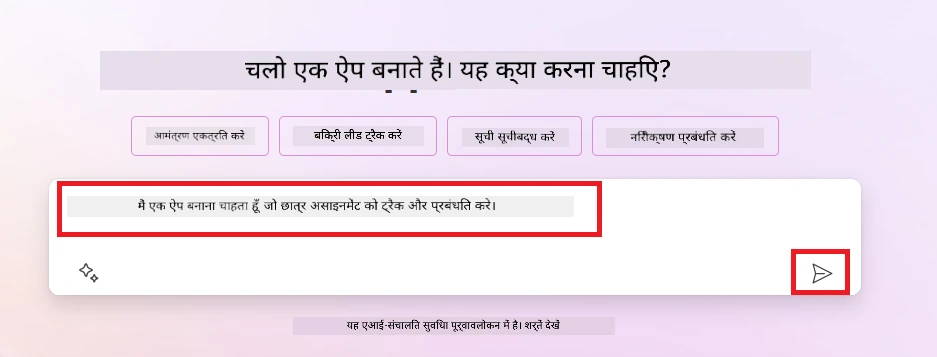

1. एआई कापिलट उन फील्ड्स के साथ एक डेटावर्स टेबल सुझाएगा जो आपको ट्रैक करने के लिए डेटा संग्रहीत करने चाहिए, साथ ही कुछ नमूना डेटा भी देगा। आप फिर AI कापिलट सहायक फीचर का उपयोग करते हुए टेबल को संवादात्मक चरणों के माध्यम से अपनी आवश्यकताओं के अनुसार अनुकूलित कर सकते हैं।

   > **महत्वपूर्ण**: डेटावर्स पावर प्लेटफ़ॉर्म के लिए अंतर्निहित डेटा प्लेटफ़ॉर्म है। यह ऐप के डेटा को स्टोर करने के लिए एक लो-कोड डेटा प्लेटफ़ॉर्म है। यह एक पूरी तरह प्रबंधित सेवा है जो Microsoft क्लाउड में सुरक्षित रूप से डेटा स्टोर करता है और आपके पावर प्लेटफ़ॉर्म वातावरण में प्रोविजन किया जाता है। इसमें डेटा वर्गीकरण, डेटा उत्पत्ति, सूक्ष्म पहुँच नियंत्रण, और अन्य अंतर्निहित डेटा गवर्नेंस क्षमताएं हैं। आप डेटावर्स के बारे में अधिक यहाँ सीख सकते हैं [यहाँ](https://learn.microsoft.com/power-apps/maker/data-platform/data-platform-intro?WT.mc_id=academic-109639-somelezediko)।

   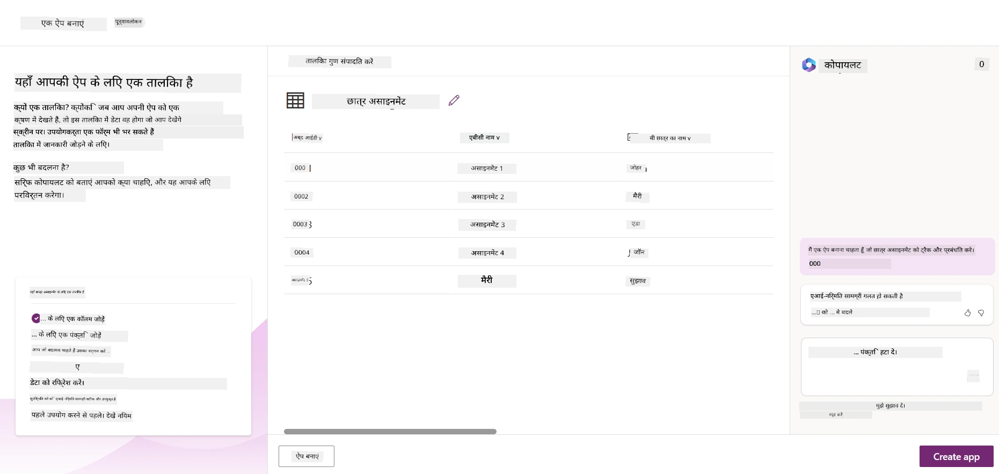

1. शिक्षक उन छात्रों को ईमेल भेजना चाहते हैं जिन्होंने अपने असाइनमेंट सबमिट किए हैं ताकि वे उनके असाइनमेंट की प्रगति के बारे में अपडेट रह सकें। आप टेबल में छात्र ईमेल संग्रहीत करने के लिए कापिलट का उपयोग कर नया फील्ड जोड़ सकते हैं। उदाहरण के लिए, आप टेबल में नया कॉलम जोड़ने के लिए निम्नलिखित प्रॉम्प्ट का उपयोग कर सकते हैं: **_मैं छात्र ईमेल संग्रहित करने के लिए एक कॉलम जोड़ना चाहता हूँ_**। AI कापिलट को प्रॉम्प्ट भेजने के लिए **Send** बटन पर क्लिक करें।

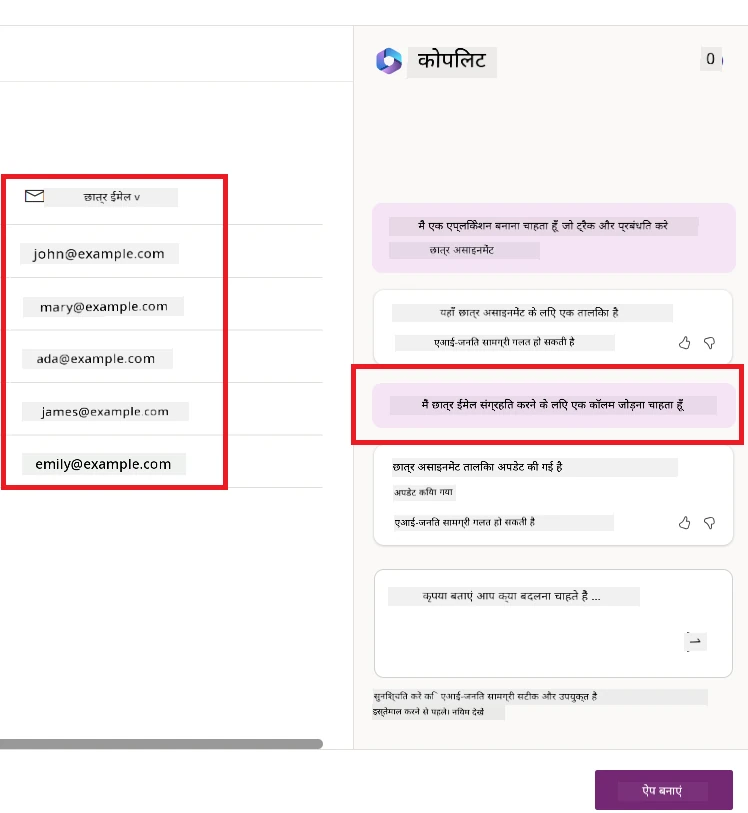

1. AI कापिलट एक नया फील्ड उत्पन्न करेगा और आप फिर अपनी आवश्यकताओं के अनुसार फील्ड को अनुकूलित कर सकते हैं।

1. एक बार जब आप तालिका के साथ काम पूरा कर लें, तो ऐप बनाने के लिए **Create app** बटन पर क्लिक करें।

1. AI Copilot आपके विवरण के आधार पर एक उत्तरदायी Canvas ऐप बनाएगा। आप फिर अपनी आवश्यकताओं के अनुसार ऐप को अनुकूलित कर सकते हैं।

1. शिक्षकों के लिए छात्रों को ईमेल भेजने के लिए, आप Copilot का उपयोग करके ऐप में एक नया स्क्रीन जोड़ सकते हैं। उदाहरण के लिए, आप ऐप में नया स्क्रीन जोड़ने के लिए निम्नलिखित प्रॉम्प्ट का उपयोग कर सकते हैं: **_I want to add a screen to send emails to students_**। AI Copilot को प्रॉम्प्ट भेजने के लिए **Send** बटन पर क्लिक करें।

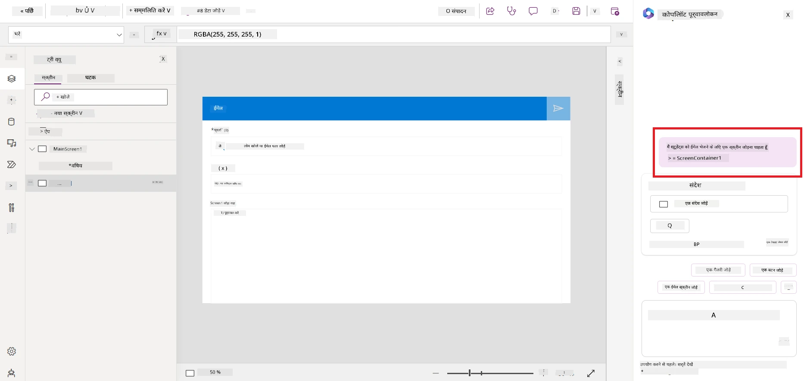

1. AI Copilot एक नया स्क्रीन बनाएगा और आप फिर अपनी आवश्यकताओं के अनुसार स्क्रीन को अनुकूलित कर सकते हैं।

1. एक बार जब आप ऐप के साथ काम पूरा कर लें, तो ऐप को सहेजने के लिए **Save** बटन पर क्लिक करें।

1. ऐप को शिक्षकों के साथ साझा करने के लिए, **Share** बटन पर क्लिक करें और फिर दोबारा **Share** बटन पर क्लिक करें। आप शिक्षकों के ईमेल पते दर्ज करके ऐप साझा कर सकते हैं।

> **आपका गृहकार्य**: आपने जो ऐप अभी बनाया है वह एक अच्छी शुरुआत है लेकिन इसे सुधारने की गुंजाइश है। ईमेल फीचर के साथ, शिक्षक केवल मैनुअल तरीके से छात्र को ईमेल भेज सकते हैं क्योंकि उन्हें छात्र के ईमेल टाइप करने पड़ते हैं। क्या आप Copilot का उपयोग करके ऐसा ऑटोमेशन बना सकते हैं जो टीचर्स को छात्रों को असाइनमेंट सबमिट करने पर स्वचालित रूप से ईमेल भेजने में सक्षम बनाए? आपका संकेत है कि सही प्रॉम्प्ट के साथ आप Power Automate में Copilot का उपयोग कर सकते हैं।

### हमारे स्टार्टअप के लिए इनवॉइस जानकारी तालिका बनाएँ

हमारे स्टार्टअप की फाइनेंस टीम इनवॉइस पर नजर रखने में संघर्ष कर रही है। वे इनवॉइस ट्रैक करने के लिए एक स्प्रेडशीट का उपयोग कर रहे थे लेकिन इनवॉयस की संख्या बढ़ने के कारण इसे प्रबंधित करना मुश्किल हो गया है। उन्होंने आपसे एक तालिका बनाने को कहा है जो उन्हें प्राप्त इनवॉयस की जानकारी को संग्रहित, ट्रैक और मैनेज करने में मदद करेगा। यह तालिका एक ऑटोमेशन बनाने के लिए उपयोग की जानी चाहिए जो सभी इनवॉइस की जानकारी निकाल कर तालिका में संग्रहित करेगा। तालिका फाइनेंस टीम को भुगतान हो चुके और भुगतान न हुए इनवॉइस देखने की अनुमति भी देनी चाहिए।

Power Platform में एक अंतर्निहित डेटा प्लेटफ़ॉर्म Dataverse है जो आपके ऐप्स और सोल्यूशंस के लिए डेटा संग्रहित करने का विकल्प देता है। Dataverse एक लो-कोड डेटा प्लेटफ़ॉर्म है जो ऐप के डेटा को संग्रहित करता है। यह Microsoft Cloud में सुरक्षित रूप से डेटा स्टोर करने वाली एक पूरी तरह प्रबंधित सेवा है और आपके Power Platform पर्यावरण के भीतर प्रावधानित है। इसमें अंतर्निहित डेटा गवर्नेंस क्षमताएँ हैं, जैसे डेटा वर्गीकरण, डेटा स्रोत, सूक्ष्म-ग्रेनुलर एक्सेस नियंत्रण, और अधिक। आप [Dataverse के बारे में अधिक यहां पढ़ सकते हैं](https://learn.microsoft.com/power-apps/maker/data-platform/data-platform-intro?WT.mc_id=academic-109639-somelezediko).

हमारे स्टार्टअप के लिए Dataverse क्यों उपयोग करना चाहिए? Dataverse के मानक और कस्टम तालिकाएँ आपके डेटा के लिए सुरक्षित और क्लाउड-आधारित संग्रहण का विकल्प प्रदान करती हैं। तालिकाएँ विभिन्न प्रकार के डेटा को संग्रहित करने की सुविधा देती हैं, जैसे कि आप एक Excel वर्कबुक में कई वर्कशीट का उपयोग करते हैं। आप तालिकाओं का उपयोग अपने संगठन या व्यवसाय की आवश्यकताओं के लिए विशिष्ट डेटा संग्रहित करने के लिए कर सकते हैं। हमारे स्टार्टअप को Dataverse उपयोग करने के निम्नलिखित लाभ मिलेंगे, जिनमें लेकिन सीमित नहीं हैं:

- **प्रबंधित करना आसान**: मेटाडेटा और डेटा दोनों क्लाउड में संग्रहित होते हैं, इसलिए आपको उनके संग्रह या प्रबंधन के विवरण की चिंता करने की आवश्यकता नहीं है। आप अपने ऐप्स और सोल्यूशंस बनाने पर ध्यान केंद्रित कर सकते हैं।

- **सुरक्षित**: Dataverse आपके डेटा के लिए एक सुरक्षित और क्लाउड-आधारित संग्रहण विकल्प प्रदान करता है। आप यह नियंत्रित कर सकते हैं कि आपकी तालिकाओं के डेटा तक किसका अधिकार है और वे इसे कैसे एक्सेस कर सकते हैं, भूमिका आधारित सुरक्षा का उपयोग करके।

- **समृद्ध मेटाडेटा**: Power Apps के भीतर सीधे डेटा प्रकार और संबंधों का उपयोग किया जाता है।

- **लॉजिक और सत्यापन**: आप व्यावसायिक नियमों, गणना किये गए फ़ील्ड, और सत्यापन नियमों का उपयोग करके व्यापार लॉजिक लागू कर सकते हैं और डेटा की सटीकता बनाए रख सकते हैं।

अब जब आप जानते हैं कि Dataverse क्या है और इसे क्यों उपयोग करना चाहिए, तो आइए देखें कि आप हमारी फाइनेंस टीम की आवश्यकताओं को पूरा करने के लिए Dataverse में Copilot का उपयोग करके तालिका कैसे बना सकते हैं।

> **ध्यान दें** : आप इस तालिका का अगले भाग में एक ऑटोमेशन बनाने के लिए उपयोग करेंगे जो सभी इनवॉइस की जानकारी निकालेगा और तालिका में संग्रहित करेगा।

Dataverse में Copilot का उपयोग करके तालिका बनाने के लिए नीचे दिए गए चरणों का पालन करें:

1. [Power Apps](https://make.powerapps.com?WT.mc_id=academic-105485-koreyst) होम स्क्रीन पर जाएँ।

2. बाएं नेविगेशन बार में, **Tables** चुनें और फिर **Describe the new Table** पर क्लिक करें।

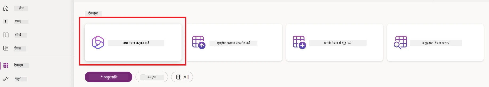

1. **Describe the new Table** स्क्रीन पर, उस तालिका का विवरण टेक्स्ट क्षेत्र में दें जिसे आप बनाना चाहते हैं। उदाहरण के लिए, **_I want to create a table to store invoice information_**। AI Copilot को प्रॉम्प्ट भेजने के लिए **Send** बटन पर क्लिक करें।

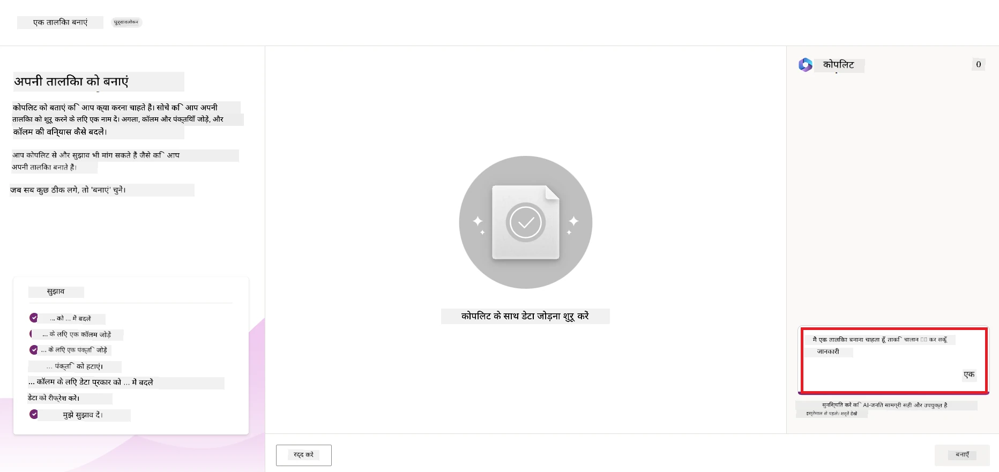

1. AI Copilot आपको एक Dataverse तालिका सुझाएगा जिसमें वे फ़ील्ड होंगे जिनमें आपको डेटा स्टोर करना है और कुछ नमूना डेटा होगा। आप AI Copilot सहायक फीचर के माध्यम से बातचीत के चरणों द्वारा तालिका को अपनी आवश्यकताओं के अनुसार अनुकूलित कर सकते हैं।

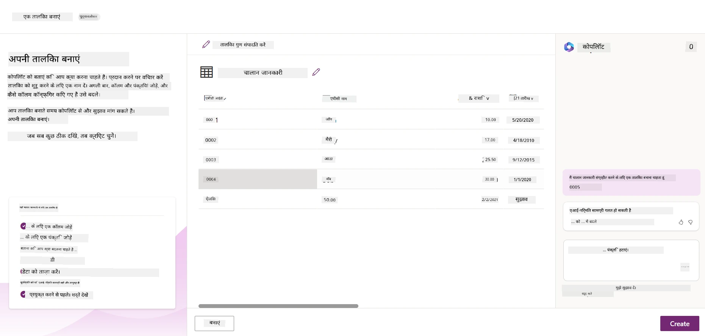

1. फाइनेंस टीम आपूर्तिकर्ता को उनकी इनवॉयस की वर्तमान स्थिति अपडेट करने के लिए ईमेल भेजना चाहती है। आप Copilot का उपयोग करके तालिका में एक नया फ़ील्ड जोड़ सकते हैं जहाँ आपूर्तिकर्ता का ईमेल संग्रहित किया जाएगा। उदाहरण के लिए, तालिका में नया कॉलम जोड़ने के लिए आप निम्नलिखित प्रॉम्प्ट का उपयोग कर सकते हैं: **_I want to add a column to store supplier email_**। AI Copilot को प्रॉम्प्ट भेजने के लिए **Send** बटन पर क्लिक करें।

1. AI Copilot एक नया फ़ील्ड बनाएगा और आप फिर अपनी आवश्यकताओं के अनुसार फ़ील्ड को अनुकूलित कर सकते हैं।

1. एक बार जब आप तालिका के साथ काम पूरा कर लें, तो तालिका बनाने के लिए **Create** बटन पर क्लिक करें।

## Power Platform में AI Models AI Builder के साथ

AI Builder Power Platform में उपलब्ध एक लो-कोड AI क्षमता है जो आपको AI मॉडल का उपयोग करने की अनुमति देता है ताकि आप प्रक्रियाओं को स्वचालित कर सकें और परिणामों की भविष्यवाणी कर सकें। AI Builder के साथ आप AI को अपने ऐप्स और फ्लोज़ में ला सकते हैं जो आपके डेटा से जुड़ते हैं, चाहे वह Dataverse में हो या विभिन्न क्लाउड डेटा स्रोतों जैसे SharePoint, OneDrive या Azure में हो।

## पूर्वनिर्मित AI मॉडल बनाम कस्टम AI मॉडल

AI Builder दो प्रकार के AI मॉडल प्रदान करता है: पूर्वनिर्मित AI मॉडल और कस्टम AI मॉडल। पूर्वनिर्मित AI मॉडल Microsoft द्वारा प्रशिक्षित तैयार-उपयोग AI मॉडल हैं जो Power Platform में उपलब्ध हैं। ये आपको बिना डेटा एकत्रित किये और अपने स्वयं के मॉडल बनाने, प्रशिक्षण देने और प्रकाशित करने के बिना आपके ऐप्स और फ्लोज़ में बुद्धिमत्ता जोड़ने में मदद करते हैं। आप इन मॉडलों का उपयोग प्रक्रियाओं को स्वचालित करने और परिणामों की भविष्यवाणी करने के लिए कर सकते हैं।

Power Platform में उपलब्ध कुछ पूर्वनिर्मित AI मॉडल में शामिल हैं:

- **Key Phrase Extraction**: यह मॉडल टेक्स्ट से मुख्य वाक्यांश निकालता है।
- **Language Detection**: यह मॉडल किसी टेक्स्ट की भाषा का पता लगाता है।
- **Sentiment Analysis**: यह मॉडल टेक्स्ट में सकारात्मक, नकारात्मक, तटस्थ, या मिश्रित भावना का पता लगाता है।
- **Business Card Reader**: यह मॉडल विज़िटिंग कार्ड से जानकारी निकालता है।
- **Text Recognition**: यह मॉडल छवियों से टेक्स्ट निकालता है।
- **Object Detection**: यह मॉडल छवियों से वस्तुओं का पता लगाता है और निकालता है।
- **Document processing**: यह मॉडल फॉर्म से जानकारी निकालता है।
- **Invoice Processing**: यह मॉडल इनवॉइस से जानकारी निकालता है।

कस्टम AI मॉडल के साथ आप अपना खुद का मॉडल AI Builder में ला सकते हैं ताकि यह किसी भी AI Builder कस्टम मॉडल की तरह कार्य कर सके, जिससे आप अपने स्वयं के डेटा के उपयोग से मॉडल को प्रशिक्षित कर सकते हैं। आप इन मॉडलों का उपयोग Power Apps और Power Automate दोनों में प्रक्रियाओं को स्वचालित करने और परिणामों की भविष्यवाणी करने के लिए कर सकते हैं। अपने मॉडल का उपयोग करते समय कुछ सीमाएँ लागू होती हैं। इन [सीमाओं](https://learn.microsoft.com/ai-builder/byo-model#limitations?WT.mc_id=academic-105485-koreyst) के बारे में अधिक पढ़ें।

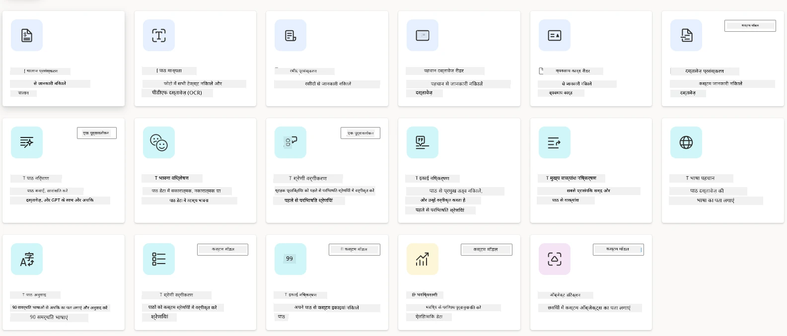

## असाइनमेंट #2 - हमारे स्टार्टअप के लिए इनवॉइस प्रोसेसिंग फ्लो बनाएं

फाइनेंस टीम इनवॉइस प्रक्रिया करने में संघर्ष कर रही है। वे इनवॉइस ट्रैक करने के लिए स्प्रेडशीट का उपयोग कर रहे थे, लेकिन इनवॉइस की संख्या बढ़ने के कारण इसे प्रबंधित करना मुश्किल हो गया है। उन्होंने आपसे एक वर्कफ़्लो बनाने को कहा है जो उन्हें AI का उपयोग करके इनवॉइस प्रक्रिया करने में मदद करेगा। वर्कफ़्लो उन्हें इनवॉइस से जानकारी निकालने और इसे Dataverse तालिका में संग्रहित करने में सक्षम बनाएगा। वर्कफ़्लो उन्हें निकाली गई जानकारी के साथ फाइनेंस टीम को ईमेल भेजने की भी अनुमति देगा।

अब जब आप जानते हैं कि AI Builder क्या है और इसे क्यों उपयोग करना चाहिए, आइए देखें कि कैसे आप पहले चर्चा किए गए Invoice Processing AI Model का उपयोग करके एक वर्कफ़्लो बना सकते हैं जो फाइनेंस टीम को इनवॉइस प्रोसेस करने में मदद करेगा।

Invoice Processing AI Model का उपयोग करके फाइनेंस टीम के लिए इनवॉइस प्रोसेसिंग वर्कफ़्लो बनाने के लिए नीचे दिए गए चरणों का पालन करें:

1. [Power Automate](https://make.powerautomate.com?WT.mc_id=academic-105485-koreyst) होम स्क्रीन पर जाएं।

2. होम स्क्रीन के टेक्स्ट क्षेत्र का उपयोग करके उस वर्कफ़्लो का वर्णन करें जिसे आप बनाना चाहते हैं। उदाहरण के लिए, **_Process an invoice when it arrives in my mailbox_**। AI Copilot को प्रॉम्प्ट भेजने के लिए **Send** बटन पर क्लिक करें।

   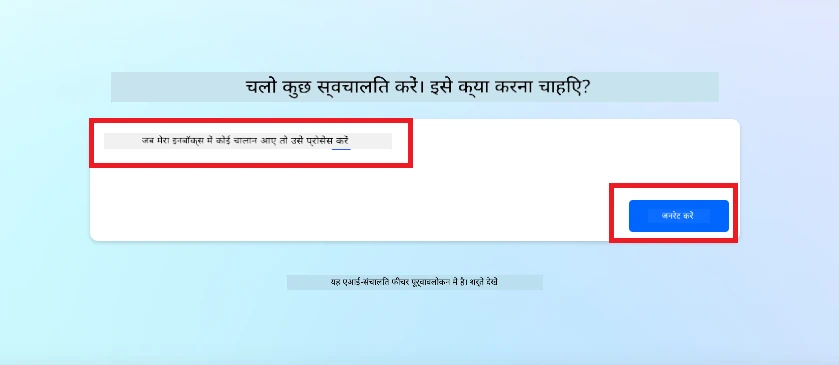

3. AI Copilot उन क्रियाओं का सुझाव देगा जिन्हें आपको स्वचालित करने के लिए करना होगा। आप अगले चरणों के लिए **Next** बटन पर क्लिक कर सकते हैं।

4. अगले चरण पर, Power Automate आपको फ्लो के लिए आवश्यक कनेक्शन सेटअप करने के लिए कहेगा। कार्य पूर्ण होने पर, फ्लो बनाने के लिए **Create flow** बटन पर क्लिक करें।

5. AI Copilot एक फ्लो बनाएगा और आप फिर अपनी आवश्यकताओं के अनुसार फ्लो को अनुकूलित कर सकते हैं।

6. फ्लो के ट्रिगर को अपडेट करें और **Folder** को उस फ़ोल्डर पर सेट करें जहाँ इनवॉइस स्टोर किए जाएँगे। उदाहरण के लिए, आप फ़ोल्डर को **Inbox** पर सेट कर सकते हैं। **Show advanced options** पर क्लिक करें और **Only with Attachments** को **Yes** पर सेट करें। यह सुनिश्चित करेगा कि फ्लो केवल तब ही चलता है जब उस फ़ोल्डर में अटैचमेंट के साथ कोई ईमेल आए।

7. फ्लो से निम्नलिखित क्रियाएँ हटाएँ: **HTML to text**, **Compose**, **Compose 2**, **Compose 3** और **Compose 4** क्योंकि आप उनका उपयोग नहीं करेंगे।

8. फ्लो से **Condition** क्रिया को हटाएँ क्योंकि आप इसका उपयोग नहीं करेंगे। यह स्क्रीनशॉट जैसा दिखना चाहिए:

   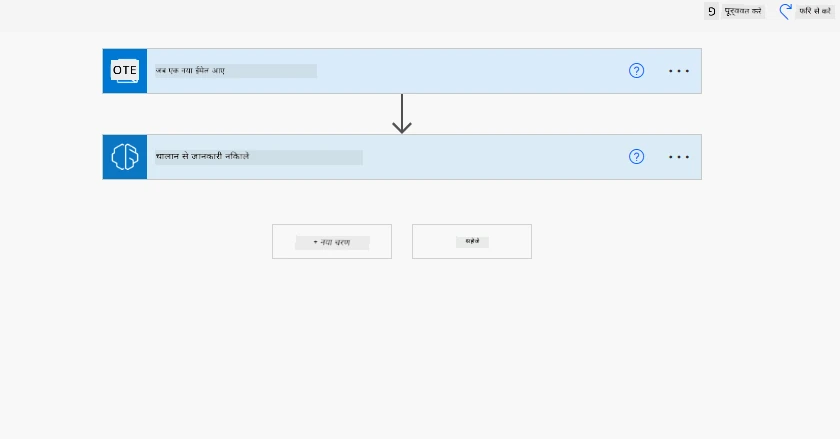

9. **Add an action** बटन पर क्लिक करें और **Dataverse** खोजें। **Add a new row** क्रिया चुनें।

10. **Extract Information from invoices** क्रिया पर, **Invoice File** को ईमेल से **Attachment Content** की ओर सेट करें। इससे फ्लो इनवॉइस अटैचमेंट से जानकारी निकालेगा।

11. पहले बनाई गई तालिका चुनें। उदाहरण के लिए, आप **Invoice Information** तालिका चुन सकते हैं। निम्न फ़ील्ड को भरने के लिए पिछले क्रिया की डायनामिक सामग्री चुनें:

    - ID
    - Amount
    - Date
    - Name
    - Status - **Status** को **Pending** पर सेट करें।
    - Supplier Email - **When a new email arrives** ट्रिगर से **From** डायनामिक कंटेंट का उपयोग करें।

    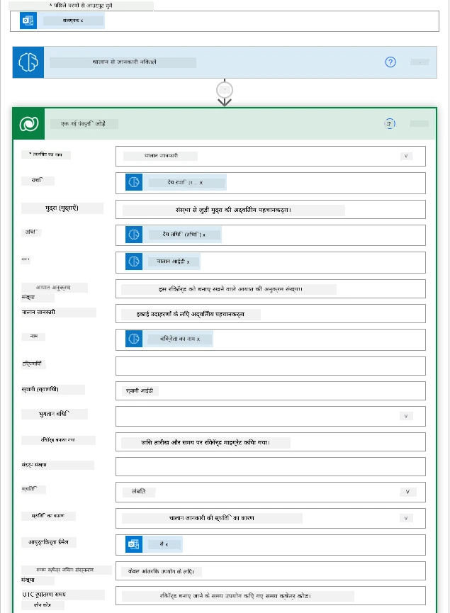

12. एक बार जब आप फ्लो के साथ काम पूरा कर लें, तो फ्लो को सहेजने के लिए **Save** बटन पर क्लिक करें। आप निर्धारित फ़ोल्डर में इनवॉइस के साथ ईमेल भेज कर फ्लो का परीक्षण कर सकते हैं।

> **आपका गृहकार्य**: आपने जो फ्लो अभी बनाया है वह एक अच्छी शुरुआत है, अब आपको यह सोचना है कि आप ऐसा ऑटोमेशन कैसे बना सकते हैं जो फाइनेंस टीम को आपूर्तिकर्ता को उनकी इनवॉइस की वर्तमान स्थिति अपडेट करने के लिए ईमेल भेजने में सक्षम बनाए। आपका संकेत: फ्लो उस समय चलना चाहिए जब इनवॉइस की स्थिति बदलती है।

## Power Automate में टेक्स्ट जनरेशन AI मॉडल का उपयोग करें

AI Builder का Create Text with GPT AI मॉडल आपको प्रॉम्प्ट के आधार पर टेक्स्ट जनरेट करने में सक्षम बनाता है और इसे Microsoft Azure OpenAI सर्विस द्वारा संचालित किया जाता है। इस क्षमता के साथ, आप GPT (Generative Pre-Trained Transformer) तकनीक को अपने ऐप्स और फ्लोज़ में शामिल कर सकते हैं और विभिन्न प्रकार के स्वचालित फ्लो और सूचनात्मक एप्लिकेशन बना सकते हैं।

GPT मॉडल व्यापक मात्रा में डेटा पर व्यापक प्रशिक्षण प्राप्त करते हैं, जिससे वे एक प्रॉम्प्ट मिलने पर मानव भाषा के समान टेक्स्ट उत्पन्न कर सकते हैं। वर्कफ़्लो ऑटोमेशन के साथ समेकित होने पर, GPT जैसे AI मॉडल विभिन्न कार्यों को सुव्यवस्थित और स्वचालित करने में उपयोग किए जा सकते हैं।

उदाहरण के लिए, आप कई उपयोग मामलों के लिए स्वचालित रूप से टेक्स्ट उत्पन्न करने वाले फ्लोज़ बना सकते हैं, जैसे: ईमेल ड्राफ्ट, उत्पाद विवरण, और अधिक। आप इस मॉडल का उपयोग विभिन्न ऐप्स के लिए भी कर सकते हैं, जैसे चैटबॉट और ग्राहक सेवा ऐप्स जो ग्राहक सेवा एजेंट्स को तेजी से और कुशलता से ग्राहक पूछताछों का जवाब देने में सक्षम बनाते हैं।

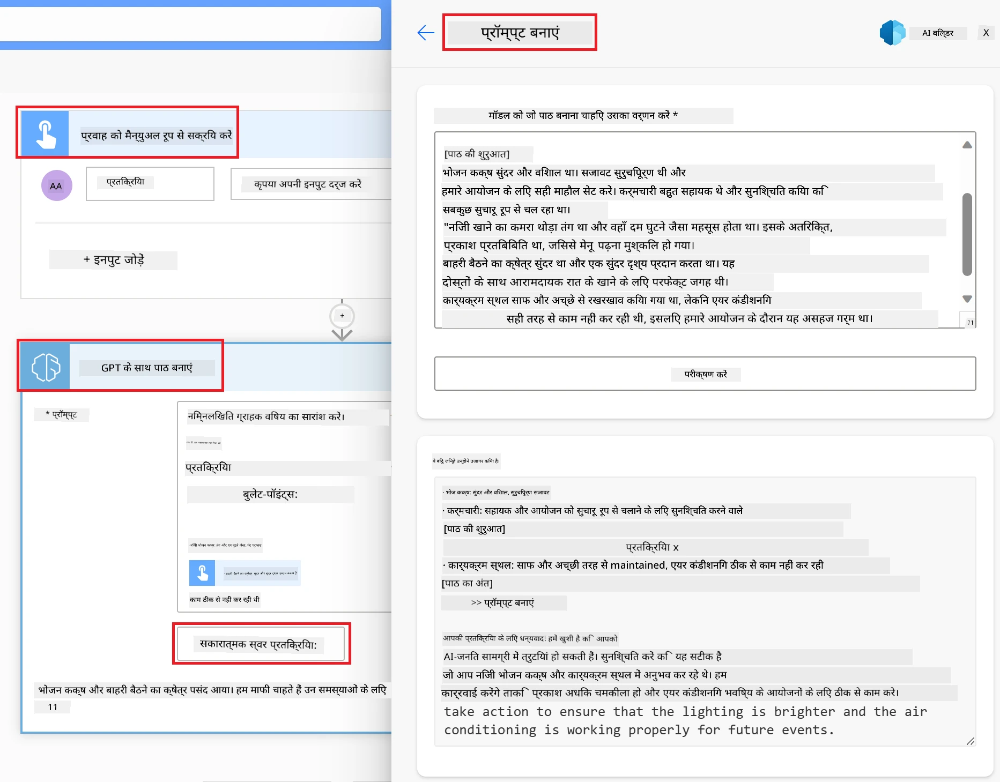

Power Automate में इस AI मॉडल का उपयोग कैसे करें, यह सीखने के लिए, [Add intelligence with AI Builder and GPT](https://learn.microsoft.com/training/modules/ai-builder-text-generation/?WT.mc_id=academic-109639-somelezediko) मॉड्यूल देखें।

## शानदार काम! अपनी सीख जारी रखें

इस पाठ को पूरा करने के बाद, हमारे [Generative AI Learning collection](https://aka.ms/genai-collection?WT.mc_id=academic-105485-koreyst) को देखें ताकि आप अपनी Generative AI ज्ञान को और बढ़ा सकें!

Copilot को वैयक्तिकृत करना चाहते हैं और इससे अधिक लाभ उठाना चाहते हैं? [Awesome Copilot](https://github.com/github/awesome-copilot?WT.mc_id=academic-105485-koreyst) देखें — निर्देशों, एजेंट्स, कौशलों, और कॉन्फ़िगरेशन का एक समुदाय द्वारा योगदान किया गया संग्रह जो आपको GitHub Copilot का अधिकतम उपयोग करने में मदद करता है।

पाठ 11 पर जाएं जहां हम देखेंगे कि [Function Calling के साथ Generative AI को कैसे एकीकृत किया जाए](../11-integrating-with-function-calling/README.md?WT.mc_id=academic-105485-koreyst)!

---

<!-- CO-OP TRANSLATOR DISCLAIMER START -->
**अस्वीकरण**:
इस दस्तावेज़ का अनुवाद AI अनुवाद सेवा [Co-op Translator](https://github.com/Azure/co-op-translator) का उपयोग करके किया गया है। जबकि हम सटीकता के लिए प्रयास करते हैं, कृपया ध्यान दें कि स्वचालित अनुवादों में त्रुटियाँ या अशुद्धियाँ हो सकती हैं। मूल दस्तावेज़ अपनी मूल भाषा में ही प्रामाणिक स्रोत माना जाना चाहिए। महत्वपूर्ण जानकारी के लिए, पेशेवर मानव अनुवाद की सिफारिश की जाती है। इस अनुवाद के उपयोग से उत्पन्न किसी भी गलतफहमी या गलत व्याख्या के लिए हम उत्तरदायी नहीं हैं।
<!-- CO-OP TRANSLATOR DISCLAIMER END -->