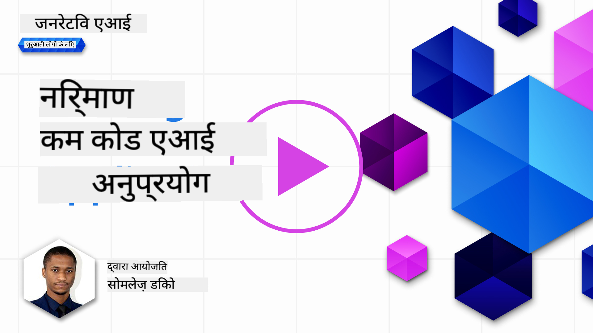
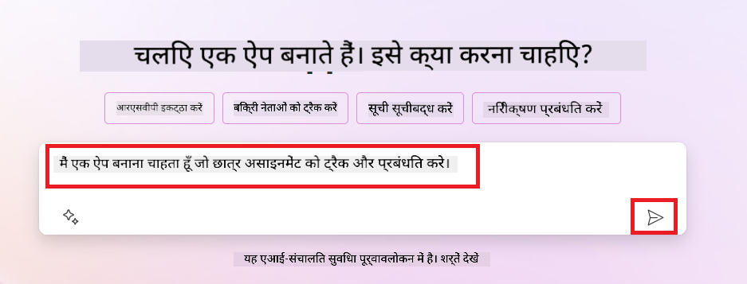
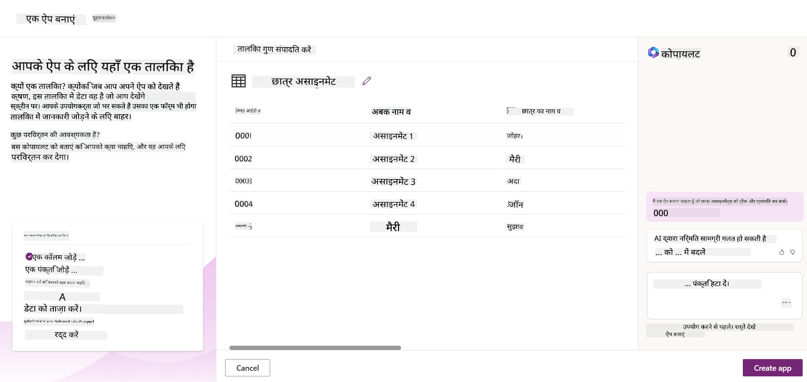
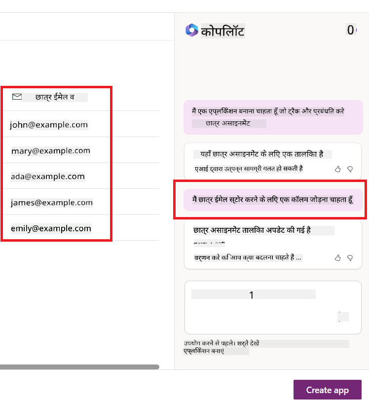
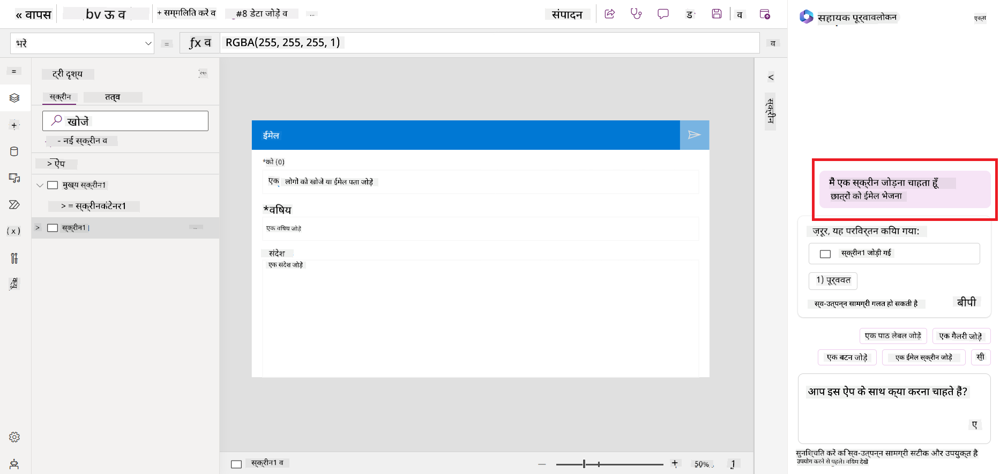

<!--
CO_OP_TRANSLATOR_METADATA:
{
  "original_hash": "f5ff3b6204a695a117d6f452403c95f7",
  "translation_date": "2025-06-25T18:18:36+00:00",
  "source_file": "10-building-low-code-ai-applications/README.md",
  "language_code": "hi"
}
-->
# लो कोड एआई एप्लिकेशन बनाना

> _(इस पाठ का वीडियो देखने के लिए ऊपर दी गई छवि पर क्लिक करें)_

## परिचय

अब जब हमने इमेज जेनरेटिंग एप्लिकेशन बनाना सीख लिया है, तो आइए लो कोड के बारे में बात करते हैं। जेनरेटिव एआई का उपयोग विभिन्न क्षेत्रों में किया जा सकता है, जिसमें लो कोड भी शामिल है, लेकिन लो कोड क्या है और हम इसमें एआई कैसे जोड़ सकते हैं?

लो कोड डेवलपमेंट प्लेटफॉर्म के उपयोग से पारंपरिक डेवलपर्स और गैर-डेवलपर्स के लिए ऐप्स और समाधान बनाना आसान हो गया है। लो कोड डेवलपमेंट प्लेटफॉर्म आपको कम या बिना कोड के ऐप्स और समाधान बनाने की सुविधा देता है। यह एक विजुअल डेवलपमेंट वातावरण प्रदान करके हासिल किया जाता है जो आपको ऐप्स और समाधान बनाने के लिए घटकों को ड्रैग और ड्रॉप करने की सुविधा देता है। यह आपको कम संसाधनों के साथ तेजी से ऐप्स और समाधान बनाने की सुविधा देता है। इस पाठ में, हम यह जानेंगे कि लो कोड का उपयोग कैसे करें और पावर प्लेटफॉर्म का उपयोग करके एआई के साथ लो कोड विकास को कैसे बढ़ाया जा सकता है।

पावर प्लेटफॉर्म संगठनों को उनके टीमों को एक सहज लो-कोड या नो-कोड वातावरण के माध्यम से अपने स्वयं के समाधान बनाने का अवसर प्रदान करता है। यह वातावरण समाधान बनाने की प्रक्रिया को सरल बनाने में मदद करता है। पावर प्लेटफॉर्म के साथ, समाधान महीनों या वर्षों के बजाय दिनों या हफ्तों में बनाए जा सकते हैं। पावर प्लेटफॉर्म में पांच प्रमुख उत्पाद होते हैं: पावर ऐप्स, पावर ऑटोमेट, पावर बीआई, पावर पेजेस और कोपायलट स्टूडियो।

इस पाठ में शामिल हैं:

- पावर प्लेटफॉर्म में जेनरेटिव एआई का परिचय
- कोपायलट का परिचय और इसका उपयोग कैसे करें
- पावर प्लेटफॉर्म में ऐप्स और फ्लो बनाने के लिए जेनरेटिव एआई का उपयोग करना
- एआई बिल्डर के साथ पावर प्लेटफॉर्म में एआई मॉडल को समझना

## सीखने के लक्ष्य

इस पाठ के अंत तक, आप सक्षम होंगे:

- समझें कि पावर प्लेटफॉर्म में कोपायलट कैसे काम करता है।

- हमारे शिक्षा स्टार्टअप के लिए एक स्टूडेंट असाइनमेंट ट्रैकर ऐप बनाएं।

- एक इनवॉइस प्रोसेसिंग फ्लो बनाएं जो एआई का उपयोग करके इनवॉइस से जानकारी निकालता है।

- GPT एआई मॉडल के साथ टेक्स्ट बनाने का उपयोग करते समय सर्वोत्तम प्रथाओं को लागू करें।

इस पाठ में आप जिन उपकरणों और तकनीकों का उपयोग करेंगे वे हैं:

- **पावर ऐप्स**, स्टूडेंट असाइनमेंट ट्रैकर ऐप के लिए, जो डेटा को ट्रैक, प्रबंधित और इंटरैक्ट करने के लिए ऐप्स बनाने के लिए लो-कोड डेवलपमेंट वातावरण प्रदान करता है।

- **डेटावर्स**, स्टूडेंट असाइनमेंट ट्रैकर ऐप के लिए डेटा संग्रहीत करने के लिए जहां डेटावर्स ऐप के डेटा को संग्रहीत करने के लिए लो-कोड डेटा प्लेटफॉर्म प्रदान करेगा।

- **पावर ऑटोमेट**, इनवॉइस प्रोसेसिंग फ्लो के लिए जहां आपके पास इनवॉइस प्रोसेसिंग प्रक्रिया को स्वचालित करने के लिए वर्कफ़्लो बनाने के लिए लो-कोड डेवलपमेंट वातावरण होगा।

- **एआई बिल्डर**, इनवॉइस प्रोसेसिंग एआई मॉडल के लिए जहां आप हमारे स्टार्टअप के लिए इनवॉइस प्रोसेस करने के लिए प्रीबिल्ट एआई मॉडल का उपयोग करेंगे।

## पावर प्लेटफॉर्म में जेनरेटिव एआई

लो-कोड विकास और एप्लिकेशन को जेनरेटिव एआई के साथ बढ़ाना पावर प्लेटफॉर्म के लिए एक प्रमुख फोकस क्षेत्र है। लक्ष्य है कि हर कोई एआई-संचालित ऐप्स, साइट्स, डैशबोर्ड और एआई के साथ प्रक्रियाओं को स्वचालित कर सके, _बिना किसी डेटा साइंस विशेषज्ञता की आवश्यकता के_। यह लक्ष्य पावर प्लेटफॉर्म में लो-कोड डेवलपमेंट अनुभव में कोपायलट और एआई बिल्डर के रूप में जेनरेटिव एआई को एकीकृत करके प्राप्त किया जाता है।

### यह कैसे काम करता है?

कोपायलट एक एआई सहायक है जो आपको प्राकृतिक भाषा का उपयोग करके संवादात्मक चरणों की एक श्रृंखला में अपनी आवश्यकताओं का वर्णन करके पावर प्लेटफॉर्म समाधान बनाने में सक्षम बनाता है। उदाहरण के लिए, आप अपने एआई सहायक को बता सकते हैं कि आपका ऐप किन क्षेत्रों का उपयोग करेगा और यह ऐप और अंतर्निहित डेटा मॉडल दोनों बनाएगा या आप पावर ऑटोमेट में फ्लो सेटअप करने का तरीका निर्दिष्ट कर सकते हैं।

आप अपने ऐप स्क्रीन में एक फीचर के रूप में कोपायलट संचालित कार्यक्षमताओं का उपयोग कर सकते हैं ताकि उपयोगकर्ता संवादात्मक इंटरैक्शन के माध्यम से अंतर्दृष्टि प्राप्त कर सकें।

एआई बिल्डर पावर प्लेटफॉर्म में उपलब्ध एक लो-कोड एआई क्षमता है जो आपको प्रक्रियाओं को स्वचालित करने और परिणामों की भविष्यवाणी करने में मदद करने के लिए एआई मॉडल का उपयोग करने में सक्षम बनाता है। एआई बिल्डर के साथ आप अपने ऐप्स और फ्लो में एआई ला सकते हैं जो डेटावर्स या विभिन्न क्लाउड डेटा स्रोतों, जैसे कि SharePoint, OneDrive या Azure में आपके डेटा से जुड़ते हैं।

कोपायलट सभी पावर प्लेटफॉर्म उत्पादों में उपलब्ध है: पावर ऐप्स, पावर ऑटोमेट, पावर बीआई, पावर पेजेस और पावर वर्चुअल एजेंट्स। एआई बिल्डर पावर ऐप्स और पावर ऑटोमेट में उपलब्ध है। इस पाठ में, हम पावर ऐप्स और पावर ऑटोमेट में कोपायलट और एआई बिल्डर का उपयोग करके हमारे शिक्षा स्टार्टअप के लिए एक समाधान बनाने पर ध्यान केंद्रित करेंगे।

### पावर ऐप्स में कोपायलट

पावर प्लेटफॉर्म के हिस्से के रूप में, पावर ऐप्स डेटा को ट्रैक, प्रबंधित और इंटरैक्ट करने के लिए ऐप्स बनाने के लिए लो-कोड डेवलपमेंट वातावरण प्रदान करता है। यह ऐप डेवलपमेंट सेवाओं का एक सूट है जिसमें एक स्केलेबल डेटा प्लेटफॉर्म और क्लाउड सेवाओं और ऑन-प्रिमाइसेस डेटा से कनेक्ट करने की क्षमता है। पावर ऐप्स आपको ऐप्स बनाने की अनुमति देता है जो ब्राउज़र, टैबलेट और फोन पर चलते हैं, और सहकर्मियों के साथ साझा किए जा सकते हैं। पावर ऐप्स एक सरल इंटरफ़ेस के साथ उपयोगकर्ताओं को ऐप डेवलपमेंट में आसानी प्रदान करता है, ताकि हर व्यवसाय उपयोगकर्ता या प्रो डेवलपर कस्टम ऐप्स बना सके। ऐप डेवलपमेंट अनुभव को भी कोपायलट के माध्यम से जेनरेटिव एआई के साथ बढ़ाया गया है।

पावर ऐप्स में कोपायलट एआई सहायक फीचर आपको यह वर्णन करने में सक्षम बनाता है कि आपको किस प्रकार का ऐप चाहिए और आपका ऐप किस जानकारी को ट्रैक, एकत्र या दिखाना चाहता है। कोपायलट तब आपके विवरण के आधार पर एक उत्तरदायी कैनवास ऐप उत्पन्न करता है। आप फिर ऐप को अपनी आवश्यकताओं के अनुसार अनुकूलित कर सकते हैं। एआई कोपायलट आपके द्वारा ट्रैक करना चाहते हैं डेटा को संग्रहीत करने के लिए आवश्यक फ़ील्ड के साथ एक डेटावर्स टेबल भी उत्पन्न करता है और कुछ नमूना डेटा का सुझाव देता है। हम इस पाठ में बाद में देखेंगे कि डेटावर्स क्या है और आप इसे पावर ऐप्स में कैसे उपयोग कर सकते हैं। आप फिर AI कोपायलट सहायक फीचर का उपयोग करके संवादात्मक चरणों के माध्यम से तालिका को अपनी आवश्यकताओं के अनुसार अनुकूलित कर सकते हैं। यह फीचर पावर ऐप्स होम स्क्रीन से आसानी से उपलब्ध है।

### पावर ऑटोमेट में कोपायलट

पावर प्लेटफॉर्म के हिस्से के रूप में, पावर ऑटोमेट उपयोगकर्ताओं को एप्लिकेशन और सेवाओं के बीच स्वचालित वर्कफ़्लो बनाने देता है। यह संचार, डेटा संग्रह और निर्णय अनुमोदन जैसी पुनरावृत्ति व्यापार प्रक्रियाओं को स्वचालित करने में मदद करता है। इसका सरल इंटरफ़ेस उपयोगकर्ताओं को हर तकनीकी क्षमता (शुरुआती से लेकर अनुभवी डेवलपर्स तक) कार्य कार्यों को स्वचालित करने की अनुमति देता है। वर्कफ़्लो डेवलपमेंट अनुभव को भी कोपायलट के माध्यम से जेनरेटिव एआई के साथ बढ़ाया गया है।

पावर ऑटोमेट में कोपायलट एआई सहायक फीचर आपको यह वर्णन करने में सक्षम बनाता है कि आपको किस प्रकार का फ्लो चाहिए और आपका फ्लो किन कार्यों को करना चाहता है। कोपायलट तब आपके विवरण के आधार पर एक फ्लो उत्पन्न करता है। आप फिर फ्लो को अपनी आवश्यकताओं के अनुसार अनुकूलित कर सकते हैं। एआई कोपायलट आपके द्वारा स्वचालित करना चाहते हैं कार्य को करने के लिए आवश्यक कार्यों का सुझाव भी देता है। हम इस पाठ में बाद में देखेंगे कि फ्लो क्या हैं और आप उन्हें पावर ऑटोमेट में कैसे उपयोग कर सकते हैं। आप फिर AI कोपायलट सहायक फीचर का उपयोग करके संवादात्मक चरणों के माध्यम से कार्यों को अपनी आवश्यकताओं के अनुसार अनुकूलित कर सकते हैं। यह फीचर पावर ऑटोमेट होम स्क्रीन से आसानी से उपलब्ध है।

## असाइनमेंट: हमारे स्टार्टअप के लिए छात्र असाइनमेंट और इनवॉइस का प्रबंधन करें, कोपायलट का उपयोग करके

हमारा स्टार्टअप छात्रों को ऑनलाइन पाठ्यक्रम प्रदान करता है। स्टार्टअप तेजी से बढ़ गया है और अब अपने पाठ्यक्रमों की मांग को पूरा करने के लिए संघर्ष कर रहा है। स्टार्टअप ने आपको एक पावर प्लेटफॉर्म डेवलपर के रूप में नियुक्त किया है ताकि वे छात्र असाइनमेंट और इनवॉइस का प्रबंधन करने के लिए लो कोड समाधान बनाने में मदद कर सकें। उनका समाधान उन्हें ऐप के माध्यम से छात्र असाइनमेंट को ट्रैक और प्रबंधित करने और एक वर्कफ़्लो के माध्यम से इनवॉइस प्रोसेसिंग प्रक्रिया को स्वचालित करने में सक्षम होना चाहिए। आपसे कहा गया है कि आप समाधान विकसित करने के लिए जेनरेटिव एआई का उपयोग करें।

जब आप कोपायलट का उपयोग करना शुरू कर रहे हैं, तो आप [पावर प्लेटफॉर्म कोपायलट प्रॉम्प्ट लाइब्रेरी](https://github.com/pnp/powerplatform-prompts?WT.mc_id=academic-109639-somelezediko) का उपयोग प्रॉम्प्ट्स के साथ शुरू करने के लिए कर सकते हैं। इस लाइब्रेरी में एक सूची है जिसे आप कोपायलट के साथ ऐप्स और फ्लो बनाने के लिए उपयोग कर सकते हैं। आप लाइब्रेरी में प्रॉम्प्ट्स का उपयोग यह समझने के लिए भी कर सकते हैं कि कोपायलट को अपनी आवश्यकताओं का वर्णन कैसे करना है।

### हमारे स्टार्टअप के लिए छात्र असाइनमेंट ट्रैकर ऐप बनाएं

हमारे स्टार्टअप के शिक्षक छात्र असाइनमेंट को ट्रैक करने में संघर्ष कर रहे हैं। वे असाइनमेंट को ट्रैक करने के लिए एक स्प्रेडशीट का उपयोग कर रहे हैं, लेकिन छात्रों की संख्या बढ़ने के साथ इसे प्रबंधित करना मुश्किल हो गया है। उन्होंने आपसे एक ऐप बनाने के लिए कहा है जो उन्हें छात्र असाइनमेंट को ट्रैक और प्रबंधित करने में मदद करेगा। ऐप उन्हें नए असाइनमेंट जोड़ने, असाइनमेंट देखने, असाइनमेंट अपडेट करने और असाइनमेंट हटाने की सुविधा प्रदान करना चाहिए। ऐप शिक्षकों और छात्रों को ग्रेडेड और गैर-ग्रेडेड असाइनमेंट देखने की सुविधा भी प्रदान करना चाहिए।

आप नीचे दिए गए चरणों का पालन करते हुए पावर ऐप्स में कोपायलट का उपयोग करके ऐप बनाएंगे:

1. [पावर ऐप्स](https://make.powerapps.com?WT.mc_id=academic-105485-koreyst) होम स्क्रीन पर जाएं।

1. होम स्क्रीन पर टेक्स्ट क्षेत्र का उपयोग करके उस ऐप का वर्णन करें जिसे आप बनाना चाहते हैं। उदाहरण के लिए, **_मैं एक ऐप बनाना चाहता हूं जो छात्र असाइनमेंट को ट्रैक और प्रबंधित करे_**। प्रॉम्प्ट को एआई कोपायलट को भेजने के लिए **Send** बटन पर क्लिक करें।

1. एआई कोपायलट आपके द्वारा ट्रैक करना चाहते हैं डेटा को संग्रहीत करने के लिए आवश्यक फ़ील्ड के साथ एक डेटावर्स टेबल और कुछ नमूना डेटा का सुझाव देगा। आप फिर AI कोपायलट सहायक फीचर का उपयोग करके संवादात्मक चरणों के माध्यम से तालिका को अपनी आवश्यकताओं के अनुसार अनुकूलित कर सकते हैं।

   > **महत्वपूर्ण**: डेटावर्स पावर प्लेटफॉर्म के लिए अंतर्निहित डेटा प्लेटफॉर्म है। यह ऐप के डेटा को संग्रहीत करने के लिए एक लो-कोड डेटा प्लेटफॉर्म है। यह एक पूर्ण प्रबंधित सेवा है जो Microsoft Cloud में सुरक्षित रूप से डेटा संग्रहीत करती है और आपके पावर प्लेटफॉर्म वातावरण के भीतर प्रोविजन की जाती है। इसमें डेटा वर्गीकरण, डेटा वंशावली, सूक्ष्म पहुँच नियंत्रण और अधिक जैसी अंतर्निहित डेटा शासन क्षमताएं हैं। आप डेटावर्स के बारे में अधिक [यहां](https://docs.microsoft.com/powerapps/maker/data-platform/data-platform-intro?WT.mc_id=academic-109639-somelezediko) जान सकते हैं।

   

1. शिक्षक उन छात्रों को ईमेल भेजना चाहते हैं जिन्होंने अपने असाइनमेंट जमा कर दिए हैं ताकि उन्हें उनके असाइनमेंट की प्रगति पर अपडेट रखा जा सके। आप छात्र ईमेल संग्रहीत करने के लिए तालिका में एक नया फ़ील्ड जोड़ने के लिए कोपायलट का उपयोग कर सकते हैं। उदाहरण के लिए, आप तालिका में एक नया फ़ील्ड जोड़ने के लिए निम्न प्रॉम्प्ट का उपयोग कर सकते हैं: **_मैं छात्र ईमेल संग्रहीत करने के लिए एक कॉलम जोड़ना चाहता हूं_**। प्रॉम्प्ट को एआई कोपायलट को भेजने के लिए **Send** बटन पर क्लिक करें।

1. एआई कोपायलट एक नया फ़ील्ड उत्पन्न करेगा और आप फिर फ़ील्ड को अपनी आवश्यकताओं के अनुसार अनुकूलित कर सकते हैं।

1. तालिका के साथ समाप्त होने पर, ऐप बनाने के लिए **Create app** बटन पर क्लिक करें।

1. एआई कोपायलट आपके विवरण के आधार पर एक उत्तरदायी कैनवास ऐप उत्पन्न करेगा। आप फिर ऐप को अपनी आवश्यकताओं के अनुसार अनुकूलित कर सकते हैं।

1. शिक्षकों को छात्रों को ईमेल भेजने के लिए, आप ऐप में एक नई स्क्रीन जोड़ने के लिए कोपायलट का उपयोग कर सकते हैं। उदाहरण के लिए, आप ऐप में एक नई स्क्रीन जोड़ने के लिए निम्न प्रॉम्प्ट का उपयोग कर सकते हैं: **_मैं छात्रों को ईमेल भेजने के लिए एक स्क्रीन जोड़ना चाहता हूं_**। प्रॉम्प्ट को एआई कोपायलट को भेजने के लिए **Send** बटन पर क्लिक करें।

1. एआई कोपायलट एक नई स्क्रीन उत्पन्न करेगा और आप फिर स्क्रीन को अपनी आवश्यकताओं के अनुसार अनुकूलित कर सकते हैं।

1. ऐप के साथ समाप्त होने पर, ऐप को सहेजने के लिए **Save** बटन पर क्लिक करें।

1. शिक्षकों के साथ ऐप साझा करने के लिए, **Share** बटन पर क्लिक करें और फिर **Share** बटन पर फिर से क्लिक करें। आप फिर शिक्षकों के ईमेल पते दर्ज करके ऐप साझा कर सकते हैं।

> **आपका होमवर्क**: आपने जो ऐप अभी बनाया है वह एक अच्छी शुरुआत है लेकिन इसे बेहतर बनाया जा सकता है। ईमेल फीचर के साथ, शिक्षक केवल छात्रों को मैन्युअल रूप से उनके ईमेल टाइप करके ही ईमेल भेज सकते हैं। क्या आप कोपायलट का उपयोग करके एक स्वचालन बना सकते हैं जो शिक्षकों को उनके असाइनमेंट जमा करने पर छात्रों को स्वचालित रूप से ईमेल भेजने की अनुमति देगा? आपका संकेत सही प्रॉम्प्ट के साथ है आप पावर ऑटोमेट में कोपायलट का उपयोग करके इसे बना सकते हैं।

### हमारे स्टार्टअप के लिए इनवॉइस जानकारी तालिका बनाएं

हमारे स्टार्टअप की वित्त टीम इनवॉइस को ट्रैक करने में संघर्ष कर रही है। वे इनवॉइस को ट्रैक करने के लिए एक स्प्रेडशीट का उपयोग कर रहे हैं, लेकिन इनवॉइस की संख्या बढ़ने के साथ इसे प्रबंधित करना मुश्किल हो गया है। उन्होंने आपसे एक तालिका बनाने के लिए कहा है जो उन्हें प्राप्त इनवॉइस की जानकारी को संग्रहीत, ट्रैक और प्रबंधित करने में मदद करेगी। तालिका का उपयोग एक स्वचालन बनाने के लिए किया जाना चाहिए जो सभी इनवॉइस जानकारी को निकालकर तालिका में संग्रहीत करेगा। तालिका वित्त टीम को भुगतान किए गए और गैर-भुगतान किए गए इनवॉइस देखने की सुविधा भी प्रदान करनी चाहिए।

पावर प्लेटफॉर्म में डेटावर्स नामक एक अंतर्निहित डेटा प्लेटफॉर्म है जो आपको आपके ऐप्स और समाधान के लिए डेटा संग्रहीत करने में सक्षम बनाता है। डेटावर्स ऐप के डेटा को संग्रहीत करने के लिए एक लो-कोड डेटा प्लेटफॉर्म प्रदान करता है। यह एक पूर्ण प्रबंधित सेवा है जो Microsoft Cloud में सुरक्षित रूप से डेटा संग्रहीत करती है और आपके पावर
- **भावना विश्लेषण**: यह मॉडल पाठ में सकारात्मक, नकारात्मक, तटस्थ, या मिश्रित भावनाओं का पता लगाता है।  
- **बिजनेस कार्ड रीडर**: यह मॉडल बिजनेस कार्ड से जानकारी निकालता है।  
- **पाठ पहचान**: यह मॉडल छवियों से पाठ निकालता है।  
- **वस्तु पहचान**: यह मॉडल छवियों से वस्तुओं का पता लगाता है और निकालता है।  
- **दस्तावेज़ प्रसंस्करण**: यह मॉडल प्रपत्रों से जानकारी निकालता है।  
- **चालान प्रसंस्करण**: यह मॉडल चालानों से जानकारी निकालता है।  

कस्टम एआई मॉडल्स के साथ, आप अपना खुद का मॉडल एआई बिल्डर में ला सकते हैं ताकि यह किसी भी एआई बिल्डर कस्टम मॉडल की तरह कार्य कर सके, जिससे आप अपने डेटा का उपयोग करके मॉडल को प्रशिक्षित कर सकते हैं। आप इन मॉडलों का उपयोग प्रक्रियाओं को स्वचालित करने और दोनों पावर ऐप्स और पावर ऑटोमेट में परिणामों की भविष्यवाणी करने के लिए कर सकते हैं। अपने स्वयं के मॉडल का उपयोग करते समय कुछ सीमाएँ लागू होती हैं। इन [सीमाओं](https://learn.microsoft.com/ai-builder/byo-model#limitations?WT.mc_id=academic-105485-koreyst) के बारे में और पढ़ें।  

## असाइनमेंट #2 - हमारे स्टार्टअप के लिए एक चालान प्रसंस्करण प्रवाह बनाएं  

वित्त टीम को चालानों को संसाधित करने में कठिनाई हो रही है। वे चालानों को ट्रैक करने के लिए एक स्प्रेडशीट का उपयोग कर रहे हैं, लेकिन जैसे-जैसे चालानों की संख्या बढ़ी है, इसे प्रबंधित करना मुश्किल हो गया है। उन्होंने आपसे एक वर्कफ़्लो बनाने के लिए कहा है जो उन्हें एआई का उपयोग करके चालानों को संसाधित करने में मदद करेगा। वर्कफ़्लो उन्हें चालानों से जानकारी निकालने और जानकारी को एक डेटावर्स तालिका में संग्रहीत करने में सक्षम बनाना चाहिए। वर्कफ़्लो उन्हें निकाली गई जानकारी के साथ वित्त टीम को एक ईमेल भेजने में भी सक्षम बनाना चाहिए।  

अब जब आप जानते हैं कि एआई बिल्डर क्या है और आपको इसका उपयोग क्यों करना चाहिए, आइए देखें कि आप एआई बिल्डर में चालान प्रसंस्करण एआई मॉडल का उपयोग करके एक वर्कफ़्लो कैसे बना सकते हैं, जो हमने पहले कवर किया था, ताकि वित्त टीम को चालानों को संसाधित करने में मदद मिल सके। एआई बिल्डर में चालान प्रसंस्करण एआई मॉडल का उपयोग करके वित्त टीम को चालानों को संसाधित करने में मदद करने के लिए वर्कफ़्लो बनाने के लिए, नीचे दिए गए चरणों का पालन करें:  

1. [पावर ऑटोमेट](https://make.powerautomate.com?WT.mc_id=academic-105485-koreyst) होम स्क्रीन पर जाएं।  
2. होम स्क्रीन पर टेक्स्ट क्षेत्र का उपयोग करके उस वर्कफ़्लो का वर्णन करें जिसे आप बनाना चाहते हैं। उदाहरण के लिए, **_जब मेरा मेलबॉक्स में चालान आता है तो इसे संसाधित करें_**। एआई कोपायलट को प्रॉम्प्ट भेजने के लिए **भेजें** बटन पर क्लिक करें।  

3. एआई कोपायलट आपको कार्य को स्वचालित करने के लिए आवश्यक क्रियाओं का सुझाव देगा। आप अगले चरणों से गुजरने के लिए **अगला** बटन पर क्लिक कर सकते हैं।  

4. अगले चरण में, पावर ऑटोमेट आपको प्रवाह के लिए आवश्यक कनेक्शनों को सेट अप करने के लिए प्रॉम्प्ट करेगा। एक बार जब आप पूरा कर लें, तो प्रवाह बनाने के लिए **प्रवाह बनाएं** बटन पर क्लिक करें।  

5. एआई कोपायलट एक प्रवाह उत्पन्न करेगा और फिर आप अपनी आवश्यकताओं के अनुसार प्रवाह को अनुकूलित कर सकते हैं।  

6. प्रवाह के ट्रिगर को अपडेट करें और **फ़ोल्डर** को उस फ़ोल्डर में सेट करें जहां चालान संग्रहीत किए जाएंगे। उदाहरण के लिए, आप फ़ोल्डर को **इनबॉक्स** में सेट कर सकते हैं। **उन्नत विकल्प दिखाएं** पर क्लिक करें और **केवल अटैचमेंट के साथ** को **हां** पर सेट करें। यह सुनिश्चित करेगा कि जब फ़ोल्डर में अटैचमेंट के साथ ईमेल प्राप्त होता है, तो ही प्रवाह चले।  

7. प्रवाह से निम्नलिखित क्रियाओं को हटा दें: **HTML से टेक्स्ट**, **संयोजन**, **संयोजन 2**, **संयोजन 3** और **संयोजन 4** क्योंकि आप उनका उपयोग नहीं करेंगे।  

8. प्रवाह से **शर्त** क्रिया को हटा दें क्योंकि आप इसका उपयोग नहीं करेंगे। इसे निम्नलिखित स्क्रीनशॉट की तरह दिखना चाहिए:  

9. **एक क्रिया जोड़ें** बटन पर क्लिक करें और **डेटावर्स** खोजें। **एक नई पंक्ति जोड़ें** क्रिया चुनें।  

10. चालानों से जानकारी निकालें क्रिया पर, **चालान फ़ाइल** को ईमेल से **अटैचमेंट सामग्री** की ओर इंगित करने के लिए अपडेट करें। यह सुनिश्चित करेगा कि प्रवाह चालान अटैचमेंट से जानकारी निकालता है।  

11. पहले बनाए गए **तालिका** का चयन करें। उदाहरण के लिए, आप **चालान जानकारी** तालिका का चयन कर सकते हैं। निम्नलिखित फ़ील्ड्स को भरने के लिए पिछले क्रिया से गतिशील सामग्री चुनें:  
   - आईडी  
   - राशि  
   - तिथि  
   - नाम  
   - स्थिति  
   - **स्थिति** को **लंबित** पर सेट करें।  
   - आपूर्तिकर्ता ईमेल  
   - **जब नया ईमेल आता है** ट्रिगर से **से** गतिशील सामग्री का उपयोग करें।  

12. एक बार जब आप प्रवाह के साथ हो जाएं, तो प्रवाह को सहेजने के लिए **सहेजें** बटन पर क्लिक करें। फिर आप ट्रिगर में निर्दिष्ट फ़ोल्डर में चालान के साथ एक ईमेल भेजकर प्रवाह का परीक्षण कर सकते हैं।  

> **आपका होमवर्क**: आपने जो प्रवाह बनाया है वह एक अच्छी शुरुआत है, अब आपको यह सोचना होगा कि आप एक स्वचालन कैसे बना सकते हैं जो हमारी वित्त टीम को आपूर्तिकर्ता को एक ईमेल भेजने में सक्षम करेगा ताकि वे अपनी चालान की वर्तमान स्थिति से अपडेट कर सकें। आपका संकेत: प्रवाह को तब चलना चाहिए जब चालान की स्थिति बदलती है।  

## पावर ऑटोमेट में टेक्स्ट जेनरेशन एआई मॉडल का उपयोग करें  

एआई बिल्डर में जीपीटी एआई मॉडल के साथ टेक्स्ट बनाने की सुविधा आपको एक प्रॉम्प्ट के आधार पर टेक्स्ट उत्पन्न करने में सक्षम बनाती है और यह माइक्रोसॉफ्ट एज्योर ओपनएआई सेवा द्वारा संचालित है। इस क्षमता के साथ, आप अपने ऐप्स और प्रवाह में जीपीटी (जनरेटिव प्री-ट्रेंड ट्रांसफार्मर) तकनीक को शामिल कर सकते हैं ताकि विभिन्न प्रकार के स्वचालित प्रवाह और सूचनात्मक अनुप्रयोग बनाए जा सकें।  

जीपीटी मॉडल विशाल मात्रा में डेटा पर व्यापक प्रशिक्षण से गुजरते हैं, जिससे वे प्रॉम्प्ट प्रदान किए जाने पर मानव भाषा के समान टेक्स्ट उत्पन्न कर सकते हैं। वर्कफ़्लो स्वचालन के साथ एकीकृत होने पर, जीपीटी जैसे एआई मॉडल को कार्यों की एक विस्तृत श्रृंखला को सरल और स्वचालित करने के लिए उपयोग किया जा सकता है।  

उदाहरण के लिए, आप विभिन्न उपयोग मामलों के लिए टेक्स्ट को स्वचालित रूप से उत्पन्न करने के लिए प्रवाह बना सकते हैं, जैसे: ईमेल के मसौदे, उत्पाद विवरण, और अधिक। आप मॉडल का उपयोग विभिन्न ऐप्स के लिए टेक्स्ट उत्पन्न करने के लिए भी कर सकते हैं, जैसे चैटबॉट और ग्राहक सेवा ऐप्स जो ग्राहक सेवा एजेंटों को ग्राहक प्रश्नों का प्रभावी और कुशलतापूर्वक जवाब देने में सक्षम बनाते हैं।  

इस एआई मॉडल को पावर ऑटोमेट में कैसे उपयोग करें, यह जानने के लिए [एआई बिल्डर और जीपीटी के साथ बुद्धिमत्ता जोड़ें](https://learn.microsoft.com/training/modules/ai-builder-text-generation/?WT.mc_id=academic-109639-somelezediko) मॉड्यूल देखें।  

## शानदार काम! अपनी शिक्षा जारी रखें  

इस पाठ को पूरा करने के बाद, हमारे [जनरेटिव एआई लर्निंग संग्रह](https://aka.ms/genai-collection?WT.mc_id=academic-105485-koreyst) को देखें ताकि आप अपने जनरेटिव एआई ज्ञान को बढ़ा सकें!  

पाठ 11 पर जाएं जहां हम देखेंगे कि [फंक्शन कॉलिंग के साथ जनरेटिव एआई को कैसे एकीकृत करें](../11-integrating-with-function-calling/README.md?WT.mc_id=academic-105485-koreyst)!

**अस्वीकरण**:  
यह दस्तावेज़ AI अनुवाद सेवा [Co-op Translator](https://github.com/Azure/co-op-translator) का उपयोग करके अनुवादित किया गया है। जबकि हम सटीकता के लिए प्रयास करते हैं, कृपया ध्यान दें कि स्वचालित अनुवाद में त्रुटियां या अशुद्धियाँ हो सकती हैं। इसकी मूल भाषा में मूल दस्तावेज़ को आधिकारिक स्रोत माना जाना चाहिए। महत्वपूर्ण जानकारी के लिए, पेशेवर मानव अनुवाद की सिफारिश की जाती है। इस अनुवाद के उपयोग से उत्पन्न किसी भी गलतफहमी या गलत व्याख्या के लिए हम उत्तरदायी नहीं हैं।