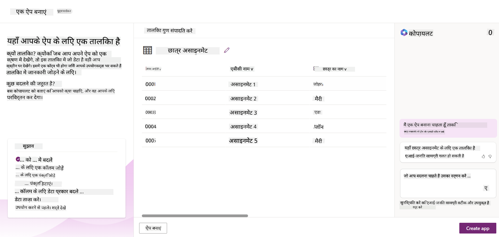
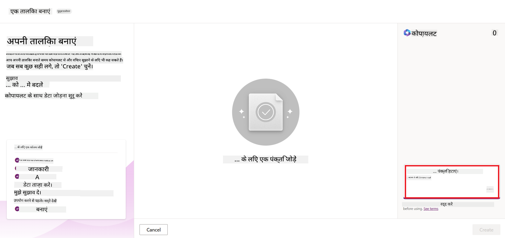
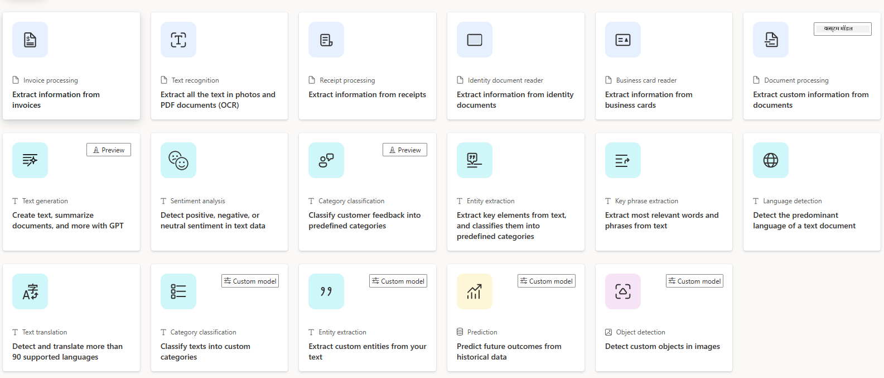
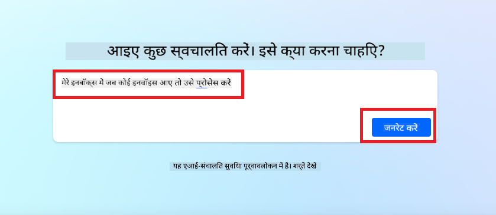
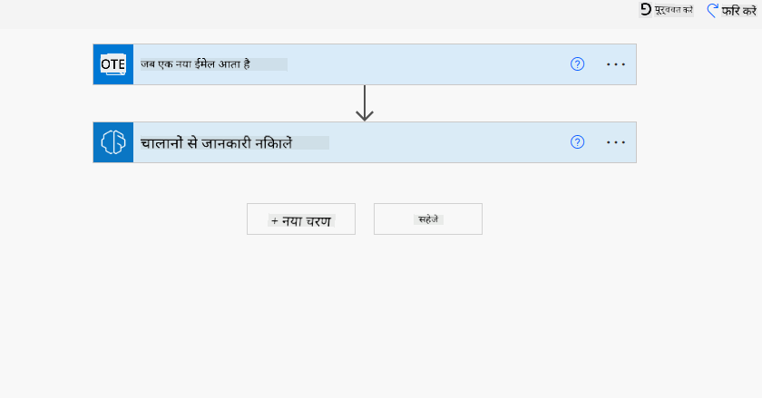
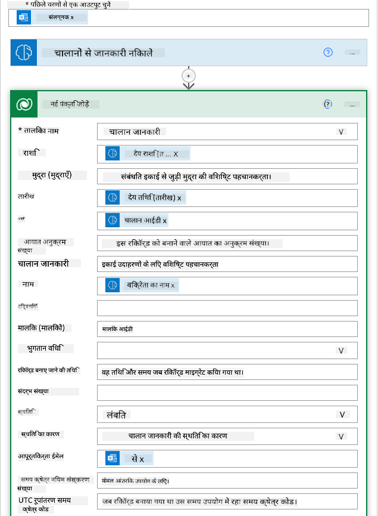
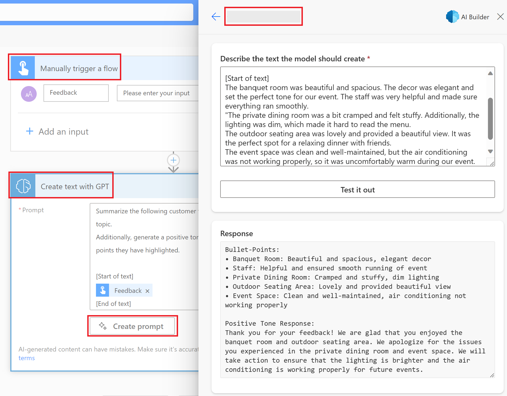

<!--
CO_OP_TRANSLATOR_METADATA:
{
  "original_hash": "846ac8e3b7dcfb697d3309fec05f0fea",
  "translation_date": "2025-10-18T00:15:01+00:00",
  "source_file": "10-building-low-code-ai-applications/README.md",
  "language_code": "hi"
}
-->
# लो कोड एआई एप्लिकेशन बनाना

> _(ऊपर दी गई छवि पर क्लिक करें इस पाठ का वीडियो देखने के लिए)_

## परिचय

अब जब हमने इमेज जनरेटिंग एप्लिकेशन बनाना सीख लिया है, तो आइए लो कोड के बारे में बात करते हैं। जनरेटिव एआई का उपयोग विभिन्न क्षेत्रों में किया जा सकता है, जिसमें लो कोड भी शामिल है, लेकिन लो कोड क्या है और हम इसमें एआई कैसे जोड़ सकते हैं?

लो कोड डेवलपमेंट प्लेटफॉर्म्स के उपयोग से पारंपरिक डेवलपर्स और गैर-डेवलपर्स के लिए ऐप्स और समाधान बनाना आसान हो गया है। लो कोड डेवलपमेंट प्लेटफॉर्म्स आपको बहुत कम या बिना कोड के ऐप्स और समाधान बनाने में सक्षम बनाते हैं। यह एक विजुअल डेवलपमेंट वातावरण प्रदान करके प्राप्त किया जाता है जो आपको ऐप्स और समाधान बनाने के लिए घटकों को ड्रैग और ड्रॉप करने की अनुमति देता है। यह आपको तेजी से और कम संसाधनों के साथ ऐप्स और समाधान बनाने में सक्षम बनाता है। इस पाठ में, हम लो कोड का उपयोग करने और पावर प्लेटफॉर्म का उपयोग करके एआई के साथ लो कोड डेवलपमेंट को बढ़ाने के तरीके पर गहराई से चर्चा करेंगे।

पावर प्लेटफॉर्म संगठनों को उनके टीमों को एक सहज लो-कोड या नो-कोड वातावरण के माध्यम से अपने स्वयं के समाधान बनाने के लिए सशक्त बनाने का अवसर प्रदान करता है। यह वातावरण समाधान बनाने की प्रक्रिया को सरल बनाने में मदद करता है। पावर प्लेटफॉर्म के साथ, समाधान महीनों या वर्षों के बजाय दिनों या हफ्तों में बनाए जा सकते हैं। पावर प्लेटफॉर्म में पांच प्रमुख उत्पाद शामिल हैं: पावर ऐप्स, पावर ऑटोमेट, पावर बीआई, पावर पेजेस और कोपायलट स्टूडियो।

इस पाठ में शामिल हैं:

- पावर प्लेटफॉर्म में जनरेटिव एआई का परिचय
- कोपायलट का परिचय और इसका उपयोग कैसे करें
- पावर प्लेटफॉर्म में ऐप्स और फ्लो बनाने के लिए जनरेटिव एआई का उपयोग
- एआई बिल्डर के साथ पावर प्लेटफॉर्म में एआई मॉडल को समझना

## सीखने के लक्ष्य

इस पाठ के अंत तक, आप सक्षम होंगे:

- समझें कि पावर प्लेटफॉर्म में कोपायलट कैसे काम करता है।

- हमारे शिक्षा स्टार्टअप के लिए एक स्टूडेंट असाइनमेंट ट्रैकर ऐप बनाएं।

- एक इनवॉइस प्रोसेसिंग फ्लो बनाएं जो एआई का उपयोग करके इनवॉइस से जानकारी निकालता है।

- GPT एआई मॉडल के साथ टेक्स्ट बनाने के लिए सर्वोत्तम प्रथाओं को लागू करें।

इस पाठ में आप जिन उपकरणों और तकनीकों का उपयोग करेंगे, वे हैं:

- **पावर ऐप्स**, स्टूडेंट असाइनमेंट ट्रैकर ऐप के लिए, जो डेटा को ट्रैक, प्रबंधित और इंटरैक्ट करने के लिए लो-कोड डेवलपमेंट वातावरण प्रदान करता है।

- **डेटावर्स**, स्टूडेंट असाइनमेंट ट्रैकर ऐप के डेटा को स्टोर करने के लिए, जहां डेटावर्स ऐप के डेटा को स्टोर करने के लिए लो-कोड डेटा प्लेटफॉर्म प्रदान करेगा।

- **पावर ऑटोमेट**, इनवॉइस प्रोसेसिंग फ्लो के लिए, जहां आप इनवॉइस प्रोसेसिंग प्रक्रिया को स्वचालित करने के लिए वर्कफ़्लो बनाने के लिए लो-कोड डेवलपमेंट वातावरण का उपयोग करेंगे।

- **एआई बिल्डर**, इनवॉइस प्रोसेसिंग एआई मॉडल के लिए, जहां आप हमारे स्टार्टअप के लिए इनवॉइस को प्रोसेस करने के लिए प्रीबिल्ट एआई मॉडल का उपयोग करेंगे।

## पावर प्लेटफॉर्म में जनरेटिव एआई

लो-कोड डेवलपमेंट और एप्लिकेशन को जनरेटिव एआई के साथ बढ़ाना पावर प्लेटफॉर्म के लिए एक प्रमुख फोकस क्षेत्र है। लक्ष्य यह है कि हर कोई एआई-संचालित ऐप्स, साइट्स, डैशबोर्ड और प्रक्रियाओं को एआई के साथ स्वचालित कर सके, _बिना किसी डेटा साइंस विशेषज्ञता की आवश्यकता के।_ यह लक्ष्य पावर प्लेटफॉर्म में लो-कोड डेवलपमेंट अनुभव में जनरेटिव एआई को कोपायलट और एआई बिल्डर के रूप में एकीकृत करके प्राप्त किया जाता है।

### यह कैसे काम करता है?

कोपायलट एक एआई सहायक है जो आपको प्राकृतिक भाषा का उपयोग करके बातचीत के चरणों की एक श्रृंखला में अपनी आवश्यकताओं का वर्णन करके पावर प्लेटफॉर्म समाधान बनाने में सक्षम बनाता है। उदाहरण के लिए, आप अपने एआई सहायक को बता सकते हैं कि आपके ऐप में कौन से फ़ील्ड होंगे और यह ऐप और अंतर्निहित डेटा मॉडल दोनों बनाएगा या आप पावर ऑटोमेट में फ्लो सेटअप करने का तरीका निर्दिष्ट कर सकते हैं।

आप अपने ऐप स्क्रीन में कोपायलट संचालित कार्यक्षमता का उपयोग कर सकते हैं ताकि उपयोगकर्ता बातचीत के माध्यम से अंतर्दृष्टि प्राप्त कर सकें।

एआई बिल्डर पावर प्लेटफॉर्म में उपलब्ध एक लो-कोड एआई क्षमता है जो आपको प्रक्रियाओं को स्वचालित करने और परिणामों की भविष्यवाणी करने में मदद करने के लिए एआई मॉडल का उपयोग करने में सक्षम बनाता है। एआई बिल्डर के साथ आप अपने ऐप्स और फ्लो में एआई ला सकते हैं जो आपके डेटा को डेटावर्स या विभिन्न क्लाउड डेटा स्रोतों जैसे कि SharePoint, OneDrive या Azure से कनेक्ट करता है।

कोपायलट पावर प्लेटफॉर्म के सभी उत्पादों में उपलब्ध है: पावर ऐप्स, पावर ऑटोमेट, पावर बीआई, पावर पेजेस और पावर वर्चुअल एजेंट्स। एआई बिल्डर पावर ऐप्स और पावर ऑटोमेट में उपलब्ध है। इस पाठ में, हम अपने शिक्षा स्टार्टअप के लिए समाधान बनाने के लिए पावर ऐप्स और पावर ऑटोमेट में कोपायलट और एआई बिल्डर का उपयोग करने पर ध्यान केंद्रित करेंगे।

### पावर ऐप्स में कोपायलट

पावर प्लेटफॉर्म के हिस्से के रूप में, पावर ऐप्स डेटा को ट्रैक, प्रबंधित और इंटरैक्ट करने के लिए ऐप्स बनाने के लिए लो-कोड डेवलपमेंट वातावरण प्रदान करता है। यह ऐप डेवलपमेंट सेवाओं का एक सूट है जिसमें एक स्केलेबल डेटा प्लेटफॉर्म और क्लाउड सेवाओं और ऑन-प्रिमाइसेस डेटा से कनेक्ट करने की क्षमता है। पावर ऐप्स आपको ऐसे ऐप्स बनाने की अनुमति देता है जो ब्राउज़रों, टैबलेट और फोन पर चलते हैं और सहकर्मियों के साथ साझा किए जा सकते हैं। पावर ऐप्स उपयोगकर्ताओं को एक सरल इंटरफ़ेस के साथ ऐप डेवलपमेंट में आसानी प्रदान करता है, ताकि हर व्यवसाय उपयोगकर्ता या प्रो डेवलपर कस्टम ऐप्स बना सके। ऐप डेवलपमेंट अनुभव को कोपायलट के माध्यम से जनरेटिव एआई के साथ भी बढ़ाया गया है।

पावर ऐप्स में कोपायलट एआई सहायक सुविधा आपको यह वर्णन करने में सक्षम बनाती है कि आपको किस प्रकार का ऐप चाहिए और आप चाहते हैं कि आपका ऐप किस प्रकार की जानकारी को ट्रैक करे, एकत्र करे या दिखाए। कोपायलट तब आपके विवरण के आधार पर एक उत्तरदायी कैनवास ऐप उत्पन्न करता है। फिर आप अपनी आवश्यकताओं को पूरा करने के लिए ऐप को अनुकूलित कर सकते हैं। एआई कोपायलट आपके द्वारा ट्रैक करना चाहते हैं डेटा को स्टोर करने के लिए आवश्यक फ़ील्ड के साथ एक डेटावर्स टेबल भी उत्पन्न करता है और कुछ नमूना डेटा सुझाता है। हम इस पाठ में बाद में देखेंगे कि डेटावर्स क्या है और आप इसे पावर ऐप्स में कैसे उपयोग कर सकते हैं। फिर आप बातचीत के चरणों के माध्यम से एआई कोपायलट सहायक सुविधा का उपयोग करके टेबल को अपनी आवश्यकताओं के अनुसार अनुकूलित कर सकते हैं। यह सुविधा पावर ऐप्स होम स्क्रीन से आसानी से उपलब्ध है।

### पावर ऑटोमेट में कोपायलट

पावर प्लेटफॉर्म के हिस्से के रूप में, पावर ऑटोमेट उपयोगकर्ताओं को एप्लिकेशन और सेवाओं के बीच स्वचालित वर्कफ़्लो बनाने की अनुमति देता है। यह संचार, डेटा संग्रह और निर्णय अनुमोदन जैसे दोहराए जाने वाले व्यावसायिक प्रक्रियाओं को स्वचालित करने में मदद करता है। इसका सरल इंटरफ़ेस हर तकनीकी क्षमता वाले उपयोगकर्ताओं (शुरुआती से लेकर अनुभवी डेवलपर्स तक) को कार्य कार्यों को स्वचालित करने की अनुमति देता है। वर्कफ़्लो डेवलपमेंट अनुभव को कोपायलट के माध्यम से जनरेटिव एआई के साथ भी बढ़ाया गया है।

पावर ऑटोमेट में कोपायलट एआई सहायक सुविधा आपको यह वर्णन करने में सक्षम बनाती है कि आपको किस प्रकार का फ्लो चाहिए और आप चाहते हैं कि आपका फ्लो कौन से कार्य करे। कोपायलट तब आपके विवरण के आधार पर एक फ्लो उत्पन्न करता है। फिर आप अपनी आवश्यकताओं को पूरा करने के लिए फ्लो को अनुकूलित कर सकते हैं। एआई कोपायलट उस कार्य को स्वचालित करने के लिए आवश्यक कार्यों को उत्पन्न और सुझाव भी देता है। हम इस पाठ में बाद में देखेंगे कि फ्लो क्या हैं और आप उन्हें पावर ऑटोमेट में कैसे उपयोग कर सकते हैं। फिर आप बातचीत के चरणों के माध्यम से एआई कोपायलट सहायक सुविधा का उपयोग करके कार्यों को अपनी आवश्यकताओं के अनुसार अनुकूलित कर सकते हैं। यह सुविधा पावर ऑटोमेट होम स्क्रीन से आसानी से उपलब्ध है।

## असाइनमेंट: हमारे स्टार्टअप के लिए कोपायलट का उपयोग करके छात्र असाइनमेंट और इनवॉइस प्रबंधन करें

हमारा स्टार्टअप छात्रों को ऑनलाइन पाठ्यक्रम प्रदान करता है। स्टार्टअप तेजी से बढ़ा है और अब अपने पाठ्यक्रमों की मांग को पूरा करने में संघर्ष कर रहा है। स्टार्टअप ने आपको एक पावर प्लेटफॉर्म डेवलपर के रूप में नियुक्त किया है ताकि वे अपने छात्र असाइनमेंट और इनवॉइस को प्रबंधित करने में मदद करने के लिए एक लो कोड समाधान बना सकें। उनका समाधान उन्हें एक ऐप के माध्यम से छात्र असाइनमेंट को ट्रैक और प्रबंधित करने में मदद करने में सक्षम होना चाहिए और एक वर्कफ़्लो के माध्यम से इनवॉइस प्रोसेसिंग प्रक्रिया को स्वचालित करना चाहिए। आपसे जनरेटिव एआई का उपयोग करके समाधान विकसित करने के लिए कहा गया है।

जब आप कोपायलट का उपयोग करना शुरू कर रहे हों, तो आप [पावर प्लेटफॉर्म कोपायलट प्रॉम्प्ट लाइब्रेरी](https://github.com/pnp/powerplatform-prompts?WT.mc_id=academic-109639-somelezediko) का उपयोग प्रॉम्प्ट्स के साथ शुरुआत करने के लिए कर सकते हैं। इस लाइब्रेरी में प्रॉम्प्ट्स की एक सूची है जिसे आप कोपायलट के साथ ऐप्स और फ्लो बनाने के लिए उपयोग कर सकते हैं। आप लाइब्रेरी में प्रॉम्प्ट्स का उपयोग यह समझने के लिए भी कर सकते हैं कि कोपायलट को अपनी आवश्यकताओं का वर्णन कैसे करें।

### हमारे स्टार्टअप के लिए एक स्टूडेंट असाइनमेंट ट्रैकर ऐप बनाएं

हमारे स्टार्टअप के शिक्षक छात्र असाइनमेंट को ट्रैक करने में संघर्ष कर रहे हैं। वे असाइनमेंट को ट्रैक करने के लिए एक स्प्रेडशीट का उपयोग कर रहे हैं, लेकिन जैसे-जैसे छात्रों की संख्या बढ़ी है, इसे प्रबंधित करना मुश्किल हो गया है। उन्होंने आपसे एक ऐसा ऐप बनाने के लिए कहा है जो उन्हें छात्र असाइनमेंट को ट्रैक और प्रबंधित करने में मदद करे। ऐप उन्हें नए असाइनमेंट जोड़ने, असाइनमेंट देखने, असाइनमेंट अपडेट करने और असाइनमेंट हटाने में सक्षम बनाना चाहिए। ऐप को शिक्षकों और छात्रों को यह देखने में भी सक्षम बनाना चाहिए कि कौन से असाइनमेंट ग्रेड किए गए हैं और कौन से नहीं।

आप नीचे दिए गए चरणों का पालन करते हुए पावर ऐप्स में कोपायलट का उपयोग करके ऐप बनाएंगे:

1. [पावर ऐप्स](https://make.powerapps.com?WT.mc_id=academic-105485-koreyst) होम स्क्रीन पर जाएं।

1. होम स्क्रीन पर टेक्स्ट एरिया का उपयोग करके उस ऐप का वर्णन करें जिसे आप बनाना चाहते हैं। उदाहरण के लिए, **_मैं एक ऐप बनाना चाहता हूं जो छात्र असाइनमेंट को ट्रैक और प्रबंधित करे_**। एआई कोपायलट को प्रॉम्प्ट भेजने के लिए **सेंड** बटन पर क्लिक करें।

1. एआई कोपायलट आपके द्वारा ट्रैक करना चाहते हैं डेटा को स्टोर करने के लिए आवश्यक फ़ील्ड के साथ एक डेटावर्स टेबल और कुछ नमूना डेटा सुझाएगा। फिर आप बातचीत के चरणों के माध्यम से एआई कोपायलट सहायक सुविधा का उपयोग करके टेबल को अपनी आवश्यकताओं के अनुसार अनुकूलित कर सकते हैं।

   > **महत्वपूर्ण**: डेटावर्स पावर प्लेटफॉर्म के लिए अंतर्निहित डेटा प्लेटफॉर्म है। यह ऐप के डेटा को स्टोर करने के लिए एक लो-कोड डेटा प्लेटफॉर्म है। यह एक पूरी तरह से प्रबंधित सेवा है जो माइक्रोसॉफ्ट क्लाउड में डेटा को सुरक्षित रूप से स्टोर करती है और आपके पावर प्लेटफॉर्म वातावरण के भीतर प्रावधान करती है। इसमें डेटा वर्गीकरण, डेटा वंशावली, सूक्ष्म पहुंच नियंत्रण और अधिक जैसी अंतर्निहित डेटा गवर्नेंस क्षमताएं हैं। आप डेटावर्स के बारे में अधिक जानकारी [यहां](https://docs.microsoft.com/powerapps/maker/data-platform/data-platform-intro?WT.mc_id=academic-109639-somelezediko) प्राप्त कर सकते हैं।

   

1. शिक्षक उन छात्रों को ईमेल भेजना चाहते हैं जिन्होंने अपने असाइनमेंट जमा किए हैं ताकि उन्हें उनके असाइनमेंट की प्रगति के बारे में अपडेट रखा जा सके। आप टेबल में छात्र ईमेल को स्टोर करने के लिए एक नया फ़ील्ड जोड़ने के लिए कोपायलट का उपयोग कर सकते हैं। उदाहरण के लिए, आप टेबल में एक नया फ़ील्ड जोड़ने के लिए निम्न प्रॉम्प्ट का उपयोग कर सकते हैं: **_मैं एक कॉलम जोड़ना चाहता हूं जो छात्र ईमेल को स्टोर करे_**। एआई कोपायलट को प्रॉम्प्ट भेजने के लिए **सेंड** बटन पर क्लिक करें।

1. एआई कोपायलट एक नया फ़ील्ड उत्पन्न करेगा और फिर आप अपनी आवश्यकताओं के अनुसार फ़ील्ड को अनुकूलित कर सकते हैं।

1. जब आप टेबल के साथ समाप्त कर लें, तो ऐप बनाने के लिए **क्रिएट ऐप** बटन पर क्लिक करें।

1. एआई कोपायलट आपके विवरण के आधार पर एक उत्तरदायी कैनवास ऐप उत्पन्न करेगा। फिर आप अपनी आवश्यकताओं के अनुसार ऐप को अनुकूलित कर सकते हैं।

1. शिक्षकों को छात्रों को ईमेल भेजने के लिए, आप ऐप में एक नई स्क्रीन जोड़ने के लिए कोपायलट का उपयोग कर सकते हैं। उदाहरण के लिए, आप ऐप में एक नई स्क्रीन जोड़ने के लिए निम्न प्रॉम्प्ट का उपयोग कर सकते हैं: **_मैं छात्रों को ईमेल भेजने के लिए एक स्क्रीन जोड़ना चाहता हूं_**। एआई कोपायलट को प्रॉम्प्ट भेजने के लिए **सेंड** बटन पर क्लिक करें।

1. एआई कोपायलट एक नई स्क्रीन उत्पन्न करेगा और फिर आप अपनी आवश्यकताओं के अनुसार स्क्रीन को अनुकूलित कर सकते हैं।

1. जब आप ऐप के साथ समाप्त कर लें, तो ऐप को सेव करने के लिए **सेव** बटन पर क्लिक करें।

1. शिक्षकों के साथ ऐप साझा करने के लिए, **शेयर** बटन पर क्लिक करें और फिर **शेयर** बटन पर फिर से क्लिक करें। फिर आप शिक्षकों के ईमेल पते दर्ज करके ऐप साझा कर सकते हैं।

> **आपका होमवर्क**: आपने जो ऐप अभी बनाया है वह एक अच्छी शुरुआत है लेकिन इसे बेहतर बनाया जा सकता है। ईमेल फीचर के साथ, शिक्षक केवल छात्रों को मैन्युअल रूप से ईमेल भेज सकते हैं, जिसमें उन्हें उनके ईमेल टाइप करने होते हैं। क्या आप कोपायलट का उपयोग करके एक ऑटोमेशन बना सकते हैं जो शिक्षकों को छात्रों को उनके असाइनमेंट जमा करने पर स्वचालित रूप से ईमेल भेजने में सक्षम बनाए? आपका संकेत है कि सही प्रॉम्प्ट के साथ आप पावर ऑटोमेट में कोपायलट का उपयोग करके इसे बना सकते हैं।

### हमारे स्टार्टअप के लिए इनवॉइस जानकारी टेबल बनाएं

हमारे स्टार्टअप की वित्तीय टीम इनवॉइस को ट्रैक करने में संघर्ष कर रही है। वे इनवॉइस को ट्रैक करने के लिए एक स्प्रेडशीट का उपयोग कर रहे हैं, लेकिन जैसे-जैसे इनवॉइस की संख्या बढ़ी है, इसे प्रबंधित करना मुश्किल हो गया है। उन्होंने आपसे एक टेबल बनाने के लिए कहा है जो उन्हें प्राप्त इनवॉइस की जानकारी को स्टोर, ट्रैक और प्रबंधित करने में मदद करे। टेबल का उपयोग एक ऑटोमेशन बनाने के लिए किया जाना चाहिए जो सभी इनवॉइस जानकारी को निकालकर टेबल में स्टोर करे। टेबल वित्तीय टीम को उन इनवॉइस को देखने में भी सक्षम बनाना चाहिए जो भुगतान किए गए हैं और जो भुगतान नहीं किए गए हैं।

पावर प्लेटफॉर्म में एक अंतर्निहित डेटा प्लेटफॉर्म है जिसे डेटावर्स कहा जाता है जो आपको आपके ऐप्स और
हमारी स्टार्टअप के लिए Dataverse का उपयोग क्यों करें? Dataverse के मानक और कस्टम टेबल आपके डेटा के लिए एक सुरक्षित और क्लाउड-आधारित स्टोरेज विकल्प प्रदान करते हैं। टेबल आपको विभिन्न प्रकार के डेटा को संग्रहीत करने की अनुमति देते हैं, जैसे कि आप एक ही Excel वर्कबुक में कई वर्कशीट का उपयोग करते हैं। आप अपनी संगठनात्मक या व्यावसायिक आवश्यकताओं के अनुसार डेटा संग्रहीत करने के लिए टेबल का उपयोग कर सकते हैं। Dataverse का उपयोग करने से हमारी स्टार्टअप को निम्नलिखित लाभ मिल सकते हैं:

- **आसान प्रबंधन**: मेटाडेटा और डेटा दोनों क्लाउड में संग्रहीत होते हैं, इसलिए आपको यह चिंता करने की आवश्यकता नहीं है कि उन्हें कैसे संग्रहीत या प्रबंधित किया जाए। आप अपने ऐप्स और समाधान बनाने पर ध्यान केंद्रित कर सकते हैं।

- **सुरक्षित**: Dataverse आपके डेटा के लिए एक सुरक्षित और क्लाउड-आधारित स्टोरेज विकल्प प्रदान करता है। आप रोल आधारित सुरक्षा का उपयोग करके नियंत्रित कर सकते हैं कि आपके टेबल में डेटा तक कौन पहुंच सकता है और कैसे पहुंच सकता है।

- **समृद्ध मेटाडेटा**: डेटा प्रकार और संबंध सीधे Power Apps में उपयोग किए जाते हैं।

- **तर्क और मान्यता**: आप व्यावसायिक नियम, गणना किए गए फ़ील्ड और मान्यता नियमों का उपयोग करके व्यावसायिक तर्क लागू कर सकते हैं और डेटा की सटीकता बनाए रख सकते हैं।

अब जब आप जानते हैं कि Dataverse क्या है और इसका उपयोग क्यों करना चाहिए, तो आइए देखें कि आप Copilot का उपयोग करके Dataverse में हमारे वित्तीय टीम की आवश्यकताओं को पूरा करने के लिए एक टेबल कैसे बना सकते हैं।

> **Note** : आप इस टेबल का उपयोग अगले सेक्शन में एक ऑटोमेशन बनाने के लिए करेंगे जो सभी चालान जानकारी को निकालकर टेबल में संग्रहीत करेगा।

Copilot का उपयोग करके Dataverse में टेबल बनाने के लिए नीचे दिए गए चरणों का पालन करें:

1. [Power Apps](https://make.powerapps.com?WT.mc_id=academic-105485-koreyst) होम स्क्रीन पर जाएं।

2. बाईं ओर नेविगेशन बार पर, **Tables** चुनें और फिर **Describe the new Table** पर क्लिक करें।

3. **Describe the new Table** स्क्रीन पर, उस टेबल का वर्णन करने के लिए टेक्स्ट क्षेत्र का उपयोग करें जिसे आप बनाना चाहते हैं। उदाहरण के लिए, **_मुझे चालान जानकारी संग्रहीत करने के लिए एक टेबल बनानी है_**। AI Copilot को प्रॉम्प्ट भेजने के लिए **Send** बटन पर क्लिक करें।

4. AI Copilot आपके डेटा को ट्रैक करने के लिए आवश्यक फ़ील्ड और कुछ नमूना डेटा के साथ एक Dataverse टेबल का सुझाव देगा। आप फिर AI Copilot सहायक फीचर का उपयोग करके बातचीत के चरणों के माध्यम से टेबल को अपनी आवश्यकताओं के अनुसार अनुकूलित कर सकते हैं।

5. वित्तीय टीम आपूर्तिकर्ता को उनके चालान की वर्तमान स्थिति के साथ अपडेट करने के लिए ईमेल भेजना चाहती है। आप टेबल में आपूर्तिकर्ता ईमेल संग्रहीत करने के लिए एक नया फ़ील्ड जोड़ने के लिए Copilot का उपयोग कर सकते हैं। उदाहरण के लिए, आप निम्न प्रॉम्प्ट का उपयोग कर सकते हैं: **_मुझे आपूर्तिकर्ता ईमेल संग्रहीत करने के लिए एक कॉलम जोड़ना है_**। AI Copilot को प्रॉम्प्ट भेजने के लिए **Send** बटन पर क्लिक करें।

6. AI Copilot एक नया फ़ील्ड जनरेट करेगा और फिर आप अपनी आवश्यकताओं के अनुसार फ़ील्ड को अनुकूलित कर सकते हैं।

7. टेबल के साथ काम पूरा करने के बाद, टेबल बनाने के लिए **Create** बटन पर क्लिक करें।

## Power Platform में AI Builder के साथ AI मॉडल

AI Builder Power Platform में उपलब्ध एक लो-कोड AI क्षमता है जो आपको प्रक्रियाओं को स्वचालित करने और परिणामों की भविष्यवाणी करने में मदद करने के लिए AI मॉडल का उपयोग करने में सक्षम बनाती है। AI Builder के साथ आप AI को अपने ऐप्स और फ्लो में ला सकते हैं जो Dataverse या SharePoint, OneDrive या Azure जैसे विभिन्न क्लाउड डेटा स्रोतों से जुड़ते हैं।

## Prebuilt AI Models बनाम Custom AI Models

AI Builder दो प्रकार के AI मॉडल प्रदान करता है: Prebuilt AI Models और Custom AI Models। Prebuilt AI Models तैयार-से-उपयोग AI मॉडल हैं जिन्हें Microsoft द्वारा प्रशिक्षित किया गया है और Power Platform में उपलब्ध हैं। ये आपको अपने ऐप्स और फ्लो में इंटेलिजेंस जोड़ने में मदद करते हैं, बिना डेटा इकट्ठा किए और फिर अपने मॉडल को बनाकर, प्रशिक्षित और प्रकाशित किए। आप इन मॉडलों का उपयोग प्रक्रियाओं को स्वचालित करने और परिणामों की भविष्यवाणी करने के लिए कर सकते हैं।

Power Platform में उपलब्ध कुछ Prebuilt AI Models में शामिल हैं:

- **Key Phrase Extraction**: यह मॉडल टेक्स्ट से मुख्य वाक्यांश निकालता है।
- **Language Detection**: यह मॉडल टेक्स्ट की भाषा का पता लगाता है।
- **Sentiment Analysis**: यह मॉडल टेक्स्ट में सकारात्मक, नकारात्मक, तटस्थ या मिश्रित भावना का पता लगाता है।
- **Business Card Reader**: यह मॉडल बिजनेस कार्ड से जानकारी निकालता है।
- **Text Recognition**: यह मॉडल छवियों से टेक्स्ट निकालता है।
- **Object Detection**: यह मॉडल छवियों से वस्तुओं का पता लगाता है और निकालता है।
- **Document processing**: यह मॉडल फॉर्म से जानकारी निकालता है।
- **Invoice Processing**: यह मॉडल चालानों से जानकारी निकालता है।

Custom AI Models के साथ आप अपना खुद का मॉडल AI Builder में ला सकते हैं ताकि यह किसी भी AI Builder कस्टम मॉडल की तरह काम कर सके, जिससे आप अपने डेटा का उपयोग करके मॉडल को प्रशिक्षित कर सकें। आप इन मॉडलों का उपयोग Power Apps और Power Automate दोनों में प्रक्रियाओं को स्वचालित करने और परिणामों की भविष्यवाणी करने के लिए कर सकते हैं। अपने मॉडल का उपयोग करते समय कुछ सीमाएं लागू होती हैं। इन [सीमाओं](https://learn.microsoft.com/ai-builder/byo-model#limitations?WT.mc_id=academic-105485-koreyst) के बारे में अधिक पढ़ें।

## असाइनमेंट #2 - हमारी स्टार्टअप के लिए एक चालान प्रोसेसिंग फ्लो बनाएं

वित्तीय टीम चालानों को प्रोसेस करने में कठिनाई का सामना कर रही है। वे चालानों को ट्रैक करने के लिए एक स्प्रेडशीट का उपयोग कर रहे हैं, लेकिन जैसे-जैसे चालानों की संख्या बढ़ रही है, इसे प्रबंधित करना मुश्किल हो गया है। उन्होंने आपसे AI का उपयोग करके चालानों को प्रोसेस करने में मदद करने के लिए एक वर्कफ़्लो बनाने का अनुरोध किया है। वर्कफ़्लो उन्हें चालानों से जानकारी निकालने और उस जानकारी को Dataverse टेबल में संग्रहीत करने में सक्षम बनाना चाहिए। वर्कफ़्लो उन्हें निकाली गई जानकारी के साथ वित्तीय टीम को ईमेल भेजने में भी सक्षम बनाना चाहिए।

अब जब आप जानते हैं कि AI Builder क्या है और इसका उपयोग क्यों करना चाहिए, तो आइए देखें कि आप AI Builder में पहले कवर किए गए Invoice Processing AI Model का उपयोग करके वित्तीय टीम को चालानों को प्रोसेस करने में मदद करने के लिए एक वर्कफ़्लो कैसे बना सकते हैं।

Invoice Processing AI Model का उपयोग करके वित्तीय टीम को चालानों को प्रोसेस करने में मदद करने के लिए वर्कफ़्लो बनाने के लिए नीचे दिए गए चरणों का पालन करें:

1. [Power Automate](https://make.powerautomate.com?WT.mc_id=academic-105485-koreyst) होम स्क्रीन पर जाएं।

2. होम स्क्रीन पर टेक्स्ट क्षेत्र का उपयोग करके उस वर्कफ़्लो का वर्णन करें जिसे आप बनाना चाहते हैं। उदाहरण के लिए, **_जब चालान मेरे मेलबॉक्स में आए तो उसे प्रोसेस करें_**। AI Copilot को प्रॉम्प्ट भेजने के लिए **Send** बटन पर क्लिक करें।

   

3. AI Copilot उस कार्य को स्वचालित करने के लिए आवश्यक क्रियाओं का सुझाव देगा जिसे आप करना चाहते हैं। आप **Next** बटन पर क्लिक करके अगले चरणों पर जा सकते हैं।

4. अगले चरण में, Power Automate आपको फ्लो के लिए आवश्यक कनेक्शन सेट करने के लिए प्रेरित करेगा। जब आप पूरा कर लें, तो फ्लो बनाने के लिए **Create flow** बटन पर क्लिक करें।

5. AI Copilot एक फ्लो जनरेट करेगा और फिर आप अपनी आवश्यकताओं के अनुसार फ्लो को अनुकूलित कर सकते हैं।

6. फ्लो के ट्रिगर को अपडेट करें और **Folder** को उस फोल्डर पर सेट करें जहां चालान संग्रहीत किए जाएंगे। उदाहरण के लिए, आप फोल्डर को **Inbox** पर सेट कर सकते हैं। **Show advanced options** पर क्लिक करें और **Only with Attachments** को **Yes** पर सेट करें। यह सुनिश्चित करेगा कि फ्लो केवल तब चले जब फोल्डर में अटैचमेंट के साथ ईमेल प्राप्त हो।

7. फ्लो से निम्नलिखित क्रियाओं को हटा दें: **HTML to text**, **Compose**, **Compose 2**, **Compose 3** और **Compose 4** क्योंकि आप उनका उपयोग नहीं करेंगे।

8. फ्लो से **Condition** क्रिया को हटा दें क्योंकि आप इसका उपयोग नहीं करेंगे। यह निम्नलिखित स्क्रीनशॉट की तरह दिखना चाहिए:

   

9. **Add an action** बटन पर क्लिक करें और **Dataverse** खोजें। **Add a new row** क्रिया चुनें।

10. **Extract Information from invoices** क्रिया पर, **Invoice File** को ईमेल से **Attachment Content** पर इंगित करने के लिए अपडेट करें। यह सुनिश्चित करेगा कि फ्लो चालान अटैचमेंट से जानकारी निकालता है।

11. पहले बनाए गए **Table** को चुनें। उदाहरण के लिए, आप **Invoice Information** टेबल चुन सकते हैं। निम्नलिखित फ़ील्ड को भरने के लिए पिछले क्रिया से डायनामिक कंटेंट चुनें:

    - ID
    - Amount
    - Date
    - Name
    - Status - **Status** को **Pending** पर सेट करें।
    - Supplier Email - **When a new email arrives** ट्रिगर से **From** डायनामिक कंटेंट का उपयोग करें।

    

12. फ्लो के साथ काम पूरा करने के बाद, फ्लो को सेव करने के लिए **Save** बटन पर क्लिक करें। आप फिर उस फोल्डर में चालान के साथ ईमेल भेजकर फ्लो का परीक्षण कर सकते हैं जिसे आपने ट्रिगर में निर्दिष्ट किया है।

> **आपका होमवर्क**: आपने जो फ्लो बनाया है वह एक अच्छी शुरुआत है, अब आपको यह सोचना होगा कि आप ऐसा ऑटोमेशन कैसे बना सकते हैं जो हमारी वित्तीय टीम को चालान की स्थिति बदलने पर आपूर्तिकर्ता को ईमेल भेजने में सक्षम बनाए। आपका संकेत: फ्लो को तब चलना चाहिए जब चालान की स्थिति बदल जाए।

## Power Automate में Text Generation AI Model का उपयोग करें

AI Builder में Create Text with GPT AI Model आपको एक प्रॉम्प्ट के आधार पर टेक्स्ट जनरेट करने में सक्षम बनाता है और यह Microsoft Azure OpenAI Service द्वारा संचालित है। इस क्षमता के साथ, आप GPT (Generative Pre-Trained Transformer) तकनीक को अपने ऐप्स और फ्लो में शामिल कर सकते हैं ताकि विभिन्न स्वचालित फ्लो और जानकारीपूर्ण एप्लिकेशन बनाए जा सकें।

GPT मॉडल बड़े पैमाने पर डेटा पर व्यापक प्रशिक्षण से गुजरते हैं, जिससे वे एक प्रॉम्प्ट प्रदान किए जाने पर मानव भाषा के समान टेक्स्ट उत्पन्न कर सकते हैं। वर्कफ़्लो ऑटोमेशन के साथ एकीकृत होने पर, GPT जैसे AI मॉडल का उपयोग कार्यों को सुव्यवस्थित और स्वचालित करने के लिए किया जा सकता है।

उदाहरण के लिए, आप विभिन्न उपयोग मामलों के लिए टेक्स्ट को स्वचालित रूप से जनरेट करने के लिए फ्लो बना सकते हैं, जैसे: ईमेल के ड्राफ्ट, उत्पाद विवरण, और अधिक। आप मॉडल का उपयोग विभिन्न ऐप्स के लिए टेक्स्ट जनरेट करने के लिए भी कर सकते हैं, जैसे चैटबॉट और ग्राहक सेवा ऐप्स जो ग्राहक सेवा एजेंटों को ग्राहक पूछताछ का प्रभावी और कुशलता से जवाब देने में सक्षम बनाते हैं।

Power Automate में इस AI Model का उपयोग कैसे करें, यह जानने के लिए [Add intelligence with AI Builder and GPT](https://learn.microsoft.com/training/modules/ai-builder-text-generation/?WT.mc_id=academic-109639-somelezediko) मॉड्यूल पर जाएं।

## शानदार काम! अपनी सीख जारी रखें

इस पाठ को पूरा करने के बाद, हमारे [Generative AI Learning collection](https://aka.ms/genai-collection?WT.mc_id=academic-105485-koreyst) पर जाएं ताकि आप अपनी Generative AI की जानकारी को और बढ़ा सकें!

Lesson 11 पर जाएं जहां हम देखेंगे कि [Function Calling के साथ Generative AI को कैसे एकीकृत करें](../11-integrating-with-function-calling/README.md?WT.mc_id=academic-105485-koreyst)!

---

**अस्वीकरण**:  
यह दस्तावेज़ AI अनुवाद सेवा [Co-op Translator](https://github.com/Azure/co-op-translator) का उपयोग करके अनुवादित किया गया है। जबकि हम सटीकता के लिए प्रयास करते हैं, कृपया ध्यान दें कि स्वचालित अनुवाद में त्रुटियां या अशुद्धियां हो सकती हैं। मूल भाषा में दस्तावेज़ को आधिकारिक स्रोत माना जाना चाहिए। महत्वपूर्ण जानकारी के लिए, पेशेवर मानव अनुवाद की सिफारिश की जाती है। इस अनुवाद के उपयोग से उत्पन्न किसी भी गलतफहमी या गलत व्याख्या के लिए हम उत्तरदायी नहीं हैं।