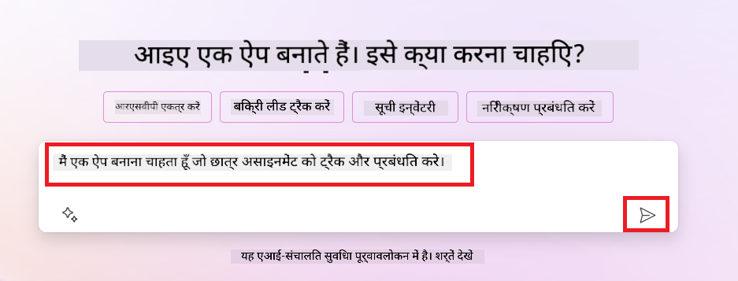
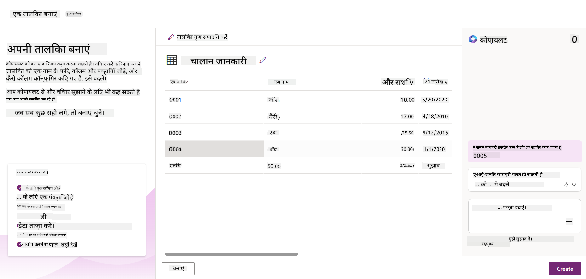

<!--
CO_OP_TRANSLATOR_METADATA:
{
  "original_hash": "f5ff3b6204a695a117d6f452403c95f7",
  "translation_date": "2025-07-09T13:49:13+00:00",
  "source_file": "10-building-low-code-ai-applications/README.md",
  "language_code": "hi"
}
-->
# लो कोड AI एप्लिकेशन बनाना

> _(इस पाठ का वीडियो देखने के लिए ऊपर की छवि पर क्लिक करें)_

## परिचय

अब जब हमने इमेज जनरेटिंग एप्लिकेशन बनाना सीख लिया है, तो आइए लो कोड के बारे में बात करते हैं। जनरेटिव AI का उपयोग कई क्षेत्रों में किया जा सकता है, जिनमें लो कोड भी शामिल है, लेकिन लो कोड क्या है और हम इसमें AI कैसे जोड़ सकते हैं?

लो कोड डेवलपमेंट प्लेटफॉर्म के उपयोग से पारंपरिक डेवलपर्स और गैर-डेवलपर्स दोनों के लिए ऐप्स और समाधान बनाना आसान हो गया है। लो कोड डेवलपमेंट प्लेटफॉर्म आपको कम या बिना कोड के ऐप्स और समाधान बनाने में सक्षम बनाता है। यह एक विज़ुअल डेवलपमेंट वातावरण प्रदान करके संभव होता है, जिसमें आप ऐप्स और समाधान बनाने के लिए कंपोनेंट्स को ड्रैग और ड्रॉप कर सकते हैं। इससे आप तेज़ी से और कम संसाधनों के साथ ऐप्स और समाधान बना सकते हैं। इस पाठ में, हम लो कोड का उपयोग कैसे करें और Power Platform के माध्यम से AI के साथ लो कोड विकास को कैसे बेहतर बनाएं, इस पर गहराई से चर्चा करेंगे।

Power Platform संगठनों को यह अवसर प्रदान करता है कि वे अपनी टीमों को सहज लो-कोड या नो-कोड वातावरण के माध्यम से अपने समाधान बनाने के लिए सशक्त बनाएं। यह वातावरण समाधान बनाने की प्रक्रिया को सरल बनाता है। Power Platform के साथ, समाधान महीनों या वर्षों की बजाय दिनों या हफ्तों में बनाए जा सकते हैं। Power Platform में पांच मुख्य उत्पाद शामिल हैं: Power Apps, Power Automate, Power BI, Power Pages और Copilot Studio।

इस पाठ में निम्नलिखित विषय शामिल हैं:

- Power Platform में जनरेटिव AI का परिचय
- Copilot का परिचय और इसका उपयोग कैसे करें
- Power Platform में ऐप्स और फ्लोज़ बनाने के लिए जनरेटिव AI का उपयोग
- AI Builder के साथ Power Platform में AI मॉडल को समझना

## सीखने के लक्ष्य

इस पाठ के अंत तक, आप सक्षम होंगे:

- समझना कि Power Platform में Copilot कैसे काम करता है।

- हमारे शिक्षा स्टार्टअप के लिए एक Student Assignment Tracker ऐप बनाना।

- एक Invoice Processing फ्लो बनाना जो AI का उपयोग करके इनवॉइस से जानकारी निकालता है।

- Create Text with GPT AI Model का उपयोग करते समय सर्वोत्तम प्रथाओं को लागू करना।

इस पाठ में आप जिन उपकरणों और तकनीकों का उपयोग करेंगे, वे हैं:

- **Power Apps**, Student Assignment Tracker ऐप के लिए, जो डेटा को ट्रैक, प्रबंधित और इंटरैक्ट करने के लिए एक लो-कोड विकास वातावरण प्रदान करता है।

- **Dataverse**, Student Assignment Tracker ऐप के डेटा को स्टोर करने के लिए, जो ऐप के डेटा को स्टोर करने के लिए एक लो-कोड डेटा प्लेटफॉर्म प्रदान करता है।

- **Power Automate**, Invoice Processing फ्लो के लिए, जहां आप इनवॉइस प्रोसेसिंग प्रक्रिया को स्वचालित करने के लिए वर्कफ़्लो बनाने के लिए लो-कोड विकास वातावरण का उपयोग करेंगे।

- **AI Builder**, Invoice Processing AI मॉडल के लिए, जहां आप हमारे स्टार्टअप के लिए इनवॉइस प्रोसेस करने के लिए प्रीबिल्ट AI मॉडल का उपयोग करेंगे।

## Power Platform में जनरेटिव AI

जनरेटिव AI के साथ लो-कोड विकास और एप्लिकेशन को बेहतर बनाना Power Platform का एक मुख्य फोकस क्षेत्र है। लक्ष्य है कि हर कोई बिना किसी डेटा साइंस विशेषज्ञता के AI-संचालित ऐप्स, साइट्स, डैशबोर्ड और प्रक्रियाओं को AI के साथ स्वचालित कर सके। यह लक्ष्य Power Platform में Copilot और AI Builder के रूप में जनरेटिव AI को लो-कोड विकास अनुभव में एकीकृत करके हासिल किया जाता है।

### यह कैसे काम करता है?

Copilot एक AI सहायक है जो आपको Power Platform समाधान बनाने में मदद करता है, जहां आप अपनी आवश्यकताओं को प्राकृतिक भाषा में बातचीत के माध्यम से वर्णित करते हैं। उदाहरण के लिए, आप अपने AI सहायक को बता सकते हैं कि आपके ऐप में कौन-कौन से फील्ड होंगे, और यह ऐप और उसके अंतर्निहित डेटा मॉडल दोनों बनाएगा, या आप Power Automate में फ्लो कैसे सेटअप करना है, यह निर्दिष्ट कर सकते हैं।

आप Copilot संचालित कार्यक्षमताओं का उपयोग अपनी ऐप स्क्रीन में एक फीचर के रूप में कर सकते हैं ताकि उपयोगकर्ता बातचीत के माध्यम से अंतर्दृष्टि प्राप्त कर सकें।

AI Builder Power Platform में उपलब्ध एक लो-कोड AI क्षमता है जो आपको AI मॉडल का उपयोग करके प्रक्रियाओं को स्वचालित करने और परिणामों की भविष्यवाणी करने में मदद करता है। AI Builder के साथ आप AI को अपने ऐप्स और फ्लोज़ में ला सकते हैं जो Dataverse या विभिन्न क्लाउड डेटा स्रोतों जैसे SharePoint, OneDrive या Azure से जुड़े होते हैं।

Copilot Power Platform के सभी उत्पादों में उपलब्ध है: Power Apps, Power Automate, Power BI, Power Pages और Power Virtual Agents। AI Builder Power Apps और Power Automate में उपलब्ध है। इस पाठ में, हम Power Apps और Power Automate में Copilot और AI Builder का उपयोग करके हमारे शिक्षा स्टार्टअप के लिए समाधान बनाने पर ध्यान केंद्रित करेंगे।

### Power Apps में Copilot

Power Platform के हिस्से के रूप में, Power Apps एक लो-कोड विकास वातावरण प्रदान करता है जो डेटा को ट्रैक, प्रबंधित और इंटरैक्ट करने के लिए ऐप्स बनाने के लिए है। यह ऐप विकास सेवाओं का एक सूट है जिसमें एक स्केलेबल डेटा प्लेटफॉर्म और क्लाउड सेवाओं तथा ऑन-प्रिमाइसेस डेटा से कनेक्ट करने की क्षमता है। Power Apps आपको ब्राउज़र, टैबलेट और फोन पर चलने वाले ऐप्स बनाने की अनुमति देता है, जिन्हें सहकर्मियों के साथ साझा भी किया जा सकता है। Power Apps एक सरल इंटरफ़ेस के साथ उपयोगकर्ताओं को ऐप विकास में सहज बनाता है, ताकि हर व्यवसाय उपयोगकर्ता या प्रो डेवलपर कस्टम ऐप्स बना सके। ऐप विकास अनुभव को जनरेटिव AI के माध्यम से Copilot के साथ भी बेहतर बनाया गया है।

Power Apps में Copilot AI सहायक फीचर आपको यह वर्णन करने की अनुमति देता है कि आपको किस प्रकार का ऐप चाहिए और आपका ऐप कौन सी जानकारी ट्रैक, संग्रहित या दिखाएगा। Copilot आपके विवरण के आधार पर एक उत्तरदायी Canvas ऐप उत्पन्न करता है। आप फिर अपनी आवश्यकताओं के अनुसार ऐप को अनुकूलित कर सकते हैं। AI Copilot एक Dataverse टेबल भी उत्पन्न करता है और सुझाव देता है जिसमें वे फील्ड होते हैं जिनमें आप ट्रैक करना चाहते हैं, साथ ही कुछ नमूना डेटा भी होता है। हम इस पाठ में बाद में देखेंगे कि Dataverse क्या है और आप इसे Power Apps में कैसे उपयोग कर सकते हैं। आप फिर बातचीत के चरणों के माध्यम से AI Copilot सहायक फीचर का उपयोग करके टेबल को अपनी आवश्यकताओं के अनुसार अनुकूलित कर सकते हैं। यह फीचर Power Apps होम स्क्रीन से आसानी से उपलब्ध है।

### Power Automate में Copilot

Power Platform के हिस्से के रूप में, Power Automate उपयोगकर्ताओं को एप्लिकेशन और सेवाओं के बीच स्वचालित वर्कफ़्लो बनाने की अनुमति देता है। यह संचार, डेटा संग्रह और निर्णय अनुमोदन जैसी दोहराई जाने वाली व्यावसायिक प्रक्रियाओं को स्वचालित करने में मदद करता है। इसका सरल इंटरफ़ेस हर तकनीकी दक्षता वाले उपयोगकर्ता (शुरुआती से लेकर अनुभवी डेवलपर तक) को कार्य स्वचालन करने की अनुमति देता है। वर्कफ़्लो विकास अनुभव को जनरेटिव AI के माध्यम से Copilot के साथ भी बेहतर बनाया गया है।

Power Automate में Copilot AI सहायक फीचर आपको यह वर्णन करने की अनुमति देता है कि आपको किस प्रकार का फ्लो चाहिए और आपका फ्लो कौन-कौन से कार्य करेगा। Copilot आपके विवरण के आधार पर एक फ्लो उत्पन्न करता है। आप फिर अपनी आवश्यकताओं के अनुसार फ्लो को अनुकूलित कर सकते हैं। AI Copilot उन क्रियाओं को भी उत्पन्न करता है और सुझाव देता है जो आपको स्वचालित करने के लिए आवश्यक हैं। हम इस पाठ में बाद में देखेंगे कि फ्लो क्या हैं और आप उन्हें Power Automate में कैसे उपयोग कर सकते हैं। आप फिर बातचीत के चरणों के माध्यम से AI Copilot सहायक फीचर का उपयोग करके क्रियाओं को अपनी आवश्यकताओं के अनुसार अनुकूलित कर सकते हैं। यह फीचर Power Automate होम स्क्रीन से आसानी से उपलब्ध है।

## असाइनमेंट: Copilot का उपयोग करके हमारे स्टार्टअप के लिए छात्र असाइनमेंट और इनवॉइस प्रबंधित करें

हमारा स्टार्टअप छात्रों को ऑनलाइन कोर्स प्रदान करता है। स्टार्टअप तेजी से बढ़ा है और अब अपने कोर्स की मांग को पूरा करने में संघर्ष कर रहा है। स्टार्टअप ने आपको Power Platform डेवलपर के रूप में नियुक्त किया है ताकि आप उनके लिए एक लो कोड समाधान बना सकें जो छात्र असाइनमेंट और इनवॉइस को प्रबंधित करने में मदद करे। उनका समाधान एक ऐप के माध्यम से छात्र असाइनमेंट को ट्रैक और प्रबंधित करने में सक्षम होना चाहिए और एक वर्कफ़्लो के माध्यम से इनवॉइस प्रोसेसिंग प्रक्रिया को स्वचालित करना चाहिए। आपको जनरेटिव AI का उपयोग करके यह समाधान विकसित करने के लिए कहा गया है।

जब आप Copilot का उपयोग शुरू कर रहे हों, तो आप [Power Platform Copilot Prompt Library](https://github.com/pnp/powerplatform-prompts?WT.mc_id=academic-109639-somelezediko) का उपयोग कर सकते हैं। इस लाइब्रेरी में उन प्रॉम्प्ट्स की सूची है जिनका उपयोग आप Copilot के साथ ऐप्स और फ्लोज़ बनाने के लिए कर सकते हैं। आप इस लाइब्रेरी के प्रॉम्प्ट्स का उपयोग यह समझने के लिए भी कर सकते हैं कि अपनी आवश्यकताओं को Copilot को कैसे वर्णित करें।

### हमारे स्टार्टअप के लिए Student Assignment Tracker ऐप बनाएं

हमारे स्टार्टअप के शिक्षक छात्र असाइनमेंट को ट्रैक करने में संघर्ष कर रहे हैं। वे असाइनमेंट ट्रैक करने के लिए स्प्रेडशीट का उपयोग कर रहे थे, लेकिन छात्रों की संख्या बढ़ने के कारण इसे प्रबंधित करना मुश्किल हो गया है। उन्होंने आपसे एक ऐसा ऐप बनाने को कहा है जो उन्हें छात्र असाइनमेंट को ट्रैक और प्रबंधित करने में मदद करे। ऐप में नए असाइनमेंट जोड़ने, असाइनमेंट देखने, अपडेट करने और हटाने की सुविधा होनी चाहिए। ऐप शिक्षकों और छात्रों दोनों को ग्रेड किए गए और जिन असाइनमेंट्स का मूल्यांकन नहीं हुआ है, उन्हें देखने की अनुमति भी देनी चाहिए।

आप नीचे दिए गए चरणों का पालन करते हुए Power Apps में Copilot का उपयोग करके ऐप बनाएंगे:

1. [Power Apps](https://make.powerapps.com?WT.mc_id=academic-105485-koreyst) होम स्क्रीन पर जाएं।

1. होम स्क्रीन पर टेक्स्ट एरिया में उस ऐप का वर्णन करें जिसे आप बनाना चाहते हैं। उदाहरण के लिए, **_मैं एक ऐसा ऐप बनाना चाहता हूँ जो छात्र असाइनमेंट को ट्रैक और प्रबंधित करे_**। AI Copilot को प्रॉम्प्ट भेजने के लिए **Send** बटन पर क्लिक करें।

1. AI Copilot एक Dataverse टेबल सुझाएगा जिसमें वे फील्ड होंगे जिनमें आप ट्रैक करना चाहते हैं और कुछ नमूना डेटा होगा। आप फिर बातचीत के चरणों के माध्यम से AI Copilot सहायक फीचर का उपयोग करके टेबल को अपनी आवश्यकताओं के अनुसार अनुकूलित कर सकते हैं।

   > **महत्वपूर्ण**: Dataverse Power Platform के लिए अंतर्निहित डेटा प्लेटफॉर्म है। यह ऐप के डेटा को स्टोर करने के लिए एक लो-कोड डेटा प्लेटफॉर्म है। यह एक पूरी तरह से प्रबंधित सेवा है जो Microsoft क्लाउड में डेटा को सुरक्षित रूप से स्टोर करती है और आपके Power Platform वातावरण के भीतर प्रोविजन की जाती है। इसमें डेटा वर्गीकरण, डेटा लाइनिएज, सूक्ष्म-ग्रेनुलर एक्सेस कंट्रोल जैसी अंतर्निहित डेटा गवर्नेंस क्षमताएं शामिल हैं। आप Dataverse के बारे में अधिक [यहां](https://docs.microsoft.com/powerapps/maker/data-platform/data-platform-intro?WT.mc_id=academic-109639-somelezediko) जान सकते हैं।

   

1. शिक्षक उन छात्रों को ईमेल भेजना चाहते हैं जिन्होंने अपने असाइनमेंट जमा किए हैं ताकि वे असाइनमेंट की प्रगति के बारे में अपडेट रह सकें। आप Copilot का उपयोग करके टेबल में एक नया फील्ड जोड़ सकते हैं ताकि छात्र का ईमेल स्टोर किया जा सके। उदाहरण के लिए, आप निम्न प्रॉम्प्ट का उपयोग कर सकते हैं: **_मैं एक कॉलम जोड़ना चाहता हूँ जिसमें छात्र का ईमेल स्टोर हो_**। AI Copilot को प्रॉम्प्ट भेजने के लिए **Send** बटन पर क्लिक करें।

1. AI Copilot एक नया फील्ड बनाएगा और आप फिर इसे अपनी आवश्यकताओं के अनुसार अनुकूलित कर सकते हैं।

1. जब आप टेबल के साथ समाप्त हो जाएं, तो ऐप बनाने के लिए **Create app** बटन पर क्लिक करें।

1. AI Copilot आपके विवरण के आधार पर एक उत्तरदायी Canvas ऐप बनाएगा। आप फिर ऐप को अपनी आवश्यकताओं के अनुसार अनुकूलित कर सकते हैं।

1. शिक्षकों को छात्रों को ईमेल भेजने के लिए, आप Copilot का उपयोग करके ऐप में एक नया स्क्रीन जोड़ सकते हैं। उदाहरण के लिए, आप निम्न प्रॉम्प्ट का उपयोग कर सकते हैं: **_मैं एक स्क्रीन जोड़ना चाहता हूँ जो छात्रों को ईमेल भेज सके_**। AI Copilot को प्रॉम्प्ट भेजने के लिए **Send** बटन पर क्लिक करें।

1. AI Copilot एक नया स्क्रीन बनाएगा और आप फिर इसे अपनी आवश्यकताओं के अनुसार अनुकूलित कर सकते हैं।

1. जब आप ऐप के साथ समाप्त हो जाएं, तो ऐप को सहेजने के लिए **Save** बटन पर क्लिक करें।

1. ऐप को शिक्षकों के साथ साझा करने के लिए, **Share** बटन पर क्लिक करें और फिर से **Share** बटन पर क्लिक करें। आप फिर शिक्षकों के ईमेल पते दर्ज करके ऐप साझा कर सकते हैं।

> **आपका गृहकार्य**: आपने जो ऐप अभी बनाया है वह एक अच्छा प्रारंभ है लेकिन इसे बेहतर बनाया जा सकता है। ईमेल फीचर के साथ, शिक्षक केवल मैन्युअल रूप से छात्रों को ईमेल भेज सकते हैं, उन्हें ईमेल टाइप करना होगा। क्या आप Copilot का उपयोग करके एक ऐसा ऑटोमेशन बना सकते हैं जो शिक्षकों को छात्रों को स्वचालित रूप से ईमेल भेजने में सक्षम बनाए जब वे अपना असाइनमेंट जमा करें? आपकी मदद के लिए, सही प्रॉम्प्ट के साथ आप Power Automate में Copilot का उपयोग कर सकते हैं।

### हमारे स्टार्टअप के लिए इनवॉइस सूचना टेबल बनाएं

हमारे स्टार्टअप की वित्त टीम इनवॉइस ट्रैक करने में संघर्ष कर रही है। वे इनवॉइस ट्रैक करने के लिए स्प्रेडशीट का उपयोग कर रहे थे, लेकिन इनवॉइस की संख्या बढ़ने के कारण इसे प्रबंधित करना मुश्किल हो गया है। उन्होंने आपसे एक टेबल बनाने को कहा है जो उन्हें प्राप्त इनवॉइस की जानकारी स्टोर, ट्रैक और प्रबंधित करने में मदद करे। इस टेबल का उपयोग एक ऑटोमेशन बनाने के लिए किया जाएगा जो सभी इनवॉइस जानकारी निकालेगा और टेबल में स्टोर करेगा। टेबल वित्त टीम को यह देखने की भी अनुमति देनी चाहिए कि कौन-कौन से इनवॉइस का भुगतान हो चुका है और कौन से नहीं।

Power Platform में Dataverse नामक एक अंतर्निहित डेटा प्लेटफॉर्म है जो आपको अपने ऐप्स और समाधानों के लिए डेटा स्टोर करने की अनुमति देता है। Dataverse ऐप के डेटा को स्टोर करने के लिए एक लो-कोड डेटा प्लेटफॉर्म प्रदान करता है। यह एक पूरी तरह से प्रबंधित सेवा है जो Microsoft क्लाउड में डेटा को सुरक्षित रूप से स्टोर करती है और आपके Power Platform वातावरण के भीतर प्रोविजन की जाती है। इसमें डेटा वर्गीकरण, डेटा लाइनिएज, सूक्ष्म-ग्रेनुलर एक्सेस कंट्रोल जैसी अंतर्निहित डेटा गवर्नेंस क्षमताएं शामिल हैं। आप Dataverse के बारे में अधिक [यहां](https://docs.microsoft.com/powerapps/maker/data-platform/data-platform-intro?WT.mc_id=academic-109639-somelezediko) जान सकते हैं।

हमारे स्टार्टअप के लिए Dataverse का उपयोग क्यों करें? Dataverse के मानक और कस्टम टेबल आपके डेटा के लिए एक सुरक्षित और क्लाउड-आधारित स्टोरेज विकल्प प्रदान करते हैं। टेबल आपको विभिन्न प्रकार के डेटा स्टोर करने देते हैं, जैसे कि आप एक Excel वर्कबुक में कई वर्कशीट का उपयोग करते हैं। आप टेबल का उपयोग अपने संगठन या व्यवसाय की आवश्यकताओं के अनुसार डेटा स्टोर करने के लिए कर सकते हैं। Dataverse के उपयोग से हमारे स्टार्टअप को मिलने वाले कुछ लाभों में शामिल हैं, लेकिन केवल इन्हीं तक सीमित नहीं हैं:
- **प्रबंधित करना आसान**: मेटाडेटा और डेटा दोनों क्लाउड में संग्रहीत होते हैं, इसलिए आपको यह चिंता करने की जरूरत नहीं कि वे कैसे संग्रहीत या प्रबंधित किए जाते हैं। आप अपने ऐप्स और समाधानों के निर्माण पर ध्यान केंद्रित कर सकते हैं।

- **सुरक्षित**: Dataverse आपके डेटा के लिए एक सुरक्षित और क्लाउड-आधारित स्टोरेज विकल्प प्रदान करता है। आप यह नियंत्रित कर सकते हैं कि आपकी तालिकाओं के डेटा तक कौन पहुंच सकता है और वे इसे कैसे एक्सेस कर सकते हैं, रोल आधारित सुरक्षा का उपयोग करके।

- **समृद्ध मेटाडेटा**: डेटा प्रकार और संबंध सीधे Power Apps के भीतर उपयोग किए जाते हैं।

- **लॉजिक और सत्यापन**: आप व्यवसाय नियम, गणना किए गए फ़ील्ड, और सत्यापन नियमों का उपयोग करके व्यावसायिक लॉजिक लागू कर सकते हैं और डेटा की सटीकता बनाए रख सकते हैं।

अब जब आप जानते हैं कि Dataverse क्या है और आपको इसे क्यों उपयोग करना चाहिए, तो आइए देखें कि आप Copilot का उपयोग करके Dataverse में एक तालिका कैसे बना सकते हैं जो हमारी वित्त टीम की आवश्यकताओं को पूरा करे।

> **Note** : आप इस तालिका का उपयोग अगले भाग में एक ऑटोमेशन बनाने के लिए करेंगे जो सभी चालान जानकारी निकालेगा और उसे तालिका में संग्रहीत करेगा।

Copilot का उपयोग करके Dataverse में तालिका बनाने के लिए नीचे दिए गए चरणों का पालन करें:

1. [Power Apps](https://make.powerapps.com?WT.mc_id=academic-105485-koreyst) होम स्क्रीन पर जाएं।

2. बाएं नेविगेशन बार में, **Tables** चुनें और फिर **Describe the new Table** पर क्लिक करें।

3. **Describe the new Table** स्क्रीन पर, टेक्स्ट क्षेत्र में उस तालिका का वर्णन करें जिसे आप बनाना चाहते हैं। उदाहरण के लिए, **_I want to create a table to store invoice information_**। AI Copilot को प्रॉम्प्ट भेजने के लिए **Send** बटन पर क्लिक करें।

4. AI Copilot आपको एक Dataverse तालिका सुझाएगा जिसमें वे फ़ील्ड होंगे जिनमें आप ट्रैक करना चाहते हैं और कुछ नमूना डेटा भी होगा। आप AI Copilot सहायक फीचर के माध्यम से संवादात्मक चरणों में तालिका को अपनी आवश्यकताओं के अनुसार अनुकूलित कर सकते हैं।

5. वित्त टीम सप्लायर को उनके चालान की वर्तमान स्थिति के बारे में अपडेट करने के लिए ईमेल भेजना चाहती है। आप Copilot का उपयोग करके तालिका में सप्लायर ईमेल संग्रहीत करने के लिए एक नया फ़ील्ड जोड़ सकते हैं। उदाहरण के लिए, आप निम्न प्रॉम्प्ट का उपयोग कर सकते हैं: **_I want to add a column to store supplier email_**। AI Copilot को प्रॉम्प्ट भेजने के लिए **Send** बटन पर क्लिक करें।

6. AI Copilot एक नया फ़ील्ड बनाएगा और आप इसे अपनी आवश्यकताओं के अनुसार अनुकूलित कर सकते हैं।

7. जब आप तालिका के साथ समाप्त हो जाएं, तो तालिका बनाने के लिए **Create** बटन पर क्लिक करें।

## Power Platform में AI मॉडल्स AI Builder के साथ

AI Builder Power Platform में एक लो-कोड AI क्षमता है जो आपको AI मॉडल्स का उपयोग करके प्रक्रियाओं को स्वचालित करने और परिणामों की भविष्यवाणी करने में मदद करती है। AI Builder के साथ आप AI को अपने ऐप्स और फ्लोज़ में ला सकते हैं जो Dataverse या विभिन्न क्लाउड डेटा स्रोतों जैसे SharePoint, OneDrive या Azure से जुड़े होते हैं।

## Prebuilt AI Models बनाम Custom AI Models

AI Builder दो प्रकार के AI मॉडल प्रदान करता है: Prebuilt AI Models और Custom AI Models। Prebuilt AI Models Microsoft द्वारा प्रशिक्षित और Power Platform में उपलब्ध तैयार-से-उपयोग AI मॉडल हैं। ये आपको बिना डेटा इकट्ठा किए और अपने मॉडल बनाने, प्रशिक्षित करने और प्रकाशित किए बिना आपके ऐप्स और फ्लोज़ में बुद्धिमत्ता जोड़ने में मदद करते हैं। आप इन मॉडलों का उपयोग प्रक्रियाओं को स्वचालित करने और परिणामों की भविष्यवाणी करने के लिए कर सकते हैं।

Power Platform में उपलब्ध कुछ Prebuilt AI Models में शामिल हैं:

- **Key Phrase Extraction**: यह मॉडल टेक्स्ट से मुख्य वाक्यांश निकालता है।
- **Language Detection**: यह मॉडल टेक्स्ट की भाषा का पता लगाता है।
- **Sentiment Analysis**: यह मॉडल टेक्स्ट में सकारात्मक, नकारात्मक, तटस्थ, या मिश्रित भावना का पता लगाता है।
- **Business Card Reader**: यह मॉडल बिजनेस कार्ड से जानकारी निकालता है।
- **Text Recognition**: यह मॉडल छवियों से टेक्स्ट निकालता है।
- **Object Detection**: यह मॉडल छवियों से वस्तुओं का पता लगाता है और उन्हें निकालता है।
- **Document processing**: यह मॉडल फॉर्म से जानकारी निकालता है।
- **Invoice Processing**: यह मॉडल चालानों से जानकारी निकालता है।

Custom AI Models के साथ आप अपना खुद का मॉडल AI Builder में ला सकते हैं ताकि यह किसी भी AI Builder कस्टम मॉडल की तरह काम कर सके, जिससे आप अपने डेटा का उपयोग करके मॉडल को प्रशिक्षित कर सकते हैं। आप इन मॉडलों का उपयोग Power Apps और Power Automate दोनों में प्रक्रियाओं को स्वचालित करने और परिणामों की भविष्यवाणी करने के लिए कर सकते हैं। अपने मॉडल का उपयोग करते समय कुछ सीमाएं लागू होती हैं। इन सीमाओं के बारे में अधिक पढ़ें [limitations](https://learn.microsoft.com/ai-builder/byo-model#limitations?WT.mc_id=academic-105485-koreyst)।

## असाइनमेंट #2 - हमारे स्टार्टअप के लिए एक Invoice Processing फ्लो बनाएं

वित्त टीम चालानों को प्रोसेस करने में संघर्ष कर रही है। वे चालानों को ट्रैक करने के लिए स्प्रेडशीट का उपयोग कर रहे थे, लेकिन जैसे-जैसे चालानों की संख्या बढ़ी, इसे प्रबंधित करना मुश्किल हो गया। उन्होंने आपसे एक वर्कफ़्लो बनाने को कहा है जो AI का उपयोग करके चालानों को प्रोसेस करने में उनकी मदद करेगा। वर्कफ़्लो चालानों से जानकारी निकालने और उसे Dataverse तालिका में संग्रहीत करने में सक्षम होना चाहिए। वर्कफ़्लो वित्त टीम को निकाली गई जानकारी के साथ ईमेल भेजने में भी सक्षम होना चाहिए।

अब जब आप जानते हैं कि AI Builder क्या है और आपको इसे क्यों उपयोग करना चाहिए, तो आइए देखें कि आप Invoice Processing AI Model का उपयोग करके वित्त टीम की मदद के लिए वर्कफ़्लो कैसे बना सकते हैं।

Invoice Processing AI Model का उपयोग करके वित्त टीम के लिए वर्कफ़्लो बनाने के लिए नीचे दिए गए चरणों का पालन करें:

1. [Power Automate](https://make.powerautomate.com?WT.mc_id=academic-105485-koreyst) होम स्क्रीन पर जाएं।

2. होम स्क्रीन पर टेक्स्ट क्षेत्र का उपयोग करके उस वर्कफ़्लो का वर्णन करें जिसे आप बनाना चाहते हैं। उदाहरण के लिए, **_Process an invoice when it arrives in my mailbox_**। AI Copilot को प्रॉम्प्ट भेजने के लिए **Send** बटन पर क्लिक करें।

   

3. AI Copilot आपको आवश्यक क्रियाएं सुझाएगा जो आप अपने कार्य को स्वचालित करने के लिए कर सकते हैं। आप अगले चरणों पर जाने के लिए **Next** बटन पर क्लिक कर सकते हैं।

4. अगले चरण में, Power Automate आपसे फ्लो के लिए आवश्यक कनेक्शनों को सेटअप करने के लिए कहेगा। जब आप पूरा कर लें, तो फ्लो बनाने के लिए **Create flow** बटन पर क्लिक करें।

5. AI Copilot एक फ्लो बनाएगा और आप इसे अपनी आवश्यकताओं के अनुसार अनुकूलित कर सकते हैं।

6. फ्लो के ट्रिगर को अपडेट करें और **Folder** को उस फ़ोल्डर पर सेट करें जहां चालान संग्रहीत होंगे। उदाहरण के लिए, आप फ़ोल्डर को **Inbox** पर सेट कर सकते हैं। **Show advanced options** पर क्लिक करें और **Only with Attachments** को **Yes** पर सेट करें। इससे यह सुनिश्चित होगा कि फ्लो केवल तब चले जब उस फ़ोल्डर में अटैचमेंट वाला ईमेल प्राप्त हो।

7. फ्लो से निम्नलिखित क्रियाओं को हटा दें: **HTML to text**, **Compose**, **Compose 2**, **Compose 3**, और **Compose 4** क्योंकि आप इन्हें उपयोग नहीं करेंगे।

8. फ्लो से **Condition** क्रिया को हटा दें क्योंकि आप इसे उपयोग नहीं करेंगे। यह कुछ इस तरह दिखना चाहिए:

   

9. **Add an action** बटन पर क्लिक करें और **Dataverse** खोजें। **Add a new row** क्रिया चुनें।

10. **Extract Information from invoices** क्रिया में, **Invoice File** को ईमेल के **Attachment Content** से लिंक करें। इससे फ्लो चालान अटैचमेंट से जानकारी निकालेगा।

11. पहले बनाई गई तालिका चुनें। उदाहरण के लिए, आप **Invoice Information** तालिका चुन सकते हैं। पिछले क्रिया से डायनामिक कंटेंट का उपयोग करके निम्न फ़ील्ड भरें:

    - ID  
    - Amount  
    - Date  
    - Name  
    - Status - **Status** को **Pending** पर सेट करें।  
    - Supplier Email - **When a new email arrives** ट्रिगर से **From** डायनामिक कंटेंट का उपयोग करें।

    

12. जब आप फ्लो के साथ समाप्त हो जाएं, तो फ्लो को सहेजने के लिए **Save** बटन पर क्लिक करें। आप फ्लो का परीक्षण उस फ़ोल्डर में चालान के साथ ईमेल भेजकर कर सकते हैं जिसे आपने ट्रिगर में निर्दिष्ट किया है।

> **आपका गृहकार्य**: आपने जो फ्लो बनाया है वह एक अच्छी शुरुआत है, अब आपको सोचना होगा कि आप ऐसा ऑटोमेशन कैसे बना सकते हैं जो हमारी वित्त टीम को सप्लायर को उनके चालान की वर्तमान स्थिति के बारे में अपडेट करने के लिए ईमेल भेजने में सक्षम बनाए। आपकी हिंट: फ्लो तब चलना चाहिए जब चालान की स्थिति बदलती है।

## Power Automate में Text Generation AI Model का उपयोग करें

AI Builder में Create Text with GPT AI Model आपको प्रॉम्प्ट के आधार पर टेक्स्ट जनरेट करने की सुविधा देता है और यह Microsoft Azure OpenAI Service द्वारा संचालित है। इस क्षमता के साथ, आप GPT (Generative Pre-Trained Transformer) तकनीक को अपने ऐप्स और फ्लोज़ में शामिल कर सकते हैं ताकि विभिन्न स्वचालित फ्लोज़ और सूचनात्मक एप्लिकेशन बनाए जा सकें।

GPT मॉडल बड़े पैमाने पर डेटा पर व्यापक प्रशिक्षण प्राप्त करते हैं, जिससे वे प्रॉम्प्ट मिलने पर मानव भाषा के समान टेक्स्ट उत्पन्न कर सकते हैं। वर्कफ़्लो ऑटोमेशन के साथ एकीकृत होने पर, GPT जैसे AI मॉडल विभिन्न कार्यों को सरल और स्वचालित करने के लिए उपयोग किए जा सकते हैं।

उदाहरण के लिए, आप फ्लोज़ बना सकते हैं जो स्वचालित रूप से विभिन्न उपयोग मामलों के लिए टेक्स्ट उत्पन्न करें, जैसे ईमेल के ड्राफ्ट, उत्पाद विवरण, और अधिक। आप इस मॉडल का उपयोग चैटबॉट्स और ग्राहक सेवा ऐप्स के लिए भी कर सकते हैं जो ग्राहक सेवा एजेंटों को ग्राहक पूछताछ का प्रभावी और कुशलतापूर्वक जवाब देने में सक्षम बनाते हैं।

Power Automate में इस AI मॉडल का उपयोग कैसे करें, यह जानने के लिए [Add intelligence with AI Builder and GPT](https://learn.microsoft.com/training/modules/ai-builder-text-generation/?WT.mc_id=academic-109639-somelezediko) मॉड्यूल देखें।

## शानदार काम! अपनी सीख जारी रखें

इस पाठ को पूरा करने के बाद, हमारी [Generative AI Learning collection](https://aka.ms/genai-collection?WT.mc_id=academic-105485-koreyst) देखें ताकि आप अपनी Generative AI की जानकारी को और बढ़ा सकें!

अगले पाठ 11 पर जाएं जहां हम देखेंगे कि [Generative AI को Function Calling के साथ कैसे एकीकृत करें](../11-integrating-with-function-calling/README.md?WT.mc_id=academic-105485-koreyst)!

**अस्वीकरण**:  
यह दस्तावेज़ AI अनुवाद सेवा [Co-op Translator](https://github.com/Azure/co-op-translator) का उपयोग करके अनुवादित किया गया है। जबकि हम सटीकता के लिए प्रयासरत हैं, कृपया ध्यान दें कि स्वचालित अनुवादों में त्रुटियाँ या अशुद्धियाँ हो सकती हैं। मूल दस्तावेज़ अपनी मूल भाषा में ही अधिकारिक स्रोत माना जाना चाहिए। महत्वपूर्ण जानकारी के लिए, पेशेवर मानव अनुवाद की सलाह दी जाती है। इस अनुवाद के उपयोग से उत्पन्न किसी भी गलतफहमी या गलत व्याख्या के लिए हम जिम्मेदार नहीं हैं।