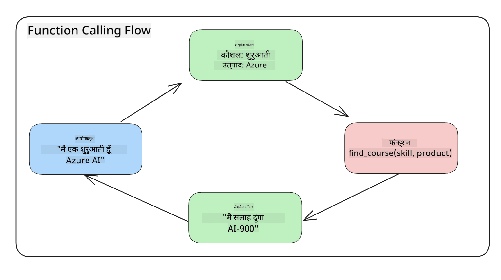
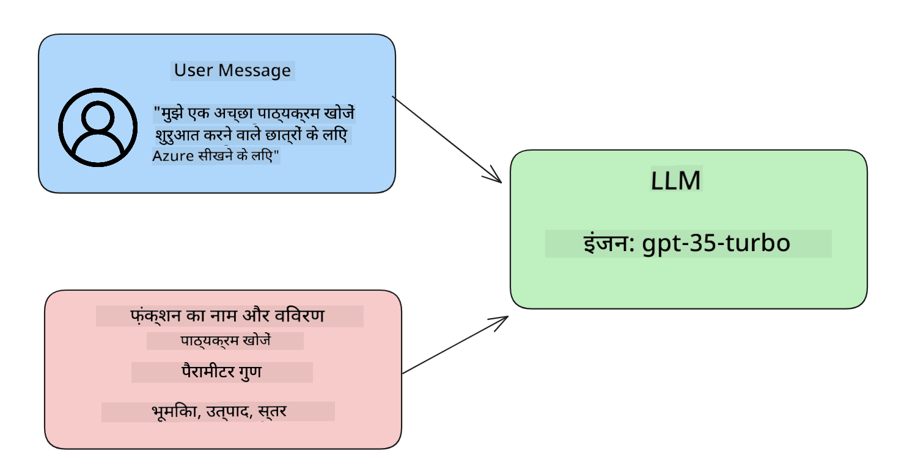

<!--
CO_OP_TRANSLATOR_METADATA:
{
  "original_hash": "77a48a201447be19aa7560706d6f93a0",
  "translation_date": "2025-05-19T21:23:57+00:00",
  "source_file": "11-integrating-with-function-calling/README.md",
  "language_code": "hi"
}
-->
# फ़ंक्शन कॉलिंग के साथ एकीकरण

आपने अब तक पिछले पाठों में काफी कुछ सीख लिया है। हालांकि, हम और सुधार कर सकते हैं। कुछ चीजें जिन्हें हम संबोधित कर सकते हैं, वे हैं कि हम अधिक सुसंगत प्रतिक्रिया प्रारूप कैसे प्राप्त कर सकते हैं ताकि प्रतिक्रिया के साथ काम करना आसान हो सके। इसके अलावा, हम अपने एप्लिकेशन को और समृद्ध करने के लिए अन्य स्रोतों से डेटा जोड़ना चाह सकते हैं।

उपरोक्त समस्याओं को यह अध्याय संबोधित करना चाहता है।

## परिचय

यह पाठ शामिल करेगा:

- फ़ंक्शन कॉलिंग क्या है और इसके उपयोग के मामले।
- Azure OpenAI का उपयोग करके एक फ़ंक्शन कॉल बनाना।
- किसी एप्लिकेशन में फ़ंक्शन कॉल को कैसे एकीकृत करें।

## सीखने के लक्ष्य

इस पाठ के अंत तक, आप सक्षम होंगे:

- फ़ंक्शन कॉलिंग का उपयोग करने के उद्देश्य की व्याख्या करें।
- Azure OpenAI सेवा का उपयोग करके फ़ंक्शन कॉल सेटअप करें।
- आपके एप्लिकेशन के उपयोग के मामले के लिए प्रभावी फ़ंक्शन कॉल डिज़ाइन करें।

## परिदृश्य: हमारे चैटबॉट को फ़ंक्शंस के साथ सुधारना

इस पाठ के लिए, हम अपने शिक्षा स्टार्टअप के लिए एक ऐसी सुविधा बनाना चाहते हैं जो उपयोगकर्ताओं को तकनीकी पाठ्यक्रम खोजने के लिए चैटबॉट का उपयोग करने की अनुमति देती है। हम उन पाठ्यक्रमों की सिफारिश करेंगे जो उनके कौशल स्तर, वर्तमान भूमिका और रुचि की तकनीक के अनुकूल हों।

इस परिदृश्य को पूरा करने के लिए, हम निम्नलिखित का संयोजन करेंगे:

- उपयोगकर्ता के लिए चैट अनुभव बनाने के लिए `Azure OpenAI`।
- उपयोगकर्ता के अनुरोध के आधार पर पाठ्यक्रम खोजने में मदद करने के लिए `Microsoft Learn Catalog API`।
- उपयोगकर्ता की क्वेरी को लें और API अनुरोध करने के लिए इसे एक फ़ंक्शन में भेजें `Function Calling`।

शुरू करने के लिए, आइए देखें कि हम पहले स्थान पर फ़ंक्शन कॉलिंग का उपयोग क्यों करना चाहेंगे:

## क्यों फ़ंक्शन कॉलिंग

फ़ंक्शन कॉलिंग से पहले, LLM से प्रतिक्रियाएँ असंरचित और असंगत थीं। डेवलपर्स को जटिल सत्यापन कोड लिखने की आवश्यकता थी ताकि यह सुनिश्चित किया जा सके कि वे प्रतिक्रिया के प्रत्येक भिन्नता को संभाल सकें। उपयोगकर्ता ऐसे उत्तर प्राप्त नहीं कर सकते थे जैसे "स्टॉकहोम में वर्तमान मौसम क्या है?"। ऐसा इसलिए है क्योंकि मॉडल उन समय तक सीमित थे जब डेटा को प्रशिक्षित किया गया था।

Azure OpenAI सेवा की फ़ंक्शन कॉलिंग निम्नलिखित सीमाओं को दूर करने के लिए एक विशेषता है:

- **सुसंगत प्रतिक्रिया प्रारूप**। यदि हम प्रतिक्रिया प्रारूप को बेहतर ढंग से नियंत्रित कर सकते हैं तो हम प्रतिक्रिया को अन्य प्रणालियों में डाउनस्ट्रीम को अधिक आसानी से एकीकृत कर सकते हैं।
- **बाहरी डेटा**। चैट संदर्भ में एप्लिकेशन के अन्य स्रोतों से डेटा का उपयोग करने की क्षमता।

## समस्या को एक परिदृश्य के माध्यम से चित्रित करना

> यदि आप नीचे दिए गए परिदृश्य को चलाना चाहते हैं तो हम अनुशंसा करते हैं कि आप [शामिल नोटबुक](../../../11-integrating-with-function-calling/python/aoai-assignment.ipynb) का उपयोग करें। आप बस पढ़ भी सकते हैं क्योंकि हम एक समस्या को चित्रित करने की कोशिश कर रहे हैं जहां फ़ंक्शंस समस्या को संबोधित करने में मदद कर सकते हैं।

आइए उस उदाहरण को देखें जो प्रतिक्रिया प्रारूप की समस्या को दर्शाता है:

मान लीजिए कि हम छात्र डेटा का एक डेटाबेस बनाना चाहते हैं ताकि हम उन्हें सही पाठ्यक्रम सुझा सकें। नीचे हमारे पास छात्रों के दो विवरण हैं जो उनके द्वारा दिए गए डेटा में बहुत समान हैं।

1. हमारे Azure OpenAI संसाधन से कनेक्शन बनाएं:

   ```python
   import os
   import json
   from openai import AzureOpenAI
   from dotenv import load_dotenv
   load_dotenv()

   client = AzureOpenAI(
   api_key=os.environ['AZURE_OPENAI_API_KEY'],  # this is also the default, it can be omitted
   api_version = "2023-07-01-preview"
   )

   deployment=os.environ['AZURE_OPENAI_DEPLOYMENT']
   ```

   नीचे कुछ पायथन कोड है जो Azure OpenAI से हमारे कनेक्शन को कॉन्फ़िगर करने के लिए है जहां हम `api_type`, `api_base`, `api_version` and `api_key`.

1. Creating two student descriptions using variables `student_1_description` and `student_2_description` सेट करते हैं।

   ```python
   student_1_description="Emily Johnson is a sophomore majoring in computer science at Duke University. She has a 3.7 GPA. Emily is an active member of the university's Chess Club and Debate Team. She hopes to pursue a career in software engineering after graduating."

   student_2_description = "Michael Lee is a sophomore majoring in computer science at Stanford University. He has a 3.8 GPA. Michael is known for his programming skills and is an active member of the university's Robotics Club. He hopes to pursue a career in artificial intelligence after finishing his studies."
   ```

   हम चाहते हैं कि उपरोक्त छात्र विवरणों को डेटा पार्स करने के लिए LLM को भेजा जाए। इस डेटा का उपयोग बाद में हमारे एप्लिकेशन में किया जा सकता है और इसे API में भेजा जा सकता है या डेटाबेस में संग्रहीत किया जा सकता है।

1. आइए दो समान संकेत बनाएं जिनमें हम LLM को निर्देश दें कि हम किस जानकारी में रुचि रखते हैं:

   ```python
   prompt1 = f'''
   Please extract the following information from the given text and return it as a JSON object:

   name
   major
   school
   grades
   club

   This is the body of text to extract the information from:
   {student_1_description}
   '''

   prompt2 = f'''
   Please extract the following information from the given text and return it as a JSON object:

   name
   major
   school
   grades
   club

   This is the body of text to extract the information from:
   {student_2_description}
   '''
   ```

   उपरोक्त संकेत LLM को जानकारी निकालने और JSON प्रारूप में प्रतिक्रिया लौटाने का निर्देश देते हैं।

1. संकेतों और Azure OpenAI से कनेक्शन सेटअप करने के बाद, हम अब संकेतों को LLM पर भेजेंगे `openai.ChatCompletion`. We store the prompt in the `messages` variable and assign the role to `user` का उपयोग करके। यह एक उपयोगकर्ता से चैटबॉट को लिखे गए संदेश की नकल करने के लिए है।

   ```python
   # response from prompt one
   openai_response1 = client.chat.completions.create(
   model=deployment,
   messages = [{'role': 'user', 'content': prompt1}]
   )
   openai_response1.choices[0].message.content

   # response from prompt two
   openai_response2 = client.chat.completions.create(
   model=deployment,
   messages = [{'role': 'user', 'content': prompt2}]
   )
   openai_response2.choices[0].message.content
   ```

अब हम दोनों अनुरोधों को LLM पर भेज सकते हैं और प्राप्त प्रतिक्रिया की जांच कर सकते हैं जैसे कि `openai_response1['choices'][0]['message']['content']`.

1. Lastly, we can convert the response to JSON format by calling `json.loads`:

   ```python
   # Loading the response as a JSON object
   json_response1 = json.loads(openai_response1.choices[0].message.content)
   json_response1
   ```

   प्रतिक्रिया 1:

   ```json
   {
     "name": "Emily Johnson",
     "major": "computer science",
     "school": "Duke University",
     "grades": "3.7",
     "club": "Chess Club"
   }
   ```

   प्रतिक्रिया 2:

   ```json
   {
     "name": "Michael Lee",
     "major": "computer science",
     "school": "Stanford University",
     "grades": "3.8 GPA",
     "club": "Robotics Club"
   }
   ```

   भले ही संकेत समान हैं और विवरण समान हैं, हम देखते हैं कि `Grades` property formatted differently, as we can sometimes get the format `3.7` or `3.7 GPA` for example.

   This result is because the LLM takes unstructured data in the form of the written prompt and returns also unstructured data. We need to have a structured format so that we know what to expect when storing or using this data

So how do we solve the formatting problem then? By using functional calling, we can make sure that we receive structured data back. When using function calling, the LLM does not actually call or run any functions. Instead, we create a structure for the LLM to follow for its responses. We then use those structured responses to know what function to run in our applications.



We can then take what is returned from the function and send this back to the LLM. The LLM will then respond using natural language to answer the user's query.

## Use Cases for using function calls

There are many different use cases where function calls can improve your app like:

- **Calling External Tools**. Chatbots are great at providing answers to questions from users. By using function calling, the chatbots can use messages from users to complete certain tasks. For example, a student can ask the chatbot to "Send an email to my instructor saying I need more assistance with this subject". This can make a function call to `send_email(to: string, body: string)`

- **Create API or Database Queries**. Users can find information using natural language that gets converted into a formatted query or API request. An example of this could be a teacher who requests "Who are the students that completed the last assignment" which could call a function named `get_completed(student_name: string, assignment: int, current_status: string)`

- **Creating Structured Data**. Users can take a block of text or CSV and use the LLM to extract important information from it. For example, a student can convert a Wikipedia article about peace agreements to create AI flashcards. This can be done by using a function called `get_important_facts(agreement_name: string, date_signed: string, parties_involved: list)`

## Creating Your First Function Call

The process of creating a function call includes 3 main steps:

1. **Calling** the Chat Completions API with a list of your functions and a user message.
2. **Reading** the model's response to perform an action i.e. execute a function or API Call.
3. **Making** another call to Chat Completions API with the response from your function to use that information to create a response to the user.



### Step 1 - creating messages

The first step is to create a user message. This can be dynamically assigned by taking the value of a text input or you can assign a value here. If this is your first time working with the Chat Completions API, we need to define the `role` and the `content` of the message.

The `role` can be either `system` (creating rules), `assistant` (the model) or `user` (the end-user). For function calling, we will assign this as `user` और एक उदाहरण प्रश्न के मानों के बीच अंतर है।

```python
messages= [ {"role": "user", "content": "Find me a good course for a beginner student to learn Azure."} ]
```

विभिन्न भूमिकाएँ सौंपकर, यह LLM के लिए स्पष्ट कर दिया गया है कि क्या सिस्टम कुछ कह रहा है या उपयोगकर्ता, जो एक बातचीत इतिहास बनाने में मदद करता है जिस पर LLM निर्माण कर सकता है।

### चरण 2 - फ़ंक्शंस बनाना

अगला, हम एक फ़ंक्शन और उस फ़ंक्शन के पैरामीटर को परिभाषित करेंगे। हम यहां केवल एक फ़ंक्शन का उपयोग करेंगे जिसे `search_courses` but you can create multiple functions.

> **Important** : Functions are included in the system message to the LLM and will be included in the amount of available tokens you have available.

Below, we create the functions as an array of items. Each item is a function and has properties `name`, `description` and `parameters` कहा जाता है:

```python
functions = [
   {
      "name":"search_courses",
      "description":"Retrieves courses from the search index based on the parameters provided",
      "parameters":{
         "type":"object",
         "properties":{
            "role":{
               "type":"string",
               "description":"The role of the learner (i.e. developer, data scientist, student, etc.)"
            },
            "product":{
               "type":"string",
               "description":"The product that the lesson is covering (i.e. Azure, Power BI, etc.)"
            },
            "level":{
               "type":"string",
               "description":"The level of experience the learner has prior to taking the course (i.e. beginner, intermediate, advanced)"
            }
         },
         "required":[
            "role"
         ]
      }
   }
]
```

आइए नीचे प्रत्येक फ़ंक्शन उदाहरण को अधिक विस्तार से वर्णित करें:

- `name` - The name of the function that we want to have called.
- `description` - This is the description of how the function works. Here it's important to be specific and clear.
- `parameters` - A list of values and format that you want the model to produce in its response. The parameters array consists of items where the items have the following properties:
  1.  `type` - The data type of the properties will be stored in.
  1.  `properties` - List of the specific values that the model will use for its response
      1. `name` - The key is the name of the property that the model will use in its formatted response, for example, `product`.
      1. `type` - The data type of this property, for example, `string`.
      1. `description` - Description of the specific property.

There's also an optional property `required` - required property for the function call to be completed.

### Step 3 - Making the function call

After defining a function, we now need to include it in the call to the Chat Completion API. We do this by adding `functions` to the request. In this case `functions=functions`.

There is also an option to set `function_call` to `auto`. This means we will let the LLM decide which function should be called based on the user message rather than assigning it ourselves.

Here's some code below where we call `ChatCompletion.create`, note how we set `functions=functions` and `function_call="auto"` और इस प्रकार LLM को यह तय करने का विकल्प देना कि हमारे द्वारा प्रदान किए गए फ़ंक्शंस को कब कॉल करना है:

```python
response = client.chat.completions.create(model=deployment,
                                        messages=messages,
                                        functions=functions,
                                        function_call="auto")

print(response.choices[0].message)
```

अब वापस आने वाली प्रतिक्रिया इस प्रकार दिखती है:

```json
{
  "role": "assistant",
  "function_call": {
    "name": "search_courses",
    "arguments": "{\n  \"role\": \"student\",\n  \"product\": \"Azure\",\n  \"level\": \"beginner\"\n}"
  }
}
```

यहां हम देख सकते हैं कि फ़ंक्शन `search_courses` was called and with what arguments, as listed in the `arguments` property in the JSON response.

The conclusion the LLM was able to find the data to fit the arguments of the function as it was extracting it from the value provided to the `messages` parameter in the chat completion call. Below is a reminder of the `messages` मान है:

```python
messages= [ {"role": "user", "content": "Find me a good course for a beginner student to learn Azure."} ]
```

जैसा कि आप देख सकते हैं, `student`, `Azure` and `beginner` was extracted from `messages` and set as input to the function. Using functions this way is a great way to extract information from a prompt but also to provide structure to the LLM and have reusable functionality.

Next, we need to see how we can use this in our app.

## Integrating Function Calls into an Application

After we have tested the formatted response from the LLM, we can now integrate this into an application.

### Managing the flow

To integrate this into our application, let's take the following steps:

1. First, let's make the call to the OpenAI services and store the message in a variable called `response_message`।

   ```python
   response_message = response.choices[0].message
   ```

1. अब हम वह फ़ंक्शन परिभाषित करेंगे जो Microsoft Learn API को पाठ्यक्रमों की सूची प्राप्त करने के लिए कॉल करेगा:

   ```python
   import requests

   def search_courses(role, product, level):
     url = "https://learn.microsoft.com/api/catalog/"
     params = {
        "role": role,
        "product": product,
        "level": level
     }
     response = requests.get(url, params=params)
     modules = response.json()["modules"]
     results = []
     for module in modules[:5]:
        title = module["title"]
        url = module["url"]
        results.append({"title": title, "url": url})
     return str(results)
   ```

   ध्यान दें कि हम अब एक वास्तविक पायथन फ़ंक्शन बनाते हैं जो `functions` variable. We're also making real external API calls to fetch the data we need. In this case, we go against the Microsoft Learn API to search for training modules.

Ok, so we created `functions` variables and a corresponding Python function, how do we tell the LLM how to map these two together so our Python function is called?

1. To see if we need to call a Python function, we need to look into the LLM response and see if `function_call` में पेश किए गए फ़ंक्शन नामों को मैप करता है और इंगित किए गए फ़ंक्शन को कॉल करता है। यहां बताया गया है कि आप नीचे दिए गए चेक को कैसे बना सकते हैं:

   ```python
   # Check if the model wants to call a function
   if response_message.function_call.name:
    print("Recommended Function call:")
    print(response_message.function_call.name)
    print()

    # Call the function.
    function_name = response_message.function_call.name

    available_functions = {
            "search_courses": search_courses,
    }
    function_to_call = available_functions[function_name]

    function_args = json.loads(response_message.function_call.arguments)
    function_response = function_to_call(**function_args)

    print("Output of function call:")
    print(function_response)
    print(type(function_response))


    # Add the assistant response and function response to the messages
    messages.append( # adding assistant response to messages
        {
            "role": response_message.role,
            "function_call": {
                "name": function_name,
                "arguments": response_message.function_call.arguments,
            },
            "content": None
        }
    )
    messages.append( # adding function response to messages
        {
            "role": "function",
            "name": function_name,
            "content":function_response,
        }
    )
   ```

   ये तीन पंक्तियाँ सुनिश्चित करती हैं कि हम फ़ंक्शन नाम, तर्क निकालते हैं और कॉल करते हैं:

   ```python
   function_to_call = available_functions[function_name]

   function_args = json.loads(response_message.function_call.arguments)
   function_response = function_to_call(**function_args)
   ```

   नीचे हमारे कोड को चलाने से आउटपुट है:

   **आउटपुट**

   ```Recommended Function call:
   {
     "name": "search_courses",
     "arguments": "{\n  \"role\": \"student\",\n  \"product\": \"Azure\",\n  \"level\": \"beginner\"\n}"
   }

   Output of function call:
   [{'title': 'Describe concepts of cryptography', 'url': 'https://learn.microsoft.com/training/modules/describe-concepts-of-cryptography/?
   WT.mc_id=api_CatalogApi'}, {'title': 'Introduction to audio classification with TensorFlow', 'url': 'https://learn.microsoft.com/en-
   us/training/modules/intro-audio-classification-tensorflow/?WT.mc_id=api_CatalogApi'}, {'title': 'Design a Performant Data Model in Azure SQL
   Database with Azure Data Studio', 'url': 'https://learn.microsoft.com/training/modules/design-a-data-model-with-ads/?
   WT.mc_id=api_CatalogApi'}, {'title': 'Getting started with the Microsoft Cloud Adoption Framework for Azure', 'url':
   'https://learn.microsoft.com/training/modules/cloud-adoption-framework-getting-started/?WT.mc_id=api_CatalogApi'}, {'title': 'Set up the
   Rust development environment', 'url': 'https://learn.microsoft.com/training/modules/rust-set-up-environment/?WT.mc_id=api_CatalogApi'}]
   <class 'str'>
   ```

1. अब हम अपडेटेड संदेश, `messages` को LLM पर भेजेंगे ताकि हम API JSON स्वरूपित प्रतिक्रिया के बजाय एक प्राकृतिक भाषा प्रतिक्रिया प्राप्त कर सकें।

   ```python
   print("Messages in next request:")
   print(messages)
   print()

   second_response = client.chat.completions.create(
      messages=messages,
      model=deployment,
      function_call="auto",
      functions=functions,
      temperature=0
         )  # get a new response from GPT where it can see the function response


   print(second_response.choices[0].message)
   ```

   **आउटपुट**

   ```python
   {
     "role": "assistant",
     "content": "I found some good courses for beginner students to learn Azure:\n\n1. [Describe concepts of cryptography] (https://learn.microsoft.com/training/modules/describe-concepts-of-cryptography/?WT.mc_id=api_CatalogApi)\n2. [Introduction to audio classification with TensorFlow](https://learn.microsoft.com/training/modules/intro-audio-classification-tensorflow/?WT.mc_id=api_CatalogApi)\n3. [Design a Performant Data Model in Azure SQL Database with Azure Data Studio](https://learn.microsoft.com/training/modules/design-a-data-model-with-ads/?WT.mc_id=api_CatalogApi)\n4. [Getting started with the Microsoft Cloud Adoption Framework for Azure](https://learn.microsoft.com/training/modules/cloud-adoption-framework-getting-started/?WT.mc_id=api_CatalogApi)\n5. [Set up the Rust development environment](https://learn.microsoft.com/training/modules/rust-set-up-environment/?WT.mc_id=api_CatalogApi)\n\nYou can click on the links to access the courses."
   }

   ```

## असाइनमेंट

Azure OpenAI फ़ंक्शन कॉलिंग के अपने सीखने को जारी रखने के लिए आप बना सकते हैं:

- फ़ंक्शन के अधिक पैरामीटर जो शिक्षार्थियों को अधिक पाठ्यक्रम खोजने में मदद कर सकते हैं।
- एक और फ़ंक्शन कॉल बनाएं जो शिक्षार्थी से उनकी मूल भाषा जैसी अधिक जानकारी लेता है
- जब फ़ंक्शन कॉल और/या API कॉल कोई उपयुक्त पाठ्यक्रम वापस नहीं करता है तो त्रुटि प्रबंधन बनाएं

संकेत: यह देखने के लिए [Learn API संदर्भ प्रलेखन](https://learn.microsoft.com/training/support/catalog-api-developer-reference?WT.mc_id=academic-105485-koreyst) पृष्ठ का अनुसरण करें कि यह डेटा कैसे और कहाँ उपलब्ध है।

## शानदार काम! यात्रा जारी रखें

इस पाठ को पूरा करने के बाद, हमारे [जनरेटिव एआई लर्निंग संग्रह](https://aka.ms/genai-collection?WT.mc_id=academic-105485-koreyst) को देखें ताकि अपने जनरेटिव एआई ज्ञान को और बढ़ा सकें!

पाठ 12 पर जाएं, जहां हम देखेंगे कि [एआई अनुप्रयोगों के लिए UX कैसे डिज़ाइन करें](../12-designing-ux-for-ai-applications/README.md?WT.mc_id=academic-105485-koreyst)!

**अस्वीकरण**:  
यह दस्तावेज़ AI अनुवाद सेवा [Co-op Translator](https://github.com/Azure/co-op-translator) का उपयोग करके अनुवादित किया गया है। जबकि हम सटीकता के लिए प्रयासरत हैं, कृपया ध्यान दें कि स्वचालित अनुवाद में त्रुटियाँ या अशुद्धियाँ हो सकती हैं। मूल भाषा में मूल दस्तावेज़ को आधिकारिक स्रोत माना जाना चाहिए। महत्वपूर्ण जानकारी के लिए, पेशेवर मानव अनुवाद की सिफारिश की जाती है। इस अनुवाद के उपयोग से उत्पन्न किसी भी गलतफहमी या गलत व्याख्या के लिए हम उत्तरदायी नहीं हैं।