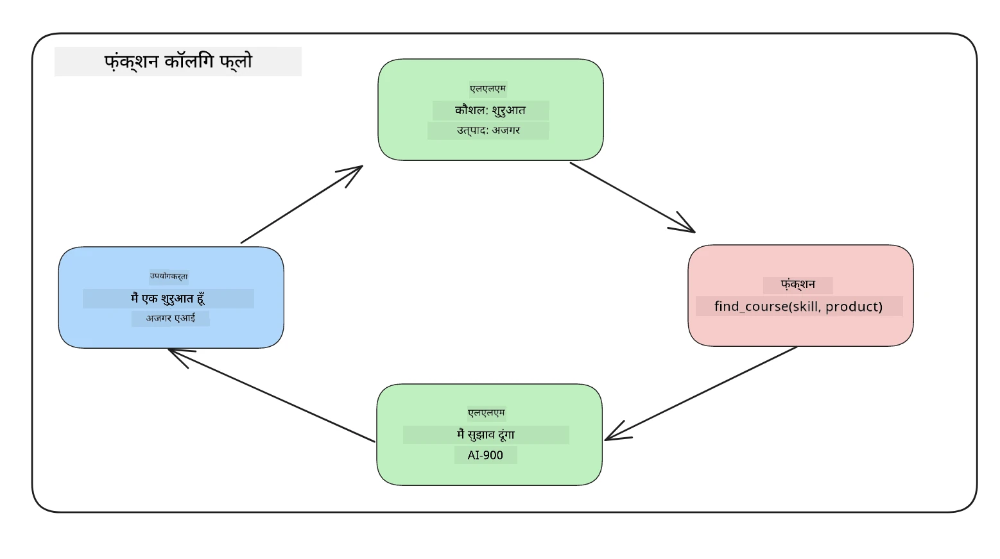
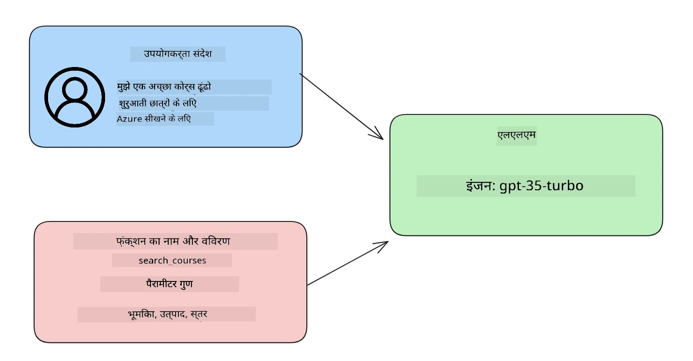

# फ़ंक्शन कॉलिंग के साथ एकीकरण

[](https://youtu.be/DgUdCLX8qYQ?si=f1ouQU5HQx6F8Gl2)

आपने अब तक पिछले पाठों में काफी कुछ सीखा है। हालांकि, हम और बेहतर कर सकते हैं। कुछ चीज़ों को संबोधित किया जा सकता है जैसे कि हम एक अधिक सुसंगत प्रतिक्रिया प्रारूप कैसे प्राप्त कर सकते हैं ताकि प्रतिक्रिया के साथ नीचे के काम को आसान बनाया जा सके। इसके अलावा, हम अपने एप्लिकेशन को और समृद्ध बनाने के लिए अन्य स्रोतों से डेटा जोड़ना भी चाहते हैं।

उपरोक्त उल्लिखित समस्याएँ इस अध्याय के समाधान का उद्देश्य हैं।

## परिचय

इस पाठ में निम्नलिखित कवर किया जाएगा:

- फ़ंक्शन कॉलिंग क्या है और इसके उपयोग के मामले समझाएं।
- Azure OpenAI का उपयोग करके फ़ंक्शन कॉल बनाना।
- किसी एप्लिकेशन में फ़ंक्शन कॉल कैसे एकीकृत करें।

## सीखने के लक्ष्य

इस पाठ के अंत तक, आप सक्षम होंगे:

- फ़ंक्शन कॉलिंग का उद्देश्य समझाएं।
- Azure OpenAI सेवा का उपयोग करके फ़ंक्शन कॉल सेटअप करें।
- अपने एप्लिकेशन के उपयोग के लिए प्रभावी फ़ंक्शन कॉल डिज़ाइन करें।

## परिदृश्य: अपने चैटबोट को फ़ंक्शन्स के साथ सुधारना

इस पाठ के लिए, हम अपने शिक्षा स्टार्टअप के लिए एक फीचर बनाना चाहते हैं जो उपयोगकर्ताओं को तकनीकी कोर्स खोजने के लिए चैटबोट का उपयोग करने की अनुमति दे। हम उनके कौशल स्तर, वर्तमान भूमिका और रुचि की तकनीक के अनुसार उपयुक्त कोर्स सुझाएंगे।

इस परिदृश्य को पूरा करने के लिए, हम निम्नलिखित का संयोजन उपयोग करेंगे:

- `Azure OpenAI` उपयोगकर्ता के लिए एक चैट अनुभव बनाने के लिए।
- `Microsoft Learn Catalog API` उपयोगकर्ताओं को उनके अनुरोध के आधार पर कोर्स खोजने में मदद करने के लिए।
- `Function Calling` उपयोगकर्ता की क्वेरी लेकर उसे फ़ंक्शन में भेजकर API अनुरोध करने के लिए।

शुरू करने के लिए, चलिए देखते हैं कि हमें सबसे पहले फ़ंक्शन कॉलिंग क्यों चाहिए:

## फ़ंक्शन कॉलिंग क्यों

फ़ंक्शन कॉलिंग से पहले, LLM से प्रतिक्रियाएँ असंरचित और असंगत होती थीं। डेवलपर्स को प्रत्येक प्रतिक्रिया के विभिन्न रूप संभालने के लिए जटिल सत्यापन कोड लिखना पड़ता था। उपयोगकर्ता ऐसे प्रश्नों के उत्तर नहीं प्राप्त कर सकते थे जैसे "स्टॉकहोम में वर्तमान मौसम क्या है?"। इसका कारण यह था कि मॉडल केवल उस समय तक के डेटा पर सीमित थे जब वे प्रशिक्षित हुए थे।

फ़ंक्शन कॉलिंग Azure OpenAI सेवा की एक विशेषता है जो निम्नलिखित सीमाओं को दूर करती है:

- **सुसंगत प्रतिक्रिया प्रारूप**। यदि हम प्रतिक्रिया प्रारूप को बेहतर नियंत्रित कर सकें, तो हम प्रतिक्रिया को नीचे के अन्य सिस्टमों में अधिक आसानी से एकीकृत कर सकते हैं।
- **बाहरी डेटा**। चैट संदर्भ में किसी एप्लिकेशन के अन्य स्रोतों से डेटा का उपयोग करने की क्षमता।

## एक परिदृश्य के माध्यम से समस्या का चित्रण

> हम सलाह देते हैं कि यदि आप नीचे के परिदृश्य को चलाना चाहते हैं तो [शामिल नोटबुक](./python/aoai-assignment.ipynb?WT.mc_id=academic-105485-koreyst) का उपयोग करें। आप केवल पढ़ भी सकते हैं क्योंकि हम एक समस्या को चित्रित करने की कोशिश कर रहे हैं जहां फ़ंक्शन समस्या को संबोधित कर सकते हैं।

आइए उस उदाहरण को देखें जो प्रतिक्रिया प्रारूप समस्या को दर्शाता है:

मान लीजिए कि हम एक छात्र डेटा का डेटाबेस बनाना चाहते हैं ताकि हम उन्हें सही कोर्स सुझाव दे सकें। नीचे हमारे पास दो छात्र विवरण हैं जो डेटा में बहुत समान हैं।

1. हमारे Azure OpenAI संसाधन से कनेक्शन बनाएं:

   ```python
   import os
   import json
   from openai import OpenAI
   from dotenv import load_dotenv
   load_dotenv()

   # रिस्पॉन्सेस API Azure OpenAI (Microsoft Foundry) v1 एन्डपॉइंट से सर्व की जाती है
   # इसलिए हम OpenAI क्लाइंट को <your-endpoint>/openai/v1/ पर इंगित करते हैं।
   endpoint = os.environ['AZURE_OPENAI_ENDPOINT']
   client = OpenAI(
   api_key=os.environ['AZURE_OPENAI_API_KEY'],
   base_url=f"{endpoint.rstrip('/')}/openai/v1/",
   )

   deployment=os.environ['AZURE_OPENAI_DEPLOYMENT']
   ```

   नीचे Azure OpenAI से कनेक्शन कॉन्फ़िगर करने के लिए कुछ Python कोड है। क्योंकि हम v1 endpoint का उपयोग करते हैं, हमें केवल `api_key` और `base_url` सेट करना होता है (कोई `api_version` आवश्यक नहीं है)।

1. दो छात्र विवरण `student_1_description` और `student_2_description` नामक वेरिएबल्स का उपयोग करके बनाए।

   ```python
   student_1_description="Emily Johnson is a sophomore majoring in computer science at Duke University. She has a 3.7 GPA. Emily is an active member of the university's Chess Club and Debate Team. She hopes to pursue a career in software engineering after graduating."

   student_2_description = "Michael Lee is a sophomore majoring in computer science at Stanford University. He has a 3.8 GPA. Michael is known for his programming skills and is an active member of the university's Robotics Club. He hopes to pursue a career in artificial intelligence after finishing his studies."
   ```

   हम उपरोक्त छात्र विवरण LLM को भेजना चाहते हैं ताकि वह डेटा को पार्स कर सके। इस डेटा का उपयोग बाद में हमारे एप्लिकेशन में किया जा सकता है और API को भेजा या डेटाबेस में संग्रहित किया जा सकता है।

1. चलिए दो समान प्रॉम्प्ट बनाते हैं जिनमें हम LLM को बताते हैं कि हमें किस जानकारी में रुचि है:

   ```python
   prompt1 = f'''
   Please extract the following information from the given text and return it as a JSON object:

   name
   major
   school
   grades
   club

   This is the body of text to extract the information from:
   {student_1_description}
   '''

   prompt2 = f'''
   Please extract the following information from the given text and return it as a JSON object:

   name
   major
   school
   grades
   club

   This is the body of text to extract the information from:
   {student_2_description}
   '''
   ```

   उपरोक्त प्रॉम्प्ट LLM को निर्देशित करते हैं कि वह जानकारी निकाले और JSON प्रारूप में प्रतिक्रिया लौटाए।

1. प्रॉम्प्ट और Azure OpenAI से कनेक्शन सेट करने के बाद, हम `client.responses.create` का उपयोग करके प्रॉम्प्ट LLM को भेजेंगे। हम प्रॉम्प्ट को `input` वेरिएबल में संग्रहित करते हैं और भूमिका `user` देते हैं। यह उपयोगकर्ता से चैटबोट को संदेश भेजे जाने का अनुकरण करता है।

   ```python
   # प्रॉम्प्ट एक से प्रतिक्रिया
   openai_response1 = client.responses.create(
   model=deployment,
   input = [{'role': 'user', 'content': prompt1}],
   store=False,
   )
   openai_response1.output_text

   # प्रॉम्प्ट दो से प्रतिक्रिया
   openai_response2 = client.responses.create(
   model=deployment,
   input = [{'role': 'user', 'content': prompt2}],
   store=False,
   )
   openai_response2.output_text
   ```

अब हम दोनों अनुरोध LLM को भेज सकते हैं और प्राप्त प्रतिक्रिया की जांच कर सकते हैं जैसे `openai_response1.output_text`।

1. अंत में, हम प्रतिक्रिया को JSON प्रारूप में बदल सकते हैं `json.loads` कॉल करके:

   ```python
   # प्रतिक्रिया को JSON ऑब्जेक्ट के रूप में लोड करना
   json_response1 = json.loads(openai_response1.output_text)
   json_response1
   ```

   प्रतिक्रिया 1:

   ```json
   {
     "name": "Emily Johnson",
     "major": "computer science",
     "school": "Duke University",
     "grades": "3.7",
     "club": "Chess Club"
   }
   ```

   प्रतिक्रिया 2:

   ```json
   {
     "name": "Michael Lee",
     "major": "computer science",
     "school": "Stanford University",
     "grades": "3.8 GPA",
     "club": "Robotics Club"
   }
   ```

   भले ही प्रॉम्प्ट समान हों और विवरण मिलते-जुलते हों, हम `Grades` संपत्ति के मानों को अलग-अलग स्वरूपों में देखते हैं, जैसे कभी-कभी `3.7` या `3.7 GPA` जैसे प्रारूप मिलते हैं।

   यह परिणाम इसलिए है क्योंकि LLM असंरचित डेटा की तरह लिखित प्रॉम्प्ट लेता है और असंरचित डेटा भी लौटाता है। हमें एक संरचित प्रारूप की आवश्यकता है ताकि जब हम इसे संग्रहीत या उपयोग करें तो हमें पता हो कि क्या अपेक्षित है।

तो फिर हम स्वरूपण समस्या को कैसे हल करें? फ़ंक्शन कॉलिंग का उपयोग करके, हम सुनिश्चित कर सकते हैं कि हमें संरचित डेटा वापस मिले। फ़ंक्शन कॉलिंग का उपयोग करते समय, LLM वास्तव में कोई फ़ंक्शन कॉल या चलाता नहीं है। इसके बजाय, हम एक संरचना बनाते हैं जिसका LLM को अपनी प्रतिक्रियाओं के लिए पालन करना होता है। फिर हम उन संरचित प्रतिक्रियाओं का उपयोग करते हैं यह जानने के लिए कि हमारे एप्लिकेशन में कौन सा फ़ंक्शन चलाना है।



हम तब फ़ंक्शन से वापस आये डेटा को LLM को फिर से भेज सकते हैं। LLM तब प्राकृतिक भाषा में उत्तर देगा ताकि उपयोगकर्ता की क्वेरी का जवाब दे सके।

## फ़ंक्शन कॉल का उपयोग करने के मामले

ऐसे कई उपयोग मामले हैं जहां फ़ंक्शन कॉल आपके ऐप के लिए सुधार कर सकते हैं जैसे:

- **बाहरी उपकरण कॉल करना**। चैटबॉट प्रश्नों के उत्तर प्रदान करने में बहुत अच्छे होते हैं। फ़ंक्शन कॉलिंग का उपयोग करके, चैटबॉट उपयोगकर्ता के संदेशों का उपयोग करते हुए कुछ कार्य पूरे कर सकते हैं। उदाहरण के लिए, एक छात्र चैटबॉट से कह सकता है "मेरे प्रशिक्षक को एक ईमेल भेजो जिसमें कहो मुझे इस विषय में अधिक सहायता चाहिए"। यह एक फ़ंक्शन कॉल कर सकता है `send_email(to: string, body: string)`

- **API या डेटाबेस क्वेरी बनाना**। उपयोगकर्ता प्राकृतिक भाषा में जानकारी खोज सकते हैं जो एक सुव्यवस्थित क्वेरी या API अनुरोध में परिवर्तित हो जाती है। इसका एक उदाहरण हो सकता है एक शिक्षक जो पूछता है "वे छात्र कौन हैं जिन्होंने पिछला असाइनमेंट पूरा किया", जो एक फ़ंक्शन को कॉल कर सकता है `get_completed(student_name: string, assignment: int, current_status: string)`

- **संरचित डेटा बनाना**। उपयोगकर्ता किसी टेक्स्ट ब्लॉक या CSV का उपयोग करके LLM से महत्वपूर्ण जानकारी निकाल सकते हैं। उदाहरण के लिए, एक छात्र शांति समझौते पर विकिपीडिया लेख को AI फ्लैशकार्ड बनाने के लिए परिवर्तित कर सकता है। इसे एक फ़ंक्शन का उपयोग करके किया जा सकता है जिसे कहा जाता है `get_important_facts(agreement_name: string, date_signed: string, parties_involved: list)`

## अपनी पहली फ़ंक्शन कॉल बनाना

फ़ंक्शन कॉल बनाने की प्रक्रिया में 3 मुख्य चरण होते हैं:

1. अपनी फ़ंक्शंस (उपकरणों) की सूची और एक उपयोगकर्ता संदेश के साथ Responses API को कॉल करना।
2. मॉडल की प्रतिक्रिया पढ़ना ताकि कोई कार्रवाई की जा सके अर्थात् फ़ंक्शन या API कॉल निष्पादित करें।
3. अपनी फ़ंक्शन से प्राप्त प्रतिक्रिया के साथ Responses API को फिर से कॉल करना ताकि उस जानकारी का उपयोग उपयोगकर्ता के लिए प्रतिक्रिया बनाने में किया जा सके।



### चरण 1 - संदेश बनाना

पहला चरण उपयोगकर्ता संदेश बनाना है। इसे टेक्स्ट इनपुट का मान लेकर डायनामिक रूप से सौंपा जा सकता है या आप यहां मूल्य निर्दिष्ट कर सकते हैं। यदि यह आपकी Responses API के साथ पहली बार काम है, तो हमें संदेश की `role` और `content` परिभाषित करनी होती है।

`role` हो सकता है `system` (नियम बनाना), `assistant` (मॉडल) या `user` (अंत उपयोगकर्ता)। फ़ंक्शन कॉलिंग के लिए, हम इसे `user` और एक उदाहरण प्रश्न के रूप में देंगे।

```python
messages= [ {"role": "user", "content": "Find me a good course for a beginner student to learn Azure."} ]
```

विभिन्न भूमिकाएँ निर्दिष्ट करने से LLM को यह स्पष्ट होता है कि यह सिस्टम कह रहा है या उपयोगकर्ता, जो कि एक वार्तालाप इतिहास बनाने में मदद करता है जिस पर LLM आगे निर्माण कर सकता है।

### चरण 2 - फ़ंक्शन बनाना

इसके बाद, हम एक फ़ंक्शन और उसके पैरामीटर परिभाषित करेंगे। हम यहाँ केवल एक फ़ंक्शन का उपयोग करेंगे जिसका नाम `search_courses` है लेकिन आप कई फ़ंक्शन बना सकते हैं।

> **महत्वपूर्ण** : फ़ंक्शंस LLM को सिस्टम संदेश में शामिल होते हैं और आपके उपलब्ध टोकनों की मात्रा में शामिल होंगे।

नीचे, हम फ़ंक्शंस को आइटम्स की एक सरणी के रूप में बनाते हैं। प्रत्येक आइटम Responses API के सपाट प्रारूप में एक टूल है, जिसमें गुण होते हैं `type`, `name`, `description` और `parameters`:

```python
functions = [
   {
      "type":"function",
      "name":"search_courses",
      "description":"Retrieves courses from the search index based on the parameters provided",
      "parameters":{
         "type":"object",
         "properties":{
            "role":{
               "type":"string",
               "description":"The role of the learner (i.e. developer, data scientist, student, etc.)"
            },
            "product":{
               "type":"string",
               "description":"The product that the lesson is covering (i.e. Azure, Power BI, etc.)"
            },
            "level":{
               "type":"string",
               "description":"The level of experience the learner has prior to taking the course (i.e. beginner, intermediate, advanced)"
            }
         },
         "required":[
            "role"
         ]
      }
   }
]
```

आइए नीचे प्रत्येक फ़ंक्शन उदाहरण का अधिक विवरण में वर्णन करें:

- `name` - उस फ़ंक्शन का नाम जिसे हम कॉल करना चाहते हैं।
- `description` - फ़ंक्शन कैसे काम करता है इसका वर्णन। यहाँ विशिष्ट और स्पष्ट होना महत्वपूर्ण है।
- `parameters` - उन मानों और प्रारूपों की सूची जिन्हें आप चाहते हैं कि मॉडल अपनी प्रतिक्रिया में उत्पन्न करे। पैरामीटर सरणी में ऐसे आइटम होते हैं जिनके पास निम्नलिखित गुण होते हैं:
  1. `type` - वह डेटा प्रकार जिसमें गुण स्टोर होंगे।
  1. `properties` - विशिष्ट मानों की सूची जो मॉडल अपनी प्रतिक्रिया में उपयोग करेगा
      1. `name` - वह कुंजी जो मॉडल अपनी स्वरूपित प्रतिक्रिया में उपयोग करेगा, उदाहरण के लिए, `product`।
      1. `type` - इस गुण का डेटा प्रकार, उदाहरण के लिए, `string`।
      1. `description` - विशिष्ट गुण का वर्णन।

एक वैकल्पिक गुण `required` भी है - फ़ंक्शन कॉल पूरा करने के लिए आवश्यक गुण।

### चरण 3 - फ़ंक्शन कॉल बनाना

फ़ंक्शन परिभाषित करने के बाद, अब हमें इसे Responses API कॉल में शामिल करना होगा। हम यह `tools` जोड़कर करते हैं। इस मामले में `tools=functions`।

एक विकल्प के रूप में `tool_choice` को `auto` सेट करने का भी विकल्प है। इसका अर्थ है कि हम उपयोगकर्ता संदेश के आधार पर LLM को निर्णय लेने देंगे कि कौन सा फ़ंक्शन कॉल किया जाना चाहिए बजाय इसे स्वयं निर्धारित करने के।

नीचे कुछ कोड है जिसमें हम `client.responses.create` कॉल करते हैं, ध्यान दें कि हमने `tools=functions` और `tool_choice="auto"` सेट किया है और इस प्रकार LLM को यह चयन देने के लिए कि कब फ़ंक्शंस कॉल करें:

```python
response = client.responses.create(model=deployment,
                                        input=messages,
                                        tools=functions,
                                        tool_choice="auto",
                                        store=False)

print(response.output)
```

अब प्रतिक्रिया में `response.output` में `function_call` आइटम शामिल होता है जो ऐसा दिखता है:

```json
{
  "type": "function_call",
  "name": "search_courses",
  "call_id": "call_abc123",
  "arguments": "{\n  \"role\": \"student\",\n  \"product\": \"Azure\",\n  \"level\": \"beginner\"\n}"
}
```

यहाँ हम देख सकते हैं कि फ़ंक्शन `search_courses` को कैसे कॉल किया गया और किस आर्गुमेंट्स के साथ, जो JSON प्रतिक्रिया में `arguments` गुण में सूचीबद्ध हैं।

निष्कर्ष यह है कि LLM वह डेटा निकालने में सक्षम था जो फ़ंक्शन के आर्गुमेंट्स में फिट हुआ क्योंकि वह इसे Responses API कॉल में `input` पैरामीटर में दिए गए मान से निकाल रहा था। नीचे `messages` मान का पुनः स्मरण है:

```python
messages= [ {"role": "user", "content": "Find me a good course for a beginner student to learn Azure."} ]
```

जैसा कि आप देख सकते हैं, `student`, `Azure` और `beginner` `messages` से निकाले गए और फ़ंक्शन के इनपुट के रूप में सेट किए गए। इस तरह फ़ंक्शंस का उपयोग एक प्रॉम्प्ट से जानकारी निकालने का एक अच्छा तरीका है, साथ ही LLM को संरचना प्रदान करने और पुन: उपयोगी कार्यक्षमता होने का भी तरीका है।

अब हमें यह देखना है कि हम इसे अपने ऐप में कैसे उपयोग कर सकते हैं।

## फ़ंक्शन कॉल्स को एप्लिकेशन में एकीकृत करना

LLM से प्रारूपित प्रतिक्रिया का परीक्षण करने के बाद, अब हम इसे एप्लिकेशन में एकीकृत कर सकते हैं।

### फ्लो का प्रबंधन करना

इसे अपने एप्लिकेशन में एकीकृत करने के लिए, आइए निम्नलिखित चरण लें:

1. पहले, OpenAI सेवाओं को कॉल करें और प्रतिक्रिया `output` से फ़ंक्शन कॉल आइटम निकालें।

   ```python
   response_items = response.output
   tool_calls = [item for item in response_items if item.type == "function_call"]
   ```

1. अब हम वह फ़ंक्शन परिभाषित करेंगे जो Microsoft Learn API को कॉल करेगा ताकि कोर्स की सूची प्राप्त हो सके:

   ```python
   import requests

   def search_courses(role, product, level):
     url = "https://learn.microsoft.com/api/catalog/"
     params = {
        "role": role,
        "product": product,
        "level": level
     }
     response = requests.get(url, params=params)
     modules = response.json()["modules"]
     results = []
     for module in modules[:5]:
        title = module["title"]
        url = module["url"]
        results.append({"title": title, "url": url})
     return str(results)
   ```

   ध्यान दें कि हमने अब एक वास्तविक Python फ़ंक्शन बनाया है जो `functions` वेरिएबल में प्रस्तुत फ़ंक्शन नामों से मेल खाता है। हम डेटा प्राप्त करने के लिए वास्तविक बाहरी API कॉल भी कर रहे हैं। इस मामले में, हम Microsoft Learn API के खिलाफ प्रशिक्षण मॉड्यूल खोजते हैं।

ठीक है, तो हमने `functions` वेरिएबल बनाई और संबंधित Python फ़ंक्शन बनाया, अब हम LLM को कैसे बताएंगे कि ये दोनों कैसे मैप करें ताकि हमारा Python फ़ंक्शन कॉल हो?

1. यह देखने के लिए कि क्या हमें Python फ़ंक्शन कॉल करनी है, हमें LLM की प्रतिक्रिया देखनी होगी और देखना होगा कि क्या उसमें `function_call` आइटम है और निर्दिष्ट फ़ंक्शन कॉल करना होगा। नीचे बताए गए तरीके से आप यह जांच कर सकते हैं:

   ```python
   # जांचें कि क्या मॉडल कोई फ़ंक्शन कॉल करना चाहता है
   if tool_calls:
    for tool_call in tool_calls:
     print("Recommended Function call:")
     print(tool_call.name)
     print()

     # फ़ंक्शन कॉल करें।
     function_name = tool_call.name

     available_functions = {
             "search_courses": search_courses,
     }
     function_to_call = available_functions[function_name]

     function_args = json.loads(tool_call.arguments)
     function_response = function_to_call(**function_args)

     print("Output of function call:")
     print(function_response)
     print(type(function_response))

     # फ़ंक्शन कॉल और उसके परिणाम को बातचीत में वापस जोड़ें।
     # मॉडल का function_call आइटम उसके आउटपुट से पहले जोड़ा जाना चाहिए।
     messages.append(tool_call)  # सहायक का function_call आइटम
     messages.append( # फ़ंक्शन परिणाम
         {
             "type": "function_call_output",
             "call_id": tool_call.call_id,
             "output": function_response,
         }
     )
   ```

   ये तीन लाइने सुनिश्चित करती हैं कि हम फ़ंक्शन नाम, आर्गुमेंट्स निकालें और कॉल करें:

   ```python
   function_to_call = available_functions[function_name]

   function_args = json.loads(tool_call.arguments)
   function_response = function_to_call(**function_args)
   ```

   नीचे हमारे कोड चलाने का आउटपुट है:

   **आउटपुट**

   ```Recommended Function call:
   {
     "name": "search_courses",
     "arguments": "{\n  \"role\": \"student\",\n  \"product\": \"Azure\",\n  \"level\": \"beginner\"\n}"
   }

   Output of function call:
   [{'title': 'Describe concepts of cryptography', 'url': 'https://learn.microsoft.com/training/modules/describe-concepts-of-cryptography/?
   WT.mc_id=api_CatalogApi'}, {'title': 'Introduction to audio classification with TensorFlow', 'url': 'https://learn.microsoft.com/en-
   us/training/modules/intro-audio-classification-tensorflow/?WT.mc_id=api_CatalogApi'}, {'title': 'Design a Performant Data Model in Azure SQL
   Database with Azure Data Studio', 'url': 'https://learn.microsoft.com/training/modules/design-a-data-model-with-ads/?
   WT.mc_id=api_CatalogApi'}, {'title': 'Getting started with the Microsoft Cloud Adoption Framework for Azure', 'url':
   'https://learn.microsoft.com/training/modules/cloud-adoption-framework-getting-started/?WT.mc_id=api_CatalogApi'}, {'title': 'Set up the
   Rust development environment', 'url': 'https://learn.microsoft.com/training/modules/rust-set-up-environment/?WT.mc_id=api_CatalogApi'}]
   <class 'str'>
   ```

1. अब हम अपडेटेड संदेश `messages` को LLM को भेजेंगे ताकि हम API JSON स्वरूपित प्रतिक्रिया के बजाय प्राकृतिक भाषा में प्रतिक्रिया प्राप्त कर सकें।

   ```python
   print("Messages in next request:")
   print(messages)
   print()

   second_response = client.responses.create(
      input=messages,
      model=deployment,
      tool_choice="auto",
      tools=functions,
      temperature=0,
      store=False,
         )  # मॉडल से एक नया उत्तर प्राप्त करें जहाँ यह फ़ंक्शन उत्तर को देख सकता है


   print(second_response.output_text)
   ```

   **आउटपुट**

   ```text
   I found some good courses for beginner students to learn Azure:

   1. [Describe concepts of cryptography](https://learn.microsoft.com/training/modules/describe-concepts-of-cryptography/?WT.mc_id=api_CatalogApi)
   2. [Introduction to audio classification with TensorFlow](https://learn.microsoft.com/training/modules/intro-audio-classification-tensorflow/?WT.mc_id=api_CatalogApi)
   3. [Design a Performant Data Model in Azure SQL Database with Azure Data Studio](https://learn.microsoft.com/training/modules/design-a-data-model-with-ads/?WT.mc_id=api_CatalogApi)
   4. [Getting started with the Microsoft Cloud Adoption Framework for Azure](https://learn.microsoft.com/training/modules/cloud-adoption-framework-getting-started/?WT.mc_id=api_CatalogApi)
   5. [Set up the Rust development environment](https://learn.microsoft.com/training/modules/rust-set-up-environment/?WT.mc_id=api_CatalogApi)

   You can click on the links to access the courses.
   ```

## असाइनमेंट

Azure OpenAI फ़ंक्शन कॉलिंग सीखना जारी रखने के लिए आप निम्न बना सकते हैं:

- फ़ंक्शन के अधिक पैरामीटर जिनसे शिक्षार्थियों को और अधिक कोर्स खोजने में मदद मिल सकती है।

- एक और फ़ंक्शन कॉल बनाएं जो शिक्षार्थी से उनकी मातृभाषा जैसी अधिक जानकारी लेता हो
- जब फ़ंक्शन कॉल और/या API कॉल कोई उपयुक्त पाठ्यक्रम लौटाए बिना विफल हो, तो त्रुटि हैंडलिंग बनाएं

संकेत: यह देखने के लिए [Learn API reference documentation](https://learn.microsoft.com/training/support/catalog-api-developer-reference?WT.mc_id=academic-105485-koreyst) पृष्ठ का पालन करें कि यह डेटा कैसे और कहाँ उपलब्ध है।

## शानदार काम! यात्रा जारी रखें

इस पाठ को पूरा करने के बाद, हमारे [Generative AI Learning collection](https://aka.ms/genai-collection?WT.mc_id=academic-105485-koreyst) को देखें ताकि आप अपने Generative AI ज्ञान को और बढ़ा सकें!

पाठ 12 पर जाएं, जहाँ हम देखेंगे कि [AI अनुप्रयोगों के लिए UX कैसे डिजाइन करें](../12-designing-ux-for-ai-applications/README.md?WT.mc_id=academic-105485-koreyst)!

---

<!-- CO-OP TRANSLATOR DISCLAIMER START -->
**अस्वीकरण**:
इस दस्तावेज़ का अनुवाद AI अनुवाद सेवा [Co-op Translator](https://github.com/Azure/co-op-translator) का उपयोग करके किया गया है। जबकि हम सटीकता के लिए प्रयास करते हैं, कृपया ध्यान दें कि स्वचालित अनुवादों में त्रुटियाँ या अशुद्धियाँ हो सकती हैं। मूल दस्तावेज़ अपनी मूल भाषा में ही प्रामाणिक स्रोत माना जाना चाहिए। महत्वपूर्ण जानकारी के लिए, पेशेवर मानव अनुवाद की सिफारिश की जाती है। इस अनुवाद के उपयोग से उत्पन्न किसी भी गलतफहमी या गलत व्याख्या के लिए हम उत्तरदायी नहीं हैं।
<!-- CO-OP TRANSLATOR DISCLAIMER END -->