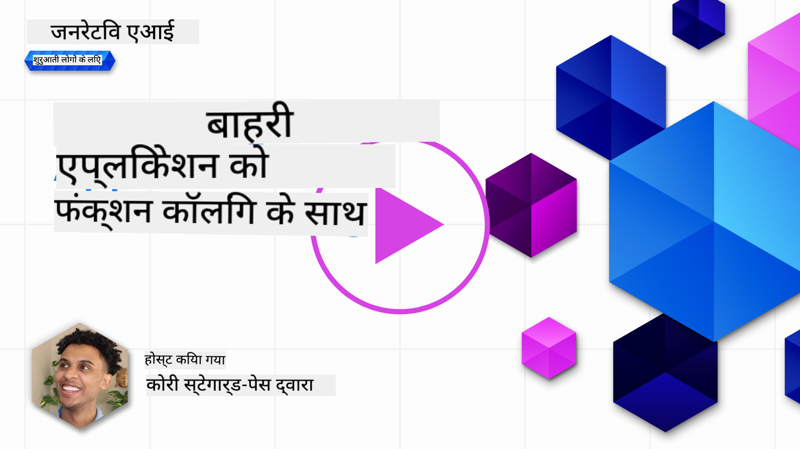
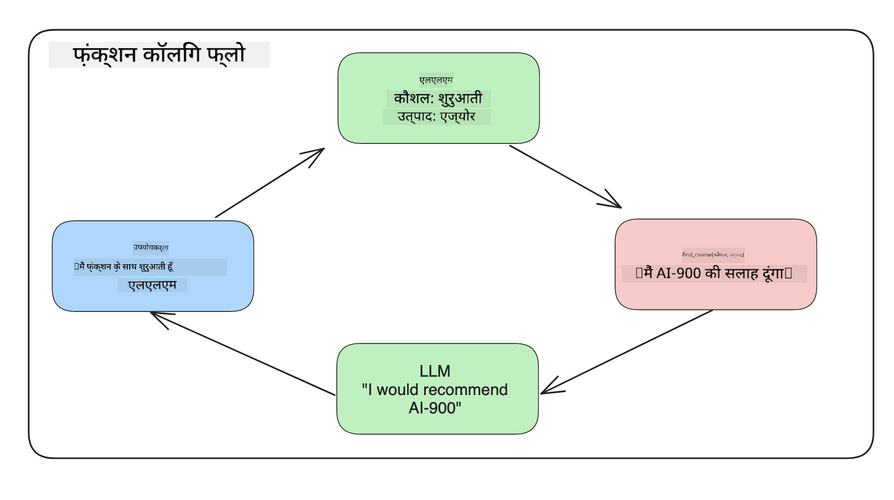
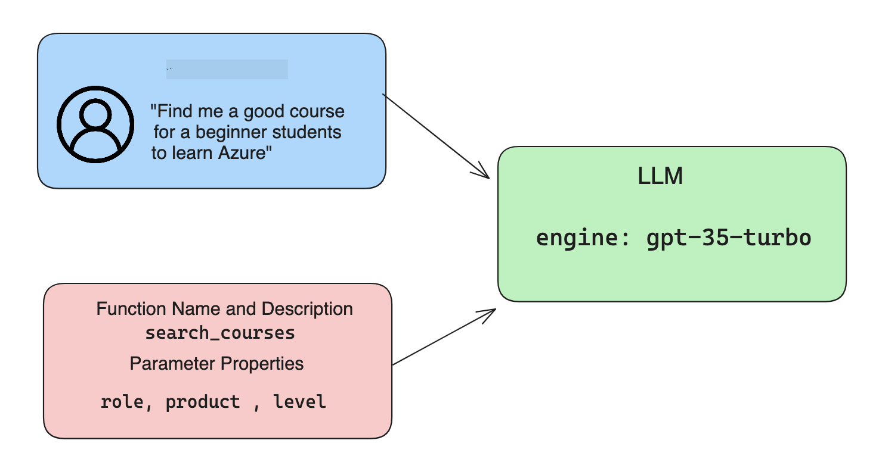

<!--
CO_OP_TRANSLATOR_METADATA:
{
  "original_hash": "77a48a201447be19aa7560706d6f93a0",
  "translation_date": "2025-07-09T14:27:50+00:00",
  "source_file": "11-integrating-with-function-calling/README.md",
  "language_code": "hi"
}
-->
# function calling के साथ एकीकरण

[](https://aka.ms/gen-ai-lesson11-gh?WT.mc_id=academic-105485-koreyst)

आपने अब तक पिछले पाठों में काफी कुछ सीखा है। हालांकि, हम इसे और बेहतर बना सकते हैं। कुछ चीजें जिन्हें हम सुधार सकते हैं, वे हैं कि हम कैसे एक अधिक सुसंगत प्रतिक्रिया प्रारूप प्राप्त कर सकते हैं ताकि प्रतिक्रिया के साथ आगे काम करना आसान हो जाए। साथ ही, हम अपने एप्लिकेशन को और समृद्ध करने के लिए अन्य स्रोतों से डेटा जोड़ना भी चाह सकते हैं।

उपरोक्त समस्याएं इस अध्याय में संबोधित की जाएंगी।

## परिचय

इस पाठ में निम्नलिखित विषय शामिल होंगे:

- function calling क्या है और इसके उपयोग के मामले समझाना।
- Azure OpenAI का उपयोग करके function call बनाना।
- एक एप्लिकेशन में function call को कैसे एकीकृत करें।

## सीखने के लक्ष्य

इस पाठ के अंत तक, आप सक्षम होंगे:

- function calling के उपयोग का उद्देश्य समझाना।
- Azure OpenAI सेवा का उपयोग करके Function Call सेटअप करना।
- अपने एप्लिकेशन के उपयोग के मामले के लिए प्रभावी function calls डिजाइन करना।

## परिदृश्य: functions के साथ हमारे चैटबॉट को बेहतर बनाना

इस पाठ के लिए, हम अपने शिक्षा स्टार्टअप के लिए एक फीचर बनाना चाहते हैं जो उपयोगकर्ताओं को तकनीकी पाठ्यक्रम खोजने के लिए चैटबॉट का उपयोग करने की अनुमति देता है। हम उनके कौशल स्तर, वर्तमान भूमिका और रुचि की तकनीक के अनुसार पाठ्यक्रमों की सिफारिश करेंगे।

इस परिदृश्य को पूरा करने के लिए, हम निम्नलिखित का संयोजन उपयोग करेंगे:

- `Azure OpenAI` उपयोगकर्ता के लिए चैट अनुभव बनाने के लिए।
- `Microsoft Learn Catalog API` उपयोगकर्ताओं को उनके अनुरोध के आधार पर पाठ्यक्रम खोजने में मदद करने के लिए।
- `Function Calling` उपयोगकर्ता के प्रश्न को लेकर उसे एक function को भेजने के लिए ताकि API अनुरोध किया जा सके।

शुरू करने के लिए, आइए देखें कि हम function calling का उपयोग क्यों करना चाहेंगे:

## function calling क्यों

function calling से पहले, LLM से प्रतिक्रियाएं असंरचित और असंगत होती थीं। डेवलपर्स को प्रत्येक प्रतिक्रिया के विभिन्न रूपों को संभालने के लिए जटिल सत्यापन कोड लिखना पड़ता था। उपयोगकर्ता ऐसे सवालों के जवाब नहीं पा सकते थे जैसे "स्टॉकहोम में वर्तमान मौसम क्या है?" क्योंकि मॉडल केवल उस समय तक के डेटा तक सीमित थे जब तक उन्हें प्रशिक्षित किया गया था।

Function Calling Azure OpenAI सेवा की एक विशेषता है जो निम्नलिखित सीमाओं को दूर करती है:

- **सुसंगत प्रतिक्रिया प्रारूप**। यदि हम प्रतिक्रिया प्रारूप को बेहतर नियंत्रित कर सकें, तो हम इसे अन्य सिस्टमों के साथ आसानी से एकीकृत कर सकते हैं।
- **बाहरी डेटा**। चैट संदर्भ में एप्लिकेशन के अन्य स्रोतों से डेटा का उपयोग करने की क्षमता।

## एक परिदृश्य के माध्यम से समस्या को समझाना

> हम सुझाव देते हैं कि आप नीचे दिए गए परिदृश्य को चलाने के लिए [शामिल नोटबुक](../../../11-integrating-with-function-calling/python/aoai-assignment.ipynb) का उपयोग करें। आप बस पढ़ भी सकते हैं क्योंकि हम एक ऐसी समस्या को समझाने की कोशिश कर रहे हैं जहाँ functions मदद कर सकते हैं।

आइए एक उदाहरण देखें जो प्रतिक्रिया प्रारूप की समस्या को दर्शाता है:

मान लीजिए हम छात्रों के डेटा का एक डेटाबेस बनाना चाहते हैं ताकि हम उन्हें सही पाठ्यक्रम सुझा सकें। नीचे हमारे पास दो छात्र विवरण हैं जो डेटा में बहुत समान हैं।

1. हमारे Azure OpenAI संसाधन से कनेक्शन बनाएं:

   ```python
   import os
   import json
   from openai import AzureOpenAI
   from dotenv import load_dotenv
   load_dotenv()

   client = AzureOpenAI(
   api_key=os.environ['AZURE_OPENAI_API_KEY'],  # this is also the default, it can be omitted
   api_version = "2023-07-01-preview"
   )

   deployment=os.environ['AZURE_OPENAI_DEPLOYMENT']
   ```

   नीचे कुछ Python कोड है जो Azure OpenAI से कनेक्शन कॉन्फ़िगर करता है जहाँ हम `api_type`, `api_base`, `api_version` और `api_key` सेट करते हैं।

1. दो छात्र विवरण बनाना, जिनके लिए वेरिएबल `student_1_description` और `student_2_description` का उपयोग किया गया है।

   ```python
   student_1_description="Emily Johnson is a sophomore majoring in computer science at Duke University. She has a 3.7 GPA. Emily is an active member of the university's Chess Club and Debate Team. She hopes to pursue a career in software engineering after graduating."

   student_2_description = "Michael Lee is a sophomore majoring in computer science at Stanford University. He has a 3.8 GPA. Michael is known for his programming skills and is an active member of the university's Robotics Club. He hopes to pursue a career in artificial intelligence after finishing his studies."
   ```

   हम ऊपर दिए गए छात्र विवरणों को LLM को भेजना चाहते हैं ताकि वह डेटा को पार्स कर सके। यह डेटा बाद में हमारे एप्लिकेशन में उपयोग किया जा सकता है और API को भेजा जा सकता है या डेटाबेस में संग्रहित किया जा सकता है।

1. आइए दो समान प्रॉम्प्ट बनाएं जिनमें हम LLM को निर्देश देते हैं कि हमें किस जानकारी में रुचि है:

   ```python
   prompt1 = f'''
   Please extract the following information from the given text and return it as a JSON object:

   name
   major
   school
   grades
   club

   This is the body of text to extract the information from:
   {student_1_description}
   '''

   prompt2 = f'''
   Please extract the following information from the given text and return it as a JSON object:

   name
   major
   school
   grades
   club

   This is the body of text to extract the information from:
   {student_2_description}
   '''
   ```

   ऊपर दिए गए प्रॉम्प्ट LLM को जानकारी निकालने और JSON प्रारूप में प्रतिक्रिया लौटाने का निर्देश देते हैं।

1. प्रॉम्प्ट और Azure OpenAI से कनेक्शन सेट करने के बाद, अब हम `openai.ChatCompletion` का उपयोग करके प्रॉम्प्ट को LLM को भेजेंगे। हम प्रॉम्प्ट को `messages` वेरिएबल में स्टोर करते हैं और भूमिका को `user` असाइन करते हैं। यह उपयोगकर्ता द्वारा चैटबॉट को लिखा गया संदेश होने का अनुकरण करता है।

   ```python
   # response from prompt one
   openai_response1 = client.chat.completions.create(
   model=deployment,
   messages = [{'role': 'user', 'content': prompt1}]
   )
   openai_response1.choices[0].message.content

   # response from prompt two
   openai_response2 = client.chat.completions.create(
   model=deployment,
   messages = [{'role': 'user', 'content': prompt2}]
   )
   openai_response2.choices[0].message.content
   ```

अब हम दोनों अनुरोध LLM को भेज सकते हैं और प्राप्त प्रतिक्रिया की जांच कर सकते हैं जैसे `openai_response1['choices'][0]['message']['content']`।

1. अंत में, हम प्रतिक्रिया को JSON प्रारूप में बदल सकते हैं `json.loads` कॉल करके:

   ```python
   # Loading the response as a JSON object
   json_response1 = json.loads(openai_response1.choices[0].message.content)
   json_response1
   ```

   प्रतिक्रिया 1:

   ```json
   {
     "name": "Emily Johnson",
     "major": "computer science",
     "school": "Duke University",
     "grades": "3.7",
     "club": "Chess Club"
   }
   ```

   प्रतिक्रिया 2:

   ```json
   {
     "name": "Michael Lee",
     "major": "computer science",
     "school": "Stanford University",
     "grades": "3.8 GPA",
     "club": "Robotics Club"
   }
   ```

   हालांकि प्रॉम्प्ट समान हैं और विवरण भी मिलते-जुलते हैं, हम देखते हैं कि `Grades` प्रॉपर्टी के मान अलग-अलग प्रारूप में हैं, जैसे कभी `3.7` तो कभी `3.7 GPA`।

   यह परिणाम इसलिए है क्योंकि LLM असंरचित डेटा (लिखित प्रॉम्प्ट) लेता है और असंरचित डेटा लौटाता है। हमें एक संरचित प्रारूप चाहिए ताकि हम जान सकें कि जब हम इस डेटा को संग्रहित या उपयोग करें तो क्या अपेक्षा करनी है।

तो हम प्रारूपण की समस्या को कैसे हल करें? function calling का उपयोग करके, हम सुनिश्चित कर सकते हैं कि हमें संरचित डेटा वापस मिले। function calling का उपयोग करते समय, LLM वास्तव में कोई function कॉल या रन नहीं करता। इसके बजाय, हम LLM के लिए एक संरचना बनाते हैं जिसे वह अपनी प्रतिक्रियाओं के लिए अनुसरण करता है। फिर हम उन संरचित प्रतिक्रियाओं का उपयोग यह जानने के लिए करते हैं कि हमारे एप्लिकेशन में कौन सा function चलाना है।



हम फिर function से जो कुछ भी वापस आता है उसे लेकर इसे LLM को वापस भेज सकते हैं। LLM तब प्राकृतिक भाषा में उपयोगकर्ता के प्रश्न का उत्तर देगा।

## function calls के उपयोग के मामले

ऐसे कई उपयोग के मामले हैं जहाँ function calls आपके ऐप को बेहतर बना सकते हैं जैसे:

- **बाहरी टूल्स को कॉल करना**। चैटबॉट उपयोगकर्ताओं के सवालों के जवाब देने में बहुत अच्छे होते हैं। function calling का उपयोग करके, चैटबॉट उपयोगकर्ता के संदेशों का उपयोग कुछ कार्यों को पूरा करने के लिए कर सकते हैं। उदाहरण के लिए, एक छात्र चैटबॉट से कह सकता है "मेरे शिक्षक को एक ईमेल भेजो कि मुझे इस विषय में अधिक सहायता चाहिए"। यह `send_email(to: string, body: string)` function call कर सकता है।

- **API या डेटाबेस क्वेरी बनाना**। उपयोगकर्ता प्राकृतिक भाषा का उपयोग करके जानकारी खोज सकते हैं जिसे एक फॉर्मेटेड क्वेरी या API अनुरोध में बदला जाता है। उदाहरण के लिए, एक शिक्षक पूछ सकता है "वे छात्र कौन हैं जिन्होंने आखिरी असाइनमेंट पूरा किया?" जो `get_completed(student_name: string, assignment: int, current_status: string)` नामक function को कॉल कर सकता है।

- **संरचित डेटा बनाना**। उपयोगकर्ता एक टेक्स्ट ब्लॉक या CSV लेकर LLM का उपयोग करके महत्वपूर्ण जानकारी निकाल सकते हैं। उदाहरण के लिए, एक छात्र शांति समझौतों के बारे में विकिपीडिया लेख को AI फ्लैशकार्ड बनाने के लिए परिवर्तित कर सकता है। यह `get_important_facts(agreement_name: string, date_signed: string, parties_involved: list)` नामक function का उपयोग करके किया जा सकता है।

## अपना पहला Function Call बनाना

function call बनाने की प्रक्रिया में 3 मुख्य चरण होते हैं:

1. अपनी functions की सूची और एक उपयोगकर्ता संदेश के साथ Chat Completions API को कॉल करना।
2. मॉडल की प्रतिक्रिया पढ़ना ताकि कोई क्रिया की जा सके, जैसे function या API कॉल को निष्पादित करना।
3. अपने function से प्राप्त प्रतिक्रिया के साथ Chat Completions API को फिर से कॉल करना ताकि उस जानकारी का उपयोग करके उपयोगकर्ता को प्रतिक्रिया बनाई जा सके।



### चरण 1 - संदेश बनाना

पहला चरण एक उपयोगकर्ता संदेश बनाना है। इसे डायनामिक रूप से टेक्स्ट इनपुट के मान से असाइन किया जा सकता है या आप यहाँ एक मान असाइन कर सकते हैं। यदि यह आपका पहला बार है जब आप Chat Completions API के साथ काम कर रहे हैं, तो हमें संदेश की `role` और `content` को परिभाषित करना होगा।

`role` हो सकता है `system` (नियम बनाना), `assistant` (मॉडल) या `user` (अंतिम उपयोगकर्ता)। function calling के लिए, हम इसे `user` असाइन करेंगे और एक उदाहरण प्रश्न देंगे।

```python
messages= [ {"role": "user", "content": "Find me a good course for a beginner student to learn Azure."} ]
```

विभिन्न भूमिकाओं को असाइन करके, LLM को स्पष्ट हो जाता है कि क्या सिस्टम कुछ कह रहा है या उपयोगकर्ता, जो एक वार्तालाप इतिहास बनाने में मदद करता है जिस पर LLM आगे काम कर सकता है।

### चरण 2 - functions बनाना

अगला, हम एक function और उसके पैरामीटर परिभाषित करेंगे। हम यहाँ केवल एक function `search_courses` का उपयोग करेंगे लेकिन आप कई functions बना सकते हैं।

> **Important** : functions LLM को भेजे जाने वाले सिस्टम संदेश में शामिल होते हैं और आपके उपलब्ध टोकन की संख्या में गिने जाते हैं।

नीचे, हम functions को आइटम की एक सूची के रूप में बनाते हैं। प्रत्येक आइटम एक function होता है और उसके पास `name`, `description` और `parameters` प्रॉपर्टीज़ होती हैं:

```python
functions = [
   {
      "name":"search_courses",
      "description":"Retrieves courses from the search index based on the parameters provided",
      "parameters":{
         "type":"object",
         "properties":{
            "role":{
               "type":"string",
               "description":"The role of the learner (i.e. developer, data scientist, student, etc.)"
            },
            "product":{
               "type":"string",
               "description":"The product that the lesson is covering (i.e. Azure, Power BI, etc.)"
            },
            "level":{
               "type":"string",
               "description":"The level of experience the learner has prior to taking the course (i.e. beginner, intermediate, advanced)"
            }
         },
         "required":[
            "role"
         ]
      }
   }
]
```

आइए प्रत्येक function उदाहरण को विस्तार से समझें:

- `name` - वह function नाम जिसे हम कॉल करना चाहते हैं।
- `description` - यह function कैसे काम करता है इसका विवरण। यहाँ स्पष्ट और विशिष्ट होना महत्वपूर्ण है।
- `parameters` - उन मानों और प्रारूपों की सूची जो आप चाहते हैं कि मॉडल अपनी प्रतिक्रिया में उत्पन्न करे। parameters सूची में आइटम होते हैं जिनके पास निम्नलिखित प्रॉपर्टीज़ होती हैं:
  1. `type` - उस प्रॉपर्टी का डेटा प्रकार जिसमें मान संग्रहित होगा।
  2. `properties` - विशिष्ट मानों की सूची जिन्हें मॉडल अपनी प्रतिक्रिया में उपयोग करेगा।
      1. `name` - वह कुंजी जो मॉडल अपनी फॉर्मेटेड प्रतिक्रिया में उपयोग करेगा, जैसे `product`।
      2. `type` - इस प्रॉपर्टी का डेटा प्रकार, जैसे `string`।
      3. `description` - उस विशिष्ट प्रॉपर्टी का विवरण।

एक वैकल्पिक प्रॉपर्टी `required` भी होती है - जो function call को पूरा करने के लिए आवश्यक प्रॉपर्टी को दर्शाती है।

### चरण 3 - function call करना

function को परिभाषित करने के बाद, अब हमें इसे Chat Completion API कॉल में शामिल करना होगा। हम ऐसा `functions` को अनुरोध में जोड़कर करते हैं। इस मामले में `functions=functions`।

`function_call` को `auto` पर सेट करने का विकल्प भी होता है। इसका मतलब है कि हम LLM को यह निर्णय लेने देंगे कि उपयोगकर्ता संदेश के आधार पर कौन सा function कॉल किया जाना चाहिए, बजाय इसके कि हम इसे खुद असाइन करें।

नीचे कुछ कोड है जहाँ हम `ChatCompletion.create` कॉल करते हैं, ध्यान दें कि हमने `functions=functions` और `function_call="auto"` सेट किया है जिससे LLM को यह चुनने की अनुमति मिलती है कि कब हमारे द्वारा प्रदान किए गए functions को कॉल करना है:

```python
response = client.chat.completions.create(model=deployment,
                                        messages=messages,
                                        functions=functions,
                                        function_call="auto")

print(response.choices[0].message)
```

अब वापस आने वाली प्रतिक्रिया कुछ इस तरह दिखती है:

```json
{
  "role": "assistant",
  "function_call": {
    "name": "search_courses",
    "arguments": "{\n  \"role\": \"student\",\n  \"product\": \"Azure\",\n  \"level\": \"beginner\"\n}"
  }
}
```

यहाँ हम देख सकते हैं कि function `search_courses` को कॉल किया गया और किन तर्कों के साथ, जो JSON प्रतिक्रिया में `arguments` प्रॉपर्टी में सूचीबद्ध हैं।

निष्कर्ष यह है कि LLM ने function के तर्कों के लिए डेटा खोज लिया क्योंकि वह इसे `messages` पैरामीटर में प्रदान किए गए मान से निकाल रहा था। नीचे `messages` मान की याद दिलाई गई है:

```python
messages= [ {"role": "user", "content": "Find me a good course for a beginner student to learn Azure."} ]
```

जैसा कि आप देख सकते हैं, `student`, `Azure` और `beginner` को `messages` से निकाला गया और function के इनपुट के रूप में सेट किया गया। इस तरह functions का उपयोग करना प्रॉम्प्ट से जानकारी निकालने का एक शानदार तरीका है, साथ ही LLM को संरचना प्रदान करने और पुन: उपयोगी कार्यक्षमता बनाने का भी।

अब हमें देखना होगा कि हम इसे अपने ऐप में कैसे उपयोग कर सकते हैं।

## एप्लिकेशन में Function Calls को एकीकृत करना

LLM से फॉर्मेटेड प्रतिक्रिया का परीक्षण करने के बाद, अब हम इसे एक एप्लिकेशन में एकीकृत कर सकते हैं।

### प्रवाह प्रबंधन

इसे अपने एप्लिकेशन में एकीकृत करने के लिए, आइए निम्नलिखित कदम उठाएं:

1. सबसे पहले, OpenAI सेवाओं को कॉल करें और संदेश को `response_message` नामक वेरिएबल में स्टोर करें।

   ```python
   response_message = response.choices[0].message
   ```

1. अब हम वह function परिभाषित करेंगे जो Microsoft Learn API को कॉल करेगा ताकि पाठ्यक्रमों की सूची प्राप्त की जा सके:

   ```python
   import requests

   def search_courses(role, product, level):
     url = "https://learn.microsoft.com/api/catalog/"
     params = {
        "role": role,
        "product": product,
        "level": level
     }
     response = requests.get(url, params=params)
     modules = response.json()["modules"]
     results = []
     for module in modules[:5]:
        title = module["title"]
        url = module["url"]
        results.append({"title": title, "url": url})
     return str(results)
   ```

   ध्यान दें कि अब हम एक वास्तविक Python function बना रहे हैं जो `functions` वेरिएबल में परिभाषित function नामों से मेल खाता है। हम वास्तविक बाहरी API कॉल कर रहे हैं ताकि आवश्यक डेटा प्राप्त किया जा सके। इस मामले में, हम Microsoft Learn API के खिलाफ प्रशिक्षण मॉड्यूल खोजने के लिए जाते हैं।

ठीक है, हमने `functions` वेरिएबल बनाया और एक संबंधित Python function भी, तो हम LLM को कैसे बताएंगे कि इन दोनों को कैसे मैप करें ताकि हमारा Python function कॉल हो?

1. यह देखने के लिए कि क्या हमें Python function कॉल करना है, हमें LLM प्रतिक्रिया में देखना होगा कि क्या `function_call` उसका हिस्सा है और निर्दिष्ट function को कॉल करना होगा। नीचे बताया गया है कि आप यह जांच कैसे कर सकते हैं:

   ```python
   # Check if the model wants to call a function
   if response_message.function_call.name:
    print("Recommended Function call:")
    print(response_message.function_call.name)
    print()

    # Call the function.
    function_name = response_message.function_call.name

    available_functions = {
            "search_courses": search_courses,
    }
    function_to_call = available_functions[function_name]

    function_args = json.loads(response_message.function_call.arguments)
    function_response = function_to_call(**function_args)

    print("Output of function call:")
    print(function_response)
    print(type(function_response))


    # Add the assistant response and function response to the messages
    messages.append( # adding assistant response to messages
        {
            "role": response_message.role,
            "function_call": {
                "name": function_name,
                "arguments": response_message.function_call.arguments,
            },
            "content": None
        }
    )
    messages.append( # adding function response to messages
        {
            "role": "function",
            "name": function_name,
            "content":function_response,
        }
    )
   ```

   ये तीन लाइनें सुनिश्चित करती हैं कि हम function नाम, तर्क निकालें और कॉल करें:

   ```python
   function_to_call = available_functions[function_name]

   function_args = json.loads(response_message.function_call.arguments)
   function_response = function_to_call(**function_args)
   ```

   नीचे हमारे कोड को चलाने का आउटपुट है:

   **आउटपुट**

   ```Recommended Function call:
   {
     "name": "search_courses",
     "arguments": "{\n  \"role\": \"student\",\n  \"product\": \"Azure\",\n  \"level\": \"beginner\"\n}"
   }

   Output of function call:
   [{'title': 'Describe concepts of cryptography', 'url': 'https://learn.microsoft.com/training/modules/describe-concepts-of-cryptography/?
   WT.mc_id=api_CatalogApi'}, {'title': 'Introduction to audio classification with TensorFlow', 'url': 'https://learn.microsoft.com/en-
   us/training/modules/intro-audio-classification-tensorflow/?WT.mc_id=api_CatalogApi'}, {'title': 'Design a Performant Data Model in Azure SQL
   Database with Azure Data Studio', 'url': 'https://learn.microsoft.com/training/modules/design-a-data-model-with-ads/?
   WT.mc_id=api_CatalogApi'}, {'title': 'Getting started with the Microsoft Cloud Adoption Framework for Azure', 'url':
   'https://learn.microsoft.com/training/modules/cloud-adoption-framework-getting-started/?WT.mc_id=api_CatalogApi'}, {'title': 'Set up the
   Rust development environment', 'url': 'https://learn.microsoft.com/training/modules/rust-set-up-environment/?WT.mc_id=api_CatalogApi'}]
   <class 'str'>
   ```

1. अब हम अपडेटेड संदेश `messages` को LLM को भेजेंगे ताकि हमें API JSON फॉर्मेटेड प्रतिक्रिया के बजाय प्राकृतिक भाषा में प्रतिक्रिया मिल सके।

   ```python
   print("Messages in next request:")
   print(messages)
   print()

   second_response = client.chat.completions.create(
      messages=messages,
      model=deployment,
      function_call="auto",
      functions=functions,
      temperature=0
         )  # get a new response from GPT where it can see the function response


   print(second_response.choices[0].message)
   ```

   **आउटपुट**

   ```python
   {
     "role": "assistant",
     "content": "I found some good courses for beginner students to learn Azure:\n\n1. [Describe concepts of cryptography] (https://learn.microsoft.com/training/modules/describe-concepts-of-cryptography/?WT.mc_id=api_CatalogApi)\n2. [Introduction to audio classification with TensorFlow](https://learn.microsoft.com/training/modules/intro-audio-classification-tensorflow/?WT.mc_id=api_CatalogApi)\n3. [Design a Performant Data Model in Azure SQL Database with Azure Data Studio](https://learn.microsoft.com/training/modules/design-a-data-model-with-ads/?WT.mc_id=api_CatalogApi)\n4. [Getting started with the Microsoft Cloud Adoption Framework for Azure](https://learn.microsoft.com/training/modules/cloud-adoption-framework-getting-started/?WT.mc_id=api_CatalogApi)\n5. [Set up the Rust development environment](https://learn.microsoft.com/training/modules/rust-set-up-environment/?WT.mc_id=api_CatalogApi)\n\nYou can click on the links to access the courses."
   }

   ```

## असाइनमेंट

Azure OpenAI Function Calling की अपनी सीख जारी रखने के लिए आप बना सकते हैं:

- function के और पैरामीटर जो शिक्षार्थियों को अधिक पाठ्यक्रम खोजने में मदद कर सकते हैं।
- एक और function call जो शिक्षार्थी की मातृभाषा जैसी अधिक जानकारी लेता हो।
- error handling बनाएं जब function call और/या API कॉल कोई उपयुक्त पाठ्यक्रम वापस न करे।
## शानदार काम! यात्रा जारी रखें

इस पाठ को पूरा करने के बाद, हमारे [Generative AI Learning संग्रह](https://aka.ms/genai-collection?WT.mc_id=academic-105485-koreyst) को देखें ताकि आप अपनी Generative AI की जानकारी को और बढ़ा सकें!

अब Lesson 12 पर जाएं, जहां हम देखेंगे कि [AI एप्लिकेशन के लिए UX कैसे डिजाइन करें](../12-designing-ux-for-ai-applications/README.md?WT.mc_id=academic-105485-koreyst)!

**अस्वीकरण**:  
यह दस्तावेज़ AI अनुवाद सेवा [Co-op Translator](https://github.com/Azure/co-op-translator) का उपयोग करके अनुवादित किया गया है। जबकि हम सटीकता के लिए प्रयासरत हैं, कृपया ध्यान दें कि स्वचालित अनुवादों में त्रुटियाँ या अशुद्धियाँ हो सकती हैं। मूल दस्तावेज़ अपनी मूल भाषा में ही अधिकारिक स्रोत माना जाना चाहिए। महत्वपूर्ण जानकारी के लिए, पेशेवर मानव अनुवाद की सलाह दी जाती है। इस अनुवाद के उपयोग से उत्पन्न किसी भी गलतफहमी या गलत व्याख्या के लिए हम जिम्मेदार नहीं हैं।