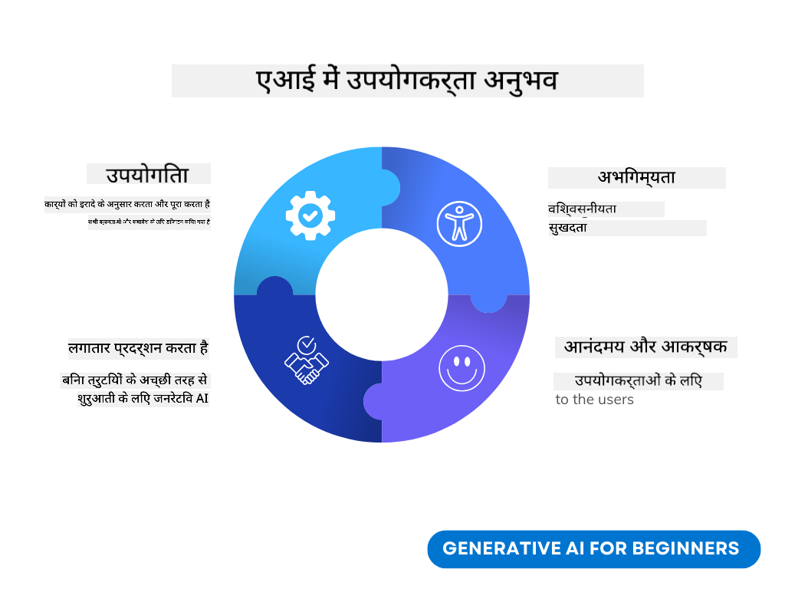
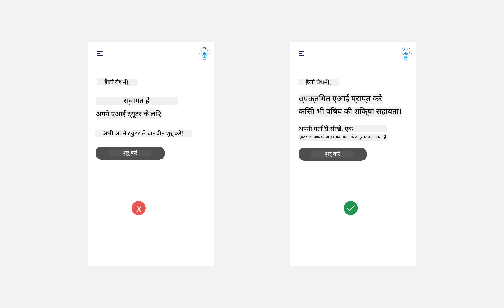
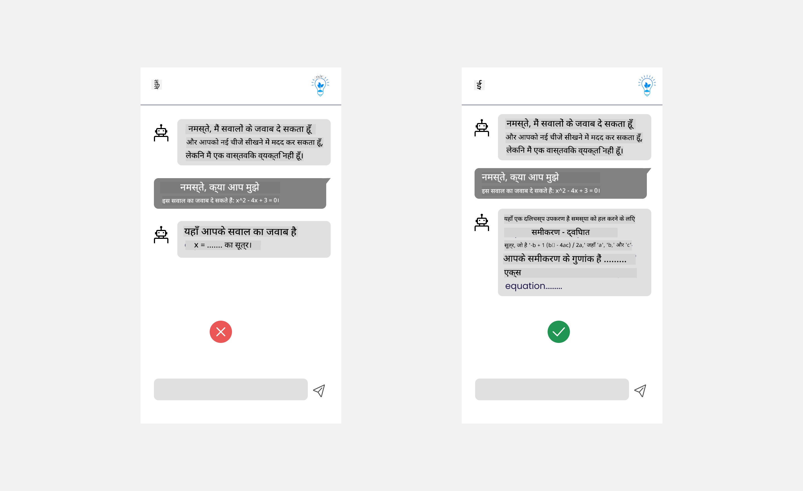
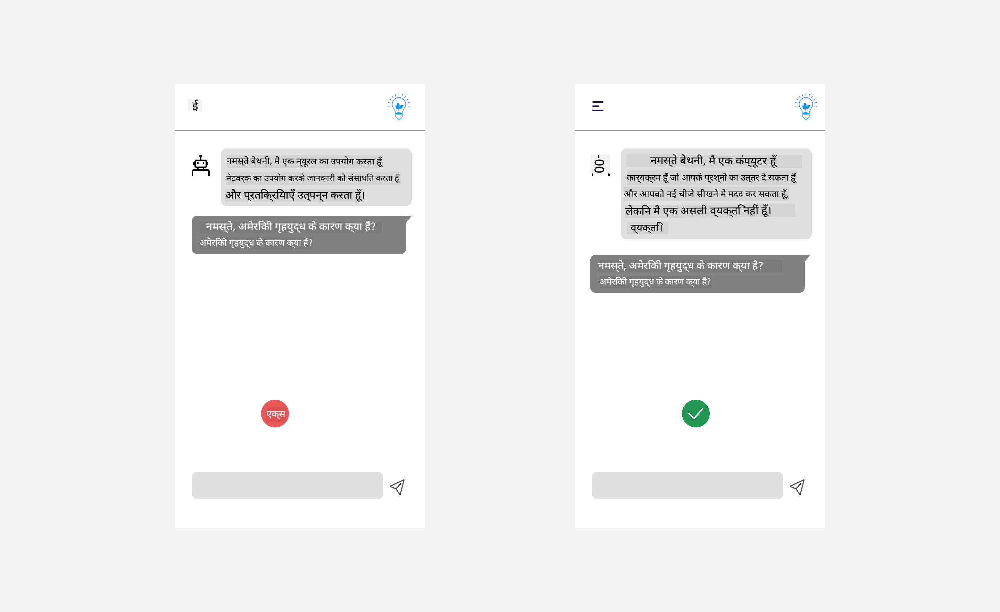
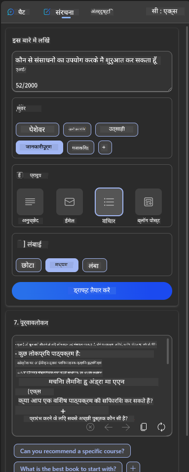
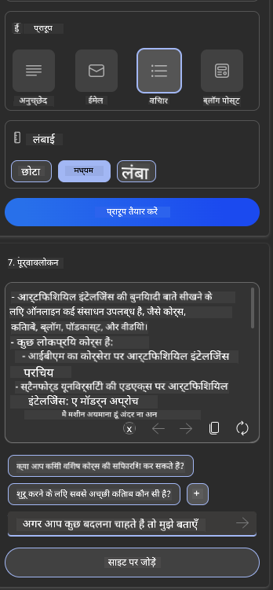
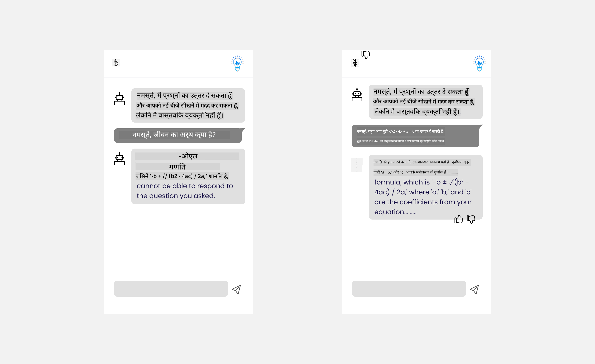

<!--
CO_OP_TRANSLATOR_METADATA:
{
  "original_hash": "ec385b41ee50579025d50cc03bfb3a25",
  "translation_date": "2025-06-25T20:15:19+00:00",
  "source_file": "12-designing-ux-for-ai-applications/README.md",
  "language_code": "hi"
}
-->
# एआई एप्लिकेशन के लिए यूएक्स डिज़ाइन करना

> _(इस पाठ का वीडियो देखने के लिए ऊपर दी गई छवि पर क्लिक करें)_

उपयोगकर्ता अनुभव ऐप्स बनाने का एक बहुत ही महत्वपूर्ण पहलू है। उपयोगकर्ताओं को आपके ऐप का उपयोग करके कार्यों को कुशलतापूर्वक पूरा करने में सक्षम होना चाहिए। कुशल होना एक बात है लेकिन आपको ऐप्स को इस तरह से डिज़ाइन करना होगा कि हर कोई उनका उपयोग कर सके, जिससे वे _सुलभ_ बन सकें। यह अध्याय इस क्षेत्र पर ध्यान केंद्रित करेगा ताकि आप एक ऐसा ऐप डिज़ाइन कर सकें जिसका लोग उपयोग कर सकें और उपयोग करना चाहें।

## परिचय

उपयोगकर्ता अनुभव यह है कि कोई उपयोगकर्ता किसी विशिष्ट उत्पाद या सेवा के साथ कैसे इंटरैक्ट करता है और उसका उपयोग करता है, चाहे वह कोई सिस्टम हो, उपकरण हो या डिज़ाइन। एआई एप्लिकेशन विकसित करते समय, डेवलपर्स न केवल यह सुनिश्चित करने पर ध्यान केंद्रित करते हैं कि उपयोगकर्ता अनुभव प्रभावी हो बल्कि नैतिक भी हो। इस पाठ में, हम उन आर्टिफिशियल इंटेलिजेंस (एआई) एप्लिकेशन का निर्माण करना सीखेंगे जो उपयोगकर्ता की आवश्यकताओं को पूरा करते हैं।

पाठ निम्नलिखित क्षेत्रों को कवर करेगा:

- उपयोगकर्ता अनुभव का परिचय और उपयोगकर्ता आवश्यकताओं की समझ
- विश्वास और पारदर्शिता के लिए एआई एप्लिकेशन डिज़ाइन करना
- सहयोग और प्रतिक्रिया के लिए एआई एप्लिकेशन डिज़ाइन करना

## सीखने के लक्ष्य

इस पाठ को लेने के बाद, आप सक्षम होंगे:

- यह समझना कि एआई एप्लिकेशन कैसे बनाएं जो उपयोगकर्ता की आवश्यकताओं को पूरा करें।
- एआई एप्लिकेशन डिज़ाइन करें जो विश्वास और सहयोग को बढ़ावा दें।

### पूर्वापेक्षा

कुछ समय निकालें और [उपयोगकर्ता अनुभव और डिज़ाइन सोच](https://learn.microsoft.com/training/modules/ux-design?WT.mc_id=academic-105485-koreyst) के बारे में अधिक पढ़ें।

## उपयोगकर्ता अनुभव का परिचय और उपयोगकर्ता आवश्यकताओं की समझ

हमारे काल्पनिक शिक्षा स्टार्टअप में, हमारे पास दो प्राथमिक उपयोगकर्ता हैं, शिक्षक और छात्र। इन दोनों उपयोगकर्ताओं की अलग-अलग आवश्यकताएँ हैं। उपयोगकर्ता-केंद्रित डिज़ाइन उपयोगकर्ता को प्राथमिकता देता है, यह सुनिश्चित करते हुए कि उत्पाद उन लोगों के लिए प्रासंगिक और लाभकारी हैं जिनके लिए इसे बनाया गया है।

एप्लिकेशन को एक अच्छा उपयोगकर्ता अनुभव प्रदान करने के लिए **उपयोगी, विश्वसनीय, सुलभ और सुखद** होना चाहिए।

### उपयोगिता

उपयोगी होने का मतलब है कि एप्लिकेशन में वह कार्यक्षमता होनी चाहिए जो उसके इच्छित उद्देश्य से मेल खाती हो, जैसे कि ग्रेडिंग प्रक्रिया को स्वचालित करना या संशोधन के लिए फ्लैशकार्ड उत्पन्न करना। एक एप्लिकेशन जो ग्रेडिंग प्रक्रिया को स्वचालित करता है, उसे पूर्वनिर्धारित मानदंडों के आधार पर छात्रों के काम को सही ढंग से और कुशलता से अंक सौंपने में सक्षम होना चाहिए। इसी तरह, एक एप्लिकेशन जो संशोधन फ्लैशकार्ड उत्पन्न करता है, उसे अपने डेटा के आधार पर प्रासंगिक और विविध प्रश्न बनाने में सक्षम होना चाहिए।

### विश्वसनीयता

विश्वसनीय होने का अर्थ है कि एप्लिकेशन लगातार और बिना त्रुटियों के अपना कार्य कर सकता है। हालाँकि, एआई भी मनुष्यों की तरह पूर्ण नहीं है और त्रुटियों की संभावना हो सकती है। एप्लिकेशन त्रुटियों या अप्रत्याशित स्थितियों का सामना कर सकते हैं जिनके लिए मानव हस्तक्षेप या सुधार की आवश्यकता होती है। आप त्रुटियों को कैसे संभालते हैं? इस पाठ के अंतिम भाग में, हम कवर करेंगे कि एआई सिस्टम और एप्लिकेशन को सहयोग और प्रतिक्रिया के लिए कैसे डिज़ाइन किया गया है।

### सुलभता

सुलभ होने का अर्थ है विभिन्न क्षमताओं वाले उपयोगकर्ताओं, जिनमें विकलांगता वाले उपयोगकर्ता भी शामिल हैं, के लिए उपयोगकर्ता अनुभव का विस्तार करना, यह सुनिश्चित करना कि कोई भी छूट न जाए। पहुंच संबंधी दिशानिर्देशों और सिद्धांतों का पालन करके, एआई समाधान सभी उपयोगकर्ताओं के लिए अधिक समावेशी, उपयोगी और लाभकारी बन जाते हैं।

### सुखद

सुखद होने का अर्थ है कि एप्लिकेशन का उपयोग करना आनंददायक है। एक आकर्षक उपयोगकर्ता अनुभव का उपयोगकर्ता पर सकारात्मक प्रभाव पड़ सकता है, जिससे उन्हें एप्लिकेशन पर लौटने के लिए प्रोत्साहित किया जा सकता है और व्यवसाय के राजस्व में वृद्धि हो सकती है।

हर चुनौती को एआई से हल नहीं किया जा सकता। एआई आपके उपयोगकर्ता अनुभव को बढ़ाने के लिए आता है, चाहे वह मैन्युअल कार्यों को स्वचालित करना हो, या उपयोगकर्ता अनुभवों को वैयक्तिकृत करना हो।

## विश्वास और पारदर्शिता के लिए एआई एप्लिकेशन डिज़ाइन करना

एआई एप्लिकेशन डिज़ाइन करते समय विश्वास बनाना बहुत महत्वपूर्ण होता है। विश्वास यह सुनिश्चित करता है कि उपयोगकर्ता को भरोसा है कि एप्लिकेशन काम पूरा करेगा, लगातार परिणाम देगा और परिणाम वही हैं जो उपयोगकर्ता को चाहिए। इस क्षेत्र में एक जोखिम अविश्वास और अति-विश्वास है। अविश्वास तब होता है जब उपयोगकर्ता का एआई सिस्टम में बहुत कम या कोई विश्वास नहीं होता, जिससे उपयोगकर्ता आपके एप्लिकेशन को अस्वीकार कर देता है। अति-विश्वास तब होता है जब उपयोगकर्ता एआई सिस्टम की क्षमता को अधिक आंकता है, जिससे उपयोगकर्ता एआई सिस्टम पर बहुत अधिक भरोसा करता है। उदाहरण के लिए, एक स्वचालित ग्रेडिंग सिस्टम के मामले में अति-विश्वास शिक्षक को यह सुनिश्चित करने के लिए कुछ पेपरों को प्रमाणित नहीं करने दे सकता है कि ग्रेडिंग सिस्टम अच्छी तरह से काम करता है। इससे छात्रों के लिए अनुचित या गलत ग्रेड मिल सकते हैं, या प्रतिक्रिया और सुधार के अवसर छूट सकते हैं।

डिज़ाइन के केंद्र में विश्वास सुनिश्चित करने के दो तरीके व्याख्यात्मकता और नियंत्रण हैं।

### व्याख्यात्मकता

जब एआई निर्णय लेने में मदद करता है, जैसे कि भविष्य की पीढ़ियों को ज्ञान प्रदान करना, तो यह महत्वपूर्ण है कि शिक्षक और माता-पिता यह समझें कि एआई निर्णय कैसे किए जाते हैं। यह व्याख्यात्मकता है - यह समझना कि एआई एप्लिकेशन निर्णय कैसे लेते हैं। व्याख्यात्मकता के लिए डिज़ाइनिंग में उन उदाहरणों का विवरण जोड़ना शामिल है जो एआई एप्लिकेशन कर सकते हैं। उदाहरण के लिए, "एआई शिक्षक के साथ शुरू करें" के बजाय, सिस्टम उपयोग कर सकता है: "एआई का उपयोग करके अपने नोट्स को आसान संशोधन के लिए सारांशित करें।"

एक और उदाहरण यह है कि एआई उपयोगकर्ता और व्यक्तिगत डेटा का उपयोग कैसे करता है। उदाहरण के लिए, एक उपयोगकर्ता के पास छात्र व्यक्तित्व के आधार पर सीमाएँ हो सकती हैं। एआई प्रश्नों के उत्तर प्रकट करने में सक्षम नहीं हो सकता है लेकिन उपयोगकर्ता को यह सोचने के लिए मार्गदर्शन करने में मदद कर सकता है कि वे समस्या को कैसे हल कर सकते हैं।

व्याख्यात्मकता का एक अंतिम महत्वपूर्ण हिस्सा स्पष्टीकरणों का सरलीकरण है। छात्र और शिक्षक एआई विशेषज्ञ नहीं हो सकते हैं, इसलिए एप्लिकेशन क्या कर सकता है या नहीं कर सकता, इसके स्पष्टीकरण को सरल और समझने में आसान होना चाहिए।

### नियंत्रण

जनरेटिव एआई एआई और उपयोगकर्ता के बीच सहयोग बनाता है, जहां उदाहरण के लिए एक उपयोगकर्ता विभिन्न परिणामों के लिए संकेतों को संशोधित कर सकता है। इसके अतिरिक्त, एक बार आउटपुट उत्पन्न हो जाने के बाद, उपयोगकर्ताओं को परिणामों को संशोधित करने में सक्षम होना चाहिए, जिससे उन्हें नियंत्रण का एहसास हो। उदाहरण के लिए, बिंग का उपयोग करते समय, आप अपने संकेत को प्रारूप, टोन और लंबाई के आधार पर अनुकूलित कर सकते हैं। इसके अतिरिक्त, आप अपने आउटपुट में परिवर्तन जोड़ सकते हैं और आउटपुट को नीचे दिखाए अनुसार संशोधित कर सकते हैं:

बिंग में एक और विशेषता जो उपयोगकर्ता को एप्लिकेशन पर नियंत्रण रखने की अनुमति देती है, वह है एआई द्वारा उपयोग किए जाने वाले डेटा के लिए ऑप्ट-इन और ऑप्ट-आउट करने की क्षमता। स्कूल एप्लिकेशन के लिए, छात्र अपने नोट्स के साथ-साथ शिक्षक के संसाधनों को संशोधन सामग्री के रूप में उपयोग करना चाह सकते हैं।

> एआई एप्लिकेशन डिज़ाइन करते समय, इरादे से काम करना महत्वपूर्ण है ताकि उपयोगकर्ता इसकी क्षमताओं की अवास्तविक अपेक्षाएं न रखें। ऐसा करने का एक तरीका संकेतों और परिणामों के बीच घर्षण पैदा करना है। उपयोगकर्ता को यह याद दिलाना कि यह एआई है न कि कोई साथी इंसान

## सहयोग और प्रतिक्रिया के लिए एआई एप्लिकेशन डिज़ाइन करना

जैसा कि पहले उल्लेख किया गया है, जनरेटिव एआई उपयोगकर्ता और एआई के बीच सहयोग बनाता है। अधिकांश इंटरैक्शन एक उपयोगकर्ता द्वारा संकेत दर्ज करने और एआई द्वारा आउटपुट उत्पन्न करने के साथ होते हैं। अगर आउटपुट गलत है तो क्या होगा? अगर त्रुटियां होती हैं तो एप्लिकेशन उन्हें कैसे संभालता है? क्या एआई उपयोगकर्ता को दोष देता है या त्रुटि को समझाने में समय लेता है?

एआई एप्लिकेशन को प्रतिक्रिया प्राप्त करने और देने के लिए बनाया जाना चाहिए। यह न केवल एआई सिस्टम को सुधारने में मदद करता है बल्कि उपयोगकर्ताओं के साथ विश्वास भी बनाता है। डिज़ाइन में एक प्रतिक्रिया लूप शामिल किया जाना चाहिए, एक उदाहरण आउटपुट पर सरल थम्स अप या डाउन हो सकता है।

इसे संभालने का एक और तरीका सिस्टम की क्षमताओं और सीमाओं को स्पष्ट रूप से संवाद करना है। जब कोई उपयोगकर्ता एआई क्षमताओं से परे कुछ अनुरोध करने में त्रुटि करता है, तो इसे संभालने का भी एक तरीका होना चाहिए, जैसा कि नीचे दिखाया गया है।

सिस्टम त्रुटियां उन एप्लिकेशन के साथ आम हैं जहां उपयोगकर्ता को एआई के दायरे से बाहर की जानकारी के लिए सहायता की आवश्यकता हो सकती है या एप्लिकेशन के पास उपयोगकर्ता द्वारा कितने प्रश्न/विषय सारांश उत्पन्न किए जा सकते हैं, इस पर सीमा हो सकती है। उदाहरण के लिए, सीमित विषयों पर डेटा के साथ प्रशिक्षित एआई एप्लिकेशन, उदाहरण के लिए, इतिहास और गणित, भूगोल से संबंधित प्रश्नों को संभालने में सक्षम नहीं हो सकता है। इसे कम करने के लिए, एआई सिस्टम ऐसा उत्तर दे सकता है: "क्षमा करें, हमारे उत्पाद को निम्नलिखित विषयों में डेटा के साथ प्रशिक्षित किया गया है....., मैं आपके द्वारा पूछे गए प्रश्न का उत्तर देने में सक्षम नहीं हो सकता।"

एआई एप्लिकेशन पूर्ण नहीं हैं, इसलिए वे गलतियाँ करने के लिए बाध्य हैं। अपने एप्लिकेशन डिज़ाइन करते समय, आपको यह सुनिश्चित करना चाहिए कि आप उपयोगकर्ताओं से प्रतिक्रिया और त्रुटियों को संभालने के लिए जगह बनाएं, जो सरल और आसानी से समझाने योग्य हो।

## असाइनमेंट

अब तक आपने जो भी एआई ऐप्स बनाए हैं, उनमें नीचे दिए गए चरणों को लागू करने पर विचार करें:

- **सुखद:** विचार करें कि आप अपने ऐप को अधिक सुखद कैसे बना सकते हैं। क्या आप हर जगह स्पष्टीकरण जोड़ रहे हैं? क्या आप उपयोगकर्ता को अन्वेषण करने के लिए प्रोत्साहित कर रहे हैं? आप अपनी त्रुटि संदेशों को कैसे शब्दबद्ध कर रहे हैं?

- **उपयोगिता:** एक वेब ऐप बना रहे हैं। सुनिश्चित करें कि आपका ऐप माउस और कीबोर्ड दोनों द्वारा नेविगेट करने योग्य है।

- **विश्वास और पारदर्शिता:** एआई और इसके आउटपुट पर पूरी तरह से भरोसा न करें, विचार करें कि आप आउटपुट को सत्यापित करने के लिए प्रक्रिया में किसी मानव को कैसे जोड़ेंगे। विश्वास और पारदर्शिता प्राप्त करने के अन्य तरीकों पर भी विचार करें और उन्हें लागू करें।

- **नियंत्रण:** उपयोगकर्ता को उस डेटा का नियंत्रण दें जो वे एप्लिकेशन को प्रदान करते हैं। एआई एप्लिकेशन में डेटा संग्रह के लिए उपयोगकर्ता को ऑप्ट-इन और ऑप्ट-आउट करने का तरीका लागू करें।

## अपनी शिक्षा जारी रखें!

इस पाठ को पूरा करने के बाद, हमारे [जनरेटिव एआई लर्निंग संग्रह](https://aka.ms/genai-collection?WT.mc_id=academic-105485-koreyst) को देखें ताकि आप अपनी जनरेटिव एआई जानकारी को अगले स्तर तक ले जा सकें!

पाठ 13 पर जाएं, जहां हम देखेंगे कि एआई एप्लिकेशन को कैसे सुरक्षित करें। (../13-securing-ai-applications/README.md?WT.mc_id=academic-105485-koreyst)!

**अस्वीकरण**:  
यह दस्तावेज़ AI अनुवाद सेवा [Co-op Translator](https://github.com/Azure/co-op-translator) का उपयोग करके अनुवादित किया गया है। जबकि हम सटीकता के लिए प्रयास करते हैं, कृपया ध्यान दें कि स्वचालित अनुवाद में त्रुटियाँ या अशुद्धियाँ हो सकती हैं। इसकी मूल भाषा में मूल दस्तावेज़ को प्राधिकृत स्रोत माना जाना चाहिए। महत्वपूर्ण जानकारी के लिए, पेशेवर मानव अनुवाद की सिफारिश की जाती है। इस अनुवाद के उपयोग से उत्पन्न किसी भी गलतफहमी या गलत व्याख्या के लिए हम जिम्मेदार नहीं हैं।