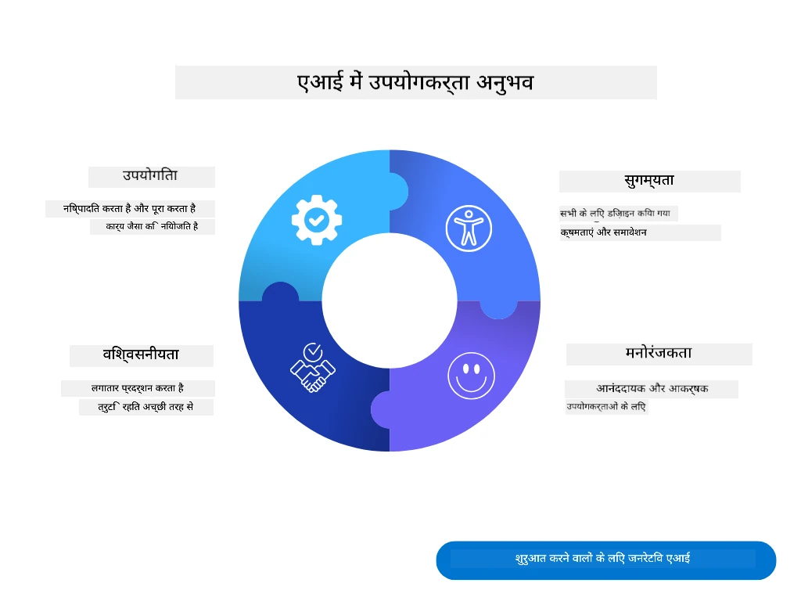
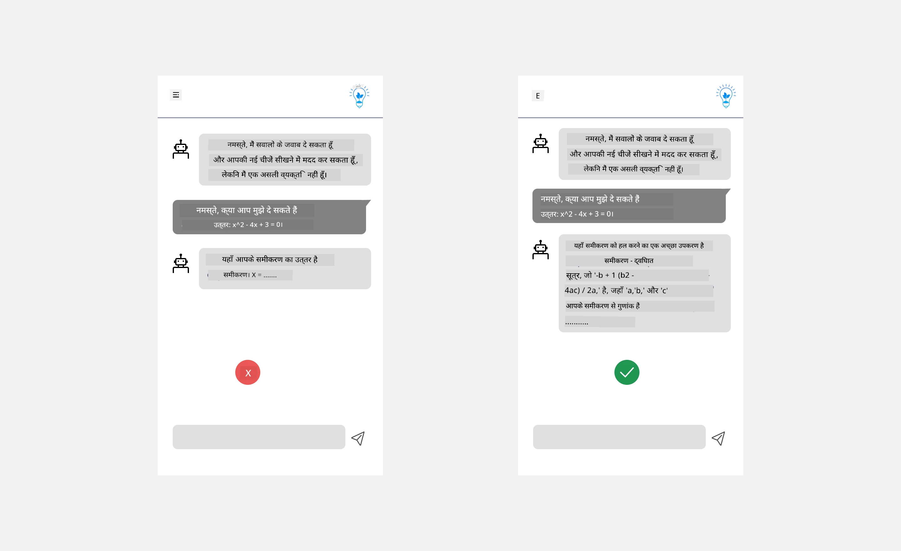
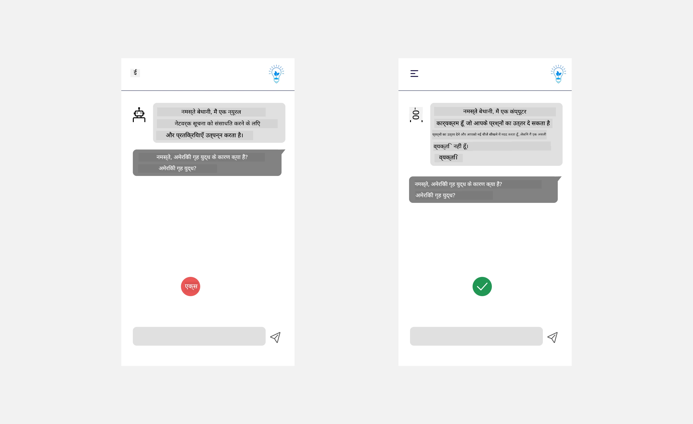
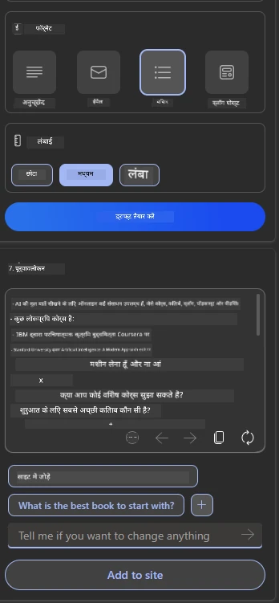
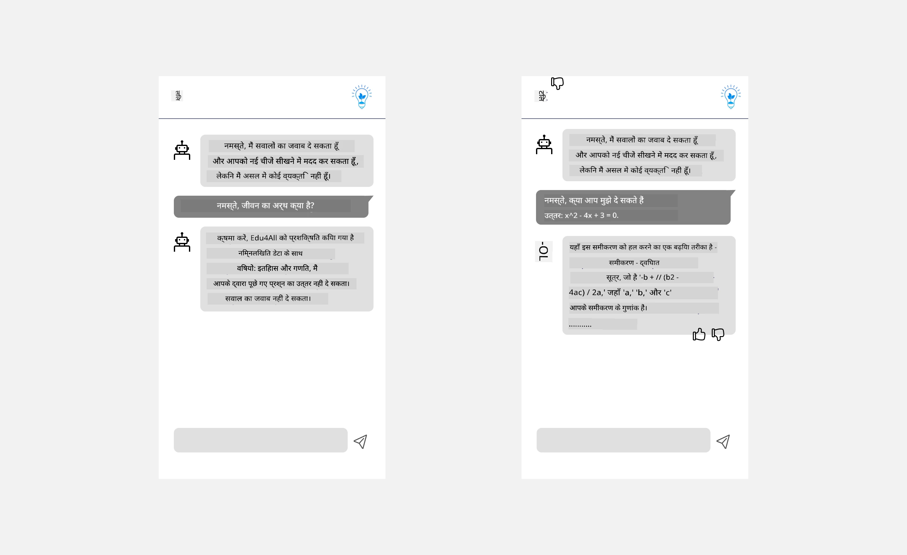

# AI अनुप्रयोगों के लिए UX डिजाइन करना

> _(इस पाठ का वीडियो देखने के लिए ऊपर दिए चित्र पर क्लिक करें)_

उपयोगकर्ता अनुभव ऐप्स बनाने का एक बहुत महत्वपूर्ण पहलू है। उपयोगकर्ताओं को आपके ऐप का कुशलतापूर्वक उपयोग करने में सक्षम होना चाहिए ताकि वे कार्य कर सकें। कुशल होना एक बात है लेकिन आपको ऐसे ऐप्स भी डिजाइन करने होते हैं ताकि वे सभी द्वारा उपयोग किए जा सकें, यानी उन्हें _सुगम्य_ बनाया जाए। यह अध्याय इस क्षेत्र पर केंद्रित होगा ताकि आप अंततः ऐसा ऐप डिजाइन कर सकें जिसे लोग उपयोग कर सकें और करना चाहें।

## परिचय

उपयोगकर्ता अनुभव वह तरीका है जिससे कोई उपयोगकर्ता किसी विशिष्ट उत्पाद या सेवा के साथ इंटरैक्ट करता है और उसका उपयोग करता है, चाहे वह कोई सिस्टम हो, उपकरण हो, या डिज़ाइन हो। एआई अनुप्रयोग विकसित करते समय, डेवलपर्स न केवल यह सुनिश्चित करने पर ध्यान केंद्रित करते हैं कि उपयोगकर्ता अनुभव प्रभावी हो, बल्कि यह कि वह नैतिक भी हो। इस पाठ में, हम ऐसे आर्टिफिशियल इंटेलिजेंस (AI) अनुप्रयोग बनाना सीखेंगे जो उपयोगकर्ता की आवश्यकताओं को पूरा करें।

इस पाठ में निम्नलिखित पहलुओं को कवर किया जाएगा:

- उपयोगकर्ता अनुभव का परिचय और उपयोगकर्ता की आवश्यकताओं को समझना
- विश्वास और पारदर्शिता के लिए AI अनुप्रयोगों का डिजाइन
- सहयोग और प्रतिक्रिया के लिए AI अनुप्रयोगों का डिजाइन

## सीखने के लक्ष्य

इस पाठ को पूरा करने के बाद, आप सक्षम होंगे:

- उपयोगकर्ता की आवश्यकताओं को पूरा करने वाले AI अनुप्रयोग बनाने को समझना।
- AI अनुप्रयोगों को इस तरह डिजाइन करना जो विश्वास और सहयोग को बढ़ावा दें।

### पूर्वापेक्षा

कुछ समय निकालकर [उपयोगकर्ता अनुभव और डिज़ाइन थिंकिंग](https://learn.microsoft.com/training/modules/ux-design?WT.mc_id=academic-105485-koreyst) के बारे में और पढ़ें।

## उपयोगकर्ता अनुभव का परिचय और उपयोगकर्ता की आवश्यकताओं को समझना

हमारे काल्पनिक शिक्षा स्टार्टअप में, हमारे दो मुख्य उपयोगकर्ता हैं, शिक्षक और छात्र। दोनों उपयोगकर्ताओं की विशिष्ट आवश्यकताएं हैं। एक उपयोगकर्ता-केंद्रित डिज़ाइन उपयोगकर्ता को प्राथमिकता देता है ताकि उत्पाद उन लोगों के लिए प्रासंगिक और लाभकारी हों जिनके लिए वे बनाए गए हैं।

अनुप्रयोग को **उपयोगी, विश्वसनीय, सुलभ और सुखद** होना चाहिए ताकि अच्छा उपयोगकर्ता अनुभव प्रदान किया जा सके।

### उपयोगिता

उपयोगी होना मतलब कि अनुप्रयोग की कार्यक्षमता उसका उद्देश्य पूरा करती हो, जैसे मूल्यांकन प्रक्रिया को स्वचालित करना या पुनरावृत्ति के लिए फ्लैशकार्ड्स बनाना। एक ऐसा अनुप्रयोग जो मूल्यांकन प्रक्रिया को स्वचालित करता है, उसे छात्रों के कार्यों को पूर्व निर्धारित मानदंडों के आधार पर सटीक और प्रभावी रूप से अंक देने में सक्षम होना चाहिए। इसी तरह, पुनरावृत्ति के लिए फ्लैशकार्ड्स बनाने वाला अनुप्रयोग अपने डेटा के आधार पर प्रासंगिक और विविध प्रश्न बना सके।

### विश्वसनीयता

विश्वसनीय होना मतलब अनुप्रयोग लगातार और बिना त्रुटियों के अपने कार्य को पूरा कर सके। हालांकि, AI भी मनुष्यों की तरह पूर्ण नहीं है और त्रुटियों से ग्रस्त हो सकता है। अनुप्रयोगों को त्रुटियों या अप्रत्याशित परिस्थितियों का सामना करना पड़ सकता है जिन्हें मानव हस्तक्षेप या सुधार की आवश्यकता हो। आप त्रुटियों को कैसे संभालते हैं? इस पाठ के अंतिम भाग में, हम देखेंगे कि AI सिस्टम और अनुप्रयोग सहयोग और प्रतिक्रिया के लिए कैसे डिजाइन किए जाते हैं।

### सुलभता

सुलभ होना मतलब उपयोगकर्ता अनुभव को विविध क्षमताओं वाले उपयोगकर्ताओं तक पहुंचाना, जिनमें विकलांगता वाले भी शामिल हैं, ताकि कोई भी पीछे न छूटे। सुलभता के दिशानिर्देशों और सिद्धांतों का पालन करके, AI समाधान अधिक समावेशी, उपयोग योग्य और सभी उपयोगकर्ताओं के लिए लाभकारी बन जाता है।

### सुखद अनुभव

सुखद होना मतलब अनुप्रयोग का उपयोग आनंददायक होना चाहिए। एक आकर्षक उपयोगकर्ता अनुभव उपयोगकर्ता पर सकारात्मक प्रभाव डाल सकता है, जिससे वे अनुप्रयोग का पुनः उपयोग करें और व्यवसाय की आय बढ़े।

हर चुनौती को AI से हल नहीं किया जा सकता। AI आपके उपयोगकर्ता अनुभव को बेहतर बनाने के लिए आता है, जैसे मैनुअल कार्यों का स्वचालन करना या उपयोगकर्ता अनुभव को व्यक्तिगत बनाना।

## विश्वास और पारदर्शिता के लिए AI अनुप्रयोगों का डिजाइन

AI अनुप्रयोगों के डिजाइन में विश्वास बनाना अत्यंत महत्वपूर्ण है। विश्वास सुनिश्चित करता है कि उपयोगकर्ता आत्मविश्वास से भरपूर हो कि अनुप्रयोग कार्य पूरा करेगा, लगातार परिणाम देगा और परिणाम उनकी आवश्यकताओं के अनुसार होंगे। इस क्षेत्र में जोखिम है अविश्वास और अत्यधिक विश्वास का। अविश्वास तब होता है जब उपयोगकर्ता का AI सिस्टम में कम या कोई भरोसा नहीं होता, जिससे उपयोगकर्ता आपके अनुप्रयोग को अस्वीकार कर देता है। अत्यधिक विश्वास तब होता है जब उपयोगकर्ता AI सिस्टम की क्षमता को अधिक आंकता है, जिससे वे ज़्यादा भरोसा कर लेते हैं। उदाहरण के लिए, मूल्यांकन प्रणाली के अत्यधिक विश्वास के मामले में शिक्षक कुछ पेपर्स की जांच नहीं करते जिससे मूल्यांकन प्रणाली सही तरीके से काम करती है या नहीं। इससे छात्रों को अनुचित या गलत अंक मिल सकते हैं, या प्रतिक्रिया और सुधार के अवसर छूट सकते हैं।

विश्वास को डिजाइन के केंद्र में रखने के दो तरीके हैं समझाने योग्य होना और नियंत्रण।

### समझाने योग्य होना

जब AI निर्णय लेने में मदद करता है, जैसे भविष्य की पीढ़ियों को ज्ञान देना, तो शिक्षकों और माता-पिता के लिए यह समझना महत्वपूर्ण है कि AI निर्णय कैसे लिए जाते हैं। इसे समझाने योग्य होना कहते हैं - यह समझना कि AI अनुप्रयोग कैसे निर्णय लेते हैं। समझाने योग्य डिज़ाइन में ऐसे विवरण शामिल होते हैं जो बताते हैं कि AI ने परिणाम तक कैसे पहुंचा। दर्शकों को यह पता होना चाहिए कि आउटपुट AI द्वारा उत्पन्न है न कि मनुष्य द्वारा। उदाहरण के लिए, "अपने ट्यूटर से अब चैटिंग शुरू करें" कहने के बजाय कहें "AI ट्यूटर का उपयोग करें जो आपकी आवश्यकताओं के अनुसार ढलता है और आपकी गति से सीखने में मदद करता है।"

एक और उदाहरण यह है कि AI उपयोगकर्ता और व्यक्तिगत डेटा का उपयोग कैसे करता है। उदाहरण के लिए, छात्र के व्यक्ति के रूप में एक उपयोगकर्ता हो सकता है जिसकी कुछ सीमाएं हों। AI प्रश्नों के उत्तर नहीं दे सकता लेकिन उपयोगकर्ता को मार्गदर्शन कर सकता है कि वे समस्या को कैसे हल कर सकते हैं।

समझाने योग्य का एक अंतिम प्रमुख भाग है व्याख्याओं का सरलीकरण। छात्र और शिक्षक AI विशेषज्ञ नहीं हो सकते, इसलिए यह बताया जाना चाहिए कि अनुप्रयोग क्या कर सकता है या क्या नहीं, उसे सरल और समझने में आसान बनाया जाना चाहिए।

### नियंत्रण

जनरेटिव AI उपयोगकर्ता और AI के बीच सहयोग बनाता है, जहां उपयोगकर्ता विभिन्न परिणामों के लिए प्रॉम्प्ट्स को संशोधित कर सकता है। इसके अतिरिक्त, आउटपुट उत्पन्न होने के बाद उपयोगकर्ता परिणाम को संशोधित कर सकते हैं, जिससे उन्हें नियंत्रण की भावना मिलती है। उदाहरण के लिए, Microsoft Copilot (पूर्व में Bing Chat) का उपयोग करते समय, आप प्रारूप, टोन और लंबाई के आधार पर अपना प्रॉम्प्ट अनुकूलित कर सकते हैं। साथ ही, आप अपने आउटपुट में परिवर्तन जोड़ सकते हैं और आउटपुट को संशोधित कर सकते हैं जैसा नीचे दिखाया गया है:

Microsoft Copilot में एक और फीचर जो उपयोगकर्ता को नियंत्रण देता है, वह है AI द्वारा उपयोग किए जाने वाले डेटा का चयन करने या छोड़ने का विकल्प। एक स्कूल अनुप्रयोग के लिए, छात्र अपने नोट्स के साथ-साथ शिक्षकों के संसाधनों का पुनरावृत्ति सामग्री के रूप में उपयोग करना चाह सकता है।

> AI अनुप्रयोगों को डिजाइन करते समय, जानबूझकरता महत्वपूर्ण है ताकि उपयोगकर्ता अत्यधिक भरोसा न करें और इसके क्षमताओं के लिए अवास्तविक अपेक्षाएं न रखें। ऐसा करने का एक तरीका है प्रॉम्प्ट्स और परिणामों के बीच घर्षण पैदा करना। उपयोगकर्ता को याद दिलाना कि यह AI है, कोई इंसान नहीं।

## सहयोग और प्रतिक्रिया के लिए AI अनुप्रयोगों का डिजाइन

जैसा कि पहले बताया गया है, जनरेटिव AI उपयोगकर्ता और AI के बीच सहयोग बनाता है। अधिकांश सहभागिता उपयोगकर्ता द्वारा प्रॉम्प्ट इनपुट करना और AI द्वारा आउटपुट उत्पन्न करना है। अगर आउटपुट गलत हो तो? अगर त्रुटि होती है तो अनुप्रयोग कैसे संभालता है? क्या AI उपयोगकर्ता को दोष देता है या त्रुटि समझाने के लिए समय लेता है?

AI अनुप्रयोगों को प्रतिक्रिया प्राप्त करने और देने के लिए बनाया जाना चाहिए। यह न केवल AI प्रणाली को सुधारने में मदद करता है बल्कि उपयोगकर्ताओं के साथ विश्वास भी बनाता है। डिजाइन में एक प्रतिक्रिया लूप शामिल होना चाहिए, उदाहरण के लिए आउटपुट पर सरल अंगूठा ऊपर या नीचे विकल्प।

इसका एक और तरीका है सिस्टम की क्षमताओं और सीमाओं को स्पष्ट रूप से संप्रेषित करना। जब उपयोगकर्ता AI की क्षमताओं से अधिक कुछ मांगता है तो इसे संभालने का तरीका होना चाहिए, जैसा नीचे दिखाया गया है।

सिस्टम त्रुटियाँ सामान्य हैं जहाँ उपयोगकर्ता को AI के दायरे से बाहर जानकारी में सहायता की जरूरत हो सकती है या अनुप्रयोग में सीमित विषयों पर संक्षेप जनरेट करने की सीमा हो सकती है। उदाहरण के लिए, एक AI अनुप्रयोग जो सीमित विषयों जैसे इतिहास और गणित के डेटा पर प्रशिक्षित है, भूगोल से संबंधित प्रश्नों को संभाल नहीं सकता। इसे कम करने के लिए, AI प्रणाली उत्तर दे सकती है: "क्षमा करें, हमारा उत्पाद निम्न विषयों पर प्रशिक्षित है....., मैं आपके पूछे गए प्रश्न का उत्तर नहीं दे सकता।"

AI अनुप्रयोग पूर्ण नहीं हैं, इसलिए वे गलतियां कर सकते हैं। अपने अनुप्रयोगों को डिजाइन करते समय, सुनिश्चित करें कि उपयोगकर्ताओं से प्रतिक्रिया लेने और त्रुटि को संभालने के लिए स्थान हो, जो सरल और समझाने में आसान हो।

## असाइनमेंट

अब तक आपने जो भी AI ऐप्स बनाए हैं, उनके लिए नीचे दिए गए कदम लागू करने पर विचार करें:

- **सुखद अनुभव:** सोचें कि आप अपने ऐप को और अधिक सुखद कैसे बना सकते हैं। क्या आप हर जगह समझाइयाँ जोड़ रहे हैं? क्या आप उपयोगकर्ता को अन्वेषण के लिए प्रोत्साहित कर रहे हैं? आप अपनी त्रुटि संदेशों को कैसे शब्दबद्ध कर रहे हैं?

- **उपयोगिता:** एक वेब ऐप बना रहे हैं। सुनिश्चित करें कि आपका ऐप माउस और कीबोर्ड दोनों से नेविगेट किया जा सकता है।

- **विश्वास और पारदर्शिता:** AI और इसके आउटपुट पर पूरी तरह भरोसा न करें, विचार करें कि आप आउटपुट को सत्यापित करने के लिए प्रक्रिया में एक मानव को कैसे शामिल करेंगे। इसके अलावा, विश्वास और पारदर्शिता प्राप्त करने के अन्य तरीकों पर विचार करें और लागू करें।

- **नियंत्रण:** उपयोगकर्ता को उनके द्वारा अनुप्रयोग को प्रदान किए गए डेटा पर नियंत्रण दें। AI अनुप्रयोग में डेटा संग्रहण के लिए उपयोगकर्ता को ऑप्ट-इन और ऑप्ट-आउट करने का तरीका लागू करें।

<!-- ## [Post-lecture quiz](../../../12-designing-ux-for-ai-applications/quiz-url) -->

## अपनी सीख जारी रखें!

इस पाठ को पूरा करने के बाद, हमारे [Generative AI Learning collection](https://aka.ms/genai-collection?WT.mc_id=academic-105485-koreyst) को देखें और अपनी जनरेटिव AI ज्ञान को और उन्नत करें!

पाठ 13 पर जाएं, जहाँ हम देखेंगे कि [AI अनुप्रयोगों को सुरक्षित कैसे करें](../13-securing-ai-applications/README.md?WT.mc_id=academic-105485-koreyst)!

---

<!-- CO-OP TRANSLATOR DISCLAIMER START -->
**अस्वीकरण**:
इस दस्तावेज़ का अनुवाद AI अनुवाद सेवा [Co-op Translator](https://github.com/Azure/co-op-translator) का उपयोग करके किया गया है। जबकि हम सटीकता के लिए प्रयास करते हैं, कृपया ध्यान दें कि स्वचालित अनुवादों में त्रुटियाँ या अशुद्धियाँ हो सकती हैं। मूल दस्तावेज़ अपनी मूल भाषा में ही प्रामाणिक स्रोत माना जाना चाहिए। महत्वपूर्ण जानकारी के लिए, पेशेवर मानव अनुवाद की सिफारिश की जाती है। इस अनुवाद के उपयोग से उत्पन्न किसी भी गलतफहमी या गलत व्याख्या के लिए हम उत्तरदायी नहीं हैं।
<!-- CO-OP TRANSLATOR DISCLAIMER END -->