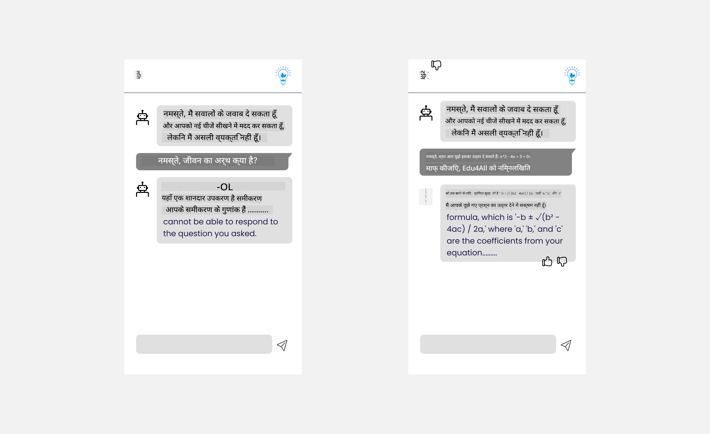

<!--
CO_OP_TRANSLATOR_METADATA:
{
  "original_hash": "78bbeed50fd4dc9fdee931f5daf98cb3",
  "translation_date": "2025-10-18T00:09:54+00:00",
  "source_file": "12-designing-ux-for-ai-applications/README.md",
  "language_code": "hi"
}
-->
# एआई एप्लिकेशन के लिए UX डिज़ाइन करना

> _(ऊपर दी गई छवि पर क्लिक करें और इस पाठ का वीडियो देखें)_

यूज़र एक्सपीरियंस ऐप्स बनाने का एक बहुत ही महत्वपूर्ण पहलू है। उपयोगकर्ताओं को आपके ऐप का उपयोग करके कार्यों को कुशलतापूर्वक पूरा करने में सक्षम होना चाहिए। कुशल होना एक बात है, लेकिन आपको ऐप्स को इस तरह से डिज़ाइन करने की भी आवश्यकता है कि हर कोई उनका उपयोग कर सके, जिससे वे _सुलभ_ बनें। यह अध्याय इस क्षेत्र पर केंद्रित होगा ताकि आप एक ऐसा ऐप डिज़ाइन कर सकें जिसे लोग उपयोग कर सकें और उपयोग करना चाहें।

## परिचय

यूज़र एक्सपीरियंस वह है कि उपयोगकर्ता किसी विशेष उत्पाद या सेवा के साथ कैसे इंटरैक्ट करता है और उसका उपयोग करता है, चाहे वह कोई सिस्टम हो, टूल हो, या डिज़ाइन। एआई एप्लिकेशन विकसित करते समय, डेवलपर्स न केवल यह सुनिश्चित करने पर ध्यान केंद्रित करते हैं कि यूज़र एक्सपीरियंस प्रभावी हो, बल्कि यह भी कि वह नैतिक हो। इस पाठ में, हम उन एआई एप्लिकेशन को बनाने के बारे में चर्चा करेंगे जो उपयोगकर्ता की आवश्यकताओं को पूरा करते हैं।

पाठ निम्नलिखित क्षेत्रों को कवर करेगा:

- यूज़र एक्सपीरियंस का परिचय और उपयोगकर्ता की आवश्यकताओं को समझना
- विश्वास और पारदर्शिता के लिए एआई एप्लिकेशन डिज़ाइन करना
- सहयोग और प्रतिक्रिया के लिए एआई एप्लिकेशन डिज़ाइन करना

## सीखने के लक्ष्य

इस पाठ को पूरा करने के बाद, आप सक्षम होंगे:

- समझें कि उपयोगकर्ता की आवश्यकताओं को पूरा करने वाले एआई एप्लिकेशन कैसे बनाए जाएं।
- ऐसे एआई एप्लिकेशन डिज़ाइन करें जो विश्वास और सहयोग को बढ़ावा दें।

### पूर्वापेक्षा

थोड़ा समय निकालें और [यूज़र एक्सपीरियंस और डिज़ाइन थिंकिंग](https://learn.microsoft.com/training/modules/ux-design?WT.mc_id=academic-105485-koreyst) के बारे में अधिक पढ़ें।

## यूज़र एक्सपीरियंस का परिचय और उपयोगकर्ता की आवश्यकताओं को समझना

हमारे काल्पनिक शिक्षा स्टार्टअप में, हमारे पास दो प्राथमिक उपयोगकर्ता हैं, शिक्षक और छात्र। इन दोनों उपयोगकर्ताओं की अलग-अलग आवश्यकताएँ हैं। उपयोगकर्ता-केंद्रित डिज़ाइन उपयोगकर्ता को प्राथमिकता देता है, यह सुनिश्चित करता है कि उत्पाद उन लोगों के लिए प्रासंगिक और लाभकारी हों जिनके लिए इसे बनाया गया है।

ऐप्लिकेशन को **उपयोगी, विश्वसनीय, सुलभ और सुखद** होना चाहिए ताकि एक अच्छा यूज़र एक्सपीरियंस प्रदान किया जा सके।

### उपयोगिता

उपयोगी होने का मतलब है कि ऐप्लिकेशन में वह कार्यक्षमता होनी चाहिए जो उसके इच्छित उद्देश्य से मेल खाती हो, जैसे ग्रेडिंग प्रक्रिया को स्वचालित करना या पुनरीक्षण के लिए फ्लैशकार्ड बनाना। एक ऐसा ऐप्लिकेशन जो ग्रेडिंग प्रक्रिया को स्वचालित करता है, उसे पूर्वनिर्धारित मानदंडों के आधार पर छात्रों के कार्यों को सटीक और कुशलतापूर्वक अंक प्रदान करने में सक्षम होना चाहिए। इसी तरह, एक ऐसा ऐप्लिकेशन जो पुनरीक्षण फ्लैशकार्ड बनाता है, उसे अपने डेटा के आधार पर प्रासंगिक और विविध प्रश्न बनाने में सक्षम होना चाहिए।

### विश्वसनीयता

विश्वसनीय होने का मतलब है कि ऐप्लिकेशन लगातार और बिना किसी त्रुटि के अपना कार्य कर सकता है। हालांकि, एआई भी इंसानों की तरह परिपूर्ण नहीं है और त्रुटियों के प्रति संवेदनशील हो सकता है। ऐप्लिकेशन में त्रुटियाँ या अप्रत्याशित स्थितियाँ हो सकती हैं जिनके लिए मानव हस्तक्षेप या सुधार की आवश्यकता होती है। आप त्रुटियों को कैसे संभालते हैं? इस पाठ के अंतिम भाग में, हम चर्चा करेंगे कि एआई सिस्टम और ऐप्लिकेशन को सहयोग और प्रतिक्रिया के लिए कैसे डिज़ाइन किया जाता है।

### सुलभता

सुलभ होने का मतलब है कि उपयोगकर्ता अनुभव को विभिन्न क्षमताओं वाले उपयोगकर्ताओं तक विस्तारित करना, जिसमें विकलांगता वाले लोग भी शामिल हैं, यह सुनिश्चित करना कि कोई भी पीछे न छूटे। सुलभता दिशानिर्देशों और सिद्धांतों का पालन करके, एआई समाधान अधिक समावेशी, उपयोगी और सभी उपयोगकर्ताओं के लिए लाभकारी बन जाते हैं।

### सुखद

सुखद होने का मतलब है कि ऐप्लिकेशन का उपयोग करना आनंददायक हो। एक आकर्षक उपयोगकर्ता अनुभव का उपयोगकर्ता पर सकारात्मक प्रभाव पड़ सकता है, जिससे वे ऐप्लिकेशन पर वापस लौटने के लिए प्रेरित होते हैं और व्यवसाय की आय बढ़ती है।

हर चुनौती को एआई से हल नहीं किया जा सकता। एआई आपके उपयोगकर्ता अनुभव को बढ़ाने के लिए आता है, चाहे वह मैनुअल कार्यों को स्वचालित करना हो, या उपयोगकर्ता अनुभव को व्यक्तिगत बनाना हो।

## विश्वास और पारदर्शिता के लिए एआई एप्लिकेशन डिज़ाइन करना

एआई एप्लिकेशन डिज़ाइन करते समय विश्वास बनाना बहुत महत्वपूर्ण है। विश्वास यह सुनिश्चित करता है कि उपयोगकर्ता को भरोसा हो कि ऐप्लिकेशन काम पूरा करेगा, लगातार परिणाम देगा और परिणाम वही होंगे जो उपयोगकर्ता को चाहिए। इस क्षेत्र में एक जोखिम अविश्वास और अति-विश्वास है। अविश्वास तब होता है जब उपयोगकर्ता को एआई सिस्टम पर थोड़ा या बिल्कुल भी भरोसा नहीं होता, जिससे उपयोगकर्ता आपके ऐप्लिकेशन को अस्वीकार कर देता है। अति-विश्वास तब होता है जब उपयोगकर्ता एआई सिस्टम की क्षमता को अधिक आंकता है, जिससे उपयोगकर्ता एआई सिस्टम पर बहुत अधिक भरोसा करता है। उदाहरण के लिए, ग्रेडिंग सिस्टम में अति-विश्वास के मामले में शिक्षक कुछ पेपरों को यह सुनिश्चित करने के लिए प्रमाणित नहीं कर सकता कि ग्रेडिंग सिस्टम ठीक से काम कर रहा है। इससे छात्रों के लिए अनुचित या गलत ग्रेड, या प्रतिक्रिया और सुधार के अवसरों की कमी हो सकती है।

विश्वास को डिज़ाइन के केंद्र में रखने के दो तरीके हैं: व्याख्यात्मकता और नियंत्रण।

### व्याख्यात्मकता

जब एआई निर्णय लेने में मदद करता है, जैसे कि भविष्य की पीढ़ियों को ज्ञान प्रदान करना, तो शिक्षकों और माता-पिता के लिए यह समझना महत्वपूर्ण है कि एआई निर्णय कैसे लेता है। इसे व्याख्यात्मकता कहते हैं - यह समझना कि एआई ऐप्लिकेशन निर्णय कैसे लेते हैं। व्याख्यात्मकता के लिए डिज़ाइन करने में यह विवरण जोड़ना शामिल है कि एआई ने आउटपुट तक कैसे पहुंच बनाई। दर्शकों को यह पता होना चाहिए कि आउटपुट एआई द्वारा उत्पन्न किया गया है न कि किसी मानव द्वारा। उदाहरण के लिए, "अपने ट्यूटर के साथ चैटिंग शुरू करें" कहने के बजाय "एआई ट्यूटर का उपयोग करें जो आपकी आवश्यकताओं के अनुसार अनुकूलित होता है और आपको आपकी गति से सीखने में मदद करता है" कहना बेहतर है।

एक और उदाहरण यह है कि एआई उपयोगकर्ता और व्यक्तिगत डेटा का उपयोग कैसे करता है। उदाहरण के लिए, एक उपयोगकर्ता जिसका व्यक्तित्व छात्र है, उसके व्यक्तित्व के आधार पर सीमाएँ हो सकती हैं। एआई प्रश्नों के उत्तर प्रकट करने में सक्षम नहीं हो सकता है, लेकिन उपयोगकर्ता को यह सोचने में मदद कर सकता है कि वे समस्या को कैसे हल कर सकते हैं।

व्याख्यात्मकता का एक और महत्वपूर्ण हिस्सा स्पष्टीकरण को सरल बनाना है। छात्र और शिक्षक एआई विशेषज्ञ नहीं हो सकते हैं, इसलिए ऐप्लिकेशन क्या कर सकता है या नहीं कर सकता है, इसके स्पष्टीकरण को सरल और समझने में आसान होना चाहिए।

### नियंत्रण

जेनरेटिव एआई उपयोगकर्ता और एआई के बीच सहयोग बनाता है, जहां उदाहरण के लिए उपयोगकर्ता विभिन्न परिणामों के लिए प्रॉम्प्ट को संशोधित कर सकता है। इसके अलावा, एक बार आउटपुट उत्पन्न हो जाने के बाद, उपयोगकर्ताओं को परिणामों को संशोधित करने में सक्षम होना चाहिए, जिससे उन्हें नियंत्रण की भावना मिले। उदाहरण के लिए, बिंग का उपयोग करते समय, आप अपने प्रॉम्प्ट को प्रारूप, टोन और लंबाई के आधार पर अनुकूलित कर सकते हैं। इसके अलावा, आप अपने आउटपुट में बदलाव जोड़ सकते हैं और आउटपुट को संशोधित कर सकते हैं जैसा कि नीचे दिखाया गया है:

बिंग में एक और फीचर जो उपयोगकर्ता को ऐप्लिकेशन पर नियंत्रण देता है, वह है डेटा एआई के उपयोग को सक्षम या अक्षम करने की क्षमता। स्कूल ऐप्लिकेशन के लिए, एक छात्र अपने नोट्स के साथ-साथ शिक्षक के संसाधनों का उपयोग पुनरीक्षण सामग्री के रूप में करना चाह सकता है।

> एआई ऐप्लिकेशन डिज़ाइन करते समय, उपयोगकर्ताओं को अति-विश्वास से बचाने के लिए इरादे से डिज़ाइन करना महत्वपूर्ण है ताकि इसकी क्षमताओं की अवास्तविक अपेक्षाएँ न बनें। ऐसा करने का एक तरीका प्रॉम्प्ट और परिणामों के बीच घर्षण पैदा करना है। उपयोगकर्ता को याद दिलाना कि यह एआई है और कोई साथी मानव नहीं।

## सहयोग और प्रतिक्रिया के लिए एआई एप्लिकेशन डिज़ाइन करना

जैसा कि पहले उल्लेख किया गया है, जेनरेटिव एआई उपयोगकर्ता और एआई के बीच सहयोग बनाता है। अधिकांश इंटरैक्शन में उपयोगकर्ता एक प्रॉम्प्ट इनपुट करता है और एआई एक आउटपुट उत्पन्न करता है। अगर आउटपुट गलत हो तो क्या होगा? ऐप्लिकेशन त्रुटियों को कैसे संभालता है यदि वे होती हैं? क्या एआई उपयोगकर्ता को दोष देता है या त्रुटि को समझाने में समय लेता है?

एआई ऐप्लिकेशन को प्रतिक्रिया प्राप्त करने और देने के लिए डिज़ाइन किया जाना चाहिए। यह न केवल एआई सिस्टम को सुधारने में मदद करता है बल्कि उपयोगकर्ताओं के साथ विश्वास भी बनाता है। डिज़ाइन में प्रतिक्रिया चक्र शामिल होना चाहिए, इसका एक उदाहरण आउटपुट पर एक साधारण थम्स अप या डाउन हो सकता है।

इससे निपटने का एक और तरीका सिस्टम की क्षमताओं और सीमाओं को स्पष्ट रूप से संवाद करना है। जब उपयोगकर्ता एआई क्षमताओं से परे कुछ अनुरोध करता है, तो इसे संभालने का भी एक तरीका होना चाहिए, जैसा कि नीचे दिखाया गया है।

सिस्टम त्रुटियाँ ऐप्लिकेशन में आम हैं जहां उपयोगकर्ता को एआई के दायरे से बाहर की जानकारी के लिए सहायता की आवश्यकता हो सकती है या ऐप्लिकेशन में उपयोगकर्ता द्वारा उत्पन्न प्रश्नों/विषयों की संख्या पर सीमा हो सकती है। उदाहरण के लिए, एक एआई ऐप्लिकेशन जो सीमित विषयों के डेटा पर प्रशिक्षित है, जैसे इतिहास और गणित, भूगोल से संबंधित प्रश्नों को संभालने में सक्षम नहीं हो सकता है। इसे कम करने के लिए, एआई सिस्टम ऐसा उत्तर दे सकता है: "माफ करें, हमारे उत्पाद को निम्नलिखित विषयों के डेटा के साथ प्रशिक्षित किया गया है....., मैं आपके द्वारा पूछे गए प्रश्न का उत्तर देने में सक्षम नहीं हूं।"

एआई ऐप्लिकेशन परिपूर्ण नहीं हैं, इसलिए वे गलतियाँ करने के लिए बाध्य हैं। अपने ऐप्लिकेशन डिज़ाइन करते समय, आपको उपयोगकर्ताओं से प्रतिक्रिया और त्रुटि को संभालने के लिए एक ऐसा तरीका सुनिश्चित करना चाहिए जो सरल और आसानी से समझने योग्य हो।

## असाइनमेंट

अब तक आपने जो भी एआई ऐप बनाए हैं, उनमें नीचे दिए गए चरणों को लागू करने पर विचार करें:

- **सुखद:** विचार करें कि आप अपने ऐप को अधिक सुखद कैसे बना सकते हैं। क्या आप हर जगह स्पष्टीकरण जोड़ रहे हैं? क्या आप उपयोगकर्ता को अन्वेषण करने के लिए प्रोत्साहित कर रहे हैं? आप अपने त्रुटि संदेशों को कैसे शब्दबद्ध कर रहे हैं?

- **उपयोगिता:** एक वेब ऐप बनाना। सुनिश्चित करें कि आपका ऐप माउस और कीबोर्ड दोनों द्वारा नेविगेट करने योग्य है।

- **विश्वास और पारदर्शिता:** एआई और इसके आउटपुट पर पूरी तरह से भरोसा न करें, विचार करें कि आप आउटपुट को सत्यापित करने के लिए प्रक्रिया में एक मानव को कैसे जोड़ सकते हैं। विश्वास और पारदर्शिता प्राप्त करने के अन्य तरीकों पर भी विचार करें और उन्हें लागू करें।

- **नियंत्रण:** उपयोगकर्ता को उस डेटा पर नियंत्रण दें जो वे ऐप्लिकेशन को प्रदान करते हैं। एआई ऐप्लिकेशन में डेटा संग्रह को सक्षम और अक्षम करने का एक तरीका लागू करें।

## अपनी सीख जारी रखें!

इस पाठ को पूरा करने के बाद, हमारे [जेनरेटिव एआई लर्निंग संग्रह](https://aka.ms/genai-collection?WT.mc_id=academic-105485-koreyst) को देखें ताकि आप जेनरेटिव एआई के ज्ञान को और बढ़ा सकें!

पाठ 13 पर जाएं, जहां हम देखेंगे कि [एआई एप्लिकेशन को सुरक्षित कैसे बनाएं](../13-securing-ai-applications/README.md?WT.mc_id=academic-105485-koreyst)!

---

**अस्वीकरण**:  
यह दस्तावेज़ AI अनुवाद सेवा [Co-op Translator](https://github.com/Azure/co-op-translator) का उपयोग करके अनुवादित किया गया है। जबकि हम सटीकता के लिए प्रयास करते हैं, कृपया ध्यान दें कि स्वचालित अनुवाद में त्रुटियां या अशुद्धियां हो सकती हैं। मूल भाषा में दस्तावेज़ को आधिकारिक स्रोत माना जाना चाहिए। महत्वपूर्ण जानकारी के लिए, पेशेवर मानव अनुवाद की सिफारिश की जाती है। इस अनुवाद के उपयोग से उत्पन्न किसी भी गलतफहमी या गलत व्याख्या के लिए हम जिम्मेदार नहीं हैं।