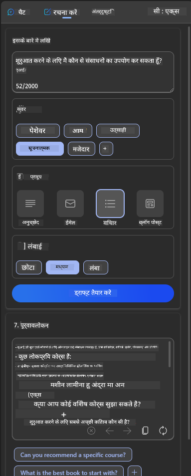

<!--
CO_OP_TRANSLATOR_METADATA:
{
  "original_hash": "ec385b41ee50579025d50cc03bfb3a25",
  "translation_date": "2025-07-09T14:53:01+00:00",
  "source_file": "12-designing-ux-for-ai-applications/README.md",
  "language_code": "hi"
}
-->
# AI एप्लिकेशन के लिए UX डिजाइन करना

> _(इस पाठ का वीडियो देखने के लिए ऊपर की छवि पर क्लिक करें)_

यूजर एक्सपीरियंस ऐप बनाने का एक बहुत महत्वपूर्ण पहलू है। उपयोगकर्ताओं को आपके ऐप का उपयोग कुशलता से करना चाहिए ताकि वे अपने कार्यों को पूरा कर सकें। कुशल होना एक बात है, लेकिन आपको ऐसे ऐप भी डिजाइन करने होते हैं जिन्हें हर कोई उपयोग कर सके, यानी उन्हें _सुलभ_ बनाना। यह अध्याय इसी क्षेत्र पर केंद्रित होगा ताकि आप अंततः ऐसा ऐप डिजाइन कर सकें जिसे लोग उपयोग करना चाहें और कर सकें।

## परिचय

यूजर एक्सपीरियंस उस तरीके को कहते हैं जिससे कोई उपयोगकर्ता किसी विशेष उत्पाद या सेवा के साथ इंटरैक्ट करता है और उसका उपयोग करता है, चाहे वह सिस्टम हो, टूल हो या डिज़ाइन। AI एप्लिकेशन विकसित करते समय, डेवलपर्स न केवल यह सुनिश्चित करते हैं कि यूजर एक्सपीरियंस प्रभावी हो, बल्कि यह भी कि वह नैतिक हो। इस पाठ में, हम ऐसे आर्टिफिशियल इंटेलिजेंस (AI) एप्लिकेशन बनाने के बारे में जानेंगे जो उपयोगकर्ता की जरूरतों को पूरा करते हैं।

यह पाठ निम्नलिखित विषयों को कवर करेगा:

- यूजर एक्सपीरियंस का परिचय और उपयोगकर्ता की जरूरतों को समझना
- विश्वास और पारदर्शिता के लिए AI एप्लिकेशन डिजाइन करना
- सहयोग और फीडबैक के लिए AI एप्लिकेशन डिजाइन करना

## सीखने के लक्ष्य

इस पाठ को पूरा करने के बाद, आप सक्षम होंगे:

- उपयोगकर्ता की जरूरतों को पूरा करने वाले AI एप्लिकेशन बनाना समझना।
- ऐसे AI एप्लिकेशन डिजाइन करना जो विश्वास और सहयोग को बढ़ावा दें।

### पूर्व आवश्यकताएँ

कुछ समय निकालकर [यूजर एक्सपीरियंस और डिज़ाइन थिंकिंग](https://learn.microsoft.com/training/modules/ux-design?WT.mc_id=academic-105485-koreyst) के बारे में और पढ़ें।

## यूजर एक्सपीरियंस का परिचय और उपयोगकर्ता की जरूरतों को समझना

हमारे काल्पनिक शिक्षा स्टार्टअप में दो मुख्य उपयोगकर्ता हैं, शिक्षक और छात्र। दोनों उपयोगकर्ताओं की अलग-अलग आवश्यकताएं हैं। उपयोगकर्ता-केंद्रित डिज़ाइन उपयोगकर्ता को प्राथमिकता देता है ताकि उत्पाद उन लोगों के लिए प्रासंगिक और लाभकारी हों जिनके लिए वे बनाए गए हैं।

ऐप्लिकेशन को **उपयोगी, विश्वसनीय, सुलभ और सुखद** होना चाहिए ताकि अच्छा यूजर एक्सपीरियंस मिल सके।

### उपयोगिता

उपयोगी होने का मतलब है कि ऐप्लिकेशन में वह कार्यक्षमता हो जो उसके उद्देश्य से मेल खाती हो, जैसे ग्रेडिंग प्रक्रिया को स्वचालित करना या पुनरावृत्ति के लिए फ्लैशकार्ड बनाना। जो ऐप ग्रेडिंग प्रक्रिया को स्वचालित करता है, उसे पूर्वनिर्धारित मानदंडों के आधार पर छात्रों के कार्यों को सटीक और कुशलता से अंकित करना चाहिए। इसी तरह, जो ऐप पुनरावृत्ति फ्लैशकार्ड बनाता है, उसे अपने डेटा के आधार पर प्रासंगिक और विविध प्रश्न बनाने चाहिए।

### विश्वसनीयता

विश्वसनीय होने का मतलब है कि ऐप लगातार और बिना त्रुटि के अपना कार्य कर सके। हालांकि, AI भी मनुष्यों की तरह पूर्ण नहीं है और इसमें त्रुटियां हो सकती हैं। ऐप्लिकेशन को ऐसी त्रुटियों या अप्रत्याशित परिस्थितियों का सामना करना पड़ सकता है जिनके लिए मानव हस्तक्षेप या सुधार की आवश्यकता होती है। आप त्रुटियों को कैसे संभालते हैं? इस पाठ के अंतिम भाग में, हम देखेंगे कि AI सिस्टम और ऐप्लिकेशन सहयोग और फीडबैक के लिए कैसे डिजाइन किए जाते हैं।

### सुलभता

सुलभ होने का मतलब है कि यूजर एक्सपीरियंस को विभिन्न क्षमताओं वाले उपयोगकर्ताओं तक बढ़ाना, जिनमें विकलांगता वाले भी शामिल हैं, ताकि कोई भी बाहर न रहे। सुलभता के दिशानिर्देशों और सिद्धांतों का पालन करके, AI समाधान अधिक समावेशी, उपयोगी और सभी उपयोगकर्ताओं के लिए लाभकारी बन जाते हैं।

### सुखद

सुखद होने का मतलब है कि ऐप्लिकेशन का उपयोग करना आनंददायक हो। एक आकर्षक यूजर एक्सपीरियंस उपयोगकर्ता पर सकारात्मक प्रभाव डाल सकता है, जिससे वे ऐप पर वापस आने के लिए प्रोत्साहित होते हैं और व्यवसाय की आय बढ़ती है।

हर चुनौती को AI से हल नहीं किया जा सकता। AI आपके यूजर एक्सपीरियंस को बढ़ाने के लिए आता है, चाहे वह मैनुअल कार्यों को स्वचालित करना हो या यूजर एक्सपीरियंस को व्यक्तिगत बनाना हो।

## विश्वास और पारदर्शिता के लिए AI एप्लिकेशन डिजाइन करना

AI एप्लिकेशन डिजाइन करते समय विश्वास बनाना बहुत महत्वपूर्ण है। विश्वास यह सुनिश्चित करता है कि उपयोगकर्ता को भरोसा हो कि ऐप काम पूरा करेगा, लगातार परिणाम देगा और परिणाम वही होंगे जो उपयोगकर्ता चाहता है। इस क्षेत्र में जोखिम है अविश्वास और अति-विश्वास का। अविश्वास तब होता है जब उपयोगकर्ता AI सिस्टम पर कम या कोई भरोसा नहीं करता, जिससे वह आपके ऐप को अस्वीकार कर देता है। अति-विश्वास तब होता है जब उपयोगकर्ता AI सिस्टम की क्षमता को अधिक आंकता है, जिससे वे AI सिस्टम पर बहुत अधिक भरोसा कर लेते हैं। उदाहरण के लिए, एक स्वचालित ग्रेडिंग सिस्टम के मामले में अति-विश्वास से शिक्षक कुछ पेपरों को जांचना छोड़ सकते हैं, जिससे छात्रों को अनुचित या गलत अंक मिल सकते हैं, या फीडबैक और सुधार के अवसर छूट सकते हैं।

विश्वास को डिजाइन के केंद्र में रखने के दो तरीके हैं: व्याख्यात्मकता और नियंत्रण।

### व्याख्यात्मकता

जब AI निर्णय लेने में मदद करता है, जैसे भविष्य की पीढ़ियों को ज्ञान देना, तो शिक्षकों और माता-पिता के लिए यह समझना महत्वपूर्ण होता है कि AI निर्णय कैसे लिए जाते हैं। इसे व्याख्यात्मकता कहते हैं - यह समझना कि AI एप्लिकेशन निर्णय कैसे लेते हैं। व्याख्यात्मकता के लिए डिजाइन में AI एप्लिकेशन क्या कर सकता है, इसके उदाहरण शामिल करना होता है। उदाहरण के लिए, "AI शिक्षक के साथ शुरू करें" के बजाय सिस्टम कह सकता है: "AI का उपयोग करके अपने नोट्स को आसान पुनरावृत्ति के लिए संक्षेप करें।"

एक और उदाहरण है कि AI उपयोगकर्ता और व्यक्तिगत डेटा का उपयोग कैसे करता है। उदाहरण के लिए, एक छात्र के रूप में उपयोगकर्ता की सीमाएं हो सकती हैं। AI प्रश्नों के उत्तर सीधे नहीं दे सकता, लेकिन उपयोगकर्ता को सोचने में मदद कर सकता है कि वे समस्या को कैसे हल कर सकते हैं।

व्याख्यात्मकता का एक अंतिम महत्वपूर्ण हिस्सा है व्याख्याओं को सरल बनाना। छात्र और शिक्षक AI विशेषज्ञ नहीं हो सकते, इसलिए ऐप क्या कर सकता है या क्या नहीं कर सकता, इसकी व्याख्या सरल और समझने में आसान होनी चाहिए।

### नियंत्रण

जनरेटिव AI उपयोगकर्ता और AI के बीच सहयोग बनाता है, जहां उपयोगकर्ता विभिन्न परिणामों के लिए प्रॉम्प्ट को संशोधित कर सकता है। इसके अलावा, एक बार आउटपुट बनने के बाद, उपयोगकर्ता परिणामों को संशोधित कर सकते हैं, जिससे उन्हें नियंत्रण का एहसास होता है। उदाहरण के लिए, Bing का उपयोग करते समय, आप अपने प्रॉम्प्ट को फॉर्मेट, टोन और लंबाई के आधार पर अनुकूलित कर सकते हैं। साथ ही, आप अपने आउटपुट में बदलाव जोड़ सकते हैं और उसे संशोधित कर सकते हैं, जैसा कि नीचे दिखाया गया है:

Bing की एक और विशेषता जो उपयोगकर्ता को ऐप पर नियंत्रण देती है, वह है AI द्वारा उपयोग किए जाने वाले डेटा में ऑप्ट-इन और ऑप्ट-आउट करने की क्षमता। एक स्कूल ऐप्लिकेशन के लिए, छात्र अपने नोट्स के साथ-साथ शिक्षक के संसाधनों का भी पुनरावृत्ति सामग्री के रूप में उपयोग करना चाह सकता है।

> AI एप्लिकेशन डिजाइन करते समय, जानबूझकर यह सुनिश्चित करना जरूरी है कि उपयोगकर्ता अति-विश्वास न करें और इसकी क्षमताओं के बारे में अवास्तविक अपेक्षाएं न रखें। ऐसा करने का एक तरीका है प्रॉम्प्ट और परिणामों के बीच कुछ बाधा बनाना, उपयोगकर्ता को याद दिलाना कि यह AI है, कोई इंसान नहीं।

## सहयोग और फीडबैक के लिए AI एप्लिकेशन डिजाइन करना

जैसा कि पहले बताया गया, जनरेटिव AI उपयोगकर्ता और AI के बीच सहयोग बनाता है। अधिकांश इंटरैक्शन में उपयोगकर्ता प्रॉम्प्ट देता है और AI आउटपुट बनाता है। अगर आउटपुट गलत हो तो क्या होगा? अगर त्रुटि होती है तो ऐप्लिकेशन उसे कैसे संभालता है? क्या AI उपयोगकर्ता को दोष देता है या त्रुटि समझाने में समय लेता है?

AI एप्लिकेशन को फीडबैक प्राप्त करने और देने के लिए बनाया जाना चाहिए। इससे न केवल AI सिस्टम में सुधार होता है, बल्कि उपयोगकर्ताओं के साथ विश्वास भी बनता है। डिजाइन में एक फीडबैक लूप शामिल होना चाहिए, उदाहरण के लिए आउटपुट पर सरल थम्ब्स अप या डाउन।

इसे संभालने का एक और तरीका है सिस्टम की क्षमताओं और सीमाओं को स्पष्ट रूप से संप्रेषित करना। जब उपयोगकर्ता AI की क्षमताओं से बाहर कुछ मांगता है, तो इसे संभालने का तरीका भी होना चाहिए, जैसा कि नीचे दिखाया गया है।

सिस्टम त्रुटियां सामान्य हैं, जहां उपयोगकर्ता को AI के दायरे से बाहर जानकारी में सहायता की आवश्यकता हो सकती है या ऐप्लिकेशन में यह सीमा हो सकती है कि उपयोगकर्ता कितने प्रश्न/विषयों के सारांश बना सकता है। उदाहरण के लिए, एक AI ऐप्लिकेशन जिसे सीमित विषयों जैसे इतिहास और गणित के डेटा पर प्रशिक्षित किया गया है, वह भूगोल से संबंधित प्रश्नों को संभाल नहीं सकता। इसे कम करने के लिए, AI सिस्टम ऐसा जवाब दे सकता है: "क्षमा करें, हमारा उत्पाद निम्नलिखित विषयों के डेटा पर प्रशिक्षित है....., मैं आपके पूछे गए प्रश्न का उत्तर नहीं दे सकता।"

AI एप्लिकेशन पूर्ण नहीं होते, इसलिए वे गलतियां कर सकते हैं। जब आप अपने ऐप्लिकेशन डिजाइन करें, तो सुनिश्चित करें कि आप उपयोगकर्ताओं से फीडबैक लेने और त्रुटि प्रबंधन के लिए जगह बनाएं जो सरल और समझने में आसान हो।

## असाइनमेंट

अब तक आपने जो भी AI ऐप बनाए हैं, उनमें नीचे दिए गए कदम लागू करने पर विचार करें:

- **सुखद:** सोचें कि आप अपने ऐप को और अधिक सुखद कैसे बना सकते हैं। क्या आप हर जगह व्याख्याएं जोड़ रहे हैं? क्या आप उपयोगकर्ता को खोजने के लिए प्रोत्साहित कर रहे हैं? आप अपनी त्रुटि संदेशों को कैसे शब्दबद्ध कर रहे हैं?

- **उपयोगिता:** एक वेब ऐप बना रहे हैं। सुनिश्चित करें कि आपका ऐप माउस और कीबोर्ड दोनों से नेविगेट किया जा सके।

- **विश्वास और पारदर्शिता:** AI और उसके आउटपुट पर पूरी तरह भरोसा न करें, सोचें कि आप आउटपुट की जांच के लिए प्रक्रिया में इंसान को कैसे शामिल करेंगे। साथ ही, विश्वास और पारदर्शिता प्राप्त करने के अन्य तरीकों को लागू करें।

- **नियंत्रण:** उपयोगकर्ता को उस डेटा पर नियंत्रण दें जो वे ऐप्लिकेशन को प्रदान करते हैं। AI ऐप्लिकेशन में डेटा संग्रह के लिए उपयोगकर्ता को ऑप्ट-इन और ऑप्ट-आउट करने का तरीका लागू करें।

## अपनी सीख जारी रखें!

इस पाठ को पूरा करने के बाद, हमारे [Generative AI Learning collection](https://aka.ms/genai-collection?WT.mc_id=academic-105485-koreyst) को देखें और अपनी Generative AI की जानकारी को और बढ़ाएं!

अगले पाठ 13 पर जाएं, जहां हम देखेंगे कि [AI एप्लिकेशन को कैसे सुरक्षित करें](../13-securing-ai-applications/README.md?WT.mc_id=academic-105485-koreyst)!

**अस्वीकरण**:  
यह दस्तावेज़ AI अनुवाद सेवा [Co-op Translator](https://github.com/Azure/co-op-translator) का उपयोग करके अनुवादित किया गया है। जबकि हम सटीकता के लिए प्रयासरत हैं, कृपया ध्यान दें कि स्वचालित अनुवादों में त्रुटियाँ या अशुद्धियाँ हो सकती हैं। मूल दस्तावेज़ अपनी मूल भाषा में ही अधिकारिक स्रोत माना जाना चाहिए। महत्वपूर्ण जानकारी के लिए, पेशेवर मानव अनुवाद की सलाह दी जाती है। इस अनुवाद के उपयोग से उत्पन्न किसी भी गलतफहमी या गलत व्याख्या के लिए हम जिम्मेदार नहीं हैं।