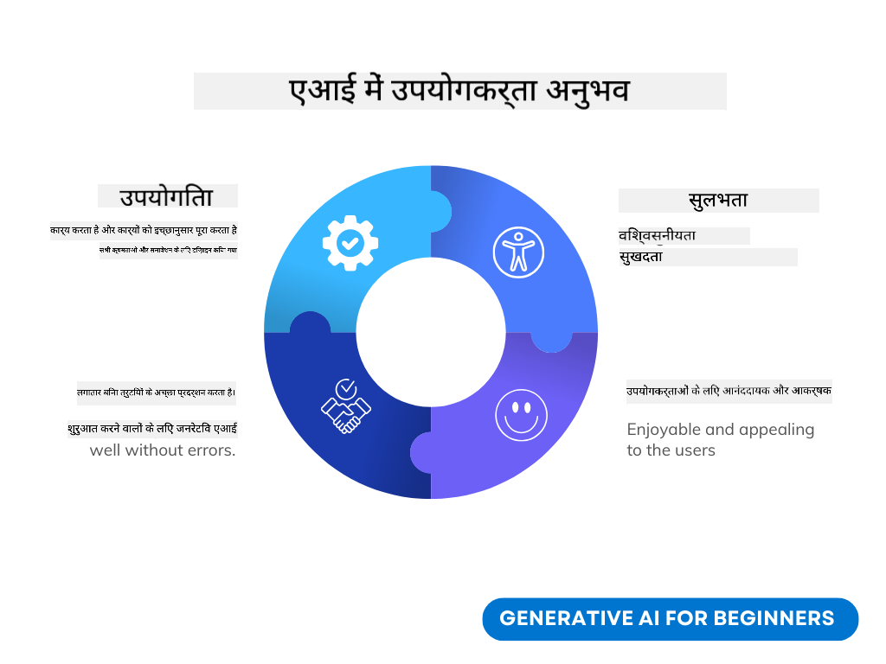
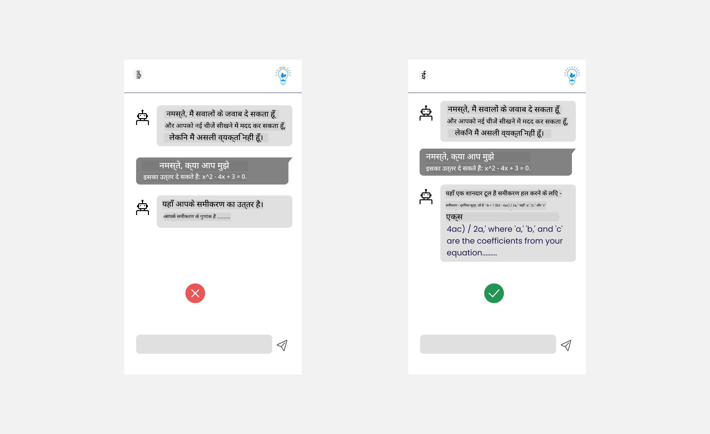
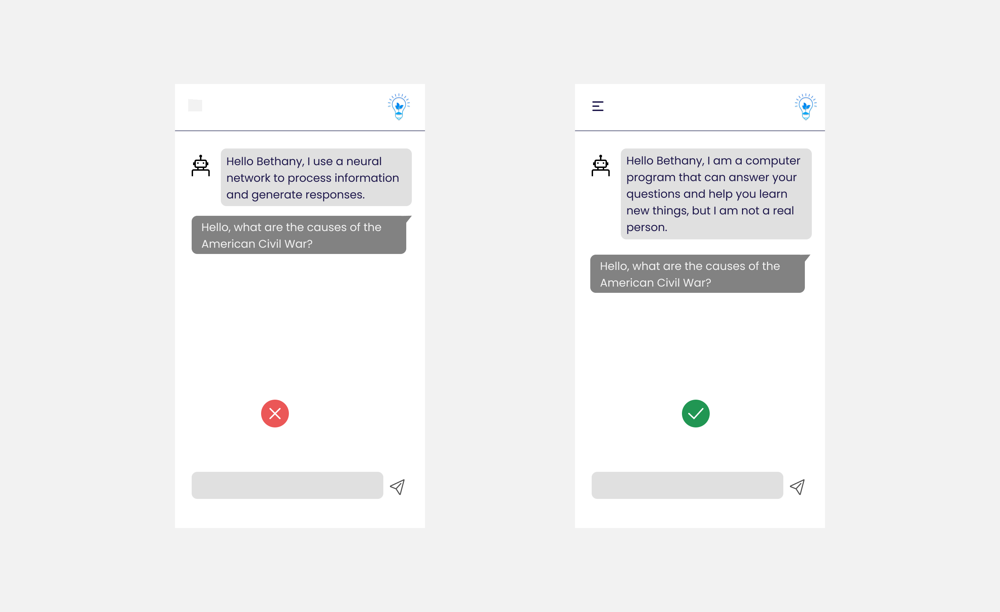

<!--
CO_OP_TRANSLATOR_METADATA:
{
  "original_hash": "747668e4c53d067369f06e9ec2e6313e",
  "translation_date": "2025-08-26T15:31:25+00:00",
  "source_file": "12-designing-ux-for-ai-applications/README.md",
  "language_code": "hi"
}
-->
# एआई एप्लिकेशन के लिए यूएक्स डिज़ाइन करना

> _(ऊपर दी गई छवि पर क्लिक करें और इस पाठ का वीडियो देखें)_

यूज़र एक्सपीरियंस ऐप बनाने का एक बहुत महत्वपूर्ण पहलू है। यूज़र्स को आपके ऐप का उपयोग कुशलता से करना आना चाहिए ताकि वे अपने कार्य पूरे कर सकें। कुशल होना एक बात है, लेकिन आपको ऐप ऐसे भी डिज़ाइन करने चाहिए कि हर कोई उनका उपयोग कर सके, यानी वे _सुलभ_ हों। यह अध्याय इसी क्षेत्र पर केंद्रित है ताकि आप ऐसा ऐप डिज़ाइन करें जिसे लोग इस्तेमाल कर सकें और करना चाहें।

## परिचय

यूज़र एक्सपीरियंस वह है कि कोई यूज़र किसी विशेष उत्पाद या सेवा के साथ कैसे इंटरैक्ट करता है और उसका उपयोग करता है, चाहे वह कोई सिस्टम हो, टूल हो या डिज़ाइन। जब एआई एप्लिकेशन विकसित किए जाते हैं, तो डेवलपर्स न केवल यह सुनिश्चित करने पर ध्यान देते हैं कि यूज़र एक्सपीरियंस प्रभावी हो, बल्कि यह भी कि वह नैतिक हो। इस पाठ में, हम जानेंगे कि कैसे आर्टिफिशियल इंटेलिजेंस (एआई) एप्लिकेशन बनाए जाएं जो यूज़र की ज़रूरतों को पूरा करें।

इस पाठ में निम्नलिखित क्षेत्रों को कवर किया जाएगा:

- यूज़र एक्सपीरियंस का परिचय और यूज़र की ज़रूरतों को समझना
- ट्रस्ट और ट्रांसपेरेंसी के लिए एआई एप्लिकेशन डिज़ाइन करना
- सहयोग और फीडबैक के लिए एआई एप्लिकेशन डिज़ाइन करना

## सीखने के लक्ष्य

इस पाठ को पढ़ने के बाद, आप सक्षम होंगे:

- समझ पाएंगे कि यूज़र की ज़रूरतों को पूरा करने वाले एआई एप्लिकेशन कैसे बनाए जाएं।
- ऐसे एआई एप्लिकेशन डिज़ाइन करें जो ट्रस्ट और सहयोग को बढ़ावा दें।

### पूर्व-आवश्यकता

थोड़ा समय निकालें और [यूज़र एक्सपीरियंस और डिज़ाइन थिंकिंग](https://learn.microsoft.com/training/modules/ux-design?WT.mc_id=academic-105485-koreyst) के बारे में और पढ़ें।

## यूज़र एक्सपीरियंस का परिचय और यूज़र की ज़रूरतों को समझना

हमारे काल्पनिक एजुकेशन स्टार्टअप में दो मुख्य यूज़र हैं, शिक्षक और छात्र। दोनों की ज़रूरतें अलग-अलग हैं। यूज़र-सेंट्रिक डिज़ाइन में यूज़र को प्राथमिकता दी जाती है, जिससे यह सुनिश्चित होता है कि उत्पाद उनके लिए प्रासंगिक और लाभकारी हों, जिनके लिए वे बनाए गए हैं।

एप्लिकेशन को **उपयोगी, विश्वसनीय, सुलभ और सुखद** होना चाहिए ताकि अच्छा यूज़र एक्सपीरियंस मिल सके।

### उपयोगिता

उपयोगी होने का मतलब है कि एप्लिकेशन में वह कार्यक्षमता होनी चाहिए जो उसके उद्देश्य से मेल खाती हो, जैसे ग्रेडिंग प्रक्रिया को ऑटोमेट करना या रिवीजन के लिए फ्लैशकार्ड बनाना। एक ऐसा एप्लिकेशन जो ग्रेडिंग प्रक्रिया को ऑटोमेट करता है, उसे छात्रों के कार्यों को पूर्वनिर्धारित मानदंडों के आधार पर सटीक और कुशलता से अंक देने में सक्षम होना चाहिए। इसी तरह, एक ऐसा एप्लिकेशन जो रिवीजन फ्लैशकार्ड बनाता है, उसे अपने डेटा के आधार पर प्रासंगिक और विविध प्रश्न तैयार करने में सक्षम होना चाहिए।

### विश्वसनीयता

विश्वसनीय होने का मतलब है कि एप्लिकेशन लगातार और बिना त्रुटि के अपना कार्य कर सके। हालांकि, एआई भी इंसानों की तरह परिपूर्ण नहीं है और उसमें भी गलतियां हो सकती हैं। एप्लिकेशन में कभी-कभी ऐसी त्रुटियां या अप्रत्याशित स्थितियां आ सकती हैं, जिनके लिए मानवीय हस्तक्षेप या सुधार की आवश्यकता हो। आप त्रुटियों को कैसे संभालते हैं? इस पाठ के अंतिम भाग में, हम जानेंगे कि एआई सिस्टम और एप्लिकेशन को सहयोग और फीडबैक के लिए कैसे डिज़ाइन किया जाता है।

### सुलभता

सुलभ होने का मतलब है कि यूज़र एक्सपीरियंस को विभिन्न क्षमताओं वाले यूज़र्स तक बढ़ाया जाए, जिसमें दिव्यांगजन भी शामिल हैं, ताकि कोई भी पीछे न छूटे। एक्सेसिबिलिटी गाइडलाइंस और सिद्धांतों का पालन करके, एआई समाधान अधिक समावेशी, उपयोगी और सभी यूज़र्स के लिए लाभकारी बनते हैं।

### सुखद

सुखद होने का मतलब है कि एप्लिकेशन का उपयोग करना आनंददायक हो। एक आकर्षक यूज़र एक्सपीरियंस यूज़र पर सकारात्मक प्रभाव डाल सकता है, जिससे वे बार-बार एप्लिकेशन का उपयोग करना चाहेंगे और इससे व्यवसाय की आय भी बढ़ सकती है।

हर चुनौती का समाधान एआई से नहीं किया जा सकता। एआई आपके यूज़र एक्सपीरियंस को बेहतर बनाने के लिए आता है, चाहे वह मैन्युअल कार्यों को ऑटोमेट करना हो या यूज़र एक्सपीरियंस को पर्सनलाइज़ करना हो।

## ट्रस्ट और ट्रांसपेरेंसी के लिए एआई एप्लिकेशन डिज़ाइन करना

एआई एप्लिकेशन डिज़ाइन करते समय ट्रस्ट बनाना बहुत जरूरी है। ट्रस्ट यह सुनिश्चित करता है कि यूज़र को भरोसा हो कि एप्लिकेशन काम करेगा, लगातार परिणाम देगा और परिणाम वही होंगे जो यूज़र चाहता है। इस क्षेत्र में एक जोखिम है - अविश्वास और अति-विश्वास। अविश्वास तब होता है जब यूज़र को एआई सिस्टम पर बहुत कम या बिल्कुल भी भरोसा नहीं होता, जिससे वह आपके एप्लिकेशन को अस्वीकार कर देता है। अति-विश्वास तब होता है जब यूज़र एआई सिस्टम की क्षमता को अधिक आंकता है, जिससे यूज़र एआई सिस्टम पर जरूरत से ज्यादा भरोसा करने लगता है। उदाहरण के लिए, एक ऑटोमेटेड ग्रेडिंग सिस्टम में अति-विश्वास के कारण शिक्षक कुछ पेपरों को खुद जांचना छोड़ सकता है, जिससे यह सुनिश्चित नहीं हो पाता कि ग्रेडिंग सिस्टम सही काम कर रहा है। इससे छात्रों को अनुचित या गलत ग्रेड मिल सकते हैं, या फीडबैक और सुधार के अवसर छूट सकते हैं।

डिज़ाइन के केंद्र में ट्रस्ट लाने के दो तरीके हैं - explainability (व्याख्यात्मकता) और नियंत्रण।

### Explainability (व्याख्यात्मकता)

जब एआई निर्णय लेने में मदद करता है, जैसे भविष्य की पीढ़ियों को ज्ञान देना, तो शिक्षकों और अभिभावकों के लिए यह समझना जरूरी है कि एआई निर्णय कैसे लेता है। यही explainability है - यह समझना कि एआई एप्लिकेशन निर्णय कैसे लेते हैं। explainability के लिए डिज़ाइन करने में उन विवरणों को जोड़ना शामिल है, जो यह दिखाते हैं कि एआई ने किस तरह से आउटपुट तैयार किया। दर्शकों को पता होना चाहिए कि आउटपुट एआई द्वारा जनरेट किया गया है, न कि किसी इंसान द्वारा। उदाहरण के लिए, "अब अपने ट्यूटर से चैटिंग शुरू करें" कहने के बजाय कहें "ऐसे एआई ट्यूटर का उपयोग करें जो आपकी ज़रूरतों के अनुसार ढलता है और आपकी गति से सीखने में मदद करता है।"

एक और उदाहरण है कि एआई यूज़र और व्यक्तिगत डेटा का उपयोग कैसे करता है। उदाहरण के लिए, एक यूज़र जिसकी पर्सोना 'छात्र' है, उसकी पर्सोना के आधार पर कुछ सीमाएं हो सकती हैं। एआई शायद प्रश्नों के उत्तर नहीं बता सकता, लेकिन यूज़र को यह सोचने में मदद कर सकता है कि वे समस्या कैसे हल कर सकते हैं।

explainability का एक और महत्वपूर्ण हिस्सा है स्पष्टीकरण को सरल बनाना। छात्र और शिक्षक एआई विशेषज्ञ नहीं हो सकते, इसलिए एप्लिकेशन क्या कर सकता है या नहीं कर सकता, इसका स्पष्टीकरण सरल और समझने में आसान होना चाहिए।

### नियंत्रण

जनरेटिव एआई यूज़र और एआई के बीच सहयोग बनाता है, जहां उदाहरण के लिए, यूज़र अलग-अलग परिणामों के लिए प्रॉम्प्ट बदल सकता है। इसके अलावा, एक बार आउटपुट जनरेट हो जाने के बाद, यूज़र्स को परिणामों को बदलने की सुविधा मिलनी चाहिए, जिससे उन्हें नियंत्रण का अनुभव हो। उदाहरण के लिए, Bing का उपयोग करते समय, आप अपने प्रॉम्प्ट को फॉर्मेट, टोन और लंबाई के आधार पर कस्टमाइज़ कर सकते हैं। साथ ही, आप अपने आउटपुट में बदलाव कर सकते हैं और उसे संशोधित कर सकते हैं, जैसा कि नीचे दिखाया गया है:

Bing में एक और फीचर है, जिससे यूज़र एप्लिकेशन पर नियंत्रण रख सकता है - एआई द्वारा उपयोग किए जाने वाले डेटा में ऑप्ट-इन और ऑप्ट-आउट करने की सुविधा। किसी स्कूल एप्लिकेशन में, छात्र अपने नोट्स के साथ-साथ शिक्षकों के संसाधनों का भी रिवीजन सामग्री के रूप में उपयोग करना चाह सकता है।

> एआई एप्लिकेशन डिज़ाइन करते समय, यह सुनिश्चित करने के लिए इरादतनता जरूरी है कि यूज़र अति-विश्वास न करें और इसकी क्षमताओं की अवास्तविक अपेक्षाएं न रखें। इसका एक तरीका है प्रॉम्प्ट और परिणामों के बीच थोड़ा friction (अंतर) बनाना। यूज़र को याद दिलाएं कि यह एआई है, कोई इंसान नहीं।

## सहयोग और फीडबैक के लिए एआई एप्लिकेशन डिज़ाइन करना

जैसा कि पहले बताया गया, जनरेटिव एआई यूज़र और एआई के बीच सहयोग बनाता है। अधिकतर इंटरैक्शन में यूज़र प्रॉम्प्ट डालता है और एआई आउटपुट जनरेट करता है। अगर आउटपुट गलत हो तो क्या होगा? अगर एप्लिकेशन में त्रुटि आ जाए तो वह कैसे संभालेगा? क्या एआई यूज़र को दोष देगा या त्रुटि को समझाने का प्रयास करेगा?

एआई एप्लिकेशन को इस तरह बनाया जाना चाहिए कि वे फीडबैक ले और दे सकें। इससे न केवल एआई सिस्टम में सुधार होता है, बल्कि यूज़र्स के साथ ट्रस्ट भी बनता है। डिज़ाइन में फीडबैक लूप शामिल होना चाहिए, उदाहरण के लिए आउटपुट पर सिंपल थम्स अप या डाउन का विकल्प।

एक और तरीका है सिस्टम की क्षमताओं और सीमाओं को स्पष्ट रूप से बताना। जब कोई यूज़र एआई की क्षमताओं से बाहर कुछ मांगता है, तो उसे संभालने का भी तरीका होना चाहिए, जैसा कि नीचे दिखाया गया है।

सिस्टम त्रुटियां एप्लिकेशन में आम हैं, जहां यूज़र को एआई की सीमा से बाहर की जानकारी चाहिए होती है या एप्लिकेशन में यह सीमा हो सकती है कि यूज़र कितने प्रश्न/विषयों के लिए सारांश बना सकता है। उदाहरण के लिए, एक एआई एप्लिकेशन जिसे सीमित विषयों (जैसे इतिहास और गणित) के डेटा से प्रशिक्षित किया गया है, वह भूगोल से जुड़े प्रश्नों को संभाल नहीं सकता। इसे संभालने के लिए, एआई सिस्टम ऐसा जवाब दे सकता है: "माफ़ कीजिए, हमारे उत्पाद को निम्नलिखित विषयों के डेटा से प्रशिक्षित किया गया है....., मैं आपके पूछे गए प्रश्न का उत्तर नहीं दे सकता।"

एआई एप्लिकेशन परिपूर्ण नहीं हैं, इसलिए उनसे गलतियां होना स्वाभाविक है। जब आप अपने एप्लिकेशन डिज़ाइन करें, तो सुनिश्चित करें कि यूज़र्स से फीडबैक लेने और त्रुटियों को संभालने के लिए जगह हो, और यह प्रक्रिया सरल और आसानी से समझाई जा सके।

## असाइनमेंट

अब तक आपने जो भी एआई ऐप बनाए हैं, उनमें नीचे दिए गए कदमों को लागू करने पर विचार करें:

- **सुखद:** सोचें कि आप अपने ऐप को और अधिक सुखद कैसे बना सकते हैं। क्या आप हर जगह स्पष्टीकरण जोड़ रहे हैं? क्या आप यूज़र को एक्सप्लोर करने के लिए प्रोत्साहित कर रहे हैं? आप अपनी त्रुटि संदेशों को कैसे शब्दों में ढाल रहे हैं?

- **उपयोगिता:** वेब ऐप बना रहे हैं। सुनिश्चित करें कि आपका ऐप माउस और कीबोर्ड दोनों से नेविगेट किया जा सकता है।

- **ट्रस्ट और ट्रांसपेरेंसी:** एआई और उसके आउटपुट पर पूरी तरह भरोसा न करें, सोचें कि आप प्रक्रिया में किसी इंसान को कैसे जोड़ सकते हैं ताकि आउटपुट को सत्यापित किया जा सके। साथ ही, ट्रस्ट और ट्रांसपेरेंसी हासिल करने के अन्य तरीके भी सोचें और लागू करें।

- **नियंत्रण:** यूज़र को उस डेटा पर नियंत्रण दें, जो वे एप्लिकेशन को देते हैं। एआई एप्लिकेशन में डेटा कलेक्शन के लिए यूज़र को ऑप्ट-इन और ऑप्ट-आउट करने का तरीका लागू करें।

## अपनी सीख जारी रखें!

इस पाठ को पूरा करने के बाद, हमारे [Generative AI Learning collection](https://aka.ms/genai-collection?WT.mc_id=academic-105485-koreyst) को देखें और अपनी जनरेटिव एआई नॉलेज को और आगे बढ़ाएं!

अब चलें पाठ 13 की ओर, जिसमें हम जानेंगे कि [एआई एप्लिकेशन को सुरक्षित कैसे बनाएं](../13-securing-ai-applications/README.md?WT.mc_id=academic-105485-koreyst)!

---

**अस्वीकरण**:  
यह दस्तावेज़ AI अनुवाद सेवा [Co-op Translator](https://github.com/Azure/co-op-translator) का उपयोग करके अनुवादित किया गया है। जबकि हम सटीकता के लिए प्रयासरत हैं, कृपया ध्यान दें कि स्वचालित अनुवादों में त्रुटियाँ या गलतियाँ हो सकती हैं। मूल दस्तावेज़ को उसकी मूल भाषा में ही प्रामाणिक स्रोत माना जाना चाहिए। महत्वपूर्ण जानकारी के लिए, पेशेवर मानव अनुवाद की सिफारिश की जाती है। इस अनुवाद के उपयोग से उत्पन्न किसी भी गलतफहमी या गलत व्याख्या के लिए हम उत्तरदायी नहीं हैं।