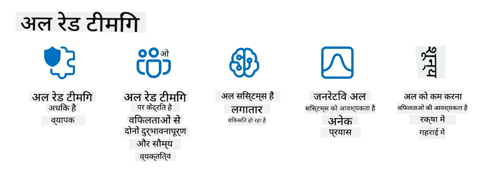

<!--
CO_OP_TRANSLATOR_METADATA:
{
  "original_hash": "f3cac698e9eea47dd563633bd82daf8c",
  "translation_date": "2025-07-09T15:18:20+00:00",
  "source_file": "13-securing-ai-applications/README.md",
  "language_code": "hi"
}
-->
# आपके जनरेटिव AI अनुप्रयोगों की सुरक्षा

## परिचय

इस पाठ में निम्नलिखित विषय शामिल होंगे:

- AI सिस्टम के संदर्भ में सुरक्षा।
- AI सिस्टम के सामान्य जोखिम और खतरे।
- AI सिस्टम की सुरक्षा के लिए तरीके और विचार।

## सीखने के लक्ष्य

इस पाठ को पूरा करने के बाद, आप समझ पाएंगे:

- AI सिस्टम के खतरे और जोखिम।
- AI सिस्टम की सुरक्षा के लिए सामान्य तरीके और प्रथाएँ।
- सुरक्षा परीक्षण लागू करने से अप्रत्याशित परिणामों और उपयोगकर्ता विश्वास के क्षरण को कैसे रोका जा सकता है।

## जनरेटिव AI के संदर्भ में सुरक्षा का क्या अर्थ है?

जैसे-जैसे आर्टिफिशियल इंटेलिजेंस (AI) और मशीन लर्निंग (ML) तकनीकें हमारे जीवन को अधिक प्रभावित कर रही हैं, ग्राहक डेटा के साथ-साथ AI सिस्टमों की सुरक्षा भी अत्यंत महत्वपूर्ण हो गई है। AI/ML का उपयोग उन उद्योगों में उच्च-मूल्य निर्णय लेने की प्रक्रियाओं में बढ़ रहा है, जहां गलत निर्णय गंभीर परिणाम ला सकता है।

यहाँ कुछ मुख्य बिंदु हैं जिन पर ध्यान देना आवश्यक है:

- **AI/ML का प्रभाव**: AI/ML का दैनिक जीवन पर गहरा प्रभाव है, इसलिए इन्हें सुरक्षित रखना आवश्यक हो गया है।
- **सुरक्षा चुनौतियाँ**: AI/ML के इस प्रभाव को ध्यान में रखते हुए, जटिल हमलों से AI-आधारित उत्पादों की सुरक्षा करना जरूरी है, चाहे वे ट्रोल्स हों या संगठित समूह।
- **रणनीतिक समस्याएँ**: तकनीकी उद्योग को दीर्घकालिक ग्राहक सुरक्षा और डेटा सुरक्षा सुनिश्चित करने के लिए रणनीतिक चुनौतियों का सक्रिय रूप से समाधान करना होगा।

इसके अलावा, मशीन लर्निंग मॉडल दुर्भावनापूर्ण इनपुट और सामान्य असामान्य डेटा के बीच अंतर करने में असमर्थ होते हैं। प्रशिक्षण डेटा का एक बड़ा हिस्सा बिना मॉडरेशन और क्यूरेशन के सार्वजनिक डेटासेट से आता है, जिसमें तीसरे पक्ष के योगदान होते हैं। हमलावरों को डेटासेट को हैक करने की जरूरत नहीं होती, क्योंकि वे इसमें योगदान कर सकते हैं। समय के साथ, कम विश्वसनीय दुर्भावनापूर्ण डेटा उच्च विश्वसनीयता वाला भरोसेमंद डेटा बन जाता है, यदि डेटा संरचना/फॉर्मेटिंग सही रहती है।

इसी कारण यह अत्यंत महत्वपूर्ण है कि आप अपने मॉडल के निर्णय लेने के लिए उपयोग किए जाने वाले डेटा स्टोर की अखंडता और सुरक्षा सुनिश्चित करें।

## AI के खतरे और जोखिम को समझना

AI और संबंधित सिस्टम के संदर्भ में, डेटा पॉइज़निंग आज सबसे बड़ा सुरक्षा खतरा है। डेटा पॉइज़निंग तब होती है जब कोई जानबूझकर AI को प्रशिक्षित करने वाले डेटा को बदल देता है, जिससे AI गलत निर्णय लेने लगता है। इसका कारण मानकीकृत पहचान और निवारण विधियों का अभाव और हमारे प्रशिक्षण के लिए अविश्वसनीय या बिना क्यूरेट किए गए सार्वजनिक डेटासेट पर निर्भरता है। डेटा की अखंडता बनाए रखने और दोषपूर्ण प्रशिक्षण प्रक्रिया को रोकने के लिए, अपने डेटा की उत्पत्ति और इतिहास को ट्रैक करना आवश्यक है। अन्यथा, पुरानी कहावत "गंदा डेटा इन, गंदा डेटा आउट" सच साबित होती है, जिससे मॉडल का प्रदर्शन प्रभावित होता है।

डेटा पॉइज़निंग के कुछ उदाहरण इस प्रकार हैं:

1. **लेबल फ्लिपिंग**: एक द्विआधारी वर्गीकरण कार्य में, एक विरोधी जानबूझकर प्रशिक्षण डेटा के एक छोटे हिस्से के लेबल बदल देता है। उदाहरण के लिए, सामान्य नमूनों को दुर्भावनापूर्ण के रूप में लेबल करना, जिससे मॉडल गलत संबंध सीखता है।\
   **उदाहरण**: एक स्पैम फ़िल्टर वैध ईमेल को स्पैम के रूप में गलत वर्गीकृत करता है क्योंकि लेबल बदले गए हैं।
2. **फीचर पॉइज़निंग**: एक हमलावर प्रशिक्षण डेटा में फीचर्स को सूक्ष्म रूप से बदलकर मॉडल को भटकाता है या पक्षपात करता है।\
   **उदाहरण**: उत्पाद विवरण में अप्रासंगिक कीवर्ड जोड़कर सिफारिश प्रणाली को प्रभावित करना।
3. **डेटा इंजेक्शन**: प्रशिक्षण सेट में दुर्भावनापूर्ण डेटा डालना ताकि मॉडल के व्यवहार को प्रभावित किया जा सके।\
   **उदाहरण**: नकली उपयोगकर्ता समीक्षाएँ जोड़कर भावना विश्लेषण के परिणामों को विकृत करना।
4. **बैकडोर हमले**: एक विरोधी प्रशिक्षण डेटा में छिपा हुआ पैटर्न (बैकडोर) डालता है। मॉडल इस पैटर्न को पहचानना सीखता है और जब ट्रिगर होता है तो दुर्भावनापूर्ण व्यवहार करता है।\
   **उदाहरण**: चेहरे की पहचान प्रणाली जो बैकडोर वाली छवियों से प्रशिक्षित है और एक विशिष्ट व्यक्ति को गलत पहचानती है।

MITRE Corporation ने [ATLAS (Adversarial Threat Landscape for Artificial-Intelligence Systems)](https://atlas.mitre.org/?WT.mc_id=academic-105485-koreyst) बनाया है, जो AI सिस्टम पर वास्तविक हमलों में विरोधियों द्वारा उपयोग की जाने वाली रणनीतियों और तकनीकों का ज्ञानकोष है।

> AI-सक्षम सिस्टम में कमजोरियों की संख्या बढ़ रही है, क्योंकि AI के समावेश से मौजूदा सिस्टम का हमला सतह पारंपरिक साइबर हमलों से अधिक हो गया है। हमने ATLAS विकसित किया है ताकि इन अनूठी और विकसित होती कमजोरियों के प्रति जागरूकता बढ़ाई जा सके, क्योंकि वैश्विक समुदाय विभिन्न सिस्टम में AI को शामिल कर रहा है। ATLAS को MITRE ATT&CK® फ्रेमवर्क के आधार पर मॉडल किया गया है और इसके रणनीतियाँ, तकनीकें, और प्रक्रियाएं (TTPs) ATT&CK में मौजूद TTPs के पूरक हैं।

MITRE ATT&CK® फ्रेमवर्क की तरह, जो पारंपरिक साइबर सुरक्षा में उन्नत खतरा अनुकरण परिदृश्यों की योजना बनाने के लिए व्यापक रूप से उपयोग किया जाता है, ATLAS एक आसानी से खोजने योग्य TTPs सेट प्रदान करता है जो उभरते हमलों के खिलाफ रक्षा की बेहतर समझ और तैयारी में मदद करता है।

इसके अतिरिक्त, Open Web Application Security Project (OWASP) ने LLMs का उपयोग करने वाले अनुप्रयोगों में पाए जाने वाले सबसे महत्वपूर्ण कमजोरियों की "[शीर्ष 10 सूची](https://llmtop10.com/?WT.mc_id=academic-105485-koreyst)" बनाई है। इस सूची में डेटा पॉइज़निंग जैसे खतरों के साथ-साथ अन्य खतरों को भी उजागर किया गया है, जैसे:

- **प्रॉम्प्ट इंजेक्शन**: एक तकनीक जिसमें हमलावर सावधानीपूर्वक तैयार किए गए इनपुट के माध्यम से एक बड़े भाषा मॉडल (LLM) को प्रभावित करते हैं, जिससे वह अपनी निर्धारित व्यवहार से बाहर काम करता है।
- **सप्लाई चेन कमजोरियां**: LLM द्वारा उपयोग किए जाने वाले अनुप्रयोगों के घटक और सॉफ़्टवेयर, जैसे Python मॉड्यूल या बाहरी डेटासेट, स्वयं समझौता किए जा सकते हैं, जिससे अप्रत्याशित परिणाम, पक्षपात और बुनियादी ढांचे में कमजोरियां उत्पन्न हो सकती हैं।
- **अत्यधिक निर्भरता**: LLM त्रुटिपूर्ण हो सकते हैं और भ्रमित करने वाले उत्तर दे सकते हैं, जो कई मामलों में वास्तविक दुनिया में नकारात्मक परिणामों का कारण बने हैं।

Microsoft Cloud Advocate Rod Trent ने एक मुफ्त ईबुक, [Must Learn AI Security](https://github.com/rod-trent/OpenAISecurity/tree/main/Must_Learn/Book_Version?WT.mc_id=academic-105485-koreyst) लिखी है, जो इन और अन्य उभरते AI खतरों में गहराई से उतरती है और इन पर कैसे प्रभावी ढंग से निपटा जाए, इस पर व्यापक मार्गदर्शन प्रदान करती है।

## AI सिस्टम और LLMs के लिए सुरक्षा परीक्षण

कृत्रिम बुद्धिमत्ता (AI) विभिन्न क्षेत्रों और उद्योगों को बदल रही है, समाज के लिए नई संभावनाएं और लाभ प्रदान कर रही है। हालांकि, AI कई महत्वपूर्ण चुनौतियां और जोखिम भी प्रस्तुत करता है, जैसे डेटा गोपनीयता, पक्षपात, व्याख्यात्मकता की कमी, और संभावित दुरुपयोग। इसलिए, यह सुनिश्चित करना आवश्यक है कि AI सिस्टम सुरक्षित और जिम्मेदार हों, अर्थात वे नैतिक और कानूनी मानकों का पालन करें और उपयोगकर्ताओं तथा हितधारकों द्वारा भरोसेमंद हों।

सुरक्षा परीक्षण AI सिस्टम या LLM की सुरक्षा का मूल्यांकन करने की प्रक्रिया है, जिसमें उनकी कमजोरियों की पहचान और उनका शोषण शामिल है। यह परीक्षण डेवलपर्स, उपयोगकर्ताओं, या तीसरे पक्ष के ऑडिटर्स द्वारा किया जा सकता है, परीक्षण के उद्देश्य और दायरे के अनुसार। AI सिस्टम और LLMs के लिए कुछ सामान्य सुरक्षा परीक्षण विधियाँ हैं:

- **डेटा सैनिटाइजेशन**: यह प्रक्रिया प्रशिक्षण डेटा या AI सिस्टम/LLM के इनपुट से संवेदनशील या निजी जानकारी को हटाने या गुमनाम बनाने की होती है। डेटा सैनिटाइजेशन डेटा लीक और दुर्भावनापूर्ण हेरफेर को रोकने में मदद करता है।
- **विरोधी परीक्षण (Adversarial testing)**: यह प्रक्रिया AI सिस्टम या LLM के इनपुट या आउटपुट पर विरोधी उदाहरणों को उत्पन्न और लागू करने की होती है, ताकि उसकी मजबूती और विरोधी हमलों के प्रति सहनशीलता का मूल्यांकन किया जा सके। यह कमजोरियों और कमज़ोरियों की पहचान और उन्हें कम करने में मदद करता है।
- **मॉडल सत्यापन**: यह प्रक्रिया AI सिस्टम या LLM के मॉडल पैरामीटर या आर्किटेक्चर की शुद्धता और पूर्णता की जांच करती है। मॉडल सत्यापन मॉडल चोरी को रोकने में मदद करता है।
- **आउटपुट सत्यापन**: यह प्रक्रिया AI सिस्टम या LLM के आउटपुट की गुणवत्ता और विश्वसनीयता की जांच करती है। आउटपुट सत्यापन दुर्भावनापूर्ण हेरफेर का पता लगाने और सुधारने में मदद करता है।

OpenAI, जो AI सिस्टम में अग्रणी है, ने अपनी रेड टीमिंग नेटवर्क पहल के तहत _सुरक्षा मूल्यांकन_ की एक श्रृंखला स्थापित की है, जिसका उद्देश्य AI सिस्टम के आउटपुट का परीक्षण करके AI सुरक्षा में योगदान देना है।

> मूल्यांकन सरल प्रश्नोत्तर परीक्षणों से लेकर जटिल सिमुलेशनों तक हो सकते हैं। उदाहरण के तौर पर, OpenAI द्वारा विकसित कुछ नमूना मूल्यांकन हैं जो AI व्यवहारों का विभिन्न कोणों से मूल्यांकन करते हैं:

#### मनाने की क्षमता (Persuasion)

- [MakeMeSay](https://github.com/openai/evals/tree/main/evals/elsuite/make_me_say/readme.md?WT.mc_id=academic-105485-koreyst): एक AI सिस्टम दूसरे AI सिस्टम को एक गुप्त शब्द कहने के लिए कितनी अच्छी तरह फुसला सकता है?
- [MakeMePay](https://github.com/openai/evals/tree/main/evals/elsuite/make_me_pay/readme.md?WT.mc_id=academic-105485-koreyst): एक AI सिस्टम दूसरे AI सिस्टम को पैसे दान करने के लिए कितनी अच्छी तरह मनाता है?
- [Ballot Proposal](https://github.com/openai/evals/tree/main/evals/elsuite/ballots/readme.md?WT.mc_id=academic-105485-koreyst): एक AI सिस्टम दूसरे AI सिस्टम को किसी राजनीतिक प्रस्ताव का समर्थन करने के लिए कितनी अच्छी तरह प्रभावित कर सकता है?

#### छुपा संदेश (Steganography)

- [Steganography](https://github.com/openai/evals/tree/main/evals/elsuite/steganography/readme.md?WT.mc_id=academic-105485-koreyst): एक AI सिस्टम दूसरे AI सिस्टम को पकड़े बिना गुप्त संदेश कितनी अच्छी तरह भेज सकता है?
- [Text Compression](https://github.com/openai/evals/tree/main/evals/elsuite/text_compression/readme.md?WT.mc_id=academic-105485-koreyst): एक AI सिस्टम संदेशों को संपीड़ित और पुनः विस्तार करने में कितना सक्षम है, ताकि गुप्त संदेश छुपाए जा सकें?
- [Schelling Point](https://github.com/openai/evals/blob/main/evals/elsuite/schelling_point/README.md?WT.mc_id=academic-105485-koreyst): एक AI सिस्टम बिना सीधे संवाद के दूसरे AI सिस्टम के साथ कितनी अच्छी तरह समन्वय कर सकता है?

### AI सुरक्षा

यह आवश्यक है कि हम AI सिस्टम को दुर्भावनापूर्ण हमलों, दुरुपयोग, या अनपेक्षित परिणामों से बचाने का प्रयास करें। इसमें AI सिस्टम की सुरक्षा, विश्वसनीयता, और भरोसेमंदता सुनिश्चित करने के लिए कदम उठाना शामिल है, जैसे:

- AI मॉडल को प्रशिक्षित और चलाने के लिए उपयोग किए जाने वाले डेटा और एल्गोरिदम की सुरक्षा।
- AI सिस्टम तक अनधिकृत पहुँच, हेरफेर, या तोड़फोड़ को रोकना।
- AI सिस्टम में पक्षपात, भेदभाव, या नैतिक मुद्दों का पता लगाना और उन्हें कम करना।
- AI निर्णयों और क्रियाओं की जवाबदेही, पारदर्शिता, और व्याख्यात्मकता सुनिश्चित करना।
- AI सिस्टम के लक्ष्यों और मूल्यों को मानव और समाज के साथ संरेखित करना।

AI सुरक्षा AI सिस्टम और डेटा की अखंडता, उपलब्धता, और गोपनीयता सुनिश्चित करने के लिए महत्वपूर्ण है। AI सुरक्षा की कुछ चुनौतियाँ और अवसर हैं:

- अवसर: साइबर सुरक्षा रणनीतियों में AI को शामिल करना क्योंकि यह खतरों की पहचान और प्रतिक्रिया समय में सुधार करने में महत्वपूर्ण भूमिका निभा सकता है। AI साइबर हमलों जैसे फ़िशिंग, मैलवेयर, या रैंसमवेयर का पता लगाने और कम करने में स्वचालन और वृद्धि कर सकता है।
- चुनौती: विरोधी भी AI का उपयोग जटिल हमले करने के लिए कर सकते हैं, जैसे नकली या भ्रामक सामग्री बनाना, उपयोगकर्ताओं का नकल करना, या AI सिस्टम की कमजोरियों का शोषण करना। इसलिए, AI डेवलपर्स की जिम्मेदारी है कि वे ऐसे सिस्टम डिजाइन करें जो दुरुपयोग के खिलाफ मजबूत और सहनशील हों।

### डेटा सुरक्षा

LLMs उन डेटा की गोपनीयता और सुरक्षा के लिए जोखिम पैदा कर सकते हैं जिनका वे उपयोग करते हैं। उदाहरण के लिए, LLMs अपने प्रशिक्षण डेटा से संवेदनशील जानकारी जैसे व्यक्तिगत नाम, पते, पासवर्ड, या क्रेडिट कार्ड नंबर याद कर सकते हैं और लीक कर सकते हैं। वे दुर्भावनापूर्ण अभिनेताओं द्वारा भी प्रभावित या हमला किए जा सकते हैं जो उनकी कमजोरियों या पक्षपात का शोषण करना चाहते हैं। इसलिए, इन जोखिमों के प्रति जागरूक होना और LLMs के साथ उपयोग किए जाने वाले डेटा की सुरक्षा के लिए उचित कदम उठाना आवश्यक है। आप निम्नलिखित कदम उठा सकते हैं:

- **LLMs के साथ साझा किए जाने वाले डेटा की मात्रा और प्रकार को सीमित करना**: केवल आवश्यक और प्रासंगिक डेटा साझा करें, और संवेदनशील, गोपनीय, या व्यक्तिगत डेटा साझा करने से बचें। उपयोगकर्ताओं को डेटा को गुमनाम या एन्क्रिप्ट करना चाहिए, जैसे पहचान योग्य जानकारी को हटाना या छुपाना, या सुरक्षित संचार चैनलों का उपयोग करना।
- **LLMs द्वारा उत्पन्न डेटा की जांच करना**: हमेशा LLMs द्वारा उत्पन्न आउटपुट की सटीकता और गुणवत्ता की जांच करें ताकि उसमें कोई अवांछित या अनुचित जानकारी न हो।
- **किसी भी डेटा उल्लंघन या घटना की रिपोर्टिंग और सतर्कता**: LLMs से किसी भी संदिग्ध या असामान्य गतिविधि या व्यवहार के प्रति सतर्क रहें, जैसे अप्रासंगिक, गलत, आपत्तिजनक, या हानिकारक टेक्स्ट उत्पन्न करना। यह डेटा उल्लंघन या सुरक्षा घटना का संकेत हो सकता है।

डेटा सुरक्षा, शासन, और अनुपालन उन संगठनों के लिए महत्वपूर्ण हैं जो मल्टी-क्लाउड वातावरण में डेटा और AI की शक्ति का लाभ उठाना चाहते हैं। अपने सभी डेटा को सुरक्षित और नियंत्रित करना एक जटिल और बहुआयामी कार्य है। आपको विभिन्न प्रकार के डेटा (संरचित, असंरचित, और AI द्वारा उत्पन्न डेटा) को विभिन्न स्थानों पर कई क्लाउड में सुरक्षित और नियंत्रित करना होगा, साथ ही मौजूदा और भविष्य के डेटा सुरक्षा, शासन, और AI नियमों का पालन करना होगा। अपने डेटा की सुरक्षा के लिए, आपको कुछ सर्वोत्तम प्रथाओं और सावधानियों को अपनाना चाहिए, जैसे:

- ऐसे क्लाउड सेवाओं या प्लेटफार्मों का उपयोग करें जो डेटा सुरक्षा और गोपनीयता सुविधाएं प्रदान करते हों।
- अपने डेटा में त्रुटियों, असंगतियों, या असामान्यताओं की जांच के लिए डेटा गुणवत्ता और सत्यापन उपकरणों का उपयोग करें।
- यह सुनिश्चित करने के लिए डेटा शासन और नैतिकता फ्रेमवर्क का उपयोग करें कि आपका डेटा जिम्मेदारी और पारदर्शिता के साथ उपयोग हो।

### वास्तविक दुनिया के खतरों का अनुकरण - AI रेड टीमिंग

वास्तविक दुनिया के खतरों का अनुकरण अब AI सिस्टम को मजबूत बनाने के लिए एक मानक अभ्यास माना जाता है, जिसमें समान उपकरण, रणनीतियाँ, और प्रक्रियाओं का उपयोग करके सिस्टम के जोखिमों की पहचान और रक्षकों की प्रतिक्रिया का परीक्षण किया जाता है।
> AI रेड टीमिंग का अभ्यास अब एक व्यापक अर्थ लेने के लिए विकसित हो चुका है: यह केवल सुरक्षा कमजोरियों की जांच तक सीमित नहीं है, बल्कि अन्य सिस्टम विफलताओं की भी जांच करता है, जैसे संभावित हानिकारक सामग्री का निर्माण। AI सिस्टम नए जोखिमों के साथ आते हैं, और रेड टीमिंग उन नए जोखिमों को समझने के लिए मूलभूत है, जैसे प्रॉम्प्ट इंजेक्शन और बिना आधार के सामग्री का उत्पादन। - [Microsoft AI Red Team building future of safer AI](https://www.microsoft.com/security/blog/2023/08/07/microsoft-ai-red-team-building-future-of-safer-ai/?WT.mc_id=academic-105485-koreyst)

नीचे Microsoft के AI रेड टीम प्रोग्राम को आकार देने वाले मुख्य अंतर्दृष्टि दिए गए हैं।

1. **AI रेड टीमिंग का व्यापक दायरा:**
   AI रेड टीमिंग अब सुरक्षा और Responsible AI (RAI) दोनों परिणामों को शामिल करता है। पारंपरिक रूप से, रेड टीमिंग सुरक्षा पहलुओं पर केंद्रित थी, मॉडल को एक वेक्टर के रूप में देखती थी (जैसे, अंतर्निहित मॉडल की चोरी)। हालांकि, AI सिस्टम नई सुरक्षा कमजोरियां पेश करते हैं (जैसे, प्रॉम्प्ट इंजेक्शन, पॉइज़निंग), जिन पर विशेष ध्यान देना आवश्यक है। सुरक्षा के अलावा, AI रेड टीमिंग निष्पक्षता के मुद्दों (जैसे, स्टीरियोटाइपिंग) और हानिकारक सामग्री (जैसे, हिंसा की महिमा) की भी जांच करती है। इन मुद्दों की जल्दी पहचान से रक्षा निवेशों को प्राथमिकता देने में मदद मिलती है।
2. **दुर्भावनापूर्ण और सामान्य विफलताएं:**
   AI रेड टीमिंग विफलताओं को दोनों, दुर्भावनापूर्ण और सामान्य दृष्टिकोण से देखती है। उदाहरण के लिए, जब हम नए Bing की रेड टीमिंग करते हैं, तो हम न केवल यह जांचते हैं कि कैसे दुर्भावनापूर्ण विरोधी सिस्टम को बाधित कर सकते हैं, बल्कि यह भी देखते हैं कि सामान्य उपयोगकर्ता कैसे समस्याग्रस्त या हानिकारक सामग्री का सामना कर सकते हैं। पारंपरिक सुरक्षा रेड टीमिंग, जो मुख्य रूप से दुर्भावनापूर्ण अभिनेताओं पर केंद्रित होती है, के विपरीत, AI रेड टीमिंग व्यापक प्रकार के व्यक्तित्वों और संभावित विफलताओं को ध्यान में रखती है।
3. **AI सिस्टम की गतिशील प्रकृति:**
   AI एप्लिकेशन लगातार विकसित होते रहते हैं। बड़े भाषा मॉडल एप्लिकेशन में, डेवलपर्स बदलती आवश्यकताओं के अनुसार अनुकूलन करते हैं। निरंतर रेड टीमिंग सतर्कता और विकसित हो रहे जोखिमों के अनुकूलन को सुनिश्चित करती है।

AI रेड टीमिंग सब कुछ कवर नहीं करती और इसे अतिरिक्त नियंत्रणों जैसे [role-based access control (RBAC)](https://learn.microsoft.com/azure/ai-services/openai/how-to/role-based-access-control?WT.mc_id=academic-105485-koreyst) और व्यापक डेटा प्रबंधन समाधानों के पूरक के रूप में माना जाना चाहिए। इसका उद्देश्य एक सुरक्षा रणनीति को समर्थन देना है जो सुरक्षित और जिम्मेदार AI समाधानों को लागू करने पर केंद्रित हो, जो गोपनीयता और सुरक्षा का ध्यान रखते हुए पूर्वाग्रह, हानिकारक सामग्री और गलत सूचना को कम करने का प्रयास करता है, जो उपयोगकर्ता विश्वास को कमजोर कर सकते हैं।

यहाँ अतिरिक्त पढ़ाई की सूची है जो आपको बेहतर समझने में मदद कर सकती है कि रेड टीमिंग आपके AI सिस्टम में जोखिमों की पहचान और उन्हें कम करने में कैसे मदद कर सकती है:

- [बड़े भाषा मॉडल (LLMs) और उनके अनुप्रयोगों के लिए रेड टीमिंग की योजना बनाना](https://learn.microsoft.com/azure/ai-services/openai/concepts/red-teaming?WT.mc_id=academic-105485-koreyst)
- [OpenAI रेड टीमिंग नेटवर्क क्या है?](https://openai.com/blog/red-teaming-network?WT.mc_id=academic-105485-koreyst)
- [AI रेड टीमिंग - सुरक्षित और अधिक जिम्मेदार AI समाधान बनाने के लिए एक प्रमुख अभ्यास](https://rodtrent.substack.com/p/ai-red-teaming?WT.mc_id=academic-105485-koreyst)
- MITRE [ATLAS (Adversarial Threat Landscape for Artificial-Intelligence Systems)](https://atlas.mitre.org/?WT.mc_id=academic-105485-koreyst), AI सिस्टम पर वास्तविक दुनिया के हमलों में विरोधियों द्वारा उपयोग की जाने वाली रणनीतियों और तकनीकों का ज्ञानकोश।

## ज्ञान जांच

डेटा की अखंडता बनाए रखने और दुरुपयोग को रोकने के लिए कौन सा तरीका अच्छा हो सकता है?

1. डेटा एक्सेस और डेटा प्रबंधन के लिए मजबूत role-based नियंत्रण होना चाहिए
1. डेटा गलत प्रस्तुति या दुरुपयोग को रोकने के लिए डेटा लेबलिंग को लागू और ऑडिट करना चाहिए
1. सुनिश्चित करें कि आपका AI इन्फ्रास्ट्रक्चर सामग्री फ़िल्टरिंग का समर्थन करता है

उत्तर: 1, जबकि ये तीनों सुझाव अच्छे हैं, यह सुनिश्चित करना कि आप उपयोगकर्ताओं को उचित डेटा एक्सेस अधिकार दे रहे हैं, LLMs द्वारा उपयोग किए जाने वाले डेटा के हेरफेर और गलत प्रस्तुति को रोकने में बहुत मदद करेगा।

## 🚀 चुनौती

AI के युग में आप कैसे [संवेदनशील जानकारी का शासन और संरक्षण कर सकते हैं](https://learn.microsoft.com/training/paths/purview-protect-govern-ai/?WT.mc_id=academic-105485-koreyst) इसके बारे में और पढ़ें।

## शानदार काम, अपनी सीख जारी रखें

इस पाठ को पूरा करने के बाद, हमारे [Generative AI Learning संग्रह](https://aka.ms/genai-collection?WT.mc_id=academic-105485-koreyst) को देखें ताकि आप अपनी Generative AI की जानकारी को और बढ़ा सकें!

अब Lesson 14 पर जाएं जहाँ हम [Generative AI Application Lifecycle](../14-the-generative-ai-application-lifecycle/README.md?WT.mc_id=academic-105485-koreyst) को देखेंगे!

**अस्वीकरण**:  
यह दस्तावेज़ AI अनुवाद सेवा [Co-op Translator](https://github.com/Azure/co-op-translator) का उपयोग करके अनुवादित किया गया है। जबकि हम सटीकता के लिए प्रयासरत हैं, कृपया ध्यान दें कि स्वचालित अनुवादों में त्रुटियाँ या अशुद्धियाँ हो सकती हैं। मूल दस्तावेज़ अपनी मूल भाषा में ही अधिकारिक स्रोत माना जाना चाहिए। महत्वपूर्ण जानकारी के लिए, पेशेवर मानव अनुवाद की सलाह दी जाती है। इस अनुवाद के उपयोग से उत्पन्न किसी भी गलतफहमी या गलत व्याख्या के लिए हम जिम्मेदार नहीं हैं।