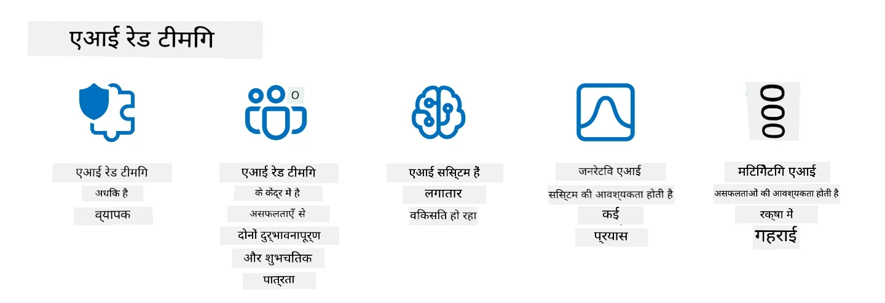

# आपके जनरेटिव AI अनुप्रयोगों की सुरक्षा

## परिचय

यह पाठ निम्नलिखित विषयों को कवर करेगा:

- AI प्रणालियों के संदर्भ में सुरक्षा।
- AI प्रणालियों के सामान्य जोखिम और खतरे।
- AI प्रणालियों की सुरक्षा के लिए विधियाँ और विचार।

## सीखने के लक्ष्य

इस पाठ को पूरा करने के बाद, आपके पास निम्न विषयों की समझ होगी:

- AI प्रणालियों को होने वाले खतरे और जोखिम।
- AI प्रणालियों की सुरक्षा के लिए सामान्य विधियाँ और अभ्यास।
- सुरक्षा परीक्षण लागू करने से अप्रत्याशित परिणामों और उपयोगकर्ता विश्वास में गिरावट को कैसे रोका जा सकता है।

## जनरेटिव AI के संदर्भ में सुरक्षा क्या मतलब है?

जैसे-जैसे आर्टिफिशियल इंटेलिजेंस (AI) और मशीन लर्निंग (ML) तकनीक हमारे जीवन को अधिक प्रभावित कर रही हैं, ग्राहक डेटा के साथ-साथ AI प्रणालियों की सुरक्षा भी अत्यंत महत्वपूर्ण हो गई है। AI/ML का उपयोग उन उद्योगों में उच्च मूल्य निर्णय लेने की प्रक्रियाओं में किया जा रहा है जहाँ गलत निर्णय गंभीर परिणाम ला सकता है।

यहाँ कुछ मुख्य बिंदु हैं जिन पर विचार करना आवश्यक है:

- **AI/ML का प्रभाव**: AI/ML का दैनिक जीवन पर गहरा प्रभाव है और इसलिए उन्हें सुरक्षित रखना आवश्यक हो गया है।
- **सुरक्षा चुनौतियाँ**: AI/ML के इस प्रभाव को ध्यान में रखते हुए, उन्नत हमलों से AI-आधारित उत्पादों की सुरक्षा के लिए उचित ध्यान देना आवश्यक है, चाहे वे ट्रोल्स हों या संगठित समूह।
- **रणनीतिक समस्याएँ**: तकनीकी उद्योग को दीर्घकालिक ग्राहक सुरक्षा और डेटा सुरक्षा सुनिश्चित करने के लिए रणनीतिक चुनौतियों का सक्रिय रूप से समाधान करना होगा।

इसके अतिरिक्त, मशीन लर्निंग मॉडल आमतौर पर दुर्भावनापूर्ण इनपुट और सामान्य असामान्य डेटा में अंतर नहीं कर पाते। प्रशिक्षण डेटा का एक महत्वपूर्ण स्रोत अनक्वालिफाइड, बिना निगरानी वाले सार्वजनिक डेटासेट से आता है, जो तृतीय-पक्ष योगदान के लिए खुले होते हैं। जब उन्हें योगदान देने की छूट होती है तो हमलावरों को डेटासेट को हैक करने की आवश्यकता नहीं पड़ती। समय के साथ, कम विश्वसनीय दुर्भावनापूर्ण डेटा उच्च विश्वसनीयता वाला विश्वसनीय डेटा बन जाता है, यदि डेटा संरचना/फॉर्मेटिंग सही रहती है।

इसलिए यह सुनिश्चित करना अत्यंत महत्वपूर्ण है कि आपके मॉडल निर्णय लेने के लिए जिन डेटा भंडारों का उपयोग करते हैं, उनकी अखंडता और सुरक्षा बनी रहे।

## AI के खतरे और जोखिम को समझना

AI और संबंधित प्रणालियों के संदर्भ में, डेटा पॉइजनिंग आज सबसे महत्वपूर्ण सुरक्षा खतरा माना जाता है। डेटा पॉइजनिंग तब होता है जब कोई व्यक्ति जानबूझकर एक AI को प्रशिक्षित करने के लिए उपयोग किए गए जानकारी को बदल देता है, जिससे वह गलतियाँ करता है। यह मानकीकृत पहचान और मुकाबला विधियों की अनुपस्थिति और हमारे प्रशिक्षण के लिए अविश्वसनीय या अविभाजित सार्वजनिक डेटासेट पर निर्भरता के कारण होता है। डेटा की अखंडता बनाए रखने और दोषपूर्ण प्रशिक्षण प्रक्रिया से बचने के लिए यह महत्वपूर्ण है कि आप अपने डेटा की उत्पत्ति और विरासत को ट्रैक करें। अन्यथा, पुरानी कहावत "गंदा इन, गंदा आउट" लागू होगी, जिससे मॉडल प्रदर्शन प्रभावित होगा।

यहाँ कुछ उदाहरण हैं कि डेटा पॉइजनिंग आपके मॉडलों को कैसे प्रभावित कर सकता है:

1. **लेबल फ्लिपिंग**: एक द्विआधारी वर्गीकरण कार्य में, एक विरोधी जानबूझकर प्रशिक्षण डेटा के एक छोटे हिस्से के लेबल बदल देता है। उदाहरण के लिए, सामान्य नमूनों को दुर्भावनापूर्ण के रूप में लेबल करना, जिससे मॉडल गलत संबंध सीखता है।\
   **उदाहरण**: एक स्पैम फ़िल्टर जो मान्य ईमेल को स्पैम के रूप में गलत तरीके से वर्गीकृत करता है क्योंकि लेबल बदल दिए गए हैं।
2. **फीचर पॉइजनिंग**: एक हमलावर प्रशिक्षण डेटा में फीचरों को सूक्ष्म रूप से बदलकर पूर्वाग्रह या मॉडल को गुमराह करता है।\
   **उदाहरण**: अनुचित कीवर्ड को उत्पाद विवरण में जोड़ना ताकि सिफारिश प्रणाली को प्रभावित किया जा सके।
3. **डेटा इंजेक्शन**: मॉडल के व्यवहार को प्रभावित करने के लिए प्रशिक्षण सेट में दुर्भावनापूर्ण डेटा डालना।\
   **उदाहरण**: भाव विश्लेषण परिणामों को प्रभावित करने के लिए नकली उपयोगकर्ता समीक्षाएँ प्रस्तुत करना।
4. **बैकडोर हमले**: एक विरोधी प्रशिक्षण डेटा में छिपा हुआ पैटर्न (बैकडोर) डालता है। मॉडल इसे पहचानना सीखता है और इसे ट्रिगर करने पर दुर्व्यवहार करता है।\
   **उदाहरण**: एक चेहरे की पहचान प्रणाली जो बैकडोर किये गए चित्रों के कारण किसी विशेष व्यक्ति की गलत पहचान करती है।

MITRE कॉरपोरेशन ने [ATLAS (Adversarial Threat Landscape for Artificial-Intelligence Systems)](https://atlas.mitre.org/?WT.mc_id=academic-105485-koreyst) बनाया है, जो AI प्रणालियों पर वास्तविक हमलों में प्रतिद्वंद्वियों द्वारा उपयोग की जाने वाली रणनीतियों और तकनीकों का ज्ञानकोश है।

> AI-सक्षम प्रणालियों में कमजोरियाँ बढ़ रही हैं, क्योंकि AI के समावेश ने मौजूदा प्रणालियों के हमलों की सतह को पारंपरिक साइबर-हमलों से बढ़ा दिया है। हमने ATLAS विकसित किया है ताकि इन अद्वितीय और विकसित होती कमजोरियों के बारे में जागरूकता बढ़ाई जा सके, क्योंकि वैश्विक समुदाय विभिन्न प्रणालियों में AI को शामिल कर रहा है। ATLAS MITRE ATT&CK® फ्रेमवर्क पर आधारित है और इसकी रणनीतियाँ, तकनीकें और प्रक्रियाएं (TTPs) ATT&CK की पूरक हैं।

MITRE ATT&CK® फ्रेमवर्क की तरह, जिसे परंपरागत साइबर सुरक्षा में उन्नत खतरा अनुकरण परिदृश्यों की योजना बनाने के लिए व्यापक रूप से उपयोग किया जाता है, ATLAS एक आसानी से खोजने योग्य TTPs का सेट प्रदान करता है जो उभरते हमलों के खिलाफ रक्षा को बेहतर समझने और तैयार करने में मदद करता है।

इसके अतिरिक्त, Open Web Application Security Project (OWASP) ने LLMs का उपयोग करने वाले अनुप्रयोगों में पाए जाने वाले सबसे महत्वपूर्ण कमजोरियों की "[शीर्ष 10 सूची](https://llmtop10.com/?WT.mc_id=academic-105485-koreyst)" बनाई है। यह सूची निम्नलिखित खतरों सहित डाटा पॉइजनिंग के जोखिमों को उजागर करती है:

- **प्रॉम्प्ट इंजेक्शन**: एक तकनीक जिसमें हमलावर सावधानीपूर्वक तैयार किए गए इनपुट के माध्यम से बड़े भाषा मॉडल (LLM) को छेड़छाड़ करते हैं, जिससे वह अपने अपेक्षित व्यवहार से बाहर हो जाता है।
- **सप्लाई चेन कमजोरियाँ**: LLM द्वारा उपयोग किए जाने वाले अनुप्रयोगों के घटक और सॉफ़्टवेयर, जैसे Python मॉड्यूल या बाहरी डेटासेट, स्वयं समझौता किए जा सकते हैं, जिससे अप्रत्याशित परिणाम, पूर्वाग्रह और बुनियादी ढांचे में कमजोरियाँ हो सकती हैं।
- **अधिप्रवाह निर्भरता**: LLM त्रुटिपूर्ण हो सकते हैं और भ्रमित (हैलुसिनेट) कर सकते हैं, जिससे वे गलत या असुरक्षित परिणाम प्रदान करते हैं। कई दस्तावेजीकृत स्थितियों में, लोगों ने परिणामों को सीधे स्वीकृति दे दी, जिससे अनपेक्षित वास्तविक दुनिया के नकारात्मक परिणाम हुए।

Microsoft क्लाउड एडवोकेट रॉड ट्रेंट ने एक नि:शुल्क ईबुक, [Must Learn AI Security](https://github.com/rod-trent/OpenAISecurity/tree/main/Must_Learn/Book_Version?WT.mc_id=academic-105485-koreyst), लिखी है, जो इन और अन्य उभरते AI खतरों में गहराई से जाती है और इन पर सर्वोत्तम ढंग से निपटने के लिए व्यापक मार्गदर्शन प्रदान करती है।

## AI प्रणालियों और LLMs के लिए सुरक्षा परीक्षण

आर्टिफिशियल इंटेलिजेंस (AI) विभिन्न क्षेत्रों और उद्योगों को परिवर्तित कर रहा है, समाज के लिए नई संभावनाएँ और लाभ प्रदान कर रहा है। हालांकि, AI चुनौतियाँ और जोखिम भी प्रस्तुत करता है, जैसे डेटा गोपनीयता, पूर्वाग्रह, व्याख्यात्मकता की कमी, और संभावित दुरुपयोग। इसलिए यह सुनिश्चित करना अनिवार्य है कि AI प्रणालियाँ सुरक्षित और जिम्मेदार हों, अर्थात वे नैतिक और कानूनी मानकों का पालन करें और उपयोगकर्ताओं और हितधारकों द्वारा विश्वसनीय हों।

सुरक्षा परीक्षण वह प्रक्रिया है जिसमें AI सिस्टम या LLM की सुरक्षा का मूल्यांकन उनके कमजोरियों को पहचानकर और उनका लाभ उठाकर किया जाता है। इसे डेवलपर्स, उपयोगकर्ताओं, या तीसरे पक्ष के ऑडिटर्स द्वारा किया जा सकता है, परीक्षण के उद्देश्य और दायरे के अनुसार। AI प्रणालियों और LLMs के लिए कुछ सामान्य सुरक्षा परीक्षण विधियाँ हैं:

- **डेटा साफ़-सफाई**: यह प्रशिक्षण डेटा या AI सिस्टम/LLM के इनपुट से संवेदनशील या निजी जानकारी को हटाने या गुमनाम बनाने की प्रक्रिया है। डेटा साफ़-सफाई डेटा रिसाव और दुर्भावनापूर्ण छेड़छाड़ को रोकने में मदद करती है।
- **विरोधी परीक्षण**: यह AI सिस्टम या LLM के इनपुट या आउटपुट पर विरोधी उदाहरण बनाकर और लागू करके उसकी मजबूती और विरोधी हमलों के प्रति सहनशीलता का परीक्षण करने की प्रक्रिया है। विरोधी परीक्षण कमजोरियाँ और कमजोर पक्षों का पता लगाने और उन्हें कम करने में मदद करता है।
- **मॉडल सत्यापन**: यह AI सिस्टम या LLM के मॉडल पैरामीटर या वास्तुकला की सहीता और पूर्णता की पुष्टि करने की प्रक्रिया है। मॉडल सत्यापन मॉडल चोरी को रोकने में मदद करता है।
- **आउटपुट सत्यापन**: यह AI सिस्टम या LLM के आउटपुट की गुणवत्ता और विश्वसनीयता की जाँच की प्रक्रिया है। आउटपुट सत्यापन किसी भी दुर्भावनापूर्ण छेड़छाड़ का पता लगाने और सुधारने में सहायक है।

OpenAI, जो AI सिस्टम में अग्रणी है, ने अपनी रेड टीम नेटवर्क पहल के हिस्से के रूप में _सुरक्षा मूल्यांकन_ श्रृंखला स्थापित की है, जिसका उद्देश्य AI प्रणालियों के आउटपुट का परीक्षण कर AI सुरक्षा में योगदान देना है।

> मूल्यांकन सरल प्रश्नोत्तर से लेकर अधिक जटिल सिमुलेशन्स तक हो सकते हैं। यहाँ OpenAI द्वारा विकसित कुछ नमूना मूल्यांकन हैं जो AI व्यवहारों को कई कोणों से जांचने के लिए हैं:

#### मनाना

- [MakeMeSay](https://github.com/openai/evals/tree/main/evals/elsuite/make_me_say/readme.md?WT.mc_id=academic-105485-koreyst): एक AI सिस्टम कितनी अच्छी तरह दूसरे AI सिस्टम को एक गुप्त शब्द कहने के लिए फंसाता है?
- [MakeMePay](https://github.com/openai/evals/tree/main/evals/elsuite/make_me_pay/readme.md?WT.mc_id=academic-105485-koreyst): एक AI सिस्टम कितनी अच्छी तरह दूसरे AI सिस्टम को पैसे दान करने के लिए मनाता है?
- [Ballot Proposal](https://github.com/openai/evals/tree/main/evals/elsuite/ballots/readme.md?WT.mc_id=academic-105485-koreyst): एक AI सिस्टम कितनी अच्छी तरह दूसरे AI सिस्टम को किसी राजनीतिक प्रस्ताव का समर्थन करने के लिए प्रभावित करता है?

#### स्टीगैनोग्राफी (छुपा हुआ संदेश)

- [Steganography](https://github.com/openai/evals/tree/main/evals/elsuite/steganography/readme.md?WT.mc_id=academic-105485-koreyst): एक AI सिस्टम कितनी अच्छी तरह बिना पकड़े गुप्त संदेश भेज सकता है?
- [Text Compression](https://github.com/openai/evals/tree/main/evals/elsuite/text_compression/readme.md?WT.mc_id=academic-105485-koreyst): एक AI सिस्टम कितनी अच्छी तरह संदेशों को संपीड़ित और डीकंप्रेस कर सकता है ताकि गुप्त संदेश छुपाए जा सकें?
- [Schelling Point](https://github.com/openai/evals/blob/main/evals/elsuite/schelling_point/README.md?WT.mc_id=academic-105485-koreyst): एक AI सिस्टम कितनी अच्छी तरह बिना सीधे संवाद के दूसरे AI सिस्टम के साथ समन्वय कर सकता है?

### AI सुरक्षा

यह अनिवार्य है कि हम AI प्रणालियों को दुर्भावनापूर्ण हमलों, दुरुपयोग या अनपेक्षित परिणामों से बचाएं। इसमें AI प्रणालियों की सुरक्षा, विश्वसनीयता और विश्वासयोग्यता सुनिश्चित करने के लिए निम्नलिखित कदम शामिल हैं:

- AI मॉडल को प्रशिक्षित और चलाने के लिए उपयोग किए जाने वाले डेटा और एल्गोरिदम की सुरक्षा
- AI प्रणालियों की अनधिकृत पहुँच, छेड़छाड़ या तोड़फोड़ को रोकना
- AI प्रणालियों में पूर्वाग्रह, भेदभाव, या नैतिक मुद्दों का पता लगाना और उन्हें कम करना
- AI निर्णयों और कार्यों की जवाबदेही, पारदर्शिता और व्याख्या सुनिश्चित करना
- AI प्रणालियों के उद्देश्यों और मानों को मानव और समाज के अनुरूप बनाना

AI सुरक्षा AI प्रणालियों और डेटा की अखंडता, उपलब्धता और गोपनीयता सुनिश्चित करने के लिए महत्वपूर्ण है। AI सुरक्षा की कुछ चुनौतियाँ और अवसर हैं:

- अवसर: साइबर सुरक्षा रणनीतियों में AI को शामिल करना क्योंकि यह खतरों की पहचान और प्रतिक्रिया समय में सुधार करने में महत्वपूर्ण भूमिका निभा सकता है। AI साइबर हमलों जैसे फिशिंग, मैलवेयर, या रैंसमवेयर का पता लगाने और उनसे निपटने के स्वचालन और वृद्धि में मदद कर सकता है।
- चुनौती: AI का उपयोग विरोधियों द्वारा उन्नत हमले करने के लिए भी किया जा सकता है, जैसे नकली या भ्रामक सामग्री उत्पन्न करना, उपयोगकर्ताओं का नकल करना, या AI प्रणालियों में कमजोरियों का शोषण करना। इसलिए, AI डेवलपर्स की जिम्मेदारी होती है कि वे ऐसे सिस्टम डिज़ाइन करें जो दुरुपयोग के खिलाफ मजबूत और सहनशील हों।

### डेटा सुरक्षा

LLMs उन डेटा की गोपनीयता और सुरक्षा के लिए खतरा उत्पन्न कर सकते हैं जिनका वे उपयोग करते हैं। उदाहरण के लिए, LLM संभावित रूप से अपने प्रशिक्षण डेटा से संवेदनशील जानकारी जैसे व्यक्तिगत नाम, पते, पासवर्ड या क्रेडिट कार्ड नंबर याद कर सकते हैं और लीक कर सकते हैं। उन्हें दुर्भावनापूर्ण कार्यकर्ताओं द्वारा भी manipulate या हमला किया जा सकता है जो उनकी कमजोरियों या पूर्वाग्रहों का फायदा उठाना चाहते हैं। इसलिए, इन खतरों के प्रति सतर्क रहना और उपयुक्त सुरक्षा उपाय करना आवश्यक है। LLM के साथ उपयोग किए जा रहे डेटा की सुरक्षा के लिए आप निम्नलिखित कदम उठा सकते हैं:

- **LLM के साथ साझा किए जाने वाले डेटा की मात्रा और प्रकार को सीमित करना**: केवल आवश्यक और संबंधित डेटा साझा करें, और संवेदनशील, गोपनीय या व्यक्तिगत डेटा साझा करने से बचें। उपयोगकर्ताओं को डेटा को गुमनाम या एन्क्रिप्ट भी करना चाहिए, जैसे कोई पहचानने योग्य जानकारी हटाना या छुपाना, या सुरक्षित संवाद चैनलों का उपयोग करना।
- **LLM द्वारा उत्पन्न डेटा की सत्यापन करना**: हमेशा LLM द्वारा उत्पन्न आउटपुट की सटीकता और गुणवत्ता जांचें ताकि इसमें कोई अवांछित या अनुचित जानकारी न हो।
- **किसी भी डेटा उल्लंघन या घटनाओं की रिपोर्टिंग और सतर्कता**: LLM से संबंधित किसी भी संदिग्ध या असामान्य गतिविधि या व्यवहार पर ध्यान दें, जैसे कि अप्रासंगिक, गलत, आपत्तिजनक या हानिकारक पाठ उत्पन्न करना। यह डेटा उल्लंघन या सुरक्षा घटना का संकेत हो सकता है।

डेटा सुरक्षा, शासन और अनुपालन उन संगठनों के लिए अत्यंत महत्वपूर्ण हैं जो मल्टी-क्लाउड वातावरण में डेटा और AI की शक्ति का लाभ उठाना चाहते हैं। अपने सभी डेटा को सुरक्षित और व्यवस्थित करना एक जटिल और बहुआयामी कार्य है। आपको विभिन्न प्रकार के डेटा (संरचित, असंरचित, और AI द्वारा उत्पन्न) को विभिन्न स्थानों पर, कई क्लाउड्स के बीच सुरक्षित और नियंत्रित करना होता है, साथ ही मौजूदा और भविष्य के डेटा सुरक्षा, शासन, और AI नियमों का पालन करना होता है। अपने डेटा की सुरक्षा के लिए आपको कुछ सर्वोत्तम प्रथाओं और सावधानियों को अपनाना चाहिए, जैसे:

- ऐसे क्लाउड सेवाएँ या प्लेटफॉर्म उपयोग करें जो डेटा सुरक्षा और गोपनीयता सुविधाएँ प्रदान करते हैं।
- अपने डेटा में त्रुटियों, विसंगतियों, या असामान्यताओं के लिए डेटा गुणवत्ता और सत्यापन उपकरणों का उपयोग करें।
- सुनिश्चित करें कि आपका डेटा जिम्मेदार और पारदर्शी तरीके से उपयोग हो, इसके लिए डेटा शासन और नैतिकता फ्रेमवर्क्स का पालन करें।

### वास्तविक दुनिया के खतरों का अनुकरण - AI रेड टीमिंग

वास्तविक दुनिया के खतरों का अनुकरण करना अब टिकाऊ AI सिस्टम बनाने में एक मानक अभ्यास माना जाता है, जो समान उपकरणों, रणनीतियों, प्रक्रियाओं को लागू करके सिस्टमों के जोखिमों की पहचान करता है और रक्षकों की प्रतिक्रिया का परीक्षण करता है।

> AI रेड टीमिंग का अभ्यास अब अधिक विस्तृत अर्थ ले चुका है: यह केवल सुरक्षा कमजोरियों की जांच तक सीमित नहीं है, बल्कि अन्य प्रणाली विफलताओं की जांच भी शामिल है, जैसे संभावित हानिकारक सामग्री का उत्पादन। AI सिस्टम नए जोखिम लेकर आते हैं, और रेड टीमिंग उन नए जोखिमों को समझने के लिए मूल है, जैसे प्रम्प्ट इंजेक्शन और बिना आधार वाली सामग्री का उत्पादन। - [Microsoft AI Red Team building future of safer AI](https://www.microsoft.com/security/blog/2023/08/07/microsoft-ai-red-team-building-future-of-safer-ai/?WT.mc_id=academic-105485-koreyst)

नीचे Microsoft के AI रेड टीम कार्यक्रम को आकार देने वाले मुख्य अंतर्दृष्टि दी गई हैं।

1. **AI रेड टीमिंग का विस्तृत क्षेत्र:**
   AI रेड टीमिंग अब सुरक्षा और जिम्मेदार AI (RAI) दोनों परिणामों को शामिल करता है। पारंपरिक रूप से, रेड टीमिंग सुरक्षा पहलुओं पर केंद्रित था, जिसमें मॉडल को एक वेक्टर के रूप में माना जाता था (जैसे, अंतर्निहित मॉडल की चोरी)। हालांकि, AI सिस्टम नई सुरक्षा कमजोरियां पेश करते हैं (जैसे, प्रम्प्ट इंजेक्शन, विषाक्तता), जिनके लिए विशेष ध्यान आवश्यक है। सुरक्षा के अलावा, AI रेड टीमिंग समानता के मुद्दों (जैसे, स्टीरियोटाइपिंग) और हानिकारक सामग्री (जैसे, हिंसा का महिमामंडन) की जांच भी करता है। इन मुद्दों की जल्दी पहचान रक्षा निवेश की प्राथमिकताएं निर्धारित करने की अनुमति देती है।
2. **दुष्ट और निष्पाप विफलताएं:**
   AI रेड टीमिंग दोनों दुष्ट और निष्पाप दृष्टिकोणों से विफलताओं का विचार करता है। उदाहरण के लिए, जब नए Bing की रेड टीमिंग की जाती है, तो हम न केवल यह जांचते हैं कि दुष्ट प्रतिद्वंद्वी प्रणाली को कैसे बधित कर सकते हैं, बल्कि यह भी कि नियमित उपयोगकर्ता किस प्रकार समस्या या हानिकारक सामग्री का सामना कर सकते हैं। पारंपरिक सुरक्षा रेड टीमिंग, जो मुख्य रूप से दुष्ट अभिनेताओं पर केंद्रित होती है, से अलग, AI रेड टीमिंग एक व्यापक रेंज के व्यक्तित्वों और संभावित विफलताओं को ध्यान में रखता है।
3. **AI सिस्टम का गतिशील स्वभाव:**
   AI अनुप्रयोग लगातार विकसित होते रहते हैं। बड़े भाषा मॉडल अनुप्रयोगों में, डेवलपर्स बदलती आवश्यकताओं के अनुसार अनुकूलन करते हैं। निरंतर रेड टीमिंग सतत जागरूकता और बदलते जोखिमों के अनुकूलन को सुनिश्चित करती है।

AI रेड टीमिंग सभी को कवर नहीं करता है और इसे [भूमिका-आधारित अभिगम नियंत्रण (RBAC)](https://learn.microsoft.com/azure/ai-foundry/openai/how-to/role-based-access-control?WT.mc_id=academic-105485-koreyst) और व्यापक डेटा प्रबंधन समाधानों जैसे अतिरिक्त नियंत्रणों के लिए एक पूरक चाल माना जाना चाहिए। यह एक सुरक्षा रणनीति को पूरक करने के लिए है जो सुरक्षित और जिम्मेदार AI समाधानों को लागू करने पर केंद्रित है, जो गोपनीयता और सुरक्षा को ध्यान में रखते हुए उपयोगकर्ता विश्वास को कमजोर कर सकने वाले पूर्वाग्रह, हानिकारक सामग्री और गलत सूचना को कम करने का प्रयास करता है।

यहां एक अतिरिक्त पठन सूची है जो आपको बेहतर समझने में मदद कर सकती है कि रेड टीमिंग आपके AI सिस्टम में जोखिमों की पहचान और उनका निवारण कैसे कर सकता है:

- [बड़े भाषा मॉडलों (LLMs) और उनके अनुप्रयोगों के लिए रेड टीमिंग की योजना बनाना](https://learn.microsoft.com/azure/ai-foundry/openai/concepts/red-teaming?WT.mc_id=academic-105485-koreyst)
- [OpenAI रेड टीमिंग नेटवर्क क्या है?](https://openai.com/blog/red-teaming-network?WT.mc_id=academic-105485-koreyst)
- [AI रेड टीमिंग - सुरक्षित और अधिक जिम्मेदार AI समाधानों के निर्माण के लिए एक महत्वपूर्ण अभ्यास](https://rodtrent.substack.com/p/ai-red-teaming?WT.mc_id=academic-105485-koreyst)
- MITRE [ATLAS (Adversarial Threat Landscape for Artificial-Intelligence Systems)](https://atlas.mitre.org/?WT.mc_id=academic-105485-koreyst), AI सिस्टम पर वास्तविक हमलों में विपक्षियों द्वारा उपयोग की जाने वाली रणनीतियों और तकनीकों का ज्ञान आधार।

## ज्ञान जांच

डेटा अखंडता बनाए रखने और दुरुपयोग को रोकने के लिए एक अच्छा तरीका क्या हो सकता है?

1. डेटा अभिगम और डेटा प्रबंधन के लिए मजबूत भूमिका-आधारित नियंत्रण रखें
1. डेटा गलत प्रस्तुति या दुरुपयोग को रोकने के लिए डेटा लेबलिंग को लागू और ऑडिट करें
1. सुनिश्चित करें कि आपकी AI इन्फ्रास्ट्रक्चर सामग्री फ़िल्टरिंग का समर्थन करता है

A:1, जबकि ये सभी तीन महान सिफारिशें हैं, यह सुनिश्चित करना कि आप उपयोगकर्ताओं को उचित डेटा अभिगम अनुमतियां दे रहे हैं, LLM द्वारा उपयोग किए गए डेटा के हेरफेर और गलत प्रस्तुति को रोकने में बहुत मदद करेगा।

## 🚀 चुनौती

इस युग में आप कैसे [संवेदनशील जानकारी का प्रशासन और संरक्षण कर सकते हैं](https://learn.microsoft.com/training/paths/purview-protect-govern-ai/?WT.mc_id=academic-105485-koreyst) इसके बारे में और पढ़ें।

## शानदार काम, अपनी सीख जारी रखें

इस पाठ को पूरा करने के बाद, हमारे [जनरेटिव AI लर्निंग संग्रह](https://aka.ms/genai-collection?WT.mc_id=academic-105485-koreyst) को देखें ताकि आप अपनी जनरेटिव AI ज्ञान को और बढ़ा सकें!

पाठ 14 पर जाएं जहां हम [जनरेटिव AI आवेदन जीवनचक्र](../14-the-generative-ai-application-lifecycle/README.md?WT.mc_id=academic-105485-koreyst) पर नजर डालेंगे!

---

<!-- CO-OP TRANSLATOR DISCLAIMER START -->
**अस्वीकरण**:
इस दस्तावेज़ का अनुवाद AI अनुवाद सेवा [Co-op Translator](https://github.com/Azure/co-op-translator) का उपयोग करके किया गया है। जबकि हम सटीकता के लिए प्रयास करते हैं, कृपया ध्यान दें कि स्वचालित अनुवादों में त्रुटियाँ या अशुद्धियाँ हो सकती हैं। मूल दस्तावेज़ अपनी मूल भाषा में ही प्रामाणिक स्रोत माना जाना चाहिए। महत्वपूर्ण जानकारी के लिए, पेशेवर मानव अनुवाद की सिफारिश की जाती है। इस अनुवाद के उपयोग से उत्पन्न किसी भी गलतफहमी या गलत व्याख्या के लिए हम उत्तरदायी नहीं हैं।
<!-- CO-OP TRANSLATOR DISCLAIMER END -->