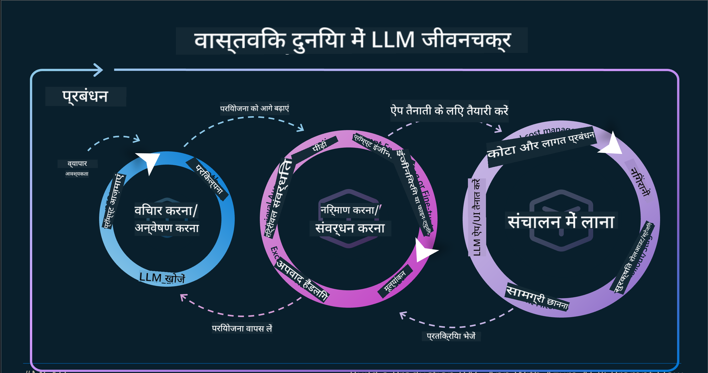

<!--
CO_OP_TRANSLATOR_METADATA:
{
  "original_hash": "df44972d5575ea8cef3c52ee31696d04",
  "translation_date": "2025-12-19T13:55:05+00:00",
  "source_file": "14-the-generative-ai-application-lifecycle/README.md",
  "language_code": "hi"
}
-->

# जनरेटिव AI एप्लिकेशन जीवनचक्र

सभी AI एप्लिकेशन के लिए एक महत्वपूर्ण प्रश्न AI फीचर्स की प्रासंगिकता है, क्योंकि AI एक तेजी से विकसित हो रहा क्षेत्र है, यह सुनिश्चित करने के लिए कि आपका एप्लिकेशन प्रासंगिक, विश्वसनीय और मजबूत बना रहे, आपको इसे निरंतर मॉनिटर, मूल्यांकन और सुधारना होगा। यहीं पर जनरेटिव AI जीवनचक्र काम आता है।

जनरेटिव AI जीवनचक्र एक फ्रेमवर्क है जो आपको जनरेटिव AI एप्लिकेशन के विकास, तैनाती और रखरखाव के चरणों के माध्यम से मार्गदर्शन करता है। यह आपको अपने लक्ष्यों को परिभाषित करने, अपने प्रदर्शन को मापने, अपनी चुनौतियों की पहचान करने और अपने समाधानों को लागू करने में मदद करता है। यह आपको अपने एप्लिकेशन को आपके डोमेन और आपके हितधारकों के नैतिक और कानूनी मानकों के साथ संरेखित करने में भी मदद करता है। जनरेटिव AI जीवनचक्र का पालन करके, आप सुनिश्चित कर सकते हैं कि आपका एप्लिकेशन हमेशा मूल्य प्रदान कर रहा है और आपके उपयोगकर्ताओं को संतुष्ट कर रहा है।

## परिचय

इस अध्याय में, आप:

- MLOps से LLMOps तक के पैरेडाइम शिफ्ट को समझेंगे
- LLM जीवनचक्र
- जीवनचक्र टूलिंग
- जीवनचक्र मेट्रिफिकेशन और मूल्यांकन

## MLOps से LLMOps तक के पैरेडाइम शिफ्ट को समझें

LLM आर्टिफिशियल इंटेलिजेंस के हथियार में एक नया उपकरण हैं, वे एप्लिकेशन के लिए विश्लेषण और जनरेशन कार्यों में अत्यंत शक्तिशाली हैं, हालांकि इस शक्ति के कुछ परिणाम हैं कि हम AI और क्लासिक मशीन लर्निंग कार्यों को कैसे सुव्यवस्थित करते हैं।

इसके साथ, हमें इस उपकरण को गतिशील रूप से अनुकूलित करने के लिए एक नया पैरेडाइम चाहिए, सही प्रोत्साहनों के साथ। हम पुराने AI एप्लिकेशन को "ML एप्लिकेशन" और नए AI एप्लिकेशन को "GenAI एप्लिकेशन" या केवल "AI एप्लिकेशन" के रूप में वर्गीकृत कर सकते हैं, जो उस समय उपयोग की जाने वाली मुख्यधारा की तकनीक और तकनीकों को दर्शाता है। यह हमारे कथानक को कई तरीकों से बदल देता है, निम्नलिखित तुलना देखें।

ध्यान दें कि LLMOps में, हम एप्लिकेशन डेवलपर्स पर अधिक ध्यान केंद्रित करते हैं, एकीकरण को एक प्रमुख बिंदु के रूप में उपयोग करते हैं, "मॉडल-एज़-ए-सर्विस" का उपयोग करते हैं और मेट्रिक्स के लिए निम्नलिखित बिंदुओं पर विचार करते हैं।

- गुणवत्ता: प्रतिक्रिया की गुणवत्ता
- हानि: जिम्मेदार AI
- ईमानदारी: प्रतिक्रिया की आधारभूतता (क्या यह समझ में आता है? क्या यह सही है?)
- लागत: समाधान बजट
- विलंबता: टोकन प्रतिक्रिया के लिए औसत समय

## LLM जीवनचक्र

सबसे पहले, जीवनचक्र और संशोधनों को समझने के लिए, अगली इन्फोग्राफिक देखें।

जैसा कि आप देख सकते हैं, यह MLOps के सामान्य जीवनचक्र से अलग है। LLMs के कई नए आवश्यकताएं हैं, जैसे प्रॉम्प्टिंग, गुणवत्ता सुधारने के लिए विभिन्न तकनीकें (फाइन-ट्यूनिंग, RAG, मेटा-प्रॉम्प्ट्स), जिम्मेदार AI के साथ अलग मूल्यांकन और जिम्मेदारी, अंत में, नए मूल्यांकन मेट्रिक्स (गुणवत्ता, हानि, ईमानदारी, लागत और विलंबता)।

उदाहरण के लिए, देखें कि हम कैसे विचार करते हैं। विभिन्न LLMs के साथ प्रयोग करने के लिए प्रॉम्प्ट इंजीनियरिंग का उपयोग करना ताकि यह जांचा जा सके कि उनका हाइपोथेसिस सही हो सकता है या नहीं।

ध्यान दें कि यह रैखिक नहीं है, बल्कि एकीकृत लूप, पुनरावृत्तिमूलक और एक व्यापक चक्र के साथ है।

हम उन चरणों का पता कैसे लगा सकते हैं? चलिए विस्तार में देखते हैं कि हम जीवनचक्र कैसे बना सकते हैं।

यह थोड़ा जटिल लग सकता है, पहले तीन बड़े चरणों पर ध्यान दें।

1. विचार करना/अन्वेषण करना: अन्वेषण, यहां हम अपने व्यावसायिक आवश्यकताओं के अनुसार अन्वेषण कर सकते हैं। प्रोटोटाइपिंग, एक [PromptFlow](https://microsoft.github.io/promptflow/index.html?WT.mc_id=academic-105485-koreyst) बनाना और जांचना कि क्या यह हमारे हाइपोथेसिस के लिए पर्याप्त कुशल है।
1. निर्माण/वृद्धि करना: कार्यान्वयन, अब, हम बड़े डेटासेट के लिए मूल्यांकन शुरू करते हैं, तकनीकों को लागू करते हैं, जैसे फाइन-ट्यूनिंग और RAG, ताकि हमारे समाधान की मजबूती की जांच हो सके। यदि यह काम नहीं करता है, तो इसे पुनः लागू करना, हमारे फ्लो में नए चरण जोड़ना या डेटा को पुनर्गठित करना मदद कर सकता है। हमारे फ्लो और पैमाने का परीक्षण करने के बाद, यदि यह काम करता है और हमारे मेट्रिक्स जांचता है, तो यह अगले चरण के लिए तैयार है।
1. संचालन करना: एकीकरण, अब हमारे सिस्टम में मॉनिटरिंग और अलर्ट सिस्टम जोड़ना, तैनाती और एप्लिकेशन एकीकरण।

फिर, हमारे पास प्रबंधन का व्यापक चक्र है, जो सुरक्षा, अनुपालन और शासन पर केंद्रित है।

बधाई हो, अब आपका AI एप्लिकेशन तैयार है और संचालन में है। एक व्यावहारिक अनुभव के लिए, [Contoso Chat Demo](https://nitya.github.io/contoso-chat/?WT.mc_id=academic-105485-koreys) देखें।

अब, हम कौन से टूल्स का उपयोग कर सकते हैं?

## जीवनचक्र टूलिंग

टूलिंग के लिए, Microsoft [Azure AI Platform](https://azure.microsoft.com/solutions/ai/?WT.mc_id=academic-105485-koreys) और [PromptFlow](https://microsoft.github.io/promptflow/index.html?WT.mc_id=academic-105485-koreyst) प्रदान करता है जो आपके चक्र को लागू करना आसान और तैयार बनाता है।

[Azure AI Platform](https://azure.microsoft.com/solutions/ai/?WT.mc_id=academic-105485-koreys) आपको [AI Studio](https://ai.azure.com/?WT.mc_id=academic-105485-koreys) का उपयोग करने की अनुमति देता है। AI Studio एक वेब पोर्टल है जो आपको मॉडल, नमूने और टूल्स का अन्वेषण करने की अनुमति देता है। आपके संसाधनों का प्रबंधन, UI विकास फ्लो और कोड-प्रथम विकास के लिए SDK/CLI विकल्प।

Azure AI, आपको कई संसाधनों का उपयोग करने की अनुमति देता है, अपने संचालन, सेवाओं, परियोजनाओं, वेक्टर खोज और डेटाबेस आवश्यकताओं का प्रबंधन करने के लिए।

प्रूफ-ऑफ़-कॉन्सेप्ट (POC) से लेकर बड़े पैमाने के एप्लिकेशन तक PromptFlow के साथ निर्माण करें:

- VS कोड से ऐप्स डिज़ाइन और बनाएं, दृश्य और कार्यात्मक टूल्स के साथ
- गुणवत्ता AI के लिए अपने ऐप्स का परीक्षण और फाइन-ट्यूनिंग करें, आसानी से।
- Azure AI Studio का उपयोग करें क्लाउड के साथ एकीकृत करने और पुनरावृत्त करने के लिए, त्वरित एकीकरण के लिए पुश और तैनाती।

## शानदार! अपनी सीख जारी रखें!

अद्भुत, अब जानें कि हम एप्लिकेशन को कैसे संरचित करते हैं ताकि अवधारणाओं का उपयोग किया जा सके [Contoso Chat App](https://nitya.github.io/contoso-chat/?WT.mc_id=academic-105485-koreyst) के साथ, यह देखने के लिए कि क्लाउड एडवोकेसी उन अवधारणाओं को प्रदर्शनों में कैसे जोड़ता है। अधिक सामग्री के लिए, हमारे [Ignite ब्रेकआउट सत्र!](https://www.youtube.com/watch?v=DdOylyrTOWg) देखें।

अब, पाठ 15 देखें, यह समझने के लिए कि [Retrieval Augmented Generation और Vector Databases](../15-rag-and-vector-databases/README.md?WT.mc_id=academic-105485-koreyst) जनरेटिव AI को कैसे प्रभावित करते हैं और अधिक आकर्षक एप्लिकेशन बनाने के लिए!

---

<!-- CO-OP TRANSLATOR DISCLAIMER START -->
**अस्वीकरण**:  
इस दस्तावेज़ का अनुवाद AI अनुवाद सेवा [Co-op Translator](https://github.com/Azure/co-op-translator) का उपयोग करके किया गया है। जबकि हम सटीकता के लिए प्रयासरत हैं, कृपया ध्यान दें कि स्वचालित अनुवादों में त्रुटियाँ या अशुद्धियाँ हो सकती हैं। मूल दस्तावेज़ अपनी मूल भाषा में ही प्रामाणिक स्रोत माना जाना चाहिए। महत्वपूर्ण जानकारी के लिए, पेशेवर मानव अनुवाद की सलाह दी जाती है। इस अनुवाद के उपयोग से उत्पन्न किसी भी गलतफहमी या गलत व्याख्या के लिए हम जिम्मेदार नहीं हैं।
<!-- CO-OP TRANSLATOR DISCLAIMER END -->