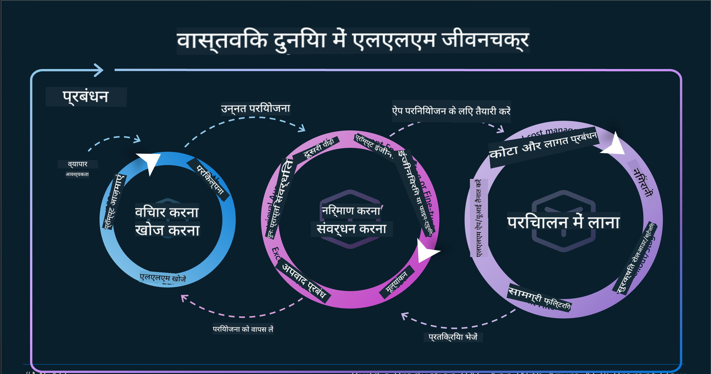
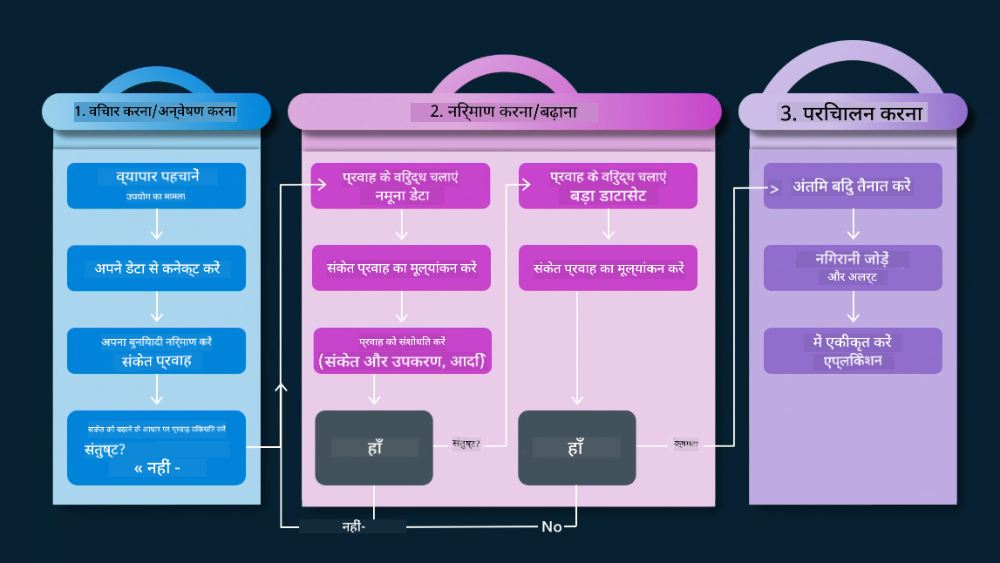
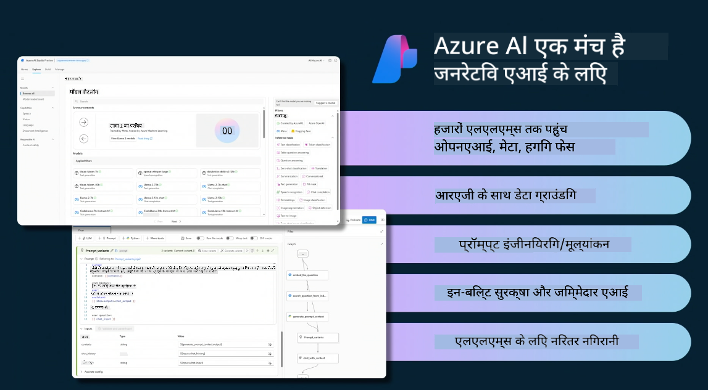
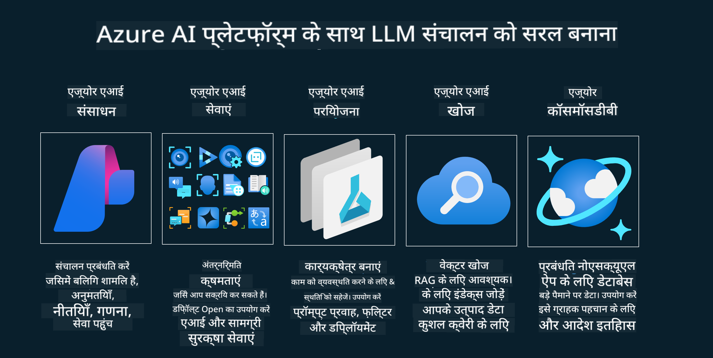
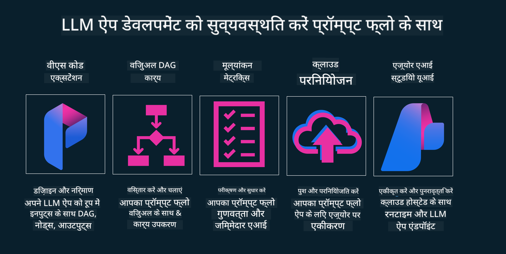

<!--
CO_OP_TRANSLATOR_METADATA:
{
  "original_hash": "27a5347a5022d5ef0a72ab029b03526a",
  "translation_date": "2025-05-19T23:23:08+00:00",
  "source_file": "14-the-generative-ai-application-lifecycle/README.md",
  "language_code": "hi"
}
-->

# जनरेटिव एआई एप्लिकेशन जीवनचक्र

सभी एआई एप्लिकेशनों के लिए एक महत्वपूर्ण प्रश्न है एआई फीचर्स की प्रासंगिकता, क्योंकि एआई एक तेजी से विकसित हो रहा क्षेत्र है। यह सुनिश्चित करने के लिए कि आपका एप्लिकेशन प्रासंगिक, विश्वसनीय और मजबूत बना रहे, आपको इसे निरंतर निगरानी, मूल्यांकन और सुधारना होगा। यहीं पर जनरेटिव एआई जीवनचक्र की भूमिका आती है।

जनरेटिव एआई जीवनचक्र एक रूपरेखा है जो आपको एक जनरेटिव एआई एप्लिकेशन को विकसित करने, तैनात करने और बनाए रखने के चरणों के माध्यम से मार्गदर्शन करती है। यह आपको अपने लक्ष्यों को परिभाषित करने, अपने प्रदर्शन को मापने, अपनी चुनौतियों की पहचान करने और अपने समाधान लागू करने में मदद करती है। यह आपके एप्लिकेशन को आपके डोमेन और आपके हितधारकों के नैतिक और कानूनी मानकों के साथ संरेखित करने में भी मदद करती है। जनरेटिव एआई जीवनचक्र का पालन करके, आप सुनिश्चित कर सकते हैं कि आपका एप्लिकेशन हमेशा मूल्य प्रदान कर रहा है और आपके उपयोगकर्ताओं को संतुष्ट कर रहा है।

## परिचय

इस अध्याय में, आप:

- MLOps से LLMOps की ओर दृष्टिकोण बदलाव को समझेंगे
- LLM जीवनचक्र
- जीवनचक्र उपकरण
- जीवनचक्र मेट्रिफिकेशन और मूल्यांकन

## MLOps से LLMOps की ओर दृष्टिकोण बदलाव को समझें

LLMs कृत्रिम बुद्धिमत्ता शस्त्रागार में एक नया उपकरण हैं, वे अनुप्रयोगों के लिए विश्लेषण और उत्पादन कार्यों में अत्यधिक शक्तिशाली हैं, हालांकि इस शक्ति का कुछ परिणाम होता है कि हम एआई और क्लासिक मशीन लर्निंग कार्यों को कैसे सुव्यवस्थित करते हैं।

इसके साथ, हमें इस उपकरण को एक गतिशीलता में अनुकूलित करने के लिए एक नए दृष्टिकोण की आवश्यकता है, सही प्रोत्साहनों के साथ। हम पुराने एआई ऐप्स को "एमएल ऐप्स" और नए एआई ऐप्स को "जेनएआई ऐप्स" या सिर्फ "एआई ऐप्स" के रूप में वर्गीकृत कर सकते हैं, जो उस समय उपयोग की जाने वाली मुख्यधारा की तकनीक और तकनीकों को दर्शाता है। यह हमारी कथा को कई तरीकों से स्थानांतरित करता है, निम्नलिखित तुलना देखें।

ध्यान दें कि LLMOps में, हम ऐप डेवलपर्स पर अधिक ध्यान केंद्रित कर रहे हैं, एकीकरण का उपयोग एक प्रमुख बिंदु के रूप में कर रहे हैं, "मॉडल-ए-ए-सर्विस" का उपयोग कर रहे हैं और मेट्रिक्स के लिए निम्नलिखित बिंदुओं पर विचार कर रहे हैं।

- गुणवत्ता: प्रतिक्रिया गुणवत्ता
- हानि: जिम्मेदार एआई
- ईमानदारी: प्रतिक्रिया का आधार (क्या यह समझ में आता है? क्या यह सही है?)
- लागत: समाधान बजट
- विलंबता: टोकन प्रतिक्रिया के लिए औसत समय

## LLM जीवनचक्र

पहले, जीवनचक्र और संशोधनों को समझने के लिए, अगले इन्फोग्राफिक को नोट करें।

जैसा कि आप देख सकते हैं, यह MLOps के सामान्य जीवनचक्रों से अलग है। LLMs में कई नई आवश्यकताएं हैं, जैसे प्रॉम्प्टिंग, गुणवत्ता में सुधार के लिए विभिन्न तकनीकें (फाइन-ट्यूनिंग, RAG, मेटा-प्रॉम्प्ट्स), जिम्मेदार एआई के साथ अलग आकलन और जिम्मेदारी, अंत में, नए मूल्यांकन मेट्रिक्स (गुणवत्ता, हानि, ईमानदारी, लागत और विलंबता)।

उदाहरण के लिए, देखें कि हम कैसे विचार करते हैं। विभिन्न LLMs के साथ प्रयोग करने के लिए प्रॉम्प्ट इंजीनियरिंग का उपयोग करके यह जांचने के लिए कि क्या उनकी परिकल्पना सही हो सकती है।

ध्यान दें कि यह रैखिक नहीं है, बल्कि एकीकृत लूप्स, पुनरावृत्त और एक व्यापक चक्र के साथ है।

हम इन चरणों का अन्वेषण कैसे कर सकते हैं? आइए विस्तार में जाएं कि हम जीवनचक्र कैसे बना सकते हैं।

यह थोड़ा जटिल लग सकता है, पहले तीन बड़े चरणों पर ध्यान केंद्रित करते हैं।

1. विचार करना/अन्वेषण करना: अन्वेषण, यहाँ हम अपनी व्यावसायिक जरूरतों के अनुसार अन्वेषण कर सकते हैं। प्रोटोटाइपिंग, एक [प्रॉम्प्टफ्लो](https://microsoft.github.io/promptflow/index.html?WT.mc_id=academic-105485-koreyst) बनाना और यह परीक्षण करना कि क्या यह हमारी परिकल्पना के लिए पर्याप्त प्रभावी है।
2. निर्माण/वृद्धि करना: कार्यान्वयन, अब, हम बड़े डेटासेट्स के लिए मूल्यांकन शुरू करते हैं, तकनीकों को लागू करते हैं, जैसे फाइन-ट्यूनिंग और RAG, हमारी समाधान की मजबूती की जांच करने के लिए। अगर यह नहीं है, तो इसे पुनः लागू करना, हमारे प्रवाह में नए चरण जोड़ना या डेटा को पुनर्संरचित करना मदद कर सकता है। हमारे प्रवाह और हमारे पैमाने का परीक्षण करने के बाद, यदि यह काम करता है और हमारे मेट्रिक्स की जांच करता है, तो यह अगले चरण के लिए तैयार है।
3. परिचालन करना: एकीकरण, अब हमारे सिस्टम में मॉनिटरिंग और अलर्ट सिस्टम जोड़ना, तैनाती और एप्लिकेशन को हमारे एप्लिकेशन में एकीकृत करना।

फिर, हमारे पास प्रबंधन का व्यापक चक्र होता है, जो सुरक्षा, अनुपालन और शासन पर ध्यान केंद्रित करता है।

बधाई हो, अब आपका एआई ऐप तैयार है और परिचालन में है। एक व्यावहारिक अनुभव के लिए, [कॉन्टोसो चैट डेमो](https://nitya.github.io/contoso-chat/?WT.mc_id=academic-105485-koreyst) पर नज़र डालें।

अब, हम कौन से उपकरण का उपयोग कर सकते हैं?

## जीवनचक्र उपकरण

उपकरण के लिए, Microsoft [एज़्योर एआई प्लेटफ़ॉर्म](https://azure.microsoft.com/solutions/ai/?WT.mc_id=academic-105485-koreys) और [प्रॉम्प्टफ्लो](https://microsoft.github.io/promptflow/index.html?WT.mc_id=academic-105485-koreyst) प्रदान करता है जो आपके चक्र को लागू करना और तैयार करना आसान बनाता है।

[एज़्योर एआई प्लेटफ़ॉर्म](https://azure.microsoft.com/solutions/ai/?WT.mc_id=academic-105485-koreys), आपको [एआई स्टूडियो](https://ai.azure.com/?WT.mc_id=academic-105485-koreys) का उपयोग करने की अनुमति देता है। एआई स्टूडियो एक वेब पोर्टल है जो आपको मॉडल, नमूने और उपकरणों का अन्वेषण करने की अनुमति देता है। अपने संसाधनों का प्रबंधन करना, यूआई विकास प्रवाह और कोड-फर्स्ट विकास के लिए SDK/CLI विकल्प।

एज़्योर एआई, आपको अपने संचालन, सेवाओं, परियोजनाओं, वेक्टर खोज और डेटाबेस की जरूरतों को प्रबंधित करने के लिए कई संसाधनों का उपयोग करने की अनुमति देता है।

प्रॉम्प्टफ्लो के साथ प्रूफ-ऑफ-कॉन्सेप्ट (POC) से लेकर बड़े पैमाने के एप्लिकेशन तक निर्माण करें:

- VS कोड से ऐप्स डिज़ाइन और बनाएं, दृश्य और कार्यात्मक उपकरणों के साथ
- अपने ऐप्स का परीक्षण और फाइन-ट्यून करें, गुणवत्ता एआई के लिए आसानी से।
- एज़्योर एआई स्टूडियो का उपयोग करके क्लाउड के साथ एकीकृत और पुनरावृत्ति करें, त्वरित एकीकरण के लिए पुश और तैनात करें।

## शानदार! अपनी सीख जारी रखें!

अद्भुत, अब जानें कि हम एक एप्लिकेशन को कैसे संरचित करते हैं, इन अवधारणाओं का उपयोग करने के लिए [कॉन्टोसो चैट ऐप](https://nitya.github.io/contoso-chat/?WT.mc_id=academic-105485-koreyst) के साथ, यह जांचने के लिए कि क्लाउड एडवोकेसी कैसे प्रदर्शनों में इन अवधारणाओं को जोड़ता है। अधिक सामग्री के लिए, हमारे [इग्नाइट ब्रेकआउट सत्र](https://www.youtube.com/watch?v=DdOylyrTOWg) की जांच करें!

अब, पाठ 15 देखें, यह समझने के लिए कि [रिकवरी ऑगमेंटेड जनरेशन और वेक्टर डेटाबेस](../15-rag-and-vector-databases/README.md?WT.mc_id=academic-105485-koreyst) जनरेटिव एआई को कैसे प्रभावित करते हैं और अधिक आकर्षक एप्लिकेशन बनाने के लिए!

**अस्वीकरण**:  
यह दस्तावेज़ AI अनुवाद सेवा [Co-op Translator](https://github.com/Azure/co-op-translator) का उपयोग करके अनुवादित किया गया है। जबकि हम सटीकता के लिए प्रयास करते हैं, कृपया ध्यान दें कि स्वचालित अनुवादों में त्रुटियाँ या अशुद्धियाँ हो सकती हैं। मूल भाषा में मूल दस्तावेज़ को प्राधिकृत स्रोत माना जाना चाहिए। महत्वपूर्ण जानकारी के लिए, पेशेवर मानव अनुवाद की सिफारिश की जाती है। इस अनुवाद के उपयोग से उत्पन्न किसी भी गलतफहमी या गलत व्याख्या के लिए हम जिम्मेदार नहीं हैं।