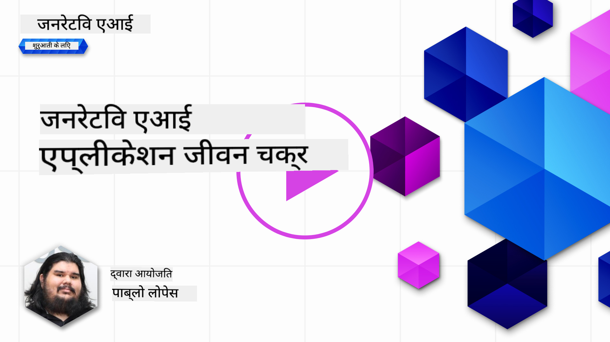
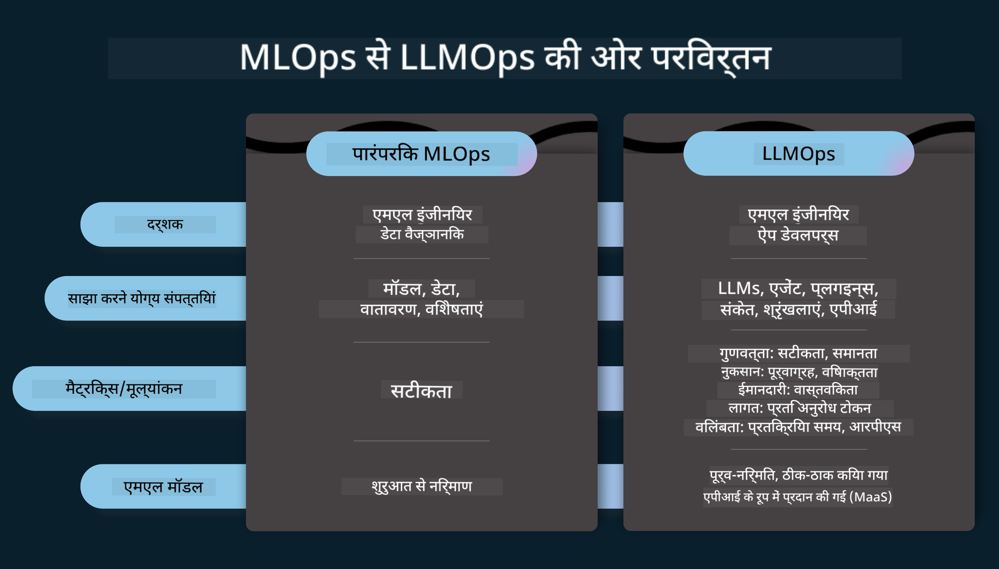
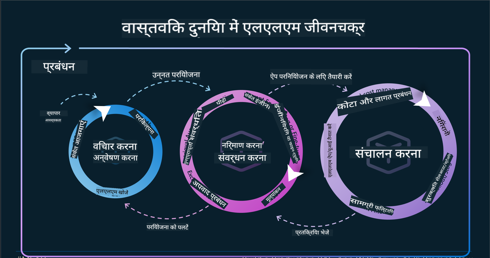
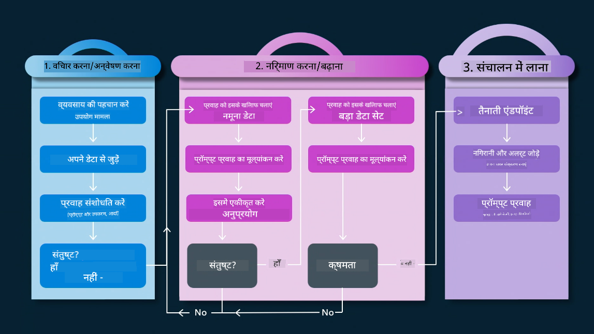
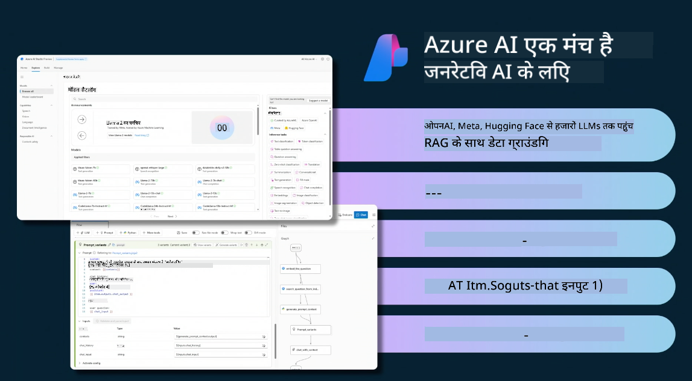
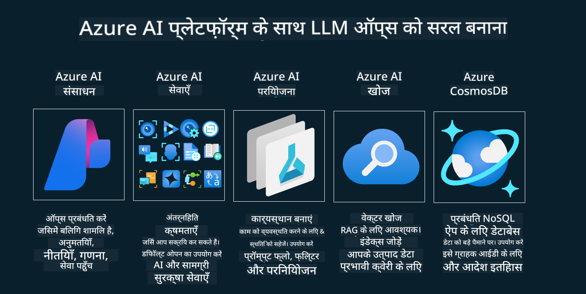
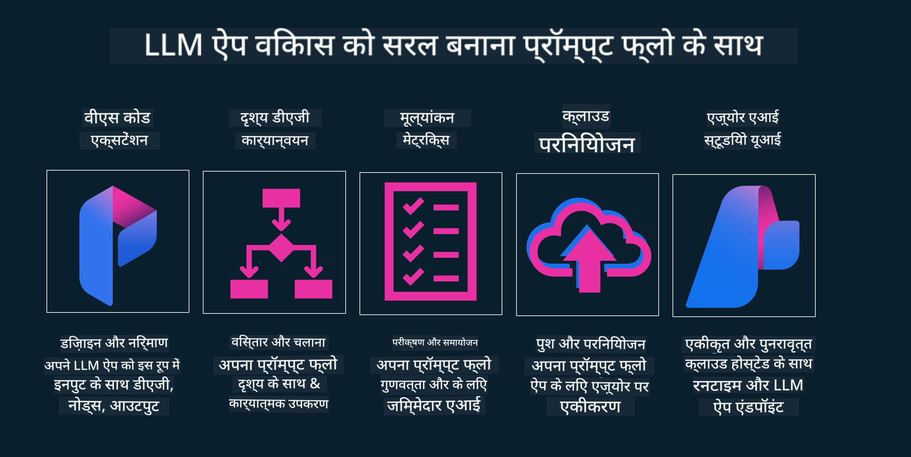

<!--
CO_OP_TRANSLATOR_METADATA:
{
  "original_hash": "27a5347a5022d5ef0a72ab029b03526a",
  "translation_date": "2025-06-25T21:58:52+00:00",
  "source_file": "14-the-generative-ai-application-lifecycle/README.md",
  "language_code": "hi"
}
-->

# जनरेटिव एआई एप्लिकेशन जीवन चक्र

सभी एआई एप्लिकेशन के लिए एक महत्वपूर्ण प्रश्न एआई फीचर्स की प्रासंगिकता है, क्योंकि एआई एक तेजी से विकसित हो रहा क्षेत्र है। यह सुनिश्चित करने के लिए कि आपका एप्लिकेशन प्रासंगिक, विश्वसनीय और मजबूत बना रहे, आपको इसे निरंतर मॉनिटर, मूल्यांकन और सुधारना होगा। यहीं पर जनरेटिव एआई जीवन चक्र आता है।

जनरेटिव एआई जीवन चक्र एक ढांचा है जो आपको एक जनरेटिव एआई एप्लिकेशन के विकास, तैनाती, और रखरखाव के चरणों के माध्यम से मार्गदर्शन करता है। यह आपको अपने लक्ष्यों को परिभाषित करने, अपने प्रदर्शन को मापने, अपनी चुनौतियों की पहचान करने, और अपने समाधान को लागू करने में मदद करता है। यह आपके एप्लिकेशन को आपके क्षेत्र और आपके हितधारकों के नैतिक और कानूनी मानकों के साथ संरेखित करने में भी मदद करता है। जनरेटिव एआई जीवन चक्र का पालन करके, आप सुनिश्चित कर सकते हैं कि आपका एप्लिकेशन हमेशा मूल्य प्रदान कर रहा है और आपके उपयोगकर्ताओं को संतुष्ट कर रहा है।

## परिचय

इस अध्याय में, आप:

- MLOps से LLMOps तक के पैरेडाइम शिफ्ट को समझेंगे
- LLM जीवन चक्र
- जीवन चक्र टूलिंग
- जीवन चक्र मीट्रिकेशन और मूल्यांकन

## MLOps से LLMOps तक के पैरेडाइम शिफ्ट को समझें

LLMs कृत्रिम बुद्धिमत्ता के शस्त्रागार में एक नया उपकरण हैं, ये एप्लिकेशन के लिए विश्लेषण और उत्पादन कार्यों में अत्यधिक शक्तिशाली हैं, हालांकि इस शक्ति के कुछ परिणाम होते हैं कि हम एआई और क्लासिक मशीन लर्निंग कार्यों को कैसे सुव्यवस्थित करते हैं।

इसके साथ, हमें इस उपकरण को एक गतिशील में, सही प्रोत्साहनों के साथ अनुकूलित करने के लिए एक नया पैरेडाइम चाहिए। हम पुराने एआई एप्लिकेशन को "ML एप्स" और नए एआई एप्लिकेशन को "GenAI एप्स" या सिर्फ "AI एप्स" के रूप में वर्गीकृत कर सकते हैं, जो उस समय उपयोग की जाने वाली मुख्यधारा की तकनीक और तकनीकों को दर्शाता है। यह हमारे कथन को कई तरीकों से बदलता है, निम्नलिखित तुलना को देखें।

ध्यान दें कि LLMOps में, हम ऐप डेवलपर्स पर अधिक केंद्रित हैं, एकीकरण का उपयोग एक प्रमुख बिंदु के रूप में करते हैं, "मॉडल्स-एज-ए-सर्विस" का उपयोग करते हैं और मीट्रिक के लिए निम्नलिखित बिंदुओं पर विचार करते हैं।

- गुणवत्ता: प्रतिक्रिया गुणवत्ता
- हानि: जिम्मेदार एआई
- ईमानदारी: प्रतिक्रिया की वैधता (क्या यह समझ में आता है? क्या यह सही है?)
- लागत: समाधान बजट
- विलंबता: टोकन प्रतिक्रिया के लिए औसत समय

## LLM जीवन चक्र

पहले, जीवन चक्र और संशोधनों को समझने के लिए, अगले इन्फोग्राफिक पर ध्यान दें।

जैसा कि आप देख सकते हैं, यह MLOps के सामान्य जीवन चक्रों से अलग है। LLMs के कई नए आवश्यकताएं हैं, जैसे कि प्रॉम्प्टिंग, गुणवत्ता सुधारने की विभिन्न तकनीकें (फाइन-ट्यूनिंग, RAG, मेटा-प्रॉम्प्ट्स), जिम्मेदार एआई के साथ विभिन्न मूल्यांकन और जिम्मेदारी, अंततः, नए मूल्यांकन मीट्रिक (गुणवत्ता, हानि, ईमानदारी, लागत और विलंबता)।

उदाहरण के लिए, देखें कि हम कैसे विचार करते हैं। विभिन्न LLMs के साथ प्रॉम्प्ट इंजीनियरिंग का उपयोग करके संभावनाओं की खोज करने के लिए प्रयोग करते हैं कि क्या उनका परिकल्पना सही हो सकता है।

ध्यान दें कि यह रैखिक नहीं है, बल्कि एकीकृत लूप्स, पुनरावृत्त और एक व्यापक चक्र के साथ है।

हम उन चरणों का कैसे अन्वेषण कर सकते हैं? चलिए विस्तार में जाते हैं कि हम जीवन चक्र कैसे बना सकते हैं।

यह थोड़ा जटिल लग सकता है, पहले तीन बड़े चरणों पर ध्यान केंद्रित करते हैं।

1. विचार करना/अन्वेषण करना: अन्वेषण, यहाँ हम अपने व्यापारिक आवश्यकताओं के अनुसार अन्वेषण कर सकते हैं। प्रोटोटाइपिंग, एक [प्रॉम्प्टफ्लो](https://microsoft.github.io/promptflow/index.html?WT.mc_id=academic-105485-koreyst) बनाना और परीक्षण करना कि क्या यह हमारी परिकल्पना के लिए पर्याप्त प्रभावी है।
1. निर्माण/वृद्धि: कार्यान्वयन, अब, हम बड़े डेटा सेट के लिए मूल्यांकन शुरू करते हैं, तकनीकों को लागू करते हैं, जैसे कि फाइन-ट्यूनिंग और RAG, हमारी समाधान की मजबूती की जांच करने के लिए। यदि यह नहीं करता है, तो इसे पुनः लागू करना, हमारे प्रवाह में नए चरण जोड़ना या डेटा को पुनर्संरचना करना मदद कर सकता है। हमारे प्रवाह और हमारे पैमाने का परीक्षण करने के बाद, यदि यह काम करता है और हमारे मीट्रिक की जांच करता है, तो यह अगले चरण के लिए तैयार है।
1. परिचालन बनाना: एकीकरण, अब हमारे सिस्टम में मॉनिटरिंग और अलर्ट सिस्टम जोड़ना, तैनाती और हमारे एप्लिकेशन में एकीकरण।

फिर, हमारे पास प्रबंधन का व्यापक चक्र होता है, जो सुरक्षा, अनुपालन और शासन पर केंद्रित होता है।

बधाई हो, अब आपका एआई ऐप तैयार है और परिचालित है। हाथों से अनुभव के लिए, [कॉन्टोसो चैट डेमो](https://nitya.github.io/contoso-chat/?WT.mc_id=academic-105485-koreys) पर नज़र डालें।

अब, हम कौन से उपकरण का उपयोग कर सकते हैं?

## जीवन चक्र टूलिंग

टूलिंग के लिए, Microsoft [Azure AI प्लेटफ़ॉर्म](https://azure.microsoft.com/solutions/ai/?WT.mc_id=academic-105485-koreys) और [प्रॉम्प्टफ्लो](https://microsoft.github.io/promptflow/index.html?WT.mc_id=academic-105485-koreyst) प्रदान करता है, जो आपके चक्र को लागू करने और तैयार करने में आसान बनाता है।

[Azure AI प्लेटफ़ॉर्म](https://azure.microsoft.com/solutions/ai/?WT.mc_id=academic-105485-koreys) आपको [AI स्टूडियो](https://ai.azure.com/?WT.mc_id=academic-105485-koreys) का उपयोग करने की अनुमति देता है। एआई स्टूडियो एक वेब पोर्टल है जो आपको मॉडल, नमूने और उपकरणों का अन्वेषण करने की अनुमति देता है। आपके संसाधनों का प्रबंधन, UI विकास प्रवाह और कोड-प्रथम विकास के लिए SDK/CLI विकल्प।

Azure AI, आपको आपके संचालन, सेवाओं, परियोजनाओं, वेक्टर खोज और डेटाबेस की जरूरतों को प्रबंधित करने के लिए कई संसाधनों का उपयोग करने की अनुमति देता है।

प्रॉम्प्टफ्लो के साथ, प्रूफ-ऑफ-कॉन्सेप्ट (POC) से लेकर बड़े पैमाने के एप्लिकेशन तक निर्माण करें:

- VS कोड से ऐप्स डिज़ाइन और निर्माण करें, दृश्य और कार्यात्मक उपकरणों के साथ
- गुणवत्ता एआई के लिए अपने ऐप्स का परीक्षण और फाइन-ट्यून करें, आसानी से।
- Azure AI स्टूडियो का उपयोग करें क्लाउड के साथ एकीकृत और पुनरावृत्त करने के लिए, त्वरित एकीकरण के लिए पुश और तैनाती करें।

## शानदार! अपनी सीखने की यात्रा जारी रखें!

शानदार, अब जानें कि हम [कॉन्टोसो चैट ऐप](https://nitya.github.io/contoso-chat/?WT.mc_id=academic-105485-koreyst) के साथ इन अवधारणाओं का उपयोग करने के लिए एक एप्लिकेशन कैसे संरचित करते हैं, यह जांचने के लिए कि क्लाउड एडवोकेसी इन अवधारणाओं को प्रदर्शनों में कैसे जोड़ता है। अधिक सामग्री के लिए, हमारे [इग्नाइट ब्रेकआउट सत्र](https://www.youtube.com/watch?v=DdOylyrTOWg) को देखें!

अब, पाठ 15 देखें, यह समझने के लिए कि [रिट्रीवल ऑगमेंटेड जनरेशन और वेक्टर डेटाबेस](../15-rag-and-vector-databases/README.md?WT.mc_id=academic-105485-koreyst) जनरेटिव एआई को कैसे प्रभावित करते हैं और अधिक आकर्षक एप्लिकेशन बनाने के लिए!

**अस्वीकरण**:  
यह दस्तावेज़ AI अनुवाद सेवा [Co-op Translator](https://github.com/Azure/co-op-translator) का उपयोग करके अनुवादित किया गया है। जबकि हम सटीकता के लिए प्रयास करते हैं, कृपया ध्यान दें कि स्वचालित अनुवाद में त्रुटियाँ या अशुद्धियाँ हो सकती हैं। इसकी मूल भाषा में मूल दस्तावेज़ को आधिकारिक स्रोत माना जाना चाहिए। महत्वपूर्ण जानकारी के लिए, पेशेवर मानव अनुवाद की सिफारिश की जाती है। इस अनुवाद के उपयोग से उत्पन्न किसी भी गलतफहमी या गलत व्याख्या के लिए हम उत्तरदायी नहीं हैं।