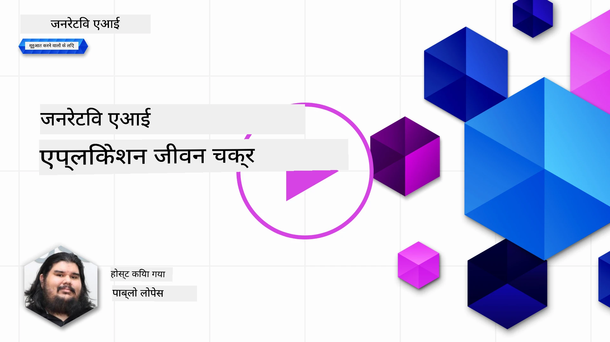
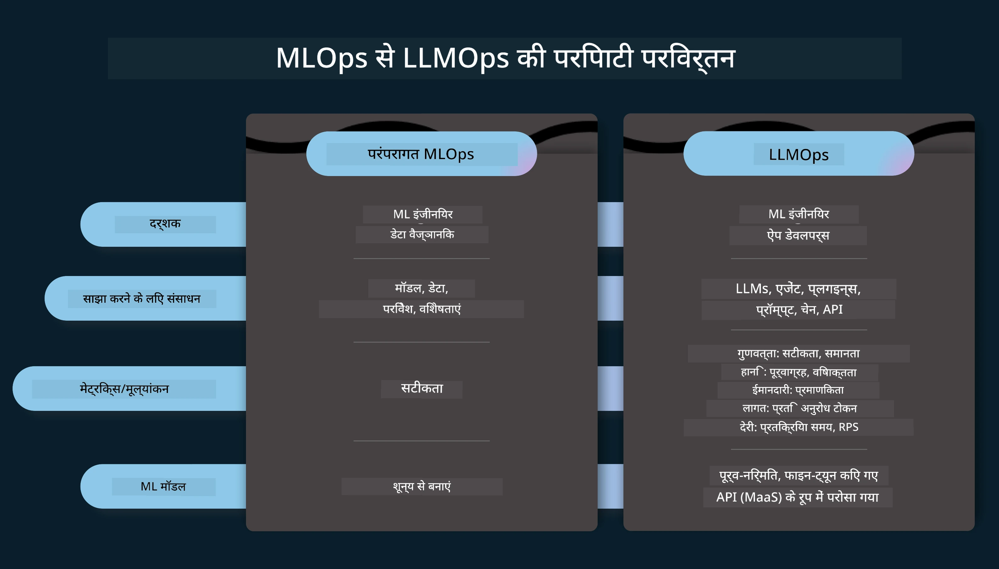
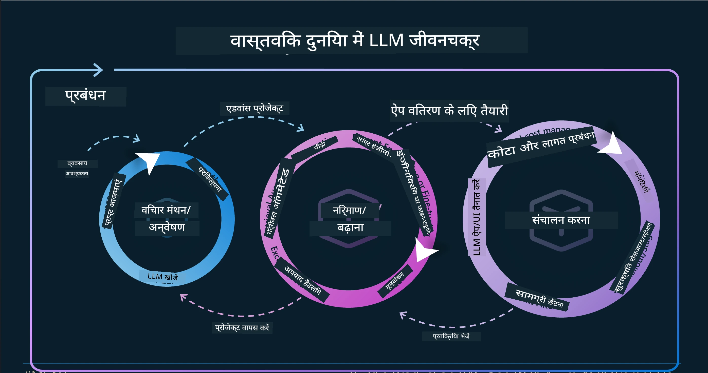
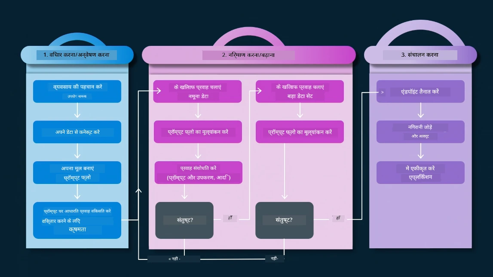
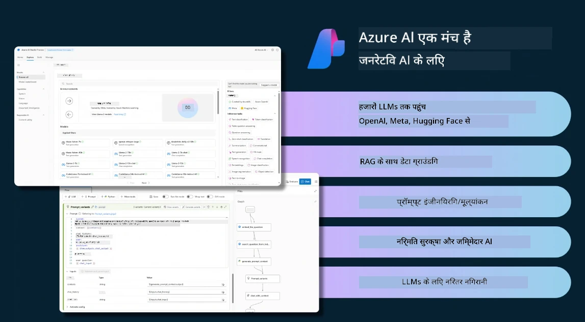
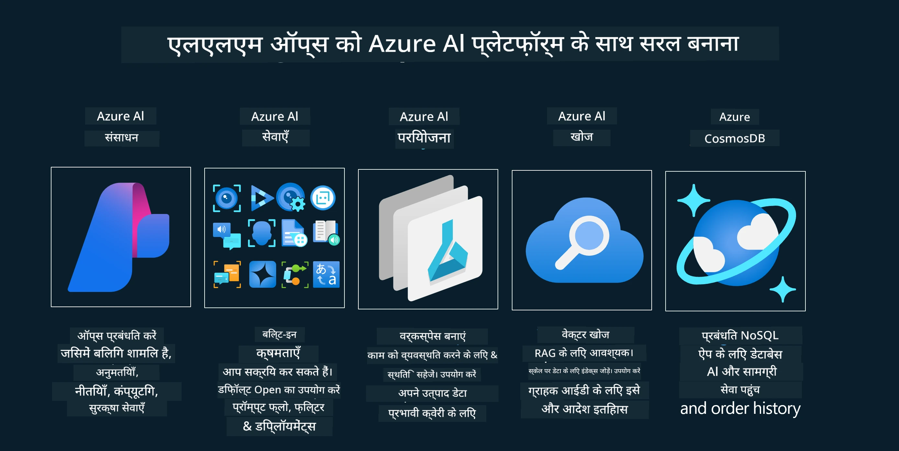
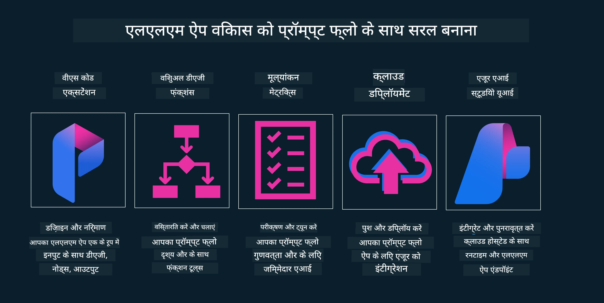

# जेनेरेटिव AI एप्लिकेशन लाइफसायकल

सभी AI एप्लिकेशनों के लिए एक महत्वपूर्ण प्रश्न AI फीचर्स की प्रासंगिकता है, क्योंकि AI एक तेजी से विकसित हो रहा क्षेत्र है, यह सुनिश्चित करने के लिए कि आपका एप्लिकेशन प्रासंगिक, विश्वसनीय और मजबूत बना रहे, आपको इसे निरंतर मॉनिटर, मूल्यांकन और सुधारना होगा। यहीं पर जेनेरेटिव AI लाइफसायकल काम आता है।

जेनेरेटिव AI लाइफसायकल एक फ्रेमवर्क है जो आपको जेनेरेटिव AI एप्लिकेशन विकसित करने, तैनात करने और बनाए रखने के चरणों से मार्गदर्शन करता है। यह आपको अपने लक्ष्यों को परिभाषित करने, अपने प्रदर्शन को मापने, अपनी चुनौतियों की पहचान करने और अपने समाधानों को लागू करने में मदद करता है। यह आपको अपने एप्लिकेशन को आपके डोमेन और आपके हितधारकों के नैतिक और कानूनी मानकों के अनुरूप बनाने में भी मदद करता है। जेनेरेटिव AI लाइफसायकल का पालन करके, आप सुनिश्चित कर सकते हैं कि आपका एप्लिकेशन हमेशा मूल्य प्रदान कर रहा है और आपके उपयोगकर्ताओं को संतुष्ट कर रहा है।

## परिचय

इस अध्याय में, आप:

- MLOps से LLMOps तक के पैराडाइम शिफ्ट को समझेंगे
- LLM लाइफसायकल
- लाइफसायकल टूलिंग
- लाइफसायकल मेट्रिफिकेशन और मूल्यांकन

## MLOps से LLMOps तक के पैराडाइम शिफ्ट को समझें

LLM आर्टिफिशियल इंटेलिजेंस के हथियारों में एक नया उपकरण हैं, ये एप्लिकेशनों के विश्लेषण और जेनेरेशन कार्यों में अत्यंत शक्तिशाली हैं, हालांकि इस शक्ति के कुछ परिणाम होते हैं कि हम AI और क्लासिक मशीन लर्निंग कार्यों को कैसे सुव्यवस्थित करते हैं।

इसके साथ, हमें इस उपकरण को सही प्रोत्साहनों के साथ गतिशील रूप से अनुकूलित करने के लिए एक नए पैराडाइम की आवश्यकता है। हम पुराने AI ऐप्स को "ML ऐप्स" और नए AI ऐप्स को "GenAI ऐप्स" या बस "AI ऐप्स" के रूप में वर्गीकृत कर सकते हैं, जो उस समय प्रचलित तकनीक और तकनीकों को दर्शाता है। यह हमारे कथानक को कई तरीकों से बदल देता है, निम्नलिखित तुलना देखें।

ध्यान दें कि LLMOps में, हम ऐप डेवलपर्स पर अधिक केंद्रित हैं, एकीकरण को एक मुख्य बिंदु के रूप में उपयोग करते हैं, "मॉडल्स-एज़-अ-सर्विस" का उपयोग करते हैं और मेट्रिक्स के लिए निम्नलिखित बिंदुओं पर विचार करते हैं।

- गुणवत्ता: प्रतिक्रिया की गुणवत्ता
- हानि: जिम्मेदार AI
- ईमानदारी: प्रतिक्रिया की आधारिकता (क्या यह समझ में आता है? क्या यह सही है?)
- लागत: समाधान बजट
- विलंबता: टोकन प्रतिक्रिया का औसत समय

## LLM लाइफसायकल

सबसे पहले, लाइफसायकल और संशोधनों को समझने के लिए, निम्न इन्फोग्राफिक पर ध्यान दें।

जैसा कि आप नोट कर सकते हैं, यह MLOps के सामान्य लाइफसायकल से अलग है। LLMs के कई नए आवश्यकताएँ होती हैं, जैसे प्रॉम्प्टिंग, गुणवत्ता सुधार के विभिन्न तकनीकें (फाइन-ट्यूनिंग, RAG, मेटा-प्रॉम्प्ट्स), जिम्मेदार AI के साथ विभिन्न मूल्यांकन और जिम्मेदारी, अंत में नए मूल्यांकन मेट्रिक्स (गुणवत्ता, हानि, ईमानदारी, लागत और विलंबता)।

उदाहरण के लिए, देखिए हम कैसे विचार करते हैं। विभिन्न LLMs के साथ प्रयोग करने के लिए प्रॉम्प्ट इंजीनियरिंग का उपयोग करना ताकि उनकी हाइपोथेसिस सही हो सकती है या नहीं यह जांचा जा सके।

ध्यान दें कि यह रैखिक नहीं है, बल्कि एकीकृत लूप, पुनरावृत्त और एक व्यापक चक्र है।

हम उन चरणों का अन्वेषण कैसे कर सकते हैं? आइए विस्तार में देखें कि हम एक लाइफसायकल कैसे बना सकते हैं।

यह थोड़ा जटिल लग सकता है, पहले बड़े तीन चरणों पर ध्यान दें।

1. विचार/अन्वेषण: अन्वेषण, यहां हम अपने व्यावसायिक आवश्यकताओं के अनुसार शोध कर सकते हैं। प्रोटोटाइपिंग, [PromptFlow](https://microsoft.github.io/promptflow/index.html?WT.mc_id=academic-105485-koreyst) बनाना और यह परीक्षण करना कि क्या यह हमारी हाइपोथेसिस के लिए पर्याप्त प्रभावी है।
1. निर्माण/वृद्धि: कार्यान्वयन, अब, हम बड़े डेटा सेट के लिए तकनीकों का मूल्यांकन करते हैं, जैसे फाइन-ट्यूनिंग और RAG, ताकि हमारे समाधान की दृढ़ता की जांच हो सके। अगर यह काम नहीं करता है, तो इसे पुनः लागू करना, हमारे फ्लो में नए चरण जोड़ना या डेटा का पुनर्गठन मदद कर सकता है। अपने फ्लो और स्केल का परीक्षण करने के बाद, अगर यह काम करता है और हमारे मेट्रिक्स सही हैं, तो यह अगले चरण के लिए तैयार है।
1. परिचालन: एकीकरण, अब हमारे सिस्टम में मॉनिटरिंग और अलर्ट सिस्टम जोड़ना, तैनाती और हमारे एप्लिकेशन के साथ एकीकरण।

फिर, सुरक्षा, अनुपालन और शासन पर ध्यान केंद्रित करते हुए प्रबंधन का व्यापक चक्र होता है।

बधाई हो, अब आपका AI ऐप तैयार और परिचालन में है। हस्तक्षेप अनुभव के लिए, [Contoso Chat Demo](https://nitya.github.io/contoso-chat/?WT.mc_id=academic-105485-koreyst) देखें।

अब, हम कौन से उपकरण उपयोग कर सकते हैं?

## लाइफसायकल टूलिंग

टूलिंग के लिए, Microsoft [Azure AI Platform](https://azure.microsoft.com/solutions/ai/?WT.mc_id=academic-105485-koreyst) और [PromptFlow](https://microsoft.github.io/promptflow/index.html?WT.mc_id=academic-105485-koreyst) प्रदान करता है जो आपके चक्र को आसान बनाने और लागू करने के लिए तैयार करता है।

[Azure AI Platform](https://azure.microsoft.com/solutions/ai/?WT.mc_id=academic-105485-koreyst), आपको [AI Studio](https://ai.azure.com/?WT.mc_id=academic-105485-koreyst) का उपयोग करने की अनुमति देता है। AI Studio एक वेब पोर्टल है जो आपको मॉडल, नमूने और टूल्स एक्सप्लोर करने की सुविधा देता है। आपकी संसाधनों, UI विकास फ्लोज़ और SDK/CLI विकल्पों को प्रबंधित करता है ताकि कोड-फर्स्ट विकास हो सके।

Azure AI, आपको कई संसाधनों का उपयोग करने की सुविधा देता है, अपनी संचालन, सेवाओं, परियोजनाओं, वेक्टर खोज और डेटाबेस आवश्यकताओं को प्रबंधित करने के लिए।

Proof-of-Concept(POC) से लेकर बड़े पैमाने पर एप्लिकेशन्स तक PromptFlow के साथ निर्माण:

- VS कोड से एप्लिकेशन डिजाइन और निर्माण, दृश्य और कार्यात्मक उपकरणों के साथ
- अपने एप्लिकेशन को गुणवत्ता AI के लिए आसानी से परीक्षण और फाइन-ट्यून करें।
- जल्दी एकीकरण के लिए Azure AI Studio का उपयोग करके क्लाउड के साथ इंटीग्रेट और पुनरावृति करें, पुश और तैनाती।

## बहुत अच्छा! अपनी सीख जारी रखें!

अद्भुत, अब जानें कि हम एप्लिकेशन को कैसे संरचित करते हैं और [Contoso Chat App](https://nitya.github.io/contoso-chat/?WT.mc_id=academic-105485-koreyst) के साथ अवधारणाओं का उपयोग कैसे करते हैं, यह देखने के लिए कि क्लाउड एडवोकेसी उन अवधारणाओं को डेमो में कैसे जोड़ती है। अधिक सामग्री के लिए, हमारे [Ignite ब्रेकआउट सेशन!](https://www.youtube.com/watch?v=DdOylyrTOWg) देखें।

अब, लेसन 15 देखें, ताकि आप समझ सकें कि [Retrieval Augmented Generation और Vector Databases](../15-rag-and-vector-databases/README.md?WT.mc_id=academic-105485-koreyst) जेनेरेटिव AI को कैसे प्रभावित करते हैं और अधिक आकर्षक ऐप्लिकेशन बनाने के लिए!

---

<!-- CO-OP TRANSLATOR DISCLAIMER START -->
**अस्वीकरण**:  
यह दस्तावेज़ AI अनुवाद सेवा [Co-op Translator](https://github.com/Azure/co-op-translator) का उपयोग करके अनुवादित किया गया है। जबकि हम सटीकता के प्रयास करते हैं, कृपया ध्यान दें कि स्वचालित अनुवादों में त्रुटियां या असंगतियां हो सकती हैं। मूल भाषा में मूल दस्तावेज़ को अधिकारिक स्रोत माना जाना चाहिए। महत्वपूर्ण जानकारी के लिए, पेशेवर मानव अनुवाद की सिफारिश की जाती है। इस अनुवाद के उपयोग से उत्पन्न किसी भी गलतफ़हमी या गलत व्याख्या के लिए हम जिम्मेदार नहीं हैं।
<!-- CO-OP TRANSLATOR DISCLAIMER END -->