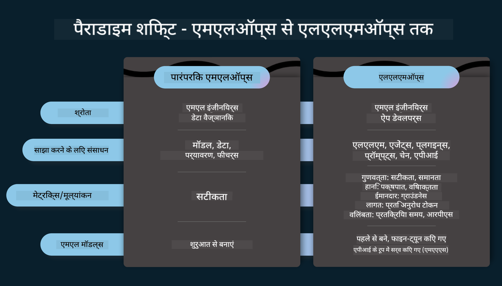
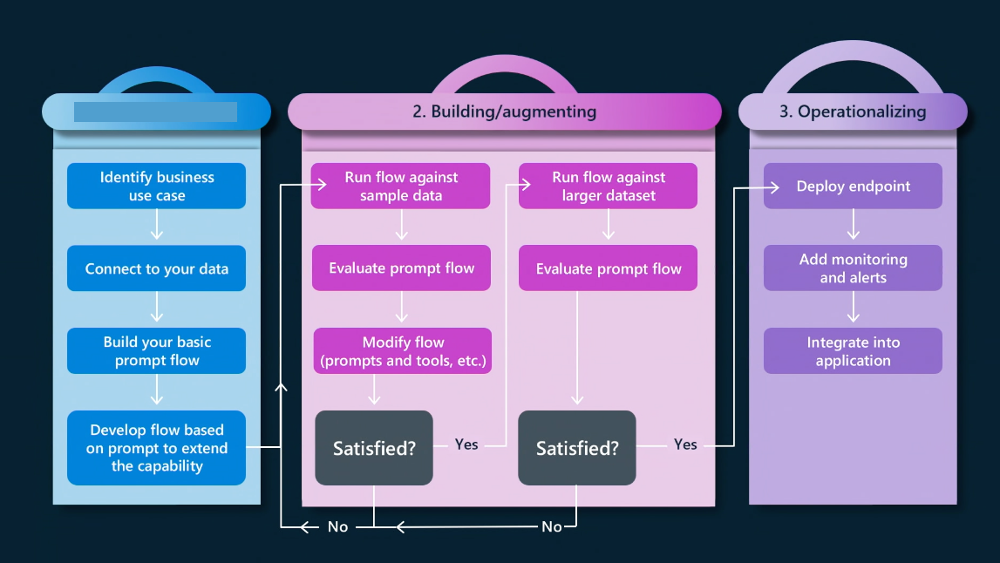

<!--
CO_OP_TRANSLATOR_METADATA:
{
  "original_hash": "27a5347a5022d5ef0a72ab029b03526a",
  "translation_date": "2025-07-09T15:50:12+00:00",
  "source_file": "14-the-generative-ai-application-lifecycle/README.md",
  "language_code": "hi"
}
-->

# जनरेटिव AI एप्लिकेशन जीवनचक्र

सभी AI एप्लिकेशनों के लिए एक महत्वपूर्ण सवाल होता है कि AI फीचर्स कितने प्रासंगिक हैं, क्योंकि AI एक तेजी से विकसित हो रहा क्षेत्र है। यह सुनिश्चित करने के लिए कि आपका एप्लिकेशन प्रासंगिक, विश्वसनीय और मजबूत बना रहे, आपको इसे निरंतर मॉनिटर, मूल्यांकन और सुधारना होगा। यहीं पर जनरेटिव AI जीवनचक्र काम आता है।

जनरेटिव AI जीवनचक्र एक फ्रेमवर्क है जो आपको जनरेटिव AI एप्लिकेशन के विकास, तैनाती और रखरखाव के चरणों से मार्गदर्शन करता है। यह आपको अपने लक्ष्यों को परिभाषित करने, प्रदर्शन को मापने, चुनौतियों की पहचान करने और समाधान लागू करने में मदद करता है। यह आपके एप्लिकेशन को आपके डोमेन और हितधारकों के नैतिक और कानूनी मानकों के अनुरूप भी बनाता है। जनरेटिव AI जीवनचक्र का पालन करके, आप सुनिश्चित कर सकते हैं कि आपका एप्लिकेशन हमेशा मूल्य प्रदान कर रहा है और उपयोगकर्ताओं को संतुष्ट कर रहा है।

## परिचय

इस अध्याय में, आप:

- MLOps से LLMOps तक के पैरेडाइम शिफ्ट को समझेंगे
- LLM जीवनचक्र
- जीवनचक्र टूलिंग
- जीवनचक्र मेट्रिफिकेशन और मूल्यांकन

## MLOps से LLMOps तक के पैरेडाइम शिफ्ट को समझना

LLM (लार्ज लैंग्वेज मॉडल) आर्टिफिशियल इंटेलिजेंस के नए उपकरण हैं, जो एप्लिकेशनों के लिए विश्लेषण और जनरेशन कार्यों में बेहद शक्तिशाली हैं, लेकिन इस शक्ति के कुछ परिणाम भी हैं जो AI और क्लासिक मशीन लर्निंग कार्यों को सुव्यवस्थित करने के तरीके को प्रभावित करते हैं।

इसलिए, हमें इस उपकरण को सही प्रोत्साहनों के साथ गतिशील रूप से अपनाने के लिए एक नया पैरेडाइम चाहिए। हम पुराने AI एप्लिकेशनों को "ML Apps" और नए AI एप्लिकेशनों को "GenAI Apps" या सिर्फ "AI Apps" के रूप में वर्गीकृत कर सकते हैं, जो उस समय उपयोग की जाने वाली मुख्यधारा की तकनीक और विधियों को दर्शाता है। यह हमारे दृष्टिकोण को कई तरीकों से बदलता है, नीचे दिए गए तुलना को देखें।

ध्यान दें कि LLMOps में, हम एप्लिकेशन डेवलपर्स पर अधिक ध्यान केंद्रित करते हैं, इंटीग्रेशन को एक मुख्य बिंदु के रूप में उपयोग करते हैं, "Models-as-a-Service" का उपयोग करते हैं और मेट्रिक्स के लिए निम्नलिखित बिंदुओं पर विचार करते हैं।

- गुणवत्ता: प्रतिक्रिया की गुणवत्ता
- हानि: जिम्मेदार AI
- ईमानदारी: प्रतिक्रिया की सटीकता (क्या यह समझ में आता है? क्या यह सही है?)
- लागत: समाधान का बजट
- विलंबता: टोकन प्रतिक्रिया का औसत समय

## LLM जीवनचक्र

सबसे पहले, जीवनचक्र और संशोधनों को समझने के लिए, निम्न इन्फोग्राफिक पर ध्यान दें।

जैसा कि आप देख सकते हैं, यह MLOps के सामान्य जीवनचक्र से अलग है। LLMs के कई नए आवश्यकताएं हैं, जैसे प्रॉम्प्टिंग, गुणवत्ता सुधार के लिए विभिन्न तकनीकें (फाइन-ट्यूनिंग, RAG, मेटा-प्रॉम्प्ट्स), जिम्मेदार AI के साथ अलग मूल्यांकन और जिम्मेदारी, और अंत में नए मूल्यांकन मेट्रिक्स (गुणवत्ता, हानि, ईमानदारी, लागत और विलंबता)।

उदाहरण के लिए, देखें कि हम कैसे विचार करते हैं। विभिन्न LLMs के साथ प्रयोग करने के लिए प्रॉम्प्ट इंजीनियरिंग का उपयोग करते हैं ताकि संभावनाओं का पता लगाया जा सके और यह जांचा जा सके कि उनका हाइपोथेसिस सही हो सकता है या नहीं।

ध्यान दें कि यह रैखिक नहीं है, बल्कि एकीकृत लूप, पुनरावृत्तिमूलक और एक व्यापक चक्र के साथ है।

हम इन चरणों का पता कैसे लगा सकते हैं? आइए विस्तार से देखें कि हम जीवनचक्र कैसे बना सकते हैं।

यह थोड़ा जटिल लग सकता है, पहले तीन बड़े चरणों पर ध्यान दें।

1. विचार-विमर्श/अन्वेषण: अन्वेषण, यहां हम अपने व्यवसाय की जरूरतों के अनुसार खोज कर सकते हैं। प्रोटोटाइपिंग, [PromptFlow](https://microsoft.github.io/promptflow/index.html?WT.mc_id=academic-105485-koreyst) बनाना और यह जांचना कि क्या यह हमारे हाइपोथेसिस के लिए पर्याप्त प्रभावी है।
1. निर्माण/वृद्धि: कार्यान्वयन, अब हम बड़े डेटा सेट के लिए मूल्यांकन शुरू करते हैं, तकनीकों को लागू करते हैं, जैसे फाइन-ट्यूनिंग और RAG, ताकि हमारे समाधान की मजबूती की जांच हो सके। यदि यह काम नहीं करता, तो इसे पुनः लागू करना, हमारे फ्लो में नए चरण जोड़ना या डेटा को पुनर्गठित करना मदद कर सकता है। हमारे फ्लो और स्केल का परीक्षण करने के बाद, यदि यह काम करता है और हमारे मेट्रिक्स सही हैं, तो यह अगले चरण के लिए तैयार है।
1. संचालन: इंटीग्रेशन, अब हमारे सिस्टम में मॉनिटरिंग और अलर्ट सिस्टम जोड़ना, तैनाती और एप्लिकेशन इंटीग्रेशन।

फिर, हमारे पास प्रबंधन का व्यापक चक्र होता है, जो सुरक्षा, अनुपालन और शासन पर केंद्रित होता है।

बधाई हो, अब आपका AI एप्लिकेशन तैयार है और संचालन में है। व्यावहारिक अनुभव के लिए, [Contoso Chat Demo](https://nitya.github.io/contoso-chat/?WT.mc_id=academic-105485-koreys) देखें।

अब, हम कौन से टूल्स का उपयोग कर सकते हैं?

## जीवनचक्र टूलिंग

टूलिंग के लिए, Microsoft [Azure AI Platform](https://azure.microsoft.com/solutions/ai/?WT.mc_id=academic-105485-koreys) और [PromptFlow](https://microsoft.github.io/promptflow/index.html?WT.mc_id=academic-105485-koreyst) प्रदान करता है, जो आपके जीवनचक्र को लागू करना आसान और तैयार बनाते हैं।

[Azure AI Platform](https://azure.microsoft.com/solutions/ai/?WT.mc_id=academic-105485-koreys) आपको [AI Studio](https://ai.azure.com/?WT.mc_id=academic-105485-koreys) का उपयोग करने की अनुमति देता है। AI Studio एक वेब पोर्टल है जो आपको मॉडल, सैंपल और टूल्स एक्सप्लोर करने देता है। यह आपके संसाधनों का प्रबंधन, UI विकास फ्लो और SDK/CLI विकल्पों के साथ कोड-फर्स्ट विकास के लिए सुविधाएं प्रदान करता है।

Azure AI आपको कई संसाधनों का उपयोग करने देता है, ताकि आप अपने ऑपरेशंस, सेवाओं, प्रोजेक्ट्स, वेक्टर सर्च और डेटाबेस की जरूरतों का प्रबंधन कर सकें।

PromptFlow के साथ, प्रूफ-ऑफ-कॉन्सेप्ट (POC) से लेकर बड़े पैमाने के एप्लिकेशन तक बनाएं:

- VS Code से ऐप्स डिज़ाइन और बनाएं, विज़ुअल और फंक्शनल टूल्स के साथ
- अपने ऐप्स का परीक्षण और फाइन-ट्यूनिंग करें ताकि AI की गुणवत्ता सुनिश्चित हो सके, आसानी से।
- Azure AI Studio का उपयोग करें क्लाउड के साथ इंटीग्रेट और पुनरावृत्ति के लिए, जल्दी इंटीग्रेशन के लिए पुश और डिप्लॉय करें।

## बढ़िया! अपनी सीख जारी रखें!

शानदार, अब जानें कि हम एप्लिकेशन को कैसे संरचित करते हैं ताकि इन अवधारणाओं का उपयोग किया जा सके, [Contoso Chat App](https://nitya.github.io/contoso-chat/?WT.mc_id=academic-105485-koreyst) के साथ देखें, यह जांचने के लिए कि क्लाउड एडवोकेसी इन अवधारणाओं को डेमो में कैसे जोड़ता है। अधिक सामग्री के लिए, हमारा [Ignite ब्रेकआउट सेशन](https://www.youtube.com/watch?v=DdOylyrTOWg) देखें।

अब, लेसन 15 देखें, ताकि समझ सकें कि [Retrieval Augmented Generation और Vector Databases](../15-rag-and-vector-databases/README.md?WT.mc_id=academic-105485-koreyst) जनरेटिव AI को कैसे प्रभावित करते हैं और अधिक आकर्षक एप्लिकेशन कैसे बनाते हैं!

**अस्वीकरण**:  
यह दस्तावेज़ AI अनुवाद सेवा [Co-op Translator](https://github.com/Azure/co-op-translator) का उपयोग करके अनुवादित किया गया है। जबकि हम सटीकता के लिए प्रयासरत हैं, कृपया ध्यान दें कि स्वचालित अनुवादों में त्रुटियाँ या अशुद्धियाँ हो सकती हैं। मूल दस्तावेज़ अपनी मूल भाषा में ही अधिकारिक स्रोत माना जाना चाहिए। महत्वपूर्ण जानकारी के लिए, पेशेवर मानव अनुवाद की सलाह दी जाती है। इस अनुवाद के उपयोग से उत्पन्न किसी भी गलतफहमी या गलत व्याख्या के लिए हम जिम्मेदार नहीं हैं।