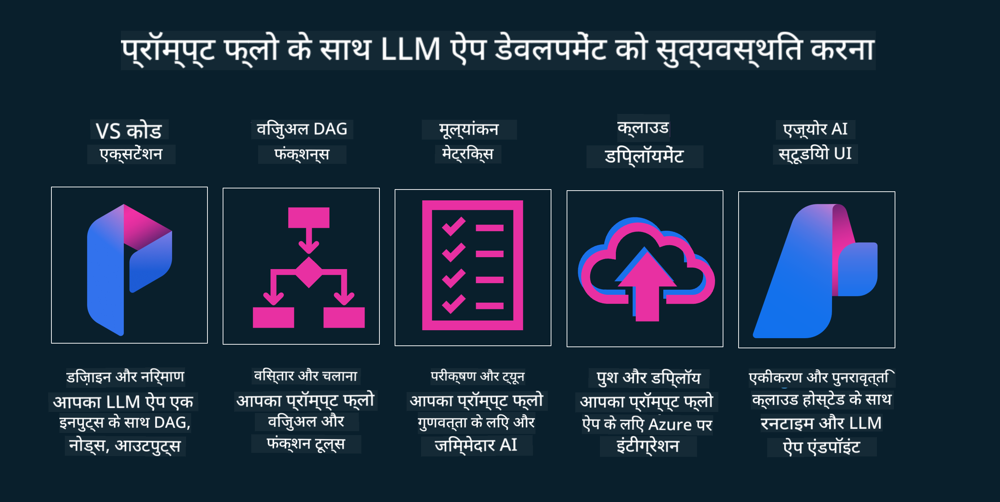

<!--
CO_OP_TRANSLATOR_METADATA:
{
  "original_hash": "b9d32511b27373a1b21b5789d4fda057",
  "translation_date": "2025-10-18T00:16:40+00:00",
  "source_file": "14-the-generative-ai-application-lifecycle/README.md",
  "language_code": "hi"
}
-->

# जनरेटिव एआई एप्लिकेशन जीवनचक्र

सभी एआई एप्लिकेशन के लिए एक महत्वपूर्ण सवाल यह है कि एआई फीचर्स कितने प्रासंगिक हैं, क्योंकि एआई एक तेजी से विकसित होने वाला क्षेत्र है। यह सुनिश्चित करने के लिए कि आपका एप्लिकेशन प्रासंगिक, विश्वसनीय और मजबूत बना रहे, आपको इसे लगातार मॉनिटर, मूल्यांकन और सुधारना होगा। यही वह जगह है जहां जनरेटिव एआई जीवनचक्र काम आता है।

जनरेटिव एआई जीवनचक्र एक ढांचा है जो आपको जनरेटिव एआई एप्लिकेशन को विकसित करने, तैनात करने और बनाए रखने के चरणों के माध्यम से मार्गदर्शन करता है। यह आपको अपने लक्ष्यों को परिभाषित करने, अपने प्रदर्शन को मापने, अपनी चुनौतियों की पहचान करने और अपने समाधान लागू करने में मदद करता है। यह आपके एप्लिकेशन को आपके डोमेन और आपके हितधारकों के नैतिक और कानूनी मानकों के साथ संरेखित करने में भी मदद करता है। जनरेटिव एआई जीवनचक्र का पालन करके, आप सुनिश्चित कर सकते हैं कि आपका एप्लिकेशन हमेशा मूल्य प्रदान कर रहा है और आपके उपयोगकर्ताओं को संतुष्ट कर रहा है।

## परिचय

इस अध्याय में, आप:

- MLOps से LLMOps तक के दृष्टिकोण में बदलाव को समझेंगे
- LLM जीवनचक्र
- जीवनचक्र उपकरण
- जीवनचक्र मेट्रिकेशन और मूल्यांकन

## MLOps से LLMOps तक के दृष्टिकोण में बदलाव को समझें

LLMs कृत्रिम बुद्धिमत्ता के शस्त्रागार में एक नया उपकरण हैं। वे एप्लिकेशन के लिए विश्लेषण और जनरेशन कार्यों में बेहद शक्तिशाली हैं। हालांकि, इस शक्ति के साथ एआई और क्लासिक मशीन लर्निंग कार्यों को सुव्यवस्थित करने के तरीके पर कुछ प्रभाव पड़ता है।

इसके साथ, हमें इस उपकरण को सही प्रोत्साहनों के साथ एक गतिशील तरीके से अनुकूलित करने के लिए एक नए दृष्टिकोण की आवश्यकता है। हम पुराने एआई ऐप्स को "एमएल ऐप्स" और नए एआई ऐप्स को "जेनएआई ऐप्स" या सिर्फ "एआई ऐप्स" के रूप में वर्गीकृत कर सकते हैं, जो उस समय उपयोग की जाने वाली मुख्यधारा की तकनीक और तकनीकों को दर्शाता है। यह कई तरीकों से हमारे दृष्टिकोण को बदलता है। निम्नलिखित तुलना पर एक नज़र डालें।

ध्यान दें कि LLMOps में, हम ऐप डेवलपर्स पर अधिक ध्यान केंद्रित करते हैं, एकीकृत करने को एक प्रमुख बिंदु के रूप में उपयोग करते हैं, "मॉडल-एज़-ए-सर्विस" का उपयोग करते हैं और मेट्रिक्स के लिए निम्नलिखित बिंदुओं पर विचार करते हैं।

- गुणवत्ता: प्रतिक्रिया की गुणवत्ता
- नुकसान: जिम्मेदार एआई
- ईमानदारी: प्रतिक्रिया की सटीकता (क्या यह समझ में आता है? क्या यह सही है?)
- लागत: समाधान बजट
- विलंबता: टोकन प्रतिक्रिया के लिए औसत समय

## LLM जीवनचक्र

सबसे पहले, जीवनचक्र और संशोधनों को समझने के लिए, अगले इन्फोग्राफिक पर ध्यान दें।

जैसा कि आप देख सकते हैं, यह MLOps के सामान्य जीवनचक्रों से अलग है। LLMs में कई नई आवश्यकताएं हैं, जैसे कि प्रॉम्प्टिंग, गुणवत्ता सुधारने के लिए विभिन्न तकनीकें (फाइन-ट्यूनिंग, RAG, मेटा-प्रॉम्प्ट्स), जिम्मेदार एआई के साथ अलग मूल्यांकन और जिम्मेदारी, और अंत में, नए मूल्यांकन मेट्रिक्स (गुणवत्ता, नुकसान, ईमानदारी, लागत और विलंबता)।

उदाहरण के लिए, देखें कि हम कैसे विचार करते हैं। विभिन्न LLMs के साथ प्रॉम्प्ट इंजीनियरिंग का उपयोग करके विभिन्न संभावनाओं का परीक्षण करने के लिए प्रयोग करते हैं कि क्या उनका परिकल्पना सही हो सकती है।

ध्यान दें कि यह रैखिक नहीं है, बल्कि एकीकृत लूप्स, पुनरावृत्त और एक व्यापक चक्र के साथ है।

हम इन चरणों का पता कैसे लगा सकते हैं? आइए विस्तार से जानें कि हम जीवनचक्र कैसे बना सकते हैं।

यह थोड़ा जटिल लग सकता है, पहले तीन बड़े चरणों पर ध्यान केंद्रित करें।

1. विचार करना/खोजना: अन्वेषण, यहां हम अपने व्यवसाय की जरूरतों के अनुसार खोज कर सकते हैं। प्रोटोटाइपिंग, [PromptFlow](https://microsoft.github.io/promptflow/index.html?WT.mc_id=academic-105485-koreyst) बनाना और परीक्षण करना कि क्या यह हमारी परिकल्पना के लिए पर्याप्त प्रभावी है।
1. निर्माण/वृद्धि करना: कार्यान्वयन, अब, हम बड़े डेटा सेट के लिए मूल्यांकन शुरू करते हैं, तकनीकों को लागू करते हैं, जैसे फाइन-ट्यूनिंग और RAG, यह जांचने के लिए कि हमारा समाधान कितना मजबूत है। यदि यह काम नहीं करता है, तो इसे फिर से लागू करना, हमारे प्रवाह में नए चरण जोड़ना या डेटा को पुनर्गठित करना मदद कर सकता है। हमारे प्रवाह और हमारे पैमाने का परीक्षण करने के बाद, यदि यह काम करता है और हमारे मेट्रिक्स की जांच करता है, तो यह अगले चरण के लिए तैयार है।
1. संचालन करना: एकीकरण, अब हमारे सिस्टम में मॉनिटरिंग और अलर्ट सिस्टम जोड़ना, तैनाती और हमारे एप्लिकेशन के साथ एप्लिकेशन एकीकरण।

फिर, हमारे पास प्रबंधन का व्यापक चक्र है, जो सुरक्षा, अनुपालन और शासन पर ध्यान केंद्रित करता है।

बधाई हो, अब आपका एआई ऐप तैयार है और चालू है। व्यावहारिक अनुभव के लिए, [Contoso Chat Demo](https://nitya.github.io/contoso-chat/?WT.mc_id=academic-105485-koreys) पर एक नज़र डालें।

अब, हम कौन से उपकरण उपयोग कर सकते हैं?

## जीवनचक्र उपकरण

उपकरणों के लिए, Microsoft [Azure AI Platform](https://azure.microsoft.com/solutions/ai/?WT.mc_id=academic-105485-koreys) और [PromptFlow](https://microsoft.github.io/promptflow/index.html?WT.mc_id=academic-105485-koreyst) प्रदान करता है, जो आपके जीवनचक्र को लागू करना और तैयार करना आसान बनाता है।

[Azure AI Platform](https://azure.microsoft.com/solutions/ai/?WT.mc_id=academic-105485-koreys) आपको [AI Studio](https://ai.azure.com/?WT.mc_id=academic-105485-koreys) का उपयोग करने की अनुमति देता है। एआई स्टूडियो एक वेब पोर्टल है जो आपको मॉडल, नमूने और उपकरणों का पता लगाने की अनुमति देता है। अपने संसाधनों का प्रबंधन करना, यूआई विकास प्रवाह और कोड-फर्स्ट विकास के लिए SDK/CLI विकल्प।

Azure AI आपको अपने संचालन, सेवाओं, परियोजनाओं, वेक्टर खोज और डेटाबेस की जरूरतों को प्रबंधित करने के लिए कई संसाधनों का उपयोग करने की अनुमति देता है।

Proof-of-Concept(POC) से लेकर बड़े पैमाने पर एप्लिकेशन तक PromptFlow के साथ निर्माण करें:

- VS Code से विज़ुअल और फंक्शनल टूल्स के साथ ऐप्स डिज़ाइन और बनाएं
- अपने ऐप्स को गुणवत्ता एआई के लिए आसानी से टेस्ट और फाइन-ट्यून करें।
- Azure AI Studio का उपयोग करके क्लाउड के साथ एकीकृत करें और त्वरित एकीकरण के लिए पुश और तैनात करें।

## शानदार! अपनी सीख जारी रखें!

शानदार, अब जानें कि हम एप्लिकेशन को संरचित करने के लिए इन अवधारणाओं का उपयोग कैसे करते हैं [Contoso Chat App](https://nitya.github.io/contoso-chat/?WT.mc_id=academic-105485-koreyst) के साथ, यह जांचने के लिए कि क्लाउड एडवोकेसी इन अवधारणाओं को प्रदर्शनों में कैसे जोड़ता है। अधिक सामग्री के लिए, हमारे [Ignite ब्रेकआउट सत्र](https://www.youtube.com/watch?v=DdOylyrTOWg) पर नज़र डालें!

अब, पाठ 15 देखें, यह समझने के लिए कि [Retrieval Augmented Generation और वेक्टर डेटाबेस](../15-rag-and-vector-databases/README.md?WT.mc_id=academic-105485-koreyst) जनरेटिव एआई को कैसे प्रभावित करते हैं और अधिक आकर्षक एप्लिकेशन बनाने में मदद करते हैं!

---

**अस्वीकरण**:  
यह दस्तावेज़ AI अनुवाद सेवा [Co-op Translator](https://github.com/Azure/co-op-translator) का उपयोग करके अनुवादित किया गया है। जबकि हम सटीकता के लिए प्रयास करते हैं, कृपया ध्यान दें कि स्वचालित अनुवाद में त्रुटियां या अशुद्धियां हो सकती हैं। मूल भाषा में दस्तावेज़ को आधिकारिक स्रोत माना जाना चाहिए। महत्वपूर्ण जानकारी के लिए, पेशेवर मानव अनुवाद की सिफारिश की जाती है। इस अनुवाद के उपयोग से उत्पन्न किसी भी गलतफहमी या गलत व्याख्या के लिए हम उत्तरदायी नहीं हैं।